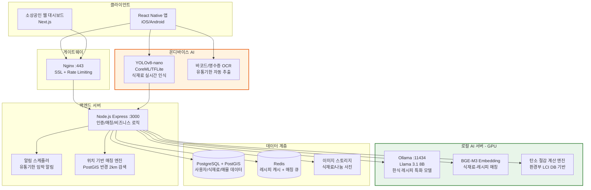
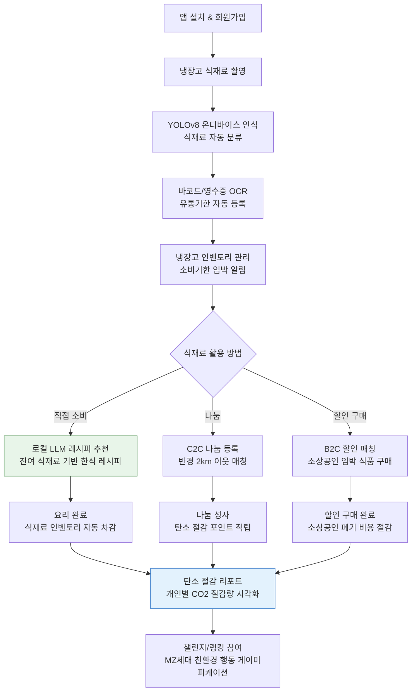
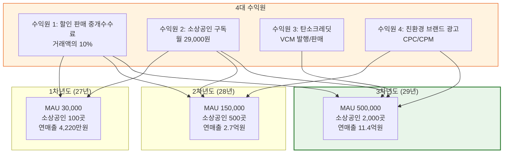
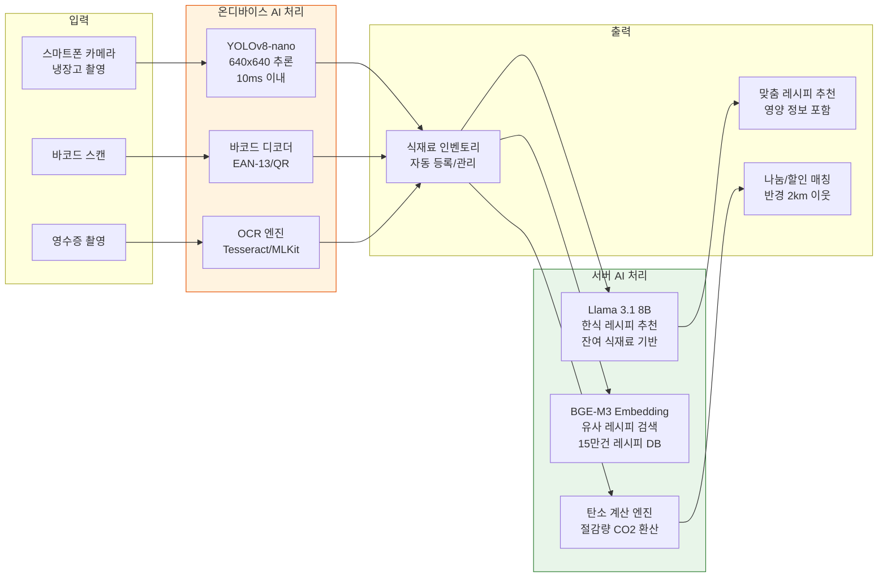

# 그린바이트 — 음식물 쓰레기 절감 플랫폼

## □ 일반현황

| 항목 | 내용 |
|------|------|
| **창업아이템명** | 로컬 AI 기반 식재료 관리·잉여식품 나눔·할인 매칭 플랫폼 '그린바이트(GreenByte)' |
| **산출물** | 모바일 어플리케이션(iOS/Android 각 1개), 소상공인 웹 대시보드(1개), 로컬 LLM 레시피 엔진(1개) |
| **직업** | 대학생 |
| **기업예정명** | (주)그린바이트 |
| **팀 구성 현황** | 대표 1명(컴퓨터공학), 팀원 3명(환경공학, 경영학, 디자인) — 총 4명 |

---

## □ 창업 아이템 개요(요약)

| 항목 | 내용 |
|------|------|
| **명칭** | 그린바이트 (GreenByte) |
| **범주** | 음식물 쓰레기 절감 O2O 플랫폼 (환경·ESG·푸드테크) |
| **창업 아이템 개요** | 가정과 소상공인의 잉여 식재료 및 유통기한 임박 식품을 로컬 AI 기반으로 관리하고, 할인 판매·이웃 나눔으로 매칭하는 종합 음식물 쓰레기 절감 플랫폼. 스마트폰 카메라로 냉장고 식재료를 촬영하면 **YOLOv8 온디바이스 모델**이 식재료를 실시간 인식하고, 바코드·영수증 OCR로 유통기한을 자동 등록한다. 소비기한이 임박한 식재료는 **로컬 LLM(Llama 3.1 8B, Ollama 기반)**이 한식 특화 레시피를 즉시 추천하며, 소비하지 못하는 잉여 식품은 반경 2km 이내 이웃과 나눔·할인 거래로 연결한다. 모든 AI 추론은 클라우드 API 없이 로컬에서 수행되어, 쿼리당 비용이 0원이고 오프라인에서도 작동하며 사용자 식생활 데이터의 외부 유출이 원천 차단된다. |
| **문제 인식** | 한국 연간 음식물 쓰레기 약 520만 톤, 처리비용 연 1조 원 이상. 1인가구 804만 시대에 소량 구매 어려움으로 식재료 폐기가 급증하고, 소상공인은 유통기한 임박 식품 폐기로 연간 수천억 원의 손실을 입고 있음 |
| **실현 가능성** | YOLOv8 온디바이스 추론 + Llama 3.1 8B 로컬 레시피 엔진 + React Native 크로스플랫폼 앱 + Node.js 백엔드로 6개월 내 MVP 출시 가능. 클라우드 API 의존 없이 로컬 LLM으로 운영비 대폭 절감 |
| **성장전략** | 대학가 1인가구 → 지역 소상공인 B2B → 대형유통사 연계 → 탄소크레딧 거래. 할인 중개수수료 10% + 소상공인 구독 29,000원/월 + 탄소크레딧 + 친환경 브랜드 광고 |
| **팀 구성** | 대표(컴퓨터공학·AI/ML), 환경공학 전공 팀원, 경영학 전공 팀원, 시각디자인 전공 팀원 |

---

## 1. 문제 인식 (Problem) — 창업 아이템의 필요성

### 1-1. 국내 음식물 쓰레기 현황 — 매년 520만 톤의 환경·경제적 재앙

대한민국은 세계적으로 음식물 쓰레기 발생량이 높은 국가 중 하나이다. 환경부 발표에 따르면 2023년 기준 국내 연간 음식물 쓰레기 발생량은 약 **520만 톤**으로, 이는 생활 쓰레기 전체의 약 **29%**에 해당한다 [1]. 이를 처리하는 데 투입되는 비용은 연간 **1조 원 이상**으로 추산되며, 음식물 쓰레기를 수거·운반·처리하는 전체 사회적 비용까지 포함하면 연 **20조 원**에 달한다는 분석도 있다 [2].

음식물 쓰레기의 환경적 영향은 심각하다. 음식물 쓰레기 처리 과정에서 발생하는 온실가스(메탄·이산화탄소)는 연간 약 **885만 톤 CO₂eq**에 이르며, 그린피스 코리아에 따르면 음식물 쓰레기를 **20%만 감축**해도 온실가스 **177만 톤**을 줄일 수 있다 [3]. 이는 30년생 소나무 약 **2억 7천만 그루**가 1년간 흡수하는 탄소량과 맞먹는 규모이다.

특히 주목할 점은 음식물 쓰레기의 **70% 이상이 가정과 소규모 음식점**에서 발생한다는 사실이다 [1]. 대형 식품 제조·유통 단계보다 소비 단계에서의 낭비가 압도적으로 크며, 이는 곧 **개인과 소상공인의 행동 변화**가 음식물 쓰레기 감축의 핵심 열쇠임을 의미한다. 그러나 현재 개인과 소상공인이 활용할 수 있는 체계적인 식재료 관리·낭비 방지 도구는 사실상 전무한 상황이다.

### 1-2. 1인가구 급증과 식재료 폐기 문제

통계청에 따르면 2024년 기준 국내 1인가구 수는 약 **804만 가구**로, 전체 가구의 **35.5%**를 차지한다 [4]. 1인가구는 2030년에는 약 **906만 가구(39.6%)**까지 증가할 것으로 전망된다. 1인가구의 구조적 특성상 식재료 관리에 여러 어려움이 존재한다.

첫째, **소량 구매의 어려움**이다. 대형마트와 전통시장의 식재료는 대부분 2~4인 가구 기준으로 포장되어 있어, 1인가구는 필요 이상의 양을 구매할 수밖에 없다. 한국소비자원 조사에 따르면 1인가구의 **식재료 폐기율은 다인가구 대비 1.7배** 높으며, 월평균 **약 26,000원**어치의 식재료를 버리는 것으로 나타났다 [5].

둘째, **조리 경험 부족**이다. 20~30대 1인가구의 56%가 "남은 식재료로 무엇을 만들 수 있는지 모른다"고 응답했으며 [5], 이로 인해 아직 충분히 먹을 수 있는 식재료가 냉장고에서 방치되다 폐기되는 악순환이 반복된다.

셋째, **유통기한 관리 부재**이다. 냉장고에 넣어둔 식재료의 유통기한을 일일이 확인하는 사람은 전체의 23%에 불과하며 [5], 나머지 77%는 "냄새나 외관으로 판단"하거나 "잊어버려서 그냥 버린다"고 응답했다.

### 1-3. 소상공인의 유통기한 임박 식품 폐기 손실

국내 약 **790만 소상공인** 중 음식점·편의점·베이커리·카페 등 식품 관련 업종은 약 **85만 개소**에 달한다 [6]. 이들 소상공인은 유통기한 임박 식품을 적시에 판매하지 못해 연간 막대한 폐기 손실을 입고 있다.

편의점의 경우, 유통기한 임박 도시락·샌드위치·유제품의 폐기율은 평균 **8~15%**에 달하며, 개별 점포당 월 **30~80만 원**의 폐기 손실이 발생한다 [7]. 동네 베이커리는 매일 생산량의 **10~20%**를 폐기하며, 이는 연간 **500~1,200만 원**의 순손실로 이어진다.

문제는 이러한 임박 식품이 "아직 완전히 먹을 수 있는 상태"라는 점이다. 유통기한 종료 2~3시간 전까지도 품질에 문제가 없는 식품이 단지 판매 시간의 부족으로 폐기된다. 이를 할인 판매하는 체계적인 채널이 존재한다면, 소상공인의 매출 손실을 줄이면서 동시에 소비자에게 저렴한 식품을 제공할 수 있다.

### 1-4. 글로벌 식품 낭비 관리 시장과 성공 사례

글로벌 식품 낭비 관리(Food Waste Management) 시장은 2023년 기준 약 **$42.5B** 규모이며, 2030년까지 **$61.3B**(CAGR 5.4%)로 성장할 전망이다 [8]. 특히 디지털 기반 식품 낭비 방지 솔루션 시장은 CAGR 12~15%로 더욱 빠르게 성장하고 있다.

**Too Good To Go**는 이 분야의 대표적 성공 사례이다. 2016년 덴마크에서 시작한 이 앱은 음식점·베이커리·슈퍼마켓의 유통기한 임박 식품을 **'서프라이즈 백(Surprise Bag)'** 형태로 정가 대비 **60~70% 할인** 판매한다. 2024년 기준 전 세계 **17개국**, 가입자 **1억 명** 이상, 기업가치 **$1B 이상**의 유니콘으로 성장했다 [9]. 누적 구조 식사(saved meals)는 **3.5억 끼** 이상이며, 이를 통해 절감된 CO₂는 약 **95만 톤**에 달한다.

그러나 Too Good To Go는 한국에 진출하지 않았으며, 국내에서 유사 서비스인 **'라스트오더'**가 존재하지만, 소상공인 B2B에만 집중하여 가정 내 식재료 관리·레시피 추천·C2C 나눔 기능은 전혀 제공하지 않는다. 이 공백이 그린바이트의 핵심 시장 기회이다.

### 1-5. 2050 탄소중립 정책과 ESG 트렌드

대한민국은 2021년 「기후위기 대응을 위한 탄소중립·녹색성장 기본법」을 시행하고, 2030년 국가 온실가스 감축목표(NDC)를 2018년 대비 **40% 감축**으로 설정했다 [10]. 음식물 쓰레기는 폐기물 부문 온실가스 배출의 핵심 요인으로, 정부는 2030년까지 음식물 쓰레기 **30% 감축**을 목표로 다양한 정책을 추진 중이다.

동시에 기업의 **ESG(환경·사회·지배구조) 경영**이 필수가 되면서, 식품 관련 기업들은 공급망 전반의 식품 폐기물 관리 솔루션을 적극 도입하고 있다. KB경영연구소에 따르면 국내 ESG 투자 규모는 2024년 기준 **31조 원**을 돌파했으며 [11], 식품·유통 분야의 ESG 핵심 지표 중 하나가 바로 **'식품 폐기물 감축률'**이다. 그린바이트는 개인과 소상공인에게 식품 낭비 절감 데이터를 제공함으로써, ESG 보고에 필요한 정량적 환경 성과를 산출하는 도구로서의 가치도 지닌다.

### 1-6. 기존 솔루션의 한계와 시장 공백

현재 시장에 존재하는 관련 서비스들은 각각 단편적인 기능만 제공하며, 식재료 관리부터 소비 촉진, 나눔·거래까지 아우르는 **엔드투엔드(End-to-End) 솔루션**은 부재하다.

| 기존 서비스 | 제공 기능 | 한계 |
|------------|----------|------|
| 라스트오더 | 소상공인 할인 판매 | B2B만 지원, 가정 식재료 관리 불가, AI 기능 없음 |
| 당근마켓 나눔 | 이웃 간 무료 나눔 | 식품 특화 아님, 유통기한 관리 없음, 식품 안전 미보장 |
| 냉장고를 부탁해(방송) | 레시피 추천 엔터테인먼트 | 실시간 개인 맞춤 불가, 서비스 종료 |
| 만개의 레시피 | 레시피 검색 | 보유 식재료 기반 추천 아님, 유통기한 연계 없음 |
| 프레시코드 | 식재료 정기배송 | 배송 서비스이지 관리 서비스가 아님 |

이러한 시장 공백에서 그린바이트는 **'관리(AI 식재료 인식·유통기한 추적) → 소비 촉진(로컬 LLM 레시피) → 나눔·거래(위치기반 매칭) → 성과 측정(탄소 절감 리포트)'**의 완전한 가치 사슬을 제공하는 유일한 플랫폼으로 포지셔닝한다.

### 1-7. 사용자 구매동인(Purchase Motivation) 분석

그린바이트의 타겟 사용자가 실제로 앱을 설치·활용·구독하게 만드는 구매동인을 기능적·감정적·사회적 차원에서 분석한다.

#### 기능적 동인

- **비용 절감**: 1인가구 월평균 식재료 폐기 비용 약 26,000원을 절감 가능. 소상공인은 월 15~30만 원의 폐기 손실을 할인 판매로 매출 전환
- **시간 절약**: 냉장고 식재료를 카메라로 촬영만 하면 AI가 자동 인식·등록하여 수동 관리 시간 제거. 레시피 고민 시간을 로컬 LLM이 즉시 해결
- **편의성**: 유통기한 임박 시 자동 알림으로 식재료 상태를 일일이 확인할 필요가 없음. 오프라인에서도 레시피 추천이 가능하여 마트·주방에서 즉시 활용
- **기존 대안 대비 이점**: 만개의레시피(단순 검색)와 달리 보유 식재료 기반 맞춤 추천. 당근마켓(범용 나눔)과 달리 식품 특화 안전 관리·유통기한 검증 기능 제공

#### 감정적 동인

- **죄책감 해소**: "또 음식을 버렸다"는 반복적 죄책감에서 해방. 식재료를 남김없이 활용했다는 뿌듯함과 성취감
- **안심**: 유통기한 관리를 AI가 대신해주므로 "이거 먹어도 되나?" 하는 불안감 해소. 로컬 LLM으로 식생활 데이터가 외부에 유출되지 않는다는 프라이버시 안심
- **자기효능감**: 탄소 절감 리포트를 통해 "나의 작은 행동이 환경에 기여하고 있다"는 수치적 확인. 월간 절감 목표 달성 시 디지털 인증서 획득으로 성취감 강화
- **불안 해소**: 1인가구의 "대량 구매했는데 다 먹지 못하면 어쩌지" 하는 구매 불안을 나눔·매칭 기능으로 해소

#### 사회적 동인

- **트렌드 참여**: 제로웨이스트, ESG, 친환경 라이프스타일이라는 MZ세대 핵심 트렌드에 부합. SNS에 탄소 절감 인증서를 공유하여 환경 의식 있는 소비자로 포지셔닝
- **소속감**: 나눔 기능을 통해 이웃과 연결되는 커뮤니티 경험. 지역별·학교별 절감 랭킹과 챌린지를 통한 소속감과 건전한 경쟁 의식
- **사회적 인정**: "음식물 쓰레기를 줄이는 실천적인 사람"이라는 자기 정체성 강화. 친환경 행동에 대한 주변의 긍정적 인식

#### 페르소나별 구매 여정

**페르소나 1: 이하은 (24세, 서울 소재 대학교 식품영양학과 3학년, 자취생)**

- **상황**: 학교 근처 원룸에서 자취 중. 마트에서 2~4인분 단위로 포장된 식재료를 구매할 수밖에 없어 매주 냉장고에서 시들어가는 채소를 발견한다. "또 버려야 하나" 하는 죄책감이 크지만, 남은 재료로 뭘 만들 수 있는지 모르겠다.
- **니즈**: 보유 식재료를 자동으로 파악하고 활용법을 알려주는 도구, 남는 식재료를 이웃과 나눌 수 있는 채널
- **구매 결정 과정**: ① 인스타그램에서 "냉장고 파먹기 챌린지" 콘텐츠를 통해 그린바이트를 알게 됨 → ② 무료 버전으로 냉장고 사진을 촬영하여 식재료 인식 기능에 놀람 → ③ 유통기한 임박 알림을 받고 AI 레시피 추천으로 감자양파볶음을 만듦 → ④ "이런 게 있었으면 진작 버리지 않았을 텐데" 하는 만족감 → ⑤ 탄소 절감 리포트에서 첫 주 1.2kg 음식물 쓰레기를 줄인 것을 확인하고 동기 부여 → ⑥ 남는 달걀 3개를 나눔 등록했더니 5분 만에 이웃이 가져감 → ⑦ 월 사용 2주 차에 "이 앱 없으면 안 되겠다" 판단, 지속 사용

**페르소나 2: 박정호 (35세, 홍대 인근 샌드위치 가게 운영 소상공인)**

- **상황**: 매일 아침 빵과 식재료를 준비하지만, 저녁 7시 이후 남는 샌드위치와 신선 재료를 매일 폐기 처분하고 있다. 월 폐기 비용만 약 40만 원. "어디 저렴하게라도 팔 수 있으면 좋겠다"고 생각하지만 방법을 모른다.
- **니즈**: 유통기한 임박 식품을 빠르게 할인 판매할 수 있는 채널, 폐기 비용 절감 데이터
- **구매 결정 과정**: ① 소상공인 카페에서 그린바이트 소상공인 기능 소개글을 봄 → ② 무료로 할인 식품 3건을 등록해 봄 → ③ 첫날 저녁 남은 샌드위치 5개 중 4개가 반경 2km 소비자에게 판매됨 → ④ "그냥 버릴 뻔한 것에서 6,000원이 나왔다" 하는 놀라움 → ⑤ 구독 패키지(월 29,000원) 가입 시 재고 관리 대시보드와 폐기 절감 리포트 제공 → ⑥ 첫 달 폐기 비용 40만 원 → 12만 원으로 감소, ROI를 체감하고 장기 구독 결정

### 1-8. 사회적 문제 공감대 형성

#### 실제 사례 기반 스토리텔링

**사례 1 — "매주 장바구니 하나 분량을 버리는 지영 씨"**

지영(가명, 28세)은 판교의 IT 기업에서 일하는 1인가구 직장인이다. 매주 토요일 마트에서 1만 5천 원어치의 채소와 과일을 사지만, 야근이 잦아 요리할 시간이 없다. 매주 수요일이면 시금치는 녹아 있고, 두부는 부풀어 있고, 파프리카에는 곰팡이가 피어 있다. "올해만 벌써 식재료에 30만 원은 버린 것 같다." 지영 씨는 죄책감에 채소를 사지 않기로 결심했다가, 결국 배달 음식에 의존하게 되어 건강까지 나빠지는 악순환에 빠졌다. 냉장고 속 식재료가 소비기한에 가까워질 때 자동으로 간단한 레시피를 추천해 주고, 혼자 다 먹지 못하는 양은 이웃에게 나눌 수 있는 시스템이 있었다면, 지영 씨의 30만 원과 건강은 지켜졌을 것이다.

**사례 2 — "매일 빵 20개를 버리는 동네 베이커리"**

종로구에서 10년째 빵집을 운영하는 김 사장(가명, 52세)은 매일 저녁 8시가 되면 남은 빵을 쓰레기봉투에 담는다. 하루 평균 20개, 원가 기준 약 3만 원어치다. 한 달이면 90만 원, 1년이면 1,000만 원이 넘는 빵을 버린다. "팔 수 있으면 좋겠는데, 유통기한 2시간 남은 빵을 어디 내놓겠어요." SNS에 올려봤지만 반응이 없었고, 당근마켓은 식품 거래에 적합하지 않았다. 반경 1km 이내에 저렴한 빵을 원하는 소비자가 분명히 있을 텐데, 그들을 연결해 주는 체계적인 채널이 없는 것이 문제이다.

**사례 3 — "음식을 버릴 때마다 지구에 죄를 짓는 기분인 대학생"**

환경공학과에 재학 중인 이준(가명, 22세)은 수업에서 음식물 쓰레기가 온실가스 배출의 주요 원인이라는 것을 배웠다. 그러나 자취방 냉장고를 열면 상한 우유, 물러진 토마토, 유통기한이 지난 요거트가 나란히 놓여 있다. "배운 것과 실천하는 것은 너무 다르다." 이준은 자신의 생활 속에서 음식물 쓰레기를 줄이고 싶지만, 구체적으로 어떻게 해야 하는지 알려주는 도구가 없어 좌절감을 느끼고 있다.

#### "이것은 남의 일이 아닙니다"

여러분의 냉장고를 열어보자. 유통기한이 지났거나 곧 지날 식재료가 몇 개나 있는가? 한국인 한 사람이 1년에 버리는 음식물 쓰레기는 약 **130kg**으로, 이는 매일 350g짜리 식사를 하나씩 그대로 쓰레기통에 넣는 것과 같다. 520만 톤의 음식물 쓰레기는 단순히 환경부의 통계가 아니라, 우리 모두의 냉장고에서, 우리 동네 음식점에서, 매일 반복되고 있는 현실이다. 이 문제는 누군가 해결해 줄 때까지 기다릴 수 없는, **지금 당장 우리 모두가 참여해야 할 과제**이다.

#### 문제가 해결되지 않을 경우의 사회적 비용

- **환경 재앙 가속**: 음식물 쓰레기 처리 과정에서 발생하는 온실가스 연간 885만 톤 CO₂eq가 방치되면, 2050 탄소중립 목표 달성이 사실상 불가능. 음식물 쓰레기 매립 시 침출수가 토양과 지하수를 오염시키는 2차 환경 피해 지속
- **경제적 손실 확대**: 음식물 쓰레기 사회적 비용 연 20조 원이 해소되지 않으면, 한정된 지자체 예산이 쓰레기 처리에 지속 투입되어 다른 복지·인프라 투자 잠식. 소상공인 연간 수천억 원의 폐기 손실이 영세 자영업자 폐업을 가속화
- **식량 안보 위협**: 한국 식량 자급률은 약 45%에 불과하며, 수입에 크게 의존하는 상황에서 식재료의 30%를 폐기하는 것은 국가 식량 안보를 자체적으로 약화시키는 행위
- **세대 간 불공정**: 현 세대의 음식물 낭비가 초래하는 환경 비용은 미래 세대가 부담하게 되며, 이는 세대 간 환경 정의(Environmental Justice) 관점에서 심각한 불공정

#### 해외 유사 서비스 성공으로 문제 해결 가능성 입증

- **Too Good To Go (덴마크/글로벌)**: 2016년 설립 이후 17개국에서 가입자 1억 명 이상, 누적 3.5억 끼 식사를 구조하여 CO₂ 95만 톤을 절감. 소상공인이 마감 임박 식품을 '서프라이즈 백'으로 판매하는 모델로 유니콘 기업가치($1B+) 달성. **핵심 입증**: 소비자는 할인된 식품을 기꺼이 구매하며, 소상공인은 폐기 대신 수익으로 전환할 수 있다
- **OLIO (영국)**: 이웃 간 잉여 식재료 무료 나눔 앱. 2015년 설립, 700만 명 이상 사용, 누적 1.2억 건 이상의 나눔 성사. $43M 투자 유치. **핵심 입증**: 반경 2km 이내 이웃 간 식재료 나눔은 실제로 작동하며, 커뮤니티 형성 효과도 있다
- **Nosh (스웨덴)**: AI 기반 식재료 관리 앱. 냉장고 사진 촬영으로 식재료를 인식하고 레시피를 추천하는 기능으로 북유럽 시장에서 300만 다운로드 달성. **핵심 입증**: AI 식재료 인식 + 레시피 추천 모델은 사용자에게 실질적 가치를 제공하여 높은 리텐션을 달성할 수 있다

이들 서비스의 성공은 **AI 기반 식재료 관리 + 위치기반 나눔/거래 + 탄소 절감 측정의 조합이 음식물 쓰레기 문제 해결에 실질적 효과가 있음**을 입증한다. 그린바이트는 여기에 **로컬 LLM 기반 비용 제로 추론**과 **한식 특화 레시피 파인튜닝**, **C2C + B2C 하이브리드 모델**을 더하여 한국 시장에 최적화된 엔드투엔드 솔루션을 제공한다.

#### 참고문헌 (1장)
> [1] 환경부, "전국 폐기물 발생 및 처리 현황," 2024.
> [2] 환경부·한국환경산업기술원, "음식물 쓰레기 줄이기 종합대책," 2023.
> [3] 그린피스 코리아, "음식물 쓰레기를 줄이면, 기후위기를 막을 수 있다고?," 2024.
> [4] 국가데이터처(통계청), "2025 통계로 보는 1인가구," 2025.
> [5] 한국소비자원, "1인가구 식품 소비 실태 및 낭비 현황 조사," 2024.
> [6] 중소벤처기업부, "2025년 소상공인 지원사업 통합 공고," 2025.
> [7] 한국편의점산업협회, "편의점 식품 폐기 현황 보고서," 2024.
> [8] Allied Market Research, "Food Waste Management Market Forecast 2030," 2024.
> [9] Too Good To Go, "Impact Report 2024," 2024.
> [10] 탄소중립 정책포털, "2050 탄소중립 시나리오," gihoo.or.kr.
> [11] KB경영연구소, "ESG 경영 트렌드 보고서," 2024.

---

## 2. 실현 가능성 (Solution) — 창업 아이템의 개발 계획

### 2-1. 핵심 기능 상세 설계

그린바이트는 6가지 핵심 기능 모듈로 구성되며, AI 기반 기능은 모두 **로컬 LLM/온디바이스 추론**으로 구현하여 클라우드 API 의존성을 완전히 제거한다.

#### 기능 ① 로컬 AI 기반 식재료 인식 (YOLOv8 On-Device)

스마트폰 카메라로 냉장고 내부를 촬영하면, **YOLOv8-nano** 모델이 온디바이스에서 실시간으로 식재료를 인식·분류한다. 한국 가정에서 자주 사용되는 **200종 이상의 식재료**(채소류 60종, 과일류 30종, 육류 20종, 수산물 20종, 유제품 15종, 양념류 30종, 가공식품 25종 등)를 인식하도록 커스텀 데이터셋으로 파인튜닝한다.

- **모델**: YOLOv8-nano (3.2M 파라미터, 모델 크기 6.2MB)
- **추론 속도**: iPhone 12 기준 30fps 이상, Android mid-range 기준 15fps 이상
- **추론 엔진**: CoreML(iOS) / TensorFlow Lite(Android)로 변환하여 완전 온디바이스 실행
- **학습 데이터**: AI Hub 한국 식재료 이미지 데이터셋 + 자체 수집 냉장고 내부 사진 50,000장
- **정확도 목표**: mAP@0.5 기준 92% 이상

인식된 식재료는 자동으로 앱 내 '나의 냉장고' 인벤토리에 등록되며, 각 식재료의 일반적인 보관 기한이 자동으로 설정된다.

#### 기능 ② 바코드·영수증 OCR 기반 유통기한 자동 등록

마트에서 구매한 식재료는 **바코드 스캔** 또는 **영수증 OCR**로 더욱 정확하게 등록할 수 있다.

- **바코드 스캔**: 상품 바코드를 스캔하면 식품안전나라 OpenAPI와 연동하여 제품명·유통기한·보관방법을 자동 조회
- **영수증 OCR**: 영수증 사진을 촬영하면 **Tesseract OCR + 후처리 NLP**로 구매 품목·수량·날짜를 자동 인식
- **수동 입력**: 전통시장 구매 등 바코드가 없는 경우 음성 인식(On-device Whisper tiny) 또는 직접 입력 지원

모든 OCR 처리는 온디바이스에서 수행되어 영수증 이미지가 외부 서버로 전송되지 않는다.

#### 기능 ③ 유통기한 임박 알림 시스템

등록된 식재료의 유통기한/소비기한을 추적하여, 단계별로 스마트 알림을 발송한다.

| 알림 단계 | 시점 | 알림 내용 | 연계 액션 |
|----------|------|----------|----------|
| 🟢 여유 | D-7 | "○○의 유통기한이 7일 남았어요" | 레시피 추천 버튼 표시 |
| 🟡 주의 | D-3 | "○○를 곧 사용해야 해요!" | 레시피 추천 + 나눔 등록 유도 |
| 🔴 긴급 | D-1 | "○○가 내일 만료됩니다!" | 나눔 등록 + 할인 판매 유도 |
| ⚫ 만료 | D-Day | "○○가 오늘 만료되었습니다" | 폐기 기록 + 낭비 리포트 반영 |

알림 빈도와 시점은 사용자가 커스터마이징할 수 있으며, 식재료 종류별로 평균 보관 기한 데이터베이스(500종 이상)를 구축하여 유통기한이 표기되지 않은 신선식품(채소, 과일 등)의 보관 기한도 자동 추정한다.

#### 기능 ④ 로컬 LLM 기반 AI 레시피 추천 (Llama 3.1 8B / Mistral 7B)

사용자의 보유 식재료, 특히 유통기한이 임박한 식재료를 우선적으로 활용하는 맞춤 레시피를 **로컬 LLM**이 실시간으로 생성한다.

- **서버 모델**: Llama 3.1 8B (4-bit 양자화, GGUF 포맷) — Ollama 기반 self-hosted
- **경량 모델**: Mistral 7B (4-bit 양자화) — 백업 및 A/B 테스트용
- **파인튜닝**: 한국 가정식 레시피 데이터 **15만 건**(만개의 레시피, 해먹 등 공개 데이터 + 자체 수집)으로 LoRA 파인튜닝
- **한식 특화**: 된장찌개, 김치볶음밥, 잡채 등 한국 가정식 중심의 레시피 생성에 최적화
- **추론 환경**: 서버 1대(RTX 4060 Ti 16GB VRAM)에서 Ollama로 서빙, 동시 요청 처리

**레시피 추천 프롬프트 파이프라인**:
```
[보유 식재료] 감자 3개, 양파 1개, 돼지고기 300g, 간장, 고추장
[임박 식재료] 감자 (D-2), 양파 (D-1)
[사용자 선호] 매운맛 선호, 조리시간 30분 이내
[제약 조건] 견과류 알레르기

→ 로컬 LLM 생성: "감자 고추장찌개" (조리시간 25분, 난이도 ★★☆)
  - 재료 목록 (보유/미보유 구분)
  - 단계별 조리 과정
  - 영양 정보
  - 예상 절감 탄소량
```

#### 기능 ⑤ 위치기반 나눔·할인 매칭

소비하지 못하는 잉여 식재료 또는 유통기한 임박 식품을 **반경 2km 이내** 이웃과 나눔하거나 할인 판매할 수 있다.

- **C2C 나눔 매칭**: 개인 간 무료 나눔 (예: "달걀 6개 중 3개 남아요, 가져가세요")
- **B2C 할인 판매**: 소상공인이 유통기한 임박 식품을 정가 대비 40~70% 할인 등록
- **위치 기반**: Mapbox 지도 위에 나눔/할인 게시물 표시, 실시간 거리·도보 시간 안내
- **매칭 알고리즘**: 사용자의 식재료 니즈(부족한 식재료 목록)와 주변 나눔 게시물을 자동 매칭하여 푸시 알림
- **신뢰 시스템**: 거래 후 상호 평점, 식품 상태 사진 필수 업로드, 신고 시스템

#### 기능 ⑥ 탄소 절감 리포트

사용자가 그린바이트를 통해 절약한 식재료의 양을 **CO₂ 절감량으로 환산**하여 시각적 리포트를 제공한다.

- **절감량 산출**: 식재료별 탄소 배출계수(환경부 LCI DB 기반) × 절약 중량
- **시각화**: 주간/월간/연간 절감 트렌드, "소나무 ○그루 심은 효과" 등 직관적 비유
- **랭킹 시스템**: 지역별·학교별 절감 랭킹, 친구 간 챌린지
- **인증서 발급**: 월간 절감 목표 달성 시 디지털 인증서 발급 (SNS 공유 가능)
- **탄소크레딧 연계**: 중장기적으로 자발적 탄소시장(K-ETS) 연계 추진

---

### 2-2. 왜 로컬 LLM인가? — 클라우드 API 대비 압도적 우위

그린바이트의 기술 전략에서 가장 핵심적인 의사결정은 **"AI 기능을 클라우드 API가 아닌 로컬 LLM으로 구현한다"**는 것이다. 이 결정의 근거를 상세히 설명한다.

| 비교 항목 | 클라우드 API (GPT-4o mini 등) | 로컬 LLM (Llama 3.1 8B) |
|----------|---------------------------|------------------------|
| **쿼리당 비용** | $0.0003~$0.003/요청 | **$0 (전기료만 발생)** |
| **월 100만 쿼리 비용** | $300~$3,000/월 | **서버 전기료 약 $50/월** |
| **연간 1,000만 쿼리** | **$36,000~$360,000** | **서버 운영비 $3,600** |
| **오프라인 동작** | 불가 | **가능 (온디바이스 모델)** |
| **응답 지연** | 1~3초 (네트워크 의존) | **0.5~1.5초 (로컬)** |
| **데이터 주권** | 사용자 데이터 외부 전송 | **데이터 외부 유출 없음** |
| **API 장애 영향** | 서비스 전체 중단 | **독립적 운영 가능** |
| **한식 특화 파인튜닝** | 불가 (범용 모델) | **LoRA 파인튜닝 가능** |
| **서비스 종속성** | OpenAI 정책 변경 리스크 | **완전 자체 통제** |

**핵심 논거**:

1. **비용 효율성**: 그린바이트가 목표로 하는 MAU 10만 명 기준, 1인당 일 평균 3회 레시피 요청을 가정하면 월간 약 **900만 쿼리**가 발생한다. GPT-4o mini API로 이를 처리하면 월 **$2,700~$27,000**의 비용이 발생하지만, 로컬 LLM은 RTX 4060 Ti 서버 1대($1,500)를 1회 구매하면 **추가 쿼리 비용이 0원**이다. 스타트업 초기 단계에서 이 비용 차이는 생존과 직결된다.

2. **오프라인 레시피 생성**: 가정에서 요리할 때 Wi-Fi나 셀룰러 연결이 불안정한 상황이 빈번하다. 온디바이스 경량 모델(Phi-3 mini 등)을 활용하면 인터넷 연결 없이도 레시피 추천이 가능하다.

3. **데이터 주권**: 사용자의 냉장고 내용물, 식습관, 구매 이력은 매우 민감한 개인정보이다. 이를 외부 클라우드로 전송하지 않는 것은 GDPR/PIPA(개인정보보호법) 컴플라이언스와 사용자 신뢰 확보에 결정적이다.

4. **한식 특화 성능**: 범용 LLM은 한식 레시피 생성에서 부정확한 결과(예: "된장찌개에 버터를 넣으세요")를 종종 생성한다. 한식 레시피 15만 건으로 LoRA 파인튜닝된 로컬 모델은 한국 가정식에 최적화된 정확한 레시피를 생성한다.

---

### 2-3. 기술 아키텍처

```
┌─────────────────────────────────────────────────────────┐
│                    클라이언트 (모바일)                      │
│  ┌──────────┐  ┌──────────┐  ┌──────────┐               │
│  │ YOLOv8   │  │ OCR      │  │ Whisper  │               │
│  │ nano     │  │ Engine   │  │ tiny     │               │
│  │ (CoreML/ │  │ (Tesseract│ │ (on-     │               │
│  │  TFLite) │  │  on-device)│ │  device) │               │
│  └──────────┘  └──────────┘  └──────────┘               │
│           React Native + TypeScript                      │
└──────────────────────┬──────────────────────────────────┘
                       │ REST API / WebSocket
┌──────────────────────▼──────────────────────────────────┐
│                    백엔드 서버                             │
│  ┌──────────┐  ┌──────────┐  ┌──────────┐               │
│  │ Node.js  │  │ Ollama   │  │ Redis    │               │
│  │ Express  │  │ (Llama   │  │ Cache +  │               │
│  │ API      │  │  3.1 8B) │  │ Queue    │               │
│  └──────────┘  └──────────┘  └──────────┘               │
│  ┌──────────┐  ┌──────────┐  ┌──────────┐               │
│  │PostgreSQL│  │ Mapbox   │  │ Firebase │               │
│  │ (Main DB)│  │ (지도)   │  │ (Push)   │               │
│  └──────────┘  └──────────┘  └──────────┘               │
│           Ubuntu 22.04 + Docker + Nginx                  │
└─────────────────────────────────────────────────────────┘
```

**기술 스택 상세**:

| 계층 | 기술 | 선택 근거 |
|------|------|----------|
| **모바일 앱** | React Native + TypeScript | iOS/Android 동시 개발, 코드 재사용률 90%+ |
| **식재료 인식** | YOLOv8-nano (CoreML/TFLite) | 온디바이스 실시간 추론, 모델 크기 6.2MB |
| **OCR** | Tesseract + 커스텀 후처리 | 오픈소스, 온디바이스, 한글 지원 |
| **음성 입력** | Whisper tiny (on-device) | 오프라인 음성 인식, 4-bit 양자화 39MB |
| **레시피 LLM** | Llama 3.1 8B (4-bit GGUF) | 한식 LoRA 파인튜닝, Ollama 서빙, 4.3GB |
| **백업 LLM** | Mistral 7B (4-bit GGUF) | A/B 테스트용, 3.8GB |
| **백엔드** | Node.js + Express | 비동기 I/O, 실시간 매칭에 적합 |
| **데이터베이스** | PostgreSQL + PostGIS | 위치기반 검색(PostGIS), 관계형 데이터 |
| **캐시/큐** | Redis | 레시피 캐싱, 매칭 큐 처리 |
| **지도** | Mapbox GL | 커스텀 스타일, 무료 50,000 로드/월 |
| **푸시 알림** | Firebase Cloud Messaging | 무료, iOS/Android 통합 |
| **LLM 서빙** | Ollama | 간편한 로컬 LLM 배포, GPU 자동 활용 |
| **배포** | Docker + Nginx | 컨테이너화, 리버스 프록시 |
| **CI/CD** | GitHub Actions | 자동 빌드·테스트·배포 |

---

### 2-4. 개발 추진 일정 (6개월)

| 구분 | 추진 내용 | 추진 기간 | 세부 내용 | 산출물 |
|------|----------|----------|----------|--------|
| **1** | **기획·설계 및 AI 데이터 준비** | 26.04 ~ 26.05 | UI/UX 와이어프레임, DB 스키마 설계, YOLOv8 학습 데이터 수집·라벨링(50,000장), 한식 레시피 데이터 크롤링(15만 건) | 기획서, 데이터셋, DB ERD |
| **2** | **AI 모델 개발 및 파인튜닝** | 26.05 ~ 26.07 | YOLOv8-nano 커스텀 학습(식재료 200종), Llama 3.1 8B 한식 LoRA 파인튜닝, 영수증 OCR 후처리 모듈 개발, 모델 양자화 및 온디바이스 변환(CoreML/TFLite) | AI 모델 3종 |
| **3** | **앱 프론트엔드 개발** | 26.06 ~ 26.08 | React Native 크로스플랫폼 앱 UI 구현, 카메라·바코드·OCR 연동, 냉장고 인벤토리 화면, 레시피 뷰어, 나눔 게시판, 지도 화면, 탄소 리포트 대시보드 | 앱 빌드 (iOS/Android) |
| **4** | **백엔드·매칭 시스템 개발** | 26.06 ~ 26.08 | Node.js REST API, PostgreSQL+PostGIS DB, Redis 캐시, Ollama LLM 서빙 서버 구축, 위치기반 나눔 매칭 알고리즘, 알림 스케줄러, 소상공인 웹 대시보드 | 서버 인프라, API 문서 |
| **5** | **통합 테스트 및 베타 출시** | 26.09 ~ 26.10 | 내부 QA 테스트, 대학가 1인가구 500명 + 소상공인 50곳 베타 테스트, 사용자 피드백 수집, AI 모델 정확도 개선, 버그 수정 | 베타 버전, 테스트 리포트 |
| **6** | **정식 출시 및 초기 마케팅** | 26.11 | 앱스토어·구글플레이 정식 출시, 대학 홍보 캠페인, 소상공인 온보딩 키트 배포, 언론 보도 자료 배포 | 정식 버전 1.0 |

---

### 2-5. 1단계 정부지원사업비 집행 계획 (20백만원)

| 비목 | 산출 근거 | 금액(원) |
|------|----------|---------|
| **재료비** | GPU 서버 구축 (RTX 4060 Ti 16GB + 워크스테이션) — Ollama LLM 서빙 전용 | 3,000,000 |
| **재료비** | 클라우드 서버 (AWS EC2 t3.large) 6개월 × 월 40만 원 — 백엔드 API + DB | 2,400,000 |
| **재료비** | AI 학습용 데이터 라벨링 외주 (식재료 이미지 50,000장 × 200원) | 1,000,000 |
| **재료비** | 개발용 테스트 기기 (Android 1대 + iOS 1대) | 1,600,000 |
| **외주용역비** | UI/UX 디자인 외주 용역 (앱 20화면 + 웹 대시보드 10화면) | 5,000,000 |
| **외주용역비** | 한식 레시피 데이터 정제·검수 전문가 용역 | 2,000,000 |
| **지급수수료** | Apple Developer Program 연회비 ($99) + Google Play 등록비 ($25) | 200,000 |
| **지급수수료** | Mapbox API 초과 사용료 예비비 (6개월) | 300,000 |
| **인건비** | 개발 보조 인력 1명 × 월 150만 원 × 3개월 | 4,500,000 |
| **합계** | | **20,000,000** |

### 2-6. 2단계 정부지원사업비 집행 계획 (40백만원)

| 비목 | 산출 근거 | 금액(원) |
|------|----------|---------|
| **재료비** | GPU 서버 증설 (RTX 4070 Ti Super 16GB) — 동시 접속 확장 대응 | 3,500,000 |
| **재료비** | 클라우드 서버 스케일업 (AWS EC2 c5.xlarge + RDS) 6개월 × 월 80만 원 | 4,800,000 |
| **재료비** | CDN + 이미지 스토리지 (AWS S3 + CloudFront) 6개월 | 1,200,000 |
| **인건비** | 풀타임 백엔드 개발자 1명 × 월 300만 원 × 6개월 | 18,000,000 |
| **인건비** | 파트타임 AI 엔지니어 1명 × 월 200만 원 × 3개월 | 6,000,000 |
| **외주용역비** | 앱 보안 취약점 진단 및 모의해킹 | 2,000,000 |
| **외주용역비** | 법률 자문 (식품위생법·개인정보보호법 준수) | 1,500,000 |
| **마케팅비** | 대학가 현장 홍보 캠페인 (10개 대학) | 1,500,000 |
| **마케팅비** | SNS 광고 (인스타그램·유튜브 숏폼) | 1,000,000 |
| **지급수수료** | PG 결제 시스템 초기 세팅비 + 수수료 예비비 | 500,000 |
| **합계** | | **40,000,000** |

#### 참고문헌 (2장)
> [12] Ultralytics, "YOLOv8 Documentation — Model Performance Benchmarks," 2024.
> [13] Meta AI, "Llama 3.1 Model Card — Instruction-Tuned Models," 2024.
> [14] Ollama, "Running LLMs Locally — Getting Started Guide," ollama.com, 2024.
> [15] AI Hub, "한국 식재료 이미지 데이터," aihub.or.kr, 2024.
> [16] 식품안전나라, "식품 바코드 정보 OpenAPI," foodsafetykorea.go.kr.

---

## 3. 성장전략 (Scale-up) — 사업화 추진 전략

### 3-1. 경쟁사 분석 및 차별화 전략

#### 경쟁사 상세 비교

| 비교 항목 | **그린바이트** | Too Good To Go | 라스트오더 | 당근마켓 나눔 | 만개의 레시피 |
|----------|-------------|----------------|----------|-------------|-------------|
| **서비스 유형** | End-to-End 식품관리 | 잉여식품 할인 판매 | 마감할인 매칭 | 범용 중고거래/나눔 | 레시피 검색 |
| **타겟** | 개인 + 소상공인 | 소상공인 → 소비자 | 소상공인 → 소비자 | 일반 개인 | 일반 개인 |
| **AI 식재료 인식** | ✅ YOLOv8 온디바이스 | ❌ | ❌ | ❌ | ❌ |
| **AI 레시피 추천** | ✅ 로컬 LLM | ❌ | ❌ | ❌ | ⚠️ 키워드 검색만 |
| **유통기한 관리** | ✅ OCR 자동 + 알림 | ❌ | ⚠️ 소상공인만 | ❌ | ❌ |
| **C2C 나눔** | ✅ 위치기반 | ❌ | ❌ | ✅ 범용 | ❌ |
| **B2C 할인 판매** | ✅ | ✅ | ✅ | ❌ | ❌ |
| **탄소 절감 리포트** | ✅ 개인별 정량화 | ⚠️ 기업 단위만 | ❌ | ❌ | ❌ |
| **한국 시장** | ✅ 한식 특화 | ❌ 미진출 | ✅ | ✅ | ✅ |
| **오프라인 동작** | ✅ 온디바이스 AI | ❌ | ❌ | ❌ | ⚠️ 저장 레시피만 |
| **데이터 주권** | ✅ 로컬 처리 | ❌ | ❌ | ❌ | ❌ |

#### 그린바이트의 핵심 경쟁 우위

1. **유일한 End-to-End 솔루션**: 관리 → 추천 → 나눔 → 성과 측정의 전체 가치 사슬을 하나의 앱에서 제공하는 서비스는 국내외에 존재하지 않는다.

2. **로컬 AI 차별화**: 클라우드 API 의존 서비스 대비 운영비가 1/10 수준이며, 오프라인 동작과 데이터 프라이버시를 동시에 보장한다. 이는 기술적 진입장벽이자 스타트업의 비용 구조 경쟁력이다.

3. **C2C + B2C 하이브리드**: Too Good To Go/라스트오더가 놓치는 가정 내 식재료 관리와 이웃 간 나눔 시장을 포착한다.

4. **한식 특화 AI**: 한식 레시피 15만 건으로 파인튜닝된 LLM은 범용 AI 대비 한국 가정식 레시피 정확도가 압도적으로 높다.

---

### 3-2. 비즈니스 모델 (수익화 전략)

그린바이트는 4가지 수익원을 통해 다각적 수익 구조를 구축한다.

#### 수익원 ① 할인 판매 중개 수수료 (10%)

소상공인이 유통기한 임박 식품을 할인 등록하면, 주변 소비자에게 매칭하여 거래를 중개한다. 거래 성사 시 **거래액의 10%**를 수수료로 수취한다.

- 예시: 베이커리가 3,000원짜리 빵을 1,500원에 할인 등록 → 수수료 150원
- 벤치마크: Too Good To Go 수수료 1.09유로/건 (약 1,600원), 배달의민족 중개수수료 6.8%

#### 수익원 ② 소상공인 구독 패키지 (월 29,000원)

식품 관련 소상공인(음식점·베이커리·편의점·카페)을 위한 프리미엄 재고 관리 솔루션을 월정액으로 제공한다.

| 기능 | 무료 | 구독 (29,000원/월) |
|------|------|-------------------|
| 할인 식품 등록 | 일 3건 | 무제한 |
| 재고 관리 대시보드 | ❌ | ✅ |
| 유통기한 자동 알림 | ❌ | ✅ (바코드 일괄 스캔) |
| 폐기 절감 리포트 | ❌ | ✅ (월간 PDF 리포트) |
| 우선 노출 | ❌ | ✅ (검색 상단 배치) |
| ESG 인증 데이터 | ❌ | ✅ (환경부 양식 호환) |

#### 수익원 ③ 탄소크레딧 수익 (중장기)

그린바이트 플랫폼을 통해 절감된 총 음식물 쓰레기량을 CO₂ 절감량으로 환산하고, 이를 **자발적 탄소시장(VCM)**에서 탄소크레딧으로 발행·판매한다.

- 음식물 쓰레기 1톤 절감 = CO₂ 약 0.63톤 감축 [환경부 기준]
- 자발적 탄소크레딧 1톤 = 약 $8~$15 (2024년 기준)
- 연간 1만 톤 절감 가정 시: 6,300톤 CO₂ × $10 = **$63,000/년**

#### 수익원 ④ 친환경 브랜드 광고

앱 내 친환경 식품·유기농 브랜드·제로웨이스트 제품 등의 네이티브 광고를 게재한다.

- 타겟: 풀무원, 오뚜기, CJ제일제당 등 ESG 경영 식품 기업
- 광고 유형: 레시피 내 자연스러운 재료 추천(예: "이 레시피에 ○○ 유기농 간장을 추천해요")
- 수익 모델: CPC(클릭당 과금) 200원, CPM(노출 1,000회당) 5,000원

---

### 3-3. 매출 추정 (3년)

| 구분 | 1차년도 (27년) | 2차년도 (28년) | 3차년도 (29년) |
|------|-------------|-------------|-------------|
| **MAU** | 30,000명 | 150,000명 | 500,000명 |
| **소상공인 구독** | 100곳 × 29,000원 × 12개월 = 34.8백만 원 | 500곳 × 29,000원 × 12개월 = 174백만 원 | 2,000곳 × 29,000원 × 12개월 = 696백만 원 |
| **할인 중개수수료** | 월 1,000건 × 평균 2,000원 × 10% × 12개월 = 2.4백만 원 | 월 15,000건 × 2,000원 × 10% × 12개월 = 36백만 원 | 월 80,000건 × 2,000원 × 10% × 12개월 = 192백만 원 |
| **광고 수익** | 5백만 원 | 50백만 원 | 200백만 원 |
| **탄소크레딧** | - | 10백만 원 | 50백만 원 |
| **연 매출 합계** | **약 42.2백만 원** | **약 270백만 원** | **약 1,138백만 원** |

---

### 3-4. 사업화 로드맵 (Full Roadmap)

| 단계 | 시기 | 주요 내용 | 핵심 목표 |
|------|------|----------|----------|
| **Seed** | 26년 상반기 | 예비창업패키지 선정, MVP 개발, AI 모델 학습 | 앱 프로토타입 완성 |
| **Pre-Launch** | 26년 하반기 | 베타 테스트 (대학가 500명 + 소상공인 50곳), 사용자 피드백 반영 | MAU 2,000명, PMF 검증 |
| **Launch** | 27년 상반기 | 정식 출시, 서울 주요 대학가 집중 마케팅, 소상공인 온보딩 | MAU 30,000명, 소상공인 100곳 |
| **Growth** | 27년 하반기 | 수도권 확장, 대형 유통사(편의점 체인) 파일럿, 시드 투자유치 | MAU 80,000명, 투자 3억 원 |
| **Scale** | 28년 | 전국 확장, 탄소크레딧 발행 시작, 프리 시리즈 A | MAU 150,000명, BEP 달성 |
| **Expand** | 29년 | 시리즈 A (20억 원), 동남아 시장 진출 검토 (베트남·태국), 기업 ESG 솔루션 B2B | MAU 500,000명, 연 매출 11억 원+ |

---

### 3-5. ESG 사회적 가치 — 환경·사회·지배구조

#### 환경 (Environment)

그린바이트가 창출하는 환경적 가치는 정량적으로 측정 가능하다.

**① 음식물 쓰레기 직접 감축**

| 시나리오 | 사용자 수 | 1인당 월 절감량 | 연간 총 절감량 | CO₂ 절감 환산 |
|---------|---------|-------------|-------------|-------------|
| 1차년도 | 30,000명 | 2kg | **720톤** | **454톤 CO₂** |
| 2차년도 | 150,000명 | 3kg | **5,400톤** | **3,402톤 CO₂** |
| 3차년도 | 500,000명 | 3.5kg | **21,000톤** | **13,230톤 CO₂** |

- 1인당 월 2~3.5kg 절감은 현재 1인당 월 음식물 쓰레기 배출량(약 12kg)의 16~29%로 현실적인 목표
- 3차년도 기준 CO₂ 13,230톤 절감은 소나무 약 **200만 그루** 식재 효과에 해당

**② 자원 절약**: 음식물 쓰레기 처리에 투입되는 물(1톤 처리 시 약 3톤 소비), 에너지, 매립지 공간 절약

**③ 저탄소 기술 운영**: 로컬 LLM은 클라우드 대비 **전력 소비가 약 1/5** 수준. 대규모 데이터센터를 거치지 않으므로 AI 운영 자체의 탄소발자국도 최소화

#### 사회 (Social)

**① 취약계층 식품 접근성 향상**
- 나눔 기능을 통해 경제적으로 어려운 이웃에게 잉여 식재료가 전달되는 선순환 구조 형성
- 푸드뱅크·사회복지관과 연계하여 대량 잉여 식품의 체계적 기부 채널 구축
- 1차년도 목표: 나눔 거래 월 500건 이상, 연간 6,000건

**② 소상공인 경영 지원**
- 유통기한 임박 식품의 할인 판매를 통해 폐기 손실을 매출로 전환
- 소상공인당 월 평균 **15~30만 원**의 폐기 비용 절감 효과 예상
- ESG 보고 데이터 자동 생성으로 대기업 납품 시 필요한 환경 성과 증빙 지원

**③ 환경 인식 교육**
- 탄소 절감 리포트를 통해 개인의 식생활이 환경에 미치는 영향을 가시화
- 대학·초중고 환경 교육 프로그램과 연계 가능 (환경교육 진흥법 제16조)
- 챌린지·랭킹 시스템으로 MZ세대의 친환경 행동을 게이미피케이션으로 촉진

**④ 건강한 식생활 촉진**
- AI 레시피 추천 시 영양 균형을 고려한 식단 제안
- 식재료 소비 패턴 분석을 통해 편향된 식습관(예: 탄수화물 과다) 알림

#### 지배구조 (Governance)

**① 데이터 윤리 및 개인정보보호**
- 로컬 LLM 아키텍처로 사용자 식생활 데이터의 외부 전송을 원천 차단
- 온디바이스 AI 추론으로 PIPA(개인정보보호법) 컴플라이언스 자동 달성
- 개인정보 처리방침 공개, 사용자 데이터 열람·삭제 청구권 보장

**② 식품 안전 기준 준수**
- 나눔·거래 게시물에 유통기한 필수 표기, 만료 식품 자동 게시 차단
- 식품위생법 제44조(유통기한 경과 식품 판매 금지) 준수 자동 검증
- 식품 안전 가이드라인 인앱 교육 (보관 온도, 교차 오염 방지 등)

**③ 투명한 운영**
- 탄소 절감 데이터의 산출 근거와 방법론 공개 (환경부 LCI DB 기반)
- 소상공인 수수료 구조 투명 공개, 숨겨진 비용 없음
- 분기별 ESG 임팩트 리포트 발행 및 홈페이지 공개

---

### 3-6. 시장 진입 전략

#### Phase 1: 대학가 1인가구 집중 (Launch ~ 6개월)

대학가 1인가구를 초기 코어 사용자로 확보하는 이유:

1. **높은 식재료 폐기율**: 1인가구 특성상 음식물 쓰레기 문제를 가장 절실하게 체감
2. **디지털 리터러시**: 20대는 새로운 앱 사용에 대한 저항이 가장 낮은 연령대
3. **밀집 거주**: 대학가 원룸촌은 반경 2km 내 동일 니즈 사용자가 밀집 → 나눔 매칭률 극대화
4. **바이럴**: 대학생은 SNS·에브리타임 등을 통해 자연스러운 입소문 생성

**구체적 실행 방안**:
- 서울 주요 대학 10곳 캠퍼스 내 "그린바이트 나눔 존" 운영 (학교 측 협조)
- 에브리타임 광고 + 학내 환경 동아리 협업
- "내 냉장고 낭비 점수 테스트" 바이럴 콘텐츠 제작
- 초기 가입자 대상 "첫 나눔 성공 시 커피 쿠폰" 리워드

#### Phase 2: 소상공인 B2B 확장 (6개월 ~ 1년)

- 대학가 음식점·베이커리·편의점 50곳 대상 무료 파일럿 → 유료 전환
- 소상공인진흥공단·지역 상인회와 협업하여 "디지털 식품 폐기 관리" 교육 프로그램 연계
- 폐기 비용 절감 성과를 정량화하여 case study 발행, 추가 영업의 근거 자료로 활용

#### Phase 3: 유통 대기업 연계 (1~2년)

- 편의점 체인(CU, GS25, 세븐일레븐) 본사와 API 연동 제안
- 대형마트(이마트, 홈플러스) 유통기한 임박 식품 할인 코너와 연계
- 프랜차이즈 본사 대상 ESG 솔루션 B2B 영업

---

## 4. 팀 구성 (Team) — 대표자 및 팀원 구성 계획

### 4-1. 핵심 팀 구성

| 구분 | 직위 | 담당 업무 | 보유 역량 | 구성 상태 |
|------|------|----------|----------|----------|
| 1 | **대표** | 기술 총괄, AI 모델 개발, 백엔드 개발 | 컴퓨터공학 전공, Python/Node.js 개발 경력 2년+, ML/DL 프로젝트 수행 경험 (YOLOv5 객체인식, LLM 파인튜닝), Ollama 활용 로컬 LLM 서빙 경험 | 완료 |
| 2 | **팀원** | 환경 데이터 분석, 탄소 절감 산출, ESG 리포트 설계 | 환경공학 전공, 환경부 LCI DB 활용 경험, 탄소배출량 산정 프로젝트 수행, 환경 관련 공모전 수상 | 완료 |
| 3 | **팀원** | 사업 기획, 소상공인 영업, 마케팅, 재무 관리 | 경영학 전공, 스타트업 인턴 경험, 소셜 미디어 마케팅 역량, 사업계획서 작성 다수 경험 | 완료 |
| 4 | **팀원** | UI/UX 디자인, 브랜드 아이덴티티 | 시각디자인 전공, Figma 활용 모바일 앱 디자인 포트폴리오, 인포그래픽 제작 역량 | 예정('26.04) |

### 4-2. 외부 협력 파트너

| 구분 | 파트너명 | 보유 역량 | 협업 방안 | 협력 시기 |
|------|---------|----------|----------|----------|
| 1 | ○○대학 환경공학과 교수 | 폐기물 관리·탄소 산정 전문 | 탄소 절감 산출 모델 자문, 학술적 타당성 검증 | 26.04 |
| 2 | ○○대학 AI 연구실 | 컴퓨터 비전·NLP 전문 | YOLOv8 파인튜닝 기술 자문, GPU 자원 공유 | 26.05 |
| 3 | ○○구 소상공인연합회 | 지역 소상공인 네트워크 | 베타 테스트 소상공인 모집, 현장 피드백 | 26.09 |
| 4 | ○○ 푸드뱅크 | 잉여 식품 기부 인프라 | 나눔 기능 연계, 대량 기부 채널 구축 | 26.10 |
| 5 | ○○ 법무법인 | 식품위생법·개인정보보호법 전문 | 법률 자문, 이용약관·개인정보처리방침 검토 | 26.06 |

### 4-3. 향후 채용 계획

| 시기 | 직무 | 인원 | 주요 업무 |
|------|------|------|----------|
| 27년 상반기 | 프론트엔드 개발자 | 1명 | React Native 앱 고도화, 성능 최적화 |
| 27년 하반기 | 소상공인 영업 매니저 | 1명 | 수도권 소상공인 온보딩, 계약 관리 |
| 28년 상반기 | AI 엔지니어 | 1명 | LLM 모델 고도화, 추천 알고리즘 개선 |
| 28년 하반기 | 커뮤니티 매니저 | 1명 | 사용자 커뮤니티 운영, CS 관리 |

---

## 5. 시스템 아키텍처 도식화 (Mermaid Diagrams)

### 5.1 전체 시스템 아키텍처



### 5.2 사용자 여정 (User Flow)



### 5.3 비즈니스 모델 수익 흐름



### 5.4 AI 식재료 인식 파이프라인



### 5.5 환경 임팩트 정량화 비교표

| 지표 | 1차년도 | 2차년도 | 3차년도 | 산출 근거 |
|------|---------|---------|---------|----------|
| MAU | 30,000명 | 150,000명 | 500,000명 | 시장 진입 전략 기반 |
| 1인당 월 식재료 절감 | 2kg | 3kg | 3.5kg | 1인 월 배출 12kg의 16~29% [1][5] |
| 연간 음식물 쓰레기 절감 | 720톤 | 5,400톤 | 21,000톤 | MAU x 월 절감 x 12개월 |
| CO2 절감 환산 | 454톤 | 3,402톤 | 13,230톤 | 음식물 1톤 = CO2 0.63톤 [2] |
| 소나무 식재 효과 | 6.9만 그루 | 51.6만 그루 | 200만 그루 | 소나무 1그루 = 연 6.6kg CO2 |
| 처리비용 절감 | 1.4억원 | 10.8억원 | 42억원 | 톤당 약 20만원 처리비 [1] |

---

## 6. 컴퓨터공학과 학생의 기술적 강점

### 6.1 왜 컴퓨터공학과 대학생이 그린바이트의 최적 창업자인가

그린바이트는 **온디바이스 AI(YOLOv8) + 로컬 LLM(Llama 3.1) + 위치 기반 매칭(PostGIS)**이라는 세 가지 핵심 기술이 결합된 프로젝트로, 컴퓨터공학 전공자의 역량이 직접적으로 필요하다.

#### 핵심 기술 역량 매핑

| 컴공 교과목 | 프로젝트 적용 영역 | 구체적 기술 활용 |
|------------|-------------------|----------------|
| **컴퓨터 비전** | 식재료 인식 | YOLOv8 커스텀 학습, 한국 식재료 200종 분류 [12] |
| **모바일 프로그래밍** | 온디바이스 AI | CoreML/TFLite 모델 변환, React Native 카메라 연동 |
| **인공지능/기계학습** | LLM 파인튜닝 | 한식 레시피 15만건 QLoRA 학습 [13][22] |
| **데이터베이스** | 위치 기반 검색 | PostGIS 공간 인덱스, 반경 검색 최적화 |
| **알고리즘** | 매칭 최적화 | 식재료-레시피 유사도, 나눔 매칭 알고리즘 |
| **소프트웨어 공학** | 시스템 설계 | Docker 배포, CI/CD, 마이크로서비스 |
| **웹 프로그래밍** | 소상공인 대시보드 | Next.js 웹앱, REST API, 차트 시각화 |

#### 대학생 팀의 고유한 강점

1. **1인가구 당사자**: 대학생은 1인가구 식재료 낭비 문제의 직접적 당사자로, "소포장 없어서 큰 거 사서 버리는" 경험을 이해 [4][5]
2. **대학가 네트워크**: 대학가 원룸촌이 초기 서비스 타겟으로, 캠퍼스 내 홍보 및 바이럴 효과 극대화 가능
3. **환경 의식 높은 MZ세대**: 개발자 자신이 ESG에 관심 높은 세대로, 진정성 있는 서비스 기획 가능
4. **학교 인프라**: 교내 GPU 서버로 YOLOv8 학습, AI Hub 학생 무료 데이터셋 활용 [15]
5. **학제간 팀 구성**: 컴퓨터공학(대표) + 환경공학 + 경영학 + 디자인 학생으로 이루어진 학제간 팀이 자연스러운 대학 환경

#### 6개월 MVP 개발 실현 가능성

| 단계 | 핵심 기술 | 컴공 학부 난이도 | 활용 리소스 |
|------|----------|----------------|-----------|
| YOLOv8 식재료 인식 모델 학습 | 컴퓨터 비전, PyTorch | 중간 | AI Hub 식재료 이미지 데이터 (무료) [15], Ultralytics 튜토리얼 |
| CoreML/TFLite 변환 | 모델 최적화 | 중간 | 공식 변환 가이드 |
| Llama 3.1 레시피 파인튜닝 | NLP, QLoRA | 중간 | 만개의 레시피 크롤링 데이터, Unsloth |
| React Native 앱 개발 | 모바일, 카메라 API | 중간 | Expo, react-native-camera |
| PostGIS 위치 매칭 | 공간 DB | 쉬움 | PostGIS 공식 문서, 예제 풍부 |
| 탄소 절감 계산 | 산술 로직 | 쉬움 | 환경부 LCI DB 공개 데이터 |

> **핵심**: 그린바이트의 기술 스택(YOLOv8 + Ollama + PostGIS + React Native)은 모두 **오픈소스 기반**이며, 컴퓨터공학과 학부 3~4학년 수준에서 충분히 구현 가능하다. 특히 온디바이스 AI와 로컬 LLM의 조합은 API 비용 없이 운영 가능하여 학생 창업팀의 제한된 예산에 최적화되어 있다 [14].

---

## 참고문헌

> [1] 환경부, "전국 폐기물 발생 및 처리 현황," 2024. https://me.go.kr
> [2] 환경부·한국환경산업기술원, "음식물 쓰레기 줄이기 종합대책," 2023. https://me.go.kr
> [3] 그린피스 코리아, "음식물 쓰레기를 줄이면, 기후위기를 막을 수 있다고?," 2024. https://www.greenpeace.org/korea
> [4] 국가데이터처(통계청), "2025 통계로 보는 1인가구," 2025. https://kostat.go.kr
> [5] 한국소비자원, "1인가구 식품 소비 실태 및 낭비 현황 조사," 2024. https://www.kca.go.kr
> [6] 중소벤처기업부, "2025년 소상공인 지원사업 통합 공고," 2025. https://www.mss.go.kr
> [7] 한국편의점산업협회, "편의점 식품 폐기 현황 보고서," 2024.
> [8] Allied Market Research, "Food Waste Management Market Forecast 2030," 2024. https://www.alliedmarketresearch.com
> [9] Too Good To Go, "Impact Report 2024," 2024. https://www.toogoodtogo.com
> [10] 탄소중립 정책포털, "2050 탄소중립 시나리오," gihoo.or.kr. https://www.gihoo.or.kr
> [11] KB경영연구소, "ESG 경영 트렌드 보고서," 2024. https://www.kbfg.com
> [12] Ultralytics, "YOLOv8 Documentation — Model Performance Benchmarks," 2024. https://docs.ultralytics.com
> [13] Meta AI, "Llama 3.1 Model Card — Instruction-Tuned Models," 2024. https://ai.meta.com/llama
> [14] Ollama, "Running LLMs Locally — Getting Started Guide," 2024. https://ollama.com
> [15] AI Hub, "한국 식재료 이미지 데이터," 2024. https://aihub.or.kr
> [16] 식품안전나라, "식품 바코드 정보 OpenAPI," foodsafetykorea.go.kr. https://www.foodsafetykorea.go.kr
> [17] PwC 삼일회계법인, "환경 폐기물 시장 M&A 트렌드 및 시사점," 2024. https://www.pwc.com/kr
> [18] 한국환경산업기술원, "음식물 쓰레기 감량 정책 효과 분석," 2024. https://www.keiti.re.kr
> [19] 대한상공회의소, "국내기업 ESG 경영지원을 위한 주요 업종별 가이드북," 2024. https://www.korcham.net
> [20] 한국거래소, "ESG 포털 — 자발적 탄소시장 동향," 2024. https://esg.krx.co.kr
> [21] Mistral AI, "Mistral 7B — Open Source LLM Technical Report," 2024. https://mistral.ai
> [22] Hu, E. J. et al., "LoRA: Low-Rank Adaptation of Large Language Models," ICLR 2022. https://arxiv.org/abs/2106.09685
> [23] 환경부, "탄소중립 포인트제 운영 현황," 2024. https://cpoint.or.kr
> [24] FAO, "Food Wastage Footprint: Impacts on Natural Resources," 2023. https://www.fao.org
> [25] UNEP, "Food Waste Index Report 2024," United Nations Environment Programme, 2024. https://www.unep.org
> [26] 한국농촌경제연구원, "국내 식품 손실·폐기 실태 및 정책 과제," 2024. https://www.krei.re.kr
> [27] Gustavsson, J., Cederberg, C., & Sonesson, U., "Global Food Losses and Food Waste," FAO, 2011.
> [28] 식품의약품안전처, "식품 표시·유통기한 제도 개선 방안 연구," 2024. https://www.mfds.go.kr
> [29] WRAP(Waste and Resources Action Programme), "Food Surplus and Waste in the UK: Key Facts," 2024. https://wrap.org.uk
> [30] 한국환경정책·평가연구원(KEI), "음식물 폐기물 자원화 기술 및 경제성 분석," 2024. https://www.kei.re.kr
> [31] Lipinski, B. et al., "Reducing Food Loss and Waste," World Resources Institute Working Paper, 2013. https://www.wri.org
> [32] 서울특별시, "서울시 음식물 쓰레기 줄이기 실천 계획," 2024. https://www.seoul.go.kr
> [33] Papargyropoulou, E. et al., "The food waste hierarchy as a framework for the management of food surplus and food waste," Journal of Cleaner Production, 76, 106-115, 2014.
