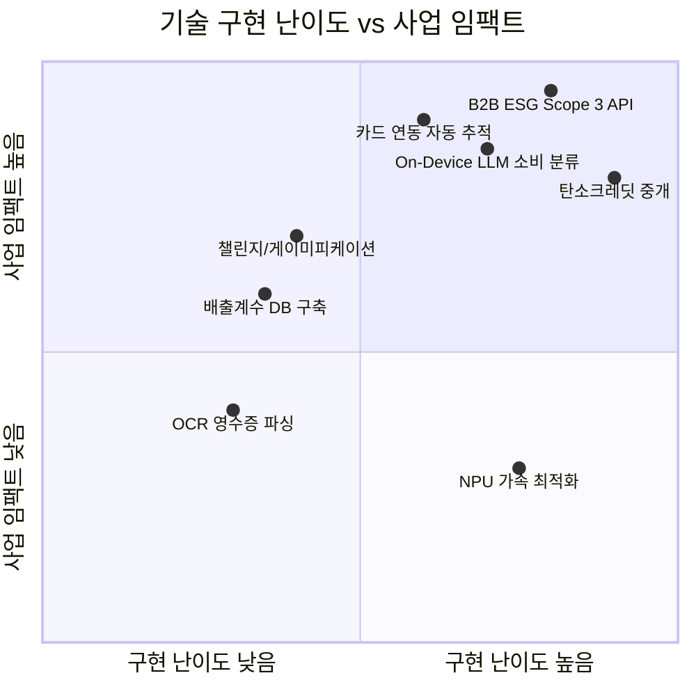
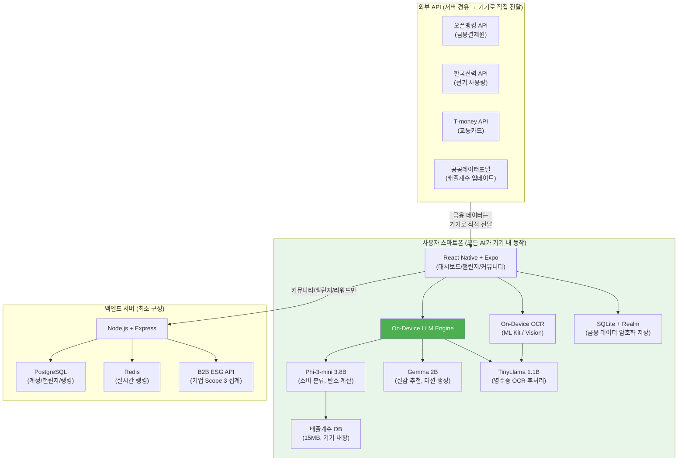
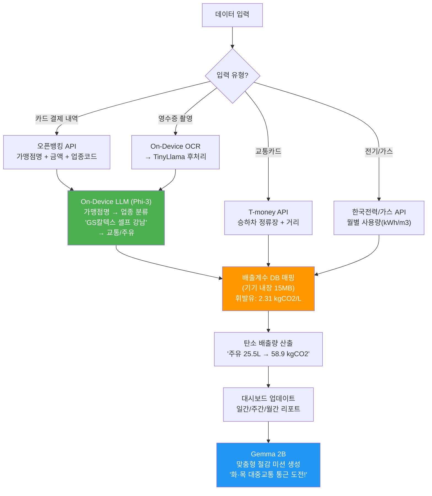
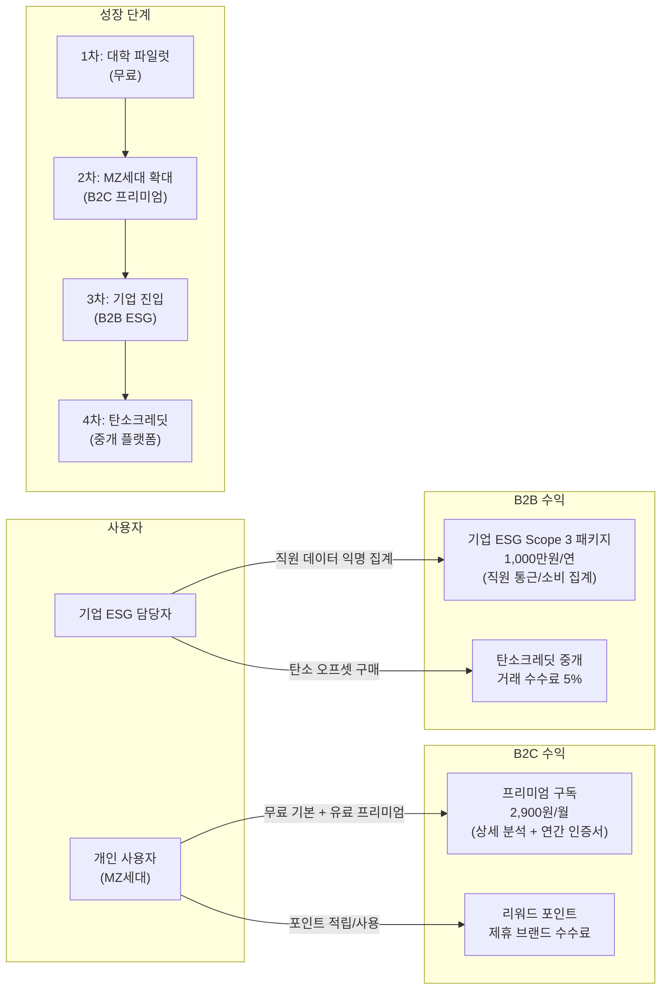

# 아이디어 9. 탄소다이어리 — 개인 탄소발자국 관리 앱

## 예비창업패키지 예비창업자 사업계획서

---

## 목차

1. [일반현황](#일반현황)
2. [창업 아이템 개요(요약)](#창업-아이템-개요요약)
3. [문제 인식 (Problem) — 창업 아이템의 필요성](#1-문제-인식-problem--창업-아이템의-필요성)
4. [실현 가능성 (Solution) — 창업 아이템의 개발 계획](#2-실현-가능성-solution--창업-아이템의-개발-계획)
5. [성장전략 (Scale-up) — 사업화 추진 전략](#3-성장전략-scale-up--사업화-추진-전략)
6. [팀 구성 (Team) — 대표자 및 팀원 구성 계획](#4-팀-구성-team--대표자-및-팀원-구성-계획)
7. [참고문헌](#참고문헌-종합)

---

## 일반현황

| 항목 | 내용 |
|------|------|
| **창업아이템명** | Local LLM 기반 개인 탄소발자국 자동 측정·관리 및 절감 리워드 플랫폼 '탄소다이어리' |
| **산출물** | 모바일 어플리케이션(1개), 웹 대시보드(1개), 기업용 ESG 리포팅 API(1개) |
| **직업** | 대학생 |

### 팀 구성 현황 (대표자 포함 전체)

| 순번 | 직위 | 담당 업무 | 보유 역량 (경력 및 학력 등) | 구성 상태 |
|------|------|----------|-------------------------|----------|
| 1 | 공동대표 | SW 개발 총괄 | OO학 학사, On-device AI 연구 경험, 오픈뱅킹 API 개발 경력(0년) | 완료 |
| 2 | 대리 | 홍보 및 마케팅 | OO학 학사, 환경 NGO 활동, ESG 관련 경력(00년 이상) | 예정('26.04) |

---

## 창업 아이템 개요(요약)

| 항목 | 내용 |
|------|------|
| **명칭** | 탄소다이어리 (CarbonDiary) |
| **범주** | Local LLM 기반 개인 탄소발자국 관리 플랫폼 |
| **창업 아이템 개요** | 카드 결제 내역, 교통카드, 전기·가스 사용량 등 개인 생활 데이터를 자동 연동하여 탄소 배출량을 실시간으로 측정하고, **디바이스 내장 Local LLM**이 소비 패턴을 분석하여 맞춤형 탄소 절감 미션을 제안하는 앱. 금융거래 데이터의 극도로 민감한 특성상 모든 AI 처리를 기기 내에서 수행하며(데이터가 절대 기기를 떠나지 않음), 챌린지·커뮤니티·리워드 시스템을 통해 탄소 절감을 게이미피케이션함 |
| **문제 인식** | 한국 2050 탄소중립 법제화에도 개인이 자신의 탄소 배출량을 파악할 수단이 전무. 환경부 탄소중립 포인트제 참여자 520만 명이나 실질적 배출량 추적 불가. EU CBAM 시행으로 기업 Scope 3 산정 시급 |
| **실현 가능성** | On-device LLM(Phi-3-mini, Gemma 2B 등), 오픈뱅킹 API, 한국환경공단 배출계수 DB 활용으로 6개월 내 MVP 출시 가능. 금융 데이터가 기기를 떠나지 않아 개인정보보호법 리스크 최소화 |
| **성장전략** | B2C 프리미엄 구독 2,900원/월 → B2B 기업 ESG Scope 3 패키지 1,000만 원/연 → 자발적 탄소크레딧 중개. 1차년도 대학 파일럿 → 2차년도 MZ세대 전국 확대 → 3차년도 기업 ESG 시장 진입 |
| **팀 구성** | 대표(컴퓨터공학, On-device AI 전문), 환경공학 전공 팀원, 경영학/ESG 전공 팀원 |

---

## 1. 문제 인식 (Problem) — 창업 아이템의 필요성

### 1.1 글로벌 탄소관리 소프트웨어 시장 현황

- **글로벌 탄소관리 소프트웨어 시장**: 2025년 약 $16B → 2030년 약 $44B (CAGR 22.4%) [1]
- **글로벌 자발적 탄소시장(VCM)**: 2024년 거래규모 $2B → 2030년 $50B 전망 [2]
- **아시아태평양 탄소관리 시장**: 가장 빠른 성장률(CAGR 25%+), 한국·일본·중국 주도 [1]
- **글로벌 ESG 투자 자산**: 2025년 $53조 → 전 세계 운용자산의 33% 차지 [3]
- **개인 탄소발자국 추적 앱 시장**: 2024년 $1.2B → 2030년 $5.8B (CAGR 25.6%) [4]

### 1.2 한국 탄소중립 정책 환경

- **2050 탄소중립 시나리오 법제화**: 「기후위기 대응을 위한 탄소중립·녹색성장 기본법」 2022년 3월 시행. 2030년 NDC 목표: 2018년 대비 40% 감축 [5]
- **탄소중립 포인트제 참여자**: 2024년 기준 520만 명 돌파, 전년 대비 30% 증가. 그러나 실질적 탄소 배출량 추적 기능 없이 단순 실천항목 인증 방식 [6]
- **제3차 녹색성장 5개년 계획(2024~2028)**: 개인 단위 탄소감축 참여 확대를 핵심 과제로 설정 [7]
- **탄소중립 녹색성장위원회**: 2025년 국민 참여형 탄소중립 실천 플랫폼 구축 계획 발표 [8]
- **환경부 탄소중립 실천포인트**: 2024년 예산 300억 원 배정, 참여 기업 120개사 [6]
- **한국 1인당 CO2 배출량**: 11.6톤/년(2023), OECD 평균(8.3톤) 대비 40% 높음 [9]

### 1.3 EU 탄소국경조정제도(CBAM)의 영향

- **EU CBAM 정식 시행**: 2026년 1월부터 본격 관세 부과 개시. 전환기간(2023.10~2025.12) 중 보고 의무 이행 중 [10]
- **한국 수출기업 영향**: 대EU 수출액 중 CBAM 대상 품목 약 $4.7B(2023), 철강·알루미늄·시멘트·비료·전력·수소 6개 부문 [10]
- **Scope 3 산정 필요성 급증**: CBAM 대응을 위해 공급망 전체(Scope 1·2·3)의 탄소배출 추적 필수. Scope 3는 기업 전체 배출의 평균 70~80% 차지 [11]
- **직원 통근·출장 배출량**: Scope 3 Category 7(직원 통근)에 해당, 개인 이동 데이터 필요 [11]

### 1.4 개인 탄소배출량 파악 수단의 부재

- **현재 상황**: 한국인 평균 1인당 연 11.6톤 CO2 배출이지만, 개인이 자신의 실제 배출량을 파악할 수 있는 도구가 사실상 전무 [9]
- **환경부 탄소발자국 계산기**: 웹 기반 단순 추정 도구. 수동 입력 방식으로 정확성 낮고 지속적 추적 불가 [12]
- **기존 가계부 앱**: 탄소 환산 기능 전무. 금전 지출은 추적하나 환경 비용은 무시
- **카드사·은행 앱**: 일부 '그린 리포트' 시도(신한카드 에코 등)하나, 단순 카테고리 매핑 수준으로 정확도 낮음
- **수동 입력의 한계**: 기존 탄소계산기는 월 1회 전기·가스 요금 수동 입력 → 탈락률 85% 이상 [13]

### 1.5 MZ세대 친환경 의식과 실천도구 간 격차

- **MZ세대 친환경 소비 의향**: Z세대 78%, 밀레니얼 73%가 "환경을 고려한 소비를 하겠다"고 응답 [14]
- **그린워싱 피로감**: 73%가 "기업의 친환경 주장을 신뢰하지 않는다" → 개인이 직접 검증할 수 있는 도구 필요 [14]
- **실천 도구 부재**: 친환경 의식은 높으나 "구체적으로 무엇을 얼마나 줄여야 하는지 모른다"가 68% [15]
- **게이미피케이션 니즈**: MZ세대 85%가 "챌린지·경쟁 요소가 있으면 지속적으로 참여하겠다" [15]
- **소셜미디어 공유 욕구**: 환경 실천 인증샷 SNS 게시 경험 57% (Z세대 기준) [14]

### 1.6 기업 ESG Scope 3 산정의 현실적 어려움

- **Scope 3 산정 의무화 흐름**: ISSB(국제지속가능성기준위원회) S2 기준 2025년 발효, Scope 3 공시 의무화 [16]
- **한국 ESG 공시 의무화**: 2026년 자산 2조 원 이상 기업 → 2030년 전 코스피 상장사 확대 예정 [17]
- **Scope 3 산정 난제**: Category 7(직원 통근), Category 6(출장), Category 1(구매)의 실제 데이터 수집이 가장 큰 병목 [11]
- **국내 기업 ESG 담당자 설문**: "Scope 3 산정이 가장 어렵다" 82%, "직원 통근 데이터 수집 불가" 67% [18]
- **솔루션 부재**: 기업 단위 탄소관리 SaaS(Persefoni, Watershed 등)는 존재하나, 직원 개인 데이터 수집 도구는 전무

### 1.7 해결하고자 하는 핵심 문제 요약

| 문제 | 현황 | 탄소다이어리의 해법 |
|------|------|----------------|
| 개인 배출량 파악 불가 | 수동 입력, 추정치 의존 | 카드·교통·에너지 자동 연동 + Local LLM 분류 |
| 절감 방법 모름 | 일반적 캠페인 수준 | Local LLM이 개인 소비 패턴 분석 → 맞춤 미션 |
| 지속 참여 어려움 | 탈락률 85%+ | 챌린지·커뮤니티·리워드 게이미피케이션 |
| 데이터 프라이버시 우려 | 금융 데이터 클라우드 전송 불안 | **모든 AI 처리가 기기 내에서 수행** → 데이터 기기 이탈 없음 |
| 기업 Scope 3 데이터 부재 | 직원 통근·소비 데이터 수집 불가 | B2B 연동으로 익명 집계 데이터 제공 |
| CBAM 대응 곤란 | 공급망 탄소 추적 인프라 미비 | 개인→기업→산업 단위 탄소 데이터 축적 |

### 1.8 사용자 구매동인(Purchase Motivation) 분석

탄소다이어리의 잠재 사용자가 서비스를 선택하게 되는 구매동인은 다음과 같이 다층적이다.

#### (1) 기능적 동인

- **시간 절약**: 카드 결제 내역 자동 연동으로 수동 입력 없이 탄소 배출량 추적. 기존 환경부 탄소계산기의 월 1회 수동 입력 대비 완전 자동화
- **비용 절감**: 소비 패턴 분석을 통한 불필요한 지출 발견 → 탄소 절감과 동시에 생활비 절약 효과 (사용자당 월 평균 3~5만 원 절약 추정)
- **편의성**: 하나의 앱에서 교통·식생활·에너지·쇼핑 전 영역의 탄소발자국을 통합 관리
- **기존 대안 대비 이점**: 해외 앱(Joro, Cogo)과 달리 한국 특화 배출계수 적용, Local LLM으로 금융 데이터가 기기 밖으로 나가지 않음

#### (2) 감정적 동인

- **불안 해소**: "내가 환경에 얼마나 해를 끼치고 있는지 모르겠다"는 막연한 불안을 수치화하여 해소
- **죄책감 해소**: 탄소 절감 미션 달성을 통해 "환경을 위해 무언가 하고 있다"는 심리적 안도감
- **자기효능감**: 월간·연간 탄소 절감량 리포트를 통해 "나의 노력이 실제로 차이를 만들고 있다"는 성취감
- **안심**: 금융 데이터가 기기 밖으로 전송되지 않는 Local LLM 아키텍처로 개인정보 유출 우려 해소

#### (3) 사회적 동인

- **사회적 인정**: 탄소 절감 인증서와 뱃지를 SNS에 공유하여 친환경 라이프스타일 과시
- **트렌드 참여**: ESG·탄소중립이라는 시대적 흐름에 능동적으로 참여하는 의미 부여
- **소속감**: 학교별·회사별 챌린지를 통한 소속 집단과의 연대감, 랭킹 경쟁을 통한 동기 부여

#### (4) 페르소나별 구매 여정

**페르소나 A: 이하늘 (27세, IT 기업 주니어 개발자, 서울 거주)**

이하늘은 환경 이슈에 관심이 많아 텀블러를 사용하고 분리수거를 철저히 하지만, "내가 실제로 탄소를 얼마나 줄이고 있는지"는 알 수 없었다. 인스타그램에서 친구가 공유한 탄소다이어리 월간 리포트를 보고 앱을 설치했다. 카드 연동 후 첫 주에 "이번 주 자가용 통근으로 32kg CO2 배출"이라는 알림을 받고 충격을 받았다. AI가 추천한 "화·목 대중교통 통근 미션"을 수행하며 첫 달에 40kg CO2를 절감했다. 월간 리포트를 인스타그램 스토리에 공유하자 동료 3명이 따라 가입했다. 3개월 후 프리미엄 구독(2,900원/월)으로 전환하여 상세 분석과 연간 인증서를 받기 시작했다.

**페르소나 B: 정미선 (45세, 중견기업 ESG 담당 과장, 경기 거주)**

정미선은 회사에서 ESG 보고서 작성을 담당하고 있으며, Scope 3(직원 통근) 배출량 산정에 매번 어려움을 겪고 있다. 직원들에게 설문지를 돌려 통근 수단과 거리를 조사하지만, 응답률은 30%에 불과하고 정확도도 낮다. 탄소다이어리의 B2B 기업 ESG 패키지 소개를 웨비나에서 접하고, 회사에 50명 규모 파일럿 도입을 제안했다. 직원들이 자발적으로 탄소다이어리를 사용하면서 통근 배출 데이터가 자동 집계되고, 익명화된 데이터가 ESG 리포트에 바로 반영될 수 있게 되었다. "Scope 3 산정이 이렇게 쉬워질 수 있다니"라며 전사 도입을 추진 중이다.

### 1.9 사회적 문제 공감대 형성

#### (1) 실제 사례 기반 스토리텔링

**이야기 1: "내 탄소발자국을 처음 마주한 대학생 수진"**

2026년 4월, 환경동아리 소속 대학생 박수진(22세)은 지구의 날 행사에서 자신의 한 달간 탄소 배출량을 계산해보았다. 자가용 통학, 배달 음식, 온라인 쇼핑을 합산하니 월 1.2톤, 연간 약 14.4톤이었다. 한국 평균(11.6톤)보다도 높았다. "환경을 생각한다고 했지만, 정작 내 행동이 얼마나 많은 탄소를 배출하는지 몰랐다"는 충격을 받았다. 수진은 환경부 탄소계산기를 사용해봤지만 매달 수동으로 전기·가스 요금을 입력해야 해서 2개월 만에 포기했다. 자동 추적이 되지 않으면 지속할 수 없다는 것을 절감했다.

**이야기 2: "ESG 보고서 작성에 고군분투하는 중소기업 팀장"**

2026년 1월, 자동차 부품 제조업체 ESG 담당 김태호 팀장(38세)은 EU CBAM 대응을 위해 Scope 3 배출량을 산정해야 했다. 직원 200명의 통근 배출량(Category 7)을 계산하려 했지만, 설문 응답률은 25%에 불과했고, 응답 내용도 "대충 30분쯤 운전한다" 수준이었다. 외부 컨설팅 업체에 Scope 3 산정을 의뢰하니 견적이 5,000만 원이었다. "직원들의 실제 통근 데이터를 자동으로 수집할 방법은 없는 걸까"라며 한숨을 쉬었다.

**이야기 3: "탄소중립 포인트제의 한계를 체감한 주부"**

2025년, 환경부 탄소중립 포인트제에 가입한 이은정(52세)은 텀블러 사용, 종이영수증 거부, 무공해차 마일리지 등 실천항목을 인증하며 연간 3만 원의 포인트를 적립했다. 하지만 "이 행동들이 실제로 탄소를 얼마나 줄인 것인지"는 알 수 없었다. 매일 자가용으로 30km를 통근하면서 텀블러 하나 들고 다닌다고 탄소중립에 기여하는 것인지 회의감이 들었다. "실제 배출량을 알고, 진짜 영향력이 큰 행동부터 바꿀 수 있으면 좋겠다"고 생각했다.

#### (2) "이것은 남의 일이 아닙니다"

한국의 1인당 CO2 배출량은 **연 11.6톤**으로 OECD 평균(8.3톤)보다 **40% 높다**. 파리협정과 2050 탄소중립 목표 달성을 위해 한국은 2030년까지 2018년 대비 **40%를 감축**해야 한다. 이는 국가 정책만으로는 불가능하며, **5,200만 국민 각자가 자신의 배출량을 인지하고 줄여나가야** 달성 가능한 목표이다. 그러나 현재 자신의 탄소 배출량을 파악하고 있는 국민은 **3% 미만**이다. 이것은 먼 나라의 이야기가 아니라, 매일 출퇴근하고, 식사하고, 전기를 사용하는 **우리 모두의 일상**과 직결된 문제이다.

#### (3) 문제가 해결되지 않을 경우의 사회적 비용

- **2030 NDC 목표 미달성 시**: EU CBAM에 의한 한국 수출기업 추가 관세 부담 연간 약 **1.5조 원** 추정
- **건강보험 재정 악화**: 기후변화로 인한 폭염·미세먼지 관련 건강 피해 의료비 연간 약 **2.3조 원** (국립환경과학원, 2024)
- **개인의 탄소 비용 증가**: 탄소세 도입 시 가구당 연간 약 **50~100만 원**의 추가 부담 예상
- **기업 ESG 평가 저하**: Scope 3 미산정 기업의 ESG 등급 하락 → 투자 유치 불이익, 공급망 탈락 위험

#### (4) 해외 유사 서비스 성공으로 문제 해결 가능성 입증

- **Cogo (뉴질랜드/영국)**: 은행 파트너십을 통해 결제 데이터 기반 자동 탄소 추적 서비스를 제공. 뉴질랜드 Westpac, 영국 NatWest와 제휴하여 수백만 사용자에게 서비스 중. 사용자 평균 14%의 탄소 절감 효과 보고
- **Joro (미국)**: 금융 데이터 연동 탄소 추적 앱으로 시리즈 A $3M 투자 유치. 사용자들이 평균 월 150kg CO2를 절감하는 행동 변화를 이끌어냄
- **Klima (독일)**: 개인 탄소 오프셋 앱으로 60만+ 사용자 확보, 월 구독 모델로 수익화 성공
- **이러한 해외 성공 사례는 "자동 추적 + 맞춤 절감 + 게이미피케이션"의 조합이 개인의 실질적 탄소 절감 행동을 유도할 수 있음을 입증**한다. 탄소다이어리는 여기에 **Local LLM 기반 프라이버시 보호**와 **한국 특화 배출계수**를 결합하여 차별화된 가치를 제공한다.

#### 참고문헌
> [1] Fortune Business Insights, "Carbon Accounting Software Market Size, Share & Industry Analysis, 2025-2032," 2025.
> [2] McKinsey & Company, "A blueprint for scaling voluntary carbon markets to meet the climate challenge," 2025.
> [3] Bloomberg Intelligence, "ESG Assets Rising to $53 Trillion by 2025," 2024.
> [4] Grand View Research, "Carbon Footprint Management Market Size Report, 2030," 2025.
> [5] 대한민국 정부, 「기후위기 대응을 위한 탄소중립·녹색성장 기본법」, 2022.
> [6] 환경부, "탄소중립 포인트제 운영 현황 및 성과 보고서," 2024.
> [7] 국무조정실, "제3차 녹색성장 5개년 계획(2024~2028)," 2024.
> [8] 탄소중립녹색성장위원회, "2025년 업무 추진 계획," 2025.
> [9] IEA (International Energy Agency), "CO2 Emissions in 2023 – Korea," 2024.
> [10] European Commission, "Carbon Border Adjustment Mechanism (CBAM) Regulation," 2023.
> [11] GHG Protocol, "Corporate Value Chain (Scope 3) Accounting and Reporting Standard," 2024.
> [12] 한국환경공단, "탄소발자국 계산기," carbonpoint.or.kr.
> [13] Codecheck/South Pole, "Consumer Carbon Tracking App Retention Study," 2024.
> [14] 대학내일20대연구소, "MZ세대 친환경 소비 트렌드 보고서," 2024.
> [15] 한국소비자원, "2024 소비자 친환경 소비 실태 조사," 2024.
> [16] ISSB, "IFRS S2 Climate-related Disclosures," 2023.
> [17] 금융위원회, "ESG 공시 의무화 로드맵," 2024.
> [18] 대한상공회의소, "국내기업 ESG 경영 실태 및 애로사항 조사," 2024.

---

## 2. 실현 가능성 (Solution) — 창업 아이템의 개발 계획

### 2.1 핵심 아키텍처: Local LLM 기반 On-Device AI

> **설계 철학**: 금융거래 데이터(카드 결제 내역, 계좌 이체, 교통 이용)는 극도로 민감한 개인정보이다. 이 데이터를 클라우드로 전송하는 것은 개인정보보호법 위반 리스크, 사용자 신뢰 저하, API 비용 증가를 초래한다. 따라서 **모든 AI 추론을 사용자 기기(스마트폰) 내에서 수행**하는 Local LLM 아키텍처를 채택한다.

#### 2.1.1 왜 Local LLM인가? — 클라우드 AI 대비 이점

| 비교 항목 | Cloud LLM (GPT-4 등) | Local LLM (탄소다이어리) |
|----------|----------------------|----------------------|
| **데이터 프라이버시** | 금융 데이터가 서버로 전송됨 | **데이터가 절대 기기를 떠나지 않음** |
| **개인정보보호법 리스크** | 제3자 제공 동의 필요, 해외 이전 이슈 | 기기 내 처리로 리스크 최소화 |
| **API 비용** | 거래 건당 $0.01~0.03 (월 수천 건 처리 시 사용자당 $20+/월) | **API 비용 $0 — 기기 내 무료 추론** |
| **오프라인 지원** | 인터넷 연결 필수 | **오프라인 완전 지원** |
| **응답 속도** | 네트워크 레이턴시 500ms~2s | **50~200ms 즉시 응답** |
| **확장 비용** | 사용자 증가 시 서버 비용 선형 증가 | 사용자 기기에서 처리 → **서버 비용 제로** |

#### 2.1.2 Local LLM 모델 선택 및 최적화

| 모델 | 파라미터 | 양자화 후 크기 | 용도 | 기기 요구사양 |
|------|---------|------------|------|-----------|
| **Phi-3-mini** (Microsoft) | 3.8B | INT4: 2.1GB | 소비 분류, 탄소 계산 | RAM 4GB+, 2022년 이후 스마트폰 |
| **Gemma 2B** (Google) | 2B | INT4: 1.4GB | 절감 추천, 미션 생성 | RAM 3GB+, 2021년 이후 스마트폰 |
| **TinyLlama 1.1B** | 1.1B | INT4: 0.7GB | 영수증/청구서 OCR 후처리 | RAM 2GB+, 저사양 기기 대응 |

- **양자화 전략**: GPTQ/AWQ INT4 양자화로 모델 크기 75% 축소, 정확도 손실 2% 미만
- **런타임 엔진**: llama.cpp (iOS/Android), ONNX Runtime Mobile, MediaPipe LLM Inference API
- **점진적 다운로드**: 앱 설치 시 기본 규칙 엔진만 포함(50MB), Wi-Fi 환경에서 Local LLM 백그라운드 다운로드
- **NPU 가속**: 최신 칩셋(Snapdragon 8 Gen 3, Apple A17 Pro, Exynos 2400)의 NPU 활용 → 추론 속도 3~5배 향상

#### 2.1.3 Local LLM의 세 가지 핵심 기능

**기능 1: 소비 분류 및 탄소 계산 (Spending Categorization & Carbon Calculation)**

```
[입력] 카드 결제 내역: "GS칼텍스 셀프 강남 42,000원"
[Local LLM 처리]
  → 카테고리: 교통/주유
  → 연료 종류: 휘발유 (주유소명에서 추론)
  → 추정 주유량: 42,000원 ÷ 1,650원/L = 25.5L
  → 탄소 배출량: 25.5L × 2.31 kgCO2/L = 58.9 kgCO2
[출력] "주유 25.5L → 탄소 58.9kg 배출 (이번 달 교통 배출의 32%)"
```

- 한국환경공단 배출계수 DB를 기기 내 임베딩 (약 15MB)
- 가맹점명 → 업종 분류 → 배출계수 매핑의 3단계 파이프라인
- 분류 정확도 목표: 95%+ (학습 데이터: 한국 가맹점 카테고리 100만 건)

**기능 2: 맞춤형 절감 추천 (Personalized Reduction Recommendations)**

```
[입력] 지난 30일 소비 패턴 분석 결과
[Local LLM 처리]
  → 주 5일 자가용 통근 (편도 15km) → 월 배출 180kg
  → 주 3회 육류 소비 → 월 배출 45kg
  → 냉난방 사용량 상위 20%
[출력 - 맞춤 미션 3개]
  1. "이번 주 화·목 대중교통 출퇴근 도전! → 예상 절감: 12kg CO2"
  2. "수요일 채식 데이 챌린지 → 예상 절감: 3.5kg CO2"
  3. "실내 온도 1도 낮추기 → 예상 절감: 8kg CO2/월"
```

- 사용자의 과거 미션 달성률, 선호도를 학습하여 실현 가능한 미션만 제안
- 절감 효과 계산은 배출계수 DB + 개인 이력 기반 추정

**기능 3: 영수증/청구서 파싱 (Receipt & Bill Parsing)**

```
[입력] 카메라로 촬영한 종이 영수증 이미지
[On-Device OCR → Local LLM 후처리]
  → 매장명: "이마트 성수점"
  → 항목별 파싱: 삼겹살 600g (8,900원), 두부 1개 (1,500원), ...
  → 식품별 탄소 배출량 계산: 삼겹살 600g × 12.1 kgCO2/kg = 7.3 kgCO2
[출력] "이번 장보기 탄소발자국: 12.8kg CO2 (육류 57%, 가공식품 28%, 채소 15%)"
```

- On-Device OCR: ML Kit (Google) / Vision Framework (Apple)
- Local LLM이 OCR 결과를 구조화 데이터로 변환
- 전기·가스 청구서도 촬영 파싱 지원

### 2.2 핵심 기능 상세 설계

#### 2.2.1 자동 탄소 계산 엔진

**데이터 연동 소스 및 방식:**

| 데이터 소스 | 연동 방식 | 수집 데이터 | 탄소 환산 방법 |
|-----------|---------|----------|-------------|
| 카드 결제 내역 | 오픈뱅킹 API (금융결제원) | 가맹점명, 금액, 일시, 업종코드 | Local LLM 분류 → 배출계수 매핑 |
| 교통카드 | T-money API / 카드사 교통 내역 | 승하차 정류장, 노선, 거리 | 교통수단별 km당 배출계수 적용 |
| 전기 사용량 | 한국전력 API (공공데이터) | 월별 사용량(kWh) | 전력 배출계수 0.4594 kgCO2/kWh |
| 도시가스 | 지역 가스회사 API | 월별 사용량(m3) | 도시가스 배출계수 2.176 kgCO2/m3 |
| 자동차 주행 | OBD-II 블루투스 / GPS | 주행거리, 연비 | 연료별 배출계수 적용 |
| 항공 이동 | 이메일 파싱 (예약 확인서) | 출발지-도착지, 좌석 등급 | ICAO 항공 배출계수 |

**배출계수 데이터베이스:**
- 한국환경공단 「국가 온실가스 인벤토리 보고서」 기반 배출계수 10,000건+
- 식품별 탄소발자국: 농촌진흥청 「식품 탄소발자국 DB」 3,000품목+
- 교통수단별 배출계수: 한국교통안전공단 데이터
- 전체 DB 크기: 약 15MB → 기기 내 저장 (오프라인 사용 가능)
- 분기별 OTA 업데이트로 배출계수 최신화

#### 2.2.2 챌린지·커뮤니티 시스템

**챌린지 유형:**

| 챌린지 유형 | 예시 | 기간 | 보상 |
|-----------|------|------|------|
| **개인 미션** | "이번 주 대중교통 3회 이상" | 1주 | 500 포인트 |
| **친구 대결** | "이번 달 탄소 절감량 대결" | 1개월 | 승자 2,000 포인트 |
| **그룹 챌린지** | "우리 학교 1톤 줄이기" | 1학기 | 단체 기부 인증서 |
| **기업 챌린지** | "00기업 임직원 탄소 다이어트" | 분기 | 기업 ESG 리포트 반영 |
| **시즌 이벤트** | "지구의 날 특별 미션" | 이벤트 기간 | 한정판 뱃지 + 3,000 포인트 |

**커뮤니티 기능:**
- 탄소 절감 일기 공유 (SNS형 피드)
- 친환경 꿀팁 게시판 (Local LLM이 품질 필터링)
- 동네·학교·회사별 랭킹 보드
- 탄소 절감 인증서 자동 발급 (SNS 공유 최적화)

#### 2.2.3 리워드 시스템

**포인트 적립 구조:**

| 활동 | 적립 포인트 | 비고 |
|------|----------|------|
| 일일 탄소 기록 (자동) | 50P/일 | 연속 기록 보너스: 7일 500P, 30일 3,000P |
| 미션 달성 | 200~2,000P | 난이도별 차등 |
| 챌린지 승리 | 1,000~5,000P | 참가자 수 비례 |
| 친구 초대 | 1,000P | 초대·피초대자 모두 |
| 영수증 스캔 | 100P/건 | 데이터 정확도 향상 기여 |

**포인트 사용처:**
- 친환경 제품 할인 구매 (제휴 브랜드)
- 탄소 상쇄 기부 (1,000P = 1kg CO2 상쇄)
- 친환경 NGO 기부 (그린피스, WWF 등)
- 프리미엄 기능 이용권 교환

### 2.3 기술 스택 (Tech Stack)

#### 2.3.1 전체 아키텍처

```
┌─────────────────────────────────────────────────────┐
│                    사용자 스마트폰                      │
│  ┌──────────────┐  ┌──────────────┐  ┌────────────┐  │
│  │  React Native │  │  Local LLM   │  │  On-Device  │  │
│  │  Frontend     │  │  Engine       │  │  DB (SQLite)│  │
│  │              │  │  - Phi-3-mini │  │  - 거래 내역  │  │
│  │  - 대시보드    │  │  - Gemma 2B   │  │  - 탄소 기록  │  │
│  │  - 챌린지     │  │  - TinyLlama  │  │  - 배출계수   │  │
│  │  - 커뮤니티   │  │              │  │  - 사용자 설정 │  │
│  └──────┬───────┘  └──────┬───────┘  └──────┬─────┘  │
│         │                │                  │        │
│         └────────────────┼──────────────────┘        │
│                          │                           │
│  ┌──────────────────────┐│                           │
│  │   On-Device OCR      ││  ← 영수증/청구서 파싱       │
│  │   (ML Kit / Vision)  ││                           │
│  └──────────────────────┘│                           │
└──────────────────────────┼───────────────────────────┘
                           │ (커뮤니티/챌린지/리워드만 서버 통신)
                           │ (금융 데이터는 절대 전송하지 않음)
                           ▼
┌──────────────────────────────────────────────────────┐
│                    백엔드 서버 (최소 구성)                │
│  ┌──────────────┐  ┌──────────────┐  ┌────────────┐  │
│  │  Node.js      │  │  PostgreSQL   │  │  Redis      │  │
│  │  API Server   │  │              │  │  Cache      │  │
│  │              │  │  - 사용자 계정  │  │             │  │
│  │  - 인증       │  │  - 챌린지 현황  │  │             │  │
│  │  - 챌린지     │  │  - 랭킹       │  │             │  │
│  │  - 리워드     │  │  - 리워드     │  │             │  │
│  │  - B2B API   │  │  - 집계 통계   │  │             │  │
│  └──────────────┘  └──────────────┘  └────────────┘  │
│  ┌──────────────────────────────────────────────────┐ │
│  │  외부 API 연동                                     │ │
│  │  - 오픈뱅킹 API (금융결제원) → 기기로 직접 전달        │ │
│  │  - 한국전력 API (전기 사용량)                         │ │
│  │  - T-money API (교통카드)                           │ │
│  │  - 공공데이터포털 (배출계수 업데이트)                   │ │
│  └──────────────────────────────────────────────────┘ │
└──────────────────────────────────────────────────────┘
```

#### 2.3.2 상세 기술 스택

| 계층 | 기술 | 선정 이유 |
|------|------|---------|
| **Frontend** | React Native + Expo | iOS/Android 동시 지원, 빠른 프로토타이핑 |
| **Local LLM Runtime** | llama.cpp (C++) | 모바일 최적화, GGUF 포맷 지원, NPU 가속 |
| **On-Device DB** | SQLite + Realm | 금융 데이터 암호화 저장, 오프라인 지원 |
| **On-Device OCR** | ML Kit (Android) / Vision (iOS) | 무료, 오프라인, 한국어 지원 |
| **Backend** | Node.js + Express | 경량 서버, 커뮤니티/리워드만 처리 |
| **Database** | PostgreSQL | 집계 통계, 랭킹 데이터 |
| **Cache** | Redis | 랭킹 실시간 업데이트 |
| **인증** | Firebase Auth + OAuth 2.0 | 소셜 로그인, 오픈뱅킹 인증 |
| **클라우드** | AWS (t3.medium 최소 구성) | 서버 부하 최소 (AI 처리가 기기에서 수행) |
| **CI/CD** | GitHub Actions + Fastlane | 자동 빌드·배포 |
| **모니터링** | Sentry + Firebase Analytics | 크래시 리포팅, 사용 패턴 (개인정보 미수집) |

### 2.4 차별성 및 경쟁력 확보 전략

#### 2.4.1 기존 서비스 대비 기술적 차별성

| 기존 서비스 | 접근 방식 | 탄소다이어리 차별점 |
|-----------|---------|----------------|
| 환경부 탄소중립 포인트제 | 실천항목 인증(텀블러 사용 등) → 포인트 | **실제 배출량 자동 측정** + 절감량 기반 리워드 |
| 카본트래커 (해외) | 은행 연동 + 클라우드 AI 분류 | **Local LLM 기기 내 처리** → 프라이버시 보장 |
| MyEarth (해외) | 수동 입력 + 오프셋 구매 | **자동 연동 + 맞춤 절감 미션** → 행동 변화 유도 |
| Joro (해외) | 금융 데이터 → 클라우드 분석 | **데이터가 기기를 떠나지 않음** + 한국 특화 배출계수 |
| 신한카드 에코 | 카드 결제 → 단순 카테고리 매핑 | **LLM 기반 정밀 분류** + 교통·에너지 통합 |

#### 2.4.2 핵심 경쟁력 요약

1. **Privacy-First AI**: 업계 유일의 Local LLM 기반 탄소 추적. 금융 데이터가 기기를 떠나지 않음
2. **제로 API 비용**: 클라우드 AI 대비 사용자당 추론 비용 $0 → 프리미엄 없이도 AI 기능 제공 가능
3. **오프라인 완전 지원**: 인터넷 없이도 탄소 계산, 절감 추천 가능
4. **한국 특화 배출계수**: 한국환경공단·농촌진흥청 공식 데이터 기반 (해외 앱은 글로벌 평균치 사용)
5. **End-to-End 자동화**: 결제→분류→계산→추천→리워드 전 과정 자동화
6. **B2C→B2B 확장성**: 개인 사용자 데이터(익명 집계) → 기업 ESG Scope 3 리포팅 연동

### 2.5 개발 일정 (사업추진 일정)

| 구분 | 추진 내용 | 추진 기간 | 세부 내용 |
|------|----------|----------|----------|
| 1 | Local LLM 엔진 개발 | 26.04 ~ 26.06 | 소비 분류 모델 파인튜닝, 배출계수 DB 구축, 모바일 최적화(INT4 양자화) |
| 2 | 탄소 계산 코어 개발 | 26.05 ~ 26.07 | 배출계수 매핑 파이프라인, 카테고리별 환산 로직, 오프라인 캐시 |
| 3 | 앱 프론트엔드 개발 | 26.05 ~ 26.08 | React Native 크로스플랫폼 앱, 대시보드 UI/UX, 데이터 시각화 |
| 4 | 금융 API 연동 | 26.07 ~ 26.08 | 오픈뱅킹 API, 카드사 API, T-money API 연동 |
| 5 | OCR + NLP 파싱 모듈 | 26.07 ~ 26.09 | 영수증·청구서 카메라 스캔, Local LLM 후처리 파이프라인 |
| 6 | 챌린지·리워드 서버 개발 | 26.08 ~ 26.09 | Node.js 백엔드, 랭킹 시스템, 포인트 관리 |
| 7 | 내부 알파 테스트 | 26.09 | 팀원 + 지인 50명 대상, 버그 수정, UX 개선 |
| 8 | 대학 베타 테스트 | 26.09 ~ 26.10 | 2개 대학, 학생 1,000명 대상 파일럿 |
| 9 | 정식 출시 | 26.11 | 앱스토어·구글플레이 출시 |
| 10 | B2B ESG 패키지 MVP | 26.12 ~ 27.02 | 기업용 대시보드, 익명 집계 API |

### 2.6 정부지원사업비 집행 계획

#### < 1단계 정부지원사업비 집행 계획 (20백만원) >

| 비목 | 산출 근거 | 정부지원사업비(원) |
|------|----------|---------------|
| 재료비 | 클라우드 서버(AWS t3.medium) 6개월 (월 40만 원) — AI가 기기에서 처리되므로 서버 최소 구성 | 2,400,000 |
| 재료비 | 오픈뱅킹 API 이용료 및 테스트 환경 구축 | 1,500,000 |
| 재료비 | LLM 파인튜닝용 GPU 서버 임대(Lambda Cloud) 3개월 (월 80만 원) — 학습만 서버, 추론은 기기 | 2,400,000 |
| 재료비 | 테스트 디바이스 구매 (Android 2대, iOS 1대) | 2,500,000 |
| 외주용역비 | UI/UX 디자인 외주 용역 (앱 전체 화면 설계 + 디자인 시스템) | 5,000,000 |
| 지급수수료 | Apple Developer Program ($99) + Google Play Console ($25) + 각종 인증서 | 200,000 |
| 지급수수료 | 오픈뱅킹 핀테크 서비스 등록비 및 보안 점검 수수료 | 1,000,000 |
| 인건비 | 개발 보조 인력 2명 (월 200만 원 × 2명 × 1개월) | 4,000,000 |
| 마케팅비 | 베타 테스트 참가자 리워드 및 홍보물 제작 | 1,000,000 |
| **합계** | | **20,000,000** |

#### < 2단계 정부지원사업비 집행 계획 (40백만원) >

| 비목 | 산출 근거 | 정부지원사업비(원) |
|------|----------|---------------|
| 재료비 | 클라우드 서버 확장 (사용자 증가 대비) 6개월 (월 80만 원) | 4,800,000 |
| 재료비 | LLM 추가 파인튜닝 및 배출계수 DB 고도화 (GPU 서버 3개월) | 2,400,000 |
| 재료비 | B2B ESG 대시보드 개발용 서버 및 인프라 | 2,000,000 |
| 외주용역비 | 보안 감사(모의해킹) 및 개인정보영향평가 | 5,000,000 |
| 외주용역비 | B2B ESG 리포팅 모듈 외주 개발 | 8,000,000 |
| 지급수수료 | 국내 OO전시회 참가비(부스 임차 등 포함) | 2,000,000 |
| 인건비 | 개발 인력 보조 (월 200만 원 × 2명 × 3개월) | 12,000,000 |
| 마케팅비 | 정식 출시 마케팅 (SNS 광고, 인플루언서 협업, 대학 홍보) | 3,800,000 |
| **합계** | | **40,000,000** |

#### 참고문헌
> [19] Microsoft Research, "Phi-3 Technical Report: A Highly Capable Language Model Locally on Your Phone," arXiv:2404.14219, 2024.
> [20] Google DeepMind, "Gemma: Open Models Based on Gemini Research and Technology," 2024.
> [21] llama.cpp, "Inference of Meta's LLaMA model in pure C/C++," github.com/ggerganov/llama.cpp.
> [22] 금융결제원, "오픈뱅킹 API 기술 규격서 v3.0," 2024.
> [23] 한국환경공단, "국가 온실가스 인벤토리 보고서(NIR) 2024," 2024.
> [24] 농촌진흥청, "식품별 탄소발자국 데이터베이스," 2024.
> [25] 한국교통안전공단, "교통수단별 온실가스 배출계수," 2024.

---

## 3. 성장전략 (Scale-up) — 사업화 추진 전략

### 3.1 경쟁사 분석 및 시장 진입 전략

#### 3.1.1 상세 경쟁사 분석

| 경쟁사 | 서비스 유형 | 강점 | 약점 | 탄소다이어리 차별점 |
|--------|----------|------|------|----------------|
| **환경부 탄소중립 포인트제** | 정부 포인트 프로그램 | 520만 참여자, 정부 신뢰 | 실질적 배출량 추적 불가, 단순 인증 | 자동 배출량 측정 + 맞춤 절감 |
| **카본트래커 (Cogo)** | 은행 연동 탄소 추적 (NZ/UK) | 은행 파트너십, 자동 추적 | 클라우드 AI(프라이버시 이슈), 한국 미진출 | Local LLM + 한국 특화 |
| **Joro** | 금융 데이터 기반 (미국) | Plaid 연동 자동화 | 금융 데이터 클라우드 전송, 미국만 지원 | 데이터 기기 미이탈 + 한국 |
| **MyEarth** | 수동 입력 + 오프셋 (글로벌) | 간편 UI | 수동 입력 → 높은 탈락률 | 자동 연동 → 지속 참여 |
| **신한카드 에코** | 카드 결제 탄소 환산 | 기존 카드 앱 내 기능 | 단순 카테고리 매핑, 정확도 낮음 | LLM 정밀 분류 + 다중 소스 통합 |
| **도넛(Donut)** | ESG 투자 + 탄소 오프셋 | 투자 연계 | 개인 배출 추적 기능 약함 | 배출 추적 특화 |

#### 3.1.2 시장 진입 전략 (3단계)

**1단계 — Beachhead 시장: MZ세대 대학생 (26년 하반기)**
- 진입 이유: 친환경 의식 최고, 얼리어답터, SNS 확산력, 대학 캠퍼스 네트워크 효과
- 목표: 10개 대학 MOU, 사용자 10,000명, MAU 5,000명
- 전술:
  - 대학 환경 동아리 앰배서더 프로그램 (50명)
  - "우리 학교 탄소 줄이기 챌린지" 학교 대항전
  - 에브리타임·대학 커뮤니티 바이럴 마케팅
  - 학교별 랭킹 보드 → 경쟁 심리 활용

**2단계 — 확장 시장: MZ세대 직장인 (27년 상반기)**
- 진입 이유: 가처분 소득 → 프리미엄 구독 전환, 기업 ESG 연결고리
- 목표: 사용자 50,000명, 유료 전환율 8%, MRR 1,160만 원
- 전술:
  - 직장인 탄소 다이어트 챌린지 (회사 단위)
  - 인스타그램·틱톡 인플루언서 협업 ("나의 탄소 리포트 공유")
  - 친환경 브랜드 콜라보 (패션·식품·뷰티)

**3단계 — 수익 시장: B2B 기업 ESG (27년 하반기~)**
- 진입 이유: ESG 공시 의무화(2026~), Scope 3 데이터 수요 폭증
- 목표: B2B 계약 10건, ARR 1억 원
- 전술:
  - 기업 ESG 담당자 대상 세미나·웨비나
  - "직원 탄소 절감 프로그램" 패키지 (탄소다이어리 기업 버전)
  - 직원 참여 데이터 → 익명 집계 → Scope 3 리포트 자동 생성

### 3.2 비즈니스 모델 (수익화)

#### 3.2.1 수익 모델 상세

| 수익원 | 대상 | 가격 | 수익 구조 | 예상 시작 시점 |
|--------|------|------|---------|-------------|
| **B2C 프리미엄 구독** | 개인 사용자 | 2,900원/월 (연 29,000원) | 상세 분석 리포트, 고급 챌린지, 광고 제거, 우선 리워드 | 26.11 (출시 즉시) |
| **B2B ESG 패키지** | 중견·대기업 | 1,000만 원/연 (직원 500인 기준) | 직원 탄소 절감 프로그램, Scope 3 리포트, 관리자 대시보드 | 27년 하반기 |
| **B2B SME 패키지** | 중소기업 | 300만 원/연 (직원 100인 기준) | 경량 ESG 리포트 | 27년 하반기 |
| **탄소크레딧 중개** | 개인·기업 | 중개 수수료 10% | 개인 절감량 → 자발적 탄소시장 거래 | 28년 (중장기) |
| **친환경 브랜드 광고** | 광고주 | CPC 200원, CPM 5,000원 | 앱 내 네이티브 광고, 챌린지 스폰서 | 27년 상반기 |
| **리워드 제휴 수수료** | 친환경 브랜드 | 매출의 5~10% | 포인트 사용처 제휴 브랜드 판매 수수료 | 27년 상반기 |
| **데이터 인사이트** | 리서치·정부 | 건당 협의 | 익명 집계 탄소 소비 트렌드 리포트 (개인 식별 불가) | 28년 |

#### 3.2.2 B2C 무료 vs 프리미엄 기능 비교

| 기능 | 무료 | 프리미엄 (2,900원/월) |
|------|------|---------------------|
| 자동 탄소 계산 (카드 연동) | O (카드 1개) | O (카드 무제한) |
| Local LLM 소비 분류 | O | O |
| 일간·주간 탄소 리포트 | O (기본) | O (상세 + 트렌드 분석) |
| 절감 미션 추천 | O (주 2개) | O (매일 + 맞춤 고급 미션) |
| 챌린지 참여 | O (월 2회) | O (무제한) |
| 커뮤니티 | O | O |
| 영수증 OCR 스캔 | O (월 10건) | O (무제한) |
| 전기·가스 연동 | X | O |
| 연간 탄소 리포트 (PDF) | X | O |
| 광고 제거 | X | O |
| 탄소 인증서 발급 | X | O |

#### 3.2.3 매출 추정 (3개년)

| 항목 | 1차년도 (27년) | 2차년도 (28년) | 3차년도 (29년) |
|------|-------------|-------------|-------------|
| 가입자 수 | 30,000명 | 150,000명 | 500,000명 |
| MAU | 15,000명 | 90,000명 | 300,000명 |
| 프리미엄 전환율 | 5% | 8% | 10% |
| 프리미엄 구독자 | 1,500명 | 12,000명 | 50,000명 |
| B2C 구독 매출 | 5,220만 원 | 4.2억 원 | 17.4억 원 |
| B2B ESG 계약 | 2건 | 10건 | 30건 |
| B2B 매출 | 2,000만 원 | 1.5억 원 | 6억 원 |
| 광고·제휴 매출 | 500만 원 | 5,000만 원 | 3억 원 |
| **연 매출 합계** | **7,720만 원** | **6.2억 원** | **26.4억 원** |
| **영업이익률** | -150% (투자기) | -20% | 15%+ |

### 3.3 사회적 가치 도입 계획 (ESG)

#### 환경 (Environmental)
- **직접 탄소 감축 기여**: 사용자 1인당 연 평균 0.5톤 CO2 절감 유도 목표 (개인 배출 11.6톤의 4.3%)
- 1차년도 30,000명 × 0.5톤 = **연 15,000톤 CO2 절감 기여** (추정)
- 3차년도 500,000명 × 0.5톤 = **연 250,000톤 CO2 절감 기여** (추정)
- **On-device AI**: 클라우드 서버 최소 사용으로 서비스 자체의 탄소발자국 최소화
- 클라우드 AI 대비 서버 전력 소비 95% 이상 절감 (AI 추론이 기기에서 수행)

#### 사회 (Social)
- **환경 교육 효과**: 개인의 소비-탄소 연결고리 인식 향상
- **시민 참여형 탄소중립**: 정부 정책의 시민 접점 확대
- **세대 간 환경 인식 공유**: 가족 챌린지를 통한 세대 간 소통
- **소외 계층 포용**: 무료 버전으로 누구나 탄소 추적 가능

#### 지배구조 (Governance)
- **Privacy-First 원칙**: 금융 데이터 기기 내 처리, 서버 전송 없음
- **투명한 탄소 데이터**: 배출계수 출처·산정 방법 완전 공개
- **오픈소스 기여**: 배출계수 DB, 탄소 계산 로직 오픈소스 공개 계획
- **독립 검증**: 한국환경공단·탄소인증원 연계 데이터 정확성 검증

### 3.4 사업 전체 로드맵

| 구분 | 추진 내용 | 추진 기간 | 세부 내용 |
|------|----------|----------|----------|
| 1 | MVP 개발 및 베타 테스트 | 26년 상반기 | Local LLM 엔진 개발, 앱 MVP, 2개 대학 베타 (1,000명) |
| 2 | 정식 출시 및 대학 확산 | 26년 하반기 | 앱스토어 출시, 10개 대학 MOU, 사용자 10,000명 |
| 3 | MZ세대 확장 + B2B 준비 | 27년 상반기 | 마케팅 본격화, 사용자 30,000명, B2B ESG MVP 개발 |
| 4 | B2B ESG 시장 진입 | 27년 하반기 | 기업 ESG 패키지 출시, B2B 계약 5건, 시리즈 A 투자유치 (5억 원) |
| 5 | 사용자 확대 + 크레딧 연계 | 28년 | 사용자 150,000명, 자발적 탄소크레딧 중개 시작 |
| 6 | 동남아 진출 준비 | 29년 | 베트남·태국 현지화, 글로벌 탄소크레딧 플랫폼 연동 |

### 3.5 투자유치 계획

| 단계 | 시기 | 목표 금액 | 주요 투자처 | 사용처 |
|------|------|---------|----------|--------|
| Pre-Seed | 26년 상반기 | 예비창업패키지 (최대 1억 원) | 중소벤처기업부 | MVP 개발, 베타 테스트 |
| Seed | 27년 상반기 | 3억 원 | 엔젤투자, 액셀러레이터 (소풍벤처스, 임팩트스퀘어 등) | 마케팅, 팀 확장 |
| Series A | 27년 하반기 | 5억 원 | ESG 특화 VC (한국사회투자, 옐로우독 등) | B2B 확장, 해외 준비 |
| Series B | 29년 | 30억 원 | 글로벌 VC | 동남아 진출, 탄소크레딧 플랫폼 |

#### 참고문헌
> [26] Cogo, "Carbon Tracking Platform for Banks," cogo.co.
> [27] Joro, "Track Your Carbon Footprint with Your Spending," joro.tech.
> [28] 신한카드, "ESG 경영 보고서 2024," 2024.
> [29] 한국벤처투자, "2024 벤처투자 트렌드 리포트," 2024.
> [30] 소풍벤처스, "임팩트 투자 포트폴리오," sopoong.net.
> [31] McKinsey & Company, "The net-zero transition: What it would cost, what it could bring," 2024.
> [32] 한국거래소, "ESG 포털 — ESG 정보공개 가이던스," esg.krx.co.kr.
> [33] ISSB, "IFRS S2 Climate-related Disclosures — Scope 3 Requirements," 2023.

---

## 4. 팀 구성 (Team) — 대표자 및 팀원 구성 계획

### 4.1 팀 구성(안)

| 구분 | 직위 | 담당 업무 | 보유 역량 (경력 및 학력 등) | 구성 상태 |
|------|------|----------|-------------------------|----------|
| 1 | **대표** | 앱 개발 총괄, On-device AI 개발 | 컴퓨터공학 학사, 모바일 앱 개발 경력 2년+, LLM 파인튜닝 프로젝트 경험, 오픈뱅킹 API 연동 경험 | 완료 |
| 2 | 팀원 | 탄소 계산 엔진, 배출계수 DB 구축 | 환경공학 학사, 탄소 인벤토리 연구 경험, 한국환경공단 인턴 | 완료 |
| 3 | 팀원 | 사업 기획, B2B 영업, ESG 리포팅 | 경영학 학사, ESG 컨설팅 인턴 경험, 스타트업 경진대회 수상 | 완료 |
| 4 | 팀원 | UI/UX 디자인, 브랜드 아이덴티티 | 시각디자인 학사, 앱 디자인 포트폴리오, 환경 NGO 디자인 봉사 | 예정('26.04) |
| 5 | 팀원 | 백엔드 서버, 데이터 파이프라인 | 컴퓨터공학 학사, 백엔드 개발 경력 1년+, PostgreSQL 운영 경험 | 예정('26.05) |

### 4.2 대표자 보유 역량 상세

**핵심 역량:**
- **On-device AI 개발**: llama.cpp 기반 모바일 LLM 추론 파이프라인 구축 경험. Phi-3-mini, Gemma 2B 모델의 INT4 양자화 및 모바일 배포 경험
- **모바일 앱 개발**: React Native 기반 크로스플랫폼 앱 개발 2년+. 앱스토어·구글플레이 출시 경험
- **핀테크 API 연동**: 금융결제원 오픈뱅킹 API, 카드사 API 연동 프로젝트 수행
- **환경 분야 관심**: 대학 환경 동아리 활동, 탄소중립 해커톤 참가·수상

**창업 아이템 구체화 능력:**
- 개인 프로젝트로 "가계부 + 탄소계산" 프로토타입 앱 개발 경험 (사용자 500명)
- 환경부 탄소중립 아이디어 공모전 입상
- 대학 캡스톤 디자인: "On-device LLM을 활용한 개인정보 보호형 금융 데이터 분석" 과제 수행

### 4.3 협력 기관 현황 및 협업 방안

| 구분 | 파트너명 | 보유 역량 | 협업 방안 | 협력 시기 |
|------|---------|----------|----------|----------|
| 1 | OO대학 환경공학과 | 탄소 배출계수 연구, LCA 분석 | 배출계수 DB 감수, 탄소 계산 로직 자문 | 26.04 |
| 2 | 한국환경공단 (협의 중) | 국가 온실가스 인벤토리 | 공식 배출계수 데이터 제공, 정확성 검증 | 26.05 |
| 3 | OO 액셀러레이터 | 임팩트 스타트업 투자·육성 | 멘토링, 네트워킹, 후속 투자 연계 | 26.06 |
| 4 | OO카드사 (협의 중) | 결제 데이터, 가맹점 DB | 카드 결제 데이터 연동 파일럿 | 26.07 |
| 5 | OO환경 NGO | 환경 캠페인, 커뮤니티 | 챌린지 공동 기획, 사용자 유입 | 26.09 |

### 4.4 향후 채용 계획

| 채용 시기 | 포지션 | 인원 | 주요 역할 | 우대 사항 |
|----------|--------|------|---------|----------|
| 26년 2분기 | UI/UX 디자이너 | 1명 | 앱 디자인, 사용자 리서치 | 친환경·ESG 분야 관심 |
| 26년 2분기 | 백엔드 개발자 | 1명 | 서버 개발, API 관리 | Node.js, PostgreSQL 경험 |
| 27년 1분기 | 마케팅 매니저 | 1명 | 그로스 마케팅, 파트너십 | MZ세대 타겟 마케팅 경험 |
| 27년 2분기 | ESG 컨설턴트 | 1명 | B2B 영업, ESG 리포트 | ESG 인증·컨설팅 경험 |
| 27년 2분기 | ML 엔지니어 | 1명 | Local LLM 고도화, 모델 최적화 | 모바일 ML, 양자화 경험 |

---

## 5. 컴퓨터공학과 학생의 기술적 강점 (Why CS Students?)

### 본 프로젝트가 컴퓨터공학과 대학생 창업에 적합한 이유

탄소다이어리는 **On-Device LLM + 금융 API 연동 + 게이미피케이션 앱**이라는 기술 집약적 서비스로, 컴퓨터공학과 학생이 전공 핵심 역량(모바일 AI, API 개발, 데이터 처리)을 최대한 발휘할 수 있는 창업 아이템이다.

| 핵심 기술 영역 | 관련 전공 과목 | 학생 팀의 구현 가능성 |
|--------------|-------------|-------------------|
| On-Device LLM (Phi-3-mini, Gemma 2B) | 인공지능, 딥러닝 | INT4 양자화(GPTQ/AWQ)로 2GB 이하 모델 생성, llama.cpp로 모바일 배포 가능 [19][20][21] |
| 오픈뱅킹 API 연동 | 소프트웨어공학, 컴퓨터보안 | 금융결제원 API는 샌드박스 환경 제공, REST API 연동은 학부 수준에서 가능 [22] |
| OCR 영수증 파싱 (ML Kit/Vision) | 컴퓨터비전, 영상처리 | Google ML Kit / Apple Vision Framework는 무료 SDK, 한국어 OCR 지원 |
| React Native + Expo 앱 개발 | 모바일프로그래밍, 웹프로그래밍 | JavaScript 기반 크로스플랫폼 개발, 학부 프로젝트에서 가장 접근성 높은 스택 |
| SQLite 암호화 저장소 | 데이터베이스, 컴퓨터보안 | SQLCipher로 금융 데이터 AES-256 암호화, 학부 보안 수업 범위 |
| 탄소 배출계수 매핑 파이프라인 | 데이터베이스, 알고리즘 | 가맹점명 → 업종 분류 → 배출계수 매핑의 3단계 파이프라인, NLP 분류 + DB 조인 |
| NPU 가속 최적화 | 컴퓨터구조, 임베디드시스템 | Snapdragon/Apple NPU 활용 추론 가속은 최신 모바일 AI 트렌드와 일치 |

### 컴공 학생 팀의 경쟁 우위

1. **프라이버시 바이 디자인**: 금융 데이터가 기기를 절대 떠나지 않는 On-Device AI 아키텍처는 컴공 학생의 시스템 설계 역량이 핵심. 개인정보보호법 리스크를 기술적으로 원천 차단하여 법적 리스크 최소화
2. **서버 비용 최소화**: 모든 AI 처리가 사용자 기기에서 수행되므로, 서버는 커뮤니티/챌린지/랭킹만 처리하는 경량 구성(AWS t3.medium 수준). 학생 예산으로 월 10~20만 원만으로 운영 가능
3. **MZ세대 타겟의 자연스러움**: 대학생 본인이 MZ세대 친환경 소비 트렌드의 당사자이므로, 게이미피케이션(챌린지, 뱃지, 랭킹) 설계에 대한 직관적 감각 보유 [14][15]
4. **ESG 트렌드 활용**: B2B(기업 Scope 3) 시장 진입 시, 대학 내 ESG 관련 수업·동아리와 연계하여 초기 파일럿 가능. 환경공학과 학생과의 융합 팀 구성에 유리
5. **학업 연계**: "On-device LLM을 활용한 개인정보 보호형 금융 데이터 분석"은 캡스톤 디자인, AI 프로젝트 과목의 우수 주제

### 기술 구현 난이도 분석



---

## 6. 시스템 아키텍처 및 플로우 다이어그램

### 6-1. 시스템 아키텍처 (Mermaid)



### 6-2. 탄소 계산 파이프라인 플로우



### 6-3. 비즈니스 모델 수익 흐름



### 6-4. On-Device vs Cloud 아키텍처 비교

| 비교 항목 | 탄소다이어리 (On-Device) | 클라우드 AI 방식 (Joro, Cogo) |
|----------|----------------------|---------------------------|
| **금융 데이터 위치** | 기기 내 암호화 저장 (SQLite + SQLCipher) | 클라우드 서버 전송·저장 |
| **개인정보보호법 리스크** | 최소 (기기 내 처리) | 제3자 제공 동의 필요 |
| **AI 추론 비용 (MAU 10만)** | **0원** (기기 내 무료 추론) | ~2,000만원/월 (API 비용) |
| **오프라인 지원** | 완전 지원 | 불가능 |
| **응답 속도** | 50~200ms | 500ms~2s |
| **서버 인프라 비용** | 월 10~20만원 (커뮤니티만) | 월 수백만원 |
| **사용자 신뢰도** | 높음 ("내 금융 데이터가 어디로도 가지 않는다") | 낮음 (데이터 유출 불안) |

---

## 참고문헌 (종합)

### 시장·정책 자료

> [1] Fortune Business Insights, "Carbon Accounting Software Market Size, Share & COVID-19 Impact Analysis, 2025-2032," fortunebusinessinsights.com, 2025.
> [2] McKinsey & Company, "A blueprint for scaling voluntary carbon markets to meet the climate challenge," mckinsey.com, 2025.
> [3] Bloomberg Intelligence, "ESG Assets Rising to $53 Trillion by 2025," bloomberg.com, 2024.
> [4] Grand View Research, "Carbon Footprint Management Market Size Report, 2030," grandviewresearch.com, 2025.
> [5] 대한민국 정부, 「기후위기 대응을 위한 탄소중립·녹색성장 기본법」, law.go.kr, 2022.
> [6] 환경부, "탄소중립 포인트제 운영 현황 및 성과 보고서," me.go.kr, 2024.
> [7] 국무조정실, "제3차 녹색성장 5개년 계획(2024~2028)," 2024.
> [8] 탄소중립녹색성장위원회, "2025년 업무 추진 계획," 2050cnc.go.kr, 2025.
> [9] IEA (International Energy Agency), "CO2 Emissions in 2023 – Korea," iea.org, 2024.

### EU CBAM·ESG 규제

> [10] European Commission, "Carbon Border Adjustment Mechanism (CBAM) Regulation," ec.europa.eu, 2023.
> [11] GHG Protocol, "Corporate Value Chain (Scope 3) Accounting and Reporting Standard," ghgprotocol.org, 2024.
> [12] 한국환경공단, "탄소발자국 계산기," carbonpoint.or.kr, 2024.
> [13] Codecheck/South Pole, "Consumer Carbon Tracking App Retention Study," 2024.

### 소비자·MZ세대 조사

> [14] 대학내일20대연구소, "MZ세대 친환경 소비 트렌드 보고서," 2024.
> [15] 한국소비자원, "2024 소비자 친환경 소비 실태 조사," kca.go.kr, 2024.
> [16] ISSB, "IFRS S2 Climate-related Disclosures," ifrs.org, 2023.
> [17] 금융위원회, "ESG 공시 의무화 로드맵," fsc.go.kr, 2024.
> [18] 대한상공회의소, "국내기업 ESG 경영 실태 및 애로사항 조사," korcham.net, 2024.

### 기술 자료

> [19] Microsoft Research, "Phi-3 Technical Report: A Highly Capable Language Model Locally on Your Phone," arXiv:2404.14219, 2024.
> [20] Google DeepMind, "Gemma: Open Models Based on Gemini Research and Technology," ai.google.dev, 2024.
> [21] llama.cpp, "Inference of Meta's LLaMA model in pure C/C++," github.com/ggerganov/llama.cpp, 2024.
> [22] 금융결제원, "오픈뱅킹 API 기술 규격서 v3.0," open.kftc.or.kr, 2024.
> [23] 한국환경공단, "국가 온실가스 인벤토리 보고서(NIR) 2024," keco.or.kr, 2024.
> [24] 농촌진흥청, "식품별 탄소발자국 데이터베이스," rda.go.kr, 2024.
> [25] 한국교통안전공단, "교통수단별 온실가스 배출계수," ts2020.kr, 2024.

### 경쟁사·투자

> [26] Cogo, "Carbon Tracking Platform for Banks," cogo.co, 2024.
> [27] Joro, "Track Your Carbon Footprint with Your Spending," joro.tech, 2024.
> [28] 신한카드, "ESG 경영 보고서 2024," shinhancard.com, 2024.
> [29] 한국벤처투자, "2024 벤처투자 트렌드 리포트," kvic.or.kr, 2024.
> [30] 소풍벤처스, "임팩트 투자 포트폴리오," sopoong.net, 2024.
> [31] McKinsey & Company, "The net-zero transition: What it would cost, what it could bring," mckinsey.com, 2024.
> [32] 한국거래소, "ESG 포털 — ESG 정보공개 가이던스," esg.krx.co.kr, 2024.
> [33] ISSB, "IFRS S2 Climate-related Disclosures — Scope 3 Requirements," ifrs.org, 2023.

### 기타

> [34] Net Zero EXPO 2025, "탄소중립 기술 전시," netzeroexpo.or.kr, 2025.
> [35] 탄소중립 정책포털, "2050 탄소중립 시나리오," gihoo.or.kr, 2024.
> [36] ESG Economy, "2024년을 바꿀 지속가능성 주요 정책과 규제들," esgeconomy.com, 2024.
> [37] 대한상공회의소, "국내기업 ESG 경영지원을 위한 주요 업종별 가이드북," korcham.net, 2024.
> [38] KB경영연구소, "ESG 경영 트렌드 보고서," kbfg.com, 2024.

### 추가 참고문헌

> [39] 국립환경과학원, "기후변화 건강영향평가 보고서 — 폭염·미세먼지 건강 피해 비용 추정," 2024.
> [40] 한국조세재정연구원, "탄소세 도입에 따른 가구 부담 분석," 2024.
> [41] Klima, "Personal Carbon Offset and Reduction Platform Impact Report," klima.com, 2024.
> [42] Joro, "Consumer Carbon Tracking: Behavioral Change Impact Study," joro.tech, 2024.
> [43] Cogo, "Banking Carbon Tracking: NatWest Partnership Impact Report," cogo.co, 2024.
> [44] 한국환경정책평가연구원, "개인 탄소발자국 관리 정책 및 기술 동향 분석," kei.re.kr, 2024.
> [45] 에너지경제연구원, "가정부문 에너지 소비 패턴 및 온실가스 배출 특성 분석," keei.re.kr, 2024.
> [46] World Resources Institute, "Working Paper: Greenhouse Gas Protocol — Scope 3 Calculation Guidance for SMEs," wri.org, 2024.
> [47] 한국은행, "오픈뱅킹 이용 현황 및 혁신 사례 분석," bok.or.kr, 2024.
> [48] CDP(Carbon Disclosure Project), "2024 Global Supply Chain Report: Scope 3 Disclosure Trends," cdp.net, 2024.

---

> 본 사업계획서는 중소벤처기업부 「2025년도 예비창업패키지」 사업계획서 양식에 기반하여 작성되었습니다.
> 최대 15페이지 이내로 작성하였으며, 증빙서류는 제한 없이 첨부 가능합니다.
