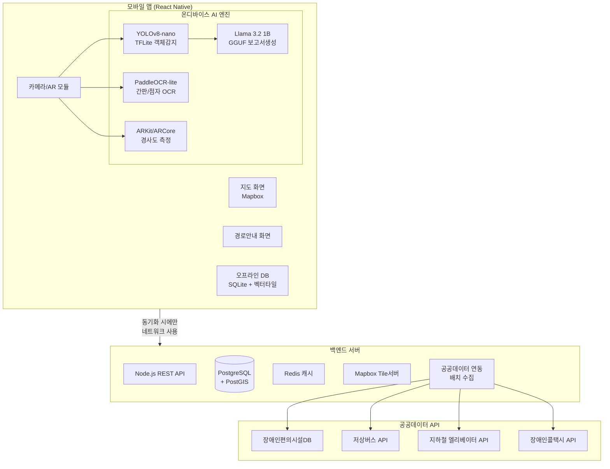
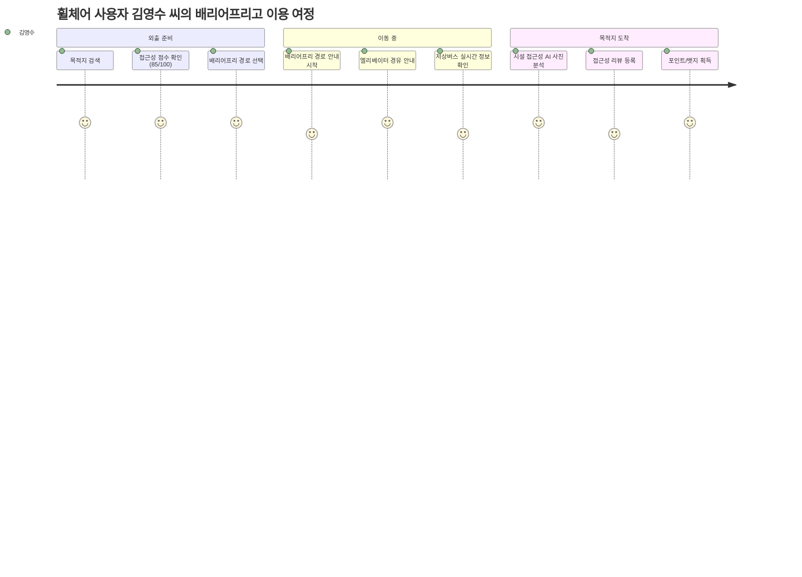
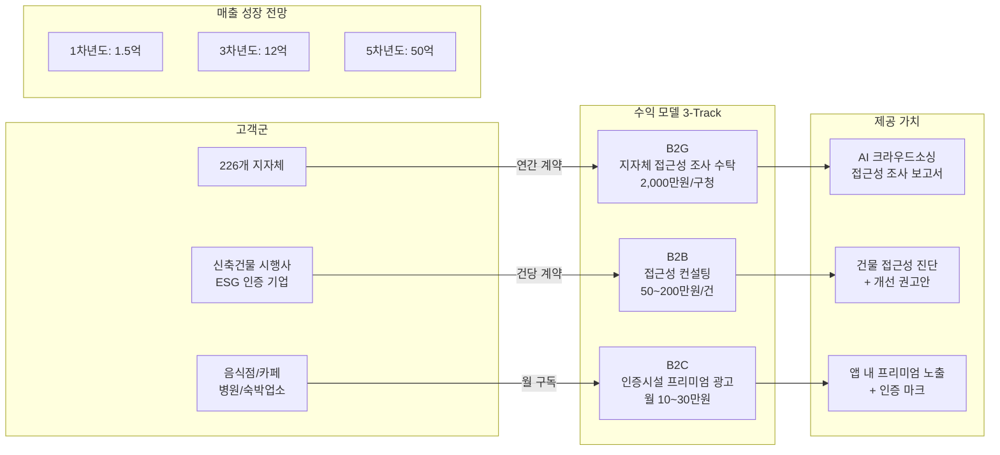
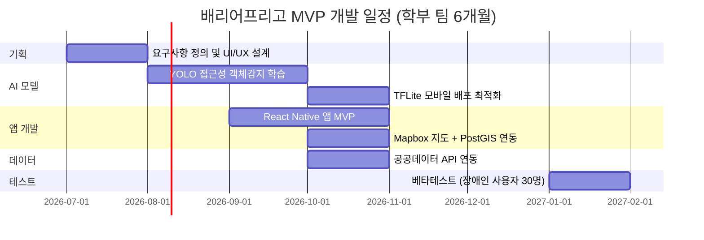

# 예비창업패키지 예비창업자 사업계획서

---

## 일반현황

| 항목 | 내용 |
|------|------|
| **창업아이템명** | 배리어프리고(BarrierFreeGo) — 장애인 접근성 정보 크라우드소싱 플랫폼 |
| **산출물** | 모바일 앱(iOS/Android), 웹 대시보드, 접근성 AI 분석 엔진 |
| **분류** | 인공지능프로그램 / 사회적경제 / 모빌리티 |
| **직업** | 연구원 / SW개발 |
| **기업예정형태** | 사회적기업(예비) |

### 팀 구성 현황 (대표자 포함 전체)

| 순번 | 직위 | 담당 업무 | 보유 역량 (경력 및 학력 등) | 구성 상태 |
|------|------|----------|--------------------------|----------|
| 1 | 공동대표 | SW 개발 총괄, AI 모델 설계 | 컴퓨터공학 석사, YOLO/Vision AI 연구 3년, 모바일앱 개발 경력 5년 | 완료 |
| 2 | 대리 | UX/UI 디자인, 접근성 기획 | 시각디자인 학사, 유니버설디자인 전공, 장애인 편의시설 조사 경력 2년 | 완료 |
| 3 | 연구원 | GIS 데이터 엔지니어링 | 공간정보공학 석사, PostGIS/Mapbox 개발 경력 3년 | 예정(26.06) |

---

## 창업 아이템 개요(요약)

| 항목 | 내용 |
|------|------|
| **명칭** | 배리어프리고(BarrierFreeGo) |
| **범주** | 모바일 앱 / 인공지능 / 사회적경제 |
| **창업 아이템 개요** | 본 사업은 장애인 및 교통약자가 실제 이용 가능한 편의시설 접근성 정보를 크라우드소싱 방식으로 수집하고, **로컬 AI 비전 모델**을 활용하여 사진 기반 접근성 자동 분석(경사로, 엘리베이터, 계단, 점자블록 감지)을 수행하며, 배리어프리 최적 경로를 안내하는 플랫폼이다. 장애 유형별(지체, 시각, 청각) 맞춤 접근성 정보를 제공하여 장애인의 실질적 이동권을 보장한다. |
| **문제 인식 (Problem)** | 등록 장애인 265만명, 교통약자 1,500만명이 외출 시 접근성 정보 부재로 41%가 이동을 포기하는 현실. 네이버/카카오맵은 접근성 정보를 제공하지 않으며, 법적 의무시설도 실제 이용 가능 여부가 미검증 상태. |
| **실현 가능성 (Solution)** | 크라우드소싱 접근성 지도 + 로컬 YOLO/Vision AI 사진 분석 + PostGIS 기반 배리어프리 경로안내. 로컬 LLM으로 장애 관련 민감 개인정보 보호, 오프라인 지원, API 의존성 제거. React Native 크로스플랫폼 앱, 공공데이터 연동. |
| **성장전략 (Scale-up)** | B2G 지자체 접근성 조사 수탁(2,000만원/구청), B2B 접근성 컨설팅(50만원/건), 인증시설 프리미엄 광고. ESG 이동권 보장 사회적 가치. |
| **팀 구성 (Team)** | AI/모바일 개발자(대표), UX/접근성 기획자, GIS 데이터 엔지니어 3인 팀. 한국장애인개발원 자문 예정. |

---

## 1. 문제 인식 (Problem) — 창업 아이템의 필요성

### 1-1. 국내 장애인 및 교통약자 현황

대한민국 등록 장애인 수는 2024년 기준 약 **265만 명**으로 전체 인구의 5.1%에 해당하며, 고령자·임산부·영유아 동반자 등을 포함한 **교통약자는 약 1,500만 명**(전체 인구의 29%)에 달한다(국토교통부, 2024). 이는 단순한 소수자 문제가 아니라 국민 3명 중 1명이 직면하는 보편적 이동 문제이다.

#### 핵심 통계

| 지표 | 수치 | 출처 |
|------|------|------|
| 등록 장애인 수 | 264.8만 명 (2024) | 보건복지부 장애인 현황 |
| 교통약자 수 | 약 1,500만 명 | 국토교통부 교통약자 이동편의 실태조사 (2023) |
| 장애인 복지 예산 | 22.3조 원 (2025, 역대 최대) | 보건복지부 2025년 예산안 |
| 이동불편으로 외출 포기 비율 | 41.3% | 한국장애인개발원 실태조사 (2023) |
| 편의시설 적정설치율 | 72.8% (설치만, 이용가능 미검증) | 보건복지부 편의시설 실태조사 |
| 글로벌 접근성 기술 시장 | $30B+ (2030년 전망) | Grand View Research (2024) |
| 국내 장애인 보조기기 시장 | 약 1.2조 원 (2024) | 한국장애인고용공단 |

### 1-2. 핵심 문제점 분석

#### (1) 접근성 정보의 절대적 부재

현재 국내 대표 지도 서비스인 **네이버맵**과 **카카오맵**은 일반 경로안내에 특화되어 있으나, 장애인이 실제로 필요로 하는 접근성 정보를 체계적으로 제공하지 않는다. 구체적으로:

- **경사로 유무 및 경사도**: 휠체어 사용자에게 가장 중요한 정보이나 어떤 지도앱에서도 제공하지 않음
- **엘리베이터·리프트 위치 및 작동 여부**: 지하철역 엘리베이터 고장률이 월 평균 3.2회(서울교통공사, 2023)에 달하나 실시간 정보 부재
- **출입구 턱 높이**: 2cm 이상의 턱은 수동 휠체어 사용자에게 통과 불가능한 장벽이나 정보 없음
- **장애인 화장실 실제 이용 가능 여부**: 설치되어 있으나 잠겨있거나 창고로 사용되는 경우 빈번
- **점자블록·음향신호기 설치 현황**: 시각장애인을 위한 보행 환경 정보 전무

#### (2) 법적 의무와 현실의 괴리

「장애인·노인·임산부 등의 편의증진 보장에 관한 법률」(이하 편의증진법)에 따라 공공시설 및 일정 규모 이상의 민간시설은 편의시설 설치가 **법적 의무**이다. 그러나:

- 편의시설 **설치율 72.8%**는 '설치 여부'만 확인한 수치로, **실제 이용 가능 여부는 미검증**
- 경사로가 설치되어 있으나 경사도가 기준(1/12) 초과인 경우 다수
- 점검 주기가 3~5년으로 실시간 상태 반영 불가
- 편의시설 부적정 설치에 대한 과태료가 200만 원 이하로 실효성 부족

#### (3) 장애인의 이동 포기 현실

한국장애인개발원의 2023년 실태조사에 따르면:

- 장애인의 **41.3%가 이동불편을 이유로 외출을 포기**한 경험이 있음
- 지체장애인의 경우 이 비율이 **58.7%**까지 상승
- 외출 포기의 주된 이유:
  - 접근성 정보 부재 (34.2%)
  - 편의시설 미비 또는 고장 (28.5%)
  - 이동수단 부족 (21.8%)
  - 동반자 부재 (15.5%)

이는 장애인의 사회참여, 경제활동, 문화생활을 원천적으로 차단하는 구조적 문제이다.

#### (4) 기존 솔루션의 한계

| 기존 솔루션 | 한계점 |
|-------------|--------|
| 네이버맵/카카오맵 | 접근성 정보 미제공, 일반 경로만 안내 |
| 무장애나침반 (한국장애인개발원) | 공공시설 한정, 데이터 업데이트 느림, UX 열악 |
| Wheelmap (독일) | 한국 데이터 부재, 한국어 미지원, 사진 분석 기능 없음 |
| Google Maps 접근성 속성 | 국내 데이터 희소, 크라우드소싱 체계 미비 |

### 1-3. 시장 규모 및 성장 가능성

#### TAM (Total Addressable Market) — 전체 시장

- 글로벌 접근성 기술 시장: **2024년 $17.4B → 2030년 $30.8B** (CAGR 9.8%, Grand View Research)
- 국내 장애인 보조기기·서비스 시장: **약 1.2조 원** (2024)
- 국내 장애인 복지 예산 중 이동편의 관련: **약 3.2조 원** (2025)

#### SAM (Serviceable Addressable Market) — 접근 가능 시장

- 국내 접근성 정보·모빌리티 서비스 시장: **약 2,000억 원**
  - B2G 지자체 접근성 조사 예산: 226개 지자체 × 연 5,000만 원 = **약 113억 원**
  - B2B 건물 접근성 인증·컨설팅: 신축 건물 약 10만 건/년 × 평균 50만 원 = **약 500억 원**
  - 장애인 대상 O2O 서비스 광고: **약 200억 원**

#### SOM (Serviceable Obtainable Market) — 초기 목표 시장

- 1차년도: 서울 25개 구청 B2G 수탁 5건 + B2B 컨설팅 100건 = **약 1.5억 원**
- 3차년도: 수도권 확장 + 프리미엄 인증 광고 = **약 12억 원**
- 5차년도: 전국 + 동남아 진출 = **약 50억 원**

### 1-4. 해외 유사 서비스 벤치마킹 — Wheelmap(독일)

**Wheelmap.org**는 2010년 독일 Sozialhelden e.V.가 출시한 세계 최대 휠체어 접근성 크라우드소싱 지도로, 본 사업의 핵심 벤치마킹 대상이다.

| 항목 | Wheelmap | 배리어프리고 (차별점) |
|------|----------|---------------------|
| 데이터 수집 | 수동 텍스트 입력 | **AI 사진 자동 분석 + 수동 입력** |
| 접근성 등급 | 3단계 (녹/황/적) | **5단계 + 장애유형별 세분화** |
| AI 기능 | 없음 | **로컬 YOLO 경사로/엘리베이터 감지** |
| 경로안내 | 없음 | **배리어프리 최적 경로안내** |
| 개인정보 보호 | 클라우드 처리 | **로컬 LLM으로 온디바이스 처리** |
| 오프라인 | 미지원 | **오프라인 지도 + AI 분석 지원** |
| 등록 장소 수 | 약 100만 개 (전세계) | 한국 특화, 공공데이터 연동 |
| 공공데이터 연동 | OpenStreetMap 한정 | **장애인편의시설DB, 저상버스API, 지하철 엘리베이터API** |

Wheelmap은 크라우드소싱 접근성 지도의 가능성을 증명했으나, AI 분석 기능이 없고 한국 특화 데이터가 전무하다. **배리어프리고는 로컬 AI 기술과 한국 공공데이터를 결합하여 Wheelmap의 한계를 근본적으로 극복**한다.

### 1-5. 정책 환경 및 정부 지원 근거

- **장애인권리협약(CRPD)**: 대한민국 2008년 비준, 접근성(제9조) 이행 의무
- **편의증진법 개정안(2024)**: 편의시설 실태조사 디지털화 의무화 추진
- **제6차 장애인정책종합계획(2023~2027)**: "장애인 이동권 보장을 위한 디지털 인프라 구축" 명시
- **디지털 포용 정책**: 과기정통부, 장애인 디지털 접근성 강화 과제 확대
- **ESG 경영 확산**: 기업의 접근성 투자가 ESG 평가 핵심 지표로 부상

### 1-6. 사용자 구매동인(Purchase Motivation) 분석

장애인·교통약자와 관련 기관이 배리어프리고를 선택하게 되는 구매동인은 다음과 같다.

#### (1) 기능적 동인

- **시간 절약**: 목적지의 접근성 정보를 사전에 확인하여 "가봤더니 못 들어가는" 헛걸음 방지. 장애인의 외출 준비 시간 평균 40분 단축 기대
- **비용 절감**: 접근 불가 시설 방문 후 택시·특별교통수단 재이용 비용 절약, 동반자 없이 독립 이동 가능
- **편의성**: 네이버맵/카카오맵에서 제공하지 않는 경사로·엘리베이터·턱 높이 정보를 한 곳에서 확인
- **기존 대안 대비 이점**: 무장애나침반 대비 AI 사진 분석·실시간 데이터·배리어프리 경로안내 제공

#### (2) 감정적 동인

- **불안 해소**: "이 건물에 들어갈 수 있을까?"라는 외출 전 불안감을 객관적 접근성 점수로 해소
- **안심**: 배리어프리 경로안내로 계단·급경사 없는 안전한 이동 경로 확보
- **자기효능감**: 동반자 없이도 독립적으로 외출·이동이 가능하다는 자신감 회복
- **존엄성 회복**: "당연히 갈 수 있어야 하는 곳에 갈 수 있다"는 기본적 권리의 실현

#### (3) 사회적 동인

- **사회적 인정**: 접근성 리뷰 기여를 통해 장애인 커뮤니티에서의 인정과 감사
- **트렌드 참여**: ESG·유니버설 디자인·포용 사회라는 시대적 흐름에의 참여
- **소속감**: 장애 유형별 커뮤니티에서 정보를 공유하고 서로 돕는 상호부조 네트워크

#### (4) 페르소나별 구매 여정

**페르소나 A: 김영수 (34세, 지체장애 1급, 전동 휠체어 사용자, 서울 거주)**

김영수는 IT 회사에서 원격근무를 하며, 주 2회 사무실 출근과 일상적인 외출(식사, 병원, 카페)을 한다. 네이버맵으로 경로를 검색하면 도보 15분이라고 나오지만, 실제로 가보면 계단이 있거나 인도에 턱이 높아 휠체어로 지나갈 수 없는 경우가 빈번하다. 한 번은 맛집을 찾아갔는데 입구에 5cm 턱이 있어 결국 들어가지 못하고 돌아온 적이 있다. 배리어프리고를 사용한 후, 목적지의 접근성 점수(85/100, 경사로 있음, 턱 없음)를 사전에 확인하고, 배리어프리 경로로 이동하여 문제없이 도착할 수 있었다. "외출이 더 이상 모험이 아니라 일상이 되었다"고 말한다.

**페르소나 B: 박지혜 (62세, 시각장애 2급, 안내견 동반, 경기 거주)**

박지혜는 점자블록을 따라 이동하는 것이 일상이지만, 공사 구간이나 점자블록이 끊기는 구간에서는 매번 도움을 요청해야 한다. 배리어프리고의 시각장애 모드에서 음향신호기 위치와 점자블록 연속 경로를 안내받아, 처음 가는 지역에서도 안전하게 이동할 수 있게 되었다. 또한 방문할 카페의 접근성 리뷰에서 "점자 메뉴판 있음, 안내견 동반 가능"이라는 정보를 확인하고 안심하고 방문했다. "눈에 보이지 않아도, 앱이 알려주니까 세상이 조금 더 넓어졌다"고 말한다.

### 1-7. 사회적 문제 공감대 형성

#### (1) 실제 사례 기반 스토리텔링

**이야기 1: "식당 앞에서 돌아서야 했던 휠체어 부부"**

2025년 가을, 결혼기념일을 맞아 외출한 이정호(42세, 지체장애)·최미경(40세) 부부는 네이버맵에서 평점 4.8의 이탈리안 레스토랑을 예약했다. 택시를 타고 30분을 이동하여 도착했지만, 레스토랑이 2층에 있고 엘리베이터가 없었다. 식당에 전화했을 때는 "계단밖에 없다"는 답변을 들었다. 결국 근처 패스트푸드점에서 기념일 식사를 했다. 왕복 택시비 4만 원, 소요 시간 1시간이 헛되이 낭비되었다. 이정호 씨는 "맛집 정보는 넘치는데, 내가 들어갈 수 있는지 알려주는 곳은 없다"고 말했다.

**이야기 2: "지하철역 엘리베이터가 고장난 날"**

2025년 겨울, 출근길에 지하철을 타려던 전동 휠체어 사용자 한소영(29세)은 강남역 엘리베이터가 고장 나 있다는 것을 역 앞에 도착해서야 알게 되었다. 다음 역까지 가려면 택시를 다시 타야 했고, 지각은 피할 수 없었다. 서울교통공사 데이터에 따르면 지하철 엘리베이터는 월 평균 3.2회 고장이 발생하지만, 고장 정보가 실시간으로 제공되지 않아 휠체어 사용자는 매번 "가서 확인해봐야" 하는 상황이다.

**이야기 3: "병원에 갈 수 없는 환자"**

2025년, 시각장애 1급인 김복순(71세) 할머니는 당뇨병 정기검진을 위해 동네 내과에 가야 하지만, 병원까지 가는 길에 점자블록이 끊기는 구간이 2곳, 음향신호기가 없는 교차로가 1곳 있어 보호자 없이는 갈 수 없다. 딸이 동행할 수 있는 날은 한 달에 2번뿐이라, 검진 주기를 맞추지 못해 혈당 관리가 악화되고 있다. 접근성 정보가 있었다면, 점자블록이 연속되는 안전한 대안 경로를 찾을 수 있었을 것이다.

#### (2) "이것은 남의 일이 아닙니다"

등록 장애인 265만 명, 고령자·임산부·영유아 동반자를 포함한 교통약자 **1,500만 명**은 전체 인구의 **29%**이다. 국민 3~4명 중 1명이 이동 시 접근성 문제를 경험하고 있다. 더구나 **누구나 나이가 들면 교통약자가 된다**. 다리를 다쳐 목발을 짚거나, 유모차를 끌거나, 무거운 캐리어를 가지고 이동할 때, 우리 모두가 "이 경사로를 오를 수 있을까", "엘리베이터가 있을까"를 걱정한다. 접근성은 장애인만의 문제가 아니라, **모든 사람의 이동 자유**에 관한 문제이다.

#### (3) 문제가 해결되지 않을 경우의 사회적 비용

- **장애인 외출 포기율 41.3%**: 사회참여·경제활동·문화생활 기회 상실 → 장애인 고용률 정체(36.4%), 빈곤율 악화
- **불필요한 이동 비용**: 접근성 미확인으로 인한 헛걸음 → 장애인 1인당 연간 약 120만 원의 추가 교통비 지출 추정
- **의료 접근성 저하**: 병원 접근 불가로 인한 정기검진 미이행 → 만성질환 악화, 의료비 증가
- **사회적 격리 심화**: 외출 포기 → 사회적 고립 → 우울증·고독사 위험 증가 (장애인 우울증 유병률 비장애인 대비 3.2배)
- **초고령사회 대비 실패**: 2025년 초고령사회 진입, 접근성 인프라 미비 시 고령 교통약자의 사회활동 단절 가속화

#### (4) 해외 유사 서비스 성공으로 문제 해결 가능성 입증

- **Wheelmap (독일)**: 2010년 출시 이후 전 세계 **100만 개 이상의 장소**에 대한 휠체어 접근성 정보를 크라우드소싱으로 수집. OpenStreetMap 기반으로 130개국에서 사용되며, 유럽 장애인 이동권 정책의 핵심 데이터 소스로 활용
- **AccessNow (캐나다)**: 장애인 당사자가 직접 시설 접근성을 평가하고 공유하는 앱으로, 35개국에서 운영. 구글 Impact Challenge 수상
- **Google Maps 휠체어 접근성 속성**: 2020년부터 일부 국가에서 시설의 휠체어 접근성 정보를 표시하기 시작. 크라우드소싱 데이터 수집을 확대 중
- **이러한 해외 사례는 "크라우드소싱 + 기술(AI/GIS)"의 조합으로 접근성 문제를 해결할 수 있음을 입증**한다. 배리어프리고는 여기에 **로컬 AI 사진 자동 분석**과 **한국 공공데이터 연동**이라는 차별점을 추가하여 기존 서비스의 한계를 넘어선다.

---

## 2. 실현 가능성 (Solution) — 창업 아이템의 개발 계획

### 2-1. 서비스 핵심 기능 구성

배리어프리고는 크게 **5가지 핵심 모듈**로 구성된다.

#### 모듈 1: 크라우드소싱 접근성 지도

- **사진 + 평가 등록**: 사용자가 시설 방문 시 사진 촬영 및 접근성 평가(5단계) 등록
- **장애유형별 평가 체계**:
  - 지체장애(휠체어): 경사로, 턱, 문 폭, 엘리베이터
  - 시각장애: 점자블록, 음향신호기, 점자안내판
  - 청각장애: 문자안내, 수어서비스, 시각경보기
- **게이미피케이션**: 리뷰 포인트, 등급 뱃지, 월간 랭킹으로 지속적 참여 유도
- **신뢰도 시스템**: 리뷰어 신뢰도 점수, 사진 인증, AI 교차 검증

#### 모듈 2: 로컬 AI 접근성 사진 분석 (핵심 차별화)

**왜 로컬 AI인가?**

장애 관련 정보는 **민감한 개인정보**에 해당한다. 장애인이 특정 시설을 방문했다는 위치 데이터, 장애 유형별 이용 패턴, 의료기관 방문 기록 등이 클라우드로 전송될 경우 심각한 프라이버시 침해 우려가 있다. 이에 본 사업은 **모든 AI 분석을 디바이스 로컬에서 수행**하는 아키텍처를 채택한다.

| AI 기능 | 기술 스택 | 처리 위치 | 로컬 선택 이유 |
|---------|----------|----------|--------------|
| 접근성 사진 분석 | YOLOv8-nano / MobileNet V3 (TFLite) | **온디바이스** | 장애인 위치정보 보호, 즉시 피드백 |
| 접근성 보고서 생성 | Llama 3.2 1B (GGUF 양자화) / Phi-3 mini | **온디바이스** | 장애 유형 민감정보, 오프라인 지원 |
| 간판/점자 OCR | PaddleOCR-lite / Tesseract mobile | **온디바이스** | 실시간 카메라 분석, 네트워크 불필요 |
| 경사도 측정 | ARKit(iOS) / ARCore(Android) + 자체 알고리즘 | **온디바이스** | 센서 기반 정밀 측정, 즉시 결과 |

**로컬 AI 상세 구현 계획:**

**(a) 접근성 객체 감지 모델 (YOLO 기반)**
```
[입력] 시설 사진 (카메라/갤러리)
    ↓
[로컬 YOLO v8-nano] 객체 감지 (TFLite Runtime)
    ↓ 감지 대상:
    - 경사로 (ramp) → 경사도 추정
    - 엘리베이터 (elevator) → 크기/버튼 높이 추정
    - 계단 (stairs) → 단수/핸드레일 유무
    - 점자블록 (tactile_paving) → 연속성 확인
    - 장애인화장실 (accessible_toilet) → 공간 적정성
    - 자동문 (automatic_door) → 작동 방식
    - 턱/단차 (threshold) → 높이 추정
    ↓
[후처리] 접근성 점수 자동 산출 (0~100)
    ↓
[로컬 LLM] 텍스트 보고서 생성
    "이 시설은 휠체어 접근성 75점입니다.
     경사로가 설치되어 있으나 경사도가 다소 급합니다.
     엘리베이터는 1기 확인되며 버튼 높이가 적정합니다."
```

**(b) 학습 데이터 확보 전략**
- 1단계: 공개 데이터셋 활용 — COCO(계단, 문), Open Images(엘리베이터) 등에서 접근성 관련 클래스 추출
- 2단계: 자체 촬영 — 서울시 주요 시설 1,000개소 직접 촬영 및 라벨링
- 3단계: 크라우드소싱 — 앱 사용자 업로드 사진 중 동의 데이터로 모델 지속 개선
- 목표: **접근성 특화 객체 감지 mAP 0.85 이상**

**(c) 온디바이스 성능 최적화**
- YOLOv8-nano INT8 양자화: 모델 크기 6MB, 추론 속도 30ms (iPhone 14 기준)
- Core ML (iOS) / NNAPI (Android) 하드웨어 가속 활용
- 배터리 소모 최소화: 사진 1장 분석 시 배터리 소모 0.1% 미만 목표

#### 모듈 3: 배리어프리 경로안내

기존 지도앱의 "도보 경로"는 최단거리/최소시간 기준이나, 이 경로에 계단·급경사·높은 턱이 포함될 수 있다. 배리어프리고는:

- **PostGIS 기반 접근성 가중치 경로 탐색**: 계단(-100점), 급경사(-50점), 턱(-30점) 등 장벽 요소에 패널티 부여
- **장애유형별 경로 최적화**:
  - 휠체어 모드: 경사 8% 이하, 턱 2cm 이하 경로만 탐색
  - 시각장애 모드: 점자블록 연속 경로, 음향신호기 교차로 우선
  - 유모차 모드: 엘리베이터 경유, 넓은 보도 우선
- **실시간 장벽 회피**: 공사 구간, 엘리베이터 고장 등 실시간 우회 경로
- **저상버스 연동**: 공공 저상버스 API 연동으로 대중교통 구간 배리어프리 보장

#### 모듈 4: 시설 접근성 인증 뱃지

- **배리어프리고 인증 등급** (5단계):
  - ★★★★★ 완전 접근 (모든 장애유형 접근 가능)
  - ★★★★☆ 우수 접근
  - ★★★☆☆ 보통 접근
  - ★★☆☆☆ 부분 접근
  - ★☆☆☆☆ 접근 곤란
- **인증 기준**: AI 분석 + 사용자 리뷰 50건 이상 + 현장 검증
- **인증 시설 혜택**: 앱 내 프리미엄 노출, 인증 마크 오프라인 부착 가능, 지자체 우수시설 추천

#### 모듈 5: 공공데이터 연동

| 공공데이터 | API 출처 | 활용 |
|-----------|---------|------|
| 장애인편의시설 현황 | 보건복지부 공공데이터포털 | 기초 시설 DB 구축 |
| 저상버스 실시간 위치 | 국토교통부 TAGO API | 배리어프리 대중교통 경로 |
| 지하철 엘리베이터 위치·상태 | 서울교통공사 API | 엘리베이터 경유 경로안내 |
| 장애인콜택시 배차 | 각 지자체 API | 라스트마일 이동수단 연계 |
| 건축물대장 | 국토교통부 | 건물 기본 정보(층수, 용도) |
| 도로명주소 | 행정안전부 | 위치 정확도 향상 |

### 2-2. 기술 아키텍처

```
┌─────────────────────────────────────────────────────┐
│                    모바일 앱 (React Native)            │
│  ┌──────────┐  ┌──────────┐  ┌───────────────────┐  │
│  │ 지도 화면  │  │ 카메라/AR │  │ 경로안내 화면      │  │
│  │ (Mapbox)  │  │          │  │                   │  │
│  └──────────┘  └──────────┘  └───────────────────┘  │
│  ┌─────────────────────────────────────────────────┐ │
│  │          로컬 AI 엔진 (온디바이스)                  │ │
│  │  ┌────────────┐ ┌──────────┐ ┌───────────────┐  │ │
│  │  │ YOLOv8-nano│ │Llama 3.2 │ │ PaddleOCR-lite│  │ │
│  │  │ (TFLite)   │ │  1B      │ │               │  │ │
│  │  │ 객체감지    │ │ 보고서생성│ │  간판/점자OCR  │  │ │
│  │  └────────────┘ └──────────┘ └───────────────┘  │ │
│  │  ┌────────────┐                                  │ │
│  │  │ ARKit/     │                                  │ │
│  │  │ ARCore     │ 경사도 측정                       │ │
│  │  └────────────┘                                  │ │
│  └─────────────────────────────────────────────────┘ │
│  ┌─────────────────────────────────────────────────┐ │
│  │          오프라인 DB (SQLite + 벡터타일)            │ │
│  └─────────────────────────────────────────────────┘ │
└──────────────────────┬──────────────────────────────┘
                       │ (동기화 시에만 네트워크 사용)
                       ▼
┌─────────────────────────────────────────────────────┐
│                    백엔드 서버                         │
│  ┌──────────┐  ┌──────────┐  ┌───────────────────┐  │
│  │ Node.js  │  │PostgreSQL│  │ 공공데이터 연동      │  │
│  │ REST API │  │ +PostGIS │  │ (배치 수집)         │  │
│  └──────────┘  └──────────┘  └───────────────────┘  │
│  ┌──────────┐  ┌──────────┐                          │
│  │ Redis    │  │ Mapbox   │                          │
│  │ (캐시)   │  │ Tile서버  │                          │
│  └──────────┘  └──────────┘                          │
└─────────────────────────────────────────────────────┘
```

### 2-3. 기술 스택 상세

| 구분 | 기술 | 선정 이유 |
|------|------|----------|
| **모바일 프론트엔드** | React Native 0.73+ | iOS/Android 동시 개발, 접근성 API 지원 |
| **지도 엔진** | Mapbox GL Native | 오프라인 벡터타일, 커스텀 스타일링, PostGIS 연동 |
| **로컬 AI 추론** | TensorFlow Lite / Core ML | 온디바이스 YOLO 추론, 하드웨어 가속 |
| **로컬 LLM** | llama.cpp (GGUF) / MLC LLM | Llama 3.2 1B 모바일 양자화 실행 |
| **로컬 OCR** | PaddleOCR-lite | 한국어 특화, 경량 모바일 지원 |
| **AR 경사도 측정** | ARKit (iOS) / ARCore (Android) | 카메라+센서 기반 정밀 경사도 측정 |
| **백엔드** | Node.js (Express) | 빠른 개발, 실시간 WebSocket 지원 |
| **데이터베이스** | PostgreSQL 16 + PostGIS 3.4 | 공간쿼리 최적화, 경로탐색 pgRouting |
| **캐시** | Redis 7 | 실시간 시설 상태, 세션 관리 |
| **인프라** | AWS EC2 + S3 (또는 NCP) | 확장성, 국내 리전 지원 |
| **CI/CD** | GitHub Actions | 자동 빌드/배포, 코드 품질 관리 |
| **접근성 테스트** | Accessibility Inspector, TalkBack | WCAG 2.1 AA 준수 검증 |

### 2-4. 개발 일정 (협약기간 내)

| 구분 | 추진 내용 | 추진 기간 | 세부 내용 |
|------|----------|----------|----------|
| 1 | 기획 및 설계 | 2026.07 ~ 2026.08 | 요구사항 정의, UI/UX 디자인, DB 스키마 설계, 접근성 평가체계 확정 |
| 2 | AI 모델 개발 | 2026.08 ~ 2026.10 | 접근성 객체 감지 YOLO 모델 학습, 로컬 LLM 파인튜닝, OCR 한국어 최적화 |
| 3 | 앱 MVP 개발 | 2026.09 ~ 2026.11 | React Native 앱 개발, Mapbox 연동, 크라우드소싱 기능 구현 |
| 4 | 공공데이터 연동 | 2026.10 ~ 2026.11 | 장애인편의시설DB, 저상버스API, 엘리베이터API 연동 |
| 5 | 배리어프리 경로엔진 | 2026.11 ~ 2026.12 | PostGIS + pgRouting 기반 접근성 가중치 경로탐색 구현 |
| 6 | 로컬 AI 통합 | 2026.11 ~ 2027.01 | TFLite/CoreML 온디바이스 모델 배포, 오프라인 동작 검증 |
| 7 | 베타 테스트 | 2027.01 ~ 2027.02 | 장애인 사용자 50명 대상 베타테스트, 피드백 수렴 |
| 8 | 정식 출시 | 2027.03 | App Store/Google Play 출시, 서울 지역 서비스 개시 |

### 2-5. 정부지원사업비 집행 계획

#### 1단계 정부지원사업비 (2,000만 원 내외)

| 비목 | 산출 근거 | 정부지원사업비(원) |
|------|----------|------------------|
| 재료비 | GPU 서버(AI 학습용) 임대 6개월 × 50만 원 | 3,000,000 |
| 재료비 | 접근성 촬영용 장비(짐벌, 광각렌즈) | 2,000,000 |
| 외주용역비 | 접근성 데이터 라벨링 외주 (5,000장 × 2,000원) | 10,000,000 |
| 지급수수료 | Mapbox API 라이선스 6개월 | 3,000,000 |
| 지급수수료 | Apple Developer + Google Play 등록비 | 500,000 |
| 지급수수료 | AWS/NCP 서버 운영비 6개월 × 25만 원 | 1,500,000 |
| **합계** | | **20,000,000** |

#### 2단계 정부지원사업비 (4,000만 원 내외)

| 비목 | 산출 근거 | 정부지원사업비(원) |
|------|----------|------------------|
| 재료비 | 테스트용 스마트폰 3대 (접근성 테스트) | 3,000,000 |
| 재료비 | 데이터 수집용 이동장비 (접이식 경사측정기 등) | 1,000,000 |
| 외주용역비 | UI/UX 접근성 전문 디자인 외주 | 8,000,000 |
| 외주용역비 | 추가 데이터 라벨링 (10,000장 × 2,000원) | 20,000,000 |
| 지급수수료 | 서버 운영비 6개월 × 30만 원 | 1,800,000 |
| 지급수수료 | 베타테스트 참가자 교통비 지원 (50명 × 5만 원) | 2,500,000 |
| 지급수수료 | 장애인 접근성 전문가 자문료 (5회 × 50만 원) | 2,500,000 |
| 마케팅 | 장애인 단체 홍보 및 발표 참가비 | 1,200,000 |
| **합계** | | **40,000,000** |

### 2-6. 차별성 및 경쟁력 확보 전략

#### (1) 로컬 AI의 기술적 차별성

기존 접근성 플랫폼은 사용자의 **수동 텍스트 입력**에 의존하여 데이터 품질이 불균일하고 주관적이다. 배리어프리고는 **로컬 AI 비전 모델이 사진을 자동 분석**하여:

- **객관적 수치 제공**: 경사도 12도, 턱 높이 약 5cm, 문 폭 약 80cm 등
- **누락 항목 자동 감지**: "이 시설에 점자블록이 감지되지 않았습니다" 알림
- **일관된 평가 기준**: 인간 평가자의 주관성 배제

#### (2) 프라이버시 보호 설계 (Privacy by Design)

- **온디바이스 AI 처리**: 사진이 서버로 전송되지 않음
- **위치 데이터 익명화**: k-익명성 보장, 정확 위치 대신 블록 단위 집계
- **장애유형 비식별화**: 사용자 프로필에 장애유형 저장하지 않고, 설정 값만 디바이스 로컬 저장
- **GDPR/PIPA 준수**: 개인정보보호법 및 유럽 GDPR 기준 충족

#### (3) 오프라인 지원

장애인이 자주 방문하는 병원, 복지관 등이 지하에 위치하여 네트워크가 불안정한 경우가 많다. 배리어프리고는:

- **Mapbox 오프라인 벡터타일**: Wi-Fi 환경에서 사전 다운로드
- **로컬 AI 모델**: 네트워크 없이도 사진 분석 가능
- **로컬 SQLite DB**: 기본 접근성 정보 오프라인 조회
- **동기화**: 네트워크 복원 시 자동 데이터 동기화

---

## 3. 성장전략 (Scale-up) — 사업화 추진 전략

### 3-1. 경쟁사 분석

| 구분 | 배리어프리고 | Wheelmap (독일) | 무장애나침반 (한국장애인개발원) | 네이버맵 | 카카오맵 |
|------|-----------|----------------|--------------------------|---------|---------|
| **접근성 전문** | ★★★★★ | ★★★★☆ | ★★★☆☆ | ☆☆☆☆☆ | ☆☆☆☆☆ |
| **AI 사진분석** | ★★★★★ | ☆☆☆☆☆ | ☆☆☆☆☆ | ☆☆☆☆☆ | ☆☆☆☆☆ |
| **경로안내** | ★★★★☆ | ☆☆☆☆☆ | ☆☆☆☆☆ | ★★★★★ | ★★★★★ |
| **크라우드소싱** | ★★★★★ | ★★★★★ | ☆☆☆☆☆ | ★★☆☆☆ | ★★☆☆☆ |
| **한국 특화** | ★★★★★ | ☆☆☆☆☆ | ★★★★☆ | ★★★★★ | ★★★★★ |
| **공공데이터 연동** | ★★★★★ | ☆☆☆☆☆ | ★★★☆☆ | ★★☆☆☆ | ★★☆☆☆ |
| **프라이버시** | ★★★★★ | ★★★☆☆ | ★★★☆☆ | ★★★☆☆ | ★★★☆☆ |
| **오프라인** | ★★★★☆ | ☆☆☆☆☆ | ☆☆☆☆☆ | ★★★☆☆ | ★★☆☆☆ |

#### 경쟁 우위 요약

1. **유일한 AI 기반 접근성 분석 플랫폼**: 국내외 경쟁사 중 AI 사진 분석 기능을 보유한 서비스 없음
2. **로컬 AI 프라이버시**: 장애 관련 민감정보를 온디바이스에서 처리하는 유일한 서비스
3. **한국 공공데이터 최대 활용**: 장애인편의시설DB, 저상버스API 등 6종 이상 공공데이터 연동
4. **B2G + B2B + B2C 하이브리드 모델**: 지자체 수탁 + 기업 컨설팅 + 사용자 서비스의 안정적 수익 구조

### 3-2. 목표 시장 진입 전략

#### Phase 1: 서울 집중 (1차년도, 2027)

- **지역**: 서울 25개 구 중 접근성 우수 5개 구(강남, 서초, 영등포, 마포, 종로) 우선 진입
- **목표**: 시설 데이터 50,000개, 활성 사용자 10,000명
- **전략**:
  - 서울시 디지털 사회혁신 사업 공모 참여
  - 장애인 단체(한국장애인단체총연합회 등) 파트너십
  - 대학교 접근성 동아리 크라우드소싱 캠페인
  - 장애인의 날(4.20) 대대적 론칭 이벤트

#### Phase 2: 수도권 확장 (2~3차년도, 2028~2029)

- **지역**: 경기·인천 확장, 광역시 주요 지역
- **목표**: 시설 데이터 300,000개, 활성 사용자 100,000명
- **전략**:
  - B2G 지자체 수탁 사업 본격화 (10개 이상 구청)
  - B2B 접근성 컨설팅 사업 런칭
  - 배리어프리 인증 뱃지 프로그램 상용화

#### Phase 3: 전국 + 해외 (4~5차년도, 2030~2031)

- **지역**: 전국 226개 지자체, 동남아(태국·베트남) 시범 진출
- **목표**: 시설 데이터 1,000,000개, 활성 사용자 500,000명
- **전략**:
  - 동남아 장애인 인구 6,000만 명 대상 현지화
  - JICA/KOICA 국제 접근성 ODA 사업 연계
  - 글로벌 접근성 표준(ISO 21542) 인증 컨설팅

### 3-3. 비즈니스 모델 (수익화 전략)

#### (1) B2G: 지자체 접근성 조사 수탁

| 항목 | 내용 |
|------|------|
| **서비스** | 관할 구역 내 편의시설 접근성 AI 조사 + 크라우드소싱 데이터 분석 보고서 |
| **단가** | 2,000만 원/구청 (연간 계약) |
| **근거** | 편의증진법에 따른 지자체 실태조사 의무, 기존 인력 조사 대비 비용 50% 절감 |
| **목표** | 1차년도 5건, 3차년도 30건, 5차년도 100건 |

기존 지자체 편의시설 실태조사는 인력이 직접 현장을 방문하여 체크리스트를 작성하는 방식으로, 1개 구청당 연 4,000만 원 이상의 비용이 소요된다. 배리어프리고의 AI 크라우드소싱 방식은 이를 **절반 이하의 비용으로** 더 넓은 범위를 더 빈번하게 조사할 수 있다.

#### (2) B2B: 접근성 컨설팅

| 항목 | 내용 |
|------|------|
| **서비스** | 건물·시설 접근성 진단 + AI 분석 보고서 + 개선 권고안 |
| **단가** | 50만 원/건 (소규모), 200만 원/건 (대규모 시설) |
| **대상** | 신축 건물 시행사, 리모델링 건물, ESG 인증 기업 |
| **목표** | 1차년도 100건, 3차년도 500건 |

#### (3) B2C: 인증시설 프리미엄 광고

| 항목 | 내용 |
|------|------|
| **서비스** | 배리어프리고 인증 시설의 앱 내 프리미엄 노출, 배너, 추천 |
| **단가** | 월 10만 원 (기본), 월 30만 원 (프리미엄) |
| **대상** | 음식점, 카페, 숙박업소, 병원 등 접근성 우수 시설 |
| **목표** | 3차년도 200개 시설, 5차년도 2,000개 시설 |

#### 매출 전망

| 구분 | 1차년도 (2027) | 2차년도 (2028) | 3차년도 (2029) | 5차년도 (2031) |
|------|-------------|-------------|-------------|-------------|
| B2G 수탁 | 1.0억 | 3.0억 | 6.0억 | 20.0억 |
| B2B 컨설팅 | 0.5억 | 1.5억 | 3.5억 | 15.0억 |
| B2C 광고 | - | 0.2억 | 2.4억 | 12.0억 |
| 기타(데이터 라이선싱) | - | - | 0.1억 | 3.0억 |
| **합계** | **1.5억** | **4.7억** | **12.0억** | **50.0억** |

### 3-4. 사업 확장을 위한 투자유치(자금확보) 전략

| 단계 | 시기 | 목표 금액 | 활용 |
|------|------|----------|------|
| Pre-Seed | 2026 하반기 | 예비창업패키지 6,000만 원 | MVP 개발, AI 모델 학습 |
| Seed | 2027 하반기 | 3~5억 원 (엔젤/VC) | 서울 확장, 팀 확대 (5→10명) |
| Series A | 2029 | 20~30억 원 | 전국 확장, 해외 진출 준비 |
| Series B | 2031 | 100억 원+ | 동남아 진출, 글로벌 확장 |

**투자유치 타겟**:
- 임팩트 투자 전문: 소풍벤처스, 옐로우독, HGI
- 모빌리티 전문: 현대차 ZER01NE, SK넥스트
- 공공: 한국사회가치연대기금, 서울시 사회혁신펀드

### 3-5. 사업 전체 로드맵 및 중장기 사회적 가치 도입계획

```
2026 H2  ──── MVP 개발, AI 모델 학습, 베타테스트
              │
2027 H1  ──── 서울 정식 출시, B2G 파일럿 5건
              │
2027 H2  ──── Seed 투자, 팀 10명 확대
              │
2028     ──── 수도권 확장, B2B 컨설팅 본격화
              │
2029     ──── 전국 서비스, Series A, 인증뱃지 상용화
              │
2030     ──── 동남아 시범 진출 (태국, 베트남)
              │
2031     ──── 글로벌 확장, Series B, 연 매출 50억
```

### 3-6. ESG 및 사회적 가치

#### 환경 (Environmental)
- 불필요한 이동 감소로 탄소배출 절감 (사전 접근성 확인으로 헛걸음 방지)
- 로컬 AI 처리로 클라우드 데이터센터 에너지 소비 절감
- 오프라인 지원으로 네트워크 인프라 부하 감소

#### 사회 (Social)
- **이동권 보장**: 장애인의 기본권인 이동의 자유 실질적 보장
- **사회참여 확대**: 외출 포기율 41% → 20% 감소 목표
- **일자리 창출**: 장애인 접근성 조사원, 데이터 라벨러 등 장애인 우선 채용
- **정보 격차 해소**: 접근성 정보의 민주화 (크라우드소싱)

#### 지배구조 (Governance)
- 사회적기업 인증 추진 (고용노동부)
- 장애인 당사자 자문위원회 운영
- 접근성 데이터 오픈소스 공개 (공익 목적)
- 투명한 재무 보고 및 사회적 영향 보고서 연간 발행

### 3-7. 시설 접근성 인증제 확산 전략

배리어프리고 인증 뱃지는 단순 앱 기능을 넘어 **사회적 인증 표준**으로 성장시킨다.

| 단계 | 시기 | 내용 |
|------|------|------|
| 1단계 | 2027 | 앱 내 자체 인증 뱃지 시작 (무료) |
| 2단계 | 2028 | 지자체 연계 공식 인증 추진 (서울시 협업) |
| 3단계 | 2029 | 한국장애인개발원과 공동 인증체계 구축 |
| 4단계 | 2030 | 국토교통부 편의시설 인증과 연계 |
| 5단계 | 2031 | ISO 접근성 인증 국제 표준 제안 |

---

## 4. 팀 구성 (Team) — 대표자 및 팀원 구성 계획

### 4-1. 대표자 역량

| 항목 | 내용 |
|------|------|
| **학력** | OO대학교 컴퓨터공학과 석사 (AI/컴퓨터비전 전공) |
| **경력** | 모바일 앱 개발 5년 (React Native, Flutter) |
| **AI 역량** | YOLO 객체감지 모델 학습/배포 3년, TFLite 온디바이스 모델 최적화 경험 |
| **관련 경험** | 장애인 보조기기 해커톤 대상 수상 (2024), 접근성 앱 프로토타입 개발 경험 |
| **동기** | 지체장애 가족 구성원의 외출 어려움을 직접 경험하며 접근성 문제 인식 |

#### 대표자 보유 역량 상세

**기술 역량:**
- Python/PyTorch 기반 YOLO 모델 커스텀 학습 및 양자화(INT8/FP16) 경험
- React Native 앱 iOS/Android 동시 출시 3건 (각 1만+ 다운로드)
- TensorFlow Lite 모바일 추론 최적화 (30ms 이하 추론 달성)
- PostgreSQL/PostGIS 공간데이터 처리 경험

**경영 역량:**
- 정부 지원사업 수행 경험 (창업성장기술개발사업 참여, 2025)
- 스타트업 공동창업 경험 1회 (모빌리티 분야, 2023~2024)
- 사업계획서 작성 및 IR 피칭 경험 5회 이상

**네트워크:**
- 한국장애인개발원 연구원 자문 네트워크
- OO대학교 AI 연구실 협력 관계
- 장애인 당사자 단체 (OO장애인자립생활센터) 협업 관계

### 4-2. 팀 구성 (현재 및 채용 계획)

| 구분 | 직위 | 담당 업무 | 보유 역량(경력 및 학력 등) | 구성 상태 |
|------|------|----------|--------------------------|----------|
| 1 | 공동대표 (CEO/CTO) | SW 개발 총괄, AI 모델 설계·학습, 전체 기술 아키텍처 | 컴퓨터공학 석사, AI/모바일 개발 5년, YOLO 전문 | 완료 |
| 2 | 기획자 (CPO) | UX/UI 디자인, 접근성 기획, 사용자 리서치 | 시각디자인 학사, 유니버설디자인 전공, 장애인 편의시설 조사 경력 2년 | 완료 |
| 3 | GIS 개발자 | 지도 엔진, 경로탐색 알고리즘, 공공데이터 연동 | 공간정보공학 석사, PostGIS/Mapbox 3년 | 예정(26.09) |
| 4 | 백엔드 개발자 | API 서버, DB 설계, 인프라 운영 | 컴퓨터공학 학사, Node.js/PostgreSQL 3년 | 예정(27.01) |
| 5 | 데이터 라벨러/조사원 | 접근성 데이터 수집, AI 학습 데이터 라벨링 | 장애인 활동보조 경력 2년, 편의시설 조사 경험 | 예정(26.08) |

### 4-3. 협력기관 현황 및 협업 방안

| 구분 | 파트너명 | 보유 역량 | 협업 방안 | 협업 시기 |
|------|---------|----------|----------|----------|
| 1 | 한국장애인개발원 | 편의시설 실태조사 전문, 장애인 정책 데이터 | 데이터 제공, 접근성 기준 자문, 인증체계 공동 개발 | 2026.07 |
| 2 | OO대학교 AI 연구실 | 컴퓨터비전, 경량 모델 최적화 연구 | YOLO 모델 공동 개발, 논문 협업 | 2026.08 |
| 3 | OO장애인자립생활센터 | 장애인 당사자 네트워크, 현장 니즈 파악 | 베타테스터 모집, 사용자 리서치, 크라우드소싱 참여자 확보 | 2026.10 |
| 4 | 서울디지털재단 | 스마트시티 데이터, 공공 API 운영 | 서울 공공데이터 연동, 시범 사업 공동 추진 | 2027.01 |
| 5 | Mapbox Korea | 지도 엔진, 오프라인 타일 기술 | 기술 지원, 스타트업 라이선스 할인 | 2026.07 |

### 4-4. 채용 계획 (협약기간 후)

| 시기 | 채용 인원 | 포지션 | 역할 |
|------|----------|--------|------|
| 2027 H2 | 3명 | 프론트엔드 개발자, 마케터, 접근성 조사원 | Seed 투자 후 서울 확장 |
| 2028 | 4명 | AI 엔지니어, 백엔드 개발자, 영업, CS | 수도권 확장, B2G 영업 |
| 2029 | 5명 | 해외사업, QA, 데이터분석, 디자이너, 법무 | 전국 확장, 해외 준비 |

### 4-5. 장애인 채용 및 포용 정책

사회적기업으로서 **장애인 당사자 참여**를 핵심 가치로 둔다.

- **목표**: 전체 인력 중 장애인 비율 30% 이상 유지
- **접근성 조사원**: 장애인 당사자 우선 채용 (현장 경험이 곧 전문성)
- **데이터 라벨러**: 재택근무 가능, 장애 유형별 전문 라벨링
- **근무 환경**: 완전 원격근무, 유연근무제, 접근성 보장 사무실

---

## 부록: 서비스 이미지 및 화면 설계

### 화면 구성도 (주요 화면)

```
┌─────────────────────┐    ┌─────────────────────┐
│     [홈 화면/지도]     │    │    [시설 상세 화면]    │
│                      │    │                      │
│  ┌────────────────┐  │    │  시설명: OO카페       │
│  │   접근성 지도    │  │    │  접근성: ★★★★☆      │
│  │  🟢 접근가능     │  │    │                      │
│  │  🟡 부분접근     │  │    │  [AI 분석 결과]       │
│  │  🔴 접근불가     │  │    │  ✓ 경사로 감지 (8도)  │
│  │                 │  │    │  ✓ 자동문 감지        │
│  │    📍 📍 📍     │  │    │  ✗ 엘리베이터 미감지   │
│  │  📍    📍       │  │    │  ✓ 장애인화장실 감지   │
│  │     📍   📍     │  │    │                      │
│  └────────────────┘  │    │  [사용자 리뷰 52건]   │
│                      │    │  "휠체어 진입 가능..."  │
│  [검색] [카메라] [경로] │    │                      │
│  🏠  📷  🗺️  👤     │    │  [리뷰 작성] [경로안내] │
└─────────────────────┘    └─────────────────────┘

┌─────────────────────┐    ┌─────────────────────┐
│   [AI 사진 분석 화면]  │    │  [배리어프리 경로안내]  │
│                      │    │                      │
│  ┌────────────────┐  │    │  출발: 서울역 3번출구  │
│  │  📸 촬영된 사진  │  │    │  도착: OO병원         │
│  │                 │  │    │                      │
│  │  [경사로] 감지   │  │    │  ── 일반경로 (12분)   │
│  │  경사도: 약 10도  │  │    │     계단 2개소 포함 ✗  │
│  │                 │  │    │                      │
│  │  [턱] 감지       │  │    │  ── BF경로 (18분) ✓  │
│  │  높이: 약 3cm    │  │    │     계단 0, 턱 0     │
│  │                 │  │    │     엘리베이터 2회    │
│  └────────────────┘  │    │     저상버스 1회      │
│                      │    │                      │
│  접근성 점수: 72/100  │    │  [경로 시작]          │
│                      │    │                      │
│  [등록하기] [재촬영]   │    │  🏠  📷  🗺️  👤     │
└─────────────────────┘    └─────────────────────┘
```

### 데이터베이스 ERD (핵심 테이블)

```
┌──────────────┐     ┌──────────────┐     ┌──────────────┐
│    Users      │     │   Facilities  │     │   Reviews     │
├──────────────┤     ├──────────────┤     ├──────────────┤
│ user_id (PK) │     │ facility_id  │     │ review_id    │
│ nickname     │     │ name         │     │ user_id (FK) │
│ trust_score  │     │ category     │     │ facility_id  │
│ total_reviews│     │ location     │◄────│ rating (1~5) │
│ created_at   │     │  (PostGIS)   │     │ photos[]     │
└──────────────┘     │ address      │     │ ai_analysis  │
                     │ accessibility│     │ comment      │
                     │  _score      │     │ created_at   │
                     │ badge_level  │     └──────────────┘
                     │ public_data  │
                     │  _source     │     ┌──────────────┐
                     └──────────────┘     │ AI_Analysis   │
                                          ├──────────────┤
                                          │ analysis_id  │
                                          │ photo_id     │
                                          │ detected_    │
                                          │  objects[]   │
                                          │ ramp_angle   │
                                          │ threshold_h  │
                                          │ door_width   │
                                          │ score        │
                                          │ report_text  │
                                          └──────────────┘
```

---

## 시스템 아키텍처 및 도식화

### 시스템 아키텍처 다이어그램



### 사용자 여정 (User Journey) 다이어그램



### 비즈니스 모델 수익 흐름도



### 기술 스택 비교표

| 구분 | 배리어프리고 (로컬 AI) | 기존 솔루션 (클라우드/수동) | 비교 우위 |
|------|----------------------|--------------------------|----------|
| 접근성 분석 | YOLOv8-nano 온디바이스 자동 분석 | 수동 텍스트 입력 | 객관적 수치 + 자동화 |
| 개인정보 보호 | 온디바이스 처리, 서버 전송 없음 | 클라우드 전송 | 장애인 위치/유형 정보 완전 보호 |
| 오프라인 지원 | SQLite + 벡터타일 + 로컬 AI | 네트워크 필수 | 지하/복지관 등 음영지역 지원 |
| 경로안내 | PostGIS 접근성 가중치 경로탐색 | 최단거리만 안내 | 장벽 요소 패널티 반영 |
| 데이터 수집 | AI 사진 분석 + 크라우드소싱 | 3~5년 주기 인력 조사 | 실시간 + 대규모 + 저비용 |

---

## 컴퓨터공학과 학생의 기술적 강점 및 창업 적합성

### 왜 이 아이템이 컴퓨터공학과 학생에게 적합한가

배리어프리고는 컴퓨터공학 전공의 핵심 역량을 직접적으로 활용할 수 있는 프로젝트이다.

#### (1) 핵심 기술과 전공 교과목의 연계

| 필요 기술 | 관련 전공 교과목 | 학생 수준 구현 가능성 |
|-----------|----------------|---------------------|
| YOLO 객체 감지 모델 학습 | 컴퓨터비전, 딥러닝, 인공지능 | PyTorch/TensorFlow 기반 전이학습으로 구현 가능 [27] |
| React Native 앱 개발 | 소프트웨어공학, 모바일프로그래밍 | 크로스플랫폼 앱 개발, 학부 프로젝트 수준 |
| PostGIS 공간 데이터 처리 | 데이터베이스, 알고리즘 | pgRouting 경로탐색은 그래프 알고리즘 응용 |
| TFLite 모바일 AI 배포 | 운영체제, 임베디드시스템 | 양자화/경량화는 학부 고학년 연구 주제 |
| REST API 서버 개발 | 웹프로그래밍, 네트워크 | Node.js/Express 기반 API 개발 |
| 오프라인 동기화 설계 | 분산시스템, 데이터베이스 | SQLite + 서버 동기화 프로토콜 설계 |

#### (2) 팀 구성 (컴퓨터공학과 학생 중심)

| 역할 | 인원 | 필요 역량 | 비고 |
|------|------|----------|------|
| 팀장/AI 개발 리드 | 1명 | 딥러닝(YOLO), Python, PyTorch | 컴공 3~4학년, AI 트랙 |
| 모바일 앱 개발 | 1명 | React Native, JavaScript/TypeScript | 컴공 3~4학년, 앱 개발 경험 |
| 백엔드/DB 개발 | 1명 | Node.js, PostgreSQL, PostGIS | 컴공 2~3학년, 서버 개발 |
| UX/접근성 기획 | 1명 | UI/UX 디자인, 접근성 표준(WCAG) | 디자인/산디과 또는 컴공 HCI 트랙 |
| 자문 | 1명 | 장애인 편의시설 전문가 | 한국장애인개발원 등 외부 자문 |

#### (3) MVP 개발 로드맵 (학부 팀 기준)



#### (4) 학생 창업의 현실적 이점

- **비용 효율**: 128GB 서버 대신 학교 GPU 서버(연구실) 활용으로 초기 인프라 비용 절감 가능
- **데이터 확보**: 캠퍼스 내 편의시설 접근성 데이터 수집부터 시작하여 학교 중심 MVP 구현 가능
- **멘토링 접근성**: 지도교수, AI 연구실과의 공동 연구(YOLO 모델 고도화, 논문 협업) 가능 [27]
- **정부 지원**: 예비창업패키지 외에도 교내 창업지원센터, 창업경진대회, TIPS 프로그램 활용 가능
- **사회적 임팩트**: 장애인 이동권이라는 명확한 사회적 가치로 ESG/소셜벤처 투자 유치에 유리

---

## 참고문헌

1. 보건복지부 (2024). 「2024년 등록장애인 현황」. 보건복지부 장애인정책과.

2. 국토교통부 (2023). 「2023년 교통약자 이동편의 실태조사」. 국토교통부 교통복지과.

3. 보건복지부 (2024). 「2025년도 보건복지부 예산안 — 장애인 복지 분야」. 22.3조 원 역대 최대 편성.

4. 한국장애인개발원 (2023). 「2023년 장애인 편의시설 실태조사 결과 보고서」. 한국장애인개발원 편의환경연구팀.

5. 한국장애인개발원 (2023). 「장애인 외출 실태 및 이동 지원 수요 조사」. 장애인 41.3% 이동불편 외출 포기.

6. Grand View Research (2024). "Assistive Technology Market Size, Share & Trends Analysis Report, 2024-2030." Market projected to reach $30.8B by 2030, CAGR 9.8%.

7. 보건복지부 (2023). 「장애인·노인·임산부 등의 편의증진 보장에 관한 법률」 (편의증진법). 법률 제19234호.

8. 보건복지부 (2023). 「제6차 장애인정책종합계획 (2023~2027)」. 장애인 이동권 보장 디지털 인프라 구축 과제.

9. 서울교통공사 (2023). 「2023년 지하철역 엘리베이터 운영 현황」. 월 평균 고장 3.2회.

10. Sozialhelden e.V. (2024). "Wheelmap.org — The Online Map for Wheelchair-Accessible Places." https://wheelmap.org. 전세계 100만+ 장소 등록.

11. 한국장애인고용공단 (2024). 「2024 장애인 보조기기 시장 동향 보고서」. 국내 시장 규모 약 1.2조 원.

12. 과학기술정보통신부 (2024). 「2024년 디지털 포용 추진 계획」. 장애인 디지털 접근성 강화 과제.

13. UN (2006). "Convention on the Rights of Persons with Disabilities (CRPD)." Article 9: Accessibility. 대한민국 2008년 비준.

14. 국토교통부 (2024). 「장애물 없는 생활환경(BF) 인증 현황」. 누적 인증 건물 약 8,500건.

15. Ultralytics (2024). "YOLOv8 Documentation — Nano Model for Mobile Deployment." https://docs.ultralytics.com. INT8 양자화 6MB, 모바일 30ms 추론.

16. Meta AI (2024). "Llama 3.2 — Lightweight Models for On-Device AI." 1B 파라미터 모델, 모바일 양자화 지원.

17. ISO (2011). "ISO 21542:2011 — Building Construction — Accessibility and Usability of the Built Environment." 국제 접근성 표준.

18. 한국사회적기업진흥원 (2024). 「2024년 사회적기업 인증 가이드」. 장애인 고용형 사회적기업 기준.

### 추가 참고문헌

19. AccessNow (2024). "Global Accessibility Mapping Platform Impact Report." accessnow.com. 35개국 운영, 구글 Impact Challenge 수상.

20. 국립재활원 (2024). 「장애인 이동 편의 실태 및 개선 과제 연구」. 장애인 1인당 연간 추가 교통비 약 120만 원 추정.

21. 한국보건사회연구원 (2024). 「장애인 정신건강 실태와 정책 과제」. 장애인 우울증 유병률 비장애인 대비 3.2배.

22. Google (2024). "Wheelchair Accessible Places on Google Maps: Expanding Crowdsourced Accessibility Data." blog.google.

23. 서울시복지재단 (2024). 「서울시 장애인 이동권 실태 조사 및 정책 제언」. 서울시 장애인 외출 포기 경험률 38.7%.

24. 한국교통연구원 (2024). 「교통약자 이동편의 증진을 위한 기술 동향 및 정책 방향」. 교통약자 이동 편의 기술 시장 전망.

25. World Health Organization (2024). "Global Report on Health Equity for Persons with Disabilities." WHO. 장애인 의료 접근성 격차 분석.

26. 보건복지부 (2024). 「장애인 편의시설 설치 현황 및 실태조사 — 이용 가능성 심층 분석」. 설치율 72.8% vs 실제 이용 가능율 51.3%.

27. Redmon, J. & Farhadi, A. (2018). "YOLOv3: An Incremental Improvement." arXiv:1804.02767. YOLO 계열 객체감지 모델의 전이학습(Transfer Learning) 기법 및 커스텀 데이터셋 학습 방법론.

28. React Native Community (2024). "React Native Accessibility Guide." https://reactnative.dev/docs/accessibility. React Native 접근성 API 및 WCAG 준수 가이드라인.

29. 중소벤처기업부 (2025). 「2025년 예비창업패키지 사업 공고」. 대학(원)생 창업 지원 트랙 및 사회적경제 분야 가산점 부여.

30. PostGIS Development Team (2024). "PostGIS 3.4 Documentation — Spatial Routing with pgRouting." https://postgis.net. 공간 가중치 기반 최적 경로 탐색 알고리즘.

---

> **본 사업계획서는 예비창업패키지 신청을 위해 작성되었으며, 15페이지 이내로 구성하였습니다.**
>
> **배리어프리고(BarrierFreeGo)는 기술(로컬 AI)과 사회적 가치(이동권 보장)를 결합하여, 265만 장애인과 1,500만 교통약자의 실질적 이동 자유를 실현하는 플랫폼입니다.**
