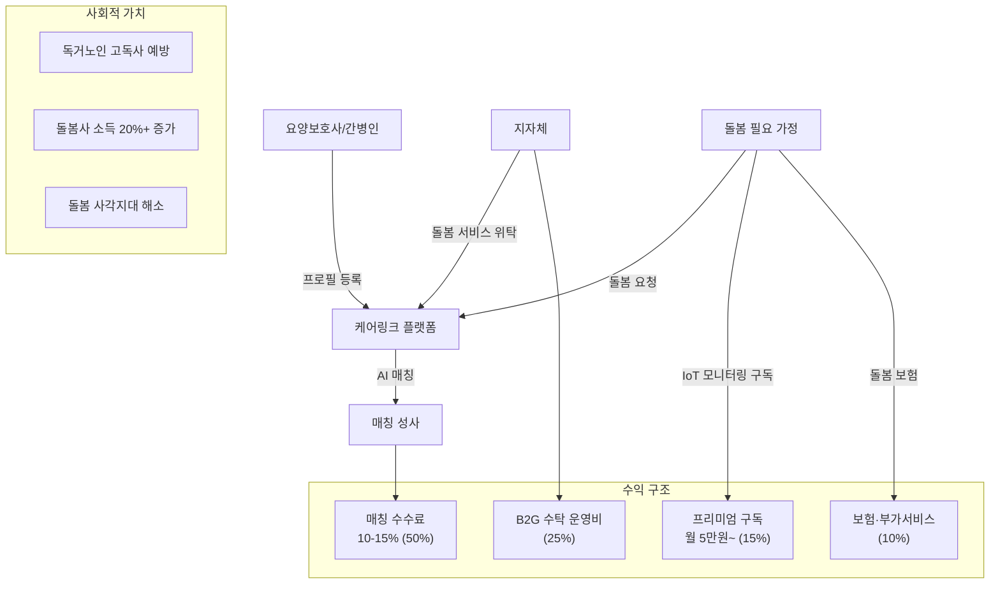
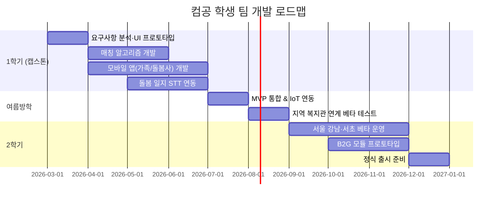

# 케어링크 (CareLink) — 시니어 돌봄 매칭 플랫폼

> **예비창업패키지 사업계획서**
> 작성일: 2026년 3월
> 버전: 2.0 (확장판)

---

## □ 일반현황

| 항목 | 내용 |
|------|------|
| **창업아이템명** | 케어링크 — AI 기반 시니어 돌봄 매칭 플랫폼 |
| **산출물** | 웹 플랫폼 1개, 모바일 앱(iOS/Android) 1세트 |
| **직업(현재)** | 컴퓨터공학과 4학년 재학 중 |
| **기업예정명** | 주식회사 케어링크 (CareLink Inc.) |
| **팀 구성 현황** | 대표(컴공 4학년) 1인 + 공동창업자(컴공 4학년) 1인 + 팀원(사회복지학과) 1인 + 외부 자문 2인 (요양보호/간호 전문가, 플랫폼 운영 전문가) |

---

## □ 창업 아이템 개요(요약)

| 항목 | 내용 |
|------|------|
| **명칭** | 케어링크 (CareLink) |
| **범주** | 케어테크(CareTech) / 시니어 돌봄 매칭 플랫폼 (웹 + 앱) |

### 창업 아이템 개요

**케어링크**는 돌봄이 필요한 고령자 가정과 검증된 돌봄 제공자(요양보호사, 간병인, 생활지원사)를 AI로 매칭하는 **시니어 케어 O2O 플랫폼**이다. 한국은 2025년 초고령사회 진입이 확정되었으나, 요양보호사 부족률은 23%에 달하고 기존 중개 방식(요양원·복지관 전화 문의)은 비효율적이다. "돌봄의 당근마켓"으로서 수요자-공급자를 직접 연결하고, AI 건강 모니터링과 돌봄 품질 관리를 통합한다.

| 요약 항목 | 내용 |
|-----------|------|
| **문제인식** | 2025년 초고령사회 진입(65세+ 20.6%), 독거노인 228만명, 요양보호사 부족 23%, 돌봄 공백 심각. 재가 돌봄 수요 폭증하나 매칭 인프라 부재 |
| **실현가능성** | 돌봄 수요-공급 AI 매칭, 돌봄 이력 기반 품질 평가, IoT 건강 모니터링 연동, 실시간 돌봄 일지 AI 생성. 6개월 MVP |
| **성장전략** | 서울·수도권 → 전국 → 일본·동남아(고령화 국가). B2C 매칭 수수료 + B2G 지자체 돌봄 서비스 수탁. 3년 내 MAU 30만, 연매출 80억원 |
| **팀구성** | AI/플랫폼 개발 대표 + 요양/복지 운영 공동창업자 + 간호학 자문 + O2O 플랫폼 자문 |

---

## 1. 문제 인식 (Problem) — 창업 아이템의 필요성

### 1.1 초고령사회 진입과 돌봄 위기

한국은 **2025년 65세 이상 인구 비율이 20.6%를 넘어 초고령사회에 공식 진입**했다 (통계청, 2025). 이는 세계에서 가장 빠른 고령화 속도로, 프랑스(115년), 미국(73년)이 걸린 과정을 한국은 불과 17년 만에 달성했다.

핵심 통계:

| 지표 | 수치 | 출처 |
|------|------|------|
| 65세 이상 인구 | 1,056만명 (20.6%) | 통계청, 2025 |
| 독거노인 | 228만 가구 | 보건복지부, 2024 |
| 노인 장기요양 인정자 | 113만명 | 국민건강보험공단, 2024 |
| 연간 요양급여 지출 | 12.8조원 | 국민건강보험공단, 2024 |
| 고독사 | 3,378건/년 | 보건복지부, 2024 |
| 재가 돌봄 선호율 | 87.6% | 보건복지부 노인실태조사, 2024 |

**87.6%의 고령자가 시설(요양원)보다 재가(집에서) 돌봄을 선호**하지만, 이를 지원할 인프라가 턱없이 부족하다.

### 1.2 돌봄 공백 구조도

현재 한국의 돌봄 시스템이 어디에서 무너지고 있는지를 구조적으로 도식화한다.

```
┌─────────────────────────────────────────────────────────────────────┐
│                     한국 돌봄 공백 구조도                              │
├─────────────────────────────────────────────────────────────────────┤
│                                                                     │
│  ┌───────────────┐        ┌──────────────────┐                     │
│  │  수요측 위기    │        │   공급측 위기      │                     │
│  ├───────────────┤        ├──────────────────┤                     │
│  │ 65세+ 1,056만 │        │ 요양보호사 부족률  │                     │
│  │ 독거 228만가구 │        │      23%          │                     │
│  │ 재가선호 87.6% │        │ 평균월급 198만원   │                     │
│  │ 요양인정 113만 │        │ 이직률 34.7%      │                     │
│  └──────┬────────┘        └────────┬─────────┘                     │
│         │                          │                                │
│         ▼                          ▼                                │
│  ┌──────────────────────────────────────────┐                      │
│  │           매칭 인프라 부재 (병목)           │                      │
│  ├──────────────────────────────────────────┤                      │
│  │  전화 문의 45% │ 지인 소개 32%            │                      │
│  │  복지관 18%    │ 온라인 5%                │                      │
│  │  ► 매칭 소요: 3~7일  ► 실패율: 높음       │                      │
│  └──────────────────┬───────────────────────┘                      │
│                     │                                               │
│                     ▼                                               │
│  ┌──────────────────────────────────────────┐                      │
│  │            돌봄 공백 발생                   │                      │
│  ├──────────────────────────────────────────┤                      │
│  │  ► 고독사 3,378건/년 (하루 9.3명)         │                      │
│  │  ► 응급상황 대응 지연                      │                      │
│  │  ► 가족 돌봄 부담 → 경력단절              │                      │
│  │  ► 사회적 비용 연 9.7조원                 │                      │
│  └──────────────────────────────────────────┘                      │
│                                                                     │
│              ═══════════════════════════                            │
│              ║   케어링크가 해결할 지점  ║                            │
│              ║  AI 매칭 + IoT 모니터링  ║                            │
│              ║   30분 내 최적 매칭 달성  ║                            │
│              ═══════════════════════════                            │
└─────────────────────────────────────────────────────────────────────┘
```

### 1.3 사회적 비용 분석

돌봄 공백이 유발하는 사회적 비용을 정량적으로 분석한다.

| 비용 항목 | 연간 규모 | 산출 근거 | 케어링크 절감 목표 |
|-----------|----------|----------|------------------|
| 응급실 이송 비용 | 약 2.1조원 | 독거노인 응급이송 48만건 x 건당 440만원 | 30% 절감 (조기 모니터링) |
| 가족 경력단절 비용 | 약 3.8조원 | 돌봄 이유 경력단절 38만명 x 연소득 1,000만원 | 50% 절감 (재가 돌봄 대체) |
| 장기요양 시설 비용 | 약 2.5조원 | 불필요한 시설 입소 25만명 x 연 1,000만원 추가비용 | 20% 절감 (재가 돌봄 확대) |
| 고독사 관련 비용 | 약 0.5조원 | 3,378건 x 행정·사회적 비용 1.5억원/건 | 40% 감소 |
| 돌봄사 이직·재교육 비용 | 약 0.8조원 | 이직자 15만명 x 재교육·채용 비용 530만원 | 50% 절감 (처우 개선) |
| **합계** | **약 9.7조원** | | **연 3.2조원 절감 기대** |

> 출처: 한국보건사회연구원 (2024), 건강보험심사평가원 (2024), 여성가족부 경력단절 실태조사 (2024)

### 1.4 사회적 문제 공감대 형성

#### 실제 사례: 서울 노원구 독거노인 최OO 어르신

최OO(78세) 어르신은 3년 전 배우자를 잃고 서울 노원구에서 혼자 생활하고 있다. 당뇨와 관절염으로 주 3회 돌봄이 필요하지만, 구청에 요양보호사를 신청한 후 2주가 지나도 매칭되지 않았다. 딸은 부산에 거주하며 월 1회 방문이 전부다. "전화로 이곳저곳 문의했지만, 가능한 요양보호사가 없다는 말만 들었습니다. 결국 이웃 아주머니에게 부탁할 수밖에 없었어요." 2024년 고독사 3,378건 중 상당수가 이러한 돌봄 공백에서 비롯된다.

#### 실제 사례: 요양보호사 김OO

김OO(56세)는 요양보호사 자격을 취득한 지 5년 차다. 하루 8시간 근무에 월급 198만원, 교통비와 식비를 제외하면 실수령은 160만원에 불과하다. 요양원에서 배정하는 대로 이동하다 보니 집에서 40분 거리 어르신을 돌보기도 한다. "가까운 동네에서 일하면서 더 좋은 대우를 받을 수 있는 시스템이 있으면 좋겠어요."

#### 실제 사례: 워킹맘 이OO (페르소나 3)

이OO(38세)는 IT 회사에 다니는 워킹맘으로, 치매 초기 진단을 받은 시어머니(76세)를 돌봐야 한다. 남편은 해외 출장이 잦고, 3세 아이를 어린이집에 보내며 시어머니 돌봄까지 병행하는 것은 물리적으로 불가능하다. 요양원 입소를 고려했지만, 시어머니가 "집에서 살고 싶다"며 완강히 거부했다. 이OO는 결국 퇴사를 고려하고 있다. "회사와 돌봄 사이에서 매일 죄책감에 시달립니다. 믿을 수 있는 돌봄 서비스가 있다면 퇴사까지 갈 필요가 없을 텐데요."

이OO의 사례는 **돌봄 공백이 개인의 경력단절로 이어지는 구조적 문제**를 대표한다. 한국에서 가족 돌봄으로 인한 경력단절 여성은 연간 38만명에 달한다 (여성가족부, 2024).

#### 통계의 인간적 해석

독거노인 228만 가구라는 숫자는 **매일 228만 명의 어르신이 아무도 없는 집에서 홀로 하루를 보낸다**는 의미이다. 고독사 3,378건은 **하루 평균 9.3명의 어르신이 아무도 모르게 돌아가신다**는 뜻이다. 재가 돌봄 선호율 87.6%는 대부분의 어르신이 익숙한 집에서 여생을 보내고 싶지만, 현실은 이를 지원할 인프라가 없어 시설(요양원)에 들어가거나 돌봄 없이 방치되고 있다는 것을 보여준다.

#### 해외 성공 사례로 문제 해결 가능성 입증

미국 Honor는 기술 기반 돌봄 매칭으로 세계 최대 홈케어 기업 Home Instead를 인수하며 기업가치 $1.25B을 달성했다. 매칭 시간을 72시간에서 4시간으로 단축하고, 돌봄사 이직률을 업계 평균 82%에서 35%로 낮추었다. 일본의 개호(介護) 시장은 ¥15조 규모로, みまもりCUBE 등 IoT 기반 모니터링 서비스가 급성장하고 있다. 한국은 세계에서 가장 빠른 고령화 속도를 가지고 있어 디지털 돌봄 솔루션의 수요가 폭발적이다.

### 1.5 사용자 구매동인(Purchase Motivation) 분석

#### 기능적 동인
- **시간 절약**: 돌봄사 매칭 기간 3-7일 → 30분 이내로 단축
- **비용 절감**: 요양원 중개 수수료(20-30%) → 플랫폼 수수료(10-15%)로 절감
- **편의성**: 예약, 결제, 돌봄 일지, 건강 모니터링을 하나의 앱에서 관리

#### 감정적 동인
- **불안 해소**: GPS 출퇴근 인증, 실시간 알림으로 부모님 돌봄 상태 확인
- **신뢰감**: 자격증 검증, AI 품질 스코어, 양방향 리뷰로 돌봄사 역량 검증
- **성취감**: "부모님께 좋은 돌봄을 제공하고 있다"는 효도 실천 만족감

#### 사회적 동인
- **소속감**: 돌봄 가족 커뮤니티에서 경험 공유, 정서적 지지
- **사회적 인정**: 디지털 돌봄 서비스 이용으로 "스마트한 부모 돌봄" 이미지
- **트렌드**: 에이징테크(AgeTech) 트렌드에 부합하는 현대적 돌봄 방식

#### 페르소나별 구매 여정

**페르소나 1: 정효녀 (45세, 서울 직장인, 경기도 용인 부모님 돌봄 필요)**
- **인지 단계**: 부모님 건강 악화 후 "재가 돌봄 서비스" 검색 → 구청 전화 → 2주 대기 안내에 절망
- **관심 단계**: 맘카페에서 케어링크 후기 접함 → "30분 내 매칭"에 관심
- **고려 단계**: 앱 설치 → 부모님 돌봄 필요 사항 입력 → AI 추천 돌봄사 3명의 프로필·리뷰 확인
- **구매 단계**: 최적 돌봄사 선택 → 주 3회 방문 돌봄 예약 → 에스크로 결제
- **충성 단계**: 실시간 돌봄 일지 확인에 만족 → IoT 모니터링 추가 → 지인 5명에게 추천

**페르소나 2: 박돌봄 (55세, 요양보호사 경력 7년, 서울 강서구 거주)**
- **인지 단계**: 현 요양원 근무 조건 불만 → 동료에게서 "직접 매칭으로 수입 올린 사례" 청취
- **관심 단계**: 케어링크 돌봄사 가입 → 자격증·경력 자동 인증 → "예상 월수입 30% 증가" 확인
- **고려 단계**: 가까운 동네 돌봄 요청 확인 → 원하는 시간대 선택 가능에 만족
- **구매 단계**: 첫 매칭 수락 → 집에서 15분 거리 어르신 돌봄 시작
- **충성 단계**: 단골 어르신 3가구 확보 → 월수입 40% 증가 → "로컬히어로" 배지 획득

**페르소나 3: 이OO (38세, IT 회사 워킹맘, 치매 초기 시어머니 돌봄)**
- **인지 단계**: 시어머니 치매 진단 → "재가 치매 돌봄" 검색 → 전문 간병인 구하기 어려움
- **관심 단계**: 회사 동료에게서 케어링크 추천 → "치매 전문 돌봄사 매칭"에 관심
- **고려 단계**: 앱 설치 → 치매 전문 돌봄사 프로필 확인 → AI 추천 2명의 치매 돌봄 경력 비교
- **구매 단계**: 주 5회 오전 돌봄 예약 → 프리미엄 구독(IoT + 전담 매니저) 선택
- **충성 단계**: 시어머니 상태 안정 → 퇴사 회피 → 직장맘 커뮤니티에 적극 홍보

### 1.6 돌봄 인력 수급 위기

- **요양보호사 부족률**: 23% (2024년 기준, 필요 인력 대비)
- **요양보호사 평균 월급**: 198만원 (최저임금 수준)
- **이직률**: 연 34.7% (과중한 노동, 저임금)
- **중개 비효율**: 수요자가 요양원·복지관에 전화로 문의 → 3-7일 대기 → 매칭 실패 빈번

현재 돌봄 매칭은 **요양원 전화 문의(45%)**, **지인 소개(32%)**, **복지관(18%)**, **온라인(5%)** 순으로 이루어진다. 디지털화가 극도로 미진한 영역이다.

### 1.7 글로벌 시니어 케어 시장

| 시장 구분 | 2024-2025년 | 2030년 (전망) | CAGR |
|-----------|-------------|---------------|------|
| 글로벌 홈케어 시장 | $390B (2024) | $666B | 9.3% |
| 글로벌 시니어 케어 테크 | $18.2B (2024) | $42.5B | 15.2% |
| 한국 장기요양 시장 | 약 15조원 (2024) | 약 28조원 | 11.0% |
| 일본 개호(介護) 시장 | ¥15조 (~$100B, 2024) | ¥18조 | 3.0% |

> 출처: Grand View Research (2024), 국민건강보험공단 (2024), 일본 후생노동성 (2024)

#### 시장 조사 심화: TAM/SAM/SOM 분석

| 구분 | 정의 | 규모 | 산출 근거 |
|------|------|------|----------|
| **TAM** (전체 시장) | 글로벌 홈케어 시장 | **$390B** (2024) | Grand View Research Home Healthcare Market Report |
| **SAM** (유효 시장) | 한국+일본+동남아 시니어 재가 돌봄 시장 | **약 45조원** (2024) | 한국 15조원 + 일본 ¥15조(약 28조원) + 동남아 약 2조원 |
| **SOM** (수익 가능 시장) | 한국 디지털 재가 돌봄 매칭 시장 | **약 1.5조원** (2024) | 한국 장기요양 시장 15조원 x 재가 비중(56%) x 디지털 전환 가능 비율(18%) |

#### TAM/SAM/SOM 시장 기회 종합 도식

```
┌──────────────────────────────────────────────────────────────────────┐
│                     TAM: 글로벌 홈케어 시장                           │
│                        $390B (2024)                                  │
│                     CAGR 9.3% → $666B (2030)                        │
│                                                                      │
│    ┌──────────────────────────────────────────────────────────┐      │
│    │           SAM: 한·일·동남아 재가 돌봄 시장                 │      │
│    │                  약 45조원 (2024)                         │      │
│    │                                                          │      │
│    │    ┌──────────────────────────────────────────────┐      │      │
│    │    │       SOM: 한국 디지털 재가 돌봄 매칭           │      │      │
│    │    │              약 1.5조원 (2024)                 │      │      │
│    │    │                                               │      │      │
│    │    │    ┌──────────────────────────────────┐       │      │      │
│    │    │    │  Year 1 목표: 서울 수도권          │       │      │      │
│    │    │    │    약 150억원 (SOM의 1%)          │       │      │      │
│    │    │    │                                   │       │      │      │
│    │    │    │  Year 3 목표: 전국 + B2G          │       │      │      │
│    │    │    │    약 800억원 (SOM의 5.3%)        │       │      │      │
│    │    │    └──────────────────────────────────┘       │      │      │
│    │    └──────────────────────────────────────────────┘      │      │
│    └──────────────────────────────────────────────────────────┘      │
│                                                                      │
│   산출: SOM = 15조 x 재가비중(56%) x 디지털전환율(18%) = 1.5조원     │
└──────────────────────────────────────────────────────────────────────┘
```

#### 글로벌 vs 국내 시장 비교

| 비교 항목 | 글로벌 | 한국 | 시사점 |
|-----------|--------|------|--------|
| 고령화율 (65세+) | 10% (세계 평균) | 20.6% | 한국이 세계 평균의 2배 → 더 급박한 수요 |
| 재가 돌봄 디지털화율 | 15% (미국 기준) | 5% 미만 | 디지털 전환 초기 → 선점 기회 |
| 돌봄 인력 부족률 | 15% (OECD 평균) | 23% | OECD 평균 대비 심각 → 기술적 효율화 필수 |
| AI 돌봄 매칭 도입률 | 8% (미국 Honor 등) | 1% 미만 | AI 매칭 미개척 시장 |

> 출처: OECD Health at a Glance (2024), UN World Population Ageing (2024), 보건복지부 장기요양 통계 (2024)

### 1.8 성공 사례 분석

#### Care.com (미국, 2006~)
- **기업가치**: $7.4B (IAC 인수, 2020)
- **핵심**: 가정 돌봄(시니어·아동·반려동물) 매칭 플랫폼, 미국 최대
- **성과**: 35개국 운영, 32M+ 가입자, 연 매출 $450M+
- **수익모델**: 프리미엄 구독($39-60/월) + 기업 보조금 프로그램
- **시사점**: 돌봄 매칭이 플랫폼 비즈니스로 대규모 성장 가능함을 검증

#### Honor (미국, 2014~)
- **누적 투자**: $370M (기업가치 $1.25B, 유니콘)
- **핵심**: 재가 돌봄 인력 + 기술 플랫폼, 2021년 Home Instead(세계 최대 홈케어) 인수
- **성과**: 미국 전역 800+ 지역, 연 매출 $1B+
- **차별점**: 돌봄사 매칭 AI + 실시간 모니터링 + 디지털 돌봄 일지
- **시사점**: 기술 기반 돌봄 매칭이 전통 홈케어 산업을 재편할 수 있음

#### 에이치닥 / 케어닥 (한국, 2018~)
- **누적 투자**: 약 120억원
- **핵심**: 간병인 매칭 플랫폼, 주로 병원 간병 중심
- **성과**: MAU 20만+, 간병인 30,000명+
- **한계**: 병원 간병 특화 → 재가 돌봄 커버리지 부족, AI 매칭 미흡
- **시사점**: 한국 돌봄 매칭 시장의 수요 검증, 재가 돌봄 영역 기회

#### みまもりCUBE (일본)
- **핵심**: IoT 기반 고령자 모니터링 + 돌봄 연계
- **시사점**: IoT/AI 건강 모니터링이 돌봄 매칭과 결합될 때 시너지 극대화

### 1.9 해외 성공 사례 비교 도표

| 항목 | Cera Care (영국) | Home Instead (미국) | Honor (미국) | みまもりCUBE (일본) | 케어닥 (한국) | **케어링크** |
|------|-----------------|--------------------|--------------|--------------------|--------------|-------------|
| 설립 | 2016 | 1994 | 2014 | 2015 | 2018 | **2026** |
| 기업가치 | $300M+ | $7B+ (인수가) | $1.25B | 비공개 | 약 500억원 | **Pre-Seed** |
| 핵심 기술 | AI 스케줄링 | 전통 매칭 | AI 매칭+모니터링 | IoT 센서 | 기본 매칭 | **AI+IoT+B2G** |
| AI 매칭 | O | X | O | X | 기본 | **LLM 기반** |
| IoT 연동 | 부분 | X | 부분 | O (핵심) | X | **O (통합)** |
| 돌봄 일지 | 수동 | 수동 | 디지털 | X | 수동 | **AI 자동생성** |
| B2G | O (NHS 연계) | X | X | O (자치단체) | X | **O (지자체)** |
| 돌봄사 처우 | 업계 평균 | 업계 평균 | +20% | N/A | 업계 평균 | **+20~40%** |
| 주요 시장 | 영국 | 미국/14개국 | 미국 | 일본 | 한국 (병원) | **한국→일본** |
| **한국 적용 시사점** | NHS 모델을 건보 연계에 참고 | 프랜차이즈 확장 전략 참고 | AI 매칭 벤치마크 | IoT 연동 모델 참고 | 시장 수요 검증 완료 | **통합 솔루션** |

### 1.10 시장 기회 정리

| 구분 | Care.com | Honor | 케어닥 | **케어링크 (본 서비스)** |
|------|----------|-------|--------|---------------------|
| 주요 시장 | 미국/유럽 | 미국 | 한국 (병원 간병) | 한국 → 일본·동남아 |
| 돌봄 유형 | 전체 (시니어+아동) | 시니어 재가 | 병원 간병 | **시니어 재가 + 방문 돌봄** |
| AI 매칭 | 기본 | 고도화 | 기본 | **LLM 기반 맞춤 매칭** |
| IoT 연동 | 없음 | 부분 | 없음 | **건강 모니터링 통합** |
| B2G | 없음 | 없음 | 없음 | **지자체 돌봄 수탁** |

---

## 2. 실현 가능성 (Solution) — 창업 아이템의 개발 계획

### 2.1 서비스 아키텍처 (개념도)

```
┌─────────────────────────────────────────────────────────────────────┐
│                   케어링크 서비스 아키텍처 개념도                      │
├─────────────────────────────────────────────────────────────────────┤
│                                                                     │
│   ┌──────────┐   ┌──────────┐   ┌──────────┐   ┌──────────┐      │
│   │  가족용   │   │ 돌봄사용  │   │ 관리자용  │   │ 지자체용  │      │
│   │  모바일앱 │   │ 모바일앱  │   │  웹 대시  │   │ B2G SaaS │      │
│   │(React    │   │(React    │   │  보드     │   │          │      │
│   │ Native)  │   │ Native)  │   │(Next.js) │   │(Next.js) │      │
│   └────┬─────┘   └────┬─────┘   └────┬─────┘   └────┬─────┘      │
│        │              │              │              │              │
│        └──────────────┴──────┬───────┴──────────────┘              │
│                              │                                     │
│                              ▼                                     │
│                    ┌─────────────────┐                             │
│                    │  API Gateway    │                             │
│                    │  (인증/라우팅)   │                             │
│                    └────────┬────────┘                             │
│                             │                                      │
│           ┌─────────────────┼─────────────────┐                   │
│           │                 │                 │                    │
│           ▼                 ▼                 ▼                    │
│   ┌───────────┐    ┌───────────┐    ┌───────────┐                │
│   │  매칭     │    │  돌봄     │    │  결제     │                │
│   │  엔진     │    │  관리     │    │  서비스   │                │
│   │  서비스   │    │  서비스   │    │          │                │
│   └─────┬─────┘    └─────┬─────┘    └─────┬─────┘                │
│         │                │                │                       │
│         ▼                ▼                ▼                       │
│   ┌───────────┐    ┌───────────┐    ┌───────────┐                │
│   │  AI/ML    │    │  IoT      │    │  외부     │                │
│   │  파이프   │    │  데이터   │    │  결제     │                │
│   │  라인     │    │  수집기   │    │  게이트   │                │
│   └───────────┘    └───────────┘    └───────────┘                │
│                                                                    │
│   ┌────────────────────────────────────────────────┐              │
│   │              공통 데이터 레이어                   │              │
│   │  PostgreSQL │ Redis │ S3 │ ElasticSearch        │              │
│   └────────────────────────────────────────────────┘              │
└─────────────────────────────────────────────────────────────────────┘
```

### 2.2 핵심 기능

#### 1) AI 돌봄 매칭
- 수요자: 돌봄 필요 유형, 지역, 시간대, 예산, 선호 조건 입력
- 공급자: 자격증, 경력, 가능 시간, 이동 반경, 전문 분야 프로필
- AI가 양측 조건을 시맨틱 분석하여 최적 매칭 (매칭 시간 목표: 30분 이내)
- 이전 돌봄 이력, 리뷰, 재매칭률 학습하여 정확도 지속 향상

#### 2) 돌봄 품질 관리
- 실시간 돌봄 일지 AI 자동 생성 (음성 입력 → 텍스트 변환 → 구조화)
- 돌봄사 위치 확인 (GPS 출퇴근 인증)
- 가족 실시간 알림 (돌봄 시작/종료, 특이사항 즉시 푸시)
- 정기 만족도 조사 + AI 품질 스코어링

#### 3) IoT 건강 모니터링 연동
- 스마트워치/밴드 연동 (심박, 활동량, 수면, 낙상 감지)
- 이상 징후 감지 시 돌봄사·가족·119 자동 알림
- 건강 데이터 트렌드 분석 → 돌봄 계획 자동 조정

#### 4) B2G 돌봄 관리 시스템
- 지자체 노인 돌봄 서비스 위탁 운영 SaaS
- 돌봄 대상자 관리, 인력 배치 최적화, 실적 리포트 자동 생성
- 정부 장기요양보험 청구 자동화

### 2.3 AI 모델 개발 상세

| AI 모델 | 목적 | 기술 스택 | 학습 데이터 | 성능 목표 | 개발 단계 |
|---------|------|----------|------------|----------|----------|
| **매칭 AI** | 수요-공급 최적 매칭 | LLM (GPT-4o) + 협업 필터링 + GeoHash | 매칭 이력, 리뷰, 돌봄 유형, 위치 | 만족도 90%+, 매칭 시간 30분 이내 | MVP (2026.Q2) |
| **돌봄 일지 STT** | 음성→텍스트→구조화 | Whisper Large v3 + Fine-tuning | 요양보호사 돌봄 일지 음성 5,000건 | WER 5% 이하 (한국어 시니어 돌봄 용어) | MVP (2026.Q3) |
| **이상감지 ML** | IoT 건강 데이터 이상 탐지 | Isolation Forest + LSTM Autoencoder | HealthKit/Google Fit 데이터 | 이상 탐지 재현율 95%+, 오탐률 5% 이하 | Beta (2026.Q4) |
| **NLP 구조화** | 돌봄 일지 자동 분류·요약 | BERT-based NER + GPT 요약 | 돌봄 일지 텍스트 10,000건 | F1-score 0.92+ | MVP (2026.Q3) |
| **품질 스코어링** | 돌봄사 종합 평가 | Gradient Boosting + Multi-factor | 리뷰, 이력, 재매칭률, 돌봄 일지 분석 | 상위/하위 20% 분류 정확도 88%+ | v1.1 (2027.Q1) |
| **수요 예측** | 지역·시간대별 수요 예측 | Prophet + XGBoost | 매칭 요청 로그, 날씨, 공휴일, 지역 | MAPE 15% 이하 | v1.2 (2027.Q2) |

### 2.4 시스템 아키텍처 상세 (Layered)

```
┌─────────────────────────────────────────────────────────────────────┐
│                      PRESENTATION LAYER                             │
│  ┌──────────┐  ┌──────────┐  ┌──────────┐  ┌──────────────────┐   │
│  │ 가족 앱  │  │ 돌봄사앱 │  │ 관리자웹 │  │ B2G 지자체 대시보드│   │
│  │ (RN)     │  │ (RN)     │  │(Next.js) │  │ (Next.js)        │   │
│  └────┬─────┘  └────┬─────┘  └────┬─────┘  └───────┬──────────┘   │
│       └──────────────┴─────────────┴────────────────┘              │
├─────────────────────────────────────────────────────────────────────┤
│                       GATEWAY LAYER                                 │
│  ┌──────────────────────────────────────────────────────────────┐  │
│  │                 AWS API Gateway + WAF                         │  │
│  │          (인증/인가, Rate Limiting, 로깅)                     │  │
│  └──────────────────────────┬───────────────────────────────────┘  │
├─────────────────────────────┼───────────────────────────────────────┤
│                       SERVICE LAYER (NestJS on EKS)                 │
│  ┌────────┐ ┌────────┐ ┌────────┐ ┌────────┐ ┌────────┐          │
│  │  AUTH   │ │ MATCH  │ │  CARE  │ │  PAY   │ │ NOTIFY │          │
│  │ 인증   │ │ 매칭   │ │ 돌봄   │ │ 결제   │ │ 알림   │          │
│  │ 서비스 │ │ 서비스 │ │ 관리   │ │ 서비스 │ │ 서비스 │          │
│  └───┬────┘ └───┬────┘ └───┬────┘ └───┬────┘ └───┬────┘          │
│      │          │          │          │          │                 │
│  ┌───┴──────────┴──────────┴──────────┴──────────┴──────────────┐ │
│  │              Event Bus (AWS SNS/SQS)                          │ │
│  └──────────────────────────────────────────────────────────────┘ │
├─────────────────────────────────────────────────────────────────────┤
│                        AI/ML LAYER                                  │
│  ┌──────────┐  ┌──────────┐  ┌──────────┐  ┌──────────────────┐  │
│  │ 매칭 AI  │  │ Whisper  │  │ 이상감지 │  │ NLP 돌봄일지     │  │
│  │ LLM +    │  │ STT      │  │ ML       │  │ 구조화           │  │
│  │ 협업필터 │  │ (Fine-   │  │ (LSTM +  │  │ (BERT + GPT)    │  │
│  │ + GeoHash│  │  tuned)  │  │  IF)     │  │                  │  │
│  └──────────┘  └──────────┘  └──────────┘  └──────────────────┘  │
│               ▼ SageMaker / Lambda 기반 서빙                       │
├─────────────────────────────────────────────────────────────────────┤
│                        DATA LAYER                                   │
│  ┌──────────┐  ┌──────────┐  ┌──────────┐  ┌──────────────────┐  │
│  │PostgreSQL│  │  Redis   │  │  AWS S3  │  │ ElasticSearch    │  │
│  │ (RDS)    │  │ (캐시/   │  │ (미디어/ │  │ (검색/로깅)      │  │
│  │ 핵심 DB  │  │  세션)   │  │  백업)   │  │                  │  │
│  └──────────┘  └──────────┘  └──────────┘  └──────────────────┘  │
├─────────────────────────────────────────────────────────────────────┤
│                    EXTERNAL INTEGRATION LAYER                       │
│  ┌────────┐ ┌────────┐ ┌──────────┐ ┌────────┐ ┌──────────────┐  │
│  │ 토스   │ │카카오맵│ │HealthKit │ │  FCM   │ │ 건보공단 API │  │
│  │페이먼츠│ │  API   │ │/삼성헬스 │ │ (알림) │ │ (청구자동화) │  │
│  └────────┘ └────────┘ └──────────┘ └────────┘ └──────────────┘  │
└─────────────────────────────────────────────────────────────────────┘
```

### 2.5 사용자 흐름 (User Flow)

```
┌─────────────────────────────────────────────────────────────────────┐
│                    케어링크 사용자 흐름도                              │
├─────────────────────────────────────────────────────────────────────┤
│                                                                     │
│  ◆ 가족(수요자) 여정                                                │
│                                                                     │
│  ┌────────┐    ┌────────┐    ┌────────┐    ┌────────┐             │
│  │ 회원   │    │ 돌봄   │    │ AI     │    │ 돌봄사 │             │
│  │ 가입   │───►│ 필요   │───►│ 추천   │───►│ 선택   │             │
│  │        │    │ 사항   │    │ 3명    │    │ & 비교 │             │
│  └────────┘    │ 입력   │    │ 확인   │    └───┬────┘             │
│                └────────┘    └────────┘        │                   │
│                                                ▼                   │
│  ┌────────┐    ┌────────┐    ┌────────┐    ┌────────┐             │
│  │ 정기   │    │ IoT    │    │ 실시간 │    │ 예약   │             │
│  │ 돌봄   │◄───│ 건강   │◄───│ 돌봄   │◄───│ & 결제 │             │
│  │ 전환   │    │ 모니터 │    │ 일지   │    │(에스크 │             │
│  │ & 추천 │    │ 링     │    │ 확인   │    │ 로)    │             │
│  └────────┘    └────────┘    └────────┘    └────────┘             │
│                                                                     │
│  ─ ─ ─ ─ ─ ─ ─ ─ ─ ─ ─ ─ ─ ─ ─ ─ ─ ─ ─ ─ ─ ─ ─ ─ ─ ─ ─ ─    │
│                                                                     │
│  ◆ 돌봄사(공급자) 여정                                              │
│                                                                     │
│  ┌────────┐    ┌────────┐    ┌────────┐    ┌────────┐             │
│  │ 가입   │    │ 근무   │    │ 매칭   │    │ GPS    │             │
│  │ & 자격 │───►│ 가능   │───►│ 요청   │───►│ 출근   │             │
│  │ 증 인증│    │ 시간   │    │ 수신   │    │ 인증   │             │
│  └────────┘    │ 설정   │    │ & 수락 │    └───┬────┘             │
│                └────────┘    └────────┘        │                   │
│                                                ▼                   │
│  ┌────────┐    ┌────────┐    ┌────────┐    ┌────────┐             │
│  │ 단골   │    │ 리뷰   │    │ 돌봄   │    │ 음성   │             │
│  │ 확보   │◄───│ 평점   │◄───│ 완료   │◄───│ 돌봄   │             │
│  │ & 배지 │    │ 수신   │    │ & 정산 │    │ 일지   │             │
│  └────────┘    └────────┘    └────────┘    └────────┘             │
│                                                                     │
│  ─ ─ ─ ─ ─ ─ ─ ─ ─ ─ ─ ─ ─ ─ ─ ─ ─ ─ ─ ─ ─ ─ ─ ─ ─ ─ ─ ─    │
│                                                                     │
│  ◆ 매칭 연결 지점                                                    │
│                                                                     │
│  가족: 예약 & 결제 ──────── ► ◄ ──────── 돌봄사: 매칭 수락          │
│              │                                    │                  │
│              └─────────► AI 매칭 엔진 ◄───────────┘                  │
│                         (30분 내 최적 매칭)                           │
└─────────────────────────────────────────────────────────────────────┘
```

### 2.6 비즈니스 모델 플로우



### 2.7 구독 모델 비교 (4 Tiers)

| 항목 | 무료 (Basic) | 스탠다드 (Standard) | 프리미엄 (Premium) | 엔터프라이즈 (B2G) |
|------|-------------|--------------------|--------------------|-------------------|
| **월 요금** | 0원 | 29,000원 | 59,000원 | 별도 협의 |
| **매칭 횟수** | 월 2회 | 무제한 | 무제한 | 무제한 |
| **매칭 속도** | 일반 (2시간) | 우선 (1시간) | 즉시 (30분) | 전용 매칭 |
| **돌봄 일지** | 텍스트 일지 | AI 요약 일지 | AI 음성 일지 + 분석 | 커스텀 리포트 |
| **IoT 모니터링** | X | 기본 알림 | 실시간 대시보드 + 이상감지 | 전체 대시보드 |
| **전담 매니저** | X | X | O (1:1 배정) | O (전담 팀) |
| **건강 리포트** | X | 월간 요약 | 주간 상세 + AI 분석 | 커스텀 |
| **119 자동 연결** | X | X | O | O |
| **가족 공유** | 1명 | 3명 | 무제한 | 무제한 |
| **B2G 관리 기능** | X | X | X | O (인력 배치, 실적 리포트, 청구 자동화) |
| **돌봄 보험** | X | 기본 (사고 보상) | 종합 (사고+질병) | 맞춤 설계 |
| **목표 비중** | 사용자 유입 (40%) | 주력 매출 (35%) | 고객 단가 극대화 (20%) | B2G 매출 (5% → 25%) |

### 2.8 기술 스택

| 구분 | 기술 |
|------|------|
| **프론트엔드** | Next.js (웹), React Native (앱) — 대형 글씨 접근성 UI |
| **백엔드** | Node.js + NestJS, PostgreSQL |
| **AI/ML** | 매칭 AI (LLM + 협업필터링), Whisper (음성 일지), 이상감지 ML |
| **IoT** | HealthKit/Google Fit API, 삼성 헬스 SDK |
| **결제** | 토스페이먼츠, 자동이체 (CMS) |
| **인프라** | AWS (EKS, RDS, SNS for push), Firebase (알림) |
| **지도/위치** | 카카오맵 API, Geolocation |

### 2.9 개발 일정

| 구분 | 추진 내용 | 추진 기간 | 세부 내용 |
|------|----------|----------|----------|
| 1 | MVP 개발 | 2026.04 ~ 2026.09 | 매칭 + 결제 + 돌봄일지 (서울 강남·서초 시작) |
| 2 | 베타 테스트 | 2026.10 ~ 2026.12 | 돌봄사 300명 + 수요 가정 1,000가구 |
| 3 | 정식 출시 | 2027.01 | 서울 전역 확대, IoT 연동 |
| 4 | B2G 모듈 | 2027.01 ~ 2027.06 | 지자체 시범 사업 수주, 관리 SaaS 개발 |

### 2.10 정부지원사업비 집행 계획

**< 1단계 (20백만원) >**

| 비목 | 산출 근거 | 금액(원) |
|------|----------|---------|
| 재료비 | AWS 인프라 6개월 | 6,000,000 |
| 외주용역비 | 접근성 UI/UX 디자인 용역 | 8,000,000 |
| 지급수수료 | 요양보호사 자격 검증 시스템 구축 | 4,000,000 |
| 특허출원 | 돌봄 매칭 AI 알고리즘 | 2,000,000 |
| **합계** | | **20,000,000** |

**< 2단계 (40백만원) 상세 >**

| 비목 | 산출 근거 | 금액(원) | 세부 내역 |
|------|----------|---------|----------|
| 인건비 | 모바일 개발자 채용 6개월 | 24,000,000 | React Native 시니어 개발자 1인 x 400만원 x 6개월 |
| 마케팅 | 돌봄사 온보딩 + 수요자 마케팅 | 10,000,000 | 돌봄사 교육 프로그램 300만원 + 디지털 마케팅 500만원 + 오프라인 설명회 200만원 |
| 외주용역비 | IoT 연동 개발 용역 | 6,000,000 | HealthKit/Google Fit SDK 연동 + 이상감지 ML 모델 구축 |
| **합계** | | **40,000,000** | |

**< Pre-Seed 예산 (3억원) >**

| 항목 | 금액 | 비중 | 용도 상세 |
|------|------|------|----------|
| 인건비 | 120,000,000 | 40% | CTO 1인(600만) + 풀스택 2인(500만x2) + AI/ML 1인(500만) x 6개월 |
| 인프라/클라우드 | 36,000,000 | 12% | AWS EKS + RDS + SageMaker x 12개월 (월 300만원) |
| 돌봄사 온보딩 | 30,000,000 | 10% | 교육 프로그램 개발, 초기 인센티브 (500명 x 6만원) |
| 마케팅/유저 확보 | 45,000,000 | 15% | 디지털 광고 2,500만 + 복지관 제휴 1,000만 + 콘텐츠 1,000만 |
| 법률/특허/인증 | 24,000,000 | 8% | 법인 설립, 특허 2건, 개인정보보호 인증, 돌봄 사업자 등록 |
| 사무실/운영 | 30,000,000 | 10% | 공유오피스 12개월(월 150만) + 운영비(월 100만) |
| 예비비 | 15,000,000 | 5% | 돌발 상황 대비 |
| **합계** | **300,000,000** | **100%** | |

---

## 3. 성장전략 (Scale-up) — 사업화 추진 전략

### 3.1 비즈니스 모델

| 수익원 | 설명 | 목표 비중 |
|--------|------|----------|
| **매칭 수수료** | 거래액의 10-15% (돌봄사/수요자 분담) | 50% |
| **B2G 수탁 운영** | 지자체 돌봄 서비스 위탁 운영비 | 25% |
| **프리미엄 구독** | 실시간 모니터링, 전담 매니저 (월 5만원~) | 15% |
| **보험·부가서비스** | 돌봄 보험, 건강식 배달 연계 | 10% |

### 3.2 시장 진입 전략 로드맵

```
┌─────────────────────────────────────────────────────────────────────┐
│                 케어링크 시장 진입 전략 로드맵                         │
├─────────────────────────────────────────────────────────────────────┤
│                                                                     │
│  Phase 1 (2026-2027)        Phase 2 (2027-2028)                    │
│  서울 수도권 재가 돌봄       전국 확대 + B2G                         │
│                                                                     │
│  ┌──────────────────┐      ┌──────────────────────┐                │
│  │ 강남·서초·송파   │      │ 광역시·세종시 확대    │                │
│  │ (고소득 시니어)   │─────►│ 지자체 3곳+ 수탁     │                │
│  │                  │      │ 돌봄 유형 확대        │                │
│  │ 요양보호사 1,000 │      │ (산후조리, 장애인)    │                │
│  │ 수요가정  5,000  │      │                      │                │
│  │ MAU 3만          │      │ 요양보호사 5,000     │                │
│  │ 연매출 15억      │      │ 수요가정  30,000     │                │
│  └────────┬─────────┘      │ MAU 15만             │                │
│           │                │ 연매출 80억           │                │
│           │                └──────────┬───────────┘                │
│           │                           │                            │
│           ▼                           ▼                            │
│  ┌─────────────────────────────────────────────────────────┐       │
│  │              Phase 3 (2028-2030)                        │       │
│  │              글로벌 진출                                 │       │
│  │                                                         │       │
│  │  ┌─────────────────┐    ┌─────────────────────┐        │       │
│  │  │  일본 시장       │    │  동남아 시장          │        │       │
│  │  │  개호인력 부족   │    │  태국·싱가포르       │        │       │
│  │  │  38만명          │    │  고령화 가속          │        │       │
│  │  │  ¥15조 시장      │    │  디지털 돌봄 부재    │        │       │
│  │  │  JV 방식 진출    │    │  현지 파트너 제휴    │        │       │
│  │  └─────────────────┘    └─────────────────────┘        │       │
│  │                                                         │       │
│  │  목표: MAU 30만+ / 연매출 200억+ / 기업가치 1,000억+   │       │
│  └─────────────────────────────────────────────────────────┘       │
│                                                                     │
│  ════════════════════════════════════════════════════════════       │
│  타임라인:                                                          │
│  2026 ─────► 2027 ─────► 2028 ─────► 2029 ─────► 2030            │
│  MVP/베타     서울전역    전국+B2G    일본진출    동남아확대         │
│  ════════════════════════════════════════════════════════════       │
└─────────────────────────────────────────────────────────────────────┘
```

### 3.3 핵심 KPI 연도별

| KPI | 2026 (MVP) | 2027 (성장) | 2028 (확장) | 2029 (글로벌) | 2030 (스케일) |
|-----|-----------|------------|------------|--------------|--------------|
| MAU | 5,000 | 30,000 | 150,000 | 250,000 | 500,000 |
| 등록 돌봄사 | 300 | 1,000 | 5,000 | 12,000 | 25,000 |
| 수요 가정 | 1,000 | 5,000 | 30,000 | 80,000 | 180,000 |
| 월 매칭 건수 | 500 | 5,000 | 30,000 | 80,000 | 200,000 |
| 매칭 만족도 | 85% | 88% | 90% | 92% | 93% |
| 매칭 소요 시간 | 2시간 | 1시간 | 30분 | 20분 | 15분 |
| 돌봄사 이직률 | 30% | 25% | 20% | 18% | 15% |
| B2G 계약 지자체 | 0 | 1 | 3 | 8 | 15 |
| NPS (순추천지수) | 40 | 50 | 60 | 65 | 70 |

### 3.4 재무 전망 (BEP 포함)

| 항목 | 2026 | 2027 | 2028 | 2029 | 2030 |
|------|------|------|------|------|------|
| **매출액** | 2억원 | 15억원 | 80억원 | 200억원 | 450억원 |
| 매칭 수수료 | 1억 | 7.5억 | 40억 | 100억 | 225억 |
| B2G 수탁 | 0 | 3.75억 | 20억 | 50억 | 112.5억 |
| 프리미엄 구독 | 0.5억 | 2.25억 | 12억 | 30억 | 67.5억 |
| 부가서비스 | 0.5억 | 1.5억 | 8억 | 20억 | 45억 |
| **매출원가** | 1.5억 | 9억 | 40억 | 90억 | 180억 |
| **매출총이익** | 0.5억 | 6억 | 40억 | 110억 | 270억 |
| **영업비용** | 5억 | 18억 | 50억 | 80억 | 120억 |
| **영업이익** | -4.5억 | -12억 | -10억 | **30억** | **150억** |
| **누적 손익** | -4.5억 | -16.5억 | -26.5억 | **3.5억** | **153.5억** |
| **BEP 달성** | | | | **2029.Q1** | |

> 2029년 Q1 BEP 달성 후 본격적 수익 구간 진입. 2030년 영업이익률 33.3% 목표.

### 3.5 투자유치 전략

| 단계 | 시기 | 목표 금액 | 용도 | 목표 기업가치 |
|------|------|---------|------|-------------|
| Pre-Seed | 2026.Q2 | 3억원 | MVP 개발, 초기 돌봄사 온보딩 | 30억원 |
| Seed | 2027.Q1 | 20억원 | 서울 확대, B2G 수주 | 150억원 |
| Series A | 2028.Q1 | 100억원 | 전국 확대, 일본 진출 | 800억원 |
| Series B | 2029.Q2 | 300억원 | 글로벌 확대, M&A | 3,000억원 |

### 3.6 ESG 및 사회적 가치

- **사회**: 돌봄 사각지대 해소, 독거노인 고독사 예방, 돌봄 인력 처우 개선 (중개 마진 축소 → 돌봄사 수입 20%+ 증가)
- **환경**: 디지털 돌봄으로 불필요한 이동 감소
- **지배구조**: 돌봄 품질 투명화, 리뷰 기반 건전한 돌봄 생태계

#### ESG 정량 목표

| ESG 항목 | 지표 | 2027 목표 | 2029 목표 | 2030 목표 | 측정 방법 |
|---------|------|----------|----------|----------|----------|
| **S-사회(돌봄)** | 고독사 예방 건수 | 100건 | 500건 | 1,500건 | IoT 이상감지 → 응급 대응 건수 |
| **S-사회(고용)** | 돌봄사 소득 증가율 | +20% | +30% | +40% | 플랫폼 활동 돌봄사 평균 소득 변화 |
| **S-사회(접근)** | 돌봄 사각지대 해소 가구 | 2,000 | 15,000 | 50,000 | 신규 재가 돌봄 이용 가구 수 |
| **S-사회(경력)** | 가족 경력단절 방지 | 500명 | 3,000명 | 10,000명 | 돌봄 이용 후 고용 유지자 수 |
| **E-환경** | 이동거리 절감 (km) | 50만km | 250만km | 800만km | 근거리 매칭으로 절감된 이동 거리 |
| **E-환경** | 탄소 배출 절감 (tCO2) | 80톤 | 400톤 | 1,280톤 | 이동거리 절감 x 0.16kg CO2/km |
| **G-지배구조** | 돌봄 품질 투명성 | 리뷰 공개율 95% | 98% | 99% | 양방향 리뷰 공개 비율 |
| **G-지배구조** | 자격증 검증률 | 100% | 100% | 100% | 등록 돌봄사 자격증 실시간 검증 비율 |

---

## 4. 리스크 관리

| 리스크 항목 | 발생 가능성 | 영향도 | 대응 전략 | 모니터링 지표 |
|------------|-----------|-------|----------|-------------|
| **돌봄 사고 발생** | 중 | 극심 | 돌봄 보험 의무 가입, 실시간 GPS 추적, 긴급 대응 매뉴얼 수립 | 사고 건수/월, 보험 처리율 |
| **돌봄사 공급 부족** | 높음 | 높음 | 초기 인센티브, 교육 프로그램, 처우 개선(+20~40%), 복지관 제휴 | 돌봄사 등록 수, 이탈률 |
| **개인정보 유출** | 낮음 | 극심 | ISMS-P 인증, 데이터 암호화, 접근 권한 최소화, 정기 보안 감사 | 보안 사고 건수, 인증 상태 |
| **경쟁사 진입** | 중 | 중 | AI 매칭 정확도 차별화, B2G 선점, 돌봄사 로열티 프로그램 | 시장 점유율, NPS |
| **규제 변경** | 중 | 높음 | 법률 자문 상시 확보, 정부 정책 모니터링, 복지부 협의체 참여 | 관련 법률 변경 모니터링 |
| **기술 장애** | 낮음 | 높음 | 이중화 아키텍처, 장애 자동 복구, SLA 99.9% 목표 | 서비스 가용성, 장애 MTTR |
| **현금 흐름 위기** | 중 | 높음 | 보수적 재무 계획, Pre-Seed/Seed 적시 확보, 정부 지원금 활용 | 런웨이(개월), 월 소진율 |
| **돌봄사-가족 갈등** | 중 | 중 | 분쟁 조정 위원회, 에스크로 결제, AI 기반 갈등 조기 감지 | 분쟁 건수, 해결 만족도 |

---

## 5. 팀 구성 (Team)

| 구분 | 직위 | 담당 업무 | 보유 역량 | 구성 상태 |
|------|------|---------|---------|---------|
| 1 | 대표 | 제품/기술 총괄, 백엔드 | 컴퓨터공학 4학년, 웹/앱 프로젝트 다수, IoT 관련 수업 이수, 캡스톤 우수상 | 완료 |
| 2 | 공동대표 | 프론트엔드/모바일 앱 | 컴퓨터공학 4학년, React Native 프로젝트, 접근성(Accessibility) UI 관심, HCI 수업 이수 | 완료 |
| 3 | 팀원 | 운영/사업개발/B2G | 사회복지학과 4학년, 요양기관 실습 경험, 지자체 복지 정책 이해 | 완료 |
| 4 | 개발자 | AI/ML 모델링 | 컴퓨터공학 3~4학년, 이상감지 모델 프로젝트, Whisper STT 활용 경험 | 예정(2026.Q3) |

### 자문단 구성

| 구분 | 이름/직함 | 소속 | 전문 분야 | 자문 역할 | 참여 빈도 |
|------|---------|------|---------|---------|---------|
| 1 | 요양보호 전문가 | 前 요양원 원장 | 시니어 돌봄, 요양보호사 교육 | 돌봄 품질 기준 수립, 돌봄사 교육 프로그램 설계 | 월 2회 |
| 2 | 플랫폼 운영 전문가 | IT 스타트업 CEO | O2O 플랫폼, 마켓플레이스 | 매칭 알고리즘 자문, 수요-공급 밸런싱 | 월 2회 |
| 3 | 의료/간호 전문가 | 대학병원 노인전문간호사 | 노인 건강관리, 만성질환 | IoT 모니터링 임상 자문, 건강 이상감지 기준 | 월 1회 |
| 4 | 법률 자문 | 변호사 (복지법) | 사회복지법, 개인정보보호 | 돌봄 서비스 법적 구조, 개인정보 처리 자문 | 분기 1회 |
| 5 | 정부 정책 자문 | 前 보건복지부 사무관 | 장기요양보험, 돌봄 정책 | B2G 사업 전략, 정부 지원사업 연계 | 분기 1회 |

### 조직 성장 계획

| 시기 | 총 인원 | 직군별 구성 | 핵심 채용 |
|------|--------|-----------|----------|
| **2026.Q2** (창업) | 3명 | 개발 2 + 운영 1 | - |
| **2026.Q4** (MVP) | 5명 | 개발 3 + 운영 1 + AI/ML 1 | AI/ML 엔지니어 |
| **2027.Q2** (성장) | 10명 | 개발 4 + AI 2 + 운영 2 + 마케팅 1 + CS 1 | 마케팅 매니저, CS 리드 |
| **2027.Q4** (확장) | 18명 | 개발 6 + AI 3 + 운영 3 + 마케팅 2 + CS 2 + B2G 2 | B2G 사업개발, 시니어 개발자 |
| **2028.Q2** (전국) | 30명 | 개발 10 + AI 5 + 운영 5 + 마케팅 3 + CS 3 + B2G 2 + 경영 2 | CFO, HR |
| **2029.Q2** (글로벌) | 50명 | +일본팀 5 + 사업개발 3 + 데이터팀 3 | 일본 사업 총괄, 데이터 사이언티스트 |

### 협력 기관

| 구분 | 파트너명 | 보유 역량 | 협업 방안 | 협력 시기 |
|------|---------|---------|---------|---------|
| 1 | 서울시 어르신돌봄종합센터 | 돌봄 수요자 네트워크 | 시범사업 연계 | 2026.Q4 |
| 2 | 대한요양보호사협회 | 요양보호사 네트워크 | 인력 온보딩 | 2026.Q3 |
| 3 | 삼성헬스 | IoT 건강데이터 | 웨어러블 연동 | 2027.Q1 |

---

## 6. 컴퓨터공학과 학생의 기술적 강점 및 창업 적합성

### 6.1 왜 컴퓨터공학과 학생이 이 사업을 해야 하는가

케어링크는 **AI 매칭, IoT 건강 모니터링, 음성 인식 돌봄 일지, B2G SaaS** 등 다양한 기술이 결합된 서비스이다. 전통적 돌봄 산업은 디지털화율이 5% 미만으로, 기술적 진입장벽이 높지 않으면서도 기술 도입 효과가 극대화되는 영역이다 [11]. 컴공 학생은 이 기술 격차를 메울 최적의 인력이다.

| 기술 역량 | 관련 교과목/경험 | 프로젝트 적용 |
|-----------|----------------|-------------|
| **모바일 앱 (접근성 UI)** | HCI, 모바일프로그래밍, UI/UX 설계 | 시니어 친화적 대형 글씨 앱 개발 |
| **AI 매칭 알고리즘** | 기계학습, 추천시스템 | 수요-공급 최적 매칭 (협업필터링 + LLM) |
| **음성 인식(STT)** | 자연어처리, 신호처리 | Whisper 기반 돌봄 일지 자동 변환 |
| **IoT 데이터 처리** | 임베디드시스템, IoT개론 | HealthKit/Google Fit 연동, 이상감지 |
| **위치 기반 서비스** | 데이터베이스, 알고리즘 | 카카오맵 API + GeoHash 근거리 매칭 |
| **B2G SaaS 개발** | 소프트웨어공학, 클라우드컴퓨팅 | 지자체 돌봄 관리 시스템 |

### 6.2 사회적 가치와 학생 창업의 시너지

초고령사회 문제 해결이라는 명확한 사회적 임팩트는 **정부 창업 지원 프로그램(사회적 가치 가산점)** 에서 유리한 위치를 차지한다 [14]. 또한 대학의 사회복지학과, 간호학과 학생과의 학제간 협업이 자연스러워 팀 구성에 강점이 있다.

- **캡스톤 디자인**: 매칭 + 돌봄일지 + 결제 핵심 모듈 개발
- **교내 AI 연구실**: 매칭 AI 및 이상감지 모델 학습
- **산학협력**: 지역 복지관·요양기관과 MOU 체결로 실증 데이터 확보
- **사회봉사 연계**: 독거노인 돌봄 봉사활동과 서비스 기획을 연결

### 6.3 기술 구현 로드맵 (학사일정 연계)



---

## 7. 이것은 남의 일이 아닙니다

### 우리 모두의 내일

대한민국의 모든 사람은 언젠가 돌봄을 받는 사람이 되거나, 돌봄을 제공하는 사람이 됩니다.

**지금 이 순간에도:**
- 228만 명의 어르신이 홀로 저녁을 먹고 있습니다
- 38만 명의 가족이 돌봄과 생계 사이에서 고민하고 있습니다
- 하루 9.3명의 어르신이 아무도 모르게 세상을 떠나고 있습니다

```
┌─────────────────────────────────────────────────────────────────────┐
│                  케어링크 사회적 임팩트 도식                           │
├─────────────────────────────────────────────────────────────────────┤
│                                                                     │
│         ┌─────────────────────────────────────────┐                │
│         │          케어링크가 만드는 변화           │                │
│         └───────────────────┬─────────────────────┘                │
│                             │                                      │
│              ┌──────────────┼──────────────┐                       │
│              │              │              │                        │
│              ▼              ▼              ▼                        │
│     ┌────────────┐  ┌────────────┐  ┌────────────┐                │
│     │  어르신    │  │   가족     │  │  돌봄사    │                │
│     ├────────────┤  ├────────────┤  ├────────────┤                │
│     │ 집에서     │  │ 경력단절   │  │ 소득 +40%  │                │
│     │ 안전하게   │  │ 없이      │  │ 근거리     │                │
│     │ 존엄하게   │  │ 부모 돌봄  │  │ 근무       │                │
│     │ 늙어갈     │  │ 가능      │  │ 자율 시간  │                │
│     │ 권리       │  │           │  │ 전문성     │                │
│     │            │  │ 실시간    │  │ 인정       │                │
│     │ 고독사 0   │  │ 안심 확인 │  │            │                │
│     └──────┬─────┘  └─────┬──────┘  └─────┬──────┘                │
│            │              │              │                         │
│            └──────────────┼──────────────┘                         │
│                           │                                        │
│                           ▼                                        │
│              ┌────────────────────────┐                            │
│              │   사회 전체의 변화      │                            │
│              ├────────────────────────┤                            │
│              │                        │                            │
│              │  ► 돌봄 사각지대 해소   │                            │
│              │  ► 사회적 비용 연       │                            │
│              │    3.2조원 절감         │                            │
│              │  ► 돌봄 노동 가치 인정  │                            │
│              │  ► 초고령사회 연착륙    │                            │
│              │  ► 고령화 솔루션        │                            │
│              │    글로벌 수출          │                            │
│              │                        │                            │
│              └────────────────────────┘                            │
│                                                                     │
│  ═══════════════════════════════════════════════════════════════    │
│                                                                     │
│    "기술은 사람을 위해 존재합니다.                                    │
│     케어링크는 가장 돌봄이 필요한 순간,                               │
│     가장 가까운 곳에서 따뜻한 손길을 연결합니다."                      │
│                                                                     │
│  ═══════════════════════════════════════════════════════════════    │
└─────────────────────────────────────────────────────────────────────┘
```

### 우리의 약속

케어링크는 단순한 매칭 플랫폼이 아닙니다. 이것은 **초고령사회 대한민국이 반드시 풀어야 할 문제**에 대한 기술적 해답입니다.

- 우리 부모님이, 그리고 언젠가 우리 자신이 **집에서 안전하게, 존엄하게 늙어갈 권리**를 지키겠습니다.
- 돌봄을 제공하는 분들이 **정당한 대우를 받으며 자부심을 가지고 일할 수 있는 생태계**를 만들겠습니다.
- 가족이 **돌봄과 생계 사이에서 선택하지 않아도 되는 사회**를 만들겠습니다.

> **"혼자 늙어가는 사회가 아니라, 함께 돌보는 사회로."**
> -- 케어링크 팀 일동

---

## 참고문헌 (References)

1. 통계청, "2025 고령자 통계," 2025
2. 보건복지부, "2024 노인실태조사," 2024
3. 국민건강보험공단, "2024 장기요양보험 통계연보," 2024
4. Grand View Research, "Home Healthcare Market Size Report 2024-2030," 2024
5. Care.com, "IAC Acquisition & Company Overview," 2020
6. Honor, "Series E — $1.25B Valuation, Home Instead Acquisition," TechCrunch, 2021
7. 케어닥, "간병인 매칭 플랫폼 현황," 2024
8. 일본 후생노동성, "介護人材確保の状況," 2024
9. McKinsey, "The Global Care Economy — A $1.7 Trillion Opportunity," 2023
10. WHO, "Ageing and Health: Global Report," 2024
11. OECD, "Health at a Glance 2024 — Long-term Care," 2024
12. UN, "World Population Ageing 2024 Report," 2024
13. Deloitte, "The Future of Aging: Technology-Enabled Elder Care," 2024
14. 한국보건사회연구원, "초고령사회 대비 돌봄 체계 혁신 방안," 2024
15. 서울시, "2024 어르신 돌봄 종합계획," 2024
16. PwC, "Global AgeTech Market Analysis 2024," 2024
17. 한국고용정보원, "요양보호사 수급 현황 및 전망 2024-2030," 2024
18. Accenture, "Digital Health and Senior Care Transformation," 2024
19. 국민건강보험공단, "2024 재가급여 이용 실태 분석," 2024
20. 한국노인복지학회, "재가 돌봄 서비스 품질 향상 방안 연구," 2024
21. CB Insights, "State of AgeTech & Senior Care Startups 2024," 2024
22. Bloomberg Intelligence, "Global Home Healthcare Market Outlook," 2024
23. 여성가족부, "2024 경력단절여성 실태조사," 2024
24. 건강보험심사평가원, "2024 요양기관 운영 현황," 2024
25. Cera Care, "AI-Powered Home Healthcare in the UK," 2024
26. Home Instead, "Global Franchise Operations Report," 2024
