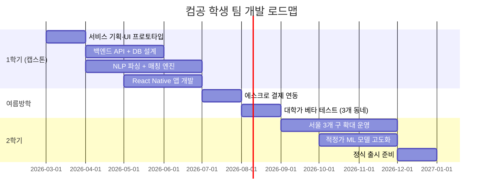

# 로컬히어로 (LocalHero) — 동네 생활 서비스 매칭 플랫폼

> **예비창업패키지 사업계획서**
> 작성일: 2026년 3월
> 버전: 2.0 (심화판)

---

## □ 일반현황

| 항목 | 내용 |
|------|------|
| **창업아이템명** | 로컬히어로 — AI 기반 동네 생활 서비스 매칭 플랫폼 |
| **산출물** | 모바일 앱(iOS/Android) 1세트, 웹 플랫폼 1개 |
| **직업(현재)** | 컴퓨터공학과 4학년 재학 중 |
| **기업예정명** | 주식회사 로컬히어로 (LocalHero Inc.) |
| **팀 구성 현황** | 대표(컴공 4학년) 1인 + 공동창업자(컴공 4학년) 1인 + 팀원(경영학과) 1인 + 외부 자문 2인 (O2O 플랫폼 전문가, 지역경제 전문가) |

---

## □ 창업 아이템 개요(요약)

| 항목 | 내용 |
|------|------|
| **명칭** | 로컬히어로 (LocalHero) |
| **범주** | 하이퍼로컬 O2O / 생활 서비스 매칭 플랫폼 |

### 창업 아이템 개요

**로컬히어로**는 동네 기반으로 생활 서비스 제공자(수리, 청소, 이사, 레슨, 심부름 등)와 수요자를 실시간 매칭하는 **하이퍼로컬 서비스 마켓플레이스**이다. 당근마켓이 "중고물건"의 동네 거래를 혁신했다면, 로컬히어로는 **"사람의 기술과 시간"의 동네 거래**를 혁신한다. AI가 요청 내용을 분석하여 반경 3km 내 최적 서비스 제공자를 30분 내 매칭하고, 에스크로 결제와 리뷰 시스템으로 신뢰를 보장한다.

| 요약 항목 | 내용 |
|-----------|------|
| **문제인식** | 한국 가사서비스 시장 40조원이나 90%가 비공식 경제(지인소개·전단지). 1인가구 981만(2025), 맞벌이 64.6%로 생활서비스 수요 폭증하나 신뢰할 수 있는 매칭 인프라 부재 |
| **실현가능성** | NLP 기반 요청 자동 분류, 위치 기반 실시간 매칭, 에스크로 결제, 양방향 리뷰. 6개월 MVP |
| **성장전략** | 서울 → 전국 → 동남아·일본. 서비스 수수료 15-20%. 3년 내 MAU 100만, 연매출 300억원 |
| **팀구성** | 풀스택/AI 개발 대표 + O2O 운영 공동창업자 + 플랫폼 자문 + 지역경제 자문 |

---

## 1. 문제 인식 (Problem) — 창업 아이템의 필요성

### 1.1 생활 서비스 문제 구조도

```
┌─────────────────────────────────────────────────────────────────────────┐
│                   생활 서비스 시장의 구조적 문제                          │
├─────────────────────────────────────────────────────────────────────────┤
│                                                                         │
│   ┌──────────────┐    ┌──────────────┐    ┌──────────────┐             │
│   │   수요자 측    │    │   공급자 측    │    │   시장 구조    │             │
│   │   Pain Point  │    │   Pain Point  │    │   문제        │             │
│   ├──────────────┤    ├──────────────┤    ├──────────────┤             │
│   │ • 가격 불투명  │    │ • 저가 경쟁   │    │ • 90% 비공식  │             │
│   │   (62%)       │    │   압박        │    │   경제        │             │
│   │ • 품질 불확실  │    │ • 고객 확보   │    │ • 디지털화율  │             │
│   │   (54%)       │    │   어려움      │    │   10% 미만    │             │
│   │ • 예약 불편   │    │ • 이동 비효율  │    │ • 신뢰 인프라 │             │
│   │   (47%)       │    │   (넓은 범위)  │    │   부재        │             │
│   │ • 사후 보장 ✗ │    │ • 기술력 미인정│    │ • 소비자 보호 │             │
│   │   (39%)       │    │   (가격만 경쟁)│    │   장치 미비    │             │
│   └──────┬───────┘    └──────┬───────┘    └──────┬───────┘             │
│          │                   │                   │                      │
│          ▼                   ▼                   ▼                      │
│   ┌──────────────────────────────────────────────────────────┐         │
│   │              연간 36조원 규모의 비공식 거래                  │         │
│   │         가격 기준 ✗ │ 품질 보장 ✗ │ 소비자 보호 ✗           │         │
│   └──────────────────────────┬───────────────────────────────┘         │
│                              │                                          │
│                              ▼                                          │
│   ┌──────────────────────────────────────────────────────────┐         │
│   │         ► 로컬히어로: AI 매칭 + 에스크로 + 신뢰 시스템      │         │
│   │           → 30분 매칭, 적정가, 품질 보장, 하자보증           │         │
│   └──────────────────────────────────────────────────────────┘         │
└─────────────────────────────────────────────────────────────────────────┘
```

### 1.2 생활 서비스 시장의 디지털 사각지대

한국의 가사·생활 서비스 시장은 **약 40조원 규모**이지만 (통계청, 2024), **디지털화율은 10% 미만**이다. 에어컨 청소, 배관 수리, 이사, 과외, 집 청소 등 일상적 서비스의 대부분이 여전히 전단지, 지인 소개, 네이버 카페 글을 통해 거래된다.

| 서비스 유형 | 시장 규모 | 디지털 거래 비율 | 불만족률 |
|-----------|---------|---------------|---------|
| 청소/가사 | 8.2조원 | 12% | 41% |
| 수리/설치 | 6.5조원 | 8% | 52% |
| 이사 | 4.8조원 | 15% | 48% |
| 교육/레슨 | 12.3조원 | 18% | 35% |
| 돌봄/시터 | 5.7조원 | 9% | 43% |
| 기타 (심부름, 대행 등) | 2.5조원 | 5% | 38% |

> 출처: 통계청 서비스업 조사 (2024), 한국소비자원 생활서비스 만족도 조사 (2024)

**소비자 불만의 핵심**:
- **가격 불투명** (62%): 동일 서비스인데 업체마다 2-5배 가격 차이
- **품질 불확실** (54%): 업체 역량을 사전에 검증할 방법 없음
- **예약 불편** (47%): 전화 → 문자 → 방문일 조율에 평균 2.3일 소요
- **사후 보장 없음** (39%): 하자 발생 시 연락 두절

### 1.3 사회적 비용 분석

비공식 생활서비스 시장이 사회 전체에 끼치는 **숨은 비용**은 매우 크다. 다음은 주요 항목별 사회적 비용을 추정한 것이다.

| 사회적 비용 항목 | 연간 추정 규모 | 산출 근거 | 로컬히어로 절감 효과 |
|-----------------|-------------|----------|-------------------|
| **소비자 탐색 비용** | 2.8조원 | 981만 1인가구 × 연평균 12회 서비스 이용 × 탐색 시간 3.2시간 × 시급 7,500원 | AI 매칭으로 탐색 시간 90% 절감 |
| **가격 바가지 피해** | 1.5조원 | 비공식 거래 36조원 × 평균 과잉지불률 4.2% | AI 적정가 산정으로 과잉 지불 방지 |
| **서비스 하자 재시공** | 0.9조원 | 연간 서비스 건수 4.2억건 × 하자 발생률 8% × 평균 재시공 비용 2.7만원 | 품질 검증 + 하자보증으로 하자율 50% 감소 |
| **비공식 노동자 사회보험 미가입** | 3.2조원 | 비공식 서비스 제공자 약 180만명 × 미가입 사회적 비용 연 178만원 | 소득 투명화로 사회보험 가입 촉진 |
| **이동 비효율 탄소 비용** | 0.4조원 | 서비스 제공자 평균 이동거리 12km → 3km 단축 시 탄소 절감 + 시간 절감 | 반경 3km 최단거리 매칭 |
| **합계** | **약 8.8조원** | | **약 4.5조원 절감 가능** |

> 비공식 경제의 사회적 비용은 단순히 "불편"이 아니라 **연간 약 8.8조원의 비효율**이다. 로컬히어로는 이 중 절반 이상을 구조적으로 해소할 수 있다.

### 1.4 사회적 문제 공감대 형성

#### 실제 사례: 서울 마포구 1인가구 김OO (페르소나 1)

김OO(29세)는 서울 마포구 원룸에서 혼자 살고 있다. 화장실 수도꼭지가 고장 났을 때, 네이버에 "마포구 수도 수리"를 검색해 5곳에 전화했지만 2곳은 받지 않았고, 1곳은 "소액이라 방문 불가", 나머지 2곳은 견적이 5만원과 15만원으로 3배 차이가 났다. 결국 당근마켓에 글을 올렸지만 3일이 지나도 답변이 없었다. "그냥 양동이로 물을 받아쓰고 있어요. 믿을 수 있는 사람을 빨리 찾을 수 있으면 좋겠는데..."

#### 실제 사례: 성동구 에어컨 청소 기사 이OO (페르소나 2)

이OO(44세)는 15년 경력의 에어컨 전문 기사다. 기술력은 뛰어나지만 고객 확보는 전단지와 네이버 카페 글에 의존한다. 월 평균 20건 중 전단지로 오는 건 5건, 나머지는 단골 추천이다. "숨고에 등록했는데 견적 요청이 오면 다른 5-6명과 경쟁해야 해요. 대부분 최저가를 선택하니 제 기술력의 가치를 인정받지 못합니다."

#### 실제 사례: 관악구 대학가 고령 임대인 정OO (페르소나 3)

정OO(72세)는 관악구에서 원룸 4채를 임대하고 있다. 세입자들의 수리 요청이 월 3~4건씩 오지만, 과거에 연락했던 기사들이 은퇴하거나 번호가 바뀌어 매번 새로 찾아야 한다. 스마트폰은 카카오톡과 전화만 쓸 줄 안다. "아들이 멀리 사는데 매번 부를 수도 없고, 세입자한테 미안해서... 간단히 전화 한 통으로 믿을 수 있는 기사님이 와주면 좋겠어요." 로컬히어로의 **카카오 알림톡 기반 간편 요청 기능**은 정OO 같은 고령 사용자도 디지털 매칭의 혜택을 받을 수 있도록 설계되었다.

#### 통계의 인간적 해석

40조원 생활서비스 시장의 90%가 비공식 경제라는 것은, **매년 36조원 규모의 거래가 가격 기준도, 품질 보장도, 소비자 보호도 없이 이루어진다**는 의미이다. 1인가구 981만 가구는 **가족에게 도움을 청할 수 없는 사람들이 스스로 모든 생활 문제를 해결해야 한다**는 뜻이며, 이들의 52%가 수리·설치 서비스에 불만족하고 있다.

### 1.5 해외 성공 사례 비교 도표

| 비교 항목 | TaskRabbit (미국) | Thumbtack (미국) | Urban Company (인도) | 당근 (한국) | 숨고 (한국) | **로컬히어로** |
|-----------|-----------------|-----------------|--------------------|-----------|-----------|-----------:|
| **설립연도** | 2008 | 2008 | 2014 | 2015 | 2015 | **2026** |
| **기업가치** | IKEA 인수 ($75M) | $3.2B | $2.8B | 약 3조원 | 약 1,500억원 | **Pre-Seed** |
| **핵심 모델** | 일상 서비스 마켓 | 전문 서비스 리드 | 표준화 홈서비스 | 하이퍼로컬 커뮤니티 | 견적 입찰 | **AI 실시간 매칭** |
| **매칭 방식** | 프로필 검색 | 리드 당 과금 | 앱 직접 예약 | 게시판 | 견적 입찰 | **NLP+GeoHash 자동** |
| **매칭 시간** | 1~24시간 | 수시간~일 | 즉시~1시간 | 수시간~일 | 수시간~일 | **30분 이내** |
| **서비스 표준화** | 낮음 | 중간 | 높음 (교육) | 없음 | 낮음 | **높음 (AI+교육)** |
| **가격 투명성** | 시급 공개 | 업체별 상이 | 고정가 | 없음 | 업체별 상이 | **AI 적정가 산정** |
| **품질 관리** | 배경조회+리뷰 | 리뷰 | 교육+인증+리뷰 | 리뷰만 | 리뷰만 | **자격검증+AI스코어** |
| **결제 보호** | 에스크로 | 없음 | 인앱 결제 | 없음 | 부분 | **에스크로+하자보증** |
| **핵심 교훈** | 제품→서비스 연결 | 높은 객단가 | 표준화가 핵심 | 하이퍼로컬 신뢰 | 시장 수요 검증 | **통합 적용** |

> **로컬히어로의 차별적 포지션**: Urban Company의 서비스 표준화 + TaskRabbit의 일상 편의 + 당근의 하이퍼로컬 신뢰를 AI 기반으로 통합

### 1.6 사용자 구매동인(Purchase Motivation) 분석

#### 기능적 동인
- **시간 절약**: 서비스 업체 탐색 2.3일 → AI 매칭 30분 이내로 단축
- **비용 절감**: AI 적정가 산정으로 바가지 방지, 평균 23% 비용 절감 기대
- **편의성**: 자연어 입력("에어컨 청소 해주세요")만으로 자동 매칭·예약·결제 완료

#### 감정적 동인
- **불안 해소**: 본인 인증·범죄이력 조회·에스크로 결제로 안전한 거래
- **신뢰감**: AI 품질 스코어와 실 리뷰 기반으로 검증된 서비스 제공자 선택
- **성취감**: 깔끔하게 해결된 집 문제에 대한 만족감과 "잘 선택했다"는 뿌듯함

#### 사회적 동인
- **소속감**: 동네 기반 커뮤니티에서 "우리 동네 좋은 기사님" 정보 공유
- **사회적 인정**: 합리적 소비, 지역경제 활성화에 기여한다는 자부심
- **트렌드**: "귀찮은 건 외주" MZ세대 편의 소비 트렌드 합류

#### 페르소나별 구매 여정

**페르소나 1: 최싱글 (31세, 서울 성동구 1인가구, IT 직장인)**
- **인지 단계**: 세탁기 고장 → 네이버 검색 → 가격·품질 정보 불투명에 스트레스
- **관심 단계**: 친구 추천으로 로컬히어로 앱 설치 → "세탁기 수리" 입력 → 30분 내 기사 3명 매칭 확인
- **고려 단계**: 각 기사의 리뷰(4.8점), 경력(12년), 적정가(7만원) 확인 → 즉시 예약
- **구매 단계**: 당일 오후 기사 방문 → 수리 완료 → 에스크로 결제 → 하자보증 7일 안내
- **충성 단계**: 에어컨 청소, 배관 수리 등 반복 이용 → 정기 구독(월 1회 청소) 전환

**페르소나 2: 박기사 (47세, 서울 마포구, 인테리어 수리 전문 15년 경력)**
- **인지 단계**: 전단지·네이버 카페 의존 영업에 한계 → 동료에게서 "앱으로 고객 받는다" 청취
- **관심 단계**: 로컬히어로 제공자 가입 → 자격증·포트폴리오 등록 → "예상 월수입 250만원" 확인
- **고려 단계**: 반경 3km 내 요청만 받을 수 있는 점에 만족 → 이동 시간 절약
- **구매 단계**: 첫 매칭 수락 → 고객 리뷰 4.9점 → "로컬히어로" 배지 획득
- **충성 단계**: 단골 고객 20가구 확보 → 월수입 60% 증가 → 저가 경쟁 없이 기술력 인정

**페르소나 3: 정어르신 (72세, 관악구, 원룸 4채 임대인)**
- **인지 단계**: 세입자 수리 요청 → 기존 기사 연락 두절 → 아들에게 SOS → 며칠 지연
- **관심 단계**: 아들이 카카오톡으로 로컬히어로 링크 전송 → 알림톡 기반 간편 요청 경험
- **고려 단계**: "전화 한 통이면 된다"는 사실에 안도 → 기사 프로필 사진·리뷰 확인
- **구매 단계**: 수도 수리 요청 → 2시간 내 기사 방문 → 세입자 만족 피드백
- **충성 단계**: 정기 시설 점검 구독(월 1회) → "이제 아들한테 전화 안 해도 돼요"

### 1.7 구조적 수요 폭증

- **1인가구 981만 가구** (2025, 전체 가구의 41.2%) — 스스로 해결 어려운 서비스 수요 상승
- **맞벌이 가구 64.6%** (2024) — 시간 부족으로 생활서비스 외주화 가속
- **고령 가구 30%+** — 디지털 기기 활용이 어려운 세대에게 간편한 매칭 필요
- **MZ세대 편의 소비** — "귀찮은 건 외주" 트렌드, 가사서비스 이용률 MZ세대 연 38% 성장

### 1.8 글로벌 홈서비스 매칭 시장

| 시장 구분 | 2024-2025년 | 2030년 (전망) | CAGR |
|-----------|-------------|---------------|------|
| 글로벌 홈서비스 마켓플레이스 | $600B (2024) | $1.2T | 12.3% |
| 미국 홈서비스 시장 | $657B (2024) | $1.05T | 8.1% |
| 아시아태평양 홈서비스 | $180B (2024) | $420B | 15.2% |
| 한국 생활서비스 시장 | 약 40조원 (2024) | 약 65조원 | 8.4% |

> 출처: Grand View Research (2024), Statista Home Services Report (2025)

### 1.9 시장 기회 종합: TAM / SAM / SOM

```
┌─────────────────────────────────────────────────────────────────────────┐
│  TAM (Total Addressable Market)                                        │
│  글로벌 홈서비스 마켓플레이스: $600B (2024)                               │
│  ┌───────────────────────────────────────────────────────────────┐     │
│  │  SAM (Serviceable Available Market)                           │     │
│  │  한국+일본 생활서비스 디지털 매칭: 약 12조원                     │     │
│  │  ┌─────────────────────────────────────────────────────┐     │     │
│  │  │  SOM (Serviceable Obtainable Market)                 │     │     │
│  │  │  한국 수도권 하이퍼로컬 서비스 매칭: 약 2조원           │     │     │
│  │  │                                                      │     │     │
│  │  │  ┌────────────────────────────────────────────┐     │     │     │
│  │  │  │  Year 1 목표 시장                           │     │     │     │
│  │  │  │  서울 3개 구 × 3개 카테고리: 약 200억원      │     │     │     │
│  │  │  │  → 연 매출 목표: 10억원 (수수료 기준)        │     │     │     │
│  │  │  └────────────────────────────────────────────┘     │     │     │
│  │  └─────────────────────────────────────────────────────┘     │     │
│  └───────────────────────────────────────────────────────────────┘     │
└─────────────────────────────────────────────────────────────────────────┘
```

| 구분 | 정의 | 규모 | 산출 근거 |
|------|------|------|----------|
| **TAM** (전체 시장) | 글로벌 홈서비스 마켓플레이스 | **$600B** (2024) | Grand View Research Home Services Market Report |
| **SAM** (유효 시장) | 한국+일본 생활서비스 디지털 매칭 시장 | **약 12조원** (2024) | 한국 40조원 × 디지털 전환 비율(10%) + 일본 8조엔 × 디지털 전환 비율(12%) |
| **SOM** (수익 가능 시장) | 한국 수도권 하이퍼로컬 서비스 매칭 | **약 2조원** (2024) | 서울·수도권 생활서비스 시장 18조원 × 모바일 매칭 이용 가능 비율(11%) |

#### 글로벌 vs 국내 시장 비교

| 비교 항목 | 글로벌 | 한국 | 시사점 |
|-----------|--------|------|--------|
| 홈서비스 디지털화율 | 22% (미국 기준) | 10% 미만 | 한국 디지털 전환 잠재력 높음 |
| 1인가구 비율 | 29% (미국) | 41.2% | 한국의 서비스 외주화 수요가 더 높음 |
| 하이퍼로컬 플랫폼 침투율 | 35% (미국, Yelp/TaskRabbit 등) | 15% (당근마켓 서비스 영역) | 전문 매칭 플랫폼 기회 큼 |
| 서비스 불만족률 | 28% (미국 평균) | 43% (한국 평균) | 품질 개선 시 높은 전환율 기대 |

> 출처: Statista On-Demand Economy Report (2024), 한국소비자원 (2024), 통계청 1인가구 통계 (2025)

### 1.10 성공 사례 분석

#### TaskRabbit (미국, 2008~)
- **인수**: IKEA가 2017년 인수 (추정 $75M)
- **핵심**: "일상의 모든 일을 도와줄 사람을 찾는 플랫폼" — 가구 조립, 청소, 이사, 수리 등
- **성과**: 미국·영국·캐나다 등 8개국, 연간 300만+ 건 서비스 매칭
- **수익모델**: 서비스 수수료 15% + 신뢰&지원 요금($9.99/건)
- **시사점**: IKEA 인수로 "제품 구매 → 설치 서비스" 연결 모델의 가치 입증

#### Thumbtack (미국, 2008~)
- **누적 투자**: $698M (기업가치 $3.2B)
- **핵심**: 전문 서비스(배관, 전기, 리모델링 등) 매칭, "미국판 숨고"
- **성과**: 연간 $1B+ GMV, 300,000+ 서비스 프로바이더
- **수익모델**: 리드(고객 연결) 당 과금 ($15-300/리드)
- **시사점**: 전문 서비스 매칭으로 높은 객단가와 마진 확보

#### 당근마켓 / 당근 (한국, 2015~)
- **기업가치**: 약 3조원 (2022)
- **핵심**: 하이퍼로컬 중고거래 → 동네 커뮤니티 → 동네 서비스(당근알바, 동네업체)
- **성과**: MAU 1,800만+, 한국인 3명 중 1명 사용
- **시사점**: 하이퍼로컬 + 신뢰 커뮤니티 모델의 성공. 그러나 "서비스 매칭"은 아직 초기 단계 — 전문화 기회

#### 숨고 (한국, 2015~)
- **누적 투자**: 약 350억원
- **핵심**: 생활 서비스 전문가 매칭 (레슨, 이사, 인테리어 등)
- **성과**: 누적 요청 1,000만건+, 전문가 50만명+
- **한계**: 견적 요청 → 다수 전문가 응답 → 수요자 선택 구조 (매칭 시간 길고 스팸성 연락 多)
- **시사점**: 한국 시장 수요 검증, 그러나 UX/매칭 효율 개선 여지 大

#### Urban Company (인도, 2014~)
- **기업가치**: $2.8B (유니콘)
- **핵심**: 인도 최대 홈서비스 플랫폼 (미용, 청소, 수리, 전기)
- **성과**: 인도·UAE·싱가포르, 월 300만+ 건, 연 매출 $300M+
- **차별점**: 서비스 제공자 교육·인증 프로그램, 표준화된 서비스 품질
- **시사점**: 신흥 시장에서 서비스 표준화 + 품질 관리가 핵심 차별점

### 1.11 기존 서비스 Gap 분석

| 구분 | 당근 (동네서비스) | 숨고 | TaskRabbit | **로컬히어로** |
|------|---------------|------|------------|-------------|
| 매칭 방식 | 게시판 | 견적 입찰 (수동) | 프로필 검색 | **AI 실시간 자동 매칭** |
| 매칭 시간 | 수시간~일 | 수시간~일 | 1-24시간 | **30분 이내** |
| 가격 투명성 | 없음 | 업체마다 다름 | 시급 공개 | **AI 적정가 산정** |
| 품질 관리 | 리뷰만 | 리뷰만 | 배경 조회+리뷰 | **자격검증+AI품질스코어** |
| 결제 보호 | 없음 | 부분 | 에스크로 | **에스크로+하자보증** |
| 긴급 요청 | 불가 | 불가 | 일부 가능 | **1시간 이내 긴급 매칭** |

---

## 2. 실현 가능성 (Solution) — 창업 아이템의 개발 계획

### 2.1 서비스 아키텍처 개요

```
┌─────────────────────────────────────────────────────────────────────────┐
│                        로컬히어로 서비스 아키텍처                         │
├─────────────────────────────────────────────────────────────────────────┤
│                                                                         │
│  ┌──────────┐  ┌──────────┐  ┌──────────┐                              │
│  │ 수요자 앱 │  │ 제공자 앱 │  │ 관리 웹  │  ◄── 클라이언트 레이어       │
│  │ (RN)     │  │ (RN)     │  │ (Next.js)│                              │
│  └────┬─────┘  └────┬─────┘  └────┬─────┘                              │
│       │              │              │                                    │
│       ▼              ▼              ▼                                    │
│  ┌──────────────────────────────────────────┐                           │
│  │           API Gateway (AWS)              │  ◄── 인증/라우팅          │
│  │    Rate Limiting │ Auth │ Load Balance   │                           │
│  └──────────────────┬───────────────────────┘                           │
│                     │                                                    │
│       ┌─────────────┼──────────────┐                                    │
│       ▼             ▼              ▼                                    │
│  ┌─────────┐  ┌──────────┐  ┌──────────┐                              │
│  │ 매칭    │  │ 결제     │  │ 알림     │  ◄── 핵심 서비스              │
│  │ 서비스  │  │ 서비스   │  │ 서비스   │                              │
│  ├─────────┤  ├──────────┤  ├──────────┤                              │
│  │• NLP 파싱│  │• 에스크로│  │• FCM     │                              │
│  │• GeoHash│  │• 정산    │  │• 알림톡  │                              │
│  │• 스코어링│  │• 환불    │  │• SMS     │                              │
│  └────┬────┘  └────┬─────┘  └────┬─────┘                              │
│       │             │              │                                    │
│       ▼             ▼              ▼                                    │
│  ┌──────────────────────────────────────────┐                           │
│  │              AI / ML 레이어               │  ◄── 지능형 처리          │
│  │  ┌──────────┐ ┌──────────┐ ┌──────────┐ │                           │
│  │  │NLP 요청  │ │가격 예측 │ │추천 엔진 │ │                           │
│  │  │자동 파싱 │ │ML 모델  │ │(협업필터링)│ │                           │
│  │  │(GPT-4o) │ │(XGBoost)│ │          │ │                           │
│  │  └──────────┘ └──────────┘ └──────────┘ │                           │
│  └──────────────────┬───────────────────────┘                           │
│                     │                                                    │
│  ┌──────────────────┴───────────────────────┐                           │
│  │             데이터 레이어                   │  ◄── 저장/캐시          │
│  │  PostgreSQL │ Redis GEO │ Elasticsearch  │                           │
│  └──────────────────────────────────────────┘                           │
└─────────────────────────────────────────────────────────────────────────┘
```

### 2.2 핵심 기능

#### 1) AI 실시간 매칭 엔진
- 수요자가 자연어로 요청 입력 (예: "이번 주 토요일 에어컨 청소 해주실 분")
- NLP로 서비스 유형·일시·위치·예산 자동 파싱
- 반경 3km 내 가용한 서비스 제공자 실시간 탐색
- 매칭 스코어링: 거리(30%) + 리뷰(25%) + 전문성(25%) + 가격(20%)
- **매칭 목표: 일반 30분 이내, 긴급 1시간 이내**

#### 2) AI 적정가 산정
- 서비스 유형 × 지역 × 시간대 × 난이도별 빅데이터 기반 적정가 제시
- 바가지 방지 + 서비스 제공자 저가 경쟁 방지
- "이 지역 에어컨 청소 평균가: 5만-7만원" 실시간 표시

#### 3) 신뢰 시스템
- 서비스 제공자: 본인 인증 + 자격증 검증 + 범죄이력 조회 동의
- 서비스 완료 후 양방향 리뷰 + AI 품질 스코어
- 하자보증: 서비스 후 7일 내 하자 발생 시 재시공 or 환불

#### 4) 에스크로 결제
- 예약 시 결제 → 에스크로 보관 → 서비스 완료 확인 → 지급
- 분쟁 시 AI 1차 중재 → 운영팀 2차 중재
- 정기 서비스 구독 (주 1회 청소, 월 1회 에어컨 관리 등)

#### 5) 서비스 제공자 성장 프로그램
- 매출 대시보드, 리뷰 분석, 단골 고객 관리 도구
- 서비스 스킬업 교육 콘텐츠 (Urban Company 모델 벤치마킹)
- 우수 제공자 "로컬히어로" 배지 + 우선 노출

### 2.3 AI 모델 개발 상세

| AI 모델 | 목적 | 기술 스택 | 학습 데이터 | 성능 목표 | 개발 단계 |
|---------|------|----------|-----------|----------|----------|
| **NLP 요청 파싱** | 자연어 → 서비스 유형·일시·위치·예산 추출 | GPT-4o API + 후처리 규칙 | 서비스 요청 텍스트 10만건 (합성+실제) | 파싱 정확도 95%+ | MVP (2026.Q2) |
| **매칭 스코어링** | 최적 제공자 3명 추천 | 협업필터링 + GeoHash + 가중 스코어 | 매칭 이력·리뷰·거리·전문성 데이터 | 매칭 수락률 80%+ | MVP (2026.Q3) |
| **가격 예측** | 서비스별 적정가 실시간 산정 | XGBoost + 시계열 분석 | 서비스 거래가 50만건 (크롤링+파트너) | 적정가 범위 적중률 90%+ | Beta (2026.Q4) |
| **품질 스코어** | 제공자 종합 품질 점수 | 다변량 회귀 + NLP 리뷰 분석 | 리뷰 텍스트·별점·재이용률·클레임률 | 품질 예측 상관계수 0.85+ | V1.0 (2027.Q1) |
| **수요 예측** | 지역·시간별 서비스 수요 예측 | LSTM + Prophet | 거래 이력·날씨·계절·이벤트 데이터 | 수요 예측 오차 15% 이내 | V1.5 (2027.Q2) |
| **분쟁 자동 중재** | AI 1차 분쟁 판정 | LLM + 규칙 기반 판정 엔진 | 분쟁 사례·판정 결과 1만건 | 자동 해결률 60%+ | V2.0 (2027.Q3) |

### 2.4 시스템 아키텍처 상세 (Layered)

```
┌─────────────────────────────────────────────────────────────────────────┐
│                        시스템 아키텍처 상세                               │
├─────────────────────────────────────────────────────────────────────────┤
│                                                                         │
│  [ Presentation Layer ]                                                 │
│  ┌──────────────┐  ┌──────────────┐  ┌──────────────┐                  │
│  │ React Native │  │ React Native │  │   Next.js    │                  │
│  │  수요자 앱    │  │  제공자 앱    │  │  관리자 웹    │                  │
│  │  ─────────── │  │  ─────────── │  │  ─────────── │                  │
│  │ • 서비스 요청 │  │ • 매칭 수락  │  │ • 대시보드   │                  │
│  │ • 제공자 비교 │  │ • 일정 관리  │  │ • 분쟁 관리  │                  │
│  │ • 결제/리뷰  │  │ • 매출 관리  │  │ • 데이터 분석│                  │
│  └──────┬───────┘  └──────┬───────┘  └──────┬───────┘                  │
│         └─────────────────┼─────────────────┘                           │
│                           ▼                                              │
│  [ API Gateway Layer ]                                                  │
│  ┌──────────────────────────────────────────────────────────┐          │
│  │  AWS API Gateway + CloudFront CDN                        │          │
│  │  ├── JWT 인증 / OAuth 2.0                                │          │
│  │  ├── Rate Limiting (1000 req/min per user)               │          │
│  │  ├── Request Validation                                  │          │
│  │  └── WebSocket (실시간 매칭 상태 업데이트)                  │          │
│  └──────────────────────────┬───────────────────────────────┘          │
│                              ▼                                          │
│  [ Application Layer — NestJS Microservices ]                          │
│  ┌──────────┐ ┌──────────┐ ┌──────────┐ ┌──────────┐ ┌──────────┐   │
│  │  Auth    │ │ Matching │ │ Payment  │ │ Review   │ │ Notify   │   │
│  │ Service  │ │ Service  │ │ Service  │ │ Service  │ │ Service  │   │
│  ├──────────┤ ├──────────┤ ├──────────┤ ├──────────┤ ├──────────┤   │
│  │본인인증  │ │NLP파싱   │ │에스크로  │ │양방향리뷰│ │FCM Push  │   │
│  │자격검증  │ │GeoHash   │ │정산관리  │ │AI스코어  │ │알림톡    │   │
│  │JWT발급   │ │스코어링  │ │환불처리  │ │클레임    │ │이메일    │   │
│  └──────────┘ └──────────┘ └──────────┘ └──────────┘ └──────────┘   │
│         │           │           │           │           │              │
│         └───────────┴───────────┴───────────┴───────────┘              │
│                              ▼                                          │
│  [ AI/ML Layer ]                                                       │
│  ┌──────────────────────────────────────────────────────────┐          │
│  │  ┌─────────┐ ┌─────────┐ ┌─────────┐ ┌─────────┐      │          │
│  │  │ GPT-4o  │ │XGBoost  │ │ CF Rec  │ │ LSTM    │      │          │
│  │  │ NLP     │ │ Price   │ │ Engine  │ │ Demand  │      │          │
│  │  │ Parser  │ │Predict  │ │         │ │Forecast │      │          │
│  │  └─────────┘ └─────────┘ └─────────┘ └─────────┘      │          │
│  │  AWS SageMaker │ Lambda (추론) │ S3 (모델 저장)         │          │
│  └──────────────────────────────────────────────────────────┘          │
│                              ▼                                          │
│  [ Data Layer ]                                                        │
│  ┌──────────────────────────────────────────────────────────┐          │
│  │  ┌───────────┐ ┌───────────┐ ┌───────────┐ ┌─────────┐ │          │
│  │  │PostgreSQL │ │Redis GEO  │ │Elastic    │ │AWS SQS  │ │          │
│  │  │(RDS)      │ │(ElastiCa.)│ │Search     │ │(메시지큐)│ │          │
│  │  ├───────────┤ ├───────────┤ ├───────────┤ ├─────────┤ │          │
│  │  │사용자정보 │ │위치인덱싱 │ │검색/로그  │ │비동기   │ │          │
│  │  │거래이력   │ │세션캐시   │ │분석       │ │이벤트   │ │          │
│  │  │리뷰/평점  │ │실시간매칭 │ │모니터링   │ │처리     │ │          │
│  │  └───────────┘ └───────────┘ └───────────┘ └─────────┘ │          │
│  └──────────────────────────────────────────────────────────┘          │
│                              ▼                                          │
│  [ Infrastructure Layer ]                                              │
│  ┌──────────────────────────────────────────────────────────┐          │
│  │  AWS EKS (K8s) │ CloudWatch │ GitHub Actions CI/CD       │          │
│  │  Auto-scaling │ WAF │ Secrets Manager │ Route53          │          │
│  └──────────────────────────────────────────────────────────┘          │
└─────────────────────────────────────────────────────────────────────────┘
```

### 2.5 사용자 흐름 (User Flow)

```
┌─────────────────────────────────────────────────────────────────────────┐
│                          사용자 흐름도                                    │
├─────────────────────────────────────────────────────────────────────────┤
│                                                                         │
│  [ 수요자 흐름 ]                                                        │
│                                                                         │
│  ┌────────┐    ┌────────┐    ┌────────┐    ┌────────┐    ┌────────┐   │
│  │ 앱설치  │───►│ 위치   │───►│ 자연어  │───►│ AI자동  │───►│ 매칭된  │   │
│  │ & 가입  │    │ 인증   │    │ 요청   │    │ 파싱   │    │ 3명 확인│   │
│  └────────┘    └────────┘    └────────┘    └────────┘    └───┬────┘   │
│                                                               │        │
│                                              ┌────────────────┘        │
│                                              ▼                          │
│  ┌────────┐    ┌────────┐    ┌────────┐    ┌────────┐                  │
│  │ 하자   │◄───│ 리뷰   │◄───│ 서비스  │◄───│ 에스크로│                  │
│  │ 보증   │    │ 작성   │    │ 수행   │    │ 결제   │                  │
│  └───┬────┘    └────────┘    └────────┘    └────────┘                  │
│      │                                                                  │
│      ▼                                                                  │
│  ┌────────┐    ┌────────┐                                              │
│  │ 재이용  │───►│ 정기   │  ◄── 충성 루프                               │
│  │        │    │ 구독   │                                              │
│  └────────┘    └────────┘                                              │
│                                                                         │
│  ─ ─ ─ ─ ─ ─ ─ ─ ─ ─ ─ ─ ─ ─ ─ ─ ─ ─ ─ ─ ─ ─ ─ ─ ─ ─ ─ ─ ─ ─ ─  │
│                                                                         │
│  [ 서비스 제공자 흐름 ]                                                  │
│                                                                         │
│  ┌────────┐    ┌────────┐    ┌────────┐    ┌────────┐    ┌────────┐   │
│  │ 가입 & │───►│ 서비스  │───►│ 매칭   │───►│ 현장   │───►│ 완료   │   │
│  │자격등록 │    │지역설정 │    │요청수락│    │방문수행│    │인증정산│   │
│  └────────┘    └────────┘    └────────┘    └────────┘    └───┬────┘   │
│                                                               │        │
│                                              ┌────────────────┘        │
│                                              ▼                          │
│  ┌────────┐    ┌────────┐    ┌────────┐    ┌────────┐                  │
│  │ 우선   │◄───│ 배지   │◄───│ 단골   │◄───│ 리뷰   │                  │
│  │ 노출   │    │ 획득   │    │ 확보   │    │ 누적   │                  │
│  └────────┘    └────────┘    └────────┘    └────────┘                  │
│                                                                         │
└─────────────────────────────────────────────────────────────────────────┘
```

### 2.6 기술 스택

| 구분 | 기술 |
|------|------|
| **프론트엔드** | React Native (앱), Next.js (웹) |
| **백엔드** | Node.js + NestJS, GraphQL |
| **AI/ML** | NLP 요청 파싱 (GPT-4o), 매칭 추천 (협업필터링 + GeoHash), 가격 예측 ML |
| **위치** | 카카오맵 API, H3 (Uber 지리 인덱싱), Redis GEO |
| **결제** | 토스페이먼츠 에스크로, NHN 페이코 |
| **인프라** | AWS (EKS, RDS, ElastiCache, SQS) |
| **알림** | Firebase Cloud Messaging, 카카오 알림톡 |

### 2.7 개발 일정

| 구분 | 추진 내용 | 추진 기간 | 세부 내용 |
|------|----------|----------|----------|
| 1 | MVP 개발 | 2026.04 ~ 2026.09 | 청소·수리 카테고리, 서울 3개 구 |
| 2 | 베타 테스트 | 2026.10 ~ 2026.12 | 서비스 제공자 500명 + 수요자 3,000명 |
| 3 | 정식 출시 | 2027.01 | 서울 전역, 10개 카테고리 |
| 4 | 스케일업 | 2027.01 ~ 2027.06 | 수도권 확대, 긴급 매칭 기능, 구독 서비스 |

### 2.8 구독 모델 비교 (4 Tiers)

| 항목 | Free (무료) | Basic (베이직) | Plus (플러스) | Premium (프리미엄) |
|------|-----------|--------------|-------------|-------------------|
| **월 요금** | 0원 | 9,900원 | 29,900원 | 59,900원 |
| **서비스 수수료** | 20% | 15% | 12% | 10% |
| **매칭 우선순위** | 일반 | 일반 | 우선 | 최우선 |
| **긴급 매칭** | +5,000원/건 | +3,000원/건 | 월 2회 무료 | 무제한 무료 |
| **정기 서비스** | 불가 | 월 1회 | 월 2회 | 월 4회 |
| **정기 서비스 종류** | - | 청소 or 방역 | 청소+방역+에어컨 | 전 카테고리 |
| **하자보증 기간** | 7일 | 14일 | 21일 | 30일 |
| **전담 CS** | 챗봇만 | 이메일 | 전화+채팅 | 전담 매니저 |
| **리뷰 분석 리포트** | 불가 | 분기 1회 | 월 1회 | 주 1회 |
| **타겟 고객** | 가끔 이용자 | 1인가구 | 맞벌이 가구 | 임대인/다주택자 |
| **예상 전환율** | 60% | 25% | 10% | 5% |

### 2.9 정부지원사업비 집행 계획

**< 1단계 (20백만원) >**

| 비목 | 산출 근거 | 금액(원) |
|------|----------|---------|
| 재료비 | AWS 인프라 + API 비용 6개월 | 8,000,000 |
| 외주용역비 | 앱 UI/UX 디자인 | 7,000,000 |
| 지급수수료 | 카카오맵 API, FCM, 알림톡 | 3,000,000 |
| 특허출원 | 실시간 매칭 알고리즘 | 2,000,000 |
| **합계** | | **20,000,000** |

**< 2단계 (40백만원) 상세 >**

| 비목 | 세부 항목 | 산출 근거 | 금액(원) |
|------|----------|----------|---------|
| 인건비 | 모바일 개발자 (1명) | 월 350만원 × 6개월 | 21,000,000 |
| 인건비 | 마케터 (1명) | 월 250만원 × 3개월 (파트타임) | 7,000,000 |
| 마케팅 | 서비스 제공자 온보딩 캠페인 | 오프라인 설명회 + 온라인 광고 | 4,000,000 |
| 마케팅 | 수요자 획득 (SNS/인플루언서) | 인스타그램 + 유튜브 협업 | 4,000,000 |
| 외주용역비 | 보안 점검 용역 | 모의해킹 + 취약점 진단 | 4,000,000 |
| **합계** | | | **40,000,000** |

**< Pre-Seed 예산 계획 (5억원) >**

| 비목 | 세부 항목 | 금액(원) | 비중 |
|------|----------|---------|------|
| 인건비 | 개발팀 4명 (12개월) | 240,000,000 | 48% |
| 인건비 | 운영팀 2명 (12개월) | 72,000,000 | 14.4% |
| 인프라 | AWS 클라우드 + API 비용 (12개월) | 48,000,000 | 9.6% |
| 마케팅 | 서비스 제공자 온보딩 (500명 목표) | 30,000,000 | 6% |
| 마케팅 | 수요자 획득 (MAU 3만 목표) | 50,000,000 | 10% |
| 법무/특허 | 법인 설립, 특허 2건, 개인정보 자문 | 20,000,000 | 4% |
| 사무공간 | 공유오피스 12개월 | 24,000,000 | 4.8% |
| 예비비 | 비상 운영비 | 16,000,000 | 3.2% |
| **합계** | | **500,000,000** | **100%** |

---

## 3. 성장전략 (Scale-up) — 사업화 추진 전략

### 3.1 비즈니스 모델

| 수익원 | 설명 | 목표 비중 |
|--------|------|----------|
| **서비스 수수료** | 거래액의 15-20% | 65% |
| **긴급 매칭 프리미엄** | 1시간 내 매칭 추가 요금 (+5,000원) | 10% |
| **구독 서비스** | 정기 청소/관리 월 구독 (월 9.9만원~) | 15% |
| **광고/프로모션** | 제공자 우선 노출, 지역 업체 광고 | 10% |

### 3.2 시장 진입 전략 로드맵

```
┌─────────────────────────────────────────────────────────────────────────┐
│                      시장 진입 전략 로드맵                                │
├─────────────────────────────────────────────────────────────────────────┤
│                                                                         │
│  Phase 1 (2026-2027)        Phase 2 (2027-2028)       Phase 3 (2028+)  │
│  서울 하이퍼로컬             전국 + 카테고리 확장       글로벌 확장       │
│                                                                         │
│  ┌──────────────┐          ┌──────────────┐          ┌──────────────┐  │
│  │ 강남·마포·성동 │   ──►   │ 수도권+광역시  │   ──►   │ 일본 (도쿄)   │  │
│  │              │          │              │          │              │  │
│  │ 3개 카테고리  │          │ 20개+ 카테고리 │          │ 동남아        │  │
│  │ 청소·수리·설치│          │ +이사,레슨,돌봄│          │ (자카르타,    │  │
│  │              │          │ +뷰티,B2B    │          │  호치민)      │  │
│  ├──────────────┤          ├──────────────┤          ├──────────────┤  │
│  │ 목표:        │          │ 목표:        │          │ 목표:        │  │
│  │ • MAU 3만    │          │ • MAU 50만   │          │ • MAU 200만+ │  │
│  │ • 월 1만건   │          │ • 월 30만건   │          │ • 월 100만건+ │  │
│  │ • 제공자 500 │          │ • 제공자 2만  │          │ • 글로벌 10만 │  │
│  │ • 연매출 10억 │          │ • 연매출 150억 │          │ • 연매출 500억+│  │
│  └──────────────┘          └──────────────┘          └──────────────┘  │
│                                                                         │
│  핵심 전략:                 핵심 전략:                 핵심 전략:        │
│  • 대학가 1인가구 집중      • 프랜차이즈형 확장        • 현지화 파트너십 │
│  • 오프라인 제공자 온보딩   • 기업 B2B 진출            • 프랜차이즈 모델 │
│  • 리뷰·신뢰 기반 구축     • 구독 모델 본격화          • 현지 투자 유치  │
│  • PMF 달성 집중            • Series A 투자 유치       • Series B 투자   │
│                                                                         │
│  ──────────────────────────────────────────────────────────────────     │
│   2026.Q2   2027.Q1   2027.Q3   2028.Q1   2028.Q3   2029.Q1   2030    │
│     ▲         ▲         ▲         ▲         ▲         ▲         ▲     │
│  Pre-Seed   정식출시   수도권    Series A   일본     Series B  동남아   │
│   5억원     서울전역    확장     150억원    진출     500억원    확장    │
└─────────────────────────────────────────────────────────────────────────┘
```

**Phase 1 (2026-2027): 서울 하이퍼로컬**
- 강남·마포·성동구 (MZ세대 1인가구 밀집) 시작
- 청소·수리·설치 3개 핵심 카테고리 집중
- 월간 거래 10,000건 목표

**Phase 2 (2027-2028): 전국 + 카테고리 확장**
- 수도권·광역시 확대
- 이사, 레슨, 돌봄, 뷰티 등 20개+ 카테고리
- 기업 고객 (오피스 청소, 시설 관리) B2B 진출

**Phase 3 (2028-2030): 글로벌 확장**
- **일본**: 고령화 + 맞벌이 증가, 홈서비스 시장 8조엔
- **동남아**: 인도네시아·베트남 (Urban Company 미진출 지역)
- 현지화 + 프랜차이즈 모델

### 3.3 핵심 KPI 연도별

| KPI | 2026 (런칭) | 2027 | 2028 | 2029 | 2030 |
|-----|------------|------|------|------|------|
| **MAU** | 3만 | 30만 | 100만 | 200만 | 500만 |
| **월간 거래 건수** | 1만 | 10만 | 30만 | 80만 | 200만 |
| **서비스 제공자 수** | 500 | 5,000 | 20,000 | 50,000 | 100,000 |
| **서비스 카테고리** | 3개 | 10개 | 20개 | 30개 | 50개+ |
| **평균 매칭 시간** | 45분 | 30분 | 20분 | 15분 | 10분 |
| **매칭 수락률** | 70% | 80% | 85% | 88% | 90% |
| **리뷰 평균 별점** | 4.3 | 4.5 | 4.6 | 4.7 | 4.7+ |
| **구독 전환율** | 5% | 12% | 18% | 22% | 25% |
| **제공자 월평균 수입** | 150만 | 200만 | 250만 | 300만 | 350만 |
| **NPS (순추천지수)** | 30 | 45 | 55 | 60 | 65+ |

### 3.4 재무 전망 (BEP 포함)

| 항목 | 2026 | 2027 | 2028 | 2029 | 2030 |
|------|------|------|------|------|------|
| **GMV (총 거래액)** | 60억 | 500억 | 2,000억 | 6,000억 | 1.5조 |
| **매출 (수수료+구독+광고)** | 10억 | 85억 | 340억 | 1,020억 | 2,550억 |
| **매출 원가 (인프라+결제수수료)** | 4억 | 25억 | 100억 | 260억 | 600억 |
| **매출 총이익** | 6억 | 60억 | 240억 | 760억 | 1,950억 |
| **운영비 (인건비+마케팅+관리)** | 15억 | 55억 | 180억 | 450억 | 900억 |
| **영업이익 (EBIT)** | -9억 | 5억 | 60억 | 310억 | 1,050억 |
| **영업이익률** | -90% | 5.9% | 17.6% | 30.4% | 41.2% |
| **누적 손익** | -9억 | -4억 | **+56억** | +366억 | +1,416억 |
| **BEP 달성** | - | - | **2028.Q1** | - | - |

> **BEP(손익분기점)**: 2028년 Q1, 월간 거래 15만건·MAU 50만 달성 시점. 이후 구독 매출 비중 증가로 수익성 가속.

### 3.5 투자유치 전략

| 단계 | 시기 | 목표 금액 | 용도 |
|------|------|---------|------|
| Pre-Seed | 2026.Q2 | 5억원 | MVP, 초기 서비스 제공자 온보딩 |
| Seed | 2027.Q1 | 30억원 | 서울 전역 확대, 마케팅 |
| Series A | 2028.Q1 | 150억원 | 전국 확대, 일본 진출 |
| Series B | 2029.Q1 | 500억원 | 동남아 확장, AI 고도화 |

### 3.6 ESG 및 사회적 가치

- **사회**: 비공식 경제의 공식화 → 서비스 제공자 소득 투명화·사회보험 가입 촉진, 지역경제 활성화
- **환경**: 최단거리 매칭으로 이동 탄소배출 절감, 수리·재사용 촉진 (버리기 전 수리)
- **지배구조**: 가격 투명화, 공정한 리뷰 시스템, 서비스 제공자 권익 보호

#### ESG 정량 목표

| ESG 영역 | 지표 | 2027 목표 | 2029 목표 | 2030 목표 | 측정 방법 |
|----------|------|----------|----------|----------|----------|
| **S — 소득 공식화** | 제공자 사회보험 가입률 | 30% | 60% | 80% | 가입 인증 데이터 |
| **S — 소득 향상** | 제공자 평균 월수입 증가율 | +30% | +60% | +80% | 정산 데이터 대비 |
| **S — 고용 창출** | 플랫폼 활성 제공자 수 | 5,000명 | 50,000명 | 100,000명 | 월 1건 이상 매칭 |
| **S — 소비자 보호** | 서비스 불만족률 감소 | 43%→25% | 43%→15% | 43%→10% | 설문 + 리뷰 분석 |
| **E — 탄소 절감** | 연간 CO2 절감량 | 500톤 | 5,000톤 | 15,000톤 | 이동거리 단축 × 배출계수 |
| **E — 수리 재사용** | "수리 vs 교체" 수리 선택률 | 40% | 55% | 65% | 서비스 유형별 통계 |
| **G — 가격 투명성** | AI 적정가 적중률 | 85% | 92% | 95% | 실 거래가 대비 |
| **G — 분쟁 해결** | 분쟁 자동 해결률 | 40% | 60% | 75% | 분쟁 처리 데이터 |

---

## 4. 팀 구성 (Team)

| 구분 | 직위 | 담당 업무 | 보유 역량 | 구성 상태 |
|------|------|---------|---------|---------|
| 1 | 대표 | 제품/기술 총괄, 백엔드 | 컴퓨터공학 4학년, 위치 기반 서비스 프로젝트 경험, AWS 자격증, 캡스톤 우수 | 완료 |
| 2 | 공동대표 | 모바일 앱/프론트엔드 | 컴퓨터공학 4학년, React Native 프로젝트 다수, UI/UX 디자인 경험, 해커톤 수상 | 완료 |
| 3 | 팀원 | 마케팅/운영/서비스 기획 | 경영학과 4학년, O2O 스타트업 인턴 경험, 소상공인 지원센터 자원봉사 | 완료 |
| 4 | 개발자 | AI/ML 매칭 엔진 | 컴퓨터공학 3~4학년, NLP 수업 이수, 가격 예측 ML 프로젝트 경험 | 예정(2026.Q3) |

### 4.1 자문단 구성

| 구분 | 이름/직함 | 전문 분야 | 자문 내용 | 자문 빈도 |
|------|----------|----------|----------|----------|
| 1 | O2O 플랫폼 전문가 (전 당근마켓 PM) | 하이퍼로컬 플랫폼 운영 | 매칭 알고리즘 설계, 양면 시장 전략, 공급자 온보딩 | 격주 1회 |
| 2 | 지역경제 전문가 (대학 교수) | 소상공인 정책, 지역경제 | 서비스 제공자 권익 보호, 정부 연계, ESG 전략 | 월 2회 |
| 3 | 결제/핀테크 전문가 (전 토스 시니어) | 에스크로 결제, 정산 시스템 | 결제 아키텍처, 분쟁 처리, 금융 규제 자문 | 월 1회 |
| 4 | 스타트업 법무 자문 (변호사) | 플랫폼 노동법, 개인정보보호 | 이용약관, 개인정보 처리, 플랫폼 사업자 의무 | 월 1회 |
| 5 | 엔젤투자자 (시드 투자 경험 20건+) | 스타트업 투자, IR | 투자유치 전략, IR 자료 피드백, 네트워크 연결 | 분기 1회 |

### 4.2 조직 성장 계획

| 시기 | 팀 규모 | 구성 | 핵심 채용 |
|------|---------|------|----------|
| **2026.Q2 (Pre-Seed)** | 4명 | 대표 + 공동대표 + 팀원 + AI개발자 | AI/ML 개발자 1명 |
| **2026.Q4 (MVP 출시)** | 7명 | +모바일 개발자 1, 서버 개발자 1, 디자이너 1 | 풀스택·디자이너 |
| **2027.Q1 (정식 출시)** | 12명 | +마케터 2, CS 매니저 1, 운영 매니저 1, QA 1 | 운영·마케팅 팀 구성 |
| **2027.Q3 (수도권 확장)** | 20명 | +지역 운영 매니저 3, 데이터 분석가 1, HR 1, 법무 1 | 지역 확장 인력 |
| **2028.Q1 (Series A)** | 35명 | +글로벌팀 3, ML엔지니어 2, 경영기획 2, CS팀 확대 | 글로벌·AI 전문 인력 |
| **2029.Q1 (Series B)** | 80명 | 기술팀 30, 운영팀 25, 마케팅 10, 경영지원 15 | 전 부문 스케일업 |

### 4.3 협력 기관

| 구분 | 파트너명 | 보유 역량 | 협업 방안 | 협력 시기 |
|------|---------|---------|---------|---------|
| 1 | 서울시 자영업지원센터 | 소상공인 네트워크 | 서비스 제공자 온보딩 | 2026.Q4 |
| 2 | 토스페이먼츠 | 결제 인프라 | 에스크로 결제 연동 | 2026.Q3 |
| 3 | 카카오 | 지도/알림톡 | API 파트너십 | 2026.Q3 |

---

## 5. 리스크 관리

| 리스크 항목 | 발생 확률 | 영향도 | 대응 전략 | 모니터링 지표 |
|-----------|----------|-------|----------|-------------|
| **콜드 스타트 (공급 부족)** | 높음 | 높음 | 서울 3개 구 집중, 제공자 온보딩 인센티브 (첫 3개월 수수료 면제), 오프라인 설명회 | 제공자 수 / 구별 커버리지 |
| **서비스 품질 사고** | 중간 | 높음 | 자격 검증 강화, 배상 보험 가입, 하자보증 제도, 블랙리스트 시스템 | 클레임률 / 리뷰 별점 추이 |
| **경쟁사 진입 (당근/숨고)** | 높음 | 중간 | AI 매칭 기술 특허, 데이터 네트워크 효과 구축, 제공자 lock-in (배지·단골 시스템) | 시장 점유율 / 이탈률 |
| **플랫폼 노동법 규제** | 중간 | 중간 | 법무 자문단 상시 운영, 제공자 권익 보호 선제적 도입 (보험·교육), 정부 협의체 참여 | 법규 변경 모니터링 |
| **개인정보 유출** | 낮음 | 높음 | ISMS 인증 추진, 연 2회 모의 해킹, 데이터 암호화 (AES-256), 최소 수집 원칙 | 보안 감사 결과 |
| **매칭 엔진 장애** | 낮음 | 높음 | 멀티 AZ 배포, 장애 시 수동 매칭 Fallback, SLA 99.9% 목표, 24시간 온콜 체계 | 업타임 / 응답시간 |
| **자금 소진 (런웨이)** | 중간 | 높음 | 12개월 런웨이 최소 유지, 시드 투자 6개월 전 IR 시작, 비용 절감 시나리오 사전 수립 | 월 Burn Rate / 런웨이 |
| **제공자 이탈 (타 플랫폼 이동)** | 중간 | 중간 | 단골 고객 매칭 시스템, 우수 제공자 인센티브, 성장 프로그램 (교육·배지), 적정 수수료 유지 | 제공자 활성률 / 이탈률 |

---

## 6. 컴퓨터공학과 학생의 기술적 강점 및 창업 적합성

### 6.1 왜 컴퓨터공학과 학생이 이 사업을 해야 하는가

로컬히어로의 핵심 기술은 **NLP 기반 자연어 파싱, 위치 기반 실시간 매칭, 가격 예측 ML, 에스크로 결제**이다. 이 모든 기술은 컴퓨터공학과 3~4학년 수준에서 구현 가능한 범위이며, 당근마켓의 성공이 증명했듯 하이퍼로컬 플랫폼은 **대학생이 가장 잘 이해하는 동네 생활 문제**에서 출발한다 [7]. 1인가구 비율이 가장 높은 대학가(관악구 1인가구 비율 67%)에서 초기 사용자 확보가 용이하다 [14].

| 기술 역량 | 관련 교과목/경험 | 프로젝트 적용 |
|-----------|----------------|-------------|
| **NLP 자연어 처리** | 인공지능, 자연어처리 | 서비스 요청 자동 파싱 (GPT-4o API) |
| **위치 기반 서비스** | 데이터베이스, 알고리즘 | H3/GeoHash + Redis GEO 실시간 검색 |
| **ML 가격 예측** | 기계학습, 데이터마이닝 | 서비스 유형·지역·시간별 적정가 산정 |
| **모바일 앱 개발** | 모바일프로그래밍, 캡스톤 | React Native 크로스 플랫폼 앱 |
| **결제 시스템** | 정보보안, 소프트웨어공학 | 토스페이먼츠 에스크로 연동 |
| **실시간 알림** | 컴퓨터네트워크, 분산시스템 | FCM + 카카오 알림톡 푸시 알림 |

### 6.2 대학생 특화 초기 시장 전략

컴공 학생이라는 신분 자체가 마케팅 자원이 된다:
- **대학가 1인가구**를 최초 타겟으로 삼아 교내 커뮤니티에서 바이럴 마케팅
- **학교 주변 자영업자·수리기사**를 서비스 제공자로 온보딩 (학교 생활협동조합 연계)
- **캡스톤 디자인**: 매칭 엔진 + 앱 MVP를 캡스톤으로 개발
- **교내 창업경진대회**: 초기 자금 500만~1,000만원 확보
- **학생 창업유망팀 300**: 정부 지원 프로그램으로 최대 3,000만원 확보 가능 [16]

### 6.3 기술 구현 로드맵 (학사일정 연계)



---

## 7. 이것은 남의 일이 아닙니다

### 우리 모두의 문제, 우리 동네의 이야기

지금 이 글을 읽는 당신도 한 번쯤 경험했을 것이다.

> "수도꼭지가 새는데 어디 전화해야 할지 모르겠다."
> "에어컨에서 냄새가 나는데 검색하면 업체마다 가격이 다 다르다."
> "이사하고 나서 커튼 레일 하나 달아줄 사람을 찾는 데 이틀이 걸렸다."

이것은 981만 1인가구의 일상이고, 맞벌이 부부의 주말이며, 자녀가 멀리 사는 어르신의 고민이다. **40조원 시장의 90%가 비공식이라는 것은, 국민 대다수가 생활 서비스를 이용할 때 불안과 불편을 감수하고 있다는 뜻**이다.

### 사회적 임팩트 도식

```
┌─────────────────────────────────────────────────────────────────────────┐
│                     로컬히어로의 사회적 임팩트                             │
├─────────────────────────────────────────────────────────────────────────┤
│                                                                         │
│            ┌──────────────────────────────────┐                         │
│            │       로컬히어로 플랫폼            │                         │
│            │   AI 매칭 + 에스크로 + 신뢰       │                         │
│            └──────────────┬───────────────────┘                         │
│                           │                                              │
│           ┌───────────────┼───────────────┐                             │
│           ▼               ▼               ▼                             │
│   ┌──────────────┐ ┌──────────────┐ ┌──────────────┐                   │
│   │   수요자      │ │  서비스 제공자 │ │   지역 사회    │                   │
│   │   임팩트      │ │   임팩트      │ │   임팩트      │                   │
│   ├──────────────┤ ├──────────────┤ ├──────────────┤                   │
│   │ • 탐색 시간   │ │ • 소득 +60%  │ │ • 비공식 경제  │                   │
│   │   2.3일→30분 │ │ • 저가 경쟁   │ │   → 공식화    │                   │
│   │ • 비용 -23%  │ │   탈출       │ │ • 사회보험    │                   │
│   │ • 바가지 제로 │ │ • 기술력     │ │   가입률 +50% │                   │
│   │ • 하자보증   │ │   정당 평가   │ │ • 지역 일자리  │                   │
│   │ • 안전한 거래 │ │ • 이동거리   │ │   창출        │                   │
│   │              │ │   12km→3km  │ │ • CO2 절감    │                   │
│   └──────────────┘ └──────────────┘ └──────────────┘                   │
│                           │                                              │
│                           ▼                                              │
│   ┌──────────────────────────────────────────────────────────┐         │
│   │                    궁극적 비전                              │         │
│   │                                                            │         │
│   │   "모든 사람이 동네에서 믿을 수 있는 도움을 받을 수 있는 세상"   │         │
│   │                                                            │         │
│   │   • 981만 1인가구가 "혼자서도 괜찮다"고 느끼는 세상            │         │
│   │   • 15년 경력 기사님이 기술력으로 인정받는 세상                 │         │
│   │   • 72세 어르신이 전화 한 통으로 도움받는 세상                  │         │
│   └──────────────────────────────────────────────────────────┘         │
│                                                                         │
└─────────────────────────────────────────────────────────────────────────┘
```

### 로컬히어로가 꿈꾸는 것

로컬히어로는 단순한 매칭 앱이 아니다. **동네의 신뢰 인프라**이다.

김OO(29세)가 수도꼭지 하나 고치는 데 3일을 허비하지 않아도 되는 세상.
이OO(44세) 기사님이 전단지 대신 기술력으로 고객을 만나는 세상.
정OO(72세) 어르신이 아들에게 미안해하지 않아도 되는 세상.

**연간 8.8조원의 사회적 비용**이 줄어드는 것은 숫자의 문제가 아니다. 981만 가구 한 집 한 집의 불안이 줄어드는 것이다. 180만 서비스 제공자 한 명 한 명의 삶이 나아지는 것이다.

> **"모든 사람이 동네에서 믿을 수 있는 도움을 받을 수 있는 세상."**
>
> 로컬히어로는 그 세상을 만들기 위해 시작합니다.

---

## 참고문헌 (References)

1. 통계청, "2024 서비스업 조사 / 1인가구 통계," 2024
2. 한국소비자원, "생활서비스 소비자 만족도 조사," 2024
3. Grand View Research, "Home Services Market Size 2024-2030," 2024
4. TaskRabbit/IKEA, "Platform Performance & Acquisition Overview," 2023
5. Thumbtack, "Series H — $3.2B Valuation," Forbes, 2021
6. Urban Company, "$2.8B Valuation — Series F," TechCrunch, 2022
7. 당근마켓, "2024 동네 서비스 현황 리포트," 2024
8. 숨고, "2024 생활 서비스 트렌드 보고서," 2024
9. McKinsey, "The On-Demand Economy — $600B Home Services Opportunity," 2024
10. 중소벤처기업부, "2024 소상공인 실태조사," 2024
11. Statista, "On-Demand Economy Global Market Report 2024," 2024
12. Deloitte, "The Rise of Hyperlocal Platforms — Global Trends," 2024
13. 한국소비자원, "2024 생활서비스 피해구제 현황 분석," 2024
14. 서울시, "1인가구 생활 실태 및 지원방안 연구," 2024
15. Boston Consulting Group, "The $1 Trillion Home Services Opportunity," 2024
16. 한국노동연구원, "플랫폼 노동자 실태조사 2024," 2024
17. Accenture, "Hyperlocal Commerce — The Next Frontier," 2024
18. PwC, "Sharing Economy and On-Demand Services Forecast," 2024
19. 국토연구원, "하이퍼로컬 서비스 시장 동향 및 정책 방향," 2024
20. CB Insights, "State of Home Services Tech 2024," 2024
21. 한국인터넷진흥원(KISA), "O2O 서비스 이용 실태조사," 2024
22. McKinsey, "The Next Normal in Local Commerce," 2024
