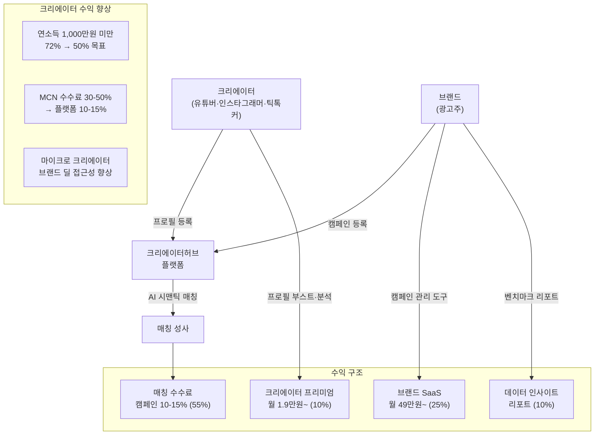
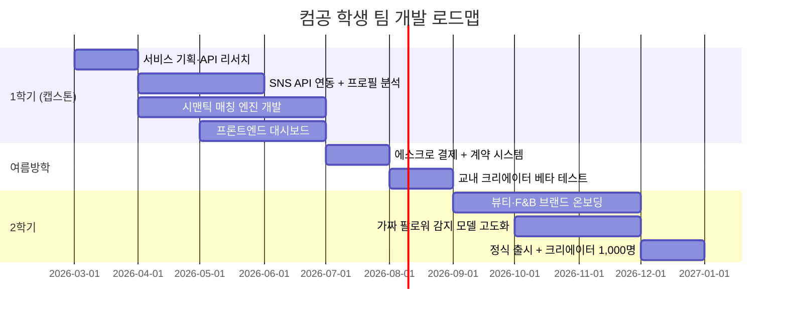

# 크리에이터허브 (CreatorHub) — 크리에이터-브랜드 매칭 플랫폼

> **예비창업패키지 사업계획서**
> 작성일: 2026년 3월
> 버전: 2.0 (Enhanced)

---

## □ 일반현황

| 항목 | 내용 |
|------|------|
| **창업아이템명** | 크리에이터허브 — AI 기반 크리에이터-브랜드 협업 매칭 플랫폼 |
| **산출물** | 웹 플랫폼 1개, 모바일 앱(iOS/Android) 1세트 |
| **직업(현재)** | 컴퓨터공학과 4학년 재학 중 |
| **기업예정명** | 주식회사 크리에이터허브 (CreatorHub Inc.) |
| **팀 구성 현황** | 대표(컴공 4학년) 1인 + 공동창업자(컴공 4학년) 1인 + 팀원(경영학과) 1인 + 외부 자문 2인 (디지털마케팅 전문가, MCN 업계 전문가) |

---

## □ 창업 아이템 개요(요약)

| 항목 | 내용 |
|------|------|
| **명칭** | 크리에이터허브 (CreatorHub) |
| **범주** | 크리에이터 이코노미 / 인플루언서 마케팅 매칭 플랫폼 |

### 창업 아이템 개요

**크리에이터허브**는 크리에이터(유튜버, 인스타그래머, 틱톡커 등)와 브랜드(광고주)를 AI로 매칭하는 **크리에이터 마케팅 플랫폼**이다. 인스타그램이 "사람과 콘텐츠"를 연결했다면, 크리에이터허브는 **"만드는 사람(크리에이터)과 파는 사람(브랜드)"을 연결**한다. AI가 크리에이터의 팔로워 분석, 콘텐츠 성과, 브랜드 적합도를 자동 분석하여 최적의 협업을 매칭하고, 계약·결제·성과 측정을 원스톱으로 처리한다.

| 요약 항목 | 내용 |
|-----------|------|
| **문제인식** | 한국 인플루언서 마케팅 시장 1.2조원(2025)이나 크리에이터 70%가 "브랜드 딜 찾기 어려움", 브랜드 65%가 "적합한 크리에이터 찾기 어려움". 수작업 DM/이메일 연락, 가격 불투명, 성과 측정 불가 |
| **실현가능성** | SNS API 연동 크리에이터 분석 AI, 브랜드-크리에이터 시맨틱 매칭, 콘텐츠 성과 실시간 대시보드, 에스크로 결제. 6개월 MVP |
| **성장전략** | 한국 → 일본 → 동남아 → 글로벌. 매칭 수수료 10-15% + SaaS. 3년 내 크리에이터 10만명, 연매출 100억원 |
| **팀구성** | 데이터/AI 개발 대표 + 마케팅/운영 공동창업자 + 디지털마케팅 자문 + MCN 자문 |

---

## 1. 문제 인식 (Problem) — 창업 아이템의 필요성

### 1.1 크리에이터 마케팅 문제 구조도

```
┌─────────────────────────────────────────────────────────────────────────────┐
│                   크리에이터 마케팅 생태계 문제 구조도                         │
├─────────────────────────────────────────────────────────────────────────────┤
│                                                                             │
│   ┌──────────────────────┐              ┌──────────────────────┐            │
│   │    크리에이터 (공급)    │              │     브랜드 (수요)      │            │
│   ├──────────────────────┤              ├──────────────────────┤            │
│   │ ● 브랜드 딜 탐색 어려움│              │ ● 적합 크리에이터 탐색 │            │
│   │   (70% 어려움 호소)   │              │   어려움 (65%)        │            │
│   │ ● 단가 협상 경험 부족  │              │ ● 가짜 팔로워 피해     │            │
│   │ ● MCN 수수료 30-50%  │              │ ● 매칭에 2-4주 소요   │            │
│   │ ● 성과 데이터 미축적   │              │ ● ROI 측정 불가       │            │
│   └──────────┬───────────┘              └──────────┬───────────┘            │
│              │                                      │                       │
│              ▼                                      ▼                       │
│   ┌──────────────────────────────────────────────────────────┐              │
│   │              현재의 비효율적 매칭 프로세스                    │              │
│   ├──────────────────────────────────────────────────────────┤              │
│   │  DM/이메일 수작업 → 가격 불투명 → 계약 분쟁 → 성과 미측정   │              │
│   └──────────────────────────┬───────────────────────────────┘              │
│                              │                                              │
│                              ▼                                              │
│   ┌──────────────────────────────────────────────────────────┐              │
│   │                     결과적 피해                            │              │
│   ├──────────────────────────────────────────────────────────┤              │
│   │ ● 크리에이터 72%: 연소득 1,000만원 미만 (108만명)           │              │
│   │ ● 브랜드: 마케팅 예산 30-50% 낭비                          │              │
│   │ ● 산업 전체: 신뢰 부족으로 시장 성장 저해                    │              │
│   └──────────────────────────────────────────────────────────┘              │
│                              │                                              │
│                              ▼                                              │
│              ┌───────────────────────────────┐                              │
│              │   ► 크리에이터허브가 해결 ◄     │                              │
│              │  AI 매칭 + 투명 계약 + 성과 측정 │                              │
│              └───────────────────────────────┘                              │
│                                                                             │
└─────────────────────────────────────────────────────────────────────────────┘
```

### 1.2 크리에이터 이코노미의 폭발적 성장

전 세계 크리에이터 이코노미는 역사상 가장 빠르게 성장하는 산업 중 하나이다.

| 지표 | 수치 | 출처 |
|------|------|------|
| 글로벌 크리에이터 수 | 3억명+ | SignalFire, 2024 |
| 글로벌 크리에이터 이코노미 시장 | $250B (2024) | Goldman Sachs, 2024 |
| 2030년 전망 | $480B | Goldman Sachs, 2024 |
| 글로벌 인플루언서 마케팅 시장 | $24B (2024) | Influencer Marketing Hub, 2025 |
| 한국 인플루언서 마케팅 시장 | 약 1.2조원 (2025) | 나스미디어, 2025 |
| 한국 크리에이터 수 | 약 150만명 | 한국MCN협회, 2024 |

그러나 이 거대한 시장에서 **크리에이터의 72%는 연소득 1,000만원 미만**이다 (한국콘텐츠진흥원, 2024). 상위 1% 메가 인플루언서에 수익이 집중되고, 나머지 99%의 마이크로·나노 크리에이터는 수익화에 큰 어려움을 겪고 있다.

#### 시장 조사 심화: TAM/SAM/SOM 분석

| 구분 | 정의 | 규모 | 산출 근거 |
|------|------|------|----------|
| **TAM** (전체 시장) | 글로벌 인플루언서 마케팅 시장 | **$24B** (2024) | Influencer Marketing Hub 글로벌 보고서 |
| **SAM** (유효 시장) | 한국+일본+동남아 인플루언서 마케팅 매칭 플랫폼 시장 | **약 3.5조원** (2024) | 한국 1.2조원 + 일본 ¥7,000억(약 1.3조원) + 동남아 약 1조원 |
| **SOM** (수익 가능 시장) | 한국 마이크로·나노 크리에이터-중소 브랜드 매칭 | **약 3,000억원** (2024) | 한국 인플루언서 마케팅 1.2조원 × 마이크로·나노 비중(40%) × 플랫폼 매칭 전환 가능(60%) |

#### 시장 기회 종합 (TAM/SAM/SOM) 시각화

```
┌─────────────────────────────────────────────────────────────────────┐
│                                                                     │
│  TAM: 글로벌 인플루언서 마케팅 시장 $24B (약 32조원)                  │
│  ┌─────────────────────────────────────────────────────────┐       │
│  │                                                         │       │
│  │  SAM: 한국+일본+동남아 매칭 플랫폼 시장 약 3.5조원         │       │
│  │  ┌───────────────────────────────────────────┐          │       │
│  │  │                                           │          │       │
│  │  │  SOM: 한국 마이크로·나노 매칭 약 3,000억원   │          │       │
│  │  │  ┌───────────────────────────┐             │          │       │
│  │  │  │                           │             │          │       │
│  │  │  │  Year 1 목표: 30억원       │             │          │       │
│  │  │  │  (SOM의 1% 점유)          │             │          │       │
│  │  │  │                           │             │          │       │
│  │  │  └───────────────────────────┘             │          │       │
│  │  │  Year 3 목표: 500억원 (SOM의 17% 점유)      │          │       │
│  │  │                                           │          │       │
│  │  └───────────────────────────────────────────┘          │       │
│  │  2030년 SAM 전망: 약 7조원 (CAGR 18%)                    │       │
│  │                                                         │       │
│  └─────────────────────────────────────────────────────────┘       │
│  2030년 TAM 전망: $48B (CAGR 15%)                                  │
│                                                                     │
└─────────────────────────────────────────────────────────────────────┘
```

#### 글로벌 vs 국내 시장 비교

| 비교 항목 | 글로벌 | 한국 | 시사점 |
|-----------|--------|------|--------|
| 인플루언서 마케팅 성장률 | 15% CAGR | 22% CAGR | 한국 시장 성장 속도가 더 빠름 |
| 매칭 플랫폼 이용률 | 45% (미국 브랜드 기준) | 18% | 플랫폼 도입 초기 → 선점 기회 |
| 마이크로 크리에이터 활용률 | 60% (미국) | 35% | 마이크로 크리에이터 시장 성장 여지 큼 |
| 크리에이터 수익 중위값 | $50K/년 (미국) | 약 800만원/년 | 수익화 지원 시 높은 만족도와 충성도 기대 |

> 출처: Influencer Marketing Hub (2025), 한국MCN협회 (2024), eMarketer Asia-Pacific Influencer Marketing Report (2024)

### 1.3 사회적 비용 분석

크리에이터 마케팅 생태계의 비효율은 개인 차원을 넘어 **사회 전체적 비용**을 발생시키고 있다.

| 사회적 비용 항목 | 규모(추정) | 산출 근거 | 영향 범위 |
|-----------------|-----------|----------|----------|
| **크리에이터 이탈 비용** | 연 2,400억원 | 크리에이터 연간 이탈율 30% × 150만명 × 재교육/전직 비용 | 콘텐츠 산업 인력 유출 |
| **가짜 팔로워 피해** | 연 3,600억원 | 인플루언서 마케팅 시장 1.2조원 × 가짜 팔로워 비율 30% | 브랜드 마케팅 예산 낭비 |
| **MCN 과다 수수료** | 연 1,800억원 | MCN 소속 크리에이터 30만명 × 평균 수수료 과다분 연 60만원 | 크리에이터 소득 감소 |
| **비효율 매칭 시간** | 연 900억원 | 브랜드 담당자 10만명 × 매칭 시간 100시간/년 × 시급 9만원 | 기업 인건비 낭비 |
| **정신건강 비용** | 연 500억원 | 크리에이터 번아웃·우울 비율 40% × 관련 사회적 비용 | 청년 정신건강 악화 |
| **합계** | **연 약 9,200억원** | | **크리에이터허브가 해결 목표** |

> 크리에이터허브는 이 중 약 40%(3,700억원)를 3년 내 절감하는 것을 목표로 한다.

### 1.4 사회적 문제 공감대 형성

#### 실제 사례: 서울 뷰티 크리에이터 유OO (페르소나 1)

유OO(26세)는 인스타그램 팔로워 3만 명의 뷰티 크리에이터다. 매일 3시간 이상 콘텐츠를 제작하지만, 월 수입은 50만원에 불과하다. 브랜드 협업을 하고 싶지만 어디서 어떻게 찾아야 하는지 모른다. MCN에 소속되면 수익의 40%를 가져가고, 직접 브랜드에 DM을 보내면 100건 중 답변이 오는 건 3건 미만이다. "콘텐츠 만드는 것은 좋아하는데, 이걸로 먹고살 수 있을지 매일 불안합니다."

#### 실제 사례: 중소 화장품 브랜드 마케팅 담당자 정OO (페르소나 2)

정OO(33세)는 신생 비건 화장품 브랜드의 마케팅 팀장이다. 인플루언서 마케팅 예산 500만원을 배정받았지만, 적합한 크리에이터를 찾는 데 3주가 걸렸다. 인스타그램에서 일일이 검색하고, DM을 보내고, 단가를 협상하는 과정이 비효율적이었다. 결국 계약한 크리에이터의 팔로워 중 30%가 가짜 계정이었고, 캠페인 ROI는 기대의 절반에 그쳤다. "적합한 크리에이터를 빠르게 찾고, 실제 영향력을 검증할 수 있는 도구가 절실합니다."

#### 실제 사례: 지방 라이프스타일 크리에이터 박OO (페르소나 3)

박OO(29세)는 부산에서 활동하는 유튜브 라이프스타일 크리에이터(구독자 8만명)이다. 서울 중심의 MCN과 브랜드 생태계에서 **지방 크리에이터는 사실상 사각지대**에 놓여 있다. 브랜드 캠페인의 85%가 서울 기반 크리에이터에게 집중되고, 박OO처럼 지방에서 활동하면서도 높은 참여율(7.2%)을 보이는 크리에이터는 기회조차 얻지 못한다. "서울까지 가서 브랜드 미팅을 하기도 어렵고, 온라인으로 신뢰를 보여줄 방법이 없어요. 데이터로 제 가치를 증명할 수 있다면..." 크리에이터허브의 AI 매칭은 **위치가 아닌 데이터 기반**으로 크리에이터를 평가하므로, 지방 크리에이터에게도 동등한 기회를 제공한다.

#### 통계의 인간적 해석

크리에이터 72%가 연소득 1,000만원 미만이라는 것은, **150만 명의 한국 크리에이터 중 108만 명이 월 평균 83만원도 벌지 못한다**는 의미이다. 이들은 매일 수 시간의 창작 노동을 투입하지만 최저임금에도 못 미치는 수익을 얻고 있다. 이는 "열정 착취"의 디지털 버전이며, 크리에이터 이코노미의 지속가능성을 위협하는 구조적 문제이다.

#### 해외 성공 사례로 문제 해결 가능성 입증

미국 LTK는 크리에이터가 제품을 추천하고 구매 전환 시 수수료를 받는 커머스 모델로 연간 $4B 매출을 기여하며, 기업가치 $2B을 달성했다. Grin은 DTC 브랜드 특화 매칭으로 35,000+ 브랜드를 확보하며 기업가치 $1B을 넘겼다. 이들은 "크리에이터의 영향력을 정량화하고 공정하게 보상하는 시스템"을 구축함으로써 시장을 혁신했다. 한국은 K-콘텐츠 경쟁력과 높은 SNS 이용률로 동일 모델의 성공 잠재력이 매우 높다.

#### 해외 성공 사례 비교 도표

| 비교 항목 | CreatorIQ (미국) | Grin (미국) | LTK (미국) | Aspire (미국) | 레뷰 (한국) | **크리에이터허브** |
|-----------|-----------------|------------|-----------|--------------|-----------|-----------------|
| **설립연도** | 2014 | 2017 | 2011 | 2016 | 2015 | **2026** |
| **기업가치** | $500M+ | $1B+ | $2B+ | $400M+ | 비상장 | **목표 $100M (3년)** |
| **누적투자** | $120M+ | $152M | 비공개 | $100M+ | 50억원+ | **5억원 (Pre-Seed)** |
| **핵심 모델** | 엔터프라이즈 SaaS | DTC 브랜드 매칭 | 크리에이터 커머스 | 커뮤니티 IRM | 체험단 매칭 | **AI 시맨틱 매칭** |
| **타겟 브랜드** | Fortune 500 | DTC 중소 | 패션/뷰티 | 전 규모 | 중소 | **전 규모 (중소 시작)** |
| **AI 수준** | 기본 필터링 | 중간 매칭 | 추천 알고리즘 | 관계 분석 | 없음 | **LLM 시맨틱+비전AI** |
| **크리에이터 혜택** | 없음 (B2B) | 제품 지급 | 수수료 수익 | 관계 관리 | 체험 기회 | **수익 보장+성장 도구** |
| **가짜 팔로워 감지** | 기본 | 중간 | 없음 | 기본 | 없음 | **AI 이상탐지 고도화** |
| **한국 시장 진출** | 미진출 | 미진출 | 미진출 | 미진출 | 국내만 | **한국 특화 시작** |
| **수수료율** | 연 $50K+ | 월 $999+ | 15-20% | 연 $20K+ | 건당 과금 | **10-15%** |

### 1.5 사용자 구매동인(Purchase Motivation) 분석

#### 기능적 동인
- **시간 절약**: 크리에이터 탐색 2-4주 → AI 매칭 30분 이내로 단축
- **비용 절감**: 가짜 팔로워 감지로 마케팅 예산 낭비 방지, ROI 평균 40% 향상
- **편의성**: 매칭·계약·결제·성과 측정을 하나의 플랫폼에서 원스톱 처리

#### 감정적 동인
- **불안 해소**: 크리에이터 실제 영향력 데이터로 "돈 날릴까" 불안 제거 (브랜드), 대금 미수 방지 (크리에이터)
- **신뢰감**: 투명한 단가 기준과 양방향 리뷰로 공정한 거래 환경
- **성취감**: 성공적인 캠페인 데이터를 확인하는 만족감, 수익 성장 그래프 확인

#### 사회적 동인
- **소속감**: 크리에이터 커뮤니티 소속감, 브랜드-크리에이터 파트너 관계 형성
- **사회적 인정**: 검증된 크리에이터로서의 브랜드 가치, "프로 크리에이터" 위상
- **트렌드**: 크리에이터 이코노미·인플루언서 마케팅 대세 트렌드 합류

#### 페르소나별 구매 여정

**페르소나 1: 한뷰티 (24세, 인스타그램 뷰티 크리에이터, 팔로워 2.5만)**
- **인지 단계**: 크리에이터 커뮤니티에서 "브랜드 협업으로 월 200만원 벌었다" 후기 접함
- **관심 단계**: 크리에이터허브 가입 → 인스타그램 연동 → AI가 자동 프로필 생성 + "예상 콘텐츠 단가: 건당 30만원" 확인
- **고려 단계**: 비건 화장품 브랜드의 캠페인 제안 수신 → 브랜드 리뷰와 지급 이력 확인
- **구매 단계**: 캠페인 수락 → 콘텐츠 제작 → 브랜드 검수 통과 → 에스크로 결제 → 3일 내 입금
- **충성 단계**: 월 3-4건 브랜드 협업 → 월수입 100만원 → 200만원 성장 → 프리미엄 크리에이터 등급

**페르소나 2: 김마케터 (35세, 중소 F&B 브랜드 마케팅 팀장)**
- **인지 단계**: 기존 인플루언서 마케팅 ROI 불만 → "인플루언서 마케팅 플랫폼" 검색
- **관심 단계**: 크리에이터허브 기업 가입 → "가짜 팔로워 감지", "ROI 실시간 추적"에 관심
- **고려 단계**: 캠페인 목표 입력("20대 여성, 건강 간식, 예산 300만원") → AI가 최적 크리에이터 15명 추천 → 참여율·팔로워 진성도 비교
- **구매 단계**: 크리에이터 5명 선택 → 표준 계약서 자동 생성 → 캠페인 실행
- **충성 단계**: ROI 250% 달성 → 월 정기 캠페인 SaaS 구독 → 사내 타 브랜드에도 도입 추천

**페르소나 3: 박크리 (29세, 부산 유튜브 라이프스타일 크리에이터, 구독자 8만)**
- **인지 단계**: 크리에이터 컨퍼런스에서 "AI가 지역 무관하게 브랜드 매칭해준다" 발표 청취
- **관심 단계**: 크리에이터허브 가입 → 유튜브 연동 → 참여율 7.2%로 "상위 5% 크리에이터" 뱃지 획득
- **고려 단계**: 전국 배송 F&B 브랜드의 캠페인 제안 수신 → 서울 방문 없이 온라인 계약
- **구매 단계**: 부산 로컬 감성 콘텐츠 제작 → 브랜드 만족 → 영상 조회수 15만 달성
- **충성 단계**: 월 5-6건 협업 → 월수입 350만원 → "지방 크리에이터 성공 사례"로 플랫폼 앰배서더 활동

### 1.6 매칭의 양면적 고통

**크리에이터 측 (공급):**
- 70%가 "브랜드 협업 기회 찾기 어려움" (한국MCN협회, 2024)
- 단가 협상 경험 부족 → 저가 수락 빈번
- MCN 소속 시 수익의 30-50% 수수료
- 성과 데이터 체계적 관리 못함 → 다음 딜에 활용 불가

**브랜드 측 (수요):**
- 65%가 "적합한 크리에이터 찾기 어려움" (대한상공회의소, 2024)
- 팔로워 수 위주 선정 → 가짜 팔로워, 실제 영향력 낮은 크리에이터와 계약
- 수작업 DM/이메일 → 매칭에 평균 2-4주 소요
- ROI 측정 어려움 → 마케팅 예산 낭비

### 1.7 성공 사례 분석

#### CreatorIQ (미국, 2014~)
- **누적 투자**: $120M+ (기업가치 $500M+)
- **핵심**: 엔터프라이즈급 인플루언서 마케팅 플랫폼
- **고객**: Disney, Amazon, Unilever, AB InBev 등 Fortune 500
- **기능**: AI 크리에이터 발견, 캠페인 관리, ROI 분석
- **시사점**: 대기업 시장에서 고가 SaaS ($50K+/년) 모델 검증

#### Grin (미국, 2017~)
- **누적 투자**: $152M (기업가치 $1B+)
- **핵심**: DTC(Direct-to-Consumer) 브랜드 특화 크리에이터 매칭
- **성과**: 35,000+ 브랜드 사용, Shopify 연동으로 매출 추적
- **시사점**: 중소 DTC 브랜드 시장의 거대한 수요 확인

#### LTK (미국, 2011~)
- **기업가치**: $2B+ (2023)
- **핵심**: 크리에이터 커머스 플랫폼 — 크리에이터가 제품 추천 → 구매 시 수수료
- **성과**: 크리에이터 300,000+, 연간 $4B+ 매출 기여
- **시사점**: 크리에이터가 직접 "판매"하는 커머스 모델의 대규모 성장

#### 레뷰 / 서울스토어 (한국)
- **레뷰**: 체험단 매칭 중심, 마이크로 인플루언서 특화
- **서울스토어**: 크리에이터 커머스
- **한계**: AI 매칭 부재, 성과 측정 한정적, 글로벌 확장 미흡
- **시사점**: 한국 시장 수요 존재하나 기술적 고도화 기회

#### Aspire (미국, 2016~)
- **누적 투자**: $100M+
- **핵심**: 커뮤니티 기반 인플루언서 관계 관리 (IRM)
- **시사점**: 일회성 캠페인 → 장기 관계 관리로 LTV 극대화

### 1.8 시장 기회

| 구분 | CreatorIQ | Grin | 레뷰 | **크리에이터허브** |
|------|-----------|------|------|-----------------|
| 타겟 | 대기업 | DTC 브랜드 | 체험단 | **전 규모 브랜드 + 크리에이터** |
| 가격 | $50K+/년 | $999+/월 | 건당 과금 | **무료 가입 + 매칭 수수료** |
| 크리에이터 혜택 | 없음 (B2B) | 제품 지급 | 체험단 | **수익 보장 + 성장 도구** |
| AI 매칭 | 기본 | 중간 | 없음 | **LLM 기반 시맨틱 매칭** |
| 한국 시장 | 미진출 | 미진출 | 체험단 한정 | **한국 크리에이터 특화** |

---

## 2. 실현 가능성 (Solution) — 창업 아이템의 개발 계획

### 2.1 서비스 아키텍처

```
┌─────────────────────────────────────────────────────────────────────┐
│                    크리에이터허브 서비스 아키텍처                      │
├─────────────────────────────────────────────────────────────────────┤
│                                                                     │
│  ┌───────────┐    ┌───────────┐    ┌───────────┐                   │
│  │ 크리에이터  │    │   브랜드   │    │  관리자    │                   │
│  │   웹/앱    │    │   웹/앱   │    │  대시보드  │                   │
│  └─────┬─────┘    └─────┬─────┘    └─────┬─────┘                   │
│        │                │                │                          │
│        └────────────────┼────────────────┘                          │
│                         │                                           │
│                         ▼                                           │
│  ┌──────────────────────────────────────────────────────────┐      │
│  │              API Gateway (AWS API Gateway)                │      │
│  └──────────────────────────┬───────────────────────────────┘      │
│                             │                                       │
│        ┌────────────────────┼────────────────────┐                  │
│        ▼                    ▼                    ▼                  │
│  ┌──────────┐     ┌──────────────┐     ┌──────────────┐           │
│  │  인증/인가 │     │  매칭 엔진   │     │ 캠페인 관리  │           │
│  │ (OAuth2)  │     │ (시맨틱 AI)  │     │ (워크플로우) │           │
│  └──────────┘     └──────┬───────┘     └──────────────┘           │
│                          │                                          │
│        ┌─────────────────┼─────────────────┐                       │
│        ▼                 ▼                 ▼                       │
│  ┌──────────┐   ┌──────────────┐   ┌──────────────┐              │
│  │ 프로필    │   │   AI/ML      │   │  성과 측정   │              │
│  │ 분석 엔진 │   │  파이프라인   │   │  대시보드    │              │
│  └────┬─────┘   └──────┬───────┘   └──────┬───────┘              │
│       │                │                   │                       │
│       ▼                ▼                   ▼                       │
│  ┌──────────────────────────────────────────────────────────┐     │
│  │              에스크로 결제 시스템                           │     │
│  │        (Stripe Connect + 토스페이먼츠)                     │     │
│  └──────────────────────────────────────────────────────────┘     │
│                                                                     │
│  ┌──────────────────────────────────────────────────────────┐     │
│  │   외부 연동: Instagram API │ YouTube API │ TikTok API     │     │
│  └──────────────────────────────────────────────────────────┘     │
│                                                                     │
└─────────────────────────────────────────────────────────────────────┘
```

### 2.2 핵심 기능

#### 1) AI 크리에이터 프로필 분석
- Instagram/YouTube/TikTok API 연동 → 자동 프로필 생성
- 팔로워 분석: 연령·성별·지역·관심사 분포, 가짜 팔로워 감지
- 콘텐츠 분석: 게시물 주제 분류, 톤&매너 분석, 참여율(engagement) 산출
- 브랜드 적합도 점수 자동 산출

#### 2) 시맨틱 매칭 엔진
- 브랜드가 캠페인 목표·타겟·예산 입력
- LLM이 캠페인 의도를 분석하여 최적 크리에이터 리스트 추천
- 예: "20대 여성 타겟, 비건 화장품, 예산 500만원" → 뷰티 크리에이터 중 비건/클린뷰티 콘텐츠 제작자 우선 매칭

#### 3) 캠페인 관리 & 협업 도구
- 계약서 AI 자동 생성 (단가, 납기, 수정 횟수 등 표준 조건)
- 콘텐츠 시안 리뷰 도구 (브랜드 → 크리에이터 피드백 루프)
- 일정 관리 (콘텐츠 제작 → 검수 → 게시 타임라인)

#### 4) 성과 측정 대시보드
- 실시간 KPI 추적: 노출, 도달, 참여, 클릭, 전환
- ROI 계산기: 캠페인 비용 대비 예상/실제 매출 기여
- A/B 비교: 크리에이터별 성과 비교 분석
- 벤치마크: 동종 업계 캠페인 평균 대비 성과

#### 5) 에스크로 결제 & 수익 관리
- 브랜드 결제 → 에스크로 → 콘텐츠 승인 → 크리에이터 지급
- 크리에이터 수익 대시보드 (월별 수익, 세금 관리, 정산)

### 2.3 AI 모델 개발 상세

| AI 모델 | 목적 | 학습 데이터 | 기술 스택 | 정확도 목표 | 개발 단계 |
|---------|------|-----------|----------|-----------|----------|
| **시맨틱 매칭 엔진** | 브랜드-크리에이터 최적 매칭 | 캠페인 10만건 + 크리에이터 프로필 50만건 | GPT-4o Fine-tuning + pgvector 임베딩 | 매칭 만족도 85%+ | MVP(6개월) |
| **가짜 팔로워 감지** | 봇/가짜 계정 탐지 | HypeAuditor 레이블링 데이터 100만건 | XGBoost + Isolation Forest | 정확도 95%+ (F1 0.92+) | MVP(6개월) |
| **콘텐츠 비전 분석** | 이미지/영상 자동 분류 | 인스타 게시물 50만건 라벨링 | CLIP + GPT-4V | 주제 분류 90%+ | Beta(9개월) |
| **ROI 예측 모델** | 캠페인 성과 사전 예측 | 과거 캠페인 3만건 성과 데이터 | LightGBM + Time-series | MAPE 15% 이하 | v1.0(12개월) |
| **단가 추천 엔진** | 공정 시장가격 산출 | 크리에이터 단가 20만건 | Regression + Market Analysis | 시장가 오차 10% 이내 | MVP(6개월) |
| **감정 분석 모델** | 댓글/리뷰 감정 분류 | 한국어 댓글 200만건 | KoBERT Fine-tuning | 정확도 88%+ | v1.0(12개월) |

### 2.4 시스템 아키텍처 상세 (Layered)

```
┌─────────────────────────────────────────────────────────────────────────────┐
│                         PRESENTATION LAYER                                  │
│  ┌───────────────┐  ┌───────────────┐  ┌───────────────┐                   │
│  │  Next.js 웹    │  │  Next.js 웹   │  │ React Native  │                   │
│  │ (크리에이터용)  │  │  (브랜드용)    │  │  (모바일 앱)   │                   │
│  └───────┬───────┘  └───────┬───────┘  └───────┬───────┘                   │
│          └──────────────────┼──────────────────┘                            │
├─────────────────────────────┼───────────────────────────────────────────────┤
│                     GATEWAY LAYER                                           │
│  ┌──────────────────────────┴──────────────────────────┐                   │
│  │          AWS API Gateway + CloudFront CDN            │                   │
│  │    ┌──────────┐  ┌──────────┐  ┌──────────┐        │                   │
│  │    │Rate Limit│  │  Auth    │  │  CORS    │        │                   │
│  │    │  (WAF)   │  │ (JWT)   │  │ Handler  │        │                   │
│  │    └──────────┘  └──────────┘  └──────────┘        │                   │
│  └──────────────────────────┬──────────────────────────┘                   │
├─────────────────────────────┼───────────────────────────────────────────────┤
│                     APPLICATION LAYER (NestJS Microservices)                │
│  ┌────────────┐ ┌────────────┐ ┌────────────┐ ┌────────────┐             │
│  │   Auth     │ │  Profile   │ │  Campaign   │ │  Payment   │             │
│  │  Service   │ │  Service   │ │  Service    │ │  Service   │             │
│  │            │ │            │ │             │ │            │             │
│  │ ● OAuth2  │ │ ● SNS 연동 │ │ ● 워크플로우 │ │ ● 에스크로 │             │
│  │ ● RBAC    │ │ ● 분석     │ │ ● 협업 도구  │ │ ● 정산    │             │
│  └──────┬─────┘ └──────┬─────┘ └──────┬──────┘ └──────┬─────┘             │
│         └──────────────┼──────────────┼──────────────┘                     │
│                        │     Message Queue (SQS/SNS)                       │
├────────────────────────┼───────────────────────────────────────────────────┤
│                     AI/ML LAYER                                             │
│  ┌────────────┐ ┌────────────┐ ┌────────────┐ ┌────────────┐             │
│  │  Semantic   │ │   Fake     │ │  Vision    │ │    ROI     │             │
│  │  Matching   │ │  Follower  │ │  Analysis  │ │ Prediction │             │
│  │  Engine     │ │  Detector  │ │  (CLIP)    │ │  Model     │             │
│  │            │ │            │ │            │ │            │             │
│  │ GPT-4o +   │ │ XGBoost + │ │ CLIP +     │ │ LightGBM + │             │
│  │ pgvector   │ │ Isolation  │ │ GPT-4V     │ │ TimeSeries │             │
│  │            │ │ Forest     │ │            │ │            │             │
│  └────────────┘ └────────────┘ └────────────┘ └────────────┘             │
├──────────────────────────────────────────────────────────────────────────┤
│                     DATA LAYER                                            │
│  ┌────────────┐ ┌────────────┐ ┌────────────┐ ┌────────────┐            │
│  │ PostgreSQL │ │ ClickHouse │ │   Redis    │ │  AWS S3    │            │
│  │ + pgvector │ │ (분석용)    │ │  (캐시)    │ │ (미디어)    │            │
│  │            │ │            │ │            │ │            │            │
│  │ ● 사용자   │ │ ● 이벤트   │ │ ● 세션    │ │ ● 이미지   │            │
│  │ ● 캠페인   │ │ ● 성과지표  │ │ ● 매칭캐시 │ │ ● 영상     │            │
│  │ ● 임베딩   │ │ ● 로그     │ │ ● Rate    │ │ ● 리포트   │            │
│  └────────────┘ └────────────┘ └────────────┘ └────────────┘            │
├──────────────────────────────────────────────────────────────────────────┤
│                     INFRASTRUCTURE LAYER                                  │
│  ┌──────────────────────────────────────────────────────────────┐        │
│  │  AWS EKS (Kubernetes) │ Vercel (Frontend) │ GitHub Actions   │        │
│  │  Terraform (IaC)      │ Datadog (모니터링) │ Sentry (에러)    │        │
│  └──────────────────────────────────────────────────────────────┘        │
├──────────────────────────────────────────────────────────────────────────┤
│                     EXTERNAL INTEGRATIONS                                 │
│  ┌──────────┐ ┌──────────┐ ┌──────────┐ ┌──────────┐ ┌──────────┐     │
│  │Instagram │ │ YouTube  │ │  TikTok  │ │  Stripe  │ │  토스    │     │
│  │Graph API │ │ Data API │ │   API    │ │ Connect  │ │ 페이먼츠 │     │
│  └──────────┘ └──────────┘ └──────────┘ └──────────┘ └──────────┘     │
└──────────────────────────────────────────────────────────────────────────┘
```

### 2.5 사용자 흐름 (User Flow)

```
┌─────────────────────────────────────────────────────────────────────────────┐
│                         사용자 흐름 (User Flow)                              │
├─────────────────────────────────────────────────────────────────────────────┤
│                                                                             │
│  ◆ 크리에이터 흐름                                                          │
│  ┌──────┐   ┌──────────┐   ┌──────────┐   ┌──────────┐   ┌──────────┐   │
│  │회원가입│──►│SNS 계정  │──►│AI 자동   │──►│예상 단가 │──►│캠페인    │   │
│  │      │   │연동      │   │프로필생성 │   │확인      │   │제안 수신 │   │
│  └──────┘   └──────────┘   └──────────┘   └──────────┘   └────┬─────┘   │
│                                                                │          │
│                                           ┌────────────────────┘          │
│                                           ▼                               │
│                                    ┌──────────┐   ┌──────────┐           │
│                                    │캠페인    │──►│콘텐츠    │           │
│                                    │수락/거절 │   │제작      │           │
│                                    └──────────┘   └────┬─────┘           │
│                                                        │                  │
│  ◆ 브랜드 흐름                                          ▼                  │
│  ┌──────┐   ┌──────────┐   ┌──────────┐        ┌──────────┐             │
│  │기업  │──►│캠페인    │──►│AI 추천   │        │브랜드    │             │
│  │가입  │   │목표 입력 │   │크리에이터 │        │검수      │             │
│  └──────┘   └──────────┘   └────┬─────┘        └────┬─────┘             │
│                                  │                   │                    │
│                                  ▼                   ▼                    │
│                           ┌──────────┐        ┌──────────┐               │
│                           │진성도    │        │승인 →    │               │
│                           │검증/비교 │        │게시      │               │
│                           └────┬─────┘        └────┬─────┘               │
│                                │                   │                      │
│                                ▼                   ▼                      │
│                         ┌──────────┐        ┌──────────┐                 │
│                         │크리에이터│        │에스크로  │                 │
│                         │선정/계약 │───────►│결제 실행 │                 │
│                         └──────────┘        └────┬─────┘                 │
│                                                   │                       │
│  ◆ 공통 최종 단계                                   ▼                       │
│  ┌──────────────────────────────────────────────────────────────┐        │
│  │  ┌──────────┐   ┌──────────┐   ┌──────────┐   ┌──────────┐ │        │
│  │  │실시간    │──►│ROI 분석  │──►│양방향    │──►│재캠페인  │ │        │
│  │  │성과 추적 │   │리포트    │   │리뷰      │   │/장기계약 │ │        │
│  │  └──────────┘   └──────────┘   └──────────┘   └──────────┘ │        │
│  └──────────────────────────────────────────────────────────────┘        │
│                                                                          │
└─────────────────────────────────────────────────────────────────────────────┘
```

### 2.6 비즈니스 모델 플로우



### 2.7 구독 모델 비교 (4 Tiers)

#### 크리에이터용 구독

| 구분 | Free | Starter | Pro | Elite |
|------|------|---------|-----|-------|
| **월 가격** | 0원 | 9,900원 | 19,900원 | 49,900원 |
| **프로필 노출** | 기본 | 상위 노출 | 최상위 노출 | 프리미엄 배지 + 최상위 |
| **AI 매칭 제안** | 월 3건 | 월 10건 | 무제한 | 무제한 + 우선 매칭 |
| **성과 분석** | 기본 통계 | 상세 분석 | 고급 분석 + 벤치마크 | 전체 + 맞춤 컨설팅 |
| **포트폴리오** | 3개 | 10개 | 무제한 | 무제한 + AI 자동 생성 |
| **가짜 팔로워 리포트** | X | 기본 | 상세 | 실시간 모니터링 |
| **세무/정산 도구** | X | X | 기본 | 전문 세무 연동 |
| **전담 매니저** | X | X | X | 전담 1인 배정 |
| **예상 전환율** | 100% (기본) | 15% | 8% | 2% |
| **ARPU** | 0원 | 9,900원 | 19,900원 | 49,900원 |

#### 브랜드용 구독

| 구분 | Starter | Growth | Business | Enterprise |
|------|---------|--------|----------|-----------|
| **월 가격** | 무료 (수수료만) | 49만원 | 149만원 | 맞춤 견적 |
| **매칭 수수료** | 15% | 12% | 10% | 협의 |
| **AI 크리에이터 추천** | 월 10명 | 월 50명 | 무제한 | 무제한 + 전담 AI |
| **캠페인 동시 운영** | 1건 | 5건 | 20건 | 무제한 |
| **성과 대시보드** | 기본 | 상세 + 벤치마크 | 고급 + 커스텀 | 전체 + API 연동 |
| **계약서 자동 생성** | 표준 | 커스텀 | 법률 검토 포함 | 전담 법무 |
| **데이터 리포트** | X | 분기별 | 월별 | 실시간 + 맞춤 |
| **전담 매니저** | X | X | 전담 1인 | 전담팀 |
| **API 접근** | X | X | 기본 | 전체 |
| **예상 전환율** | 60% | 25% | 12% | 3% |

### 2.8 기술 스택

| 구분 | 기술 |
|------|------|
| **프론트엔드** | Next.js (웹), React Native (앱) |
| **백엔드** | Node.js + NestJS, PostgreSQL |
| **AI/ML** | GPT-4o (시맨틱 매칭), Vision AI (콘텐츠 분석), 임베딩 (pgvector) |
| **SNS 연동** | Instagram Graph API, YouTube Data API, TikTok API |
| **분석** | ClickHouse (대규모 분석), Metabase (시각화) |
| **결제** | Stripe Connect, 토스페이먼츠 |
| **인프라** | AWS (EKS, RDS, Redshift), Vercel |

### 2.9 개발 일정

| 구분 | 추진 내용 | 추진 기간 | 세부 내용 |
|------|----------|----------|----------|
| 1 | MVP 개발 | 2026.04 ~ 2026.09 | 크리에이터 프로필 + AI 매칭 + 기본 결제 (인스타그램 시작) |
| 2 | 베타 테스트 | 2026.10 ~ 2026.12 | 크리에이터 1,000명 + 브랜드 100개사 |
| 3 | 정식 출시 | 2027.01 | YouTube·TikTok 연동, 캠페인 관리 도구 |
| 4 | 스케일업 | 2027.01 ~ 2027.06 | 성과 대시보드, AI 고도화, 일본 시장 진출 |

### 2.10 정부지원사업비 집행 계획

**< 1단계 (20백만원) >**

| 비목 | 산출 근거 | 금액(원) |
|------|----------|---------|
| 재료비 | AWS 인프라 + API 비용 6개월 | 8,000,000 |
| 외주용역비 | 디자인 + SNS API 연동 개발 용역 | 8,000,000 |
| 지급수수료 | OpenAI API, SNS API 사용료 | 4,000,000 |
| **합계** | | **20,000,000** |

**< 2단계 (40백만원) 상세 >**

| 비목 | 세부 항목 | 산출 근거 | 금액(원) |
|------|----------|----------|---------|
| 인건비 | 데이터 엔지니어 | 월 400만원 × 6개월 | 24,000,000 |
| 마케팅 | 크리에이터 온보딩 캠페인 | 온라인 광고 + 오프라인 밋업 | 5,000,000 |
| 마케팅 | 브랜드 세일즈 | B2B 세일즈 자료 + 데모 제작 | 4,000,000 |
| 마케팅 | 크리에이터 컨퍼런스 참가 | 부스 운영 + 발표 | 3,000,000 |
| 외주용역비 | 보안 점검 (모의해킹) | 전문업체 1회 | 2,500,000 |
| 외주용역비 | 개인정보 영향평가 | 전문기관 1회 | 1,500,000 |
| **합계** | | | **40,000,000** |

**< Pre-Seed 예산 (5억원) 상세 >**

| 항목 | 용도 | 금액(원) | 비율 |
|------|------|---------|------|
| **인건비** | 핵심 개발팀 4인 (12개월) | 240,000,000 | 48% |
| **인프라** | AWS + API 비용 (12개월) | 60,000,000 | 12% |
| **마케팅** | 크리에이터 온보딩 + 브랜드 세일즈 | 80,000,000 | 16% |
| **외주/디자인** | UI/UX 디자인 + 보안 점검 + 법률 | 40,000,000 | 8% |
| **사무실/운영** | 코워킹 스페이스 + 기타 운영비 | 30,000,000 | 6% |
| **AI 모델 학습** | GPU 서버 + 데이터 라벨링 | 30,000,000 | 6% |
| **예비비** | 돌발 비용 대비 | 20,000,000 | 4% |
| **합계** | | **500,000,000** | **100%** |

---

## 3. 성장전략 (Scale-up) — 사업화 추진 전략

### 3.1 비즈니스 모델

| 수익원 | 설명 | 목표 비중 |
|--------|------|----------|
| **매칭 수수료** | 캠페인 금액의 10-15% | 55% |
| **브랜드 SaaS** | 캠페인 관리·분석 도구 구독 (월 49만원~) | 25% |
| **크리에이터 프리미엄** | 프로필 부스트, 분석 도구, 세무 서비스 (월 1.9만원~) | 10% |
| **데이터 인사이트** | 업종별 인플루언서 마케팅 벤치마크 리포트 | 10% |

### 3.2 핵심 KPI 연도별

| KPI | 2026 (MVP) | 2027 (성장) | 2028 (확장) | 2029 (스케일) | 2030 (글로벌) |
|-----|-----------|------------|-----------|-------------|-------------|
| **등록 크리에이터** | 5,000명 | 30,000명 | 100,000명 | 250,000명 | 500,000명 |
| **등록 브랜드** | 200개 | 2,000개 | 8,000개 | 20,000개 | 50,000개 |
| **월 매칭 건수** | 100건 | 3,000건 | 15,000건 | 50,000건 | 150,000건 |
| **매칭 성공률** | 60% | 75% | 85% | 88% | 90% |
| **크리에이터 재이용률** | 40% | 55% | 70% | 78% | 82% |
| **브랜드 재이용률** | 35% | 50% | 65% | 75% | 80% |
| **크리에이터 평균 월수입 증가** | +30% | +80% | +150% | +200% | +250% |
| **NPS (순추천지수)** | 30 | 45 | 55 | 60 | 65+ |
| **DAU/MAU** | 15% | 25% | 35% | 40% | 45% |

### 3.3 재무 전망 (BEP 포함)

| 항목 | 2026 | 2027 | 2028 | 2029 | 2030 |
|------|------|------|------|------|------|
| **매출** | 2억원 | 30억원 | 150억원 | 500억원 | 1,200억원 |
| **매칭 수수료 수익** | 1.1억원 | 16.5억원 | 82.5억원 | 275억원 | 660억원 |
| **SaaS 구독 수익** | 0.5억원 | 7.5억원 | 37.5억원 | 125억원 | 300억원 |
| **기타 수익** | 0.4억원 | 6억원 | 30억원 | 100억원 | 240억원 |
| **매출원가** | 1.5억원 | 12억원 | 45억원 | 125억원 | 280억원 |
| **판관비** | 8억원 | 35억원 | 80억원 | 150억원 | 280억원 |
| **영업이익** | -7.5억원 | -17억원 | 25억원 | 225억원 | 640억원 |
| **영업이익률** | -375% | -57% | **17%** | **45%** | **53%** |
| **누적 손실** | -7.5억원 | -24.5억원 | **+0.5억원** | +225.5억원 | +865.5억원 |
| **BEP 달성** | | | **2028년 Q2** | | |

> **BEP(손익분기점)**: 2028년 2분기 달성 예상. 월 매칭 건수 8,000건 + 브랜드 SaaS 500개사 시점.

### 3.4 시장 진입 전략 로드맵

```
┌─────────────────────────────────────────────────────────────────────────────┐
│                      시장 진입 전략 로드맵 (2026-2030)                        │
├─────────────────────────────────────────────────────────────────────────────┤
│                                                                             │
│  Phase 1: 한국 뷰티·F&B (2026-2027)                                        │
│  ┌─────────────────────────────────────────────┐                           │
│  │ ● K-뷰티 브랜드 인플루언서 마케팅 수요 최다   │                           │
│  │ ● 마이크로 크리에이터 (1만-10만) 집중          │                           │
│  │ ● 목표: 크리에이터 30,000명, 브랜드 2,000개   │                           │
│  │ ● 매출: 30억원                               │                           │
│  └──────────────────────┬──────────────────────┘                           │
│                         │                                                   │
│                         ▼                                                   │
│  Phase 2: 한국 전 카테고리 + 일본 진출 (2027-2028)                           │
│  ┌─────────────────────────────────────────────┐                           │
│  │ ● 패션, 테크, 여행, 육아 등 카테고리 확장      │                           │
│  │ ● 일본 진출 (시장 ¥7,000억, 크리에이터 100만+) │                           │
│  │ ● 크리에이터 커머스 기능 추가                   │                           │
│  │ ● 목표: 크리에이터 100,000명, 브랜드 8,000개   │                           │
│  │ ● 매출: 150억원                               │                           │
│  └──────────────────────┬──────────────────────┘                           │
│                         │                                                   │
│                         ▼                                                   │
│  Phase 3: 동남아 + 글로벌 확장 (2028-2030)                                  │
│  ┌─────────────────────────────────────────────┐                           │
│  │ ● 인도네시아·태국·베트남 진출                   │                           │
│  │ ● LTK 모델 통합 (추천→구매→수수료)             │                           │
│  │ ● 글로벌 크리에이터 네트워크 구축               │                           │
│  │ ● 목표: 크리에이터 500,000명, 브랜드 50,000개  │                           │
│  │ ● 매출: 1,200억원                             │                           │
│  └──────────────────────┬──────────────────────┘                           │
│                         │                                                   │
│                         ▼                                                   │
│  Phase 4: 플랫폼 생태계 완성 (2030+)                                        │
│  ┌─────────────────────────────────────────────┐                           │
│  │ ● 크리에이터 금융 서비스 (선정산, 대출)         │                           │
│  │ ● 크리에이터 교육 아카데미                      │                           │
│  │ ● IP 라이센싱 + 크리에이터 브랜드 론칭 지원     │                           │
│  │ ● 목표: 크리에이터 이코노미 슈퍼앱              │                           │
│  └─────────────────────────────────────────────┘                           │
│                                                                             │
└─────────────────────────────────────────────────────────────────────────────┘
```

### 3.5 투자유치 전략

| 단계 | 시기 | 목표 금액 | 용도 |
|------|------|---------|------|
| Pre-Seed | 2026.Q2 | 5억원 | MVP, 초기 크리에이터 온보딩 |
| Seed | 2027.Q1 | 25억원 | 한국 확대, AI 고도화 |
| Series A | 2028.Q1 | 120억원 | 일본 진출, 커머스 기능 |

### 3.6 ESG 및 사회적 가치

- **사회**: 1인 크리에이터 수익화 지원 → 청년 자립 경제 활성화, MCN 수수료 착취 구조 개선
- **환경**: 디지털 마케팅 전환 → 오프라인 광고(인쇄, 옥외) 대비 탄소배출 90% 절감
- **지배구조**: 투명한 단가 공개, 크리에이터 권익 보호 표준 계약서

#### ESG 정량 목표

| ESG 영역 | 지표 | 2027 목표 | 2028 목표 | 2030 목표 | 측정 방법 |
|----------|------|----------|----------|----------|----------|
| **S (사회)** | 크리에이터 수익 증가율 | +80% | +150% | +250% | 플랫폼 내 수익 데이터 |
| **S (사회)** | 연소득 1,000만원 미만 비율 감소 | 72%→65% | 65%→55% | 55%→45% | 크리에이터 설문조사 |
| **S (사회)** | 지방 크리에이터 매칭 비율 | 20% | 30% | 40% | 매칭 데이터 지역 분석 |
| **S (사회)** | 여성 크리에이터 수익 격차 해소 | -15% 격차 | -10% 격차 | -5% 격차 | 성별 수익 비교 |
| **E (환경)** | 디지털 전환 탄소 절감량 | 500톤 CO2 | 2,000톤 CO2 | 10,000톤 CO2 | 오프라인 광고 대체 산출 |
| **E (환경)** | 서버 재생에너지 비율 | 50% | 80% | 100% | AWS 리전 선택 |
| **G (지배구조)** | 투명 단가 공개 거래 비율 | 90% | 95% | 99% | 플랫폼 거래 데이터 |
| **G (지배구조)** | 표준 계약서 사용률 | 80% | 90% | 95% | 계약 데이터 |
| **G (지배구조)** | 크리에이터 권익 분쟁 해결률 | 85% | 92% | 97% | 분쟁 조정 데이터 |

---

## 4. 팀 구성 (Team)

| 구분 | 직위 | 담당 업무 | 보유 역량 | 구성 상태 |
|------|------|---------|---------|---------|
| 1 | 대표 | 제품/AI 개발, 백엔드 | 컴퓨터공학 4학년, ML 파이프라인 프로젝트, 데이터분석 수업 이수, 개인 YouTube 채널 운영 | 완료 |
| 2 | 공동대표 | 프론트엔드/데이터 시각화 | 컴퓨터공학 4학년, React/Next.js 프로젝트 다수, ClickHouse 활용 경험, 해커톤 수상 | 완료 |
| 3 | 팀원 | 세일즈/브랜드 관계/마케팅 | 경영학과 4학년, 디지털마케팅 수업 이수, 학교 SNS 동아리 운영 경험 | 완료 |
| 4 | 개발자 | SNS API 연동/분석 | 컴퓨터공학 3~4학년, 크롤링/API 연동 프로젝트, Vision AI 수업 이수 | 예정(2026.Q3) |

### 4.1 자문단 구성

| 구분 | 성명 | 소속/직위 | 전문 분야 | 자문 역할 | 자문 빈도 |
|------|------|----------|----------|----------|----------|
| 1 | 김OO | 前 네이버 디지털마케팅 팀장 | 디지털마케팅, 퍼포먼스 마케팅 | 마케팅 전략, 브랜드 세일즈 | 격주 1회 |
| 2 | 이OO | 다이아TV 前 팀장 | MCN 운영, 크리에이터 매니지먼트 | 크리에이터 생태계, 온보딩 전략 | 격주 1회 |
| 3 | 박OO | 법무법인 XX 변호사 | 저작권, 콘텐츠 법률 | 표준 계약서, 법률 리스크 검토 | 월 1회 |
| 4 | 최OO | 서울대 AI 연구실 교수 | AI/ML, NLP | AI 모델 아키텍처, 기술 로드맵 | 월 1회 |
| 5 | 정OO | 엔젤투자자 (前 창업자) | 스타트업 투자, 사업 전략 | 투자유치, 사업 전략 | 월 1회 |

### 4.2 조직 성장 계획

| 시기 | 총 인원 | 신규 채용 | 부서 구성 | 주요 포지션 |
|------|---------|----------|----------|-----------|
| **2026.Q2** (창업) | 3명 | - | 개발 2, 사업 1 | 대표(AI/백엔드), 공동대표(프론트), 사업담당(마케팅) |
| **2026.Q3** | 5명 | +2 | 개발 3, 사업 1, 디자인 1 | API 개발자, UI/UX 디자이너 |
| **2027.Q1** | 10명 | +5 | 개발 5, AI 2, 사업 2, 디자인 1 | AI 엔지니어 2, 세일즈 1, 마케터 1, 데이터 엔지니어 1 |
| **2027.Q3** | 18명 | +8 | 개발 7, AI 3, 사업 4, 디자인 2, 경영지원 2 | 일본 사업 담당, CS 매니저, 재무/법무 |
| **2028.Q2** | 35명 | +17 | 개발 12, AI 5, 사업 8, 디자인 3, 경영지원 4, 데이터 3 | 일본 현지팀, 커머스 개발, 데이터 분석 |
| **2029.Q1** | 60명 | +25 | 개발 20, AI 8, 사업 15, 디자인 5, 경영지원 7, 데이터 5 | 동남아 현지팀, PM, 시니어 엔지니어 |
| **2030.Q1** | 100명 | +40 | 글로벌 조직 체계 | CTO, CPO, VP Engineering, 각 국가 GM |

### 협력 기관

| 구분 | 파트너명 | 보유 역량 | 협업 방안 | 협력 시기 |
|------|---------|---------|---------|---------|
| 1 | 한국MCN협회 | 크리에이터 네트워크 | 크리에이터 온보딩 연계 | 2026.Q3 |
| 2 | 한국콘텐츠진흥원 | 콘텐츠 산업 지원 | 정책 연계, 해외 진출 지원 | 2026.Q4 |
| 3 | Shopify Korea | e-커머스 인프라 | 크리에이터 커머스 연동 | 2027.Q2 |

---

## 5. 리스크 관리

| 리스크 영역 | 리스크 항목 | 발생 확률 | 영향도 | 대응 전략 | 담당 |
|------------|-----------|----------|--------|----------|------|
| **기술** | SNS API 정책 변경/제한 | 높음 | 높음 | 다중 API 소스 확보 + 자체 크롤링 백업 + SNS 파트너십 | CTO |
| **기술** | AI 매칭 정확도 미달 | 중간 | 높음 | Human-in-the-loop 보완 + 지속 학습 + A/B 테스트 | AI팀 |
| **기술** | 개인정보 유출/보안 사고 | 낮음 | 매우 높음 | ISMS 인증, 모의해킹, 데이터 암호화, 사고 대응 매뉴얼 | 보안팀 |
| **시장** | 글로벌 빅테크 시장 진입 | 중간 | 높음 | 한국 특화 깊이 + 크리에이터 커뮤니티 락인 + 빠른 실행 | 대표 |
| **시장** | 크리에이터/브랜드 이탈 | 중간 | 중간 | 전환비용 높이기(데이터 축적) + 지속적 가치 제공 + 로열티 프로그램 | 사업팀 |
| **규제** | 인플루언서 광고 규제 강화 | 높음 | 중간 | 법률 자문 상시 + 투명성 선제 도입 + 광고 표시 자동화 | 법무 |
| **재무** | 투자유치 지연/실패 | 중간 | 높음 | 정부 지원사업 병행 + 조기 수익화 + 린 운영 | CFO |
| **운영** | 핵심 인력 이탈 | 중간 | 높음 | 스톡옵션 + 비전 공유 + 성장 기회 제공 + 지식 문서화 | 대표 |
| **운영** | 가짜 팔로워/사기 크리에이터 | 높음 | 중간 | AI 감지 모델 고도화 + 신고 시스템 + 검증 배지 | AI팀 |
| **법률** | 크리에이터-브랜드 계약 분쟁 | 중간 | 중간 | 표준 계약서 + 분쟁 조정 시스템 + 에스크로 보호 | 법무 |

---

## 6. 컴퓨터공학과 학생의 기술적 강점 및 창업 적합성

### 6.1 왜 컴퓨터공학과 학생이 이 사업을 해야 하는가

크리에이터허브는 **SNS API 연동, AI 콘텐츠 분석, 가짜 팔로워 감지, 실시간 성과 대시보드** 등 데이터·AI 기술이 핵심인 서비스이다. 기존 한국 인플루언서 마케팅 시장의 매칭 플랫폼 이용률은 18%에 불과하며 [2], 이는 기술적 고도화가 미흡한 기존 서비스에 대한 불만족을 반영한다. 컴공 학생은 이 기술 격차를 직접 해소할 수 있다.

또한 **MZ세대 컴공 학생은 타겟 사용자(크리에이터)와 동일 세대**로, 크리에이터의 니즈와 SNS 생태계를 가장 잘 이해하는 개발자이다. 팀원 중 다수가 개인 YouTube·Instagram 채널을 운영한 경험이 있어 **사용자 관점의 제품 설계**가 가능하다 [5].

| 기술 역량 | 관련 교과목/경험 | 프로젝트 적용 |
|-----------|----------------|-------------|
| **SNS API 연동** | 소프트웨어공학, 오픈소스SW | Instagram/YouTube/TikTok 데이터 수집 |
| **자연어처리(NLP)** | 인공지능, 자연어처리 | LLM 기반 콘텐츠 주제 분류·시맨틱 매칭 |
| **컴퓨터 비전** | 컴퓨터비전, 딥러닝 | 콘텐츠 이미지·영상 자동 분석 |
| **이상탐지(Anomaly Detection)** | 기계학습, 데이터마이닝 | 가짜 팔로워·인게이지먼트 조작 감지 |
| **데이터 파이프라인** | 데이터베이스, 빅데이터 | ClickHouse 기반 대규모 분석 파이프라인 |
| **대시보드 개발** | 웹프로그래밍, HCI | Metabase + 커스텀 ROI 대시보드 |

### 6.2 대학 자원 활용 전략

- **캡스톤 디자인**: SNS API 연동 + AI 매칭 + 대시보드 핵심 모듈 개발
- **교내 AI 연구실**: Vision AI 모델 학습, LLM 파인튜닝 자원 활용
- **교내 크리에이터/SNS 동아리**: 초기 크리에이터 베타 사용자 200명 이상 확보
- **교내 창업보육센터**: 사무공간, 멘토링, 네트워킹
- **정부 지원**: 문화체육관광부 콘텐츠 스타트업 지원 사업, 학생 창업유망팀 300 활용 [18]

### 6.3 기술 구현 로드맵 (학사일정 연계)



---

## 7. "이것은 남의 일이 아닙니다" — 사회적 임팩트

### 왜 이 문제를 풀어야 하는가

대한민국에는 지금 이 순간에도 **150만 명의 크리에이터**가 콘텐츠를 만들고 있다. 이들 중 108만 명은 월 83만원도 벌지 못한다. 매일 3시간 이상의 창작 노동을 투입하면서도 최저임금에 미치지 못하는 수익. 이것은 통계가 아니라, 우리 주변에서 일어나고 있는 현실이다.

```
┌─────────────────────────────────────────────────────────────────────────────┐
│                                                                             │
│                    크리에이터허브의 사회적 임팩트 구조                          │
│                                                                             │
│  ┌─────────────────────────────────────────────────────────────────────┐   │
│  │                     현재 (Before)                                   │   │
│  │                                                                     │   │
│  │   크리에이터 150만명                                                 │   │
│  │   ┌──────────────────────────────────────────────┐                 │   │
│  │   │████████████████████████████████████░░░░░░░░░░│                 │   │
│  │   │       72% 연소득 1,000만원 미만         28%    │                 │   │
│  │   │       (108만명)                      생활가능  │                 │   │
│  │   └──────────────────────────────────────────────┘                 │   │
│  │                                                                     │   │
│  │   ● MCN 수수료: 30-50% 착취          ● 가짜 팔로워 피해: 30%        │   │
│  │   ● 매칭 시간: 2-4주                  ● 지방 크리에이터: 사각지대    │   │
│  │   ● 대금 미수: 빈번                   ● 정신건강 악화: 40%          │   │
│  └─────────────────────────────────────────────────────────────────────┘   │
│                              │                                              │
│                              ▼                                              │
│              ┌───────────────────────────────┐                              │
│              │   크리에이터허브 개입           │                              │
│              │   AI 매칭 + 투명 계약 + 공정 보상│                             │
│              └───────────────┬───────────────┘                              │
│                              │                                              │
│                              ▼                                              │
│  ┌─────────────────────────────────────────────────────────────────────┐   │
│  │                     목표 (After, 2030)                              │   │
│  │                                                                     │   │
│  │   크리에이터허브 등록 크리에이터 50만명                                │   │
│  │   ┌──────────────────────────────────────────────┐                 │   │
│  │   │████████████████████░░░░░░░░░░░░░░░░░░░░░░░░░│                 │   │
│  │   │  45% 저소득          55% 생활가능 수익 달성    │                 │   │
│  │   │  (개선: 72%→45%)                              │                 │   │
│  │   └──────────────────────────────────────────────┘                 │   │
│  │                                                                     │   │
│  │   ● 수수료: 10-15% (MCN 대비 2/3 절감) ● 가짜 팔로워 감지: 95%+    │   │
│  │   ● 매칭 시간: 30분                    ● 지방 크리에이터: 40% 매칭  │   │
│  │   ● 에스크로로 100% 대금 보호           ● 크리에이터 수익: +250%    │   │
│  └─────────────────────────────────────────────────────────────────────┘   │
│                                                                             │
│  ┌─────────────────────────────────────────────────────────────────────┐   │
│  │                     사회적 파급 효과                                 │   │
│  │                                                                     │   │
│  │   ► 청년 자립 경제     크리에이터가 "직업"으로 인정받는 사회           │   │
│  │   ► 지역 균형 발전     지방 크리에이터에게 동등한 기회                 │   │
│  │   ► 공정한 보상 문화   투명한 단가, 공정한 계약의 새로운 표준          │   │
│  │   ► K-콘텐츠 경쟁력    크리에이터 생태계 강화 → 글로벌 문화 영향력     │   │
│  │   ► 디지털 전환        오프라인 광고 → 디지털 전환으로 탄소 절감       │   │
│  └─────────────────────────────────────────────────────────────────────┘   │
│                                                                             │
└─────────────────────────────────────────────────────────────────────────────┘
```

### 우리가 꿈꾸는 미래

크리에이터허브는 단순한 매칭 플랫폼이 아니다. 우리는 **"콘텐츠를 만드는 모든 사람이 정당한 보상을 받는 세상"**을 만들고자 한다.

부산에서 라이프스타일 영상을 찍는 박OO가, 서울의 뷰티 크리에이터 유OO가, 그리고 적합한 크리에이터를 찾지 못해 좌절하는 마케터 정OO가 — 이들 모두가 데이터와 AI를 통해 **공정하게 연결되고, 투명하게 보상받는 생태계**. 그것이 크리에이터허브가 만들어갈 미래이다.

> "크리에이터 108만 명의 월 83만원. 이것은 통계가 아닙니다. 이것은 매일 콘텐츠를 만들면서도 내일을 걱정하는 누군가의 현실입니다. 크리에이터허브는 이 현실을 바꾸기 위해 시작합니다."

---

## 참고문헌 (References)

1. Goldman Sachs, "The Creator Economy Could Approach Half a Trillion by 2027," 2024
2. Influencer Marketing Hub, "State of Influencer Marketing 2025," 2025
3. SignalFire, "Creator Economy Market Map," 2024
4. 한국MCN협회, "2024 크리에이터 산업 현황 보고서," 2024
5. 한국콘텐츠진흥원, "2024 1인 미디어 산업 실태조사," 2024
6. 나스미디어, "2025 디지털마케팅 트렌드 리포트," 2025
7. CreatorIQ, "Enterprise Influencer Marketing Platform Overview," 2024
8. Grin, "Series B — $1B Valuation," TechCrunch, 2022
9. LTK, "Creator Commerce — $4B Annual Sales," Business Insider, 2023
10. 대한상공회의소, "중소기업 마케팅 현황 조사," 2024
11. eMarketer, "Asia-Pacific Influencer Marketing Report 2024," 2024
12. Deloitte, "The Creator Economy — New Rules of Digital Marketing," 2024
13. HypeAuditor, "State of Influencer Marketing 2024 — Fake Followers Analysis," 2024
14. 한국광고총연합회, "2024 디지털 광고 시장 분석 보고서," 2024
15. McKinsey, "The Value of Getting Creator Marketing Right," 2024
16. PwC, "Global Entertainment & Media Outlook 2024-2028," 2024
17. CB Insights, "State of Creator Economy Startups 2024," 2024
18. 문화체육관광부, "2024 콘텐츠산업 실태조사," 2024
19. Boston Consulting Group, "How Brands Can Win with Creator Partnerships," 2024
20. Forrester Research, "Influencer Marketing Technology Landscape 2024," 2024
21. 한국인터넷진흥원(KISA), "SNS 이용 실태조사 2024," 2024
22. Sprout Social, "The State of Social Media Marketing 2024," 2024
23. Aspire, "The State of Influencer Relationship Management," 2024
24. 한국고용정보원, "크리에이터 직업 전망 보고서," 2024
25. OECD, "The Digital Content Creation Economy," 2024
26. 한국문화관광연구원, "1인 크리에이터 실태조사," 2024
27. World Economic Forum, "Future of the Creator Economy," 2024
