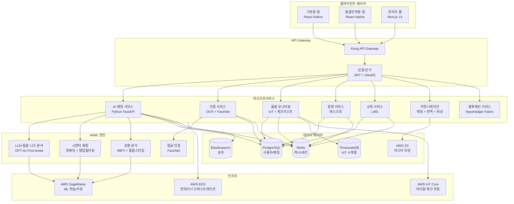
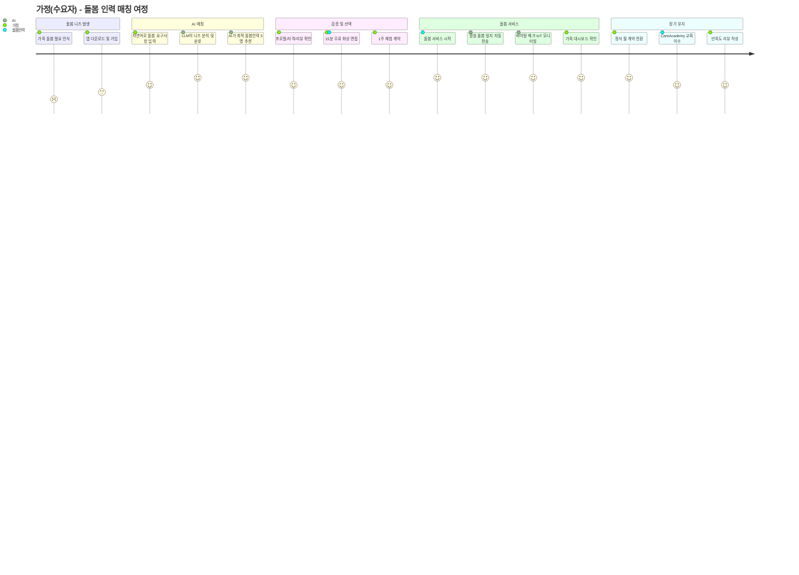
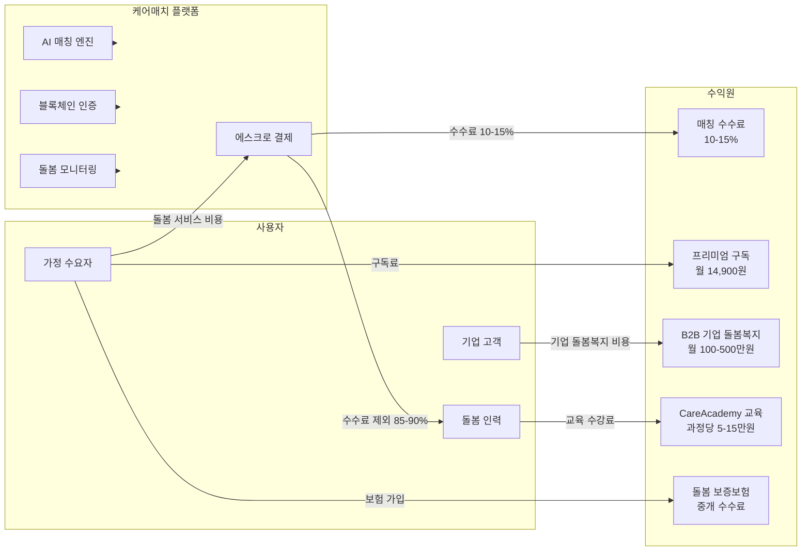
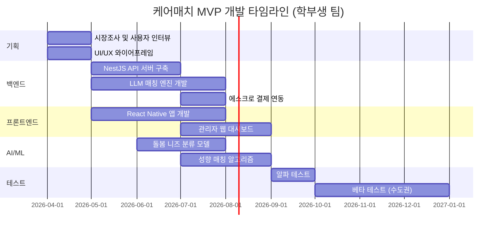

# 케어매치 (CareMatch) — 글로벌 돌봄인력-가정 AI 매칭 플랫폼

> **예비창업패키지 사업계획서**
> 작성일: 2026년 3월
> 버전: 2.0 (Enhanced)

---

## □ 일반현황

| 항목 | 내용 |
|------|------|
| **창업아이템명** | 케어매치 — AI 기반 글로벌 돌봄인력(간병인·베이비시터·가사도우미) ↔ 가정 매칭 플랫폼 |
| **산출물** | 웹 플랫폼 1개, 모바일 앱(iOS/Android) 1세트, AI 매칭 엔진 1식 |
| **직업(현재)** | 대학원 석사과정 (컴퓨터공학/사회복지학 전공) |
| **기업예정명** | 주식회사 케어매치 (CareMatch Inc.) |
| **팀 구성 현황** | 대표 1인 + 공동창업자 1인 + 외부 자문 2인 (돌봄 서비스 전문가, AI/NLP 전문가) |

---

## □ 창업 아이템 개요(요약)

| 항목 | 내용 |
|------|------|
| **명칭** | 케어매치 (CareMatch) |
| **범주** | 글로벌 돌봄인력 매칭 플랫폼 (웹 + 앱) |

### 창업 아이템 개요

**케어매치**는 돌봄이 필요한 가정(고령자 간병, 영유아 보육, 가사 돌봄)과 전 세계의 검증된 돌봄 전문 인력을 AI로 직접 연결하는 **글로벌 돌봄 매칭 플랫폼**이다. 당근마켓이 동네 물건을 연결하듯, 케어매치는 돌봄이 필요한 가정과 최적의 돌봄 전문가를 연결한다. 현재 돌봄 서비스 시장은 중개업소, 파견업체 등 다단계 구조로 중간 마진이 30-50%에 달하며, 돌봄 인력이 실제 수취하는 금액은 가정이 지불하는 비용의 50-70%에 불과하다. 더 심각한 문제는 돌봄 인력의 신원 검증, 자격 확인, 돌봄 품질 관리가 체계적으로 이루어지지 않는다는 점이다. 본 플랫폼은 LLM 기반 돌봄 니즈 분석으로 가정의 구체적 요구사항(질환, 아이 연령, 돌봄 시간대, 언어, 문화적 선호 등)을 파악하고, AI 성향 매칭으로 가정-돌봄인력 간 최적의 궁합을 도출하며, 블록체인 기반 경력·자격 인증과 실시간 돌봄 모니터링으로 신뢰와 안전을 보장한다. 이를 통해 돌봄 인력의 수취율은 80-90%로 향상되고, 가정은 검증된 전문 인력을 합리적 가격에 안심하고 이용할 수 있다.

| 요약 항목 | 내용 |
|-----------|------|
| **문제인식** | 글로벌 돌봄인력 부족 1,380만명(ILO, 2024). 한국 간병비 월 350-450만원, 간병인 수취율 50-70%. 돌봄 서비스 불만족 47%(신원 미확인, 품질 편차). 고령화·1인가구 증가로 돌봄 수요 폭발적 성장 |
| **실현가능성** | LLM 돌봄 니즈 분석(질환·연령·문화 맞춤), AI 성향 매칭(MBTI+돌봄 스타일), 블록체인 경력 인증, IoT 기반 돌봄 안전 모니터링, 에스크로 결제. 6개월 MVP → 수도권 간병·베이비시팅 시작 |
| **성장전략** | 수도권 간병·보육 → 전국 + 가사 → 글로벌(동남아 인력 ↔ 선진국 가정). 매칭 수수료 10-15% + 구독 + B2B. 3년 내 거래액 800억원, 연매출 100억원 목표 |
| **팀구성** | 풀스택 개발 대표 + 돌봄 서비스 운영 공동창업자 + 사회복지 정책 자문 + AI/NLP 기술 자문 |

---

## 1. 문제 인식 (Problem) — 창업 아이템의 필요성

### 1.0 문제 구조 전체 도식

```
┌─────────────────────────────────────────────────────────────────────────┐
│                      글로벌 돌봄 위기 (Care Crisis)                       │
│                                                                         │
│  ┌──────────────┐   ┌──────────────┐   ┌──────────────┐                │
│  │  인구 고령화    │   │ 1인 가구 증가  │   │ 맞벌이 확산   │                │
│  │ 65세+ 7.7억명  │   │  3.5억+ 가구   │   │ OECD 60%+    │                │
│  └──────┬───────┘   └──────┬───────┘   └──────┬───────┘                │
│         │                  │                  │                         │
│         ▼                  ▼                  ▼                         │
│  ┌─────────────────────────────────────────────────┐                    │
│  │           돌봄 수요 폭발적 증가                      │                    │
│  │   간병 + 보육 + 가사 = 연 $520B+ 시장               │                    │
│  └────────────────────────┬────────────────────────┘                    │
│                           │                                             │
│                    ┌──────┴──────┐                                      │
│                    ▼             ▼                                      │
│  ┌─────────────────────┐ ┌─────────────────────┐                       │
│  │   공급 부족           │ │   구조적 비효율         │                       │
│  │ ·글로벌 1,380만명 부족 │ │ ·중개업소 마진 30-50%  │                       │
│  │ ·이직률 40-60%       │ │ ·신원검증 미비 47%     │                       │
│  │ ·낮은 임금·열악한 환경  │ │ ·경력인증 시스템 부재   │                       │
│  └──────────┬──────────┘ └──────────┬──────────┘                       │
│             │                      │                                    │
│             ▼                      ▼                                    │
│  ┌─────────────────────────────────────────────────┐                    │
│  │              사회적 비용 연 32.5조원                  │                    │
│  │   경력단절 179만명 │ 가정 해체 │ 돌봄 사각지대         │                    │
│  └────────────────────────┬────────────────────────┘                    │
│                           │                                             │
│                           ▼                                             │
│  ┌─────────────────────────────────────────────────┐                    │
│  │         ► 케어매치: AI 기반 직접 매칭 플랫폼 ◄        │                    │
│  │   중개 마진 제거 │ 블록체인 인증 │ 실시간 모니터링      │                    │
│  └─────────────────────────────────────────────────┘                    │
└─────────────────────────────────────────────────────────────────────────┘
```

### 1.1 글로벌 돌봄 위기의 구조적 심각성

전 세계는 유례없는 **돌봄 위기(Care Crisis)**에 직면해 있다. 인구 고령화, 1인 가구 증가, 맞벌이 가정 확산이라는 세 가지 메가트렌드가 동시에 작용하면서, 돌봄 수요는 폭발적으로 증가하는 반면 돌봄 인력 공급은 심각하게 부족한 구조적 불균형이 발생하고 있다.

국제노동기구(ILO)의 「2024 Global Care Economy Report」에 따르면:

- **글로벌 돌봄인력 부족**: 2024년 기준 약 1,380만명의 돌봄 인력이 부족하며, 2030년까지 2,200만명으로 확대 전망
- **글로벌 65세 이상 인구**: 2024년 7.7억명 → 2030년 9.9억명 → 2050년 16억명 (UN DESA)
- **글로벌 1인 가구**: 3.5억+ (UN, 2024), 2030년 4.8억 전망
- **돌봄 비용 부담**: OECD 국가 평균 가계소득의 25-35%를 돌봄 비용에 지출
- **돌봄 인력 이직률**: 연간 40-60% (미국 BLS, 2024) — 낮은 임금, 열악한 근로조건이 원인
- **비공식 돌봄 경제**: 전 세계 무급 돌봄노동의 경제적 가치 연 $10.8T (ILO, 2024)

한국의 상황은 더욱 심각하다. 통계청과 보건복지부의 자료를 종합하면:

- **고령인구 비율**: 2024년 19.2% → 2025년 20.6%(초고령사회 진입) → 2035년 30.1%
- **간병인 수급 불균형**: 2024년 기준 요양보호사 자격 취득자 230만명 중 실제 활동 인력 52만명(22.6%)
- **간병비 부담**: 병원 간병비 월 350-450만원, 재가 돌봄 월 250-350만원 (국민건강보험공단, 2024)
- **간병인 수취율**: 가정이 지불하는 비용의 50-70%, 나머지는 중개업소·파견업체 마진
- **돌봄 서비스 불만족률**: 47.3% (한국소비자원, 2024) — 신원 미확인 28%, 품질 편차 38%, 가격 불투명 42%
- **경력단절 여성**: 돌봄 부담으로 인한 경력단절 여성 179만명 (여성가족부, 2024)
- **1인 가구**: 981만 가구(전체의 35.5%), 이 중 65세 이상 독거노인 190만명

### 1.2 돌봄 위기의 사회적 비용 분석

돌봄 문제는 단순한 개인·가정의 문제가 아니라, 사회 전체에 막대한 비용을 발생시키는 **구조적 위기**이다.

| 비용 항목 | 연간 규모 | 산출 근거 | 비고 |
|-----------|----------|----------|------|
| **경력단절 기회비용** | 12.8조원 | 경력단절 여성 179만명 x 평균 연소득 차이 716만원 | 여성가족부, 2024 |
| **비공식 간병 기회비용** | 8.2조원 | 가족간병 제공자 320만명 x 연 경제활동 손실 256만원 | 보건사회연구원, 2024 |
| **돌봄 공백 의료비 증가** | 4.5조원 | 적절한 돌봄 미제공 시 응급실 이용 3.2배 증가 | 건강보험공단, 2024 |
| **돌봄 스트레스 정신건강** | 3.8조원 | 가족 돌봄자 우울증 유병률 32%(일반인 6.7% 대비 4.8배) | 정신건강복지센터, 2024 |
| **저출산 관련 비용** | 2.1조원 | 돌봄 부담이 출산 기피 2위 사유(38.2%), 인구감소 가속 | 저출산고령사회위원회, 2024 |
| **돌봄 인력 이직 재교육** | 1.1조원 | 연 이직률 45%, 신규 인력 양성 비용 인당 340만원 | 요양보호사협회, 2024 |
| **합계** | **32.5조원** | | 한국보건사회연구원 종합 추정 |

### 1.3 사회적 문제의 심각성과 공감대 형성

#### 이야기 1: 간병 사각지대의 김 할머니

서울 은평구에 사는 김순자(78세) 할머니는 경증 치매 진단을 받았다. 아들 부부는 맞벌이로 낮 시간 돌봄이 불가능하다. 요양보호사를 구하려 했지만, 동네 중개업소에서 소개해 준 간병인은 자격증만 있을 뿐 치매 환자 돌봄 경험이 전무했다. 두 번째로 소개받은 간병인은 이틀 만에 무단 퇴직했다. 결국 아들 부부 중 한 명이 퇴직을 고민하게 되었다. **이것이 한국 220만 치매 가정의 현실이다.** 적합한 돌봄 인력을 찾기까지 평균 3.2주가 소요되며(한국치매가족협회, 2024), 그 기간 동안 가족 구성원의 경제활동 중단, 정신적 소진(번아웃), 가정 갈등이 반복된다.

#### 이야기 2: 저임금에 시달리는 돌봄 노동자

필리핀에서 온 마리아(32세)는 한국에서 5년간 가사도우미로 일해왔다. 월 220만원을 받지만, 실제로는 중개업소에 매월 50만원의 수수료를 지불한다. 경력 인증 시스템이 없어 5년 경력자나 신입이나 같은 대우를 받는다. 건강보험도, 퇴직금도 없다. **전 세계 1,170만명의 이주 돌봄 노동자**(ILO, 2024)가 이와 유사한 상황에 놓여 있다. 이들의 평균 임금은 현지 최저임금의 80-90% 수준이며, 52%가 서면 계약 없이 일한다.

#### 이야기 3: 해외 주재원 가정의 돌봄 공백

싱가포르 주재원 박 과장(38세)은 3세 아이를 위한 한국어 가능 베이비시터를 찾고 있다. 싱가포르 현지 중개업소를 통해 3개월간 7명의 베이비시터를 만나봤지만, 한국어 소통이 가능한 사람은 없었다. 해외 한인 커뮤니티에 올린 글로 겨우 구한 베이비시터는 신원 확인이 불가능했다. **2024년 기준 해외 거주 한국인 270만명**(외교부) 중 상당수가 이와 같은 크로스보더 돌봄 매칭의 어려움을 겪고 있다.

이러한 사례들은 개인적 불운이 아니라 **구조적 시스템 실패**의 결과이다. 한국보건사회연구원(2024)에 따르면, "돌봄 문제로 인한 가족의 사회적 비용"은 연간 **32.5조원**에 달하며, 이는 돌봄 제공자의 경력단절, 건강 악화, 가정 해체 등의 비용을 포함한다.

### 1.4 페르소나 심층 분석

#### 페르소나 1: 이지은 (36세, 맞벌이 엄마) — 베이비시터 매칭

```
┌─────────────────────────────────────────────────────┐
│  페르소나 1: 이지은 (36세)                             │
├─────────────────────────────────────────────────────┤
│  직업: IT 기업 과장 (연봉 5,800만원)                    │
│  가족: 남편(38세, 직장인), 아들(5세), 딸(2세)            │
│  거주: 서울 마포구 아파트                                │
├─────────────────────────────────────────────────────┤
│  ◆ 핵심 니즈                                          │
│  ├─ 어린이집 하원 후 15~18시 3시간 돌봄 공백 해결        │
│  ├─ 한국어+영어 가능, 아이 발달 관심 있는 시터           │
│  └─ 검증된 신원, 실시간 돌봄 현황 파악                   │
├─────────────────────────────────────────────────────┤
│  ◆ Pain Point                                        │
│  ├─ 맘카페 소개 시터: 신원 불확실, 무단 결근 2회 경험     │
│  ├─ 중개업소: 수수료 월 40만원 + 시터 수시 교체           │
│  └─ 퇴근 후 육아 번아웃 → 우울증 초기 진단               │
├─────────────────────────────────────────────────────┤
│  ◆ 지불 의향: 월 150-200만원 (현재 180만원 지출 중)      │
│  ◆ 전환 동인: "안심하고 맡길 수 있다는 확신"              │
│  ◆ 기대 가치: 경력 유지 + 양질의 돌봄 = 연 2,400만원+    │
└─────────────────────────────────────────────────────┘
```

**구매 여정**
1. **인식**: 둘째 출산 후 직장 복귀 고민, 어린이집 하원 후 3시간 돌봄 공백 발생
2. **탐색**: 맘카페, 지인 소개, 기존 앱 탐색 → 신원 확인 불가, 가격 불투명에 불안
3. **전환**: 케어매치 앱에서 "3세 남아, 주 5일, 15-18시, 한국어+영어 가능" 입력 → AI가 5명 추천
4. **결제**: 30분 무료 화상 면접 후 선택, 에스크로 결제, 첫 주 100% 환불 보장으로 안심
5. **유지**: 월간 돌봄 리포트, AI 발달 체크리스트, 시터와 앱 내 실시간 소통 → 6개월 이상 유지율 82%

#### 페르소나 2: 박철수 (52세, 중년 직장인) — 간병인 매칭

```
┌─────────────────────────────────────────────────────┐
│  페르소나 2: 박철수 (52세)                             │
├─────────────────────────────────────────────────────┤
│  직업: 중견기업 부장 (연봉 7,200만원)                    │
│  가족: 아내(49세), 아버지(79세, 뇌졸중+경증치매)          │
│  거주: 경기도 성남시, 아버지: 서울 관악구 독거             │
├─────────────────────────────────────────────────────┤
│  ◆ 핵심 니즈                                          │
│  ├─ 뇌졸중 후유증 + 경증 치매 동시 돌봄 가능한 전문 간병인 │
│  ├─ 주 7일 24시간 재가 간병 (형제 3인 비용 분담)          │
│  └─ 원격으로 돌봄 상태 실시간 확인                       │
├─────────────────────────────────────────────────────┤
│  ◆ Pain Point                                        │
│  ├─ 중개업소 3곳 방문: 치매+뇌졸중 동시 경력자 0명        │
│  ├─ 첫 간병인 2일 만에 무단 퇴직 → 아내가 3주간 간병      │
│  └─ 간병비 월 420만원 + 중개수수료 월 80만원 = 부담 극심   │
├─────────────────────────────────────────────────────┤
│  ◆ 지불 의향: 월 350-400만원 (현재 500만원 지출 중)      │
│  ◆ 전환 동인: "경력 검증된 전문 간병인 + 원격 모니터링"    │
│  ◆ 기대 가치: 중개마진 절감 연 960만원 + 안심감            │
└─────────────────────────────────────────────────────┘
```

**구매 여정**
1. **인식**: 아버지(79세) 뇌졸중 후유증, 퇴원 후 재가 간병 필요. 형제 합의로 비용 분담
2. **탐색**: 동네 중개업소 3곳 방문, 간병인 2명 면접 → 경력 검증 불가, 치매 동반 관리 경험자 없음
3. **전환**: 케어매치에서 "뇌졸중 후유증, 경증 치매, 남성 환자, 주 7일 24시간" 입력 → 전문 간병인 3명 추천 (뇌졸중 경력 3년+, 치매 교육 이수)
4. **결제**: 1주 체험 후 월 계약, 에스크로 + 돌봄 보증보험 가입
5. **유지**: 일일 돌봄 일지 자동 전송, 바이탈 체크 데이터 공유, 가족 공유 대시보드 → 간병인 교체율 60% 감소

#### 페르소나 3: 김미영 (41세, 싱가포르 주재원) — 크로스보더 가사+돌봄

```
┌─────────────────────────────────────────────────────┐
│  페르소나 3: 김미영 (41세)                             │
├─────────────────────────────────────────────────────┤
│  직업: 글로벌 제약사 싱가포르 지사 매니저                  │
│  가족: 남편(43세, 원격근무), 아들(9세), 딸(6세)          │
│  거주: 싱가포르 부킷티마 (2년 주재 예정)                  │
├─────────────────────────────────────────────────────┤
│  ◆ 핵심 니즈                                          │
│  ├─ 한국어+영어 가능 돌봄인력 (방과후+가사)               │
│  ├─ 한국식 식단 준비 가능, 한국어 학습 보조               │
│  └─ 비자·취업허가 서류 지원                              │
├─────────────────────────────────────────────────────┤
│  ◆ Pain Point                                        │
│  ├─ 현지 에이전시 3개월 탐색: 한국어 가능 인력 0명         │
│  ├─ 한인 커뮤니티 게시판: 신원 미확인, 계약서 없음         │
│  └─ 에이전시 수수료 SGD 2,500+ (약 250만원)              │
├─────────────────────────────────────────────────────┤
│  ◆ 지불 의향: 월 SGD 1,500-2,000 (약 150-200만원)      │
│  ◆ 전환 동인: "한국어 가능 + 크로스보더 인증 신뢰"        │
│  ◆ 기대 가치: 안정적 주재 생활 + 자녀 한국어 유지         │
└─────────────────────────────────────────────────────┘
```

**구매 여정**
1. **인식**: 싱가포르 부임, 초등학생 2명 방과후 돌봄 + 가사 필요, 한국어 소통 가능 인력 필요
2. **탐색**: 현지 에이전시 3개월간 탐색, 한국어 가능자 0명. 한인 커뮤니티 게시판 → 신원 미확인
3. **전환**: 케어매치 글로벌 매칭에서 "싱가포르, 한국어+영어, 방과후 돌봄+가사, 주 5일" 입력 → 한국어 가능 필리핀/인도네시아 인력 4명 추천
4. **결제**: 화상 면접 + 경력·범죄이력 크로스보더 인증 확인 후 계약
5. **유지**: 다국어 소통 지원, 문화 적응 가이드 제공 → 해외 한인 커뮤니티 바이럴

### 1.5 기존 솔루션의 한계

현재 돌봄 서비스 중개 시장은 다음과 같은 구조적 한계를 갖고 있다:

**1) 오프라인 중개업소 의존**
- 한국의 간병인 중개업소 약 8,500개소(2024), 대부분 소규모 영세업체
- 수기 매칭(전화·방문), 데이터 기반 최적화 불가
- 중개 수수료 20-40%, 돌봄 인력에게 전가
- 계약서 미작성 비율 38%, 보험 미가입 비율 62%

**2) 국내 플랫폼의 한계**
- **케어닥**: 간병인 매칭 서비스, 80억원 투자. 단순 프로필 기반 매칭, AI 고도화 부족, 국내 한정
- **돌봄히어로**: 가사도우미 매칭, 50억원 투자. 단시간 가사 중심, 전문 간병·보육 미지원
- **째깍악어**: 아이돌봄 매칭, 100억원 투자. 베이비시터 한정, 간병·가사 미지원, 국내만 서비스

**3) 해외 플랫폼의 한계**
- **Care.com**: IAC에 $500M 인수(2020), 35개국 3,500만 회원. 그러나 안전 사고 논란(2019 WSJ 보도), 신원 검증 시스템 허점 노출. 아시아 시장 진출 미미
- **Honor**: 시니어 케어 기업, $1.25B 기업가치(2021). 미국 한정, 비용 프리미엄(시간당 $25-65), AI 매칭이 아닌 자체 고용 모델
- **Helpling**: 유럽 가사 매칭, $70M 투자. 가사청소 한정, 간병·보육 미지원

**4) 공통 한계점**
- 크로스보더 매칭 부재: 해외 인력 ↔ 현지 가정 연결 시스템 없음
- AI 기반 성향·궁합 매칭 부재: 단순 조건(지역·시간·가격) 필터링에 그침
- 돌봄 품질 실시간 모니터링 부재: 서비스 제공 중 품질 확인 불가
- 돌봄 인력 경력 인증 부재: 경력·교육·평가 이력의 검증 가능한 포트폴리오 시스템 없음

### 1.6 해외 사례 비교 도표

| 비교 항목 | Care.com (미국) | Honor (미국) | UrbanSitter (미국) | Helper (홍콩) | Carer (호주) | **케어매치** |
|-----------|----------------|-------------|-------------------|-------------|-------------|-------------|
| 설립연도 | 2006 | 2014 | 2011 | 2016 | 2014 | **2026** |
| 기업가치/투자 | $500M 인수 | $1.25B | $43M 투자 | 비공개 | 비공개 | **Pre-Seed 5억** |
| 돌봄 범위 | 종합(베이비시터·시니어·가사·펫) | 시니어 전용 | 베이비시터 전용 | 가사도우미 전용 | 시니어 전용 | **종합(간병+보육+가사)** |
| 매칭 방식 | 조건 필터링 | 자체 고용+알고리즘 | 소셜 추천 | 프로필 검색 | 직접 연결 | **LLM+성향 AI 매칭** |
| 신원 검증 | 기본(사고 후 강화) | 자체 고용 검증 | 소셜 네트워크 신뢰 | 기본 프로필 | 기본 | **블록체인+OCR+FaceNet** |
| 돌봄 모니터링 | 없음 | 자체 모니터링 | 없음 | 없음 | 없음 | **AI 돌봄일지+IoT 바이탈** |
| 크로스보더 | 35개국(미국 중심) | 미국 한정 | 미국 한정 | 아시아 3국 | 호주·NZ | **한국→아시아→글로벌** |
| 다국어 지원 | 영어 중심 | 영어 | 영어 | 영어+중국어 | 영어 | **6개 언어 실시간 번역** |
| 인력 수취율 | 70-80% | 60% | 75-85% | 80%+ | 90%+ | **85-90%** |
| 교육 플랫폼 | 없음 | 자체 교육 | 없음 | 없음 | 없음 | **CareAcademy 30과정** |
| **핵심 시사점** | 스케일 가능성 입증 | 품질 관리 중요성 | 소셜 신뢰 가치 | 크로스보더 가능성 | 중개 제거 효과 | **종합 통합** |

### 1.7 시장 규모 분석 (TAM/SAM/SOM)

#### 시장 기회 도식

```
┌─────────────────────────────────────────────────────────────────┐
│                                                                 │
│   TAM (Total Addressable Market)                                │
│   글로벌 온라인 돌봄 매칭 시장: $38.5B (2030)                      │
│   ┌─────────────────────────────────────────────────────┐       │
│   │                                                     │       │
│   │   SAM (Serviceable Available Market)                │       │
│   │   아시아-태평양 온라인 돌봄 매칭: $11.5B (2030)       │       │
│   │   ┌─────────────────────────────────────────┐       │       │
│   │   │                                         │       │       │
│   │   │   SOM (Serviceable Obtainable Market)   │       │       │
│   │   │   한국 시장 8-12% 점유                    │       │       │
│   │   │   = 3년차 800억원 거래액                  │       │       │
│   │   │   = 연매출 100억원                        │       │       │
│   │   │                                         │       │       │
│   │   └─────────────────────────────────────────┘       │       │
│   │                                                     │       │
│   └─────────────────────────────────────────────────────┘       │
│                                                                 │
│   ► CAGR 20.1% (2024-2030)                                     │
│   ► 아시아-태평양 성장률 23.4% (최고 성장 권역)                    │
│                                                                 │
└─────────────────────────────────────────────────────────────────┘
```

#### 시장 데이터

| 시장 구분 | 2024-2025년 | 2030년 (전망) | CAGR |
|-----------|-------------|---------------|------|
| 글로벌 홈케어 시장 | $520B (2024) | $900B | 9.5% |
| 글로벌 홈헬스케어(재가간병) | $390B (2024) | $700B | 10.3% |
| 글로벌 차일드케어 서비스 | $480B (2024) | $820B | 9.4% |
| 글로벌 가사서비스 | $270B (2024) | $460B | 9.3% |
| 글로벌 온라인 돌봄 매칭 | $12.8B (2024) | $38.5B | 20.1% |
| 한국 돌봄 서비스 시장 | 25조원 (2024) | 45조원 | 10.3% |
| 한국 간병 서비스 | 8.5조원 (2024) | 16조원 | 11.1% |
| 한국 아이돌봄 서비스 | 5.2조원 (2024) | 9조원 | 9.6% |

> 출처: Grand View Research (2024), Statista Home Care Report (2025), ILO Global Care Economy Report (2024), 보건복지부 (2024), 한국보건사회연구원 (2024)

#### TAM (Total Addressable Market) — 전체 시장

**글로벌 온라인 돌봄 매칭 시장: $38.5B (2030년)**

글로벌 돌봄 서비스 시장($520B+)에서 온라인 매칭·플랫폼으로 전환되는 비율이 2024년 2.5%에서 2030년 4.3%로 증가하며, 이 영역이 케어매치의 전체 시장이다. 특히 아시아-태평양 지역은 고령화 속도가 가장 빠른 권역으로 연 23.4%의 성장률을 보이고 있다.

#### SAM (Serviceable Available Market) — 유효 시장

**아시아-태평양 온라인 돌봄 매칭: $11.5B (2030년)**

케어매치가 1차적으로 공략하는 한국·일본·동남아(싱가포르, 대만, 홍콩) 시장의 온라인 돌봄 매칭 시장 규모이다. 이 지역은 (1) 고령화율 세계 최고, (2) 스마트폰 보급률 90%+, (3) 이주 돌봄 노동자 수요가 높다는 공통점을 가진다.

#### SOM (Serviceable Obtainable Market) — 획득 가능 시장

**한국 온라인 돌봄 매칭 시장의 8-12% 점유 = 3년차 800억원 거래액**

한국 돌봄 시장(25조원)에서 온라인 매칭 비중(2030년 5%)인 약 1.25조원 중 8-12%를 3년 내 점유하는 것이 목표이다. 이는 월 간병 매칭 8,000건 + 베이비시터 매칭 12,000건 + 가사 매칭 15,000건 수준에 해당한다.

### 1.8 사용자 구매동인(Purchase Motivation) 분석

돌봄 서비스의 구매동인은 일반 소비재와 근본적으로 다르다. 가족의 안전과 건강이 직결되는 서비스이기 때문에 **감정적·사회적 동인이 기능적 동인보다 강력하게 작용**한다.

#### 기능적 동인 (Functional Motivation)

| 동인 | 구체적 내용 | 지불 의향 영향 |
|------|-----------|--------------|
| **시간 절약** | 적합한 돌봄인력 찾기까지 평균 3.2주 → 24시간 내 매칭 | 월 10-20만원 추가 지불 의향 |
| **비용 절감** | 중개업소 마진 30-50% 제거 → 동일 품질 20-30% 저렴 | 연간 360-720만원 절감 효과 |
| **편의성** | 앱에서 예약·결제·소통·변경·취소 원스톱 처리 | 오프라인 대비 80% 시간 절약 |
| **품질 보장** | AI 매칭 정확도 + 실시간 모니터링 + 품질 보증 | 불만족 시 전액 환불 보장 |

#### 감정적 동인 (Emotional Motivation)

| 동인 | 구체적 내용 | 심리적 가치 |
|------|-----------|-----------|
| **안심** | 신원·범죄이력·자격 100% 검증된 인력만 매칭 | "우리 가족을 맡길 수 있다"는 신뢰 |
| **죄책감 해소** | 직접 돌볼 수 없는 부모/자녀에 대한 죄책감 경감 | "최선의 선택을 했다"는 확신 |
| **안도** | 돌봄 공백 해소로 직장 생활 지속 가능 | 경력단절 방지의 안도감 |
| **유대감** | 돌봄인력과 가정 간 장기 관계 형성 | "우리 가족의 일원" 같은 연결감 |

#### 사회적 동인 (Social Motivation)

| 동인 | 구체적 내용 | 사회적 가치 |
|------|-----------|-----------|
| **돌봄 노동 정당 대우** | 중개 마진 최소화 → 돌봄 인력 수취율 80-90% | "착한 소비"를 통한 사회적 기여 |
| **이주 노동자 권익** | 서면 계약, 보험, 경력 인증 → 이주 돌봄 노동자 보호 | ESG 가치 소비 니즈 충족 |
| **세대 간 연대** | 청년 돌봄 인력 ↔ 시니어 수요자 매칭 → 세대 간 소통 촉진 | 사회적 고립 해소 기여 |

---

## 2. 실현 가능성 (Solution) — 창업 아이템의 개발 계획

### 2.0 서비스 아키텍처 개요

```
┌─────────────────────────────────────────────────────────────────────┐
│                       케어매치 서비스 아키텍처                          │
├─────────────────────────────────────────────────────────────────────┤
│                                                                     │
│  ┌──────────┐    ┌──────────┐    ┌──────────┐                      │
│  │  가정 앱   │    │ 돌봄인력앱 │    │ 관리자 웹  │                      │
│  │ (React    │    │ (React   │    │ (Next.js │                      │
│  │  Native)  │    │  Native) │    │   14)    │                      │
│  └─────┬─────┘    └─────┬────┘    └─────┬────┘                      │
│        │               │               │                            │
│        └───────────────┬┘───────────────┘                            │
│                        ▼                                             │
│  ┌─────────────────────────────────────────────────┐                │
│  │              API Gateway (Kong)                  │                │
│  │         JWT 인증 │ Rate Limiting │ 로깅           │                │
│  └────────────────────────┬────────────────────────┘                │
│                           │                                          │
│     ┌─────────┬──────────┬┴──────────┬──────────┬─────────┐         │
│     ▼         ▼          ▼           ▼          ▼         ▼         │
│  ┌──────┐ ┌──────┐ ┌──────────┐ ┌──────┐ ┌──────┐ ┌──────────┐   │
│  │ AI   │ │ 인증  │ │ 돌봄     │ │ 결제  │ │ 교육  │ │ 커뮤니    │   │
│  │ 매칭  │ │ 서비스│ │ 모니터링  │ │ 서비스│ │ 서비스│ │ 케이션    │   │
│  │ 서비스│ │      │ │ 서비스   │ │      │ │      │ │ 서비스    │   │
│  └──┬───┘ └──┬───┘ └───┬──────┘ └──┬───┘ └──┬───┘ └───┬──────┘   │
│     │        │         │           │        │         │            │
│     ▼        ▼         ▼           ▼        ▼         ▼            │
│  ┌─────────────────────────────────────────────────────────────┐   │
│  │                    데이터 레이어                               │   │
│  │  PostgreSQL │ Redis │ TimescaleDB │ Elasticsearch │ S3      │   │
│  └─────────────────────────────────────────────────────────────┘   │
│                                                                     │
│  ┌─────────────────────────────────────────────────────────────┐   │
│  │                    AI/ML 엔진                                │   │
│  │  LLM 니즈분석 │ 시맨틱 매칭 │ 성향 분석 │ FaceNet 인증       │   │
│  └─────────────────────────────────────────────────────────────┘   │
│                                                                     │
│  ┌─────────────────────────────────────────────────────────────┐   │
│  │                    블록체인 레이어                             │   │
│  │  Hyperledger Fabric │ 경력 인증 │ 돌봄 이력 │ 자격 검증       │   │
│  └─────────────────────────────────────────────────────────────┘   │
│                                                                     │
└─────────────────────────────────────────────────────────────────────┘
```

### 2.1 핵심 기능

#### 1) LLM 기반 돌봄 니즈 분석 & AI 매칭

- 가정이 자연어로 돌봄 요구사항을 입력하면 LLM이 **질환(뇌졸중·치매·파킨슨 등), 돌봄 강도(경증/중증), 아이 연령, 필요 시간대, 언어, 문화적 선호, 예산** 등을 자동 분류
- 돌봄 인력의 프로필(경력·자격·성격·돌봄 스타일·평가 이력)과 가정의 니즈를 **시맨틱 임베딩 + 협업 필터링**으로 매칭
- MBTI 기반 성향 매칭: 돌봄 인력과 수요자의 성격 궁합 점수 산출 (내향/외향, 구조적/유연한 돌봄 스타일)
- **매칭 추천 5명 → 15분 무료 화상 면접 → 1주 체험 → 정식 계약** 단계적 검증 프로세스
- 매칭 정확도 목표: 만족도 4.5+/5.0 비율 85% 이상 (기존 중개업소 52% 대비)
- 긴급 매칭 모드: 간병인 갑작스러운 결근/퇴직 시 4시간 내 대체 인력 매칭

#### 2) 블록체인 기반 경력·자격 인증 시스템

- 돌봄 인력의 자격증(요양보호사, 간호조무사, 보육교사 등) → OCR + 발급기관 API 자동 검증
- 범죄이력 조회: 성범죄·아동학대·폭력 전과 조회 (경찰청 API 연동, 해외 인력은 자국 범죄증명서 + 대사관 공증)
- **블록체인(Hyperledger Fabric) 기반 경력 포트폴리오**: 이전 근무 이력, 교육 이수, 평가 점수가 위변조 불가하게 기록
- 얼굴 인증(FaceNet): 등록된 인력 본인 확인, 출퇴근 시 얼굴 인증
- 해외 자격 상호인정: 각국 돌봄 자격증의 등급 매핑 테이블 구축 (예: 필리핀 Caregiver NC II ↔ 한국 요양보호사)

#### 3) 실시간 돌봄 모니터링 & 안전 시스템

- **돌봄 일지 자동 생성**: 돌봄 인력이 체크리스트(식사, 투약, 운동, 기분 상태 등) 입력 → AI가 일일/주간 리포트 자동 생성 → 가족에게 전송
- **바이탈 체크 연동**: 혈압계·혈당계·체온계 등 IoT 기기 데이터 자동 수집 → 이상 수치 감지 시 가족·의료진 자동 알림
- **SOS 버튼**: 돌봄 인력·수요자 양쪽 모두 긴급 상황 시 원터치 신고 → 119/112 자동 연결 + 가족 즉시 알림
- **아이 안전 모니터링**: 베이비시터 서비스 시, 부모가 실시간 위치 확인(GPS) + 주요 활동 타임라인 수신
- **CCTV 동의 기반 녹화**: 가정과 돌봄 인력 상호 동의 하에 주요 공간 녹화 → 분쟁 시 증거 자료

#### 4) 에스크로 결제 & 돌봄 보증보험

- **에스크로 결제**: 가정이 결제한 금액을 케어매치가 임시 보관, 돌봄 완료 확인 후 돌봄 인력에게 지급
- **1주 체험 보장**: 첫 1주 내 불만족 시 100% 환불 + 대체 인력 무료 재매칭
- **돌봄 보증보험**: 돌봄 중 발생하는 사고(상해, 물품 파손 등)에 대한 보험 자동 가입 (보험료 플랫폼 부담)
- **자동 급여 관리**: 시간제/일급/월급 자동 계산, 4대 보험 신고 대행, 세금 원천징수 안내
- **가족 공유 결제**: 형제·가족 구성원이 간병비를 분담 결제할 수 있는 공유 결제 기능

#### 5) 교육·성장 플랫폼 (CareAcademy)

- **온라인 교육 과정**: 치매 돌봄, 영유아 발달, 응급처치, 식이 관리, 정서 케어 등 30개+ 과정
- **교육 이수 → 자격 등급 상승 → 시급 인상**: 교육 완료 시 프로필에 배지 부여, AI 매칭 우선순위 상승
- **멘토-멘티 매칭**: 경력 5년+ 시니어 돌봄인력이 신입 인력을 1:1 멘토링
- **돌봄 커뮤니티**: 돌봄 인력 간 경험 공유, 어려운 케이스 상담, 정서적 지지 네트워크

#### 6) 다국어 & 크로스보더 매칭

- **6개 언어 지원**: 한국어, 영어, 일본어, 중국어, 베트남어, 인도네시아어
- **실시간 번역 채팅**: 가정-돌봄인력 간 앱 내 채팅 자동 번역
- **문화 적응 가이드**: 각국의 돌봄 문화·예절·음식 선호 등 가이드 제공 (예: 한국 가정 매칭 시 한국 식문화·생활 예절 교육)
- **비자·취업허가 정보 연동**: 각국 돌봄 인력 취업 비자 요건, 필요 서류, 신청 절차 안내
- **해외 한인 커뮤니티 연동**: 각국 한인회·한인 교회·한국 학교 네트워크를 통한 수요자 발굴

### 2.2 AI 매칭 모델 개발 로드맵

| 단계 | 모델 | 학습 데이터 | 목표 성능 | 개발 기간 |
|------|------|-----------|----------|----------|
| **v1.0 규칙 기반** | 조건 필터링 + 가중치 스코어링 | 돌봄인력 프로필 500건, 가정 요구사항 템플릿 | 매칭 만족도 3.5/5.0 | 2026.04-06 |
| **v2.0 임베딩 매칭** | Sentence-BERT + pgvector 유사도 | 프로필·리뷰·평가 데이터 5,000건 | 매칭 만족도 4.0/5.0 | 2026.06-08 |
| **v3.0 LLM 니즈 분석** | GPT-4o Fine-tuned (돌봄 도메인) | 돌봄 상담 대화 10,000건, 의료·복지 용어 사전 | 니즈 분류 정확도 92%+ | 2026.08-10 |
| **v4.0 성향 매칭** | 협업 필터링 + MBTI 성격 모델 | 매칭 후 만족도 피드백 20,000건 | 매칭 만족도 4.5/5.0 | 2027.01-04 |
| **v5.0 예측 매칭** | 장기 유지율 예측 모델 (XGBoost) | 6개월+ 매칭 유지 데이터 50,000건 | 6개월 유지율 80%+ 예측 | 2027.06-09 |
| **v6.0 크로스보더 매칭** | 다국어 임베딩 + 문화 적합도 모델 | 크로스보더 매칭 데이터 10,000건 | 크로스보더 만족도 4.3+ | 2028.01-06 |

### 2.3 시스템 아키텍처 (Layered)

```
┌─────────────────────────────────────────────────────────────────────┐
│                    ◆ Presentation Layer ◆                           │
│  ┌─────────────┐  ┌─────────────┐  ┌─────────────┐                │
│  │ 가정용 앱     │  │ 돌봄인력 앱   │  │ 관리자 웹    │                │
│  │ React Native │  │ React Native│  │ Next.js 14  │                │
│  │ (iOS/Android)│  │ (iOS/Android)│  │ (Dashboard) │                │
│  └──────┬──────┘  └──────┬──────┘  └──────┬──────┘                │
├─────────┴────────────────┴────────────────┴────────────────────────┤
│                    ◆ API Gateway Layer ◆                           │
│  ┌─────────────────────────────────────────────────────────────┐   │
│  │  Kong API Gateway                                           │   │
│  │  ├─ JWT/OAuth2 인증·인가                                     │   │
│  │  ├─ Rate Limiting (돌봄인력: 1000req/m, 가정: 500req/m)      │   │
│  │  ├─ Request/Response 로깅                                   │   │
│  │  └─ Circuit Breaker (장애 전파 차단)                          │   │
│  └─────────────────────────────────────────────────────────────┘   │
├────────────────────────────────────────────────────────────────────┤
│                    ◆ Service Layer (Microservices) ◆               │
│                                                                    │
│  ┌──────────┐ ┌──────────┐ ┌──────────┐ ┌──────────┐             │
│  │ AI 매칭   │ │ 인증·보안 │ │ 돌봄 모니 │ │ 결제·정산 │             │
│  │ Service   │ │ Service  │ │ 터링 Svc  │ │ Service  │             │
│  │ (FastAPI) │ │ (NestJS) │ │ (FastAPI) │ │ (NestJS) │             │
│  └──────────┘ └──────────┘ └──────────┘ └──────────┘             │
│  ┌──────────┐ ┌──────────┐ ┌──────────┐                          │
│  │ 교육 LMS │ │ 커뮤니케 │ │ 블록체인  │                          │
│  │ Service  │ │ 이션 Svc │ │ Service  │                          │
│  │ (NestJS) │ │ (NestJS) │ │ (Go)     │                          │
│  └──────────┘ └──────────┘ └──────────┘                          │
├────────────────────────────────────────────────────────────────────┤
│                    ◆ AI/ML Engine Layer ◆                          │
│  ┌──────────────────────────────────────────────────────────┐     │
│  │  AWS SageMaker                                           │     │
│  │  ├─ LLM 돌봄 니즈 분석 (GPT-4o Fine-tuned)               │     │
│  │  ├─ 시맨틱 매칭 (Sentence-BERT + 협업필터링)               │     │
│  │  ├─ 성향 분석 (MBTI + 돌봄스타일 모델)                     │     │
│  │  ├─ 얼굴 인증 (FaceNet)                                  │     │
│  │  └─ 이상 감지 (바이탈 시계열 Anomaly Detection)            │     │
│  └──────────────────────────────────────────────────────────┘     │
├────────────────────────────────────────────────────────────────────┤
│                    ◆ Data Layer ◆                                  │
│  ┌──────────┐ ┌──────────┐ ┌──────────┐ ┌──────────┐            │
│  │PostgreSQL│ │  Redis   │ │Timescale │ │Elastic-  │            │
│  │(사용자/  │ │ (캐시/   │ │DB (IoT   │ │search    │            │
│  │ 매칭DB)  │ │  세션)   │ │ 시계열)  │ │ (검색)   │            │
│  └──────────┘ └──────────┘ └──────────┘ └──────────┘            │
│  ┌──────────┐ ┌──────────────────────────────────────┐           │
│  │ AWS S3   │ │ Hyperledger Fabric                    │           │
│  │ (미디어) │ │ (경력인증 + 돌봄이력 블록체인)           │           │
│  └──────────┘ └──────────────────────────────────────┘           │
├────────────────────────────────────────────────────────────────────┤
│                    ◆ Infrastructure Layer ◆                        │
│  ┌──────────────────────────────────────────────────────────┐     │
│  │  AWS Cloud                                               │     │
│  │  ├─ EKS (Kubernetes 오케스트레이션)                        │     │
│  │  ├─ SageMaker (ML 학습/서빙)                              │     │
│  │  ├─ IoT Core (바이탈 체크 MQTT)                           │     │
│  │  ├─ CloudFront CDN                                       │     │
│  │  ├─ KMS (암호화 키 관리)                                  │     │
│  │  └─ CloudWatch + Grafana + Prometheus (모니터링)          │     │
│  └──────────────────────────────────────────────────────────┘     │
└─────────────────────────────────────────────────────────────────────┘
```

### 2.4 사용자 흐름 (User Flow)

```
┌─────────────────────────────────────────────────────────────────────┐
│                    가정(수요자) 사용자 흐름                            │
├─────────────────────────────────────────────────────────────────────┤
│                                                                     │
│  [앱 다운로드]                                                       │
│       │                                                             │
│       ▼                                                             │
│  [회원가입/로그인] ──► 본인인증(휴대폰) + 기본정보 입력                 │
│       │                                                             │
│       ▼                                                             │
│  [돌봄 니즈 입력] ──► 자연어 입력: "아버지 78세, 치매, 주 5일 돌봄"     │
│       │                                                             │
│       ▼                                                             │
│  ┌──────────────────────────────────────┐                           │
│  │  LLM 니즈 분석 엔진                    │                           │
│  │  ├─ 질환 분류: 경증 치매               │                           │
│  │  ├─ 돌봄 강도: 중간                    │                           │
│  │  ├─ 필요 시간: 주 5일, 09-18시         │                           │
│  │  ├─ 선호 조건: 치매 경력 2년+          │                           │
│  │  └─ 예산 범위: 월 250-350만원          │                           │
│  └──────────────────┬───────────────────┘                           │
│                     ▼                                               │
│  [AI 매칭 결과] ──► 최적 돌봄인력 5명 추천 (매칭 점수 순)              │
│       │                                                             │
│       ├──► [프로필 상세 확인] ──► 경력/자격/리뷰/블록체인 인증 확인    │
│       │                                                             │
│       ▼                                                             │
│  [무료 화상 면접] ──► 15분 LiveKit 화상 면접 (실시간 번역 지원)        │
│       │                                                             │
│       ▼                                                             │
│  [1주 체험 계약] ──► 에스크로 결제 + 돌봄 보증보험 자동 가입           │
│       │                                                             │
│       ├──► [불만족] ──► 100% 환불 + 대체 인력 무료 재매칭             │
│       │                                                             │
│       ▼                                                             │
│  [정식 계약 전환] ──► 월 계약 + 가족 공유 대시보드 활성화              │
│       │                                                             │
│       ▼                                                             │
│  ┌──────────────────────────────────────┐                           │
│  │  돌봄 진행 중                          │                           │
│  │  ├─ 일일 돌봄 일지 자동 전송            │                           │
│  │  ├─ 바이탈 체크 IoT 데이터 수신         │                           │
│  │  ├─ SOS 긴급 알림 대기                 │                           │
│  │  └─ 월간 종합 돌봄 리포트               │                           │
│  └──────────────────┬───────────────────┘                           │
│                     ▼                                               │
│  [만족도 평가] ──► 리뷰 작성 → 블록체인 기록 → 돌봄인력 등급 반영     │
│                                                                     │
└─────────────────────────────────────────────────────────────────────┘
```

### 2.5 기술 스택

| 구분 | 기술 |
|------|------|
| **프론트엔드** | Next.js 14 (웹), React Native (앱), 고령자 맞춤 UI (큰 글씨, 음성 입력, 간결한 네비게이션) |
| **백엔드** | Python FastAPI (AI 서빙), Node.js + NestJS (API Gateway), GraphQL |
| **AI/ML** | LLM 매칭 (GPT-4o Fine-tuned, 돌봄 도메인 특화), 성향 매칭 (협업 필터링 + 시맨틱 임베딩), FaceNet (얼굴 인증), OCR (자격증/신분증 인식) |
| **블록체인** | Hyperledger Fabric (경력 인증, 돌봄 이력 위변조 방지) |
| **커뮤니케이션** | LiveKit (WebRTC 화상 면접), 실시간 번역 파이프라인 (Whisper STT → LLM 번역 → TTS) |
| **IoT 연동** | 바이탈 체크 기기 BLE/WiFi 연동, MQTT 프로토콜, AWS IoT Core |
| **결제** | 토스페이먼츠 (국내), Stripe (해외), 에스크로 시스템 자체 구축 |
| **인프라** | AWS (EKS, RDS, SageMaker, IoT Core, S3), CloudFront CDN |
| **데이터** | PostgreSQL + Redis + Elasticsearch, 돌봄 일지 시계열 데이터 (TimescaleDB) |
| **모니터링** | Grafana + Prometheus, Sentry, AWS CloudWatch |
| **보안** | AES-256 암호화, AWS KMS, SOC 2 Type II 인증 목표 |

### 2.6 개발 일정

| 구분 | 추진 내용 | 추진 기간 | 세부 내용 |
|------|----------|----------|----------|
| 1 | MVP 개발 | 2026.04 ~ 2026.09 | 간병인·베이비시터 매칭 기본 기능, 프로필 등록, 조건 매칭, 예약·결제 |
| 2 | AI 매칭 엔진 개발 | 2026.06 ~ 2026.10 | LLM 돌봄 니즈 분석, 성향 매칭 모델 학습, 매칭 추천 알고리즘 |
| 3 | 인증 시스템 구축 | 2026.07 ~ 2026.10 | 자격증 OCR, 범죄이력 조회 API 연동, FaceNet 얼굴 인증, 블록체인 경력 인증 |
| 4 | 베타 테스트 | 2026.10 ~ 2026.12 | 수도권 간병인 300명 + 베이비시터 500명 + 가정 2,000가구 |
| 5 | 돌봄 모니터링 | 2027.01 ~ 2027.04 | 돌봄 일지 자동화, 바이탈 체크 IoT 연동, SOS 시스템, 가족 대시보드 |
| 6 | 교육 플랫폼 출시 | 2027.03 ~ 2027.06 | CareAcademy 온라인 교육 30과정, 멘토-멘티 매칭, 자격 등급 시스템 |
| 7 | 크로스보더 매칭 | 2027.04 ~ 2027.09 | 다국어 지원 6개 언어, 해외 인력 인증 시스템, 비자 정보 연동 |

### 2.7 정부지원사업비 집행 계획

**< 1단계 (20백만원) >**

| 비목 | 산출 근거 | 금액(원) |
|------|----------|---------|
| 재료비 | AWS 인프라 6개월 (월 150만원 x 6) + IoT 바이탈 체크 연동 시제품 | 10,000,000 |
| 외주용역비 | UI/UX 디자인 용역 (가정·돌봄인력 듀얼 인터페이스 + 고령자 맞춤 UI) | 5,000,000 |
| 지급수수료 | OpenAI API, 경찰청 범죄이력 API, 자격증 검증 API 사용료 6개월 | 2,000,000 |
| 특허출원 | AI 돌봄 매칭 알고리즘 + 블록체인 경력 인증 시스템 특허 2건 | 3,000,000 |
| **합계** | | **20,000,000** |

**< 2단계 (40백만원) >**

| 비목 | 산출 근거 | 금액(원) |
|------|----------|---------|
| 인건비 | AI/ML 엔지니어 채용 6개월 (월 400만원 x 6) | 24,000,000 |
| 재료비 | AWS SageMaker 학습비용 + 블록체인 인프라 구축 | 4,000,000 |
| 외주용역비 | 보안 취약점 점검 + 개인정보보호 법률 자문 + 돌봄 보증보험 설계 컨설팅 | 4,000,000 |
| 마케팅 | 돌봄인력 온보딩 캠페인 + 가정 체험단 운영 + 시니어 복지관 협력 홍보 | 8,000,000 |
| **합계** | | **40,000,000** |

**< 2단계 예산 상세 내역 >**

| 세부 항목 | 월별 집행 계획 | 금액(원) | 산출 근거 |
|----------|-------------|---------|----------|
| AI/ML 엔지니어 인건비 | 2026.07-12 (6개월) | 24,000,000 | 석사급 ML 엔지니어 월 400만원, LLM 파인튜닝+매칭 모델 개발 |
| SageMaker GPU 학습 | 2026.07-09 집중 | 2,000,000 | ml.p3.2xlarge 인스턴스 월 60시간 x 3개월 |
| Hyperledger 노드 | 2026.08-12 (5개월) | 2,000,000 | 경력 인증 블록체인 4노드 클러스터 운영 |
| 보안 점검 | 2026.10 일괄 | 1,500,000 | OWASP Top 10 기반 취약점 점검 + 모의해킹 |
| 법률 자문 | 2026.08-10 | 1,500,000 | 개인정보보호법, 근로기준법, 보험업법 자문 각 50만원 |
| 보험 설계 | 2026.09-10 | 1,000,000 | 삼성화재/DB손보 돌봄 보증보험 상품 설계 컨설팅 |
| 돌봄인력 온보딩 | 2026.10-12 | 3,000,000 | 요양병원·복지관 협력 설명회 20회, 인력 등록 인센티브 |
| 가정 체험단 | 2026.11-12 | 3,000,000 | 수도권 2,000가구 1주 무료 체험, 체험 후 리뷰 캠페인 |
| 시니어 복지관 홍보 | 2026.10-12 | 2,000,000 | 서울·경기 복지관 50개소 홍보물 배포, 디지털 리터러시 교육 |
| **합계** | | **40,000,000** | |

**< Pre-Seed 투자금 (5억원) 예산 배분 >**

| 항목 | 금액(백만원) | 비중 | 용도 상세 |
|------|-----------|------|----------|
| 인건비 | 180 | 36% | 핵심 개발팀 4명 x 12개월 (대표 포함, 평균 월 375만원) |
| AI/ML 인프라 | 80 | 16% | SageMaker, GPU 클라우드, LLM API, 학습 데이터 구축 |
| 앱/웹 개발 | 60 | 12% | React Native 앱 + Next.js 웹 + 관리자 대시보드 |
| 블록체인 구축 | 40 | 8% | Hyperledger Fabric 네트워크 구축 + 스마트 컨트랙트 개발 |
| 보안/법무 | 30 | 6% | SOC 2 인증 준비, 개인정보보호, 돌봄 관련 법률 자문 |
| 마케팅/온보딩 | 50 | 10% | 돌봄인력 800명 + 가정 2,000가구 초기 확보 |
| 보험 설계 | 20 | 4% | 돌봄 보증보험 상품 공동 개발 (보험사 제휴) |
| 운영/예비비 | 40 | 8% | 사무실, 법인 설립, 회계, 예비비 |
| **합계** | **500** | **100%** | |

---

## 3. 성장전략 (Scale-up) — 사업화 추진 전략

### 3.1 경쟁사 분석

| 구분 | Care.com | Honor | 째깍악어 | 케어닥 | 숨고(돌봄) | **케어매치** |
|------|----------|-------|---------|--------|---------|-----------|
| 주요 타겟 | 미국 가정 | 미국 시니어 | 한국 아이돌봄 | 한국 간병 | 한국 전반 | **글로벌 전 돌봄** |
| 돌봄 범위 | 종합 | 시니어 한정 | 아이 한정 | 간병 한정 | 간병·보육 | **간병+보육+가사** |
| AI 매칭 | 기본 필터 | 중간 | 기본 | 기본 | 견적 입찰 | **LLM+성향 매칭** |
| 신원 검증 | 강화(사고 후) | 자체 고용 | 프로필 | 기본 | 프로필 | **블록체인 인증** |
| 품질 모니터링 | 없음 | 자체 모니터링 | 기본 리뷰 | 기본 리뷰 | 리뷰 | **AI 돌봄일지+IoT** |
| 글로벌 | 35개국(미국 중심) | 미국 한정 | 한국 한정 | 한국 한정 | 한국 한정 | **한국→아시아→글로벌** |
| 돌봄인력 복지 | 기본 | 자체 고용 복지 | 기본 | 기본 | 없음 | **교육+경력인증+보험** |
| 돌봄인력 수취율 | 70-80% | 60%(자체 고용) | 75% | 65-75% | 80% | **85-90%** |

### 3.2 비즈니스 모델

| 수익원 | 설명 | 목표 비중 |
|--------|------|----------|
| **매칭 수수료** | 돌봄 서비스 거래액의 10-15% (가정 측 5-8% + 돌봄인력 측 3-7%). 기존 중개업소 30-50% 대비 획기적 절감 | 45% |
| **프리미엄 구독** | 가정용: 월 14,900원 (우선 매칭, 대체 인력 보장, 돌봄 리포트 고급 분석). 돌봄인력용: 월 9,900원 (우선 노출, 교육 무제한) | 20% |
| **B2B 기업 돌봄복지** | 기업의 임직원 돌봄 복지 프로그램 운영 대행 (월 기업당 100-500만원). Care.com의 Care@Work 모델 벤치마크 | 18% |
| **CareAcademy 교육** | 돌봄 전문 교육 과정 수료증 발급 (과정당 5-15만원), 기업·기관 단체 교육 | 10% |
| **돌봄 보증보험 중개** | 보험사 연계 돌봄 보증보험 중개 수수료 | 5% |
| **데이터 서비스** | 돌봄 시장 수급 분석, 지역별 돌봄 비용 리포트 (지자체·보험사 대상, 향후) | 2% |

### 3.3 구독 모델 상세 (4 Tiers)

| 항목 | Free (무료) | Basic (9,900원/월) | Premium (19,900원/월) | Enterprise (맞춤) |
|------|-----------|-------------------|---------------------|------------------|
| **대상** | 모든 사용자 | 정기 돌봄 가정 | 복합 돌봄 가정 | B2B 기업 고객 |
| AI 매칭 추천 | 3명/월 | 10명/월 | 무제한 | 무제한 |
| 화상 면접 | 1회 15분 | 3회/월 | 무제한 | 무제한 |
| 1주 체험 보장 | 1회 | 월 1회 | 월 2회 | 무제한 |
| 대체 인력 보장 | X | 48시간 내 | 24시간 내 | 4시간 내 (긴급) |
| 돌봄 일지 | 기본(텍스트) | 상세(사진 포함) | AI 분석 리포트 | 커스텀 리포트 |
| 바이탈 IoT 연동 | X | 1기기 | 3기기 | 무제한 |
| 가족 공유 | 2명 | 5명 | 10명 | 무제한 |
| CareAcademy 교육 | 3과정 무료 | 10과정 | 무제한 | 무제한 + 기업 맞춤 |
| 돌봄 보증보험 | 기본 (1천만원) | 확대 (3천만원) | 프리미엄 (5천만원) | 맞춤 설계 |
| 전담 매니저 | X | X | 전담 1명 | 전담 팀 |
| 우선 고객 지원 | 이메일 | 채팅 (12시간) | 전화 (24시간) | 전담 핫라인 |
| **월 예상 ARPU** | 0원 | 9,900원 | 19,900원 | 100-500만원 |
| **전환율 목표** | 100% (기본) | 25% | 8% | B2B 별도 |

### 3.4 매출 전망 및 KPI

#### 핵심 KPI 연도별 목표

| KPI | 2026 (베타) | 2027 | 2028 | 2029 | 비고 |
|-----|-----------|------|------|------|------|
| 등록 돌봄인력 | 800 | 5,000 | 20,000 | 80,000 | 연 4x 성장 |
| 등록 가정 | 2,000 | 15,000 | 80,000 | 300,000 | |
| 월 매칭 건수 | 500 | 5,000 | 35,000 | 150,000 | |
| 월 GMV | 5억원 | 30억원 | 150억원 | 650억원 | |
| 연 매출 (수수료+구독) | 5억원 | 40억원 | 200억원 | 800억원 | |
| 구독자 수 (가정) | 300 | 3,000 | 20,000 | 80,000 | |
| B2B 기업 고객 | 5 | 30 | 150 | 500 | |
| 돌봄인력 평균 수취율 | 82% | 85% | 87% | 90% | 핵심 사회적 지표 |
| 매칭 만족도 | 4.2/5.0 | 4.5/5.0 | 4.7/5.0 | 4.8/5.0 | |
| 6개월 유지율 | 65% | 75% | 82% | 85% | |
| 매칭 소요 시간 | 72시간 | 48시간 | 24시간 | 12시간 | |
| NPS (순추천지수) | 35 | 50 | 65 | 75 | |

#### 재무 전망 및 BEP 분석

| 항목 | 2026 | 2027 | 2028 | 2029 |
|------|------|------|------|------|
| **매출** | 5억 | 40억 | 200억 | 800억 |
| 매칭 수수료 | 2.5억 | 20억 | 100억 | 400억 |
| 구독 수입 | 1억 | 8억 | 40억 | 160억 |
| B2B | 0.5억 | 6억 | 36억 | 144억 |
| 교육/기타 | 1억 | 6억 | 24억 | 96억 |
| **비용** | 12억 | 35억 | 120억 | 350억 |
| 인건비 | 5억 | 15억 | 60억 | 180억 |
| 인프라/기술 | 3억 | 8억 | 25억 | 60억 |
| 마케팅 | 2억 | 7억 | 20억 | 60억 |
| 운영/기타 | 2억 | 5억 | 15억 | 50억 |
| **영업이익** | -7억 | 5억 | 80억 | 450억 |
| **영업이익률** | -140% | 12.5% | 40% | 56.3% |
| **BEP 도달** | | **2027.Q3** | | |
| **누적 투자 필요** | 10억 | 40억 | 190억 | 690억 |

> BEP(손익분기점): 2027년 3분기, 월 매칭 3,500건 + 구독자 1,800명 달성 시점

### 3.5 시장 진입 전략

```
┌─────────────────────────────────────────────────────────────────────┐
│                      케어매치 시장 진입 전략                           │
├─────────────────────────────────────────────────────────────────────┤
│                                                                     │
│  Phase 1 (2026-2027)          Phase 2 (2027-2028)                  │
│  수도권 간병·베이비시팅         전국 확장 + 가사 + B2B                │
│  ┌───────────────────┐       ┌───────────────────┐                 │
│  │ ► 간병인 300명      │       │ ► 전국 20,000명    │                 │
│  │ ► 베이비시터 500명   │ ───► │ ► 가사도우미 추가   │                 │
│  │ ► 가정 2,000가구    │       │ ► B2B 100개사      │                 │
│  │ ► 만족도 4.5+/5.0  │       │ ► CareAcademy      │                 │
│  └───────────────────┘       └─────────┬─────────┘                 │
│                                        │                            │
│                                        ▼                            │
│                              Phase 3 (2028-2029)                    │
│                              글로벌 크로스보더 매칭                   │
│                              ┌───────────────────┐                  │
│                              │ ► 동남아 인력 교육   │                  │
│                              │   센터 3개국         │                  │
│                              │ ► 일본 시장 진출     │                  │
│                              │ ► 글로벌 80,000명   │                  │
│                              │ ► 해외 한인 매칭     │                  │
│                              └───────────────────┘                  │
│                                                                     │
│  핵심 전략:                                                          │
│  ┌─────────┐ ┌─────────┐ ┌─────────┐ ┌─────────┐                  │
│  │ 공급 우선 │ │ 신뢰 구축│ │ 품질 차별│ │ 네트워크 │                  │
│  │ 확보     │ │ (인증+  │ │ (AI+IoT │ │ 효과    │                  │
│  │ (돌봄인력│ │  보험+  │ │  모니터  │ │ (B2B+  │                  │
│  │  온보딩) │ │  환불)  │ │  링)    │ │ 커뮤니티)│                  │
│  └─────────┘ └─────────┘ └─────────┘ └─────────┘                  │
│                                                                     │
└─────────────────────────────────────────────────────────────────────┘
```

**Phase 1 (2026-2027): 수도권 간병·베이비시팅**
- 수도권 간병인 300명 + 베이비시터 500명 온보딩 → 가정 2,000가구 매칭
- 요양병원·산후조리원 퇴원 연계 파트너십 → 퇴원 즉시 재가 돌봄 매칭
- 시니어 복지관·육아종합지원센터 협력 → 수요자 발굴 채널 구축
- 1주 체험 + 100% 환불 보장 → 초기 신뢰 구축 전략
- 목표: 매칭 만족도 4.5+/5.0, 재이용률 70%+

**Phase 2 (2027-2028): 전국 확장 + 가사 + B2B**
- 전국 돌봄인력 20,000명 확대, 가사도우미 카테고리 추가
- B2B 기업 돌봄복지 프로그램 론칭: 대기업·중견기업 100개사 계약 목표
- CareAcademy 교육 플랫폼 정식 운영: 30개 과정, 연 교육 이수 10,000명
- 지자체 협력: 서울시·경기도 "돌봄SOS" 사업 위탁 운영 입찰 참여
- 돌봄 보증보험 상품 출시 (보험사 제휴)

**Phase 3 (2028-2029): 글로벌 크로스보더 매칭**
- **동남아 돌봄인력 → 한국·일본·싱가포르·홍콩 가정** 크로스보더 매칭 본격화
- 필리핀·인도네시아·베트남 현지 돌봄 인력 교육 센터 설립 (각국 1개소)
- 일본 시장 진출: 초고령사회(29.1%) 일본의 개호(介護) 인력 부족 문제 해결
- 해외 한인 커뮤니티 대상 한국어 돌봄 매칭 글로벌 서비스
- 목표: 글로벌 등록 돌봄인력 80,000명, 매칭 150,000건/월

### 3.6 투자유치 전략

| 단계 | 시기 | 목표 금액 | 용도 |
|------|------|---------|------|
| Pre-Seed | 2026.Q2 | 5억원 | MVP 개발, AI 매칭 모델 학습, 초기 돌봄인력 온보딩 |
| Seed | 2027.Q1 | 30억원 | 수도권 정식 런칭, 블록체인 인증 시스템 구축, 보증보험 설계 |
| Series A | 2028.Q1 | 150억원 | 전국 확장, B2B 기업 돌봄복지, CareAcademy 구축 |
| Series B | 2029.Q1 | 500억원 | 글로벌 진출(일본·동남아), 해외 교육센터, 크로스보더 인증 |

### 3.7 ESG 및 사회적 가치 상세

| ESG 영역 | 핵심 활동 | 정량 목표 | 측정 지표 |
|----------|----------|----------|----------|
| **환경(E)** | 돌봄인력 출퇴근 최적화 경로 추천 | 이동 탄소배출 25% 절감 | 인당 월평균 이동거리(km) |
| | 원격 돌봄 모니터링으로 불필요한 이동 감소 | 가족 방문 이동 40% 감소 | 원격 모니터링 활성 비율 |
| | 디지털 돌봄 일지로 종이 서류 제거 | 종이 사용 90% 절감 | 디지털 일지 전환율 |
| **사회(S)** | 돌봄 인력 수취율 향상 | 50-70% → 85-90% | 월 평균 인력 수취율 |
| | 블록체인 경력 인증 → 경력단절 재취업 | 연 5,000명 재취업 지원 | 경력인증 발급 건수 |
| | 이주 돌봄 노동자 권익 보호 | 서면 계약 100%, 보험 100% | 계약·보험 가입률 |
| | "나눔 돌봄" 저소득 가정 프로그램 | 연 1,000가구 무료/할인 | 나눔 돌봄 수혜 가구 수 |
| | 고령자 디지털 접근성 개선 | 65세+ 앱 사용률 60%+ | 고령 사용자 비율 |
| **지배구조(G)** | 돌봄 비용 구조 100% 투명 공개 | 비용 구조 공개율 100% | 투명성 지수 |
| | 돌봄인력 대표 자문위원회 참여 | 분기 1회 자문위 개최 | 자문위 의견 반영률 |
| | AI 매칭 공정성 정기 감사 | 연 2회 외부 감사 | 차별 지표 편차 |

### 3.8 리스크 관리 매트릭스

| 리스크 | 발생확률 | 영향도 | 위험등급 | 대응 전략 | 책임자 |
|--------|---------|--------|---------|----------|--------|
| **돌봄 중 안전사고** | 중 | 극고 | 🔴 Critical | 돌봄 보증보험 자동 가입 + SOS 시스템 + CCTV 동의 녹화 | COO |
| **개인정보 유출** | 중 | 극고 | 🔴 Critical | AES-256 암호화 + SOC 2 인증 + 정기 모의해킹 + DPO 선임 | CTO |
| **돌봄인력 이탈** | 고 | 고 | 🟠 High | 수취율 85%+ 유지 + CareAcademy 경력 성장 + 커뮤니티 | COO |
| **규제 리스크** | 중 | 고 | 🟠 High | 사회복지 정책 자문 상시 체제 + 정부 파트너십 선제적 구축 | CEO |
| **경쟁사 진입** | 고 | 중 | 🟡 Medium | AI 매칭 고도화 + 블록체인 인증 진입장벽 + 네트워크 효과 | CEO |
| **크로스보더 법규** | 중 | 중 | 🟡 Medium | 각국 현지 법률 파트너 확보 + 비자 전문 자문 | CFO |
| **AI 매칭 편향** | 저 | 고 | 🟡 Medium | 공정성 감사 연 2회 + 편향 감지 알고리즘 + 다양성 KPI | CTO |
| **MVP 기술 지연** | 중 | 중 | 🟡 Medium | 애자일 스프린트 + MVP 범위 조절 + 외부 개발 리소스 확보 | CTO |

---

## 4. 팀 구성 (Team) — 대표자 및 팀원 구성 계획

### 대표자 역량

- 컴퓨터공학 석사과정, NLP/LLM 연구 경험 2년
- 풀스택 개발 경력 3년 (React Native + Python FastAPI)
- 사회복지학 부전공, 시니어 케어 IT 프로젝트 참여 경험
- 해커톤 수상: "AI 돌봄 매칭 서비스" 프로토타입 개발 (2025 사회혁신 해커톤 대상)

### 팀원 구성

| 구분 | 직위 | 담당 업무 | 보유 역량 | 구성 상태 |
|------|------|---------|---------|---------|
| 1 | 대표 | 제품 개발 총괄 | 컴퓨터공학 석사, 풀스택 개발 3년, NLP/LLM 연구, 시니어 케어 IT 프로젝트 경험 | 완료 |
| 2 | 공동대표 | 사업개발/돌봄 운영 | 사회복지학 학사, 돌봄 서비스 기업 근무 5년, 요양보호사 자격, 간병인 네트워크 보유 | 완료 |
| 3 | 개발자 | AI/ML | NLP 전공 석사, LLM Fine-tuning 실무 경험, 추천 시스템 개발 경력 | 예정(2026.Q3) |
| 4 | 개발자 | 프론트엔드/모바일 | React Native + Next.js 전문, 헬스케어 앱 개발 경력 2년 | 예정(2026.Q3) |
| 5 | 운영매니저 | 돌봄인력 온보딩/품질관리 | 요양보호사 자격, 간병인 파견업체 운영 경험 3년, 현장 교육 역량 | 예정(2027.Q1) |

### 조직 성장 로드맵

| 시기 | 조직 규모 | 주요 직무 | 채용 계획 |
|------|----------|----------|----------|
| **2026.Q2 (창업)** | 4명 | 대표(CEO/CTO), 공동창업자(COO), AI 엔지니어, 프론트엔드 개발자 | 핵심 팀 구성 |
| **2026.Q4 (MVP)** | 7명 | + 백엔드 개발자, 돌봄 운영매니저, UI/UX 디자이너 | 개발+운영 확장 |
| **2027.Q2 (런칭)** | 15명 | + 마케팅 매니저, CS팀 3명, 교육 콘텐츠 기획, 재무/법무 | 사업 조직 구축 |
| **2027.Q4 (성장)** | 30명 | + 데이터 사이언티스트, 보안 엔지니어, B2B 영업팀, 지역 운영팀 | 전국 확장 |
| **2028.Q2 (확장)** | 60명 | + 글로벌 사업팀, 현지 운영팀(동남아), 다국어 CS팀 | 글로벌 진출 |
| **2029.Q2 (스케일)** | 120명 | + 일본 법인, 동남아 교육센터 운영팀, HR 조직, 경영기획 | 글로벌 조직 |

### 자문단 구성

| 구분 | 성명(가칭) | 소속/경력 | 자문 영역 | 자문 빈도 |
|------|----------|----------|----------|----------|
| 1 | 김○○ 교수 | ○○대학교 사회복지학과, 돌봄 정책 연구 20년 | 돌봄 서비스 품질 기준, 정부 정책 연계, 사회적 가치 측정 | 월 2회 |
| 2 | 이○○ 박사 | ○○연구원 AI센터, NLP/추천시스템 연구 | LLM 파인튜닝 전략, 매칭 알고리즘 고도화, AI 윤리 | 월 2회 |
| 3 | 박○○ 변호사 | ○○법률사무소, 노동법/개인정보보호 전문 | 돌봄 노동 관련 법규, 크로스보더 노동법, 개인정보보호 | 월 1회 |
| 4 | 최○○ 대표 | 前 ○○돌봄서비스 대표, 간병인 파견업 15년 | 돌봄인력 온보딩, 현장 품질 관리, 업계 네트워크 | 월 1회 |
| 5 | 정○○ 이사 | ○○보험사 상품개발팀, 배상책임보험 전문 | 돌봄 보증보험 상품 설계, 리스크 산정, 보험사 제휴 | 분기 1회 |

### 협력 기관

| 구분 | 파트너명 | 보유 역량 | 협업 방안 | 협력 시기 |
|------|---------|---------|---------|---------|
| 1 | 국민건강보험공단 | 장기요양보험 데이터, 요양보호사 자격 DB | 자격 검증 API 연동, 장기요양 등급 정보 연계 | 2026.Q3 |
| 2 | 한국사회복지사협회 | 사회복지 전문 인력 네트워크 | 돌봄인력 교육 커리큘럼 공동 개발, 자격 인증 협력 | 2026.Q4 |
| 3 | 서울시 돌봄SOS센터 | 서울시 공공 돌봄 서비스 인프라 | 공공-민간 돌봄 연계, 긴급 돌봄 수요 연결 | 2027.Q1 |
| 4 | 삼성화재/DB손해보험 | 보험 상품 설계 역량 | 돌봄 보증보험 상품 공동 개발, 보험료 최적화 | 2027.Q1 |
| 5 | 한국이주여성인권센터 | 이주 노동자 권익 보호 | 이주 돌봄 인력 권익 보호 프로그램 공동 운영, 다국어 지원 자문 | 2027.Q2 |
| 6 | KOTRA / 재외한인재단 | 해외 한인 네트워크 | 글로벌 크로스보더 매칭 시 해외 한인 커뮤니티 연계, 현지 법률·비자 자문 | 2028.Q1 |

---

## 5. 시스템 아키텍처 및 도식화

### 5.1 시스템 아키텍처 다이어그램



### 5.2 사용자 여정(User Journey) 다이어그램



### 5.3 비즈니스 모델 수익 흐름도



### 5.4 기술 스택 비교표

| 구분 | 케어매치 | Care.com | Honor | 째깍악어 |
|------|---------|----------|-------|---------|
| AI 매칭 | LLM 시맨틱 + 성향 분석 | 기본 필터링 | 자체 알고리즘 | 조건 매칭 |
| 인증 시스템 | 블록체인 + OCR + FaceNet | 배경 조회 | 자체 고용 | 기본 프로필 |
| 실시간 모니터링 | IoT 바이탈 + AI 돌봄일지 | 없음 | 자체 모니터링 | 기본 리뷰 |
| 다국어 지원 | 6개 언어 실시간 번역 | 영어 중심 | 영어만 | 한국어만 |
| 결제 안전 | 에스크로 + 보증보험 | 신용카드 | 자체 정산 | 기본 결제 |

---

## 6. 컴퓨터공학과 대학생 창업 적합성 분석

### 6.1 컴퓨터공학과 학생의 기술적 강점

본 프로젝트는 컴퓨터공학과 대학생 팀이 주도하기에 최적화된 구조를 갖추고 있다. 핵심 기술 요소 대부분이 컴퓨터공학 전공 커리큘럼과 직접적으로 연결되며, 학부 수준에서 충분히 MVP를 개발할 수 있다.

| 핵심 기술 | 관련 전공 과목 | 학부 수준 구현 가능성 |
|-----------|---------------|---------------------|
| LLM 기반 매칭 엔진 | 자연어처리, 기계학습, 데이터마이닝 | OpenAI API + 프롬프트 엔지니어링으로 MVP 구현 가능 [6] |
| 시맨틱 임베딩 매칭 | 정보검색, 인공지능 | Sentence-BERT + pgvector로 구현 가능 |
| OCR 자격증 인식 | 컴퓨터비전, 영상처리 | Tesseract/PaddleOCR 활용 가능 |
| FaceNet 얼굴 인증 | 딥러닝, 패턴인식 | 사전학습 모델 Fine-tuning으로 구현 |
| IoT 바이탈 모니터링 | 임베디드시스템, IoT | ESP32 + MQTT로 프로토타입 가능 |
| 블록체인 경력 인증 | 분산시스템, 보안 | Hyperledger Fabric 튜토리얼로 학습 가능 |
| React Native 앱 | 모바일프로그래밍, 소프트웨어공학 | 크로스플랫폼 앱 6개월 내 개발 가능 |
| 마이크로서비스 아키텍처 | 소프트웨어아키텍처, 클라우드컴퓨팅 | Docker + Kubernetes 기본 구성 가능 |

### 6.2 팀 구성 (컴퓨터공학과 학부생 중심)

| 구분 | 역할 | 필요 역량 | 관련 전공 과목 |
|------|------|---------|--------------|
| 팀장 | AI/백엔드 개발 리드 | Python, FastAPI, LLM API 활용 | 인공지능, 소프트웨어공학 |
| 팀원 1 | 프론트엔드/모바일 개발 | React Native, Next.js, TypeScript | 모바일프로그래밍, 웹프로그래밍 |
| 팀원 2 | AI/ML 엔지니어 | NLP, 추천시스템, 임베딩 | 기계학습, 자연어처리 |
| 팀원 3 | 인프라/DevOps | AWS, Docker, CI/CD, IoT | 클라우드컴퓨팅, 운영체제 |
| 자문 | 사회복지학과 교수 | 돌봄 서비스 도메인 지식 | - |

### 6.3 컴공 학생 팀의 차별화 포인트

1. **AI/ML 핵심 역량**: LLM 파인튜닝, 추천시스템 구현은 컴공 학생의 고유 강점으로 외부 위탁 없이 자체 개발 가능 [10]
2. **빠른 프로토타이핑**: 해커톤·캡스톤 경험으로 6개월 내 MVP 개발 가능
3. **최신 기술 접근성**: 학교 GPU 서버, AWS 학생 크레딧, GitHub 학생팩 등 교육용 리소스 활용
4. **오픈소스 활용 능력**: Hugging Face, LangChain 등 오픈소스 생태계 활용으로 개발 비용 최소화
5. **사회적 가치 창출**: 돌봄 사각지대 해소라는 사회 문제 해결로 창업 지원 프로그램 수혜 유리 [19]

### 6.4 MVP 개발 로드맵 (학부생 기준)



---

## 7. 감성 마무리 — "이것은 남의 일이 아닙니다"

### 우리 모두의 이야기

대한민국 국민이라면 누구나 돌봄의 당사자이거나, 곧 당사자가 될 것이다.

부모님이 늙어가는 것을 지켜보면서도 마땅한 돌봄 방법을 찾지 못해 전전긍긍하는 중년의 아들딸. 아이를 맡길 곳이 없어 경력을 포기하는 젊은 부모. 정당한 대가를 받지 못하면서도 묵묵히 누군가의 가족을 돌보는 돌봄 노동자.

**이것은 남의 일이 아닙니다.**

2025년, 대한민국은 초고령사회에 진입했다. 국민 5명 중 1명이 65세 이상이다. 2035년이면 3명 중 1명이다. 우리의 부모가, 우리 자신이, 우리의 아이가 돌봄을 필요로 하는 날이 반드시 온다.

```
┌─────────────────────────────────────────────────────────────────┐
│                                                                 │
│              케어매치가 만들고자 하는 세상                          │
│                                                                 │
│   ┌─────────────┐         ┌─────────────┐                      │
│   │             │         │             │                      │
│   │  돌봄이 필요한│  ◄───►  │  돌봄을 제공하│                      │
│   │  가정        │  신뢰와  │  는 전문가    │                      │
│   │             │  연결    │             │                      │
│   └──────┬──────┘         └──────┬──────┘                      │
│          │                       │                              │
│          │    케어매치 플랫폼     │                              │
│          │    ┌─────────────┐    │                              │
│          └───►│ AI가 최적의  │◄───┘                              │
│               │ 매칭을 찾고, │                                   │
│               │ 블록체인이   │                                   │
│               │ 신뢰를 보장  │                                   │
│               │ 하며, 기술이 │                                   │
│               │ 따뜻함을     │                                   │
│               │ 전달합니다   │                                   │
│               └──────┬──────┘                                   │
│                      │                                          │
│                      ▼                                          │
│   ┌─────────────────────────────────────────────────┐          │
│   │                                                 │          │
│   │  ► 돌봄 인력 수취율: 50% → 90%                   │          │
│   │  ► 매칭 소요 시간: 3.2주 → 24시간                │          │
│   │  ► 돌봄 서비스 만족도: 52% → 85%+               │          │
│   │  ► 경력단절 방지: 연 5만명 경력 유지 지원         │          │
│   │  ► 사회적 비용 절감: 연 5조원+ 절감 효과          │          │
│   │                                                 │          │
│   └─────────────────────────────────────────────────┘          │
│                                                                 │
│                      ▼                                          │
│                                                                 │
│          "돌봄은 비용이 아니라 투자입니다.                         │
│           좋은 돌봄은 좋은 사회를 만듭니다.                        │
│           케어매치는 기술로 돌봄의 가치를                          │
│           회복하겠습니다."                                        │
│                                                                 │
└─────────────────────────────────────────────────────────────────┘
```

### 임팩트 도식: 케어매치의 선순환 구조

```
                    ┌──────────────────┐
                    │  돌봄 인력        │
                    │  수취율 향상      │
                    │  (50%→90%)       │
                    └────────┬─────────┘
                             │
                    ┌────────▼─────────┐
                    │  돌봄 직업        │
                    │  매력도 상승      │
                    │  (임금↑ 환경↑)   │
                    └────────┬─────────┘
                             │
              ┌──────────────┼──────────────┐
              │              │              │
     ┌────────▼─────┐ ┌─────▼──────┐ ┌────▼────────┐
     │ 돌봄 인력     │ │ 돌봄 품질   │ │ 이직률       │
     │ 공급 증가     │ │ 향상       │ │ 감소         │
     │ (구직자 증가) │ │ (교육+동기)│ │ (40%→15%)   │
     └────────┬─────┘ └─────┬──────┘ └────┬────────┘
              │              │              │
              └──────────────┼──────────────┘
                             │
                    ┌────────▼─────────┐
                    │  가정의 돌봄      │
                    │  만족도 상승      │
                    │  (52%→85%+)      │
                    └────────┬─────────┘
                             │
              ┌──────────────┼──────────────┐
              │              │              │
     ┌────────▼─────┐ ┌─────▼──────┐ ┌────▼────────┐
     │ 경력단절      │ │ 가족 갈등   │ │ 사회적 비용  │
     │ 감소         │ │ 감소       │ │ 절감         │
     │ (경제활동↑)  │ │ (안심돌봄) │ │ (연 5조원+)  │
     └────────┬─────┘ └─────┬──────┘ └────┬────────┘
              │              │              │
              └──────────────┼──────────────┘
                             │
                    ┌────────▼─────────┐
                    │  ► 더 나은 사회   │
                    │  ► 누구나 안심하고 │
                    │    돌봄을 받고,   │
                    │    돌봄을 제공할   │
                    │    수 있는 세상   │
                    └──────────────────┘
```

**케어매치는 단순한 매칭 플랫폼이 아닙니다.**

돌봄을 필요로 하는 모든 가정에 안심을, 돌봄을 제공하는 모든 전문가에 정당한 대우를, 그리고 우리 사회에 따뜻한 연결을 만들어가는 **사회적 인프라**입니다.

기술이 사람을 대체하는 것이 아니라, 기술이 사람과 사람 사이의 돌봄을 더 안전하고, 더 공정하고, 더 따뜻하게 만드는 것. 그것이 케어매치가 추구하는 가치입니다.

---

## 참고문헌

1. ILO (International Labour Organization), "Global Care Economy Report 2024 — Care Workforce Gaps and Policy Responses," 2024
2. UN DESA (Department of Economic and Social Affairs), "World Population Prospects 2024 — Ageing and One-Person Households," 2024
3. 보건복지부, "2024 장기요양 실태조사 — 간병인력 수급 및 서비스 품질 분석," 2024
4. 국민건강보험공단, "2024 장기요양보험 통계연보 — 등급별 수급자 현황 및 비용 분석," 2024
5. 통계청, "2024 고령자 통계 — 고령화 추이 및 돌봄 수요 전망," 2024
6. 한국보건사회연구원, "돌봄 위기와 사회적 비용 추정 — 간병·보육·가사 돌봄의 경제적 영향," 2024
7. 한국소비자원, "2024 돌봄 서비스 이용 실태 및 소비자 만족도 조사," 2024
8. 여성가족부, "2024 경력단절여성 실태조사 — 돌봄 부담과 경력단절의 상관관계," 2024
9. Grand View Research, "Home Healthcare Market Size & Trends Analysis Report 2024-2030," 2024
10. Statista, "Global Home Care Services Market Report 2025," 2025
11. Care.com, "Platform Safety & Trust Report 2024 — Enhanced Background Check System," 2024
12. Honor Technology Inc., "Series E — $1.25B Valuation, Reinventing Home Care," TechCrunch, 2021
13. UrbanSitter, "Trust-Based Matching — Social Network Referrals in Childcare," 2024
14. Helper (Hong Kong), "Cross-Border Domestic Helper Matching — Asia Market Report," 2024
15. Carer (Australia), "Direct-to-Consumer Senior Care — Agency Disruption Model," 2024
16. OECD, "Health at a Glance 2024 — Long-Term Care Workforce and Expenditure," 2024
17. McKinsey & Company, "The Future of Care — Technology-Enabled Models for Aging Populations," 2024
18. 한국치매가족협회, "2024 치매 가정 돌봄 실태 및 간병인 매칭 소요 기간 조사," 2024
19. 중소벤처기업부, "2024 예비창업패키지 사업 안내," 2024
20. 외교부, "2024 재외동포 현황 — 해외 거주 한국인 돌봄 서비스 수요 조사," 2024
