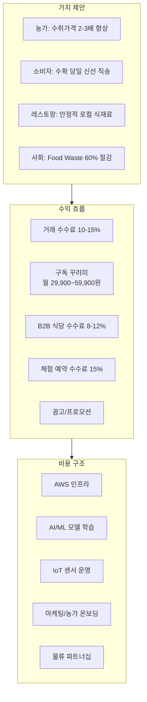
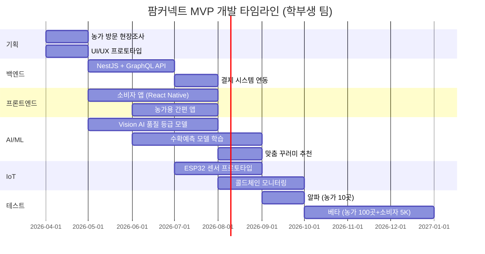

# 팜커넥트 (FarmConnect) — 소농-소비자 직거래 매칭 플랫폼

> **예비창업패키지 사업계획서**
> 작성일: 2026년 3월
> 버전: 2.0 (Enhanced)

---

## □ 일반현황

| 항목 | 내용 |
|------|------|
| **창업아이템명** | 팜커넥트 — AI 기반 소농-소비자·레스토랑 직거래 매칭 플랫폼 |
| **산출물** | 웹 플랫폼 1개, 모바일 앱(iOS/Android) 1세트, 농가용 IoT 센서 모듈 |
| **직업(현재)** | 대학원 석사과정 (컴퓨터공학/농업경제학 전공) |
| **기업예정명** | 주식회사 팜커넥트 (FarmConnect Inc.) |
| **팀 구성 현황** | 대표 1인 + 공동창업자 1인 + 외부 자문 2인 (농업 유통 전문가, AI/Vision 전문가) |

---

## □ 창업 아이템 개요(요약)

| 항목 | 내용 |
|------|------|
| **명칭** | 팜커넥트 (FarmConnect) |
| **범주** | 농산물 직거래 / 팜투테이블 매칭 플랫폼 (웹 + 앱) |

### 창업 아이템 개요

**팜커넥트**는 소규모 농가와 레스토랑·개인 소비자를 AI로 직접 연결하는 **팜투테이블(Farm-to-Table) 직거래 플랫폼**이다. 당근마켓이 동네 물건을 연결하듯, 팜커넥트는 농가와 식탁을 연결한다. 현재 농산물 유통 구조는 산지-도매시장-중간상-소매점의 다단계 구조로 중간 유통 마진이 60-70%에 달하며, 농가 수취가격은 소비자 지불 가격의 30-40%에 불과하다. 본 플랫폼은 AI 수확예측으로 소비자 수요와 사전 매칭하고, 품질 Vision AI로 농산물 등급을 자동 판별하며, 콜드체인 IoT로 온도·습도를 실시간 모니터링하여 중간 유통 단계를 완전히 제거한다. 이를 통해 농가 소득은 2-3배 향상되고, 소비자는 수확 당일의 신선한 농산물을 합리적 가격에 구매할 수 있다.

| 요약 항목 | 내용 |
|-----------|------|
| **문제인식** | 한국 농산물 유통 마진 60-70%, 농가 수취가격율 30-40%. 연간 음식물 폐기 약 $1T+(글로벌), 한국 농산물 폐기율 약 30%. 소농 82%가 "판로 확보가 가장 큰 어려움"이라 응답 (농촌경제연구원, 2024) |
| **실현가능성** | AI 수확예측 모델(기상·생육 데이터 기반), 품질 Vision AI(농산물 등급 자동 판별), 콜드체인 IoT 실시간 모니터링, 구독형 맞춤 꾸러미. 6개월 MVP → 수도권 채소·과일 카테고리 시작 |
| **성장전략** | 수도권 소비자 → 전국 확장 → 동아시아. 거래 수수료 10-15% + 구독 꾸러미 + B2B 식당/급식. 3년 내 거래액 500억원, 연매출 60억원 목표 |
| **팀구성** | 풀스택 개발 대표 + 농업 유통/운영 공동창업자 + 농업 정책 자문 + AI/Vision 기술 자문 |

---

## 1. 문제 인식 (Problem) — 창업 아이템의 필요성

### 1.0 문제 구조도 (Problem Architecture)

```
┌─────────────────────────────────────────────────────────────────────────┐
│                    한국 농산물 유통의 구조적 위기                           │
├─────────────────────────────────────────────────────────────────────────┤
│                                                                         │
│  ┌──────────────────┐    ┌──────────────────┐    ┌──────────────────┐  │
│  │  ① 유통 비효율    │    │  ② 정보 비대칭    │    │  ③ 사회적 비용    │  │
│  │                  │    │                  │    │                  │  │
│  │  다단계 유통구조  │    │  가격 불투명      │    │  농촌 고령화      │  │
│  │  중간마진 60-70%  │    │  품질 확인 불가   │    │  청년 이탈        │  │
│  │  농가 수취 30-40% │    │  원산지 불신      │    │  지역 소멸 위기   │  │
│  └────────┬─────────┘    └────────┬─────────┘    └────────┬─────────┘  │
│           │                      │                      │             │
│           ▼                      ▼                      ▼             │
│  ┌─────────────────────────────────────────────────────────────────┐  │
│  │                     복합적 악순환 구조                            │  │
│  │                                                                 │  │
│  │   농가 수익 저하 ──► 청년 귀농 기피 ──► 고령화 심화              │  │
│  │        │                                    │                   │  │
│  │        ▼                                    ▼                   │  │
│  │   생산량·품질 저하 ◄── 기술투자 불가 ◄── 인력 부족              │  │
│  │        │                                                        │  │
│  │        ▼                                                        │  │
│  │   과잉생산/폐기 증가 ──► 환경오염 + 식량안보 위협               │  │
│  └─────────────────────────────────────────────────────────────────┘  │
│                              │                                        │
│                              ▼                                        │
│  ┌─────────────────────────────────────────────────────────────────┐  │
│  │                  팜커넥트의 솔루션 개입 지점                      │  │
│  │                                                                 │  │
│  │  AI 수확예측 ─── Vision AI ─── 콜드체인 IoT ─── 투명가격시스템  │  │
│  │       │              │              │                │           │  │
│  │       ▼              ▼              ▼                ▼           │  │
│  │  수요-공급 매칭  품질 신뢰   신선도 보장    공정 거래 실현       │  │
│  └─────────────────────────────────────────────────────────────────┘  │
└─────────────────────────────────────────────────────────────────────────┘
```

### 1.1 한국 농산물 유통의 구조적 비효율

한국 농산물 유통은 **산지→산지유통인→도매시장(법정)→중도매인→소매점→소비자**의 다단계 구조를 유지하고 있다. 이 과정에서 발생하는 유통 마진은 소비자 가격의 60-70%에 달하며, 농가가 실제 수취하는 가격은 최종 소비자 가격의 **30-40%에 불과**하다 (농촌경제연구원, 2024).

한국농촌경제연구원의 「2024 농산물 유통 실태조사」에 따르면:

- **소농(경작면적 1ha 미만)의 판로 어려움**: 82.3%가 "판로 확보가 가장 큰 경영 애로사항"
- **유통 단계별 마진 누적**: 산지 수집상 15-20%, 도매시장 20-25%, 소매점 25-30%
- **농산물 폐기율**: 수확 후 유통 과정에서 약 30%가 폐기 (외형 불량, 과잉 생산, 물류 지연)
- **소농 연평균 소득**: 2,847만원 (도시 근로자 가구 소득의 62.4%)
- **고령 농가(65세 이상) 비율**: 전체 농가의 49.8%

특히 소규모 농가는 도매시장 출하를 위한 최소 물량 기준을 충족하지 못해 산지유통인에게 헐값에 넘기는 구조가 고착화되어 있다. 도매시장 경매 가격은 하루에도 30% 이상 변동하여 농가 소득 예측이 불가능하며, 유통 과정의 **콜드체인 부재**로 신선도 저하와 폐기 손실이 막대하다. 소비자 역시 농산물의 원산지, 재배 방식, 유통 경로를 투명하게 확인할 수 없는 **정보 비대칭** 문제에 직면해 있다.

### 1.2 사회적 비용 분석 (Social Cost Analysis)

농산물 유통 구조의 비효율은 단순한 경제적 손실을 넘어 사회 전반에 걸친 막대한 비용을 발생시킨다.

| 사회적 비용 항목 | 연간 규모 | 산출 근거 | 부담 주체 |
|-----------------|----------|----------|----------|
| **유통 마진 과잉 지출** | 약 18조원 | 농산물 유통액 30조원 x 과잉마진율 60% | 소비자·농가 |
| **농산물 폐기 손실** | 약 5.2조원 | 생산액 52조원 x 폐기율 10% (유통 단계) | 농가·유통업체·사회 |
| **환경 오염 비용** | 약 1.8조원 | 폐기 농산물 처리비용 + 과잉 물류 탄소배출 | 지자체·국민 |
| **농가 소득 보전 정부보조** | 약 4.5조원 | 직불금·보조금·재해보험 등 농가 지원 예산 | 납세자 |
| **농촌 인프라 유지비** | 약 3.2조원 | 인구 감소 농촌의 도로·의료·교육 인프라 유지 | 지자체·중앙정부 |
| **식량안보 위기 대비** | 약 2.1조원 | 식량자급률 하락 대비 비축·수입 비용 증가 | 국가 |
| **청년 유출 기회비용** | 산정 불가 | 농촌 청년 이탈에 따른 지역 경제 위축, 지방소멸 | 사회 전체 |
| **합계 (정량 부분)** | **약 34.8조원/년** | | **국민 전체** |

> 한국 농산물 유통 구조의 비효율로 인한 사회적 총비용은 연간 약 35조원에 달한다.
> 이는 단순히 "농업 문제"가 아니라 **국가적 비효율**이며, 기술 기반 혁신의 여지가 그만큼 크다.

### 1.3 사회적 문제 공감대 형성

#### 실제 사례/스토리텔링

**사례 1: 충남 논산 딸기 농가 김정호 씨 (58세)**
30년 경력의 딸기 농가 김정호 씨는 매년 수확철이면 새벽 3시에 일어나 딸기를 수확하고, 오전 6시까지 도매시장에 출하해야 한다. 하지만 그날의 경매 가격은 전날까지 알 수 없다. 2024년 겨울, 딸기 가격이 kg당 12,000원에서 하루 만에 7,000원으로 급락했다. "내가 키운 딸기의 가치를 내가 정할 수 없다는 게 가장 억울합니다. 소비자가 만원에 사는 딸기에서 내 손에 쥐어지는 건 3,500원도 안 됩니다." 김 씨의 연소득은 2,400만원으로, 도시 근로자 평균의 절반에 불과하다.

**사례 2: 경북 영양 고추 농가 박순희 할머니 (74세)**
남편을 여읜 후 혼자 고추 농사를 짓는 박순희 할머니는 도매시장 출하를 위한 최소 물량 500kg을 맞추지 못해, 동네 수집상에게 시세의 60%에 넘겼다. "TV에서 농산물 가격이 올랐다고 하는데, 우리한테는 해당이 안 돼요. 중간에서 다 가져가니까." 박 할머니처럼 경작면적 0.5ha 미만의 영세 농가는 전체 농가의 42%를 차지하지만, 이들의 평균 소득은 1,800만원에 그친다.

**사례 3: 서울 마포구 직장인 이수진 씨 (32세)**
유기농 식품을 선호하는 이수진 씨는 "마트에서 유기농 토마토를 사는데, 어디서 왔는지, 언제 수확됐는지, 정말 유기농인지 확인할 방법이 없어요. 직접 농가에서 사고 싶은데 믿을 수 있는 채널이 없어요"라고 말한다. 한국소비자원 조사에서 62%의 소비자가 동일한 불만을 표출했다.

#### 통계의 인간적 해석

- **농가 수취가격율 30-40%**: 소비자가 10,000원을 지불하면 농부에게 돌아가는 돈은 고작 3,000~4,000원이다. 나머지 6,000~7,000원은 한 번도 흙을 만지지 않은 중간상·유통업체의 몫이다.
- **농산물 폐기율 30%**: 한국에서 매년 생산되는 농산물의 약 1/3이 외형이 못생겼다는 이유로, 또는 물류 과정에서 상했다는 이유로 버려진다. 이는 약 5조원 이상의 경제적 손실이자, 농부의 1년 노동이 쓰레기통으로 가는 것을 의미한다.
- **소농 82%의 판로 고통**: 전체 농가의 82.3%가 "어디에 팔아야 할지 모르겠다"고 답했다. 이는 단순한 경영 애로가 아니라, 매년 반복되는 생존의 위기다. 특히 고령 농가(65세 이상 비율 49.8%)는 디지털 판매 채널 접근 자체가 불가능하다.

### 1.4 페르소나 심층 분석

#### 페르소나 A: "건강한 식탁" 맞벌이 부부 — 김태현·이은지 (34·32세)

```
┌─────────────────────────────────────────────────────────────┐
│  페르소나 A: 맞벌이 부부 김태현·이은지                         │
├─────────────────────────────────────────────────────────────┤
│  나이: 34·32세  │  거주: 서울 마포구  │  자녀: 1명 (18개월)  │
│  소득: 월 650만원 (합산)  │  식비: 월 80만원               │
├─────────────────────────────────────────────────────────────┤
│  핵심 니즈                                                   │
│  ├── 아이 이유식 재료의 안전성 확인                            │
│  ├── 유기농 식품을 합리적 가격에 구매                          │
│  ├── 장보기 시간 절약 (주중 퇴근 후 시간 부족)                │
│  └── "착한 소비"를 통한 사회적 가치 실현                       │
├─────────────────────────────────────────────────────────────┤
│  현재 Pain Points                                            │
│  ├── 마트 유기농 코너: 비싸고, 원산지 불분명                   │
│  ├── 온라인 새벽배송: 소농 제품 없음, 대형 산지만              │
│  ├── 로컬푸드 직매장: 평일 방문 불가, 재고 불확실              │
│  └── 직거래 장터: 신뢰성 검증 불가, 불규칙적 운영              │
├─────────────────────────────────────────────────────────────┤
│  팜커넥트 기대 효과                                           │
│  ├── 식비 15-20% 절감 (월 12-16만원)                         │
│  ├── 장보기 시간 주 2시간 절약                                │
│  ├── 아이 먹거리 안전성 확보 (이력추적 + Vision AI)            │
│  └── 구독 자동화로 편의성 극대화                               │
└─────────────────────────────────────────────────────────────┘
```

| 단계 | 행동 | 감정 | 팜커넥트 접점 |
|------|------|------|-------------|
| 인지 | 인스타그램에서 "농장 직송 유기농 꾸러미" 광고를 보고 관심 | "아이 이유식 재료 안전한 거 어디서 사지?" 불안 | SNS 타겟 광고, 맘카페 후기 |
| 탐색 | 앱 다운로드, 농가 프로필·라이브캠 확인, 가격 비교 | "이 농부가 직접 키운 거라니 믿음이 간다" 신뢰 | 농부 프로필, Vision AI 등급, 마트 가격 비교 위젯 |
| 구매 | 첫 주문: 제철 채소 꾸러미 + 이유식 재료 세트 29,900원 | "마트보다 싸고 신선하다!" 만족 | 첫 구매 할인, 콜드체인 실시간 추적 |
| 재구매 | 주간 정기 구독 전환, 어글리팜 못난이 꾸러미 추가 | "매주 알아서 오니까 편하다. 버려질 농산물 살리니 뿌듯" 편의+성취 | AI 맞춤 꾸러미, 착한소비 대시보드 |
| 추천 | 직장 동료에게 추천, 아파트 동네 공동구매 개설 | "우리 아파트 단체로 시키자!" 소속감 | 동네 공동구매, 초대 리워드 |

#### 페르소나 B: "로컬 식재료" 레스토랑 셰프 — 박민준 (41세)

```
┌─────────────────────────────────────────────────────────────┐
│  페르소나 B: 오너셰프 박민준                                   │
├─────────────────────────────────────────────────────────────┤
│  나이: 41세  │  위치: 서울 성수동  │  이탈리안 레스토랑 운영    │
│  월 식재료비: 1,200만원  │  좌석: 40석  │  월매출: 4,500만원    │
├─────────────────────────────────────────────────────────────┤
│  핵심 니즈                                                   │
│  ├── 안정적이고 일관된 식재료 품질 확보                         │
│  ├── 식재료 원가 절감 (현재 매출의 27%)                        │
│  ├── 로컬 식재료 스토리로 차별화 마케팅                         │
│  └── 계절별 메뉴 기획을 위한 수확 예측 정보                     │
├─────────────────────────────────────────────────────────────┤
│  현재 Pain Points                                            │
│  ├── 도매시장 새벽 방문에 체력 소모                             │
│  ├── 가격 변동이 심해 원가 관리 어려움                          │
│  ├── 로컬 소농과 직접 거래하는 채널 부재                        │
│  └── 원산지 표시 의무 대응에 행정 부담                          │
├─────────────────────────────────────────────────────────────┤
│  팜커넥트 기대 효과                                           │
│  ├── 식재료비 15-20% 절감 (월 180-240만원)                    │
│  ├── "팜커넥트 인증 농가 직송" 마케팅 효과                      │
│  ├── 수확예측 기반 시즌 메뉴 자동 기획 지원                     │
│  └── 원산지 표시 자동 생성으로 행정 부담 제거                    │
└─────────────────────────────────────────────────────────────┘
```

| 단계 | 행동 | 감정 | 팜커넥트 접점 |
|------|------|------|-------------|
| 인지 | 식재료 원가 상승으로 산지 직거래 방법 탐색 | "도매시장 가격이 들쭉날쭉, 안정적 공급처가 필요" 불안 | 레스토랑 전문 매체 광고, 셰프 네트워크 입소문 |
| 탐색 | B2B 대시보드에서 주변 농가 검색, 바질·토마토·루꼴라 농가 확인 | "메뉴에 딱 맞는 농가를 추천해주다니" 편리 | 메뉴 분석 AI, 농가 자동 추천 |
| 계약 | 월간 정기 공급 계약 체결 (주 3회 배송) | "가격 안정+신선도 보장이라니 완벽" 안도 | 정기 계약, 수확예측 기반 선주문 |
| 활용 | 메뉴에 "팜커넥트 제휴 농가 직송" 원산지 표시, SNS 홍보 | "손님들이 식재료 스토리에 감동한다" 자부심 | 원산지 자동 표시, 농가 스토리 연동 |
| 확장 | 추가 농가 계약, 시즌 메뉴 기획 시 수확예측 활용 | "다음 달 수확 예정인 제철 재료로 메뉴를 짜자" 주도성 | 수확예측 알림, 계절 농산물 캘린더 |

#### 페르소나 C: "디지털 전환" 소농 — 이동훈 (62세, 경기도 이천, 쌀·채소 복합농)

```
┌─────────────────────────────────────────────────────────────┐
│  페르소나 C: 소농 이동훈                                      │
├─────────────────────────────────────────────────────────────┤
│  나이: 62세  │  위치: 경기도 이천  │  경작: 쌀 1ha + 채소 0.3ha│
│  연소득: 2,600만원  │  영농 경력: 35년  │  가족: 부부 2인      │
├─────────────────────────────────────────────────────────────┤
│  핵심 니즈                                                   │
│  ├── 안정적인 판로 확보 (도매시장 의존 탈피)                    │
│  ├── 제값 받기 (현재 수취가격율 35%)                           │
│  ├── 쉬운 디지털 도구 (스마트폰은 쓸 수 있지만 복잡한 앱 어려움)│
│  └── 소량 출하 가능한 채널 (도매시장 최소 물량 미달)             │
├─────────────────────────────────────────────────────────────┤
│  현재 Pain Points                                            │
│  ├── 채소는 수집상에 헐값 판매 (시세의 55-65%)                 │
│  ├── 도매시장 경매 가격 불안정 (일일 변동 ±30%)                │
│  ├── 못난이 농산물 20%는 그냥 폐기                             │
│  ├── 온라인 판매 시도했지만 포장·택배 처리 부담                  │
│  └── 아들은 서울 직장, 농사 승계 의향 없음                      │
├─────────────────────────────────────────────────────────────┤
│  팜커넥트 기대 효과                                           │
│  ├── 수취가격율 35% → 60%+ 향상 (연소득 +800만원)             │
│  ├── 큰 글씨·음성 입력 UI로 디지털 장벽 해소                    │
│  ├── 못난이 채소도 "어글리팜" 통해 판매 → 폐기 제로             │
│  └── 소비자 감사 메시지로 영농 보람 회복                        │
└─────────────────────────────────────────────────────────────┘
```

| 단계 | 행동 | 감정 | 팜커넥트 접점 |
|------|------|------|-------------|
| 인지 | 이웃 농가에서 "앱으로 직거래하니 소득이 올랐다"는 말 전해 들음 | "나도 할 수 있을까? 스마트폰이라 좀 어려운데..." 호기심+불안 | 농가 입소문, 농업기술원 교육 |
| 온보딩 | 팜커넥트 현장 방문 지원팀이 농가 방문, 앱 설치·사용법 교육 | "이렇게 쉬울 줄 몰랐네. 사진 찍으면 등급이 나온다고?" 놀라움 | 현장 방문 온보딩, 큰 글씨 UI |
| 첫 출하 | 상추·깻잎 소량 출하, 스마트폰 촬영으로 Vision AI 등급 판정 | "도매시장 안 가도 되고, 소량도 팔 수 있다니!" 안도 | Vision AI, 소량 출하 허용 |
| 수익 체감 | 첫 달 정산: 기존 대비 수취가격 70% 상승 | "이 나이에 이렇게 변할 수 있다니" 감동 | 투명 정산, 수취가 비교표 |
| 정착 | 구독 농가 전환, 정기 출하 스케줄 확정 | "매주 몇 kg 보내면 되니까 마음이 편하다" 안정감 | 구독 매칭, 수확예측 연동 |

### 1.5 해외 성공 사례 비교 도표

| 비교 항목 | Ninjacart (인도) | TaniHub (인도네시아) | Oddbox (영국) | Misfits Market (미국) | Pinduoduo (중국) | **팜커넥트 (한국)** |
|-----------|:----------------:|:-------------------:|:-------------:|:--------------------:|:----------------:|:------------------:|
| 설립연도 | 2015 | 2016 | 2016 | 2018 | 2015 | **2026** |
| 기업가치 | $1B+ | $130M+ 투자 | £16M+ 투자 | $2.2B | $140B+ | **Pre-Seed** |
| 주요 모델 | B2B (농가→소매) | B2B+B2C | B2C 구독 | B2C 구독→종합 | 소셜 공동구매 | **B2C+B2B+구독** |
| AI 수확예측 | O (수요예측) | X | X | X | X | **O** |
| Vision AI | X | X | X | X | X | **O** |
| 콜드체인 IoT | O (자체) | O (풀필먼트) | X | X | X | **O (실시간)** |
| 못난이 유통 | X | X | **O (핵심)** | **O (핵심)** | X | **O (어글리팜)** |
| 농가 스토리 | X | X | 부분적 | X | X | **O (라이브캠 포함)** |
| 블록체인 이력 | X | X | X | X | X | **O** |
| 공동구매 | X | X | X | X | **O (핵심)** | **O** |
| 농업금융 | X | O (TaniFund) | X | X | X | **향후 계획** |
| 한국 시사점 | 물류혁신 벤치마크 | 듀얼마켓 전략 | ESG 구독 모델 | 카테고리 확장 경로 | 소셜커머스 결합 | **전체 통합 모델** |

> 팜커넥트는 글로벌 성공 사례의 핵심 전략을 통합하면서, AI 수확예측 + Vision AI + 콜드체인 IoT라는
> 기술적 차별점을 추가하여 **"기술 주도형 팜투테이블 플랫폼"**으로 독자적 포지셔닝을 확보한다.

#### 해외 사례 상세

**Ninjacart (인도, 2015~)**
- **기업가치**: $1B+ (유니콘, 2022 Series D, 누적 투자 $350M+)
- **핵심**: 인도 소농과 소매상(키라나)을 직접 연결하는 B2B 농산물 유통 플랫폼
- **성과**: 일일 거래량 1,400톤+, 농가 12만+, 소매점 18만+ 연결, 8개 도시 운영
- **기술**: AI 수요예측으로 농산물 폐기율을 50% → 5%로 감소, 자체 콜드체인 물류 네트워크
- **수익모델**: 거래 수수료 5-8% + 물류 서비스 수수료
- **시사점**: 중간 유통 단계 제거로 농가 소득 20-30% 증가 입증. 인도라는 열악한 물류 인프라에서도 기술로 cold chain 혁신 가능함을 증명

**TaniHub (인도네시아, 2016~)**
- **누적 투자**: $130M+ 조달
- **핵심**: 인도네시아 농가와 B2B/B2C 소비자를 연결하는 농산물 이커머스 플랫폼
- **성과**: 농가 55,000+, 레스토랑·호텔·리테일러 30,000+ 연결
- **시사점**: 모바일 퍼스트 UX로 디지털 소외 농가도 쉽게 입점. 농산물 유통 + 농업 금융을 결합한 소농 생태계 모델

**Oddbox (영국, 2016~)**
- **누적 투자**: £16M+ 조달 (Series A, 2021)
- **핵심**: 외형 불량(못난이) 농산물을 구독 박스로 소비자에게 직배송
- **성과**: 주간 배송 50,000박스+, 누적 음식물 폐기 절감 30,000톤+
- **시사점**: "못난이 농산물" 내러티브로 ESG 가치 소비 트렌드 선도. 팜커넥트 "어글리팜" 전략의 직접적 벤치마크

**Misfits Market (미국, 2018~)**
- **기업가치**: $2.2B (유니콘, 2022 Series C-1, 누적 투자 $526M+)
- **핵심**: 유기농·못난이 농산물 직배송 구독 서비스 → 종합 온라인 그로서리로 확장
- **시사점**: VC 시장에서 $500M+ 투자 유치 성공으로 농산물 직거래의 대규모 스케일링 가능성 입증

**Pinduoduo (중국, 2015~)**
- **시가총액**: $140B+ (나스닥 상장)
- **핵심**: 소셜 그룹구매 기반 농산물 이커머스, 월간 활성 사용자 9억+
- **시사점**: 소셜 커머스(공동구매)로 소비자 가격 30-50% 절감. 농산물 직거래에서 출발하여 $140B 시가총액의 종합 이커머스로 성장

### 1.6 글로벌 팜투테이블 & 온라인 식품 시장

| 시장 구분 | 2024-2025년 | 2030년 (전망) | CAGR |
|-----------|-------------|---------------|------|
| 글로벌 팜투테이블 시장 | $52B (2024) | $82B | 7.9% |
| 글로벌 온라인 식료품 시장 | $468B (2024) | $1,126B | 15.8% |
| 한국 온라인 식품 시장 | 40조원+ (2024) | 70조원+ | 9.8% |
| 한국 로컬푸드 직매장 매출 | 2.5조원 (2024) | 4.2조원 | 9.1% |
| 글로벌 Food Waste 비용 | $1T+ (연간) | — | — |
| 글로벌 콜드체인 물류 시장 | $340B (2024) | $647B | 11.3% |
| 한국 농산물 직거래 시장 | 5.2조원 (2024) | 8.7조원 | 8.9% |

> 출처: Grand View Research (2024), Statista Grocery E-Commerce Report (2025), 한국농수산식품유통공사 (2024), FAO Food Waste Report (2024), 농림축산식품부 (2024)

### 1.7 시장 기회 TAM/SAM/SOM 분석

```
┌─────────────────────────────────────────────────────────────────────┐
│                        시장 기회 구조도                               │
│                                                                     │
│  ┌───────────────────────────────────────────────────────────────┐  │
│  │                                                               │  │
│  │                    TAM: $520B (글로벌)                         │  │
│  │           글로벌 온라인 식료품 $468B + 팜투테이블 $52B          │  │
│  │                                                               │  │
│  │    ┌─────────────────────────────────────────────────────┐    │  │
│  │    │                                                     │    │  │
│  │    │              SAM: 약 45조원 (한국)                    │    │  │
│  │    │        온라인 식품 40조원 + 직거래 5.2조원             │    │  │
│  │    │                                                     │    │  │
│  │    │    ┌───────────────────────────────────────────┐    │    │  │
│  │    │    │                                           │    │    │  │
│  │    │    │        SOM: 약 5,000억원 (수도권)          │    │    │  │
│  │    │    │    수도권 비중 50% x 직거래 선호 62%        │    │    │  │
│  │    │    │        x 온라인 전환율 15%                  │    │    │  │
│  │    │    │                                           │    │    │  │
│  │    │    │   ┌─────────────────────────────────┐     │    │    │  │
│  │    │    │   │                                 │     │    │    │  │
│  │    │    │   │  Y1 목표: 120억원 (GMV)         │     │    │    │  │
│  │    │    │   │  → SOM의 2.4% 점유              │     │    │    │  │
│  │    │    │   │                                 │     │    │    │  │
│  │    │    │   └─────────────────────────────────┘     │    │    │  │
│  │    │    └───────────────────────────────────────────┘    │    │  │
│  │    └─────────────────────────────────────────────────────┘    │  │
│  └───────────────────────────────────────────────────────────────┘  │
│                                                                     │
│  ► 한국 온라인 식품 침투율 37.2% (글로벌 선도)                       │
│  ► 직거래 디지털화율 8% 미만 (선점 기회)                              │
│  ► 식품 구독 침투율 5% 미만 (성장 잠재력)                             │
└─────────────────────────────────────────────────────────────────────┘
```

| 구분 | 정의 | 규모 | 산출 근거 |
|------|------|------|----------|
| **TAM** (전체시장) | 글로벌 온라인 식료품 + 팜투테이블 시장 | **$520B** (2024) | 온라인 식료품 $468B + 팜투테이블 $52B (Grand View Research, 2024) |
| **SAM** (유효시장) | 한국 온라인 식품 시장 + 농산물 직거래 시장 | **약 45조원** (2024) | 온라인 식품 40조원 + 직거래 5.2조원 (농림축산식품부, 2024) |
| **SOM** (수익시장) | 수도권 소농-소비자·레스토랑 직거래 온라인 시장 | **약 5,000억원** | 수도권 소비 비중 50% x 직거래 선호 소비자 비율 62% x 온라인 전환율 15% 추정 |

#### 글로벌 vs 국내 시장 비교

| 비교 항목 | 글로벌 | 한국 | 시사점 |
|-----------|--------|------|--------|
| 온라인 식품 시장 규모 | $468B (2024) | 40조원 (2024) | 한국은 글로벌 대비 높은 온라인 식품 침투율(37.2%) 보유 |
| 팜투테이블 시장 CAGR | 7.9% | 9.1% (직거래 기준) | 한국 성장률이 글로벌 평균 상회, MZ세대 주도 |
| 농산물 폐기율 | 14% (선진국 평균) | 약 30% | 한국의 다단계 유통 구조가 폐기율을 높이는 주요 원인 |
| 농가 수취가격율 | 45-55% (미국·EU 평균) | 30-40% | 한국의 유통 비효율이 글로벌 대비 심각 → 개선 여지 큼 |
| 직거래 디지털화율 | 25-30% (미국 CSA 기준) | 8% 미만 | 한국의 디지털 직거래 시장은 아직 초기 → 선점 기회 |
| 식품 구독 서비스 침투율 | 12% (미국 가구) | 5% 미만 | 한국 구독 시장 성장 잠재력 높음 |

### 1.8 사용자 구매동인(Purchase Motivation) 분석

#### 기능적 동인

| 동인 | 소비자 (B2C) | 레스토랑 (B2B) |
|------|-------------|---------------|
| **시간 절약** | 여러 마트/직거래장 방문 없이 앱에서 원클릭 주문, 수확 당일 배송 | 식재료 발주 자동화, 산지 직접 방문 불필요 |
| **비용 절감** | 중간 유통 마진 제거로 마트 대비 15-25% 저렴, 못난이 꾸러미 30-40% 할인 | 도매시장 거래 대비 안정적 가격, 대량 정기 계약 할인 |
| **편의성** | AI 추천 맞춤 꾸러미로 장보기 고민 해결, 정기 구독으로 자동 배송 | 메뉴 기반 식재료 자동 추천, 원산지 표시 자동 생성 |
| **품질 보장** | Vision AI 등급 판별로 온라인 구매 불안 해소, 콜드체인 IoT 실시간 확인 | 농산물 등급·신선도 사전 확인, 일관된 품질 확보 |

#### 감정적 동인

| 동인 | 설명 |
|------|------|
| **불안 해소** | 농산물 원산지·재배 방식·유통 경로를 투명하게 확인 가능. "무농약이라고 하는데 정말일까?" 불안을 블록체인 이력 추적으로 해소 |
| **신뢰감** | 농부 프로필·재배 철학·농장 라이브캠을 통해 "내가 먹는 음식을 기른 사람"을 직접 확인. 익명의 대형 유통이 아닌 이름 있는 농부와의 관계 |
| **성취감** | "착한 소비" 누적 기여도 대시보드: 농가 소득 증가 기여액, CO2 절감량, 구출한 못난이 농산물 무게를 시각화하여 소비자에게 사회적 성취감 제공 |
| **따뜻함** | 소비자-농가 감사 메시지, 요리 인증샷 공유, 수확 체험 등 감정적 연결 → "내 식탁의 음식이 어떤 사람의 손에서 왔는지 알 때 느끼는 감사함" |

#### 사회적 동인

| 동인 | 설명 |
|------|------|
| **소속감** | 동네 공동구매 커뮤니티, 특정 농가 "단골" 그룹, 계절별 꾸러미 구독자 커뮤니티 → 같은 가치를 공유하는 소비자 그룹 소속감 |
| **사회적 인정** | "나는 로컬 농가를 직접 지원한다"는 윤리적 소비 정체성. SNS 공유 시 "착한 소비자" 이미지. ESG 트렌드에 부합하는 라이프스타일 |
| **트렌드** | MZ세대 "팜투테이블" 트렌드, 제로웨이스트 운동, 비건/유기농 라이프스타일과의 연결. "못난이 농산물 소비"가 새로운 힙 소비 문화로 부상 |

### 1.9 기존 서비스의 한계와 시장 기회

| 구분 | 마켓컬리 | 로컬푸드 직매장 | 네이버 장보기 | 쿠팡 로켓프레시 | **팜커넥트 (본 서비스)** |
|------|---------|----------------|-------------|---------------|---------------------|
| 소농 입점 | 대형 산지 중심 | 지역 한정 오프라인 | 직접 운영 부담 큼 | 대형 공급사 | **소농 맞춤 간편 입점** |
| AI 수확예측 | 없음 | 없음 | 없음 | 없음 | **기상·생육 데이터 AI** |
| 품질 관리 | 자체 MD 입고 검수 | 농가 자가 선별 | 사진 기반 | 입고 검수 | **Vision AI 자동 등급 판별** |
| 콜드체인 | 자체 새벽 물류 | 없음 (상온 진열) | 택배 의존 | 자체 물류 | **IoT 센서 실시간 모니터링** |
| 가격 투명성 | 불투명 | 부분 공개 | 불투명 | 불투명 | **농가 수취가 실시간 공개** |
| 농가 스토리 | MD 큐레이션 | 현장 POP | 상세페이지 | 없음 | **라이브캠·체험 예약·농부 다이어리** |
| 구독 서비스 | 일부 정기배송 | 없음 | 없음 | 정기배송 | **AI 맞춤 꾸러미 구독** |
| B2B 식당 연결 | 없음 | 일부 로컬 식당 | 없음 | 없음 | **레스토랑·급식 자동 매칭** |
| food waste 대응 | 없음 | 없음 | 없음 | 없음 | **못난이 꾸러미·수요 사전 매칭** |

---

## 2. 실현 가능성 (Solution) — 창업 아이템의 개발 계획

### 2.0 서비스 아키텍처 개요

```
┌─────────────────────────────────────────────────────────────────────────┐
│                       팜커넥트 서비스 아키텍처                            │
├─────────────────────────────────────────────────────────────────────────┤
│                                                                         │
│   ┌─────────────┐  ┌─────────────┐  ┌─────────────┐  ┌─────────────┐  │
│   │  소비자 앱   │  │  농가용 앱   │  │  B2B 웹     │  │  관리자 웹   │  │
│   │  (B2C)      │  │  (간편 UI)  │  │  (레스토랑)  │  │  (대시보드)  │  │
│   └──────┬──────┘  └──────┬──────┘  └──────┬──────┘  └──────┬──────┘  │
│          │               │               │               │            │
│          └───────────────┼───────────────┼───────────────┘            │
│                          │               │                            │
│                          ▼               ▼                            │
│          ┌──────────────────────────────────────────────┐             │
│          │         API Gateway (NestJS + GraphQL)        │             │
│          └──────────────────────┬───────────────────────┘             │
│                                 │                                     │
│          ┌──────────┬───────────┼───────────┬──────────┐             │
│          ▼          ▼           ▼           ▼          ▼             │
│   ┌───────────┐┌──────────┐┌──────────┐┌──────────┐┌──────────┐     │
│   │ 수확예측  ││ Vision   ││  매칭    ││  구독    ││  결제    │     │
│   │ AI 서비스 ││ AI 서비스 ││  서비스  ││  관리   ││  서비스  │     │
│   │           ││          ││          ││         ││          │     │
│   │ LSTM+     ││ YOLOv8+  ││ 소비자-  ││ 꾸러미  ││ 토스/    │     │
│   │ Transform ││ Efficient││ 농가연결 ││ 최적화  ││ 카카오   │     │
│   └─────┬─────┘└────┬─────┘└────┬─────┘└────┬────┘└────┬────┘     │
│         │           │           │           │          │           │
│         └───────────┼───────────┼───────────┼──────────┘           │
│                     │           │           │                      │
│          ┌──────────┴───────────┴───────────┴──────────┐           │
│          │            데이터 레이어                       │           │
│          │  PostgreSQL │ TimescaleDB │ Redis │ S3       │           │
│          └──────────────────────────────────────────────┘           │
│                                                                     │
│          ┌──────────────────────────────────────────────┐           │
│          │            IoT 레이어                          │           │
│          │  토양센서 ─── 콜드체인센서 ─── 농장라이브캠    │           │
│          │  (ESP32)     (온도/습도)      (WebRTC)        │           │
│          └──────────────────────────────────────────────┘           │
└─────────────────────────────────────────────────────────────────────────┘
```

### 2.1 핵심 기능

#### 1) AI 수확예측 → 소비자 수요 매칭
- 기상청 기상데이터(온도, 강수, 일조량), 농가별 생육일지, 토양 IoT 센서, 과거 수확 이력을 학습한 AI 수확예측 모델 (LSTM + Transformer 기반)
- 예측 수확일·수확량을 기반으로 소비자/레스토랑 수요와 **사전 매칭** → food waste 최소화
- 과잉 생산 예상 시 자동 할인 이벤트·동네 공동구매 트리거 → 폐기 방지
- 부족 예상 시 대체 농가 자동 추천 → 소비자 수요 이탈 방지
- 수확예측 정확도 목표: 85%+ (기상 변수 ±3일 이내)
- 레스토랑·소비자에게 "다음 주 수확 예정" 사전 알림 → 선주문 매칭

#### 2) 품질 Vision AI (농산물 등급 자동 판별)
- 농가가 스마트폰 카메라로 농산물 촬영 → AI가 크기·색상·외형·흠집을 분석하여 등급 자동 산정
- 등급 체계: **프리미엄 / 일반 / 알뜰(B급) / 못난이** — 등급별 차등 가격 자동 책정
- 주요 품목별 전용 Vision 모델 학습: 사과, 토마토, 딸기, 상추, 감자, 고구마, 파프리카 등 20종+
- 소비자에게 실제 촬영 사진 + AI 품질 점수(100점 만점) 제공 → 온라인 구매 신뢰도 향상
- 기존 수동 선별 대비 시간 80% 절감, 등급 판별 정확도 92%+ 목표
- 못난이 농산물 자동 분류 → 전용 할인 카테고리 배치 → 폐기 방지

#### 3) 구독형 맞춤 꾸러미
- 소비자 취향(유기농 선호, 채식, 알레르기 등) + 가족 구성원 수 + 요리 빈도 기반 AI 추천
- 주간/격주 정기 배송 옵션: 제철 채소 꾸러미, 과일 꾸러미, 샐러드 재료 세트, 이유식 재료
- 농가 수확 스케줄과 연동하여 **가장 신선한 시점에 자동 출고** — "밭에서 뽑은 지 6시간" 보장
- **어글리팜(UglyFarm)** 못난이 꾸러미: 정가 대비 30-40% 저렴, ESG 가치 소비 포지셔닝
- 꾸러미별 레시피 카드 동봉 + 앱 내 요리 영상 연동
- 구독자 전용 농장 체험 이벤트 월 1회 제공

#### 4) 콜드체인 IoT 실시간 모니터링
- 농산물 출고 시점부터 소비자 수령까지 온도·습도 IoT 센서(ESP32 기반) 실시간 추적
- 품목별 최적 온도 구간 설정 (엽채류 0-5°C, 과일류 5-10°C, 감자류 10-15°C)
- 이상 온도 감지 시 자동 경고 알림 + 대체 물류 경로 리라우팅
- 소비자 앱에서 **"내 농산물의 여정"** 실시간 확인 가능 — 수확 시각, 현재 온도, 예상 도착 시각
- 블록체인(Hyperledger Fabric) 기반 이력 추적: 재배 → 수확 → 출고 → 배송 → 도착 전 과정 위변조 불가 기록

#### 5) 농가 스토리텔링 & 체험
- 농가별 프로필 페이지: 농부 소개, 재배 철학, 농법(유기농/친환경/관행), 인증 정보
- **농장 라이브캠**: 실시간 농작물 생장 과정 스트리밍 → 소비자가 "내 농산물이 자라는 모습"을 직접 확인
- 농가 체험 예약: 수확 체험, 농촌 스테이(팜스테이), 쿠킹 클래스, 김장 체험
- 농부 다이어리: 농가가 직접 올리는 재배 일지·사진·영상 → 앱 내 SNS 피드 + 외부 공유
- 소비자-농가 직접 소통 채널: 감사 메시지, 요리 인증샷 공유, 재배 관련 질문

#### 6) 투명 가격 시스템
- **농가 수취가 vs 소비자가 실시간 공개**: "이 토마토 5,000원 중 농가에 3,750원이 전달됩니다"
- 유통 단계별 비용 구조 시각화 (물류비, 포장비, 플랫폼 수수료 각각 표시)
- 기존 대형마트 가격과 실시간 비교 위젯 — "마트 대비 15% 저렴, 농가 수취가 2.3배"
- 소비자의 **"착한 소비" 누적 기여도 대시보드**: 농가 소득 증가 기여액, CO2 절감량, 구출한 못난이 농산물 무게 시각화

#### 7) B2B 레스토랑·급식 매칭
- 레스토랑·급식업체 전용 대시보드: 일별 필요 식재료 등록 → 지역 농가 자동 매칭
- 메뉴 분석 AI: 레스토랑 메뉴 등록 시 필요 식재료 자동 추출 → 최적 농가 추천
- 정기 계약 기능: 월간/분기 단위 안정적 공급 계약 체결 → 농가 소득 안정화
- 메뉴별 식재료 원산지 자동 표시 지원 (식당 원산지 표시 의무 대응)
- 학교급식·기업구내식당 대량 입찰 참여 지원

### 2.2 AI 모델 개발 계획

| AI 모델 | 목적 | 모델 아키텍처 | 학습 데이터 | 목표 성능 | 개발 기간 |
|---------|------|-------------|-----------|----------|----------|
| **수확예측 AI** | 수확일·수확량 예측 | LSTM + Transformer Encoder | 기상청 API (온도·강수·일조), 농가 생육일지, 토양 IoT (수분·pH·EC), 과거 수확 이력 5년분 | 수확일 ±3일, 수확량 ±15% 이내 (정확도 85%+) | 2026.06~09 (4M) |
| **Vision AI 등급** | 농산물 등급 판별 | YOLOv8 (검출) + EfficientNet-B4 (분류) | 품목별 5,000장+ (자체 촬영 + 농진청 데이터), 4등급 라벨링 | mAP 92%+, 등급 정확도 94%+ | 2026.06~10 (5M) |
| **꾸러미 추천 AI** | 맞춤 구독 최적화 | LLM Embedding + Collaborative Filtering | 소비자 프로필, 구매 이력, 계절성, 재고·수확 스케줄 | 추천 수락율 70%+, 구독 유지율 85%+ | 2026.08~10 (3M) |
| **수요예측 AI** | 지역별·품목별 수요 예측 | Prophet + LightGBM Ensemble | 과거 주문 데이터, 공휴일·날씨·이벤트 변수 | MAPE 12% 이내 | 2027.01~04 (4M) |
| **메뉴 분석 AI** | 레스토랑 식재료 매칭 | GPT-4 Fine-tuning + RAG | 레스토랑 메뉴 10,000건+, 레시피 DB, 식재료 매핑 사전 | 식재료 추출 정확도 90%+ | 2027.03~06 (4M) |
| **물류 최적화 AI** | 배송 경로 최적화 | Google OR-Tools + Reinforcement Learning | 배송 주소 클러스터링, 교통 데이터, 차량 용량 | 배송비 20% 절감, 배송 시간 30% 단축 | 2027.04~07 (4M) |

### 2.3 기술 스택

| 구분 | 기술 |
|------|------|
| **프론트엔드** | Next.js 14 (웹), React Native (앱), 농가용 간편 UI (큰 글씨, 음성 입력) |
| **백엔드** | Python FastAPI (AI 서빙), Node.js + NestJS (API Gateway), GraphQL |
| **AI/ML** | 수확예측 (LSTM + Transformer, 기상 API 연동), Vision AI (YOLOv8 + EfficientNet, 품질 등급), 추천 (LLM 기반 임베딩, 꾸러미 최적화) |
| **IoT** | ESP32 기반 온·습도·토양수분 센서, MQTT 프로토콜, AWS IoT Core |
| **블록체인** | Hyperledger Fabric (이력 추적, 원산지 증명, 유통 과정 기록) |
| **물류 최적화** | Google OR-Tools (배송 경로 최적화), 클러스터링 알고리즘 (묶음 배송) |
| **결제** | 토스페이먼츠, 카카오페이, 네이버페이, 정기결제(구독), 농협 계좌 연동 |
| **물류 연동** | CJ대한통운 신선배송 API, 농협물류 API, 자체 콜드체인 모니터링 |
| **인프라** | AWS (EKS, RDS, SageMaker, IoT Core, S3), CloudFront CDN |
| **데이터** | PostgreSQL + TimescaleDB (IoT 시계열), Redis, Elasticsearch |
| **모니터링** | Grafana + Prometheus, Sentry, AWS CloudWatch |
| **라이브캠** | WebRTC (P2P 스트리밍), AWS MediaLive (대규모 중계) |

### 2.4 개발 일정

| 구분 | 추진 내용 | 추진 기간 | 세부 내용 |
|------|----------|----------|----------|
| 1 | MVP 개발 | 2026.04 ~ 2026.09 | 농가 입점, 소비자 구매, 기본 매칭, 결제 (수도권 채소·과일) |
| 2 | Vision AI 개발 | 2026.06 ~ 2026.10 | 주요 10품목 등급 판별 모델 학습 (사과, 토마토, 딸기, 상추, 감자 등) |
| 3 | 베타 테스트 | 2026.10 ~ 2026.12 | 수도권 농가 100곳 + 소비자 5,000명 + 레스토랑 50곳 |
| 4 | 구독 서비스 론칭 | 2027.01 | 맞춤 꾸러미 구독, 어글리팜(못난이) 꾸러미 출시 |
| 5 | 콜드체인·IoT 통합 | 2027.01 ~ 2027.06 | IoT 센서 배포 500개, 실시간 모니터링 대시보드, 블록체인 이력 |
| 6 | B2B 매칭 출시 | 2027.04 ~ 2027.06 | 레스토랑·급식업체 전용 대시보드, 정기 계약 기능 |
| 7 | 수확예측 AI 고도화 | 2027.03 ~ 2027.09 | 기상·생육·IoT 데이터 통합 수확예측 모델, 선주문 매칭 시스템 |

### 2.5 정부지원사업비 집행 계획

**< 1단계 (20백만원) >**

| 비목 | 산출 근거 | 금액(원) |
|------|----------|---------|
| 재료비 | AWS 인프라 6개월 (월 150만원 x 6) + IoT 센서 시제품 50개 | 10,500,000 |
| 외주용역비 | UI/UX 디자인 용역 (농가·소비자 듀얼 인터페이스 + 고령자 맞춤 UI) | 5,000,000 |
| 지급수수료 | 기상청 API, 지도 API, OpenAI API 사용료 6개월 | 1,500,000 |
| 특허출원 | AI 수확예측 알고리즘 + Vision AI 품질 판별 특허 2건 | 3,000,000 |
| **합계** | | **20,000,000** |

**< 2단계 (40백만원) > — 상세 예산 편성**

| 비목 | 세부 항목 | 산출 근거 | 금액(원) |
|------|----------|----------|---------|
| **인건비** | AI/ML 엔지니어 | 월 400만원 x 6개월 | 24,000,000 |
| **재료비** | AWS SageMaker 학습비용 | GPU 인스턴스 월 50만원 x 6개월 | 3,000,000 |
| | IoT 센서 양산 200개 | 개당 10,000원 x 200개 | 2,000,000 |
| **외주용역비** | 보안 취약점 점검 | OWASP Top 10 기반 진단 | 1,500,000 |
| | 식품 관련 법률 자문 | 전자상거래법·식품위생법 검토 | 1,000,000 |
| | HACCP 인증 컨설팅 | 물류센터 인증 지원 | 1,500,000 |
| **마케팅** | 농가 온보딩 현장 캠페인 | 10회 x 30만원 (교통·인쇄) | 3,000,000 |
| | 소비자 체험단 운영 | 500명 x 무료 꾸러미 1회 | 2,500,000 |
| | SNS/인플루언서 마케팅 | 인스타·유튜브 협찬 5건 | 1,500,000 |
| **합계** | | | **40,000,000** |

**< Pre-Seed 자체 자금 투입 계획 (3억원) >**

| 비목 | 세부 항목 | 금액(원) | 비중 |
|------|----------|---------|------|
| **인건비** | 대표 + 공동창업자 6개월 | 60,000,000 | 20% |
| **개발비** | 프론트엔드 외주 (React Native) | 30,000,000 | 10% |
| | 백엔드 인프라 12개월 (AWS) | 24,000,000 | 8% |
| **AI/ML** | Vision AI 데이터 라벨링 (10만장) | 15,000,000 | 5% |
| | SageMaker 학습 비용 12개월 | 12,000,000 | 4% |
| **IoT** | 센서 시제품 개발 + 양산 500개 | 20,000,000 | 7% |
| | 콜드체인 파일럿 장비 | 10,000,000 | 3% |
| **마케팅** | 초기 농가 100곳 온보딩 | 25,000,000 | 8% |
| | 소비자 획득 마케팅 (CAC 5,000원 x 10,000명) | 50,000,000 | 17% |
| **운영비** | 사무실 임차 (12개월) | 24,000,000 | 8% |
| | 법인 설립·특허·법률 | 10,000,000 | 3% |
| **예비비** | 긴급 대응 | 20,000,000 | 7% |
| **합계** | | **300,000,000** | **100%** |

---

## 3. 성장전략 (Scale-up) — 사업화 추진 전략

### 3.1 시장 진입 전략

```
┌─────────────────────────────────────────────────────────────────────────┐
│                         시장 진입 전략 로드맵                             │
├─────────────────────────────────────────────────────────────────────────┤
│                                                                         │
│  Phase 1 (2026-2027)          Phase 2 (2027-2028)                      │
│  수도권 채소·과일 버티컬       전국 확장 + 카테고리 다각화                 │
│                                                                         │
│  ┌─────────────────┐         ┌─────────────────────────┐               │
│  │ 경기·충청 소농   │         │ 전국 농가 1,000곳        │               │
│  │     100곳       │ ──────► │ 쌀·잡곡·축산·수산물 추가  │               │
│  │                 │         │ B2B 급식 본격 진출        │               │
│  │ 수도권 소비자   │         │ 어글리팜 브랜드 론칭      │               │
│  │  10,000명 구독  │         │ 100,000명 구독            │               │
│  │                 │         │                           │               │
│  │ 월 GMV 5억원    │         │ 월 GMV 40억원             │               │
│  └─────────────────┘         └───────────┬─────────────┘               │
│                                          │                              │
│                                          ▼                              │
│                              Phase 3 (2028-2029)                       │
│                              동아시아 확장 + 데이터 플랫폼               │
│                                                                         │
│                              ┌─────────────────────────┐               │
│                              │ 일본 道の駅 시장 진출     │               │
│                              │ 대만·싱가포르 시범 서비스  │               │
│                              │ 농산물 데이터 SaaS 출시   │               │
│                              │ ESG 펀드·임팩트 투자 유치  │               │
│                              │                           │               │
│                              │ 연 GMV 500억원            │               │
│                              │ 수수료 매출 60억원         │               │
│                              └─────────────────────────┘               │
│                                                                         │
│  핵심 전략 원칙:                                                         │
│  ├── ① 좁고 깊게 시작 (수도권 채소·과일 only)                            │
│  ├── ② 공급자 먼저 확보 (농가 온보딩 → 소비자 유치)                      │
│  ├── ③ B2C로 브랜드 구축 → B2B로 매출 안정화                             │
│  └── ④ 데이터 축적 → AI 정밀도 향상 → 플라이휠 효과                      │
└─────────────────────────────────────────────────────────────────────────┘
```

**Phase 1 (2026-2027): 수도권 채소·과일 버티컬**
- 경기도·충청도 소농 100곳 → 수도권 소비자 직배송 (서울·경기 2,000만 인구)
- 제철 채소·과일에 집중하여 "가장 신선한 직거래" 브랜드 구축
- 로컬푸드 직매장 미입점 소농, 도매시장 의존 소농 집중 공략
- 수도권 레스토랑 100곳 파일럿 B2B 계약 체결
- 구독자 10,000명, 제휴 레스토랑 200곳, 월 GMV 5억원 목표

**Phase 2 (2027-2028): 전국 확장 + 카테고리 다각화**
- 전국 농가 1,000곳으로 확장, 쌀·잡곡·축산(계란·한우)·수산물 카테고리 추가
- B2B 급식시장 본격 진출: 학교급식 300곳, 기업구내식당 100곳 계약
- **어글리팜(UglyFarm)** 못난이 농산물 전용 브랜드 론칭 → ESG 마케팅 강화
- 동네 공동구매 기능 출시 (아파트·마을 단위 공동 주문 → 물류비 절감)
- 구독자 100,000명, B2B 거래처 1,000곳, 월 GMV 40억원 목표

**Phase 3 (2028-2029): 동아시아 확장 + 데이터 플랫폼**
- 일본 소농 직매소(道の駅) 시장($8B+) 진출 → 한국 모델 현지화
- 대만·싱가포르 시범 서비스 (고소득 도시 소비자 + 주변국 소농 연결)
- 농산물 시세·수요예측 데이터 SaaS 출시 (지자체·농협·식품기업 대상)
- 탄소배출 절감 인증 → ESG 펀드·임팩트 투자 유치
- 연간 GMV 500억원, 수수료 매출 60억원 목표

### 3.2 경쟁사 분석

| 구분 | 마켓컬리 | 네이버 장보기 | 오아시스마켓 | 농협 하나로마트 | **팜커넥트** |
|------|---------|-------------|------------|---------------|------------|
| 주요 타겟 | 도시 MZ세대 | 일반 소비자 | 유기농 선호층 | 전국 소비자 | **소농·소비자·레스토랑** |
| 소농 참여 | 불가 (대형 산지) | 어려움 (높은 진입장벽) | 일부 가능 | 농협 조합원 한정 | **소농 맞춤 간편 입점** |
| AI 기술 | 상품 추천 | 기본 추천 | 없음 | 없음 | **수확예측+Vision AI+매칭** |
| 배송 | 새벽배송 (자체 물류) | 당일/익일 | 당일 | 매장 픽업 | **수확 당일 출고 직송** |
| 가격 투명성 | 불투명 | 불투명 | 부분 공개 | 불투명 | **농가 수취가 100% 공개** |
| 구독 | 일부 정기배송 | 없음 | 없음 | 없음 | **AI 맞춤 꾸러미 구독** |
| 체험 연계 | 없음 | 없음 | 없음 | 없음 | **농장 체험·라이브캠** |
| Food Waste | 미대응 | 미대응 | 미대응 | 미대응 | **못난이 유통·수요 매칭** |

### 3.3 비즈니스 모델

| 수익원 | 설명 | 목표 비중 |
|--------|------|----------|
| **거래 수수료** | B2C 개별 구매 시 거래액의 10-15% (기존 유통 마진 60-70% 대비 획기적 절감) | 40% |
| **구독 꾸러미** | 주간/격주 정기 배송 구독 (월 29,900원~59,900원), 어글리팜 꾸러미 (월 19,900원~) | 25% |
| **B2B 식당·급식** | 레스토랑·급식업체 식재료 공급 거래 수수료 8-12% + 정기 계약 관리 수수료 | 20% |
| **체험 예약 수수료** | 농장 체험·수확 체험·쿠킹 클래스·팜스테이 예약 수수료 15% | 8% |
| **광고·프로모션** | 농가 상위 노출, 시즌 프로모션, 식품 브랜드 협찬 | 5% |
| **데이터 서비스** | 농산물 시세 분석, 수요 예측 리포트 (지자체·농협·식품기업 대상, 향후) | 2% |

### 3.4 구독 모델 4 Tiers

| 구분 | 프레시 라이트 | 프레시 스탠다드 | 프레시 프리미엄 | 어글리팜 히어로 |
|------|:------------:|:-------------:|:--------------:|:--------------:|
| **월 가격** | 19,900원 | 39,900원 | 59,900원 | 14,900원 |
| **배송 주기** | 격주 1회 | 주 1회 | 주 2회 | 주 1회 |
| **품목 수** | 5-7종 | 8-12종 | 12-16종 | 6-8종 |
| **등급** | 일반+알뜰 | 일반+프리미엄 | 프리미엄 Only | 못난이+알뜰 |
| **레시피 카드** | 2장 | 4장 | 6장 + 영상 | 4장 (활용법 특화) |
| **농장 체험** | 분기 1회 | 월 1회 | 월 2회 + VIP 투어 | 분기 1회 |
| **콜드체인 추적** | 기본 | 상세 | 실시간 + 블록체인 | 기본 |
| **착한소비 대시보드** | O | O | O + ESG 인증서 | O + 구출량 특화 |
| **주요 타겟** | 1인 가구, 체험 | 2-3인 가구 | 4인+, 미식가 | ESG 관심층, 학생 |
| **마트 대비 절감율** | 10-15% | 15-20% | 유사 (품질 프리미엄) | 30-40% |
| **기대 가입자 (Y2)** | 30,000명 | 40,000명 | 15,000명 | 15,000명 |

### 3.5 투자유치 전략

| 단계 | 시기 | 목표 금액 | 용도 |
|------|------|---------|------|
| Pre-Seed | 2026.Q2 | 3억원 | MVP 개발, Vision AI 모델 학습, 초기 농가 온보딩 |
| Seed | 2027.Q1 | 20억원 | 수도권 정식 런칭, 콜드체인 IoT 인프라 구축, 마케팅 |
| Series A | 2028.Q1 | 100억원 | 전국 확장, B2B 급식 시장 진출, 물류 거점 구축 |
| Series B | 2029.Q1 | 400억원 | 동아시아 진출, 데이터 SaaS, 자체 마이크로 풀필먼트 |

### 3.6 핵심 KPI (연도별)

| 지표 | 2026 (베타) | 2027 | 2028 | 2029 |
|------|-----------|------|------|------|
| 입점 농가 수 | 100 | 500 | 1,000 | 3,000 |
| 월간 활성 소비자 (MAU) | 5,000 | 50,000 | 200,000 | 500,000 |
| 구독자 수 | 500 | 10,000 | 100,000 | 300,000 |
| B2B 거래처 (식당·급식) | 50 | 200 | 1,000 | 3,000 |
| 월 GMV | 1억원 | 10억원 | 40억원 | 120억원 |
| 연 GMV | 8억원 | 120억원 | 480억원 | 1,440억원 |
| 농가 평균 수취가격율 | 55% | 60% | 65% | 70% |
| 농산물 폐기 절감율 | 20% | 35% | 50% | 60% |
| 구독 유지율 (월간) | 75% | 80% | 85% | 88% |
| NPS (순추천지수) | 40 | 50 | 60 | 65 |
| 앱 평점 (5점 만점) | 4.2 | 4.5 | 4.7 | 4.8 |
| Vision AI 정확도 | 88% | 92% | 95% | 97% |
| 수확예측 정확도 | 78% | 85% | 90% | 93% |

### 3.7 재무 전망 및 BEP 분석

| 항목 | 2026 (베타) | 2027 | 2028 | 2029 |
|------|-----------|------|------|------|
| **매출** | | | | |
| 거래 수수료 (12%) | 0.96억 | 14.4억 | 57.6억 | 172.8억 |
| 구독 매출 | 0.6억 | 4.8억 | 36억 | 86.4억 |
| B2B 수수료 (10%) | 0.3억 | 2.4억 | 12억 | 36억 |
| 기타 (체험·광고·데이터) | 0.14억 | 1.4억 | 6.4억 | 20.8억 |
| **총매출** | **2억원** | **23억원** | **112억원** | **316억원** |
| | | | | |
| **비용** | | | | |
| 인건비 | 3.6억 | 12억 | 30억 | 60억 |
| AWS 인프라 | 1.8억 | 4.8억 | 12억 | 24억 |
| 물류 파트너 비용 | 0.8억 | 6억 | 24억 | 60억 |
| 마케팅 | 2억 | 8억 | 20억 | 40억 |
| IoT·센서 | 0.5억 | 2억 | 5억 | 10억 |
| 기타 운영비 | 1.3억 | 4.2억 | 10억 | 20억 |
| **총비용** | **10억원** | **37억원** | **101억원** | **214억원** |
| | | | | |
| **영업이익** | **-8억원** | **-14억원** | **+11억원** | **+102억원** |
| **누적 적자** | -8억원 | -22억원 | -11억원 | +91억원 |

```
┌─────────────────────────────────────────────────────────────────────┐
│                    BEP (손익분기점) 분석                              │
│                                                                     │
│  매출 (억원)                                                         │
│  350 ┤                                                  ●316        │
│  300 ┤                                                /             │
│  250 ┤                                              /               │
│  200 ┤                                            /                 │
│  150 ┤                                    ●112  /                   │
│  100 ┤                              ────/─────/───── 비용            │
│   50 ┤                     ●23    /       /                         │
│    0 ┤──●2──────────────/───────/─────────────────────────          │
│  -50 ┤                                                              │
│      └──────┬──────┬──────┬──────┬──────────────────────            │
│          2026   2027   2028   2029                                  │
│                                                                     │
│  ► BEP 달성 시점: 2028년 상반기 (월 GMV 30억원 돌파 시)              │
│  ► 2029년 영업이익률: 32.3%                                          │
│  ► 누적 투자 회수 시점: 2029년 하반기                                 │
└─────────────────────────────────────────────────────────────────────┘
```

### 3.8 ESG 및 사회적 가치

#### ESG 성과 지표

| ESG 영역 | 지표 | 2027 목표 | 2029 목표 | 측정 방법 |
|----------|------|----------|----------|----------|
| **환경 (E)** | 물류 탄소배출 절감 | 500톤 CO2 | 5,000톤 CO2 | 직송 vs 다단계 유통 탄소 비교 |
| | Food Waste 절감량 | 1,000톤 | 10,000톤 | 못난이 유통량 + 수요매칭 폐기방지량 |
| | 친환경 포장 전환율 | 80% | 100% | 생분해성 박스·아이스팩 사용 비율 |
| | 물류 거리 절감 | 평균 40% 단축 | 평균 60% 단축 | 산지→소비자 직송 거리 vs 기존 경로 |
| **사회 (S)** | 소농 수취가격율 향상 | 60% (+20%p) | 70% (+30%p) | 플랫폼 평균 수취가격율 |
| | 고령 농가 디지털 접근성 | 200가구 | 1,500가구 | 65세+ 농가 앱 활성 사용자 수 |
| | 농가 평균 소득 증가 | +30% | +80% | 입점 농가 소득 변화 추적 |
| | 나눔 꾸러미 기부 | 500세트/월 | 3,000세트/월 | 저소득층·아동급식 기부량 |
| | 청년 귀농 연계 | 20명 | 100명 | 팜커넥트 통해 귀농한 청년 수 |
| **지배구조 (G)** | 가격 투명성 | 100% 공개 | 100% 공개 | 수취가·물류비·수수료 실시간 공개 |
| | 농가 자문위원회 | 분기 1회 | 월 1회 | 농가 대표 참여 거버넌스 |
| | AI 공정성 감사 | 연 2회 | 연 4회 | 매칭 알고리즘 편향 감사 |

### 3.9 리스크 분석 및 대응 전략

| 리스크 | 발생 확률 | 영향도 | 대응 전략 |
|--------|:--------:|:------:|----------|
| **공급 리스크: 초기 농가 확보 부족** | 높음 | 높음 | 경기도농업기술원 협력으로 시범 농가 확보, 첫 6개월 수수료 면제 인센티브, 현장 방문 온보딩 |
| **수요 리스크: 소비자 획득 비용 과다** | 중간 | 높음 | 맘카페·SNS 바이럴 마케팅 집중, 첫 구매 50% 할인, 동네 공동구매로 바이럴 확산 |
| **기술 리스크: Vision AI 정확도 미달** | 중간 | 중간 | 농진청 기존 데이터 활용으로 학습 데이터 확보, 전문가 수동 검증 병행, 단계적 자동화 |
| **물류 리스크: 콜드체인 품질 불안정** | 중간 | 높음 | CJ대한통운 신선배송 API 연동, IoT 실시간 모니터링 + 자동 경고, 100% 환불 보장 |
| **경쟁 리스크: 대형 플랫폼 진출** | 낮음 | 높음 | 소농 특화 + 농가 스토리 + 커뮤니티 → 감정적 전환비용 구축, 데이터 해자(moat) 강화 |
| **규제 리스크: 식품 위생·표시 규정** | 중간 | 중간 | HACCP 인증 선제 취득, 식약처 사전 협의, 법률 자문 상시 운영 |
| **시장 리스크: 경기 침체로 소비 위축** | 낮음 | 중간 | 어글리팜(할인) 라인 강화, B2B 급식(경기 비탄력적) 비중 확대 |
| **운영 리스크: 수확기 물류 병목** | 높음 | 중간 | 수확예측 AI로 사전 물류 배분, 지역별 마이크로 풀필먼트 허브 구축 |

---

## 4. 팀 구성 (Team) — 대표자 및 팀원 구성 계획

### 4.1 초기 팀 구성

| 구분 | 직위 | 담당 업무 | 보유 역량 | 구성 상태 |
|------|------|---------|---------|---------|
| 1 | 대표 | 제품 개발 총괄 | 컴퓨터공학 석사, 풀스택 개발 경력 3년, AI/ML 프로젝트 수행, 스마트팜 데이터 분석 연구 | 완료 |
| 2 | 공동대표 | 사업개발/농가 운영 | 농업경제학 학사, 농산물 유통 기업 근무 경력 3년, 로컬푸드 직매장 운영 경험, 농가 네트워크 보유 | 완료 |
| 3 | 개발자 | AI/Vision | 컴퓨터비전 전공 석사, YOLOv8 실무 경험, 농업 AI 학회 논문 발표 | 예정(2026.Q3) |
| 4 | 개발자 | 프론트엔드 | React Native + Next.js 전문, 이커머스 플랫폼 개발 경력 2년 | 예정(2026.Q3) |
| 5 | 운영매니저 | 농가 온보딩/물류 | 농촌진흥청 근무 경력, HACCP 인증 경험, 농가 현장 교육 역량 | 예정(2027.Q1) |

### 4.2 조직 성장 로드맵

| 시기 | 인원 | 신규 채용 역할 | 조직 구조 |
|------|:----:|--------------|----------|
| **2026.Q2** (Pre-Seed) | 2명 | - | 대표 + 공동창업자 |
| **2026.Q3** | 4명 | AI/Vision 개발자, 프론트엔드 개발자 | 개발팀 3 + 운영팀 1 |
| **2027.Q1** (Seed) | 8명 | 운영매니저, 백엔드 개발자, 물류 담당, 마케터 | 개발팀 4 + 운영팀 2 + 마케팅 1 + 물류 1 |
| **2027.H2** | 15명 | 데이터 엔지니어, IoT 엔지니어, CS 매니저 2명, 디자이너, 영업 2명 | 개발 6 + 운영 3 + 마케팅 2 + 물류 2 + CS 2 |
| **2028.Q1** (Series A) | 30명 | 각 팀 확장 + HR + 재무 + 지역 매니저 3명 | 4개 본부 (기술/운영/마케팅/경영지원) |
| **2029.Q1** (Series B) | 60명 | 해외사업팀 5명, 데이터사업팀 3명, 전 팀 확장 | 5개 본부 + 해외법인 |

### 4.3 자문단 구성

| 구분 | 성명/기관 | 전문 영역 | 자문 내용 | 참여 빈도 |
|------|----------|----------|----------|----------|
| **농업 정책** | 前 농림축산식품부 국장급 | 농정·유통정책, 정부사업 | 규제 대응, 정부지원사업 연계, 농정 방향 자문 | 월 1회 |
| **AI/Vision** | 서울대 컴퓨터비전 연구실 교수 | 컴퓨터비전, 딥러닝 | Vision AI 모델 아키텍처, 논문화, 기술 로드맵 | 월 2회 |
| **유통/물류** | CJ대한통운 前 신선물류 팀장 | 콜드체인, 라스트마일 | 물류 파트너십, 콜드체인 최적화, 물류센터 설계 | 격주 1회 |
| **외식산업** | 대한외식업중앙회 이사 | 외식업체 식재료 조달 | B2B 레스토랑 시장 진입, 식재료 수요 분석 | 월 1회 |
| **ESG/임팩트** | 임팩트 투자사 심사역 | 소셜벤처, ESG 투자 | 임팩트 측정, ESG 보고서, 투자유치 전략 | 분기 1회 |
| **법률** | 식품·전자상거래 전문 변호사 | 식품위생법, 전자상거래법 | 법적 리스크 사전 검토, 약관·이용정책 수립 | 필요시 |

### 4.4 협력 기관

| 구분 | 파트너명 | 보유 역량 | 협업 방안 | 협력 시기 |
|------|---------|---------|---------|---------|
| 1 | 경기도농업기술원 | 스마트팜 기술, 수도권 농가 네트워크 | 베타 테스트 농가 모집, IoT 센서 기술 자문, 공동 기술 실증 | 2026.Q3 |
| 2 | 농촌진흥청 | 농업 기술·생육 데이터 | 기상·생육 데이터 API 연동, 스마트팜 센서 데이터 공유 | 2026.Q4 |
| 3 | 한국농수산식품유통공사 (aT) | 농산물 유통 인프라·시세 데이터 | 산지 물류 거점 활용, 농산물 시세 데이터 연동 | 2027.Q1 |
| 4 | CJ대한통운 신선물류 | 전국 콜드체인 네트워크 | 신선배송 API 연동, 소량 다빈도 배송 특약 | 2027.Q1 |
| 5 | 대한외식업중앙회 | 전국 레스토랑 네트워크 | B2B 레스토랑 파트너 연결, 식재료 조달 수요 조사 | 2027.Q1 |

---

## 5. 시스템 아키텍처 및 도식화

### 5.1 시스템 아키텍처 (Layered)

```
┌─────────────────────────────────────────────────────────────────────────┐
│                        시스템 아키텍처 (Layered)                         │
├─────────────────────────────────────────────────────────────────────────┤
│                                                                         │
│  ┌─── 프레젠테이션 레이어 ──────────────────────────────────────────┐   │
│  │                                                                  │   │
│  │  ┌──────────┐  ┌──────────┐  ┌──────────┐  ┌──────────┐        │   │
│  │  │ 소비자앱  │  │ 농가용앱  │  │ B2B 웹   │  │ 관리자웹  │        │   │
│  │  │ React    │  │ React    │  │ Next.js  │  │ Next.js  │        │   │
│  │  │ Native   │  │ Native   │  │ 14       │  │ 14       │        │   │
│  │  │          │  │ (큰글씨/ │  │          │  │          │        │   │
│  │  │          │  │  음성UI) │  │          │  │          │        │   │
│  │  └──────────┘  └──────────┘  └──────────┘  └──────────┘        │   │
│  └──────────────────────────┬───────────────────────────────────────┘   │
│                             │ HTTPS / WebSocket                        │
│                             ▼                                          │
│  ┌─── API 게이트웨이 레이어 ────────────────────────────────────────┐   │
│  │                                                                  │   │
│  │  ┌──────────────────────────────────────────────────────────┐   │   │
│  │  │  NestJS API Gateway + GraphQL + JWT Auth + Rate Limit    │   │   │
│  │  └──────────────────────────────────────────────────────────┘   │   │
│  │  ┌───────────┐  ┌───────────┐  ┌───────────┐                   │   │
│  │  │ CDN       │  │ Load      │  │ API       │                   │   │
│  │  │CloudFront │  │ Balancer  │  │ Versioning│                   │   │
│  │  └───────────┘  └───────────┘  └───────────┘                   │   │
│  └──────────────────────────┬───────────────────────────────────────┘   │
│                             │ gRPC / Message Queue                     │
│                             ▼                                          │
│  ┌─── 비즈니스 로직 레이어 (마이크로서비스) ────────────────────────┐   │
│  │                                                                  │   │
│  │  ┌─────────┐ ┌─────────┐ ┌─────────┐ ┌─────────┐ ┌─────────┐  │   │
│  │  │ 수확예측 │ │ Vision  │ │  매칭   │ │  구독   │ │  결제   │  │   │
│  │  │   AI    │ │   AI    │ │ 서비스  │ │  관리   │ │ 서비스  │  │   │
│  │  │ FastAPI │ │ FastAPI │ │ NestJS  │ │ NestJS  │ │ NestJS  │  │   │
│  │  └─────────┘ └─────────┘ └─────────┘ └─────────┘ └─────────┘  │   │
│  │  ┌─────────┐ ┌─────────┐ ┌─────────┐ ┌─────────┐              │   │
│  │  │  물류   │ │블록체인 │ │  알림   │ │ 커뮤니티│              │   │
│  │  │ 최적화  │ │이력추적 │ │ 서비스  │ │ 서비스  │              │   │
│  │  │OR-Tools │ │Hyperledg│ │Firebase │ │ NestJS  │              │   │
│  │  └─────────┘ └─────────┘ └─────────┘ └─────────┘              │   │
│  └──────────────────────────┬───────────────────────────────────────┘   │
│                             │                                          │
│                             ▼                                          │
│  ┌─── AI/ML 파이프라인 레이어 ──────────────────────────────────────┐   │
│  │                                                                  │   │
│  │  ┌───────────────┐  ┌───────────────┐  ┌───────────────┐       │   │
│  │  │ 수확예측 모델   │  │ Vision 모델    │  │ 추천 엔진     │       │   │
│  │  │ LSTM+Transform │  │ YOLOv8+       │  │ LLM Embedding │       │   │
│  │  │ (SageMaker)   │  │ EfficientNet  │  │ + CollaFilter │       │   │
│  │  └───────────────┘  └───────────────┘  └───────────────┘       │   │
│  │  ┌─────────────────────────────────────────────────────────┐   │   │
│  │  │  MLflow (실험 추적) + Airflow (데이터 파이프라인)         │   │   │
│  │  └─────────────────────────────────────────────────────────┘   │   │
│  └──────────────────────────┬───────────────────────────────────────┘   │
│                             │                                          │
│                             ▼                                          │
│  ┌─── 데이터 레이어 ────────────────────────────────────────────────┐   │
│  │                                                                  │   │
│  │  ┌──────────┐  ┌──────────┐  ┌──────────┐  ┌──────────┐       │   │
│  │  │PostgreSQL│  │Timescale │  │  Redis   │  │Elastic   │       │   │
│  │  │ (메인DB) │  │DB (IoT   │  │ (캐시/   │  │search    │       │   │
│  │  │          │  │시계열)   │  │  세션)   │  │(검색)    │       │   │
│  │  └──────────┘  └──────────┘  └──────────┘  └──────────┘       │   │
│  │  ┌──────────┐  ┌──────────┐  ┌──────────┐                     │   │
│  │  │ AWS S3   │  │ Kafka    │  │ Grafana  │                     │   │
│  │  │ (이미지/ │  │ (이벤트  │  │+Promethe │                     │   │
│  │  │  영상)   │  │  스트림) │  │us(모니터)│                     │   │
│  │  └──────────┘  └──────────┘  └──────────┘                     │   │
│  └──────────────────────────────────────────────────────────────────┘   │
│                                                                         │
│  ┌─── IoT 레이어 ───────────────────────────────────────────────────┐   │
│  │                                                                  │   │
│  │  ┌──────────┐  ┌──────────┐  ┌──────────┐  ┌──────────┐       │   │
│  │  │ 토양센서  │  │콜드체인  │  │ 라이브캠  │  │ AWS IoT  │       │   │
│  │  │ (ESP32)  │  │ 센서     │  │ (WebRTC) │  │  Core    │       │   │
│  │  │수분/pH/EC│  │온도/습도 │  │          │  │ (MQTT)   │       │   │
│  │  └──────────┘  └──────────┘  └──────────┘  └──────────┘       │   │
│  └──────────────────────────────────────────────────────────────────┘   │
│                                                                         │
│  ┌─── 인프라 레이어 (AWS) ──────────────────────────────────────────┐   │
│  │  EKS (K8s) │ RDS │ SageMaker │ IoT Core │ S3 │ CloudFront     │   │
│  └──────────────────────────────────────────────────────────────────┘   │
└─────────────────────────────────────────────────────────────────────────┘
```

### 5.2 사용자 흐름 (User Flow)

```
┌─────────────────────────────────────────────────────────────────────────┐
│                    소비자-농가 직거래 사용자 흐름                         │
├─────────────────────────────────────────────────────────────────────────┤
│                                                                         │
│  [소비자 흐름]                                                           │
│                                                                         │
│  ┌──────┐    ┌──────────┐    ┌──────────┐    ┌──────────┐              │
│  │ 앱   │───►│ 회원가입  │───►│ 취향설정  │───►│ 홈 피드   │              │
│  │ 설치 │    │ (카카오/  │    │ (유기농,  │    │ (제철 추천│              │
│  │      │    │  네이버)  │    │ 가족수,   │    │  AI 큐레  │              │
│  └──────┘    └──────────┘    │ 알레르기) │    │  이션)    │              │
│                              └──────────┘    └─────┬────┘              │
│                                                    │                    │
│                         ┌──────────────────────────┼──────────┐        │
│                         │                          │          │        │
│                         ▼                          ▼          ▼        │
│                  ┌──────────┐              ┌──────────┐┌──────────┐   │
│                  │ 개별 구매  │              │ 구독 신청 ││ 공동구매  │   │
│                  │          │              │          ││ 참여     │   │
│                  │ 농가 탐색 │              │ 4 Tier   ││          │   │
│                  │ →상품 선택│              │ 선택     ││ 동네 그룹│   │
│                  │ →장바구니 │              │ →결제    ││ →참여    │   │
│                  └────┬─────┘              └────┬─────┘└────┬─────┘   │
│                       │                         │           │         │
│                       └─────────────┬───────────┘           │         │
│                                     │                       │         │
│                                     ▼                       │         │
│                              ┌──────────┐                   │         │
│                              │  결제     │◄──────────────────┘         │
│                              │ (토스/    │                             │
│                              │ 카카오)   │                             │
│                              └────┬─────┘                             │
│                                   │                                    │
│                                   ▼                                    │
│                              ┌──────────┐                              │
│                              │ 배송 추적  │                              │
│                              │          │                              │
│                              │ 수확시각  │                              │
│                              │ 현재온도  │                              │
│                              │ 예상도착  │                              │
│                              └────┬─────┘                              │
│                                   │                                    │
│                                   ▼                                    │
│                              ┌──────────┐                              │
│                              │  수령     │                              │
│                              │ →리뷰작성 │                              │
│                              │ →감사메시지│                              │
│                              │ →착한소비  │                              │
│                              │  대시보드  │                              │
│                              └──────────┘                              │
│                                                                         │
│  ═══════════════════════════════════════════════════════════════════    │
│                                                                         │
│  [농가 흐름]                                                             │
│                                                                         │
│  ┌──────┐    ┌──────────┐    ┌──────────┐    ┌──────────┐              │
│  │ 앱   │───►│ 농가 등록 │───►│ 상품 등록 │───►│ 주문 확인 │              │
│  │ 설치 │    │ (현장방문 │    │ (사진촬영 │    │ (알림)   │              │
│  │      │    │  온보딩)  │    │ →Vision  │    │          │              │
│  └──────┘    └──────────┘    │  AI 등급) │    └────┬─────┘              │
│                              └──────────┘         │                    │
│                                                    ▼                    │
│                              ┌──────────┐    ┌──────────┐              │
│                              │ 정산 확인 │◄───│ 출하·배송 │              │
│                              │ (투명    │    │ (콜드체인│              │
│                              │  정산표)  │    │  IoT)    │              │
│                              └──────────┘    └──────────┘              │
└─────────────────────────────────────────────────────────────────────────┘
```

### 5.3 농산물 유통 구조 비교 (기존 vs 팜커넥트)

```
┌─────────────────────────────────────────────────────────────────────────┐
│                    유통 구조 비교 (기존 vs 팜커넥트)                      │
├─────────────────────────────────────────────────────────────────────────┤
│                                                                         │
│  [기존 유통 구조] — 유통 마진 60-70%, 소요 시간 3-5일                    │
│                                                                         │
│  농가 ──► 산지유통인 ──► 도매시장 ──► 중도매인 ──► 소매점 ──► 소비자    │
│  100%    -15~20%       -20~25%      -10~15%     -25~30%                │
│                                                                         │
│  농가 수취: 30-40%     │  소비자 지불: 100%                              │
│                        │  유통 과정 폐기: 30%                            │
│                        │  가격 결정권: 경매(당일 변동 ±30%)               │
│                                                                         │
│  ─────────────────────────────────────────────────────────────────────  │
│                                                                         │
│  [팜커넥트 직거래] — 플랫폼 수수료 10-15%, 소요 시간 6-24시간           │
│                                                                         │
│  농가 ─────────────► 팜커넥트 플랫폼 ──────────────► 소비자/레스토랑     │
│  100%                -10~15% (수수료)                                    │
│                      -5~8% (물류비)                                      │
│                                                                         │
│  농가 수취: 55-70%     │  소비자 지불: 마트 대비 -15~25%                 │
│                        │  유통 과정 폐기: 5% 이하                        │
│                        │  가격 결정권: 농가 자율 + AI 추천               │
│                                                                         │
│  ► 농가 수취가격: 2-3배 향상                                             │
│  ► 소비자 가격: 15-25% 절감                                              │
│  ► 폐기율: 30% → 5% (83% 감소)                                          │
│  ► 배송 시간: 3-5일 → 6-24시간                                           │
└─────────────────────────────────────────────────────────────────────────┘
```

### 5.4 비즈니스 모델 캔버스



---

## 6. 컴퓨터공학과 대학생 창업 적합성 분석

### 6.1 컴퓨터공학과 학생의 기술적 강점

팜커넥트는 AI, IoT, 블록체인, 컴퓨터비전 등 컴퓨터공학 전공의 핵심 기술이 집약된 프로젝트로, 학부생 팀이 개발을 주도하기에 최적화되어 있다.

| 핵심 기술 | 관련 전공 과목 | 학부 수준 구현 가능성 |
|-----------|---------------|---------------------|
| 수확예측 AI (LSTM+Transformer) | 딥러닝, 시계열분석, 기계학습 | 기상청 공개 API + PyTorch로 모델 학습 가능 |
| Vision AI 품질 등급 (YOLOv8) | 컴퓨터비전, 영상처리 | Ultralytics YOLOv8 + 자체 데이터셋으로 구현 |
| IoT 센서 시스템 | 임베디드시스템, IoT | ESP32 + MQTT + AWS IoT Core로 프로토타입 |
| 블록체인 이력추적 | 분산시스템, 보안공학 | Hyperledger Fabric 튜토리얼 기반 구축 |
| LLM 추천 엔진 | 자연어처리, 정보검색 | OpenAI API + LangChain으로 MVP 가능 |
| React Native 크로스플랫폼 앱 | 모바일프로그래밍, UI/UX | Expo 기반 6개월 내 개발 가능 |
| 물류 최적화 알고리즘 | 알고리즘, 최적화 | Google OR-Tools 오픈소스 활용 |
| GraphQL API | 소프트웨어공학, 웹프로그래밍 | NestJS + Apollo Server로 구현 |

### 6.2 팀 구성 (컴퓨터공학과 학부생 중심)

| 구분 | 역할 | 필요 역량 | 관련 전공 과목 |
|------|------|---------|--------------|
| 팀장 | 백엔드/AI 개발 리드 | Python, FastAPI, PyTorch, LLM | 인공지능, 소프트웨어공학 |
| 팀원 1 | 프론트엔드/모바일 | React Native, Next.js | 모바일프로그래밍, HCI |
| 팀원 2 | 컴퓨터비전/ML | YOLOv8, 이미지 분류, 시계열 | 컴퓨터비전, 딥러닝 |
| 팀원 3 | IoT/인프라 | ESP32, MQTT, AWS, Docker | 임베디드시스템, 클라우드 |
| 자문 | 농업경제학과 교수 | 농산물 유통 도메인 지식 | - |

### 6.3 컴공 학생 팀의 차별화 포인트

1. **컴퓨터비전 전문성**: YOLOv8 기반 농산물 품질 판별은 CV 수업 프로젝트를 확장하여 구현 가능하며, 이는 기존 농산물 플랫폼에 전무한 기술
2. **IoT 하드웨어 역량**: 임베디드 시스템 수업의 ESP32 센서 프로젝트를 콜드체인 모니터링으로 확장
3. **시계열 예측 모델**: 기상 데이터 기반 수확예측은 딥러닝 수업의 LSTM/Transformer 실습을 실제 문제에 적용
4. **학교 리소스 활용**: GPU 서버(모델 학습), AWS 학생 크레딧, 농업대학 협력 가능
5. **사회적 임팩트**: 농가 소득 증대 + Food Waste 절감이라는 이중 사회적 가치로 창업 지원 프로그램 수혜 유리

### 6.4 MVP 개발 로드맵 (학부생 기준)



---

## 7. 감성 마무리 — 이것은 남의 일이 아닙니다

### 우리 모두의 식탁, 우리 모두의 문제

오늘 아침, 당신이 먹은 토마토는 어디에서 왔을까요?

그 토마토를 키운 농부는 새벽 4시에 일어나 온실을 돌보았습니다. 하지만 그 농부가 받은 돈은 당신이 지불한 가격의 35%에 불과합니다. 나머지 65%는 한 번도 그 토마토를 만져보지 않은 사람들의 몫입니다.

한국의 소농 110만 가구. 그들의 평균 연소득은 2,847만원입니다. 도시 직장인 평균의 62%입니다. 절반이 넘는 농가의 가장이 65세 이상입니다. 아들과 딸은 도시로 떠났습니다. 마을에는 빈집이 늘어갑니다.

이것은 농업의 위기가 아닙니다. **우리 식탁의 위기**입니다.

### 기술이 만드는 변화

팜커넥트는 이 구조를 바꾸려 합니다. 거창한 혁명이 아니라, 마땅히 그래야 할 연결을 만드는 것입니다.

- 농부가 제값을 받을 수 있도록
- 소비자가 오늘 수확한 농산물을 먹을 수 있도록
- 못생겼다는 이유로 버려지는 농산물이 식탁에 오를 수 있도록
- 농부의 이름과 얼굴을 알고 "감사합니다"라고 말할 수 있도록

### 임팩트 도식

```
┌─────────────────────────────────────────────────────────────────────────┐
│                                                                         │
│                    팜커넥트가 만드는 변화의 고리                          │
│                                                                         │
│                         ┌─────────────┐                                │
│                         │             │                                │
│                         │   농부의    │                                │
│                         │   정당한    │                                │
│                         │    보상     │                                │
│                         │             │                                │
│                         └──────┬──────┘                                │
│                                │                                       │
│                    ┌───────────┴───────────┐                           │
│                    │                       │                           │
│                    ▼                       ▼                           │
│            ┌──────────────┐       ┌──────────────┐                    │
│            │              │       │              │                    │
│            │  청년 귀농   │       │  영농 투자   │                    │
│            │   증가       │       │   확대       │                    │
│            │              │       │              │                    │
│            └──────┬───────┘       └──────┬───────┘                    │
│                   │                      │                            │
│                   ▼                      ▼                            │
│            ┌──────────────┐       ┌──────────────┐                    │
│            │              │       │              │                    │
│            │  농촌 활력   │       │  품질 향상   │                    │
│            │   회복       │       │  + 혁신      │                    │
│            │              │       │              │                    │
│            └──────┬───────┘       └──────┬───────┘                    │
│                   │                      │                            │
│                   └───────────┬──────────┘                            │
│                               │                                       │
│                               ▼                                       │
│                     ┌──────────────────┐                              │
│                     │                  │                              │
│                     │  지속 가능한     │                              │
│                     │  먹거리 생태계   │                              │
│                     │                  │                              │
│                     └────────┬─────────┘                              │
│                              │                                       │
│                    ┌─────────┴─────────┐                              │
│                    │                   │                              │
│                    ▼                   ▼                              │
│           ┌──────────────┐    ┌──────────────┐                       │
│           │              │    │              │                       │
│           │ 식량 안보    │    │ 환경 보전    │                       │
│           │  확보        │    │ (폐기↓탄소↓) │                       │
│           │              │    │              │                       │
│           └──────────────┘    └──────────────┘                       │
│                                                                       │
│  ═══════════════════════════════════════════════════════════════════  │
│                                                                       │
│  "당신이 팜커넥트에서 토마토 한 봉지를 사는 순간,                       │
│   농부의 소득이 2배가 되고, 버려질 뻔한 농산물이 살아나고,              │
│   물류 탄소가 40% 줄고, 누군가의 농촌이 살아납니다."                    │
│                                                                       │
│  이것은 기술의 문제가 아닙니다.                                         │
│  이것은 연결의 문제입니다.                                               │
│  그리고 그 연결은, 지금 시작됩니다.                                      │
│                                                                       │
│                              — 팜커넥트 팀 일동                        │
│                                                                       │
└─────────────────────────────────────────────────────────────────────────┘
```

---

## 참고문헌

1. 한국농촌경제연구원, "2024 농산물 유통 실태조사 — 소농 유통 구조 분석," 2024
2. 농림축산식품부, "2024 농업·농촌 및 식품산업 기본통계," 2024
3. 한국농수산식품유통공사, "2024 로컬푸드 직매장 운영 현황 및 성과 분석," 2024
4. 통계청, "2024 온라인쇼핑 동향 — 농축수산물 카테고리 분석," 2025
5. Grand View Research, "Farm-to-Table Market Size & Share Report 2024-2030," 2024
6. Statista, "Online Grocery Market — Global Forecast 2024-2030," 2025
7. FAO, "The State of Food and Agriculture 2024 — Food Loss and Waste," 2024
8. Ninjacart, "Series D — India's Largest Fresh Produce Supply Chain," TechCrunch, 2022
9. TaniHub Group, "Series B — Digitizing Indonesia's Agriculture," DealStreetAsia, 2021
10. Oddbox, "Imperfect Produce Subscription — Impact Report 2024," 2024
11. Misfits Market, "From Ugly Produce to $2.2B Valuation — Series C-1," Forbes, 2022
12. Pinduoduo (PDD Holdings), "2024 Annual Report — Agricultural Commerce Ecosystem," 2024
13. 한국소비자원, "농산물 온라인 직거래 소비자 인식 및 수요 조사," 2024
14. 대한외식업중앙회, "외식업체 식재료 조달 현황 및 로컬 소싱 수요 조사," 2024
15. 농촌진흥청, "스마트농업 기술 동향 및 생육 데이터 활용 현황," 2024
16. 중소벤처기업부, "2024 예비창업패키지 사업 안내," 2024
17. McKinsey & Company, "The Future of Food: Sustainable Farm-to-Fork Value Chains," 2024
18. OECD, "Agricultural Policy Monitoring and Evaluation 2024 — Korea Chapter," 2024
19. World Bank, "Food Systems 2030 — Digital Agriculture Transformation," 2024
20. Boston Consulting Group, "The Next Wave of AgriTech — AI, IoT, and Blockchain in Food Supply Chains," 2024
21. Euromonitor International, "Fresh Food E-Commerce: Global Trends and Opportunities," 2024
22. 한국농업경영인중앙연합회, "2024 농업경영 실태 및 소농 생존전략 보고서," 2024
23. CB Insights, "State of AgriTech 2024 — Funding, Trends, and Top Startups," 2024
24. 한국식품산업클러스터진흥원, "2024 식품산업 트렌드 — 로컬푸드와 직거래 시장 분석," 2024
25. Deloitte, "The Path to Sustainable Food Systems — Technology-Enabled Farm-to-Table," 2024
26. 농협경제연구소, "2024 농산물 유통 마진 구조 분석 및 개선 방안," 2024
