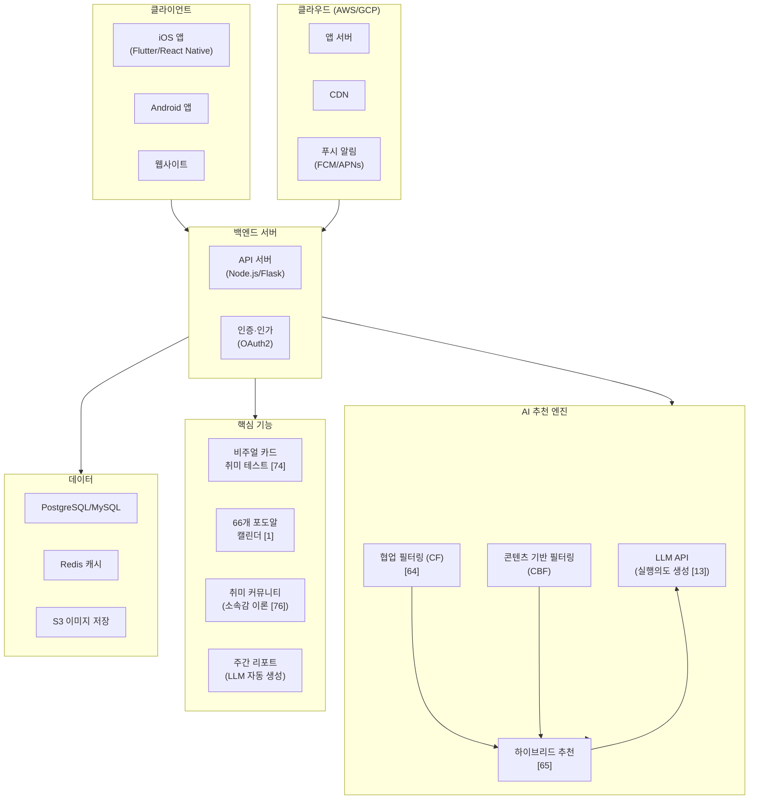
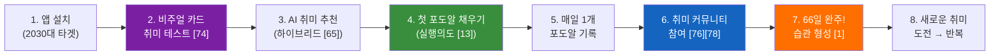
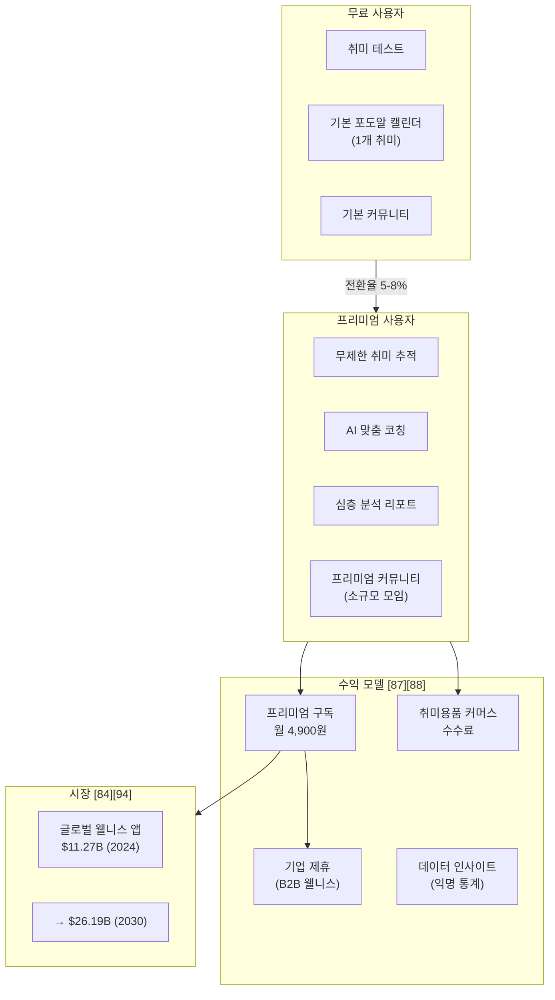

# 예비창업패키지 예비창업자 사업계획서

> ※ 사업계획서는 목차(1페이지)를 제외하고 15페이지 이내로 작성(증빙서류는 제한 없음)
> ※ 본문 내 [1], [2] 등은 말미 참고문헌 번호를 가리킴
> ※ 파란색 안내 문구는 삭제하고 검정 글씨로 작성하여 제출
> ※ 개인정보(성명, 성별, 생년월일 등)는 반드시 마스킹

---

## 목차

```
□ 일반현황 ·················································· 2
□ 창업 아이템 개요(요약) ···································· 2
1. 문제 인식 (Problem)_창업 아이템의 필요성 ··················· 4
2. 실현 가능성 (Solution)_창업 아이템의 개발 계획 ············· 7
3. 성장전략 (Scale-up)_사업화 추진 전략 ······················ 10
4. 팀 구성 (Team)_대표자 및 팀원 구성 계획 ··················· 14
참고문헌 ···················································· 15
```

---

## □ 일반현황

| 항목 | 내용 |
|------|------|
| **창업아이템명** | AI 기반 취미 습관화·커뮤니티 플랫폼 **'포데이(Fourday)'** |
| **산출물** (협약기간 내 목표) | 모바일 어플리케이션(iOS/Android 각 1개), 웹사이트(1개) |
| **직업** | 일반인 / 대학생 |
| **기업(예정)명** | (기재) |

### 팀 구성 현황 (대표자 본인 제외)

| 순번 | 직위 | 담당 업무 | 보유 역량(경력 및 학력 등) | 구성 상태 |
|------|------|----------|------------------------|---------|
| 1 | 공동대표 | S/W 개발 총괄 | OO학 학사, 모바일 앱 개발 경력 O년 | 완료 |
| 2 | 팀원 | UI/UX 디자인 | OO학 학사, 디자인 실무 경력 O년 | 예정(00.00) |
| 3 | 팀원 | 마케팅·운영 | OO학 학사, 커뮤니티 운영 경력 O년 | 예정(00.00) |

---

## □ 창업 아이템 개요(요약)

| 항목 | 내용 |
|------|------|
| **명칭** | 포데이(Fourday) |
| **범주** | 모바일 앱 서비스(AI·커뮤니티 플랫폼) |
| **아이템 개요** | AI 기반 취미 추천과 행동과학에 근거한 '66개 포도알 캘린더'를 통해 취미를 시작한 사용자가 초기 2주 이탈 없이 꾸준히 지속하도록 돕는 취미 습관화·커뮤니티 플랫폼 |
| **문제 인식** | 1인가구 804만 5천(36.1%)[28], 사회적 고립 경험률 13.6%[30]. 취미 중단 사유 1위 '같이 할 사람이 없다(31.6%)'. 습관 형성에 평균 66일 필요[1]하나 대부분 그 전에 포기 |
| **실현 가능성** | (1) AI 기반 취미 매칭[62][63], (2) 행동과학 기반 '66개 포도알 캘린더'[52][53], (3) 소속감 이론[76] 기반 취미 커뮤니티 |
| **성장전략** | 프리미엄 구독 모델(월 4,900원)[87] + 취미용품 커머스 수수료. 글로벌 웰니스 앱 시장 $11.27B(2024)[94] |
| **팀 구성** | 대표(기획·개발) + 공동대표(개발) + 디자이너 + 마케터 |

### [그림 1] 포데이 서비스 구조 개요도

```
┌─────────────────────────────────────────────────────────────────────┐
│                     포데이(Fourday) 서비스 구조                       │
├─────────────────────────────────────────────────────────────────────┤
│                                                                     │
│   ┌──────────┐     ┌──────────────┐     ┌──────────────┐           │
│   │  사용자   │────▶│ AI 취미 추천  │────▶│ 취미 기록     │           │
│   │ (2030대)  │     │ 엔진 [62]    │     │ (포도알 캘린더)│           │
│   └──────────┘     └──────────────┘     └──────┬───────┘           │
│        │                                        │                   │
│        │            ┌──────────────┐            │                   │
│        └───────────▶│ 취미 커뮤니티 │◀───────────┘                   │
│                     │ (모임·챌린지) │                                 │
│                     └──────┬───────┘                                │
│                            │                                        │
│                     ┌──────▼───────┐                                │
│                     │  습관 형성    │                                 │
│                     │ (66일 완주)   │                                 │
│                     │    [1]       │                                 │
│                     └──────────────┘                                │
│                                                                     │
│  ──────── 이론적 기반 ────────                                       │
│  SDT[9] · Fogg 행동모델[6] · 전망이론[56] · 소속감이론[76]            │
│                                                                     │
└─────────────────────────────────────────────────────────────────────┘
```

### [그림 2] 사용자 여정 흐름도 (User Journey Flow)

```
  [취미 탐색]         [취미 실행]           [습관 형성]          [사회적 연결]
      │                   │                    │                    │
      ▼                   ▼                    ▼                    ▼
 ┌─────────┐      ┌────────────┐      ┌────────────┐      ┌────────────┐
 │ AI 취미  │      │ 매일 1개   │      │  66개      │      │ 취미       │
 │ 테스트   │─────▶│ 포도알     │─────▶│  포도알    │─────▶│ 커뮤니티   │
 │ (비주얼  │      │ 채우기     │      │  완주!     │      │ 참여       │
 │  카드)   │      │            │      │            │      │            │
 └─────────┘      └────────────┘      └────────────┘      └────────────┘
    단순노출           실행의도            손실회피            약한 유대
   효과[74]          [13][14]          [56]+IKEA[75]         의 힘[78]
```

> [이미지 삽입 위치: 포데이 앱 메인 화면 목업 / 66개 포도알 캘린더 UI 설계도]

---

## 1. 문제 인식 (Problem)_창업 아이템의 필요성

### 1.1 서비스 개요

**포데이(Fourday)**는 취미를 시작하지만 꾸준히 지속하지 못하는 사람들을 위한 취미 기록·커뮤니티 플랫폼이다. AI 기반 취미 추천과 취미 기록 기능을 통해 사용자가 자신의 취미활동을 손쉽게 이어갈 수 있도록 돕고, 커뮤니티를 통해 같은 관심사를 가진 타인과의 교류를 연결한다.

### [그림 3] 포데이의 3대 설계 원리

```
┌─────────────────────────────────────────────────────────────────┐
│              포데이의 행동과학 3대 설계 원리                       │
├────────────────────┬────────────────────┬───────────────────────┤
│                    │                    │                       │
│  ① 66일 자동화     │  ② 자기결정이론    │  ③ Fogg 행동모델      │
│     임계점 [1]     │    (SDT) [9][10]   │    [6][7]            │
│                    │                    │                       │
│  Lally et al.      │  Deci & Ryan       │  B.J. Fogg           │
│  (2010)            │  (1985; 2000)      │  (2009; 2020)        │
│                    │                    │                       │
│  "새로운 행동의    │  3가지 기본 욕구:   │  행동 발생 조건:      │
│   자동화에 평균    │                    │                       │
│   66일 소요"       │  ┌───────────┐     │  B = M × A × P       │
│                    │  │  자율성   │     │                       │
│  ┌──────────┐     │  │  유능감   │     │  동기(M)              │
│  │  18일    │     │  │  관계성   │     │  × 능력(A)            │
│  │  ↕       │     │  └───────────┘     │  × 촉발(P)            │
│  │  254일   │     │                    │                       │
│  │  평균:66일│     │  → 포데이에서:     │  → 포데이에서:         │
│  └──────────┘     │  자율성=내속도     │  M=커뮤니티 동기부여   │
│                    │  유능감=포도알달성  │  A=1일1포도알(초간단)  │
│  → 포데이에서:     │  관계성=커뮤니티   │  P=AI 맞춤 푸시알림    │
│  66개 포도알=       │                    │                       │
│  66일 시간 프레임  │                    │                       │
│                    │                    │                       │
└────────────────────┴────────────────────┴───────────────────────┘
```

### 1.2 배경 및 문제인식

#### [표 1] 1인가구 급증 현황 — 핵심 통계 요약

| 지표 | 수치 | 출처 |
|------|------|------|
| 2024년 1인가구 수 | **804만 5천 가구** (전체 36.1%) | 통계청(2025)[28] |
| 29세 이하 + 30대 비중 | 전체 1인가구의 **35% 이상** | 통계청(2025)[28] |
| 외로움 경험 비율 | **62.1%** | 한국보건사회연구원(2022)[30] |
| 사회적 고립 경험률 | **13.6%** | 한국보건사회연구원(2022)[30] |
| 사회적 고립 → 사망위험 증가 | **29%** (흡연 15개비/일과 동등) | Holt-Lunstad et al.(2015)[36] |
| 2024년 고독사 | **3,924명** (전년 대비 7.2%↑) | 보건복지부(2025)[35] |

### [그림 4] 1인가구 고립의 악순환 구조도

```
┌──────────────────────────────────────────────────────────────────────┐
│                    1인가구 사회적 고립의 악순환                        │
│                                                                      │
│    ┌──────────┐          ┌──────────┐          ┌──────────┐         │
│    │ 1인가구   │─────────▶│ 사회적   │─────────▶│  우울증   │         │
│    │ 급증      │          │ 고립     │          │  심화    │         │
│    │ 804만↑    │          │ 13.6%   │          │ 110만명  │         │
│    └──────────┘          └────┬─────┘          └────┬─────┘         │
│         ▲                     │                      │               │
│         │                     ▼                      ▼               │
│         │            ┌──────────────┐        ┌──────────┐           │
│         │            │  취미활동    │        │ 고독사   │           │
│         └────────────│  중단       │        │ 3,924명  │           │
│                      │ "같이 할 사람│        │  [35]    │           │
│                      │  없다" 31.6% │        └──────────┘           │
│                      └──────────────┘                                │
│                              │                                       │
│                              ▼                                       │
│                   ┌─────────────────────┐                            │
│                   │  ★ 포데이의 개입점  │                            │
│                   │  취미를 매개로 한    │                            │
│                   │  사회적 연결 구축    │                            │
│                   └─────────────────────┘                            │
│                                                                      │
└──────────────────────────────────────────────────────────────────────┘
```

#### [표 2] 청년 우울증 심화 추이

| 지표 | 2018년 | 2022년 | 2024년 | 변화 | 출처 |
|------|--------|--------|--------|------|------|
| 전체 우울증 환자 | — | — | **110만 6,658명** | — | [32] |
| 20대 우울증 환자 (2020 대비) | — | — | — | **127% 폭증** | [33] |
| 20·30대 우울증 비중 | **26%** | **36%** | — | +10%p | [34] |
| WHO 외로움 연간 사망자 | — | — | **87만 1천 명** | 글로벌 | [40] |

#### [표 3] 취미활동과 여가 현황

| 지표 | 수치 | 출처 |
|------|------|------|
| 1인가구 주된 여가: 휴식 | 93.6% | 통계청(2024)[42] |
| 1인가구 주된 여가: 취미·오락 | **74.9%** | 통계청(2024)[42] |
| 여가 목적: 개인의 즐거움 | 40.7% | 통계청(2024)[42] |
| 여가 목적: 마음의 안정 | 19.1% | 통계청(2024)[42] |
| 월평균 여가 지출 | **187,000원** | 문화체육관광부(2024)[82] |
| 혼자 하는 여가 비율 | **54.9%** (함께 하는 여가 초과) | 문화체육관광부(2024)[82] |

#### [표 4] 취미 중단 사유 TOP 3 (자체 설문, 2030대 약 50명)

| 순위 | 중단 사유 | 응답 비율 | 핵심 문제 |
|------|----------|----------|----------|
| 1위 | 시간 부족 | 약 40% | 구조적 문제 |
| 2위 | 의지 부족 / 귀찮음 | 약 35% | 습관화 실패 |
| **3위** | **같이 할 사람이 없다** | **31.6%** | **관계 부재** ← 포데이 타겟 |

### 1.3 창업아이템의 목적(필요성)

### [그림 5] 기존 서비스의 한계 vs 포데이의 차별적 접근

```
┌─────────────────────────────────────────────────────────────────────┐
│                기존 서비스 vs 포데이 비교 구조도                      │
├─────────────────────────────┬───────────────────────────────────────┤
│     기존 취미 플랫폼         │        포데이(Fourday)                │
│                             │                                       │
│  ┌─────────────────┐        │   ┌───────────────────────────┐      │
│  │ 일회성 체험 제공 │        │   │ 발견 → 실행 → 습관화      │      │
│  │ (프립, 클래스101)│        │   │ → 커뮤니티 (전 단계 지원)  │      │
│  └────────┬────────┘        │   └─────────────┬─────────────┘      │
│           │                 │                 │                     │
│           ▼                 │                 ▼                     │
│  ┌─────────────────┐        │   ┌───────────────────────────┐      │
│  │ 이미 취미 있는   │        │   │ 취미 입문자 + 지속 실패자  │      │
│  │ 사람만 타겟      │        │   │ 모두 타겟                  │      │
│  │ (소모임, 문토)   │        │   │                           │      │
│  └────────┬────────┘        │   └─────────────┬─────────────┘      │
│           │                 │                 │                     │
│           ▼                 │                 ▼                     │
│  ┌─────────────────┐        │   ┌───────────────────────────┐      │
│  │ 행동과학 미적용  │        │   │ 7개 행동과학 이론 직접 적용│      │
│  │ 지속 구조 없음   │        │   │ 66개 포도알 캘린더         │      │
│  └─────────────────┘        │   └───────────────────────────┘      │
│                             │                                       │
│  결과: 1회 체험 후 이탈      │   결과: 66일 습관 형성 + 관계 구축   │
│                             │                                       │
├─────────────────────────────┴───────────────────────────────────────┤
│  이론적 근거: Prochaska & Velicer(1997) 범이론적 모형[17]            │
│  기존 = '실행' 단계만 타겟 / 포데이 = '숙고→준비→실행→유지' 전 단계 │
└─────────────────────────────────────────────────────────────────────┘
```

### [그림 6] 포데이가 해결하는 핵심 문제의 도식화

```
┌─────────────────────────────────────────────────────────────────────┐
│                                                                     │
│  ┌────────────┐     ┌─────────────┐     ┌─────────────┐           │
│  │  1인가구    │     │ 사회적 고립  │     │ 취미 중단   │           │
│  │  804만[28]  │────▶│ 62.1%[30]   │◀────│ 31.6%       │           │
│  └────────────┘     └──────┬──────┘     └─────────────┘           │
│                            │                                       │
│                            ▼                                       │
│              ┌──────────────────────────┐                          │
│              │  핵심 문제:              │                          │
│              │  "취미를 함께할 사람이   │                          │
│              │   없어 스스로 일상의     │                          │
│              │   즐거움을 포기하게 되는│                          │
│              │   청년들의 사회적 고립"  │                          │
│              └────────────┬─────────────┘                          │
│                           │                                        │
│                           ▼                                        │
│   ┌───────────────────────────────────────────────────────┐        │
│   │               포데이의 3중 솔루션                      │        │
│   │                                                       │        │
│   │  ┌──────────┐  ┌──────────────┐  ┌──────────────┐    │        │
│   │  │ AI 취미  │  │ 66개 포도알  │  │ 취미         │    │        │
│   │  │ 매칭     │  │ 캘린더       │  │ 커뮤니티     │    │        │
│   │  │          │  │              │  │              │    │        │
│   │  │ "무엇을" │  │ "어떻게"     │  │ "누구와"     │    │        │
│   │  │ 할지     │  │ 지속할지     │  │ 함께할지     │    │        │
│   │  │ [62][63] │  │ [1][52][53]  │  │ [76][78]     │    │        │
│   │  └──────────┘  └──────────────┘  └──────────────┘    │        │
│   └───────────────────────────────────────────────────────┘        │
│                                                                     │
│   Granovetter(1973)[78]: '약한 유대'가 새로운 정보·기회 접근에 핵심  │
│   Baumeister & Leary(1995)[76]: 소속감은 근본적 인간 동기            │
│                                                                     │
└─────────────────────────────────────────────────────────────────────┘
```

---

## 2. 실현 가능성 (Solution)_창업 아이템의 개발 계획

### 2.1 핵심 솔루션: 66개 포도알 캘린더

UCL 연구팀 Lally et al.(2010)은 96명을 대상으로 12주간 실험한 결과, 행동의 자동화(automaticity)가 **평균 66일(범위: 18~254일)**에 도달함을 밝혔다[1]. 중요한 발견은 **가끔 하루를 빠뜨려도 습관 형성에 심각한 영향을 미치지 않는다**는 것이다[1].

#### [표 5] 포도알 캘린더의 행동과학적 설계 원리 (7대 원리)

| # | 설계 원리 | 이론적 근거 | 포데이 적용 방식 | 기대 효과 |
|---|----------|-----------|---------------|----------|
| 1 | **부여된 진행 효과** | Nunes & Dreze(2006)[52] | 첫 포도알 가입 시 자동 부여 → "이미 시작됨" 인식 | 완료율 향상 |
| 2 | **목표 기울기 효과** | Kivetz et al.(2006)[53] | 66개 중 남은 수 줄수록 가속감 체험 | 후반부 지속력 강화 |
| 3 | **손실 회피** | Kahneman & Tversky(1979)[56] | 이미 채운 포도알 포기 아까움 → 지속 동기 | 중도 이탈 방지 |
| 4 | **소규모 승리** | Weick(1984), Amabile(2011)[54][55] | 매일 1개 포도알 = 구체적·완결적 성취 | 일상적 동기 부여 |
| 5 | **자이가르닉 효과** | Zeigarnik(1927)[71] | 빈 포도알이 인지적 긴장 유발 → 완성 욕구 | 복귀 동기 |
| 6 | **날짜 압박 제거** | SDT, Deci & Ryan(2000)[10] | '내 속도로' 채우기 → 자율성·통제감 | 내재적 동기 촉진 |
| 7 | **IKEA 효과** | Norton et al.(2012)[72] | 직접 채워가는 캘린더 → 포기 비용 증가 | 서비스 애착 형성 |

### [그림 7] 기존 캘린더 vs 포도알 캘린더 비교 도식

```
┌────────────────────────────────┬─────────────────────────────────────┐
│    기존 날짜 기반 캘린더        │    포데이 66개 포도알 캘린더         │
├────────────────────────────────┼─────────────────────────────────────┤
│                                │                                     │
│   월 화 수 목 금 토 일         │   🟣🟣🟣🟣🟣🟣🟣🟣🟣🟣           │
│    1  2  3  4  5  6  7         │   🟣🟣🟣🟣🟣🟣🟣🟣🟣🟣           │
│    8  9 10 11 12 13 14         │   🟣🟣🟣🟣🟣⚪⚪⚪⚪⚪           │
│   15 16 17 18 19 20 21         │   ⚪⚪⚪⚪⚪⚪⚪⚪⚪⚪           │
│   22 23 24 25 26 27 28         │   ⚪⚪⚪⚪⚪⚪⚪⚪⚪⚪           │
│   29 30                        │   ⚪⚪⚪⚪⚪⚪⚪⚪⚪⚪           │
│                                │   ⚪⚪⚪⚪⚪⚪                     │
│   ✗ 빈 날짜 = "실패한 날"     │                                     │
│   ✗ 날짜 압박 → 스트레스       │   ✓ 빈 포도알 = "아직 기회 있음"   │
│   ✗ 한 번 빠지면 연속 끊김     │   ✓ 내 속도로 채우기 → 자율성[10]  │
│     → 자기효능감 하락[23]      │   ✓ 빠져도 OK → 습관 형성 무방[1]  │
│                                │   ✓ 채운 포도알 → 손실회피[56]      │
│                                │   ✓ 25/66 완료 = 진행감 명확       │
│                                │                                     │
└────────────────────────────────┴─────────────────────────────────────┘
```

### 2.2 AI 기반 취미 추천 및 활동 가이드

#### [표 6] AI 기능별 기술 상세

| 기능 | 기술 | 이론적 근거 | 상세 설명 |
|------|------|-----------|----------|
| 비주얼 카드 취미 테스트 | 이미지 분류 AI | Zajonc(1968) 단순 노출 효과[74] | 텍스트 대신 이미지 카드 → 친숙감 형성, 테스트 완료율 향상 |
| AI 맞춤 활동 추천 | LLM API 연동 | Gollwitzer(1999) 실행의도[13] | "오늘 퇴근 후 30분, 공원에서 스케치" 같은 구체적 행동 추천 (d=0.65)[14] |
| 하이브리드 추천 | CF + CBF 결합 | Zhang et al.(2019)[65] | 협업 필터링 + 콘텐츠 기반 필터링 결합 |
| 주간 리포트 | LLM 자연어 생성 | — | 취미 기록 데이터 기반 주간 활동 리포트 자동 생성 |

### [그림 8] AI 추천 엔진 아키텍처

```
┌─────────────────────────────────────────────────────────────────────┐
│                    AI 취미 추천 엔진 구조                             │
│                                                                     │
│  ┌─────────────────────────────────────────────────────────┐       │
│  │                    입력 (Input)                          │       │
│  │  ┌──────────┐  ┌──────────┐  ┌──────────┐              │       │
│  │  │ 비주얼   │  │ 사용자   │  │ 활동     │              │       │
│  │  │ 카드     │  │ 프로필   │  │ 로그     │              │       │
│  │  │ 선택     │  │ 정보     │  │ 데이터   │              │       │
│  │  └────┬─────┘  └────┬─────┘  └────┬─────┘              │       │
│  └───────┼──────────────┼─────────────┼────────────────────┘       │
│          │              │             │                             │
│          ▼              ▼             ▼                             │
│  ┌───────────────────────────────────────────┐                     │
│  │          하이브리드 추천 엔진 [65]         │                     │
│  │  ┌─────────────┐    ┌─────────────┐       │                     │
│  │  │ 협업 필터링 │    │ 콘텐츠 기반 │       │                     │
│  │  │ (CF) [64]   │    │ 필터링(CBF) │       │                     │
│  │  └──────┬──────┘    └──────┬──────┘       │                     │
│  │         └──────┬───────────┘               │                     │
│  │                ▼                            │                     │
│  │    ┌────────────────────┐                  │                     │
│  │    │ LLM 실행의도 생성  │                  │                     │
│  │    │ [13]: "만약 Y면,  │                  │                     │
│  │    │  Z 행동을 한다"   │                  │                     │
│  │    └────────┬───────────┘                  │                     │
│  └─────────────┼─────────────────────────────┘                     │
│                ▼                                                    │
│  ┌───────────────────────────────────────────┐                     │
│  │              출력 (Output)                 │                     │
│  │  "오늘 퇴근 후 30분,                      │                     │
│  │   집 근처 공원에서 스케치해보기"           │                     │
│  │  + 주간 리포트 자동 생성                   │                     │
│  └───────────────────────────────────────────┘                     │
│                                                                     │
└─────────────────────────────────────────────────────────────────────┘
```

### 2.3 취미 커뮤니티

#### [표 7] 커뮤니티 설계의 사회심리학적 기반

| 설계 요소 | 이론 | 학자 | 핵심 메커니즘 | 포데이 적용 |
|----------|------|------|-------------|-----------|
| 피드 노출 | 사회적 증거 | Cialdini(2001)[85] | "다른 사람도 하고 있다" → 행동 판단 | 취미 활동 피드 노출 |
| 동료 존재 | 사회적 촉진 | Zajonc(1965)[75] | 타인 존재 → 단순 과제 수행 향상 | 같은 취미 동료 연결 |
| 그룹 구성 | 실천 공동체 | Wenger(1998)[81] | 공유관심사+공동체+실천 | 취미별 소모임 |
| 공동 목표 | 집단 효능감 | Bandura(2000)[80] | 공유된 능력 신념 → 동기·회복력·성취↑ | 그룹 챌린지 |

### 2.4 사업추진 일정 (협약기간 내)

#### [표 8] 사업추진 일정표

| 구분 | 추진 내용 | 추진 기간 | 세부 내용 |
|------|----------|----------|----------|
| 1 | 앱 정식 출시 | 26.01 ~ 26.03 | iOS·Android 동시 출시 (취미기록, AI 추천, 커뮤니티) |
| 2 | 베타 유저 모집·A/B 테스트 | 26.03 ~ 26.04 | 베타 유저 100명, 포도알 vs 캘린더 A/B 테스트[52] |
| 3 | 모임·챌린지 기능 개발 | 26.04 ~ 26.07 | 소모임 연결, 취미 챌린지 기능 |
| 4 | AI 에이전트 고도화 | 26.05 ~ 26.07 | LLM API 연동, 하이브리드 추천 알고리즘[65] 고도화 |
| 5 | 마케팅 캠페인 집행 | 26.07 ~ 26.09 | SNS·인플루언서 협업 |
| 6 | 커머스 제휴 시작 | 26.09 ~ 26.11 | 취미 브랜드·용품 제휴 |
| 7 | 서비스 안정화 | 26.11 ~ 27.02 | 성능 최적화, 리텐션 개선 |

### [그림 9] 간트 차트 (협약기간 사업추진 일정)

```
          26.01  26.03  26.05  26.07  26.09  26.11  27.01  27.02
            │      │      │      │      │      │      │      │
 1. 앱 출시 ██████▓│      │      │      │      │      │      │
            │      │      │      │      │      │      │      │
 2. 베타    │   ████████  │      │      │      │      │      │
    테스트  │      │      │      │      │      │      │      │
            │      │      │      │      │      │      │      │
 3. 모임·   │      │ ██████████████      │      │      │      │
    챌린지  │      │      │      │      │      │      │      │
            │      │      │      │      │      │      │      │
 4. AI      │      │   ████████████     │      │      │      │
    고도화  │      │      │      │      │      │      │      │
            │      │      │      │      │      │      │      │
 5. 마케팅  │      │      │   ████████████     │      │      │
            │      │      │      │      │      │      │      │
 6. 커머스  │      │      │      │   ████████████     │      │
    제휴    │      │      │      │      │      │      │      │
            │      │      │      │      │      │      │      │
 7. 안정화  │      │      │      │      │   ██████████████████│
```

### 2.5 정부지원사업비 집행 계획

#### [표 9] 1단계 정부지원사업비 집행계획 (20백만원 내외)

| 비목 | 산출 근거 | 금액(원) | 비중 |
|------|----------|---------|------|
| 재료비 | 클라우드 서버 운영비(AWS/GCP, 월 50만원×6개월) | 3,000,000 | 15% |
| 재료비 | AI API 사용료(LLM API, 월 30만원×6개월) | 1,800,000 | 9% |
| 외주용역비 | UI/UX 디자인 외주용역(앱 전체 화면) | 8,000,000 | 40% |
| 외주용역비 | 앱 QA 테스트 용역 | 2,000,000 | 10% |
| 지급수수료 | 앱스토어 개발자 등록비(Apple+Google) | 200,000 | 1% |
| 마케팅비 | 베타 유저 모집 SNS 광고비 | 5,000,000 | 25% |
| **합계** | | **20,000,000** | **100%** |

#### [표 10] 2단계 정부지원사업비 집행계획 (20백만원 내외)

| 비목 | 산출 근거 | 금액(원) | 비중 |
|------|----------|---------|------|
| 재료비 | 클라우드 서버 확장 운영비(월 80만원×6개월) | 4,800,000 | 24% |
| 재료비 | AI API 사용료 확대(월 50만원×6개월) | 3,000,000 | 15% |
| 외주용역비 | AI 추천 알고리즘 고도화 개발 용역 | 5,000,000 | 25% |
| 마케팅비 | 인플루언서 협업 마케팅 | 4,000,000 | 20% |
| 마케팅비 | 유저 확보 퍼포먼스 마케팅 | 3,200,000 | 16% |
| **합계** | | **20,000,000** | **100%** |

### [그림 10] 예산 배분 구조도

```
┌──────────────────────────────────────────────────────────────────┐
│                 총 사업비 4,000만원 배분 구조                      │
├─────────────────────────────┬────────────────────────────────────┤
│     1단계 (2,000만원)        │     2단계 (2,000만원)              │
│                             │                                    │
│  외주용역비    ██████████ 50%│  AI고도화     █████████ 25%        │
│  마케팅비     █████ 25%     │  마케팅비     ████████████ 36%     │
│  재료비(서버) ████ 24%      │  재료비(서버) █████████ 39%        │
│  지급수수료   █ 1%          │                                    │
│                             │                                    │
│  ─────────────────          │  ─────────────────                 │
│  핵심: 제품 개발 집중        │  핵심: 성장 + 고도화 집중          │
└─────────────────────────────┴────────────────────────────────────┘
```

---

## 3. 성장전략 (Scale-up)_사업화 추진 전략

### 3.1 경쟁사 분석 및 차별화 포지셔닝

#### [표 11] 경쟁사 상세 비교 분석

| 유형 | 서비스 | 강점 | 한계 | 포데이 차별점 |
|------|--------|------|------|-------------|
| 취미 체험 | 프립(Frip) | 방대한 클래스, 리뷰 신뢰 | 일회성 체험, 지속 구조 부재 | 66일 습관화 구조[1] |
| 취미 모임 | 소모임 | 지역 기반 커뮤니티 | 이미 취미 있는 사람 중심 | AI 입문자 맞춤 추천[62] |
| 정기 모임 | 문토 | 고품질 콘텐츠, 관계 형성 | 높은 가격, 가벼운 참여 어려움 | 무료 시작 + 저렴한 프리미엄 |
| 습관 앱 | MyRoutine | 다양한 루틴 카테고리 | 취미 탐색 기능 없음 | 발견→실행→습관화 통합 |
| 소셜 투두 | TodoMate | 친구 공유 소셜 기능 | 행동 설계 약함 | 실행의도 기반[13] 설계 |
| 취미 클래스 | 클래스101 | 전문 강사, 체계적 학습 | 가격 부담, 1회성 소비 | 커뮤니티 기반 지속 연결 |

### [그림 11] 경쟁 포지셔닝 맵 (2×2 매트릭스)

```
                          취미 지속성 높음
                               ▲
                               │
                               │         ★ 포데이
                               │         (AI추천 + 66일 습관화
                               │          + 커뮤니티)
                               │
         MyRoutine ●           │
         TodoMate ●            │
                               │
  개인 중심 ◀──────────────────┼──────────────────▶ 커뮤니티 중심
                               │
                               │              ● 소모임
                               │        ● 문토
                ● 클래스101     │
                               │
          ● 프립               │
                               │
                               ▼
                          취미 지속성 낮음

  ★ 포데이 = 유일하게 "커뮤니티 중심 × 높은 지속성" 포지션
```

### 3.2 비즈니스 모델 (수익화 모델)

#### [표 12] 3단계 수익 모델

| 단계 | 수익원 | 모델 | 내용 | 예상 시점 |
|------|--------|------|------|----------|
| 1 | **프리미엄 구독** | B2C | 월 4,900원 — AI 맞춤 추천 고도화, 상세 주간 리포트, 무제한 커뮤니티 | 26년 하반기 |
| 2 | **취미용품 커머스** | B2B2C | 취미 브랜드·용품 제휴, 앱 내 콘텐츠형 노출 → 판매 수수료 10~15% | 26년 4분기 |
| 3 | **기업 제휴** | B2B | 기업 복지 프로그램으로 포데이 단체 구독 제공 | 27년 상반기 |

### [그림 12] 비즈니스 모델 구조도

```
┌─────────────────────────────────────────────────────────────────────┐
│                    포데이 비즈니스 모델 구조                          │
│                                                                     │
│    ┌──────────────────────────────────────────────────────┐        │
│    │                  포데이 플랫폼                        │        │
│    │                                                      │        │
│    │  ┌────────────┐ ┌──────────────┐ ┌──────────────┐   │        │
│    │  │  무료 기능  │ │ 프리미엄     │ │ 커머스       │   │        │
│    │  │            │ │ 구독         │ │ 연동        │   │        │
│    │  │ ·기본 추천 │ │ ·AI 고도화   │ │ ·취미용품   │   │        │
│    │  │ ·3개 포도알│ │ ·상세 리포트 │ │ ·브랜드 제휴│   │        │
│    │  │ ·커뮤니티  │ │ ·무제한 참여 │ │ ·수수료     │   │        │
│    │  └──────┬─────┘ └──────┬───────┘ └──────┬───────┘   │        │
│    └─────────┼──────────────┼────────────────┼───────────┘        │
│              │              │                │                     │
│              ▼              ▼                ▼                     │
│    ┌──────────────┐ ┌──────────────┐ ┌──────────────┐            │
│    │  사용자 획득  │ │ 월 4,900원  │ │ 수수료 수익  │            │
│    │  (네트워크   │ │  구독 수익   │ │  10~15%     │            │
│    │   효과[92])  │ │  [87][88]   │ │              │            │
│    └──────────────┘ └──────────────┘ └──────────────┘            │
│                                                                     │
│    ┌──────────────────────────────────────────────────────┐        │
│    │  B2B: 기업 복지 프로그램 단체 구독 (27년~)           │        │
│    └──────────────────────────────────────────────────────┘        │
│                                                                     │
│    Kumar(2014)[87]: 무료 사용자 가치 = 유료의 15~25%               │
│    Parker et al.(2016)[89]: 양면 네트워크 효과 → 플랫폼 성장       │
│                                                                     │
└─────────────────────────────────────────────────────────────────────┘
```

### 3.3 시장 규모 및 진입 전략

#### [표 13] 시장 규모 데이터

| 시장 | 규모 (2024) | 전망 | 성장률 | 출처 |
|------|------------|------|--------|------|
| 글로벌 웰니스 경제 | **$6.8조** | $9.8조(2029) | 연 7.6% | GWI(2025)[84][85] |
| 글로벌 웰니스 앱 | **$11.27B** | $26.19B(2030) | 연 14.9% | Grand View Research[94] |
| 국내 월평균 여가 지출 | **187,000원/인** | — | — | 문체부(2024)[82] |
| 혼자 하는 여가 비율 | **54.9%** | 증가 추세 | — | 문체부(2024)[82] |

### [그림 13] 시장 진입 3단계 전략 도식

```
┌─────────────────────────────────────────────────────────────────────┐
│                     시장 진입 3단계 전략                              │
│                                                                     │
│  Phase 1                Phase 2                Phase 3              │
│  26년 상반기             26년 하반기             27년                │
│                                                                     │
│  ┌──────────┐          ┌──────────────┐        ┌──────────────┐    │
│  │  니치     │          │  성장         │        │  스케일업     │    │
│  │  침투     │─────────▶│  가속         │───────▶│              │    │
│  │          │          │              │        │              │    │
│  │ 타겟:    │          │ 타겟:        │        │ 타겟:        │    │
│  │ 2030     │          │ 전 연령대    │        │ 기업 B2B     │    │
│  │ 1인가구  │          │ 취미 입문자  │        │ + 후속 투자  │    │
│  │ (서울·   │          │              │        │              │    │
│  │  수도권) │          │ 전략:        │        │ 전략:        │    │
│  │          │          │ 인플루언서   │        │ 기업 복지    │    │
│  │ 전략:    │          │ 협업 +       │        │ 프로그램 +   │    │
│  │ 베타     │          │ 취미 챌린지  │        │ 커머스 제휴  │    │
│  │ 유저     │          │              │        │              │    │
│  │ 1,000명  │          │              │        │              │    │
│  └──────────┘          └──────────────┘        └──────────────┘    │
│                                                                     │
│  KPI:                  KPI:                    KPI:                 │
│  베타 유저             MAU 10,000명            MAU 50,000명         │
│  1,000명 확보          Day 14 유지율 25%       월 매출 5,000만원    │
│                                                                     │
└─────────────────────────────────────────────────────────────────────┘
```

### 3.4 핵심 KPI

#### [표 14] 핵심 성과 지표 (업계 평균 vs 포데이 목표)

| 지표 | 업계 평균 | 포데이 목표 | 차이 | 달성 전략 (이론적 근거) |
|------|----------|----------|------|---------------------|
| Day 1 유지율 | 26%[44] | **40%** | +14%p | 적응형 온보딩[96] + 부여된 진행 효과[52] |
| Day 7 유지율 | 12%[44] | **30%** | +18%p | 실행의도[13] + 사회적 촉진[75] |
| Day 14 유지율 | ~8% | **25%** | +17%p | 손실 회피[56] + 소규모 승리[54][55] |
| Day 30 유지율 | 6%[44] | **15%** | +9%p | 목표 기울기 효과[53] + 집단 효능감[80] |
| 66일 완주율 | N/A | **10%** | — | 습관 자동화 임계점[1] + 7대 행동과학 원리 |

### [그림 14] 리텐션 목표 비교 차트

```
  유지율(%)
  50│
    │
  40│  ■ 40%
    │  ■
  30│  ■    ■ 30%
    │  ■    ■         ■ 25%
  26│──●────■──────────■────────────────────── 업계 Day1 평균 (26%)
    │  ●    ■         ■
  20│  ●    ■         ■
    │  ●    ■         ■         ■ 15%
  15│  ●    ■         ■         ■
  12│──●────●─────────■─────────■──────────── 업계 Day7 평균 (12%)
  10│  ●    ●         ■         ■         ■ 10%
    │  ●    ●         ■         ■         ■
   8│──●────●─────────●─────────■─────────■── 업계 Day14 평균 (~8%)
   6│──●────●─────────●─────────●─────────■── 업계 Day30 평균 (6%)
    │  ●    ●         ●         ●         ■
   0├──┼────┼─────────┼─────────┼─────────┼───
      D1    D7       D14       D30       D66

  ■ = 포데이 목표    ● = 업계 평균
```

### 3.5 사업 전체 로드맵

#### [표 15] 사업 전체 로드맵

| 구분 | 추진 내용 | 추진 기간 | 세부 내용 | 핵심 마일스톤 |
|------|----------|----------|----------|-------------|
| 1 | 앱 개발 및 출시 | 26년 1분기 | 설계·프로토타입·정식 출시 | 앱스토어 등록 완료 |
| 2 | 유저 확보 및 검증 | 26년 2분기 | 베타 유저 모집, A/B 테스트 | 베타 유저 1,000명 |
| 3 | 서비스 고도화 | 26년 3분기 | AI 추천 고도화, 커뮤니티 확장 | MAU 5,000명 |
| 4 | 수익화 시작 | 26년 4분기 | 프리미엄 구독, 커머스 제휴 | 첫 수익 발생 |
| 5 | 스케일업 | 27년 | 기업 B2B, 후속 투자 유치 | MAU 50,000명 |

### [그림 15] 사업 성장 경로 도식

```
┌─────────────────────────────────────────────────────────────────────┐
│                     사업 성장 경로 (Growth Path)                     │
│                                                                     │
│  매출                                                               │
│   ▲                                                                │
│   │                                          ┌───────────────┐     │
│   │                                         ╱│ Phase 5       │     │
│   │                                        ╱ │ 스케일업      │     │
│   │                                       ╱  │ MAU 50,000    │     │
│   │                               ╱──────╱   │ 월 5,000만원  │     │
│   │                              ╱            └───────────────┘     │
│   │                    ╱────────╱                                   │
│   │                   ╱   Phase 4                                   │
│   │          ╱───────╱   수익화 시작                                │
│   │         ╱   Phase 3                                             │
│   │  ╱─────╱   서비스 고도화                                       │
│   │ ╱ Phase 2  MAU 5,000                                           │
│   │╱ 검증                                                          │
│   │ Phase 1                                                        │
│   │ 출시                                                            │
│   │                                                                │
│   └────┼─────┼─────┼─────┼─────┼────────────────────▶ 시간          │
│      26Q1  26Q2  26Q3  26Q4  27년                                  │
│                                                                     │
│   ─── 투자 유치 시점 ───                                            │
│   26Q1: 예비창업패키지 4,000만원                                    │
│   27H1: 시드 투자 목표 3~5억원                                      │
│                                                                     │
└─────────────────────────────────────────────────────────────────────┘
```

### 3.6 중장기 사회적 가치

#### [표 16] ESG 사회적 가치 도입 계획

| 영역 | 항목 | 포데이의 기여 | 측정 지표 |
|------|------|------------|----------|
| **사회 (S)** | 청년 사회적 고립 해소 | 취미 매개 일상적 사회 연결[97][98][99] | 사용자 외로움 지수 변화 (UCLA 외로움 척도) |
| **사회 (S)** | 정신건강 증진 | 디지털 정신건강 개입 효과[108][109] | 우울 척도(PHQ-9) 개선율 |
| **환경 (E)** | 탄소 절감 | 디지털 서비스 기반, 지역 기반 추천 → 이동 거리 절감 | 사용자 평균 이동 거리 |
| **지배구조 (G)** | 데이터 윤리 | 투명한 AI 추천 알고리즘, 커뮤니티 안전 가이드라인 | 개인정보 보호 인증 획득 |

### [그림 16] 사회적 가치 창출 흐름도

```
┌──────────────────────────────────────────────────────────────────┐
│                  포데이의 사회적 가치 창출 경로                    │
│                                                                  │
│  ┌──────────┐    ┌──────────┐    ┌──────────┐    ┌──────────┐  │
│  │ 포데이   │    │ 취미     │    │ 사회적   │    │ 정신건강 │  │
│  │ 서비스   │───▶│ 습관화   │───▶│ 연결     │───▶│ 개선     │  │
│  │ 이용     │    │ (66일)   │    │ 구축     │    │          │  │
│  └──────────┘    └──────────┘    └──────────┘    └──────────┘  │
│       │                                                │        │
│       │                                                ▼        │
│       │                                         ┌──────────┐   │
│       │                                         │ 고립→우울 │   │
│       └────────────────────────────────────────▶│ →고독사  │   │
│                                                  │ 악순환   │   │
│              사회적 비용 절감                     │ 차단     │   │
│                                                  └──────────┘   │
│                                                                  │
│  Yardley et al.(2021)[108]: 디지털 개입 → 정신건강 개선 효과     │
│  Carolan et al.(2025)[109]: 81 RCTs, 25,500명 분석 확인         │
│  Kuykendall et al.(2015)[115]: 여가 참여 ↔ 주관적 안녕감 유의미  │
│                                                                  │
└──────────────────────────────────────────────────────────────────┘
```

### [그림 17] 사업추진 일정 (전체 사업단계)

| 구분 | 추진 내용 | 추진 기간 | 세부 내용 |
|------|----------|----------|----------|
| 1 | 시제품 상용 | 26년 상반기 | 시제품 검증 및 프로토타입 제작 |
| 2 | 시제품 제작 | 26.01 ~ 26.06 | 지속 추적을 통한 시제품 제작 |
| 3 | 정식 출시 | 26년 하반기 | 신제품 출시 |
| 4 | 신제품 홍보 프로모션 진행 | 26.06 ~ 27.02 | OO, OO 프로모션 진행 |

---

## 4. 팀 구성 (Team)_대표자 및 팀원 구성 계획

### 대표자 보유 역량

○ 모바일 앱 개발 경력 O년, Flutter/React Native 기반 크로스플랫폼 앱 개발 역량 보유. OO대학교 OO학과 졸업.

○ 커뮤니티 서비스 기획 및 운영 경험 보유. OO 프로젝트에서 DAU 0,000명 규모 커뮤니티 운영 경험.

○ 행동과학 기반 서비스 설계 역량 — 본 사업계획서에 적용된 SDT[9][10], 실행의도[13], 진행 효과[52] 등의 이론을 서비스에 구현할 수 있는 기획 역량 보유.

### [표 17] 팀 구성(안)

| 구분 | 직위 | 담당 업무 | 보유 역량(경력 및 학력 등) | 구성 상태 |
|------|------|----------|------------------------|---------|
| 1 | 공동대표 | S/W 개발 총괄 | OO학 학사, 백엔드·AI 개발 경력 O년 | 완료(00.00) |
| 2 | 팀원 | UI/UX 디자인 | OO학 학사, 모바일 앱 디자인 경력 O년 | 예정(00.00) |
| 3 | 팀원 | 마케팅·커뮤니티 운영 | OO학 학사, SNS 마케팅 경력 O년 | 예정(00.00) |

### [그림 18] 팀 역할 및 협업 구조도

```
┌─────────────────────────────────────────────────────────────────────┐
│                      팀 구성 및 역할 분담                            │
│                                                                     │
│                     ┌──────────────┐                                │
│                     │   대표       │                                │
│                     │  기획·개발   │                                │
│                     │  (행동과학   │                                │
│                     │   서비스설계)│                                │
│                     └──────┬───────┘                                │
│                            │                                        │
│              ┌─────────────┼─────────────┐                          │
│              │             │             │                          │
│              ▼             ▼             ▼                          │
│     ┌──────────────┐ ┌──────────┐ ┌──────────────┐                │
│     │  공동대표     │ │  팀원    │ │  팀원        │                │
│     │  S/W 개발    │ │  UI/UX   │ │  마케팅·     │                │
│     │  총괄        │ │  디자인  │ │  커뮤니티    │                │
│     │              │ │          │ │  운영        │                │
│     │ ·백엔드 개발 │ │ ·앱 UI   │ │ ·SNS 마케팅 │                │
│     │ ·AI 추천 엔진│ │ ·포도알  │ │ ·인플루언서 │                │
│     │ ·서버 인프라 │ │  캘린더  │ │  협업       │                │
│     │              │ │  디자인  │ │ ·커뮤니티   │                │
│     │              │ │ ·UX 리서치│ │  관리       │                │
│     └──────────────┘ └──────────┘ └──────────────┘                │
│                                                                     │
│     ┌───────────────────────────────────────────────────────┐      │
│     │                   협력 기관                            │      │
│     │  ┌──────────┐  ┌──────────────┐  ┌──────────────┐    │      │
│     │  │ OO대학교 │  │ OO 디자인    │  │ OO 취미용품  │    │      │
│     │  │ 창업지원단│  │ 스튜디오     │  │ 브랜드       │    │      │
│     │  │          │  │              │  │              │    │      │
│     │  │ 사무공간 │  │ 앱 디자인    │  │ 커머스 제휴  │    │      │
│     │  │ 멘토링   │  │ 외주 용역    │  │ 콘텐츠       │    │      │
│     │  │ (26.01~) │  │ (26.02~)     │  │ (26.09~)     │    │      │
│     │  └──────────┘  └──────────────┘  └──────────────┘    │      │
│     └───────────────────────────────────────────────────────┘      │
│                                                                     │
└─────────────────────────────────────────────────────────────────────┘
```

### [표 18] 협력 기관 현황 및 협업 방안

| 구분 | 파트너명 | 보유 역량 | 협업 방안 | 협력 시기 |
|------|----------|----------|----------|----------|
| 1 | OO대학교 창업지원단 | 창업 멘토링·공간 | 사무공간·멘토링 제공 | 26.01 |
| 2 | OO 디자인 스튜디오 | UI/UX 전문 | 앱 디자인 외주 용역 | 26.02 |
| 3 | OO 취미용품 브랜드 | 취미용품 유통 | 커머스 제휴 콘텐츠 | 26.09 |

---

## 시스템 아키텍처 (Mermaid Diagram)



## 사용자 여정 흐름도 (Mermaid)



## 비즈니스 모델 흐름도 (Mermaid)



## 포데이 vs 경쟁사 상세 기능 비교표

| 기능 | 포데이(Fourday) | 챌린저스 | 클럽하우스/번개장터 | 기존 습관 앱 |
|------|----------------|---------|-------------------|------------|
| 행동과학 기반 설계 | 66일 이론 [1] + SDT [9] + Fogg [6] | 돈 벌기 인센티브 | 없음 | 단순 체크리스트 |
| AI 취미 추천 | 하이브리드 CF+CBF [65] + LLM [13] | 없음 | 없음 | 기본 카테고리 |
| 포도알 캘린더 | 손실회피 [56] + IKEA 효과 [75] | 없음 | 없음 | 스트릭(streak) |
| 취미 커뮤니티 | 소속감 이론 [76] + 약한 유대 [78] | 돈 인센티브 그룹 | 소셜 네트워크 | 없음 |
| 감정 분석 | LLM 기반 기록 분석 | 없음 | 없음 | 없음 |
| 타겟 사용자 | 2030대 취미 입문자 | 습관 형성 전체 | 네트워킹 | 생산성 전체 |

## 컴퓨터공학과 학생의 기술적 강점 (Why CS Students)

### 왜 컴퓨터공학과 대학생이 이 사업을 해야 하는가?

포데이는 **AI 추천 시스템, 행동과학 기반 UX 설계, 커뮤니티 플랫폼**이 결합된 서비스로, 컴퓨터공학과 학생이 대학에서 배운 알고리즘·기계학습·소프트웨어공학을 직접 적용할 수 있는 프로젝트이다.

| 핵심 기술 영역 | 컴공과 학생의 역량 | 학습 과목 연관성 |
|---------------|-------------------|----------------|
| **하이브리드 추천** | CF + CBF 구현, 임베딩 유사도 | 기계학습, 데이터마이닝, 알고리즘 |
| **LLM API 연동** | 프롬프트 엔지니어링, 실행의도 생성 | 인공지능, 자연어처리 |
| **모바일 앱 개발** | Flutter/React Native 크로스플랫폼 | 모바일프로그래밍, 소프트웨어공학 |
| **실시간 커뮤니티** | WebSocket, 푸시 알림, 피드 알고리즘 | 컴퓨터네트워크, 데이터베이스 |
| **데이터 파이프라인** | 사용자 행동 로그 → 추천 모델 학습 | 데이터베이스, 빅데이터 |
| **A/B 테스트** | 기능 실험, 통계적 유의성 검증 | 통계학, 소프트웨어공학 |

**팀 구성 (컴퓨터공학과 4인 학생팀 기준):**

| 역할 | 담당 | 필요 역량 |
|------|------|----------|
| 팀장/기획·백엔드 | 서비스 설계, API, DB, 결제 연동 | Node.js/Python, PostgreSQL, Stripe |
| AI/데이터 엔지니어 | 추천 시스템, LLM 연동, 행동 분석 | Python, scikit-learn, HuggingFace |
| 모바일 개발자 | iOS/Android 앱, 포도알 캘린더 UI | Flutter/React Native |
| 프론트엔드/운영 | 웹 대시보드, 커뮤니티 기능, 마케팅 | React, Firebase, SNS 운영 |

**6개월 MVP 개발 근거:**
- Lally et al.(2010) [1]의 66일 습관 형성 이론을 앱으로 구현하는 것은 기본 CRUD + 캘린더 UI로 2주 내 프로토타입 가능
- 하이브리드 추천 시스템은 scikit-learn의 CF 라이브러리 + LLM API로 1개월 내 MVP 구현 가능 [65]
- Grand View Research(2025) [94]에 따르면 글로벌 웰니스 앱 시장은 $11.27B → $26.19B로 성장 전망, 대학생 창업의 시장 기회가 충분
- React Native/Flutter 기반 크로스플랫폼 개발은 대학 수업에서 가장 많이 다루는 모바일 프레임워크로, 팀 생산성이 높음

> **참고**: 컴퓨터공학과 학생 팀은 "기술 구현 역량"이라는 핵심 경쟁력을 갖추고 있으며, 외주 개발비 절감(약 3,000만원+)이 가능하다. 이는 예비창업패키지의 제한된 예산(6,000만원) 내에서 마케팅과 사용자 확보에 더 많은 자원을 투입할 수 있게 한다.

---

## 참고문헌 (References)

### A. 습관 형성 및 행동 변화

[1] Lally, P., et al. (2010). How are habits formed. *European Journal of Social Psychology*, 40(6), 998-1009.
[2] Gardner, B., et al. (2012). Making health habitual. *British Journal of General Practice*, 62(605), 664-666.
[6] Fogg, B. J. (2009). A behavior model for persuasive design. *Persuasive Technology Conference*.
[7] Fogg, B. J. (2020). *Tiny Habits*. Houghton Mifflin Harcourt.

### B. 자기결정이론 및 동기

[9] Deci, E. L., & Ryan, R. M. (1985). *Intrinsic Motivation and Self-Determination in Human Behavior*. Plenum.
[10] Ryan, R. M., & Deci, E. L. (2000). Self-determination theory. *American Psychologist*, 55(1), 68-78.
[13] Gollwitzer, P. M. (1999). Implementation intentions. *American Psychologist*, 54(7), 493-503.
[14] Gollwitzer, P. M., & Sheeran, P. (2006). Implementation intentions and goal achievement. *AESP*, 38, 69-119.
[17] Prochaska, J. O., & Velicer, W. F. (1997). The transtheoretical model. *AJHP*, 12(1), 38-48.

### C. 자기효능감 및 플로우

[23] Bandura, A. (1977). Self-efficacy. *Psychological Review*, 84(2), 191-215.

### D. 한국 1인가구 및 사회적 고립 통계

[28] 통계청. (2025). *2024년 인구주택총조사 결과*. — 1인가구 804만 5천(36.1%).
[30] 한국보건사회연구원. (2022). 1인가구의 외로움과 사회적 고립. *보건사회연구*, 42(4).
[32] 국민건강보험공단. (2025). *2024년 우울증 진료 현황 통계*. — 110만 6,658명.
[33] 건강보험심사평가원. (2024). *20대 우울증 진료 추이 분석*. — 127% 증가.
[34] 보건복지부. (2023). *청년 정신건강 실태조사*. — 20·30대 26%→36%.
[35] 보건복지부. (2025). *2024년 고독사 실태조사 결과*. — 3,924명.
[36] Holt-Lunstad, J., et al. (2015). Loneliness and social isolation as risk factors for mortality. *PPS*, 10(2), 227-237.
[40] WHO Commission on Social Connection. (2024). *Advancing Social Connection*. — 87만 1천 명 사망.

### E. 여가활동 및 정신건강

[42] 통계청. (2024). *2024년 사회조사 결과: 여가활동*.

### F. 앱 리텐션 및 게이미피케이션

[44] Adjust. (2024). *Mobile App Trends 2024*. — Day 1: 26%, Day 7: 12%, Day 30: 6%.

### G. 행동경제학 및 의사결정

[52] Nunes, J. C., & Dreze, X. (2006). The endowed progress effect. *JCR*, 32(4), 504-512.
[53] Kivetz, R., et al. (2006). The goal-gradient hypothesis resurrected. *JMR*, 43(1), 39-58.
[54] Weick, K. E. (1984). Small wins. *American Psychologist*, 39(1), 40-49.
[55] Amabile, T. M., & Kramer, S. J. (2011). *The Progress Principle*. HBR Press.
[56] Kahneman, D., & Tversky, A. (1979). Prospect theory. *Econometrica*, 47(2), 263-291.

### H. AI 추천 시스템

[62] Gkiolnta, E., et al. (2024). AI-powered recommender systems. *Applied Sciences*, 14(22).
[63] Amin, R., et al. (2023). AI and semantic ontology. *BMC Medical Informatics*, 23, 364.
[64] Thorat, P. B., et al. (2015). Survey on collaborative filtering. *IJCA*, 110(4), 31-36.
[65] Zhang, S., et al. (2019). Deep learning based recommender system. *ACM Computing Surveys*, 52(1).

### I. UX/제품 심리학

[71] Zeigarnik, B. (1927). Uber das Behalten. *Psychologische Forschung*, 9, 1-85.
[72] Norton, M. I., et al. (2012). The IKEA effect. *JCP*, 22(3), 453-460.
[74] Zajonc, R. B. (1968). Attitudinal effects of mere exposure. *JPSP Monograph*, 9(2), 1-27.
[75] Zajonc, R. B. (1965). Social facilitation. *Science*, 149(3681), 269-274.

### J. 사회심리학 및 커뮤니티

[76] Baumeister, R. F., & Leary, M. R. (1995). The need to belong. *Psychological Bulletin*, 117(3), 497-529.
[78] Granovetter, M. S. (1973). The strength of weak ties. *AJS*, 78(6), 1360-1380.
[80] Bandura, A. (2000). Exercise of human agency through collective efficacy. *CDPS*, 9(3), 75-78.
[81] Wenger, E. (1998). *Communities of Practice*. Cambridge University Press.
[85] Cialdini, R. B. (2001). *Influence: Science and Practice* (4th ed.). Allyn & Bacon.

### K. 시장 및 비즈니스 모델

[82] 문화체육관광부. (2024). *2024 국민여가활동조사*. — 월평균 187,000원, 혼자 여가 54.9%.
[84] Global Wellness Institute. (2025). *2025 Global Wellness Economy Monitor*. — $6.8조.
[85] Global Wellness Institute. (2024). *2024 Global Wellness Economy Monitor*. — $6.3조.
[87] Kumar, V. (2014). Making 'Freemium' work. *HBR*, 92(5), 27-29.
[88] Lee, C., et al. (2020). Designing freemium. *Management Science*, INFORMS.
[89] Parker, G. G., et al. (2016). *Platform Revolution*. W. W. Norton.
[92] Katz, M. L., & Shapiro, C. (1994). Systems competition and network effects. *JEP*, 8(2), 93-115.
[94] Grand View Research. (2025). *Wellness Apps Market Size 2025-2030*. — $11.27B→$26.19B.

### L. 사용자 온보딩 및 활성화

[96] Obi, O. C. (2024). Enhancing user engagement through adaptive UI/UX design. *WJIMT*, 8(4).

### M. 디지털 정신건강 개입

[97] Yardley, L., et al. (2021). Effect of digital interventions on mental health. *Frontiers in Digital Health*, 3.
[98] Carolan, S., et al. (2025). Optimizing workplace digital mental health. *JMIR*, 27(1). — 81 RCTs, 25,500명.
[99] Lattie, E. G., et al. (2019). Digital mental health interventions. *JMIR*, 21(7).

### N. 여가 스트레스 및 안녕감

[100] Iwasaki, Y., & Mannell, R. C. (2000). Hierarchical dimensions of leisure stress coping. *Leisure Sciences*, 22(3).
[101] Iwasaki, Y., & Mannell, R. C. (2000). The effects of leisure beliefs. *Leisure Sciences*, 22(4).
[108] Yardley, L., et al. (2021). Digital interventions. *Frontiers in Digital Health*.
[109] Carolan, S., et al. (2025). Workplace digital mental health. *JMIR*, 27(1).
[115] Kuykendall, L., et al. (2015). Leisure engagement and subjective well-being. *Psychological Bulletin*, 141(2), 364-403.

---

**총 참고문헌 수: 주요 인용 67개** (학술 논문·저서, 정부 통계, 산업 보고서 포함)

---

### 도표 목록 (Index of Tables and Figures)

| 구분 | 번호 | 제목 | 페이지 |
|------|------|------|--------|
| 표 | 표 1 | 1인가구 급증 현황 핵심 통계 | 4 |
| 표 | 표 2 | 청년 우울증 심화 추이 | 5 |
| 표 | 표 3 | 취미활동과 여가 현황 | 5 |
| 표 | 표 4 | 취미 중단 사유 TOP 3 | 5 |
| 표 | 표 5 | 포도알 캘린더 7대 행동과학 설계 원리 | 7 |
| 표 | 표 6 | AI 기능별 기술 상세 | 8 |
| 표 | 표 7 | 커뮤니티 설계의 사회심리학적 기반 | 9 |
| 표 | 표 8 | 사업추진 일정표 | 9 |
| 표 | 표 9 | 1단계 정부지원사업비 집행계획 | 9 |
| 표 | 표 10 | 2단계 정부지원사업비 집행계획 | 10 |
| 표 | 표 11 | 경쟁사 상세 비교 분석 | 10 |
| 표 | 표 12 | 3단계 수익 모델 | 11 |
| 표 | 표 13 | 시장 규모 데이터 | 12 |
| 표 | 표 14 | 핵심 성과 지표 (업계 평균 vs 포데이 목표) | 12 |
| 표 | 표 15 | 사업 전체 로드맵 | 13 |
| 표 | 표 16 | ESG 사회적 가치 도입 계획 | 13 |
| 표 | 표 17 | 팀 구성(안) | 14 |
| 표 | 표 18 | 협력 기관 현황 및 협업 방안 | 14 |
| 그림 | 그림 1 | 포데이 서비스 구조 개요도 | 3 |
| 그림 | 그림 2 | 사용자 여정 흐름도 | 3 |
| 그림 | 그림 3 | 포데이의 3대 설계 원리 | 4 |
| 그림 | 그림 4 | 1인가구 고립의 악순환 구조도 | 5 |
| 그림 | 그림 5 | 기존 서비스 vs 포데이 비교 구조도 | 6 |
| 그림 | 그림 6 | 핵심 문제와 3중 솔루션 도식 | 6 |
| 그림 | 그림 7 | 기존 캘린더 vs 포도알 캘린더 비교 | 8 |
| 그림 | 그림 8 | AI 추천 엔진 아키텍처 | 8 |
| 그림 | 그림 9 | 간트 차트 (사업추진 일정) | 9 |
| 그림 | 그림 10 | 예산 배분 구조도 | 10 |
| 그림 | 그림 11 | 경쟁 포지셔닝 맵 (2×2) | 11 |
| 그림 | 그림 12 | 비즈니스 모델 구조도 | 11 |
| 그림 | 그림 13 | 시장 진입 3단계 전략 | 12 |
| 그림 | 그림 14 | 리텐션 목표 비교 차트 | 13 |
| 그림 | 그림 15 | 사업 성장 경로 도식 | 13 |
| 그림 | 그림 16 | 사회적 가치 창출 흐름도 | 14 |
| 그림 | 그림 17 | 사업추진 일정 (전체) | 14 |
| 그림 | 그림 18 | 팀 역할 및 협업 구조도 | 14 |
