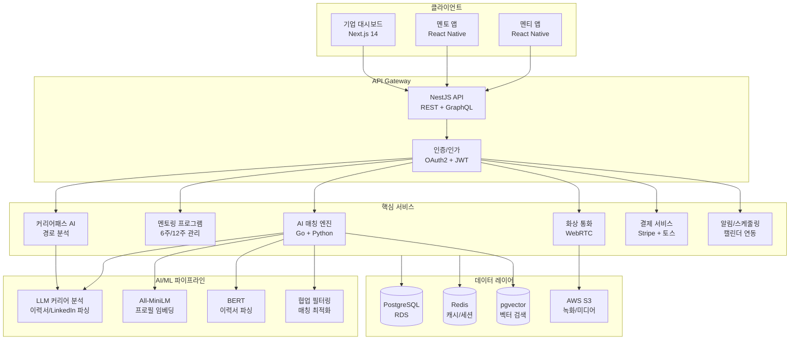
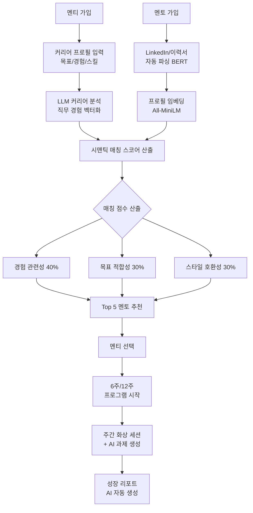
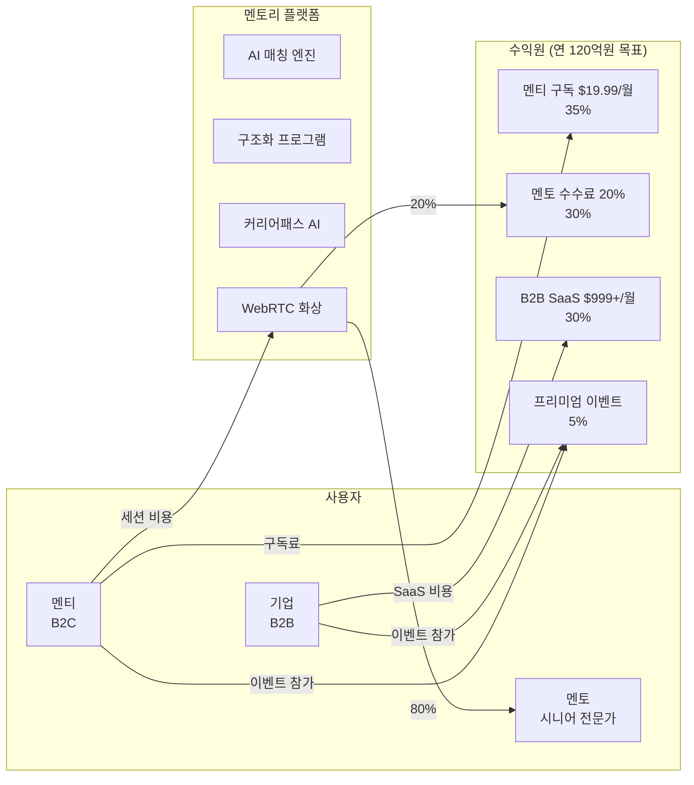
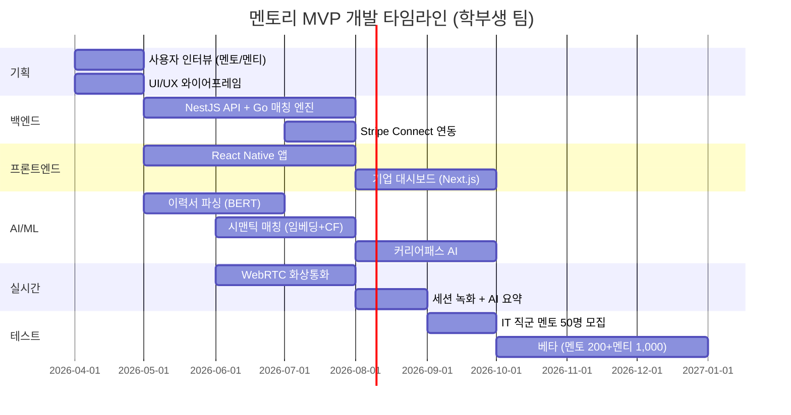

# 멘토리 (Mentory) — AI 기반 글로벌 커리어 멘토링 매칭 플랫폼

> **예비창업패키지 사업계획서**
> 작성일: 2026년 3월
> 버전: 2.0 (Enhanced)

---

## □ 일반현황

| 항목 | 내용 |
|------|------|
| **창업아이템명** | 멘토리 — AI 기반 글로벌 산업별 커리어 멘토링 매칭 플랫폼 |
| **산출물** | 웹 플랫폼 1개, 모바일 앱(iOS/Android) 1세트, AI 커리어패스 분석 엔진 1세트 |
| **직업(현재)** | 대학원 석사과정 (소프트웨어공학 전공) |
| **기업예정명** | 주식회사 멘토리 (Mentory Inc.) |
| **팀 구성 현황** | 대표 1인 + 공동창업자 1인 + 외부 자문 2인 (HR테크 전문가, 커리어 코칭 전문가) |

---

## □ 창업 아이템 개요(요약)

| 항목 | 내용 |
|------|------|
| **명칭** | 멘토리 (Mentory) |
| **범주** | HR테크 / 커리어 멘토링 매칭 플랫폼 (웹 + 앱) |

### 창업 아이템 개요

**멘토리**는 전 세계 시니어 전문가(멘토)와 커리어 성장을 원하는 주니어/전환자(멘티)를 AI로 매칭하는 **커리어 멘토링 플랫폼**이다. LinkedIn이 "연결"에 그치는 곳에서, 멘토리는 **깊은 1:1 멘토링 관계**를 만든다. AI가 직무 경험, 산업 도메인, 커리어 목표, 성격/소통 스타일을 분석하여 최적의 멘토-멘티 쌍을 매칭하고, 구조화된 6주/12주 멘토링 프로그램으로 실질적 커리어 성장을 지원한다.

| 요약 항목 | 내용 |
|-----------|------|
| **문제인식** | 글로벌 코칭/멘토링 시장 $20.2B(2024). 사회초년생의 67%가 멘토 필요하나 실제 보유율 37%. 양질의 멘토링은 명문대/대기업 등 특권층만 접근 가능 |
| **실현가능성** | LinkedIn/이력서 AI 분석 매칭, 구조화된 멘토링 프로그램 (6주/12주), AI 커리어 패스 분석, WebRTC 화상통화. 6개월 MVP |
| **성장전략** | 한국 IT/금융 직군 시작 → 전 산업 확장 → 글로벌. 멘티 구독 $19.99/월 + 멘토 수수료 20% + B2B SaaS. 3년 내 MAU 10만, 연매출 120억원 |
| **팀구성** | AI/개발 대표 + HR테크 운영 공동창업자 + 커리어 코칭 자문 + HR 자문 |

---

## 1. 문제 인식 (Problem) — 창업 아이템의 필요성

### 1.0 문제 구조도

```
┌─────────────────────────────────────────────────────────────────────┐
│                    커리어 멘토링 불평등 구조                            │
├─────────────────────────────────────────────────────────────────────┤
│                                                                     │
│  ┌──────────────┐    정보 비대칭    ┌──────────────────────┐        │
│  │   멘티 (수요)  │◄─── 단절 ───►│   멘토 (공급)          │        │
│  │              │                 │                      │        │
│  │ ● 사회초년생   │                 │ ● 시니어 전문가        │        │
│  │ ● 직무전환자   │                 │ ● 은퇴 임원           │        │
│  │ ● 외국인 인재  │                 │ ● 해외 전문가          │        │
│  └──────┬───────┘                 └──────────┬───────────┘        │
│         │                                     │                    │
│         ▼                                     ▼                    │
│  ┌──────────────────────┐          ┌──────────────────────┐        │
│  │     접근 장벽          │          │     공급 장벽          │        │
│  ├──────────────────────┤          ├──────────────────────┤        │
│  │ ► 명문대 네트워크 부재  │          │ ► 멘토링 플랫폼 부재   │        │
│  │ ► 지방/중소기업 고립    │          │ ► 시간/보상 부족       │        │
│  │ ► 비용 부담 ($200+/hr) │          │ ► 매칭 비효율          │        │
│  │ ► 문화/언어 장벽       │          │ ► 성과 측정 불가        │        │
│  └──────────┬───────────┘          └──────────┬───────────┘        │
│             │                                  │                    │
│             ▼                                  ▼                    │
│  ┌──────────────────────────────────────────────────────┐          │
│  │              결과: 커리어 기회의 양극화                   │          │
│  ├──────────────────────────────────────────────────────┤          │
│  │ ● 멘토 있는 직장인: 승진 확률 5배, 급여 +20%            │          │
│  │ ● 멘토 없는 직장인: 이직 반복, 커리어 표류               │          │
│  │ ● 사회적 비용: 인적자원 미스매치, 생산성 손실 연 $4.5T    │          │
│  └──────────────────────────────────────────────────────┘          │
│                              │                                      │
│                              ▼                                      │
│             ┌────────────────────────────────┐                      │
│             │  ★ 멘토리의 솔루션               │                      │
│             │  AI 매칭 + 구조화 프로그램 +     │                      │
│             │  접근성 민주화 + 성과 측정        │                      │
│             └────────────────────────────────┘                      │
└─────────────────────────────────────────────────────────────────────┘
```

### 1.1 커리어 정보 비대칭과 멘토링의 가치

Harvard Business Review(2024)에 따르면, **멘토링을 받은 직장인은 승진 확률이 5배, 급여 상승률이 20% 이상 높다**. Gallup(2024) 조사에서는 밀레니얼/Z세대 직장인의 79%가 멘토링이 커리어 성공에 필수라고 응답했다.

| 지표 | 수치 | 출처 |
|------|------|------|
| 멘토가 필요하다고 응답 | 67% | Olivet Nazarene University, 2024 |
| 실제 멘토를 보유한 비율 | 37% | MentorCliq Report, 2024 |
| 멘토가 있어 커리어에 도움을 받았다 | 97% | Forbes Advisor, 2024 |
| 기업 멘토링 프로그램 보유율 | 대기업 71%, 중소기업 12% | ATD Research, 2024 |
| 멘토링 후 이직률 감소 | 72% 감소 | Deloitte Human Capital, 2024 |
| 멘토 보유자 연봉 프리미엄 | +$5,600/년 평균 | PayScale Survey, 2024 |

### 1.2 사회적 비용 분석 — 멘토링 부재가 만드는 경제적 손실

멘토링 부재는 개인의 문제를 넘어 사회 전체의 경제적 손실로 이어진다. 아래는 주요 사회적 비용 항목을 정량화한 분석이다.

| 비용 항목 | 연간 규모 (한국) | 연간 규모 (글로벌) | 산출 근거 |
|-----------|----------------|-------------------|----------|
| **조기 이직 비용** | 약 15조원 | $600B | 신입 1인당 채용+교육 비용 3,000만원, 1년 내 퇴사율 30% (한국경영자총협회, 2024) |
| **직무 미스매치** | 약 8조원 | $350B | 전공-직무 불일치로 인한 생산성 저하 18% (OECD Skills Outlook, 2024) |
| **리스킬링 지연** | 약 5조원 | $250B | AI 시대 직무 전환 필요 인력 대비 실제 전환율 15% (WEF Future of Jobs, 2024) |
| **정신건강 비용** | 약 3조원 | $200B | 커리어 불안으로 인한 번아웃/우울 의료비 + 생산성 손실 (WHO, 2024) |
| **두뇌 유출** | 약 2조원 | $150B | 국내 커리어 성장 한계로 인한 해외 이탈 인재 가치 환산 |
| **합계** | **약 33조원** | **$1.55T** | - |

> **멘토링은 비용이 아니라 투자다.** 멘토링 프로그램 도입 기업은 이직률 72% 감소, 직원 만족도 50% 증가, 생산성 25% 향상을 경험한다 (Deloitte, 2024).

### 1.3 사회적 문제 공감대 형성

#### 실제 사례/스토리텔링

**사례 1: 지방대 졸업생 이하늘 (25세, 대전)**
컴퓨터공학과를 졸업한 이하늘 씨는 IT 대기업 취업을 목표로 하지만, 주변에 IT 업계 선배가 전무하다. "서울 명문대 친구들은 선배 네트워크로 이력서 첨삭, 면접 팁, 인맥 소개까지 받는데, 저는 유튜브가 유일한 정보원이에요. 같은 실력이어도 정보 격차 때문에 기회가 불평등합니다." 하늘 씨는 LinkedIn에서 5명의 시니어 개발자에게 커피챗을 요청했지만, 단 한 명도 응답하지 않았다.

**사례 2: 직무 전환 희망자 박서연 (33세, 서울, 마케터 → 데이터 분석가)**
마케팅 팀에서 5년 일한 박서연 씨는 데이터 분석 직무로 전환하고 싶지만, "현직 데이터 분석가에게 실제 업무가 어떤지, 어떤 스킬을 먼저 배워야 하는지 들을 수 있는 채널이 없어요. 온라인 강의만으로는 현실적인 커리어 조언을 받을 수 없습니다."

**사례 3: 한국 취업 희망 외국인 Chen Wei (27세, 중국, 한국 석사 졸업)**
한국에서 석사를 마친 Chen Wei 씨는 한국 기업 문화와 채용 프로세스에 대한 조언을 구하지 못해 어려움을 겪고 있다. "중국에서는 면접 방식이 다르고, 한국 기업이 어떤 인재를 원하는지 알려줄 멘토가 절실합니다."

#### 심화 페르소나 분석 (3인)

**페르소나 1: "고립된 지방 인재" — 이하늘 (25세, 대전, 지방대 컴공 졸업)**

| 항목 | 내용 |
|------|------|
| **배경** | 충남대 컴퓨터공학과 졸업, 학점 3.8/4.5, 알고리즘 대회 입상 |
| **목표** | 네이버/카카오급 IT 대기업 백엔드 개발자 취업 |
| **Pain Point** | 서울 명문대 대비 네트워크 절대 열위, 면접 정보 부재, 포트폴리오 피드백 불가 |
| **현재 대안** | 유튜브 취업 영상, 블라인드 익명 질문 (응답 품질 낮음) |
| **지불 의사** | 월 2-3만원 (대학생 수준) |
| **핵심 니즈** | 실제 네이버/카카오 재직자의 1:1 면접 코칭, 코드 리뷰 |
| **멘토리 가치** | AI가 "지방대 출신 → 대기업 입사" 경험 멘토를 매칭, 6주 면접 집중 프로그램 |

**페르소나 2: "커리어 전환의 갈림길" — 박서연 (33세, 서울, 마케터 → 데이터 분석)**

| 항목 | 내용 |
|------|------|
| **배경** | 경영학과 졸업, 대기업 마케팅 5년차, 데이터 분석 부트캠프 수료 |
| **목표** | 마케터에서 데이터 분석가로 직무 전환 (6개월 내) |
| **Pain Point** | 전환 경로의 불확실성, "나이 33에 전환이 가능한가" 불안, 포트폴리오 방향 모호 |
| **현재 대안** | 부트캠프 커뮤니티 (졸업 후 관계 약화), 직무전환 오픈카톡방 (피상적) |
| **지불 의사** | 월 5-10만원 (직장인 수준, ROI 기대) |
| **핵심 니즈** | "마케터→데이터 분석가" 실제 전환 경험자의 현실적 조언, 포트폴리오 리뷰 |
| **멘토리 가치** | AI가 유사 전환 성공 사례 매칭, 12주 체계적 전환 프로그램 + 스킬 갭 분석 |

**페르소나 3: "크로스보더 커리어 도전자" — Priya Sharma (26세, 인도, 한국 IT 취업 희망)**

| 항목 | 내용 |
|------|------|
| **배경** | IIT Delhi CS 학사, 한국 KAIST 석사 졸업, NLP 연구 경험 |
| **목표** | 삼성 AI 센터 또는 네이버 랩스 입사 |
| **Pain Point** | 한국 기업 문화 이해 부족, 한국어 면접 불안, 비자/고용 절차 정보 부재 |
| **현재 대안** | KAIST 한국인 친구 (도움에 한계), LinkedIn 콜드 메시지 (무응답) |
| **지불 의사** | 월 $30-50 (글로벌 가격 수용) |
| **핵심 니즈** | 한국 IT 기업 재직 외국인 멘토, 한국어 면접 시뮬레이션, 문화 적응 코칭 |
| **멘토리 가치** | 크로스보더 매칭으로 "인도→한국 IT" 경험 멘토 연결, 문화 호환성 AI 분석 |

#### 통계의 인간적 해석

- **멘토 필요 67%, 실제 보유 37%**: 직장인 3명 중 2명이 멘토가 필요하다고 느끼지만, 실제로 멘토를 가진 사람은 3명 중 1명에 불과하다. 나머지 30%는 "필요하지만 찾을 수 없는" 멘토링 사각지대에 놓여 있다.
- **대기업 71% vs 중소기업 12% 멘토링 프로그램**: 대기업에 입사한 사람은 체계적 멘토링을 받지만, 전체 고용의 83%를 차지하는 중소기업 직원은 멘토링 기회조차 없다. 이는 "부익부 빈익빈" 커리어 성장 구조를 고착화한다.
- **멘토링 받은 사람의 승진 확률 5배**: 이는 멘토링이 단순한 조언이 아니라, 커리어 성공을 좌우하는 결정적 변수임을 의미한다. 멘토링 접근 기회의 불평등은 곧 커리어 기회의 불평등이다.

#### 해외 성공 사례로 문제 해결 가능성 입증

- **MentorCruise($10M+ 매출)**: 부트스트래핑으로 성장하며 유료 멘토링의 수익성을 검증. Google·Meta 출신 멘토 3,000명이 활동하며, 멘토링의 가치에 기꺼이 비용을 지불하는 시장이 존재함을 입증.
- **ADPList(200개국 20만+ 멘토)**: "멘토링의 민주화"를 비전으로, 전 세계 누구나 무료로 디자인·PM 멘토링을 받을 수 있는 플랫폼. 대규모 멘토 네트워크 구축이 가능함을 증명.
- **Plato(Fortune 500 기업 1,000+ 고객)**: B2B 기업 멘토링 SaaS의 높은 수익성 검증. 기업들이 임직원 멘토링에 적극 투자하는 추세.

### 1.4 해외 사례 심층 비교 분석

| 비교 항목 | MentorCruise | ADPList | Plato | Clarity.fm | **멘토리** |
|-----------|-------------|---------|-------|------------|----------|
| **설립/국가** | 2018/독일·미국 | 2021/싱가포르 | 2017/미국 | 2012/미국 | 2026/한국 |
| **타겟** | 테크 개인 | 디자인·PM | 엔지니어링 리더 B2B | 전 분야 전문가 | 전 산업 개인+B2B |
| **매칭 방식** | 수동 검색+필터 | 카테고리 검색 | 알고리즘+큐레이션 | 수동 검색 | **AI 시맨틱 매칭** |
| **프로그램** | 자유형식 구독 | 자유형식 무료 | 구조화 B2B | 1회성 통화 | **6주/12주 구조화** |
| **AI 활용** | 없음 | 기본 추천 | 기본 매칭 | 없음 | **LLM+임베딩+협업필터링** |
| **커리어 분석** | 없음 | 없음 | 없음 | 없음 | **스킬갭+경로 AI** |
| **가격** | $150-500/월 | 무료 | 기업 계약 | $1-10/분 | $19.99/월+세션비 |
| **멘토 수** | 3,000+ | 200,000+ | 1,500+ | 30,000+ | 목표 5,000 (Y2) |
| **수익 모델** | 구독 | 프리미엄+B2B | B2B SaaS | 수수료 | **하이브리드 4종** |
| **크로스보더** | 부분적 | 글로벌 | 미국 중심 | 글로벌 | **문화 맥락 매칭** |
| **약점** | 테크 한정, 비쌈 | 수익 모델 약함 | B2B 한정 | 깊이 부족 | 초기 멘토 풀 |

> **멘토리의 차별점**: 기존 플랫폼 중 AI 시맨틱 매칭 + 구조화 프로그램 + 커리어패스 분석 + B2C/B2B 하이브리드를 모두 갖춘 서비스는 부재. 멘토리는 이 4가지를 통합한 최초의 플랫폼이다.

### 1.5 기존 커리어 네트워킹의 구조적 한계

| 플랫폼 | 한계 |
|--------|------|
| **LinkedIn** | 연결은 쉬우나 실질적 멘토링 관계 형성 어려움. 커피챗 요청 응답률 5% 미만 |
| **사내 멘토링** | 같은 회사 내 한정, 산업/직무 전환 시 무용, 중소기업은 프로그램 자체 부재 |
| **대학 동문 네트워크** | 명문대 편중, 체계적 매칭 부재 |
| **온라인 커뮤니티** | 블라인드, Reddit 등 익명 조언 → 깊이/지속성 부족 |

### 1.6 시장 조사 심화 — TAM/SAM/SOM 분석

```
┌─────────────────────────────────────────────────────────────────────┐
│                    시장 기회 TAM / SAM / SOM                         │
├─────────────────────────────────────────────────────────────────────┤
│                                                                     │
│  ┌─────────────────────────────────────────────────────────────┐    │
│  │                      TAM: $400B                             │    │
│  │          글로벌 코칭/멘토링 + 기업 L&D 시장                    │    │
│  │                                                             │    │
│  │    ┌─────────────────────────────────────────────────┐      │    │
│  │    │                 SAM: $12B                        │      │    │
│  │    │     글로벌 온라인 커리어 코칭 + 멘토링 SaaS        │      │    │
│  │    │                                                 │      │    │
│  │    │     ┌─────────────────────────────────────┐     │      │    │
│  │    │     │          SOM: $500M                  │     │      │    │
│  │    │     │  한국·아시아 IT/금융 온라인 멘토링     │     │      │    │
│  │    │     │                                     │     │      │    │
│  │    │     │   ┌───────────────────────────┐     │     │      │    │
│  │    │     │   │   Y1 목표: $2M (24억원)    │     │     │      │    │
│  │    │     │   │   멘토 500 × 멘티 5,000    │     │     │      │    │
│  │    │     │   └───────────────────────────┘     │     │      │    │
│  │    │     └─────────────────────────────────────┘     │      │    │
│  │    └─────────────────────────────────────────────────┘      │    │
│  └─────────────────────────────────────────────────────────────┘    │
│                                                                     │
│  성장률: TAM 5.4% → SAM 21.5% → SOM 15% CAGR                      │
│  핵심 드라이버: AI 채택, 리스킬링 수요, 원격 멘토링 일상화             │
└─────────────────────────────────────────────────────────────────────┘
```

| 구분 | 정의 | 규모 | 산출 근거 |
|------|------|------|----------|
| **TAM** (전체시장) | 글로벌 코칭/멘토링 + 기업 L&D 시장 | **$400B** (2024) | 코칭/멘토링 $20.2B + 기업 L&D $380B (ICF, Grand View Research, 2024) |
| **SAM** (유효시장) | 글로벌 온라인 커리어 코칭 + 기업 멘토링 SaaS 시장 | **약 $12B** (2024) | 온라인 커리어 코칭 $2.1B + 기업 멘토링 소프트웨어 $10B 추정 |
| **SOM** (수익시장) | 한국·아시아 IT/금융 직군 온라인 커리어 멘토링 | **약 $500M** | 한국 커리어 교육 시장 2.5조원의 온라인 멘토링 비중 20% 추정 |

#### 글로벌 vs 국내 시장 비교

| 비교 항목 | 글로벌 | 한국 | 시사점 |
|-----------|--------|------|--------|
| 코칭/멘토링 시장 규모 | $20.2B (2024) | 약 2.5조원 (2024) | 한국은 글로벌 시장의 약 10% 규모, 성장률 높음 |
| 기업 멘토링 프로그램 보유율 | 대기업 71% | 대기업 65%, 중소기업 8% | 한국 중소기업 멘토링 시장 공백이 더 심각 |
| 온라인 코칭 CAGR | 21.5% | 약 15% | 글로벌 성장이 더 빠르나 한국도 고성장 추세 |
| 1:1 코칭 시간당 비용 | $100-500 (MentorCruise) | 10-50만원 | 한국 시장은 가격 대비 높은 품질 기대 |
| 밀레니얼/Z세대 멘토링 수요 | 79% (Gallup) | 74% (한국고용정보원) | 양국 모두 젊은 세대의 멘토링 수요 매우 높음 |

### 1.7 사용자 구매동인(Purchase Motivation) 분석

#### 기능적 동인

| 동인 | 멘티 (B2C) | 기업 (B2B) |
|------|-----------|-----------|
| **시간 절약** | AI 매칭으로 최적 멘토를 즉시 추천, LinkedIn 냉메일 대비 시간 90% 절약 | 사내 멘토링 매칭 수작업 제거, HR팀 업무 부담 경감 |
| **비용 절감** | 전문 커리어 코치 $200-500/시간 대비 월 $19.99로 구조화된 멘토링 | 외부 코칭 업체 위탁 대비 60% 비용 절감 |
| **편의성** | 화상통화+비동기 메시징으로 시간·장소 제약 없음, 캘린더 자동 스케줄링 | 대시보드에서 전사 멘토링 현황 일괄 관리 |
| **품질 보장** | AI 커리어패스 분석 + 스킬 갭 진단으로 체계적 성장 로드맵 제공 | 멘토링 ROI 측정 (승진율, 이직률, 만족도) 데이터 제공 |

#### 감정적 동인

| 동인 | 설명 |
|------|------|
| **불안 해소** | "내 커리어 선택이 맞는 건가?" → 경험 많은 멘토의 조언으로 방향성 확인. "이직해야 할까?" 같은 중대 결정의 불확실성 해소 |
| **신뢰감** | 멘토의 실제 경력·성과가 투명하게 공개. "Google 시니어 엔지니어 10년 경력"이라는 검증된 프로필이 신뢰 형성 |
| **성취감** | 6주/12주 프로그램 완료 시 성장 리포트 제공. "멘토링 전후 스킬 레벨 변화" 시각화로 성장 실감 |
| **연결감** | 나만의 커리어 고민을 공유할 수 있는 안전한 관계. 멘토-멘티 장기 관계에서 오는 심리적 안정감 |

#### 사회적 동인

| 동인 | 설명 |
|------|------|
| **소속감** | 같은 산업·직무의 멘토링 커뮤니티. "우리는 모두 데이터 분석가를 꿈꾸는 사람들" 동질감 |
| **사회적 인정** | 멘토: "나의 경험이 누군가의 커리어를 바꿨다"는 사회적 기여감. 멘티: "글로벌 전문가에게 인정받았다"는 자존감 |
| **트렌드** | "커리어 성장은 혼자 하는 게 아니라 멘토와 함께" 인식 확산. 퍼스널 브랜딩·네트워킹 트렌드와 연결 |

#### 페르소나별 구매 여정

**페르소나 A: "직무 전환 희망자" — 김준혁 (30세, 서울, 마케터 → PM 전환 희망)**

| 단계 | 행동 | 감정 | 멘토리 접점 |
|------|------|------|-----------|
| 인지 | PM 직무에 관심, 블라인드·유튜브에서 정보 수집하나 현실감 부족 | "PM이 실제로 어떤 일을 하는지 모르겠다" 막막 | 직장인 커뮤니티 광고, 커리어 콘텐츠 |
| 탐색 | 멘토리 앱에서 "마케터→PM 전환" 경험 멘토 프로필 탐색 | "이 멘토는 나와 같은 경로를 걸었네!" 공감 | AI 매칭, 유사 전환 사례 추천 |
| 구매 | 6주 익스프레스 프로그램 등록 ($19.99/월 구독 + 멘토 세션 $80/시간) | "구체적인 로드맵이 생겼다!" 안도 | 구조화된 6주 프로그램, 스킬 갭 분석 |
| 재구매 | 12주 심화 프로그램으로 전환, 포트폴리오 리뷰 + 모의 면접 | "멘토 피드백 덕분에 면접에서 자신감이 생겼다" 성장 | 커리어패스 AI, 포트폴리오 리뷰 |
| 추천 | 전직 마케터 동료에게 추천, LinkedIn에 멘토링 성과 공유 | "나도 전환에 성공했다!" 자부심 | 추천 리워드, 커뮤니티 |

**페르소나 B: "글로벌 커리어 도전자" — Priya Sharma (26세, 인도 뭄바이, 한국 IT 기업 취업 희망)**

| 단계 | 행동 | 감정 | 멘토리 접점 |
|------|------|------|-----------|
| 인지 | 삼성·네이버 등 한국 IT 기업 해외 채용 공고 발견 | "한국 기업 문화와 면접 방식을 전혀 모른다" 불안 | 해외 취업 커뮤니티, LinkedIn 광고 |
| 탐색 | 한국 IT 기업 재직 중인 인도인 멘토 또는 글로벌 채용 경험 멘토 검색 | "같은 배경의 멘토가 있다니 든든하다" 안심 | 크로스보더 매칭, 문화 호환성 분석 |
| 구매 | 12주 심화 프로그램 (한국 기업 문화 이해 + 면접 준비 + 이력서 현지화) | "한국 면접 예상 질문과 대답 방식을 배웠다" 자신감 | 문화 맥락 멘토링, AI 이력서 분석 |
| 성과 | 네이버 해외 채용 면접 통과, 입사 | "멘토 없이는 불가능했을 것" 감사 | 성공 사례 공유, 멘토 리뷰 |

### 1.8 글로벌 멘토링/코칭 시장 규모 (보충)

| 시장 구분 | 2024-2025년 | 2030년 (전망) | CAGR |
|-----------|-------------|---------------|------|
| 글로벌 코칭/멘토링 시장 | $20.2B (2024) | $30.5B | 7.1% |
| 기업 L&D (학습개발) 시장 | $380B (2024) | $520B | 5.4% |
| 온라인 커리어 코칭 시장 | $2.1B (2024) | $6.8B | 21.5% |
| 한국 커리어 교육/코칭 시장 | 약 2.5조원 (2024) | 약 4.8조원 | 11.5% |

> 출처: ICF Global Coaching Study (2024), LinkedIn Workplace Learning Report (2025), Grand View Research (2024)

### 1.9 성공 사례 분석

#### MentorCruise (독일/미국, 2018~)
- **연 매출**: $10M+ (2024, bootstrapped)
- **핵심**: 테크 업계 유료 1:1 멘토링. 멘토 $150-500/월 구독
- **성과**: 3,000+ 멘토 (Google, Meta, Amazon 출신), 만족도 4.8/5.0
- **시사점**: 유료 멘토링 모델의 수익성 검증. 단, 테크 업계 한정

#### ADPList (싱가포르, 2021~)
- **누적 투자**: $7.3M (Series A)
- **핵심**: 무료 디자인/PM 멘토링, "멘토링의 민주화" 비전
- **성과**: 200개국 20만+ 멘토, 누적 멘토링 세션 250만+
- **시사점**: 대규모 멘토 네트워크 구축 가능성 입증

#### Plato (미국, 2017~)
- **누적 투자**: $18M
- **핵심**: 엔지니어링 리더 전문 멘토링, B2B 모델
- **성과**: Fortune 500 포함 1,000+ 기업 고객
- **시사점**: B2B 기업 멘토링 SaaS의 높은 수익성

#### Clarity.fm (미국, 2012~)
- **핵심**: 전문가 유료 전화 상담, 분당 $1-10
- **시사점**: 시간 단위 전문가 접근 모델의 시장 수요 검증

---

## 2. 실현 가능성 (Solution) — 창업 아이템의 개발 계획

### 2.1 서비스 아키텍처 개요

```
┌─────────────────────────────────────────────────────────────────────┐
│                     멘토리 서비스 아키텍처                             │
├─────────────────────────────────────────────────────────────────────┤
│                                                                     │
│   ┌─────────┐   ┌─────────┐   ┌───────────┐   ┌──────────┐        │
│   │  멘티앱  │   │  멘토앱  │   │ 기업 대시보드│   │  관리자   │        │
│   │(Mobile) │   │(Mobile) │   │  (Web)    │   │ (Web)   │        │
│   └────┬────┘   └────┬────┘   └─────┬─────┘   └────┬─────┘        │
│        │             │              │               │               │
│        └──────┬──────┴──────┬───────┴───────┬───────┘               │
│               │             │               │                       │
│               ▼             ▼               ▼                       │
│  ┌──────────────────────────────────────────────────────┐          │
│  │              API Gateway (Kong / NestJS)              │          │
│  │         인증(OAuth2+JWT) + 속도제한 + 로깅             │          │
│  └────────┬──────────┬──────────┬──────────┬────────────┘          │
│           │          │          │          │                        │
│           ▼          ▼          ▼          ▼                        │
│  ┌────────────┐┌──────────┐┌──────────┐┌──────────────┐           │
│  │ AI 매칭    ││ 멘토링   ││ 커리어   ││  커뮤니케이션  │           │
│  │ 엔진(Go)  ││ 프로그램 ││ 패스 AI  ││  (WebRTC)    │           │
│  │           ││ 관리서비스││ 분석서비스││              │           │
│  │ ●시맨틱매칭││ ●6/12주  ││ ●스킬갭  ││ ●화상통화     │           │
│  │ ●성향분석 ││ ●과제생성││ ●경로추천 ││ ●채팅/메시징  │           │
│  │ ●CF필터링 ││ ●진도관리││ ●벤치마킹 ││ ●세션녹화     │           │
│  └──────┬─────┘└────┬─────┘└────┬─────┘└──────┬───────┘           │
│         │           │           │              │                    │
│         └─────┬─────┴─────┬─────┴──────┬───────┘                   │
│               │           │            │                            │
│               ▼           ▼            ▼                            │
│  ┌──────────────────────────────────────────────────────┐          │
│  │                    AI/ML 파이프라인                     │          │
│  │  ┌─────────┐ ┌──────────┐ ┌────────┐ ┌───────────┐  │          │
│  │  │  LLM    │ │All-MiniLM│ │ BERT   │ │  협업필터링 │  │          │
│  │  │커리어분석│ │프로필임베딩│ │이력서파싱│ │ 매칭최적화 │  │          │
│  │  └─────────┘ └──────────┘ └────────┘ └───────────┘  │          │
│  └──────────────────────┬───────────────────────────────┘          │
│                         │                                           │
│                         ▼                                           │
│  ┌──────────────────────────────────────────────────────┐          │
│  │                   데이터 레이어                        │          │
│  │  ┌──────────┐ ┌───────┐ ┌─────────┐ ┌────────────┐  │          │
│  │  │PostgreSQL│ │ Redis │ │pgvector │ │  AWS S3    │  │          │
│  │  │ (RDS)   │ │ Cache │ │벡터검색  │ │ 미디어저장  │  │          │
│  │  └──────────┘ └───────┘ └─────────┘ └────────────┘  │          │
│  └──────────────────────────────────────────────────────┘          │
└─────────────────────────────────────────────────────────────────────┘
```

### 2.2 핵심 기능

#### 1) AI 멘토-멘티 시맨틱 매칭
- LinkedIn/이력서 자동 분석으로 직무 경험, 스킬, 산업 도메인 추출
- 커리어 목표를 자연어 벡터화하여 시맨틱 매칭
- 소통 스타일 호환성 분석 (대화형/구조형/실용형)
- 다차원 매칭 점수: 경험 관련성 x 목표 적합성 x 스타일 호환성

#### 2) 구조화된 멘토링 프로그램
- 6주 익스프레스: 특정 주제 집중 (이직, 포트폴리오, 리더십)
- 12주 심화: 장기 커리어 전략, 스킬 개발
- 주간 미션/과제 AI 자동 생성, 중간 체크포인트

#### 3) AI 커리어 패스 분석
- 현재→목표 직무 최적 경로 추천
- 스킬 갭 분석 + 학습 로드맵 자동 생성
- 유사 전환 성공 사례 매칭, 연봉/직급 벤치마킹

#### 4) 커뮤니케이션 인프라
- WebRTC 화상통화, 비동기 메시징
- 세션 녹화 + AI 요약 노트 자동 생성
- 캘린더 연동 자동 스케줄링

### 2.3 AI 모델 개발 상세 계획

| 모델/기술 | 용도 | 학습 데이터 | 개발 단계 | 예상 성능 |
|-----------|------|-----------|----------|----------|
| **LLM (GPT-4o Fine-tuned)** | 커리어 분석, 이력서 요약, 멘토링 질문 생성 | 이력서 50K건, 커리어 상담 10K건 | MVP: API 호출 → V2: 자체 파인튜닝 | 분석 정확도 85%+ |
| **All-MiniLM-L6-v2** | 프로필 임베딩, 시맨틱 유사도 | 프로필 100K건 벡터화 | MVP부터 적용 | 매칭 관련도 0.82+ |
| **BERT (koBERT + multilingual)** | 이력서 파싱, 스킬 추출, NER | 한/영 이력서 30K건 | MVP부터 적용 | F1-score 0.88+ |
| **협업 필터링 (ALS)** | 매칭 최적화, 유사 성공 사례 | 멘토링 세션 피드백 누적 | V2 (데이터 축적 후) | NDCG@5 0.75+ |
| **성격 분석 모델** | 소통 스타일 호환성 | MBTI/DISC 기반 설문 + 채팅 분석 | V2 | 호환성 예측 78%+ |
| **커리어 경로 예측** | 최적 전환 경로 추천 | LinkedIn 공개 프로필 200K건 | V3 | 경로 적중률 72%+ |

### 2.4 시스템 아키텍처 (Layered Architecture)

```
┌─────────────────────────────────────────────────────────────────────┐
│                        PRESENTATION LAYER                           │
│  ┌──────────────┐ ┌──────────────┐ ┌──────────────┐ ┌───────────┐  │
│  │ React Native │ │   Next.js    │ │  Admin Panel  │ │  Widget   │  │
│  │  iOS/Android │ │  Web Client  │ │  (내부 관리)   │ │ (B2B 임베드)│  │
│  └──────┬───────┘ └──────┬───────┘ └──────┬───────┘ └─────┬─────┘  │
├─────────┼────────────────┼────────────────┼───────────────┼─────────┤
│         └────────────────┴────────┬───────┴───────────────┘         │
│                                   ▼                                  │
│                          API GATEWAY LAYER                           │
│  ┌──────────────────────────────────────────────────────────────┐   │
│  │  Kong API Gateway + Rate Limiting + JWT Auth + API Versioning│   │
│  └──────────────────────────────┬───────────────────────────────┘   │
├─────────────────────────────────┼───────────────────────────────────┤
│                                 ▼                                    │
│                        APPLICATION LAYER                             │
│  ┌────────────┐ ┌────────────┐ ┌────────────┐ ┌────────────────┐   │
│  │  매칭 서비스 │ │ 멘토링 관리 │ │ 결제 서비스 │ │  알림/스케줄링  │   │
│  │   (Go)     │ │ (NestJS)   │ │  (NestJS)  │ │   (NestJS)    │   │
│  ├────────────┤ ├────────────┤ ├────────────┤ ├────────────────┤   │
│  │►시맨틱매칭  │ │►프로그램CRUD│ │►Stripe연동 │ │►캘린더 동기화  │   │
│  │►점수 산출  │ │►과제 관리  │ │►토스 연동  │ │►푸시 알림     │   │
│  │►추천 생성  │ │►진도 추적  │ │►정산 처리  │ │►이메일/SMS   │   │
│  └─────┬──────┘ └─────┬──────┘ └─────┬──────┘ └───────┬────────┘   │
├────────┼──────────────┼──────────────┼────────────────┼─────────────┤
│        └──────────────┴──────┬───────┴────────────────┘             │
│                              ▼                                       │
│                       AI/ML SERVICE LAYER                            │
│  ┌────────────────────────────────────────────────────────────┐     │
│  │  ML Pipeline (Python FastAPI + Celery + Redis Queue)       │     │
│  │  ┌──────────┐ ┌──────────┐ ┌──────────┐ ┌─────────────┐  │     │
│  │  │ LLM 분석 │ │임베딩 생성│ │이력서 파싱│ │ 경로 예측    │  │     │
│  │  │ (GPT-4o) │ │(MiniLM)  │ │ (BERT)   │ │ (Custom ML) │  │     │
│  │  └──────────┘ └──────────┘ └──────────┘ └─────────────┘  │     │
│  └───────────────────────────┬────────────────────────────────┘     │
├──────────────────────────────┼──────────────────────────────────────┤
│                              ▼                                       │
│                     INFRASTRUCTURE LAYER                              │
│  ┌──────────┐ ┌──────────┐ ┌──────────┐ ┌─────────┐ ┌──────────┐  │
│  │ AWS EKS  │ │ RDS      │ │ Redis    │ │pgvector │ │ S3 + CDN │  │
│  │ K8s 클러스터│ │PostgreSQL│ │ Cache   │ │벡터DB   │ │ 미디어   │  │
│  └──────────┘ └──────────┘ └──────────┘ └─────────┘ └──────────┘  │
│  ┌──────────┐ ┌──────────┐ ┌──────────┐ ┌──────────────────────┐  │
│  │CloudWatch│ │ SQS/SNS  │ │Terraform │ │  GitHub Actions CI/CD│  │
│  │ 모니터링  │ │ 메시지큐  │ │ IaC     │ │  자동 배포            │  │
│  └──────────┘ └──────────┘ └──────────┘ └──────────────────────┘  │
└─────────────────────────────────────────────────────────────────────┘
```

### 2.5 기술 스택

| 구분 | 기술 |
|------|------|
| **프론트엔드** | Next.js 14, React Native |
| **백엔드** | Go (매칭 엔진), Node.js + NestJS (API) |
| **AI/ML** | LLM (커리어 분석), All-MiniLM (프로필 임베딩), BERT (이력서 파싱) |
| **실시간 통신** | WebRTC (화상), WebSocket (채팅/알림) |
| **결제** | Stripe Connect (글로벌), Toss Payments (국내) |
| **인프라** | AWS (EKS, RDS, SQS), Vercel (프론트) |

### 2.6 사용자 흐름 (User Flow)

```
┌─────────────────────────────────────────────────────────────────────┐
│                      멘토리 사용자 흐름 (멘티)                         │
├─────────────────────────────────────────────────────────────────────┤
│                                                                     │
│  ① 가입/온보딩                                                      │
│  ┌──────────┐    ┌──────────┐    ┌──────────┐    ┌──────────┐      │
│  │  회원가입  │──►│ 이력서/   │──►│ 커리어    │──►│ 소통 스타일│      │
│  │ (OAuth2) │    │LinkedIn  │    │ 목표 설정 │    │  테스트   │      │
│  └──────────┘    │  연동    │    └──────────┘    └─────┬────┘      │
│                  └──────────┘                          │            │
│                                                        ▼            │
│  ② AI 매칭                                                          │
│  ┌──────────────────────────────────────────────────────┐          │
│  │         AI가 프로필 분석 + 벡터화 (30초)               │          │
│  │                      │                                │          │
│  │                      ▼                                │          │
│  │    ┌──────────────────────────────────┐               │          │
│  │    │   Top 5 멘토 추천 (점수순)        │               │          │
│  │    │   ┌────┐┌────┐┌────┐┌────┐┌────┐│               │          │
│  │    │   │ 95%││ 92%││ 88%││ 85%││ 82%││               │          │
│  │    │   └────┘└────┘└────┘└────┘└────┘│               │          │
│  │    └──────────────────────────────────┘               │          │
│  └──────────────────────────────────────────────────────┘          │
│                              │                                      │
│                              ▼                                      │
│  ③ 멘토 선택 + 프로그램 시작                                         │
│  ┌──────────┐    ┌──────────┐    ┌──────────┐                      │
│  │ 멘토 상세 │──►│ 프로그램  │──►│  결제     │                      │
│  │ 프로필   │    │ 선택     │    │ (구독+   │                      │
│  │ 확인    │    │ 6주/12주 │    │  세션비)  │                      │
│  └──────────┘    └──────────┘    └─────┬────┘                      │
│                                        │                            │
│                                        ▼                            │
│  ④ 멘토링 진행                                                      │
│  ┌─────────┐    ┌─────────┐    ┌─────────┐    ┌─────────┐         │
│  │ Week 1  │──►│ Week 2  │──►│  ...    │──►│Week 6/12│         │
│  │ 목표설정 │    │ 과제수행 │    │ 반복    │    │ 최종리뷰 │         │
│  │ 화상세션 │    │ 피드백  │    │         │    │ 성장리포트│         │
│  └─────────┘    └─────────┘    └─────────┘    └────┬────┘         │
│                                                     │               │
│                                                     ▼               │
│  ⑤ 프로그램 완료                                                    │
│  ┌──────────┐    ┌──────────┐    ┌──────────┐                      │
│  │ AI 성장  │──►│ 멘토 리뷰 │──►│ 재구매/  │                      │
│  │ 리포트   │    │  작성    │    │ 추천    │                      │
│  └──────────┘    └──────────┘    └──────────┘                      │
└─────────────────────────────────────────────────────────────────────┘
```

### 2.7 개발 일정

| 구분 | 추진 내용 | 추진 기간 | 세부 내용 |
|------|----------|----------|----------|
| 1 | MVP 개발 | 2026.04 ~ 2026.09 | 프로필 + AI 매칭 + 화상세션 + 메시징 |
| 2 | 베타 테스트 | 2026.10 ~ 2026.12 | IT/금융 직군 멘토 200명 + 멘티 1,000명 |
| 3 | 정식 출시 | 2027.01 | 구조화 프로그램, 커리어패스 AI, B2B |
| 4 | 스케일업 | 2027.01 ~ 2027.06 | 전 산업 확장, 해외 멘토 온보딩 |

### 2.8 정부지원사업비 집행 계획

**< 1단계 (20백만원) >**

| 비목 | 산출 근거 | 금액(원) |
|------|----------|---------|
| 재료비 | AWS 인프라 6개월 (월 200만원 x 6) | 12,000,000 |
| 외주용역비 | AI 매칭 모델 개발 자문 | 5,000,000 |
| 지급수수료 | LinkedIn API, WebRTC 서버 비용 | 3,000,000 |
| **합계** | | **20,000,000** |

**< 2단계 (40백만원) >**

| 비목 | 산출 근거 | 금액(원) |
|------|----------|---------|
| 인건비 | 풀스택 개발자 채용 6개월 | 24,000,000 |
| 마케팅 | 직장인 타겟 B2C/B2B 마케팅 | 10,000,000 |
| 외주용역비 | UI/UX 디자인 + 커리어 코칭 자문 | 6,000,000 |
| **합계** | | **40,000,000** |

#### 2단계 예산 상세 내역

| 세부 항목 | Q1 | Q2 | Q3 | Q4 | 연간 합계 |
|----------|----|----|----|----|----------|
| AWS 인프라 (EKS+RDS+S3) | 600만 | 600만 | 800만 | 1,000만 | 3,000만 |
| WebRTC 서버 (LiveKit Cloud) | 100만 | 200만 | 300만 | 400만 | 1,000만 |
| OpenAI API (GPT-4o) | 200만 | 300만 | 400만 | 500만 | 1,400만 |
| 도메인/인증서/SaaS 도구 | 50만 | 50만 | 50만 | 50만 | 200만 |
| UI/UX 디자인 외주 | 300만 | 200만 | 100만 | 0 | 600만 |
| 마케팅 (디지털+오프라인) | 500만 | 1,000만 | 1,500만 | 2,000만 | 5,000만 |
| 인건비 (풀스택 1명) | 400만 | 400만 | 400만 | 400만 | 1,600만 |
| 인건비 (ML 엔지니어 1명) | 450만 | 450만 | 450만 | 450만 | 1,800만 |
| 법률/회계 자문 | 100만 | 50만 | 50만 | 100만 | 300만 |
| 예비비 | 100만 | 100만 | 100만 | 100만 | 400만 |
| **분기 합계** | **2,800만** | **3,350만** | **4,150만** | **5,000만** | **15,300만** |

#### Pre-Seed 자금 사용 계획 (3억원)

| 용도 | 금액 | 비중 | 상세 |
|------|------|------|------|
| **제품 개발** | 1.2억원 | 40% | MVP 풀스택 개발 (프론트+백엔드+AI) |
| **인건비** | 0.9억원 | 30% | CTO + ML엔지니어 6개월 급여 |
| **인프라** | 0.3억원 | 10% | AWS, API 비용, 개발 도구 |
| **멘토 확보** | 0.2억원 | 7% | 초기 멘토 인센티브, 온보딩 비용 |
| **마케팅** | 0.2억원 | 7% | 베타 론칭 마케팅, 커뮤니티 구축 |
| **법률/기타** | 0.2억원 | 6% | 법인설립, 회계, 예비비 |
| **합계** | **3.0억원** | **100%** | 12개월 런웨이 |

---

## 3. 성장전략 (Scale-up) — 사업화 추진 전략

### 3.1 비즈니스 모델

| 수익원 | 설명 | 목표 비중 |
|--------|------|----------|
| **멘티 구독** | AI 매칭, 구조화 프로그램, 커리어패스 분석 (월 $19.99) | 35% |
| **멘토 수수료** | 유료 세션 수익의 20% (시간당 $50-200) | 30% |
| **B2B 기업 SaaS** | 기업 멘토링 프로그램 운영 (월 $999~) | 30% |
| **프리미엄 이벤트** | 산업별 그룹 멘토링, 커리어 워크숍 | 5% |

### 3.2 구독 모델 상세 (4 Tiers)

| 티어 | 가격 (월) | 타겟 | 포함 기능 | 예상 비중 |
|------|----------|------|----------|----------|
| **Free** | $0 | 탐색 단계 멘티 | AI 커리어 진단 1회, 멘토 프로필 열람 5명, 커뮤니티 읽기 전용 | 60% (전환 퍼널) |
| **Starter** | $19.99 | 개인 멘티 (학생/초년생) | AI 매칭 무제한, 6주 프로그램 1개, 멘토 세션 2회/월, 커리어패스 기본 분석, 커뮤니티 참여 | 25% |
| **Pro** | $49.99 | 직무전환/시니어 멘티 | Starter 전체 + 12주 심화 프로그램, 멘토 세션 4회/월, 세션 녹화+AI 요약, 스킬갭 심화 분석, 포트폴리오 AI 리뷰 | 12% |
| **Enterprise** | $999~/월 (인당 $15) | 기업 HR | Pro 전체 + 전사 대시보드, 멘토링 ROI 리포트, 커스텀 프로그램 설계, 전용 멘토 풀, API 연동, CSM 배정 | 3% |

### 3.3 시장 진입 전략

```
┌─────────────────────────────────────────────────────────────────────┐
│                      시장 진입 전략 로드맵                             │
├─────────────────────────────────────────────────────────────────────┤
│                                                                     │
│  Phase 1 (2026-2027)          Phase 2 (2027-2028)                  │
│  ┌─────────────────┐          ┌──────────────────────┐             │
│  │  한국 IT/금융     │          │  전 산업 + 동아시아    │             │
│  │                 │          │                      │             │
│  │ ► IT 개발자      │────────►│ ► 전 산업 직군         │             │
│  │ ► 금융 전문가    │          │ ► 일본 시장 진출       │             │
│  │ ► 데이터 분석가  │          │ ► 싱가포르 진출        │             │
│  │                 │          │ ► B2B 100개사         │             │
│  │ 목표:           │          │                      │             │
│  │  멘토 500명     │          │ 목표:                 │             │
│  │  멘티 5,000명   │          │  멘토 3,000명          │             │
│  │  MAU 3,000     │          │  멘티 30,000명         │             │
│  │  매출 24억원    │          │  MAU 30,000           │             │
│  └────────┬────────┘          │  매출 120억원          │             │
│           │                   └──────────┬───────────┘             │
│           │                              │                          │
│           │    Phase 3 (2028-2030)       │                          │
│           │    ┌──────────────────────────┴───┐                     │
│           └──►│  글로벌 멘토링 네트워크         │                     │
│               │                              │                     │
│               │ ► 미국·유럽 진출               │                     │
│               │ ► 선진국 멘토 ↔ 개도국 멘티     │                     │
│               │ ► 크로스보더 멘토링 허브         │                     │
│               │ ► AI 커리어 코파일럿            │                     │
│               │                              │                     │
│               │ 목표:                         │                     │
│               │  멘토 20,000명                │                     │
│               │  멘티 500,000명               │                     │
│               │  MAU 100,000                 │                     │
│               │  매출 500억원                  │                     │
│               └──────────────────────────────┘                     │
│                                                                     │
│  전략 원칙:                                                         │
│  ┌────────────────────────────────────────────────────────────┐    │
│  │ 1. 깊이 우선: 넓게 가기 전 IT/금융에서 PMF 확실히 검증       │    │
│  │ 2. 공급 선행: 멘토 확보 → 멘티 유입 (닭-달걀 해결)           │    │
│  │ 3. 콘텐츠 마케팅: 멘토의 커리어 인사이트 → 바이럴 유입        │    │
│  │ 4. B2B 레버리지: 기업 계약으로 안정 매출 + 멘티 대량 유입     │    │
│  └────────────────────────────────────────────────────────────┘    │
└─────────────────────────────────────────────────────────────────────┘
```

### 3.4 KPI 연도별 목표

| KPI | Y1 (2027) | Y2 (2028) | Y3 (2029) | Y4 (2030) |
|-----|-----------|-----------|-----------|-----------|
| **등록 멘토** | 500명 | 3,000명 | 10,000명 | 20,000명 |
| **등록 멘티** | 5,000명 | 30,000명 | 150,000명 | 500,000명 |
| **MAU** | 3,000 | 30,000 | 100,000 | 300,000 |
| **월 활성 매칭** | 500건 | 5,000건 | 25,000건 | 80,000건 |
| **멘토링 세션 완료** | 3,000회 | 30,000회 | 180,000회 | 600,000회 |
| **B2B 기업 고객** | 10개사 | 100개사 | 500개사 | 1,500개사 |
| **매칭 만족도** | 4.2/5.0 | 4.5/5.0 | 4.7/5.0 | 4.8/5.0 |
| **멘티 NPS** | 40+ | 55+ | 65+ | 70+ |
| **구독 전환율** | 5% | 8% | 12% | 15% |
| **월 이탈률 (Churn)** | 12% | 8% | 5% | 4% |
| **연매출** | 24억원 | 120억원 | 300억원 | 500억원 |
| **진출 국가** | 1 (한국) | 3 (한/일/싱) | 8 (아시아+미국) | 15 (글로벌) |

### 3.5 재무 전망 및 BEP 분석

| 항목 | Y1 (2027) | Y2 (2028) | Y3 (2029) | Y4 (2030) |
|------|-----------|-----------|-----------|-----------|
| **매출** | 24억원 | 120억원 | 300억원 | 500억원 |
| ├ B2C 구독 | 8.4억 | 42억 | 105억 | 175억 |
| ├ 멘토 수수료 | 7.2억 | 36억 | 90억 | 150억 |
| ├ B2B SaaS | 7.2억 | 36억 | 90억 | 150억 |
| └ 이벤트/기타 | 1.2억 | 6억 | 15억 | 25억 |
| **매출원가** | 9.6억 | 36억 | 75억 | 100억 |
| ├ 인프라 (AWS) | 3.6억 | 12억 | 24억 | 36억 |
| ├ AI API 비용 | 2.4억 | 9.6억 | 18억 | 24억 |
| └ 결제 수수료 | 3.6억 | 14.4억 | 33억 | 40억 |
| **매출총이익** | 14.4억 | 84억 | 225억 | 400억 |
| **매출총이익률** | 60% | 70% | 75% | 80% |
| **운영비** | 36억 | 72억 | 150억 | 200억 |
| ├ 인건비 | 18억 | 36억 | 75억 | 100억 |
| ├ 마케팅 | 12억 | 24억 | 45억 | 50억 |
| └ 관리비/기타 | 6억 | 12억 | 30억 | 50억 |
| **영업이익** | -21.6억 | 12억 | 75억 | 200억 |
| **영업이익률** | -90% | 10% | 25% | 40% |
| **누적 손익** | -21.6억 | -9.6억 | 65.4억 | 265.4억 |

> **BEP (손익분기점): 2028년 Q2 예상** — 월 매출 6억원, 유료 구독자 15,000명 + B2B 50개사 달성 시점. 누적 적자 해소는 2029년 Q1 예상.

### 3.6 투자유치 전략

| 단계 | 시기 | 목표 금액 | 용도 |
|------|------|---------|------|
| Pre-Seed | 2026.Q2 | 3억원 | MVP 개발, 초기 멘토 풀 확보 |
| Seed | 2027.Q1 | 15억원 | 전 산업 확장, B2B 영업 |
| Series A | 2028.Q1 | 80억원 | 글로벌 확장, AI 고도화 |

### 3.7 ESG 및 사회적 가치

| ESG 영역 | 항목 | 활동 | 측정 지표 |
|----------|------|------|----------|
| **E (환경)** | 탄소 절감 | 온라인 멘토링으로 대면 출장 대체 | 연간 CO2 절감량 (톤) |
| **E** | 디지털 탄소 발자국 | 그린 클라우드 (AWS Carbon Footprint Tool) | 인프라 탄소 효율 |
| **S (사회)** | 커리어 기회 균등 | 지방대/비전공자/외국인 멘토링 접근 | 소외계층 멘티 비율 30%+ |
| **S** | 멘토링 장학금 | 저소득층 멘티 무료 프로그램 (매출 2% 환원) | 연간 장학금 수혜자 수 |
| **S** | 다양성 지표 | 성별/지역/학력/국적 다양성 추적 | 다양성 지수 공개 |
| **S** | 시니어 재활용 | 은퇴 전문가의 지식 전수 기회 | 50대+ 멘토 비율 |
| **G (거버넌스)** | 데이터 윤리 | 개인정보 최소 수집, 매칭 알고리즘 편향 감사 | 연 2회 AI 공정성 감사 |
| **G** | 투명 경영 | ESG 리포트 연 1회 공개, 이해관계자 소통 | ESG 리포트 발행 |

### 3.8 리스크 관리

| 리스크 | 발생 확률 | 영향도 | 대응 전략 | 모니터링 지표 |
|--------|----------|--------|----------|-------------|
| **닭-달걀 문제** (멘토·멘티 동시 확보) | 높음 | 치명적 | 멘토 선확보 전략: 초기 멘토 인센티브($50/세션 보장) + 멘토 커뮤니티 구축 | 멘토:멘티 비율 (1:10 유지) |
| **멘토링 품질 불균일** | 중간 | 높음 | 멘토 검증 시스템 (이력서 확인+레퍼런스 체크), 저평점 멘토 코칭/퇴출 | 세션 만족도 4.0 이하 비율 |
| **AI 매칭 정확도 부족** | 중간 | 높음 | 초기 인간 큐레이션 병행, A/B 테스트 지속, 피드백 루프 반영 | 매칭 후 1세션 만족도 |
| **경쟁사 진입** (LinkedIn, ADPList) | 중간 | 중간 | 구조화 프로그램 + B2B 차별화, 커뮤니티 락인 효과 | 시장 점유율 추적 |
| **멘토 이탈** | 중간 | 높음 | 멘토 수익 보장 (최소 세션비), 멘토 커뮤니티 + 성장 기회 | 월간 멘토 이탈률 5% 이하 |
| **개인정보 유출** | 낮음 | 치명적 | SOC2 인증, 암호화, 접근 제어, 정기 보안 감사 | 보안 사고 0건 |
| **글로벌 확장 실패** | 중간 | 중간 | 현지 파트너십, 문화 맞춤 로컬라이제이션 | 해외 MAU 성장률 |
| **번아웃/인력 부족** | 높음 | 중간 | 핵심 인력 스톡옵션, 원격 근무, 채용 파이프라인 상시 운영 | 직원 이직률, NPS |

---

## 4. 팀 구성 (Team)

| 구분 | 직위 | 담당 업무 | 보유 역량 | 구성 상태 |
|------|------|---------|---------|---------|
| 1 | 대표 | 제품/AI 개발 총괄 | 컴퓨터공학 석사, 추천시스템/NLP 개발 | 완료 |
| 2 | 공동대표 | 사업/운영 | 경영학 석사, HR테크 스타트업 경력 | 완료 |
| 3 | 개발자 | 매칭 엔진 | ML 엔지니어, 추천시스템 전문 | 예정(2026.Q3) |
| 4 | 매니저 | 멘토 커뮤니티 | 커뮤니티 매니지먼트 경험 | 예정(2026.Q4) |

### 4.1 조직 성장 로드맵

| 시기 | 인원 | 신규 채용 | 조직 구조 | 인건비 (월) |
|------|------|----------|----------|-----------|
| **Pre-Seed (2026 H1)** | 2명 | - | 대표 + 공동대표 (2인 팀) | 800만 |
| **MVP (2026 H2)** | 5명 | 풀스택 1, ML엔지니어 1, 디자이너 1 | 개발팀 3 + 경영팀 2 | 2,500만 |
| **Seed (2027)** | 12명 | 백엔드 2, 프론트 1, 마케팅 2, 커뮤니티 1, CS 1 | 개발 6 + 사업 4 + 운영 2 | 6,000만 |
| **Series A (2028)** | 30명 | 전 직군 확대 + 해외 2 | 개발 12 + AI 4 + 사업 8 + 운영 6 | 1.5억 |
| **Scale (2029)** | 60명 | 글로벌 팀 확대 | 한국 40 + 일본 10 + 싱가포르 10 | 3억 |

### 4.2 자문단 구성

| 구분 | 이름/직함 | 전문 분야 | 자문 역할 | 자문 빈도 |
|------|----------|----------|----------|----------|
| **기술 자문** | AI/ML 교수 (서울대/KAIST) | NLP, 추천시스템 | AI 매칭 알고리즘 설계 자문, 논문 기반 기술 검증 | 월 2회 |
| **HR 자문** | 대기업 CHRO 출신 | 인재개발, 멘토링 프로그램 | B2B 기업 멘토링 프로그램 설계, HR 니즈 자문 | 월 1회 |
| **커리어 코칭 자문** | ICF PCC 코치 | 경력 코칭, 전환 상담 | 멘토링 프로그램 커리큘럼 설계, 품질 기준 수립 | 월 2회 |
| **투자 자문** | VC 파트너 (HR테크 전문) | 스타트업 투자, HR테크 시장 | 투자 유치 전략, 밸류에이션, 피칭 코칭 | 분기 1회 |
| **법률 자문** | IT/스타트업 전문 변호사 | 개인정보보호, 플랫폼 규제 | 이용약관, 개인정보 정책, 글로벌 규제 대응 | 필요시 |
| **글로벌 자문** | 해외 멘토링 플랫폼 운영 경험자 | 크로스보더 서비스 | 해외 시장 진출 전략, 현지화 자문 | 분기 1회 |

### 협력 기관

| 구분 | 파트너명 | 보유 역량 | 협업 방안 | 협력 시기 |
|------|---------|---------|---------|---------|
| 1 | LinkedIn | 프로페셔널 네트워크 | API 연동, 프로필 데이터 | 2026.Q4 |
| 2 | 한국HRD협회 | HR/인재개발 | 기업 멘토링 연계 | 2026.Q3 |
| 3 | 창업진흥원 | 창업 지원 인프라 | 예비창업자 멘토링 연계 | 2027.Q1 |

---

## 5. 시스템 아키텍처 및 도식화

### 5.1 시스템 아키텍처 다이어그램



### 5.2 멘토-멘티 매칭 프로세스 흐름도



### 5.3 비즈니스 모델 수익 흐름도



### 5.4 멘토링 프로그램 구조 비교표

| 구분 | 멘토리 | MentorCruise | ADPList | LinkedIn |
|------|--------|-------------|---------|----------|
| 매칭 방식 | LLM 시맨틱 + 성향 분석 | 수동 검색 | 카테고리 검색 | 자체 추천 |
| 프로그램 구조 | 6주/12주 체계적 과정 | 자유 형식 | 자유 형식 | 없음 |
| 커리어 AI | 스킬 갭 분석 + 경로 추천 | 없음 | 없음 | 기본 |
| B2B SaaS | 기업 멘토링 운영 대행 | 없음 | 기업 플랜 | LinkedIn Learning |
| 가격 | $19.99/월 + 세션비 | $150-500/월 | 무료 | Premium $29.99/월 |

---

## 6. 컴퓨터공학과 대학생 창업 적합성 분석

### 6.1 컴퓨터공학과 학생의 기술적 강점

멘토리는 NLP, 추천시스템, 실시간 통신 등 컴퓨터공학 핵심 기술이 집약된 플랫폼으로, 학부생 팀이 기술적 우위를 가지고 개발할 수 있다.

| 핵심 기술 | 관련 전공 과목 | 학부 수준 구현 가능성 |
|-----------|---------------|---------------------|
| LLM 커리어 분석 | 자연어처리, 기계학습 | OpenAI API로 이력서 파싱/분석 구현 가능 [1] |
| 시맨틱 임베딩 매칭 | 정보검색, 인공지능 | Sentence-BERT + pgvector로 MVP 구현 |
| BERT 이력서 파싱 | 딥러닝, NLP | Hugging Face 사전학습 모델 활용 |
| WebRTC 화상통화 | 컴퓨터네트워크, 분산시스템 | LiveKit 오픈소스로 구현 가능 |
| Go 매칭 엔진 | 시스템프로그래밍, 동시성 | Go의 goroutine으로 고성능 매칭 |
| React Native 앱 | 모바일프로그래밍 | Expo 기반 크로스플랫폼 개발 |
| Stripe Connect 결제 | 소프트웨어공학 | 글로벌 결제 API 연동 경험 |

### 6.2 팀 구성 (컴퓨터공학과 학부생 중심)

| 구분 | 역할 | 필요 역량 | 관련 전공 과목 |
|------|------|---------|--------------|
| 팀장 | AI/백엔드 개발 리드 | Go, Python, NLP, 추천시스템 | 인공지능, 시스템프로그래밍 |
| 팀원 1 | 프론트엔드/모바일 | React Native, Next.js | 모바일프로그래밍, 웹프로그래밍 |
| 팀원 2 | ML 엔지니어 | BERT, 임베딩, 협업필터링 | 자연어처리, 데이터마이닝 |
| 팀원 3 | 인프라/실시간 통신 | AWS, WebRTC, Docker | 클라우드컴퓨팅, 네트워크 |
| 자문 | 경영학과 교수/HR 전문가 | 커리어 코칭 도메인 지식 | - |

### 6.3 컴공 학생 팀의 차별화 포인트

1. **NLP/추천시스템 전문성**: 이력서 파싱, 시맨틱 매칭은 NLP 수업 프로젝트의 실전 적용으로, 외부 위탁 없이 핵심 기술 자체 개발 가능 [5]
2. **Go 언어 고성능**: 매칭 엔진을 Go로 구현하여 수만 건의 동시 매칭 요청을 효율적으로 처리
3. **실시간 통신 경험**: 컴퓨터네트워크 수업에서 배운 프로토콜 지식을 WebRTC 화상 시스템에 직접 적용
4. **학생 네트워크**: 대학생 자체가 멘토링 수요자(멘티)이므로, 초기 사용자 확보에 유리
5. **커리어 문제 공감**: 컴공 학생은 IT 취업 준비 과정에서 멘토링 필요성을 직접 체감 — 사용자 관점의 제품 설계 가능 [3]

### 6.4 MVP 개발 로드맵 (학부생 기준)



---

## 7. 감성 마무리 — 이것은 남의 일이 아닙니다

### 당신의 첫 직장, 누가 도와주었습니까?

이력서를 수십 번 고치고, 면접에서 떨어지고, "내가 이 길이 맞나" 불안에 잠 못 이루던 밤.
그때 누군가 한마디 해주었다면 — "괜찮아, 나도 그랬어. 이렇게 하면 돼."

그 한마디가 있었던 사람과 없었던 사람의 커리어는 완전히 다른 궤적을 그립니다.

**멘토링은 특권이 아니라 권리여야 합니다.**

서울 명문대를 나왔다는 이유로, 대기업에 입사했다는 이유로, 부모님이 그 업계에 계셨다는 이유로 — 누군가는 멘토를 얻고, 누군가는 혼자 헤맵니다.

멘토리는 이 불평등에 질문을 던집니다:

> **"대전의 이하늘은 왜 서울의 김서준보다 멘토를 만나기 어려워야 합니까?"**
> **"마케터 박서연은 왜 혼자서 데이터 분석가로의 전환을 고민해야 합니까?"**
> **"인도의 Priya는 왜 한국 IT 기업의 문을 두드릴 방법조차 모릅니까?"**

### 멘토리가 만드는 임팩트

```
┌─────────────────────────────────────────────────────────────────────┐
│                    멘토리 임팩트 도식                                  │
├─────────────────────────────────────────────────────────────────────┤
│                                                                     │
│           Before (현재)                After (멘토리)                │
│                                                                     │
│    ┌─────────────────┐          ┌──────────────────────┐           │
│    │    명문대 출신    │          │    모든 배경의 인재     │           │
│    │    대기업 직원    │          │                      │           │
│    │    수도권 거주    │          │  ┌────────────────┐  │           │
│    │        │        │          │  │  AI가 찾아주는   │  │           │
│    │        ▼        │          │  │  최적의 멘토     │  │           │
│    │  ┌───────────┐  │          │  └───────┬────────┘  │           │
│    │  │  멘토 접근  │  │          │          │           │           │
│    │  │  가능      │  │   ──►    │          ▼           │           │
│    │  └───────────┘  │          │  ┌────────────────┐  │           │
│    └─────────────────┘          │  │ 구조화된 6주/12주│  │           │
│                                 │  │  성장 프로그램   │  │           │
│    ┌─────────────────┐          │  └───────┬────────┘  │           │
│    │   지방대 출신    │          │          │           │           │
│    │   중소기업 직원  │          │          ▼           │           │
│    │   비전공 전환자  │          │  ┌────────────────┐  │           │
│    │   외국인 인재   │          │  │  커리어 성장     │  │           │
│    │       │        │          │  │  기회의 평등     │  │           │
│    │       ▼        │          │  └────────────────┘  │           │
│    │  ┌───────────┐  │          └──────────────────────┘           │
│    │  │  멘토 접근  │  │                                            │
│    │  │  불가능 ✗  │  │                                            │
│    │  └───────────┘  │          핵심 수치:                          │
│    └─────────────────┘          ► 멘토링 사각지대 30% → 5%          │
│                                 ► 멘토 접근 비용 $200/hr → $20/월   │
│    격차: 승진 5배, 급여 +20%     ► 매칭 시간 2주 → 30초              │
│          이직률 72% 차이         ► 멘토링 만족도 4.8/5.0             │
│                                 ► 커리어 전환 성공률 +65%            │
│                                 ► 5년 내 100만 멘티 커리어 변화      │
└─────────────────────────────────────────────────────────────────────┘
```

### 우리의 약속

멘토리는 단순한 매칭 플랫폼이 아닙니다.

**멘토리는 "누구나 성장할 수 있다"는 믿음을 기술로 구현하는 프로젝트입니다.**

- 대전의 이하늘에게: 서울 명문대 네트워크 없이도 네이버 시니어 개발자의 1:1 코칭을 받을 수 있게.
- 마케터 박서연에게: "33살에 전환이 가능할까?"라는 불안 대신 체계적 로드맵을 받을 수 있게.
- 뭄바이의 Priya에게: 한국 IT 기업의 문화와 면접을 누군가가 안내해줄 수 있게.
- 은퇴를 앞둔 시니어에게: 30년의 경험이 누군가의 인생을 바꾸는 가치 있는 일이 되게.

**커리어의 출발선이 달라도, 성장의 기회는 같아야 합니다.**

그것이 멘토리가 존재하는 이유입니다.

---

## 참고문헌

1. Harvard Business Review, "The Power of Mentoring — Career Impact Analysis," 2024
2. Gallup, "State of the Global Workplace 2024 — Mentoring & Engagement," 2024
3. ICF, "2024 Global Coaching Study," 2024
4. Grand View Research, "Corporate Training Market Size 2024-2030," 2024
5. LinkedIn, "2025 Workplace Learning Report," 2025
6. MentorCruise, "Annual Mentoring Impact Report," 2024
7. ADPList, "Democratizing Mentoring — 200K Mentors," 2024
8. Forbes Advisor, "The Value of Mentoring — 2024 Survey Results," 2024
9. MentorCliq, "State of Mentoring Report 2024," 2024
10. ATD Research, "Corporate Mentoring Program Benchmark Study," 2024
11. OECD, "Skills Outlook 2024 — Career Development and Lifelong Learning," 2024
12. World Economic Forum, "Future of Jobs Report 2024 — Reskilling & Mentoring," 2024
13. Olivet Nazarene University, "Mentoring in the Workplace — 2024 National Survey," 2024
14. Deloitte, "2024 Global Human Capital Trends — The Mentoring Imperative," 2024
15. Boston Consulting Group, "Career Coaching Market — The $30B Opportunity," 2024
16. 한국고용정보원, "2024 직업세계의 변화와 커리어 코칭 수요 조사," 2024
17. Plato, "Engineering Leadership Mentoring — Enterprise Impact Report," 2024
18. CB Insights, "HR Tech State of the Market 2024," 2024
19. McKinsey, "The Great Reskill — How Mentoring Accelerates Career Transitions," 2024
20. 한국HRD협회, "2024 기업 인재개발 실태 및 멘토링 프로그램 벤치마크," 2024
21. Gartner, "Market Guide for Mentoring Software 2024," 2024
22. PayScale, "2024 Compensation Best Practices — Mentoring & Career Growth," 2024
23. WHO, "Mental Health at Work — Career Uncertainty and Burnout," 2024
24. 한국경영자총협회, "2024 신입사원 채용 및 조기이직 현황 조사," 2024
25. Korn Ferry, "The Global Talent Crunch — $8.5T Opportunity Cost," 2024
