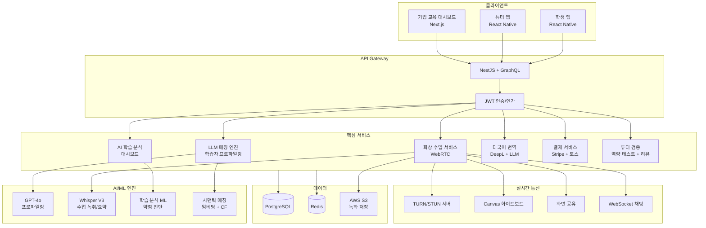
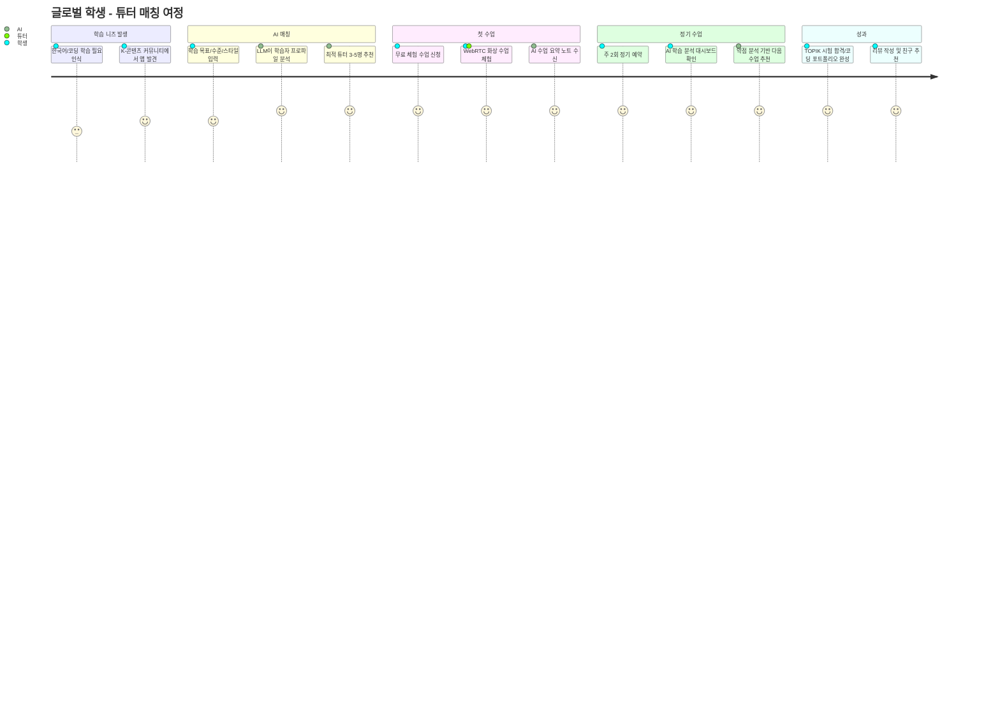
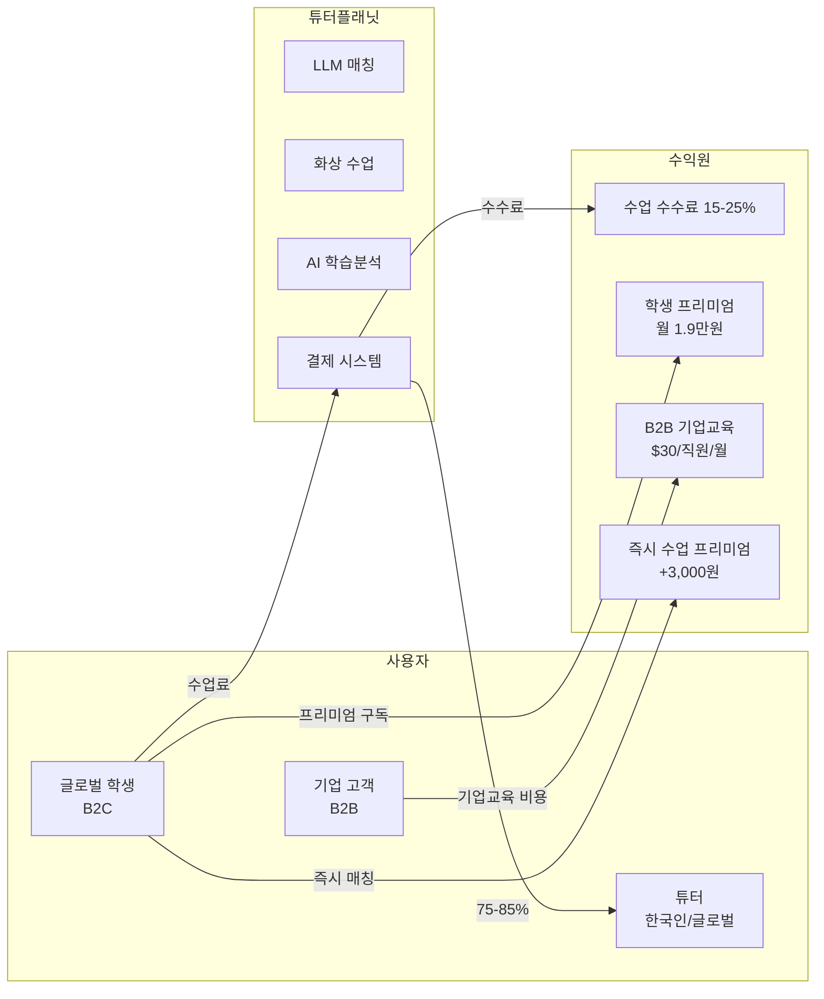
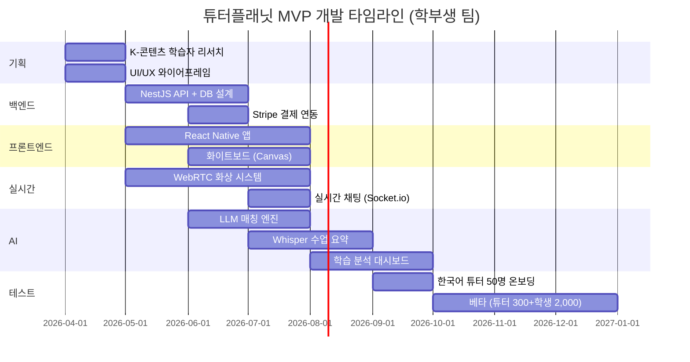

# 튜터플래닛 (TutorPlanet) — 글로벌 튜터-학생 매칭 플랫폼

> **예비창업패키지 사업계획서**
> 작성일: 2026년 3월
> 버전: 2.0 (Enhanced)

---

## □ 일반현황

| 항목 | 내용 |
|------|------|
| **창업아이템명** | 튜터플래닛 — AI 기반 글로벌 튜터-학생 1:1 매칭 플랫폼 |
| **산출물** | 웹 플랫폼 1개, 모바일 앱(iOS/Android) 1세트 |
| **직업(현재)** | 대학원 석사과정 (교육공학/소프트웨어공학 전공) |
| **기업예정명** | 주식회사 튜터플래닛 (TutorPlanet Inc.) |
| **팀 구성 현황** | 대표 1인 + 공동창업자 1인 + 외부 자문 2인 (교육공학 전문가, 에듀테크 업계 전문가) |

---

## □ 창업 아이템 개요(요약)

| 항목 | 내용 |
|------|------|
| **명칭** | 튜터플래닛 (TutorPlanet) |
| **범주** | 에듀테크(EdTech) / 글로벌 1:1 튜터링 매칭 플랫폼 (웹 + 앱) |

### 창업 아이템 개요

**튜터플래닛**은 전 세계의 튜터(교사·전문가)와 학생(학습자)을 AI로 매칭하는 **글로벌 1:1 튜터링 플랫폼**이다. italki가 "언어 학습"을, Preply가 "외국어 튜터링"을 증명했다면, 튜터플래닛은 **전 과목·전 연령·전 분야**로 확장한다. 수학, 코딩, 음악, 입시 컨설팅, 자격증, 취미까지 — "배우고 싶은 사람"과 "가르칠 수 있는 사람"을 지구 어디서든 연결한다. LLM이 학습자 프로파일링, 튜터 스타일 분석, 학습 경로 추천까지 수행하여 매칭 정확도를 극대화한다.

| 요약 항목 | 내용 |
|-----------|------|
| **문제인식** | 한국 사교육비 27.1조원(2024), 서울-지방 교육 격차 심화. 글로벌 IT인력 부족으로 코딩 교육 수요 폭증. 기존 튜터링은 지역 제한·가격 불투명·품질 불균일. 전 세계 "배우고 싶지만 가르쳐줄 사람을 못 찾는" 학습자 수십억명 |
| **실현가능성** | LLM 학습자 프로파일링, 튜터 스타일 분석 AI, WebRTC 화상 수업, AI 학습분석 대시보드, 다국어 실시간 번역. 6개월 MVP |
| **성장전략** | 한국어 교육(K-콘텐츠 수요) → 코딩·수학 → 전 과목. 아시아 → 글로벌. 수수료 15-25%. 3년 내 MAU 100만, 연매출 300억원 |
| **팀구성** | AI/풀스택 개발 대표 + 교육/운영 공동창업자 + 교육공학 자문 + 에듀테크 자문 |

---

## 1. 문제 인식 (Problem) — 창업 아이템의 필요성

### 1.0 문제 구조도

```
┌─────────────────────────────────────────────────────────────────────┐
│                     교육 불평등의 구조적 악순환                          │
├─────────────────────────────────────────────────────────────────────┤
│                                                                     │
│  ┌──────────────┐     ┌──────────────┐     ┌──────────────┐        │
│  │  지역 격차    │────►│  기회 불평등   │────►│  소득 양극화   │        │
│  │  (서울 vs 지방)│     │  (교육 접근성) │     │  (세대 재생산) │        │
│  └──────┬───────┘     └──────┬───────┘     └──────┬───────┘        │
│         │                    │                    │                 │
│         ▼                    ▼                    ▼                 │
│  ┌──────────────┐     ┌──────────────┐     ┌──────────────┐        │
│  │ 튜터 수급 불균형│     │ 가격 불투명   │     │ 품질 검증 불가 │        │
│  │ 지방: 튜터 부족│     │ 시간당 3~10만 │     │ 사전 평가 無  │        │
│  └──────┬───────┘     └──────┬───────┘     └──────┬───────┘        │
│         │                    │                    │                 │
│         └────────────────────┼────────────────────┘                 │
│                              ▼                                      │
│                 ┌────────────────────────┐                          │
│                 │  학습자: "배우고 싶지만  │                          │
│                 │  가르쳐줄 사람을 못 찾음" │                          │
│                 └────────────┬───────────┘                          │
│                              ▼                                      │
│              ┌──────────────────────────────┐                       │
│              │  ► 전 세계 6.17억 명 기초학력  │                       │
│              │    미달 (UNESCO, 2024)        │                       │
│              │  ► 한국 사교육비 27.1조원       │                       │
│              │  ► 소득별 교육비 격차 5.2배     │                       │
│              └──────────────────────────────┘                       │
│                              │                                      │
│                              ▼                                      │
│    ┌─────────────────────────────────────────────────────┐          │
│    │          ★ 튜터플래닛의 해법 ★                       │          │
│    │  AI 매칭 + 글로벌 튜터 풀 + 실시간 화상 + 학습분석    │          │
│    │  → 지역·소득·국경을 넘어 "누구나 최적의 튜터를 만남"   │          │
│    └─────────────────────────────────────────────────────┘          │
└─────────────────────────────────────────────────────────────────────┘
```

### 1.1 교육 격차: 글로벌 위기

UNESCO(2024)에 따르면, **전 세계 학령기 아동·청소년 6.17억 명이 기초 학력(읽기·수학) 미달** 상태이다. 선진국에서도 교육 격차는 심각하다:

| 국가 | 주요 교육 격차 문제 |
|------|-------------------|
| 한국 | 사교육비 27.1조원, 서울-지방 격차, 소득별 격차 (상위 20% 사교육비 5.2배) |
| 미국 | 튜터링 시간당 $40-100+, 저소득층 접근 불가, 교사 부족 30만명 |
| 일본 | 학원비 연간 ¥50만+, 지방 교육 인프라 부족 |
| 동남아 | 양질의 교사 절대 부족, 영어·코딩 교육 수요 폭증하나 인프라 미비 |

한국만 보면:
- **사교육비 27.1조원** (2024, 통계청) — 역대 최고
- **사교육 참여율 78.3%** — 중학생 77.4%, 고등학생 68.3%
- **서울 vs 읍면 사교육비 격차**: 월 52.9만원 vs 20.1만원 (2.6배)
- **소득 상위 20% vs 하위 20%**: 월 59.7만원 vs 11.5만원 (5.2배)

### 1.2 사회적 비용 분석 — 교육 불평등이 사회에 미치는 영향

교육 불평등은 단순히 "공부를 못하는 문제"가 아니다. 사회 전체에 막대한 비용을 발생시킨다.

| 사회적 비용 항목 | 연간 규모 (추정) | 설명 | 출처 |
|-----------------|----------------|------|------|
| **사교육비 과잉 지출** | 27.1조원 | 가계 가처분소득 잠식, 소비 위축 | 통계청 (2024) |
| **출산율 저하 간접 비용** | 측정 불가 (GDP 1-2% 추정) | 사교육비 부담이 출산 기피의 핵심 원인, 합계출산율 0.72명 | OECD (2024) |
| **청년 사교육 부채** | 약 3조원+ | 대학생 스펙 사교육(토익, 코딩), 취업준비 비용 | 한국직업능력연구원 |
| **지방 인재 유출** | 지방대학 정원 30% 미충원 | 교육 인프라 부족 → 수도권 집중 → 지방 소멸 가속 | 교육부 (2024) |
| **NEET 청년 사회비용** | 약 10조원+ | 학력·기술 격차로 인한 미취업, 사회적 고립 | 한국고용정보원 |
| **글로벌 학력 미달 손실** | $10T+ (세계 GDP 10%) | 6.17억명 기초학력 미달의 장기적 경제적 손실 | World Bank (2024) |
| **교사 부족 대응 비용** | 미국만 연 $2B+ | 대체교사, 교사 채용·훈련 비용 | McKinsey (2024) |

> **핵심 통찰**: 사교육비 27.1조원은 대한민국 국방예산(57조원)의 거의 절반이다. 이 비용을 효율적인 온라인 튜터링으로 30%만 절감해도 **연 8조원 이상의 사회적 가치**를 창출할 수 있다.

### 1.3 사회적 문제 공감대 형성

#### 실제 사례/스토리텔링

**사례 1: 전남 해남 중학생 정유진 (15세)**
읍 소재지에 사는 유진이는 수학 과외를 받고 싶지만, 동네에 과외 교사가 없다. 가장 가까운 학원은 차로 40분 거리인 목포에 있다. "서울 친구들은 학원도 많고 과외 선생님도 많은데, 저는 유튜브로 독학해요. 모르는 문제가 있어도 물어볼 사람이 없어요." 유진이의 부모님은 월 소득 280만원으로, 서울 학생 평균 사교육비(월 52.9만원)의 절반도 감당하기 어렵다.

**사례 2: 베트남 호치민 대학생 Nguyen Thi Mai (21세)**
K-드라마 팬인 Mai는 한국어를 배우고 싶지만, 호치민의 한국어 학원 수강료는 월 200만 VND(약 11만원)으로 현지 대학생에게 큰 부담이다. "한국 사람에게 직접 배우고 싶은데, 어떻게 연결해야 할지 모르겠어요. 온라인으로 저렴하게 1:1 수업을 받을 수 있다면 정말 좋겠어요."

**사례 3: 서울 강남 학부모 최미영 씨 (43세)**
초등학생 아들의 코딩 과외를 구하려는 최미영 씨는 맘카페에 글을 올린 지 3주째 적합한 선생님을 찾지 못했다. "시간당 5만원~8만원인데 수업 퀄리티를 미리 알 수 없어요. 한 번 미스매칭되면 또 처음부터 찾아야 해서 시간도 돈도 낭비예요."

#### 통계의 인간적 해석

- **사교육비 27.1조원**: 이는 대한민국 국방예산(57조원)의 거의 절반에 달하는 금액이다. 부모들이 자녀 교육을 위해 매년 나라를 지키는 비용의 절반을 쓰고 있다는 의미다.
- **서울-읍면 사교육비 2.6배 격차**: 같은 나라에서 태어났지만, 어디에 사느냐에 따라 교육 기회가 2.6배 차이 나는 구조적 불평등이다. 이는 "노력하면 된다"는 말이 성립하지 않는 현실을 보여준다.
- **전 세계 6.17억 명 기초학력 미달**: 지구상의 아동·청소년 4명 중 1명이 기본적인 읽기와 수학조차 제대로 배우지 못하고 있다. 양질의 교사가 부족한 개발도상국에서 온라인 튜터링은 교육 불평등 해소의 현실적 해답이 될 수 있다.

#### 해외 성공 사례로 문제 해결 가능성 입증

- **Preply($1.3B 기업가치)**: 180개국에서 튜터-학생 1:1 매칭으로 언어 장벽을 넘어 교육을 민주화했다. 개발도상국 학생도 미국·영국 원어민 튜터에게 합리적 가격으로 영어를 배울 수 있음을 입증.
- **italki(10M+ 학생)**: 150개 이상의 언어를 가르치는 글로벌 플랫폼으로, 한국어 학습자 수가 K-콘텐츠 열풍과 함께 폭증 중. 언어 교육의 글로벌 수요가 실재함을 입증.
- **Cambly(130개국)**: "버튼 하나로 즉시 원어민과 연결"이라는 단순한 UX로 높은 리텐션을 달성. 접근성이 교육의 핵심임을 보여줌.

### 1.4 기존 튜터링의 한계 (구조적 문제)

| 문제 | 설명 |
|------|------|
| **지역 제한** | 대면 과외는 지역에 묶임 → 지방·소도시 학생은 양질의 튜터 접근 불가 |
| **가격 불투명** | 동일 과목인데 튜터마다 시간당 3-10만원 차이, 적정가 판단 불가 |
| **품질 불균일** | 대학생 과외의 실력·교수법 편차 극심, 사전 검증 방법 없음 |
| **매칭 비효율** | 지인 소개·맘카페 글 → 매칭까지 1-3주, 미스매칭 빈번 |
| **학습 관리 부재** | 수업 후 피드백·진도 관리 없음, 학습 성과 추적 불가 |

### 1.5 글로벌 온라인 튜터링 시장

| 시장 구분 | 2024-2025년 | 2030년 (전망) | CAGR |
|-----------|-------------|---------------|------|
| 글로벌 온라인 튜터링 시장 | $12.1B (2024) | $31.5B | 17.3% |
| 글로벌 에듀테크 시장 | $340B (2024) | $738B | 13.8% |
| 글로벌 언어 학습 시장 | $67B (2024) | $115B | 9.4% |
| 한국 사교육 시장 | 약 27.1조원 (2024) | 약 35조원 | 4.4% |
| 한국 온라인 교육 시장 | 약 8조원 (2024) | 약 15조원 | 11.0% |

> 출처: Grand View Research (2024), HolonIQ (2025), 통계청 (2024)

### 1.6 시장 기회 TAM/SAM/SOM

```
┌─────────────────────────────────────────────────────────────────┐
│                                                                 │
│                    TAM: $352B (글로벌 에듀테크)                   │
│           ┌─────────────────────────────────────────┐           │
│           │                                         │           │
│           │        SAM: $79B (온라인 1:1 튜터링      │           │
│           │              + 언어 학습)                │           │
│           │     ┌─────────────────────────┐         │           │
│           │     │                         │         │           │
│           │     │   SOM: $2B              │         │           │
│           │     │   (아시아-글로벌 간      │         │           │
│           │     │    한국어·코딩·수학      │         │           │
│           │     │    온라인 튜터링)        │         │           │
│           │     │                         │         │           │
│           │     │  ► K-콘텐츠 한국어 수요  │         │           │
│           │     │  ► 아시아 코딩 교육 수요 │         │           │
│           │     │  ► 온라인 전환율 추정    │         │           │
│           │     └─────────────────────────┘         │           │
│           │                                         │           │
│           │  ► 온라인 튜터링 $12.1B                  │           │
│           │  ► 언어 학습 $67B                        │           │
│           └─────────────────────────────────────────┘           │
│                                                                 │
│  ► 에듀테크 $340B + 온라인 튜터링 $12.1B                        │
│  ► CAGR 13.8~17.3% (2024-2030)                                │
└─────────────────────────────────────────────────────────────────┘
```

| 구분 | 정의 | 규모 | 산출 근거 |
|------|------|------|----------|
| **TAM** (전체시장) | 글로벌 온라인 튜터링 + 에듀테크 시장 | **$352B** (2024) | 온라인 튜터링 $12.1B + 에듀테크 $340B (Grand View Research, HolonIQ, 2024) |
| **SAM** (유효시장) | 글로벌 온라인 1:1 튜터링 + 언어 학습 시장 | **약 $79B** (2024) | 온라인 튜터링 $12.1B + 언어 학습 $67B |
| **SOM** (수익시장) | 아시아-글로벌 간 한국어·코딩·수학 온라인 튜터링 | **약 $2B** | K-콘텐츠 한국어 학습 수요 + 아시아 코딩 교육 수요, 온라인 전환율 추정 |

#### 글로벌 vs 국내 시장 비교

| 비교 항목 | 글로벌 | 한국 | 시사점 |
|-----------|--------|------|--------|
| 온라인 튜터링 시장 CAGR | 17.3% | 11.0% (온라인 교육) | 글로벌 성장률이 한국보다 높아 글로벌 확장 시 더 큰 기회 |
| 사교육비 규모 | 미국 $60B+, 일본 $15B+ | 27.1조원 (약 $20B) | 한국 인구 대비 사교육 지출 세계 최고 수준 → 온라인 전환 수요 존재 |
| 튜터 수급 | Preply 35,000+, italki 30,000+ | 김과외 등 수만 명 (국내 한정) | 글로벌 튜터 풀은 충분, 한국 튜터의 글로벌 진출 기회 |
| 한국어 학습 수요 | TOPIK 응시자 47만명+, 세종학당 20만명+ | — | 한국어 튜터링은 한국 플랫폼만의 독보적 경쟁우위 |
| 1:1 튜터링 시간당 비용 | $15-80 (Preply 기준) | 3-10만원 | 동남아·남미 학생에게 한국인 튜터 시급은 합리적 |

### 1.7 성공 사례 분석

#### Preply (미국/우크라이나, 2012~)
- **누적 투자**: $550M+ (기업가치 $1.3B, 유니콘)
- **핵심**: 외국어 튜터-학생 1:1 매칭 플랫폼, 50+ 과목
- **성과**: 180개국 운영, 튜터 35,000+, 학생 수백만 명, 연 매출 $200M+
- **수익모델**: 튜터 수수료 33% (첫 수업) + 18% (이후), B2B 기업 어학교육
- **시사점**: 1:1 튜터 매칭이 글로벌 스케일로 성장 가능, B2B가 핵심 수익 부스터

#### italki (중국/미국, 2007~)
- **기업가치**: $1B+ (유니콘)
- **핵심**: 세계 최대 언어 학습 매칭 플랫폼 — 원어민 튜터와 학습자 직접 연결
- **성과**: 150+ 언어, 튜터 30,000+, 학생 10M+
- **수익모델**: 튜터 수수료 15% + 프리미엄 구독
- **시사점**: 언어 학습 특화로 시작 → 전 과목 확장 가능성. 한국어 학습 수요 폭증 (K-콘텐츠 효과)

#### Cambly (미국, 2012~)
- **누적 투자**: $100M+
- **핵심**: 영어 회화 원어민 튜터 매칭, "버튼 하나로 즉시 연결"
- **성과**: 130개국, 튜터 10,000+, 특히 중동·아시아에서 강세
- **차별점**: 즉시 매칭(예약 불필요), 모바일 퍼스트
- **시사점**: "즉시 연결" UX가 사용자 리텐션의 핵심

#### Wyzant (미국, 2005~)
- **핵심**: 미국 최대 튜터 마켓플레이스, 전 과목 (수학, 과학, 음악, 시험준비 등)
- **성과**: 튜터 65,000+, 누적 1,300만 시간+ 수업
- **수익모델**: 튜터 수수료 25%
- **시사점**: 언어 외 전 과목 튜터링 마켓플레이스의 시장성 검증

#### 김과외 / 튜터링 (한국)
- **김과외**: 대면+화상 과외 매칭, 누적 투자 약 50억원
- **튜터링**: 영어 회화 특화, 필리핀 튜터 중심
- **한계**: 김과외 — 국내 한정, AI 매칭 미흡. 튜터링 — 영어만, 품질 편차
- **시사점**: 한국 시장 수요 검증, 글로벌 확장 및 AI 고도화 기회

### 1.8 해외 사례 비교 도표

| 비교 항목 | Preply | italki | Cambly | Wyzant | 김과외 | **튜터플래닛** |
|-----------|--------|--------|--------|--------|--------|-------------|
| **설립** | 2012 | 2007 | 2012 | 2005 | 2016 | **2026** |
| **기업가치** | $1.3B | $1B+ | $500M+ | 비상장 | ~100억원 | **Pre-Seed** |
| **과목 범위** | 50+ 과목 | 언어만 | 영어만 | 전 과목 | 전 과목(국내) | **전 과목(글로벌)** |
| **시장 범위** | 글로벌 180국 | 글로벌 | 글로벌 130국 | 미국 중심 | 한국 | **한국→글로벌** |
| **AI 매칭** | 기본 필터 | 기본 필터 | 즉시 랜덤 | 검색 기반 | 기본 필터 | **LLM 프로파일링** |
| **학습 분석** | 없음 | 없음 | 없음 | 없음 | 없음 | **AI 대시보드** |
| **실시간 번역** | 없음 | 없음 | 없음 | 없음 | 없음 | **15개 언어** |
| **한국어 특화** | 미흡 | 일부 | 없음 | 없음 | 해당없음 | **K-콘텐츠 커리큘럼** |
| **즉시 매칭** | 예약제 | 예약제 | 즉시 | 예약제 | 예약제 | **예약+즉시 혼합** |
| **수수료** | 18-33% | 15% | 구독제 | 25% | 10-15% | **15-25%** |
| **B2B** | 기업 어학교육 | 없음 | 없음 | 없음 | 없음 | **기업교육 패키지** |
| **튜터 교육** | 없음 | 없음 | 없음 | 없음 | 없음 | **AI 교수법 코칭** |

### 1.9 사용자 구매동인(Purchase Motivation) 분석

#### 기능적 동인

| 동인 | 학생 (B2C) | 기업 (B2B) |
|------|-----------|-----------|
| **시간 절약** | 이동 없이 집에서 수업, AI 매칭으로 튜터 탐색 시간 1-3주 → 즉시 | 직원 교육 일정 조율 자동화, 전사적 교육 프로그램 원클릭 운영 |
| **비용 절감** | 글로벌 튜터 풀로 가격 경쟁 → 대면 과외 대비 30-50% 저렴 가능 | 어학원 위탁 대비 1/3 비용으로 맞춤형 기업교육 가능 |
| **편의성** | 예약+즉시 하이브리드로 필요할 때 바로 수업, 시차 활용 심야·새벽 수업 가능 | 대시보드에서 직원별 학습 진도·성과 일괄 관리 |
| **품질 보장** | AI 학습분석 대시보드로 약점 파악·개선, 녹화 복습, 튜터 역량 검증 | 튜터 품질 스코어 기반 선별, 학습 성과 데이터 제공 |

#### 감정적 동인

| 동인 | 설명 |
|------|------|
| **불안 해소** | "과외 선생님 실력이 괜찮을까?" → AI 역량 테스트 + 리뷰 + 스타 튜터 배지로 불안 해소. 첫 수업 무료 체험으로 위험 부담 제거 |
| **신뢰감** | 튜터 프로필·경력·자격·학생 리뷰 투명 공개. "이 튜터는 같은 시험을 준비한 경험이 있다"는 매칭 사유가 신뢰 형성 |
| **성취감** | AI 학습분석 대시보드: 주간 성장 그래프, 약점 극복 기록, "이번 주 수학 정확도 78% → 89%" 시각화 → 학습 동기 강화 |
| **소통의 기쁨** | K-드라마 팬이 한국인 튜터에게 직접 한국어를 배우는 감동. "좋아하는 드라마 대사를 직접 이해할 수 있게 됐다!" |

#### 사회적 동인

| 동인 | 설명 |
|------|------|
| **소속감** | 같은 시험(TOPIK, SAT)을 준비하는 글로벌 스터디 그룹, 튜터-학생 장기 관계에서 오는 학습 커뮤니티 소속감 |
| **사회적 인정** | "나는 글로벌 튜터에게 직접 배운다"는 자부심. 학습 성과 SNS 공유 (배지·인증서). 튜터에게는 "전 세계 학생을 가르친다"는 전문가 정체성 |
| **트렌드** | K-콘텐츠 학습 열풍에 동참, "오징어게임 보고 한국어 배우기 시작" 트렌드. 코딩 교육의 글로벌 필수화 흐름 |

### 1.10 페르소나 심층 분석 (3명)

#### 페르소나 A: "K-드라마 한국어 학습자" — Yuki Tanaka (19세, 도쿄 대학생)

```
┌──────────────────────────────────────────────────────┐
│  페르소나 A: Yuki Tanaka (19세, 도쿄)                 │
├──────────────────────────────────────────────────────┤
│  직업: 대학생 (문학부)                                │
│  월 소득: 아르바이트 ¥80,000                          │
│  교육 예산: 월 ¥15,000 (약 $100)                     │
│  학습 목표: TOPIK 3급 합격, 일상 회화                  │
│  동기: BTS·K-드라마 팬, 한국 교환학생 준비             │
│  Pain Point: 도쿄 한국어 학원 월 ¥30,000+ (비쌈)     │
│             원어민과 대화 연습할 기회 부족              │
│  선호: 일본어 가능한 한국인 튜터, 주 2회, 저녁 시간    │
│  기대 결과: 6개월 내 TOPIK 3급, 한국 여행 시 프리토킹  │
└──────────────────────────────────────────────────────┘
```

| 단계 | 행동 | 감정 | 튜터플래닛 접점 |
|------|------|------|---------------|
| 인지 | BTS 팬으로 한국어를 독학하다가 한계 느낌, 인스타에서 튜터플래닛 광고 발견 | "한국 사람에게 직접 배우고 싶다!" 열망 | K-POP 팬덤 커뮤니티 광고 |
| 탐색 | 앱 다운로드, 한국어 튜터 프로필 탐색, 무료 체험 수업 신청 | "이 튜터는 일본어도 할 줄 아는 한국인이네!" 안심 | 튜터 프로필, 언어 필터, 무료 체험 |
| 구매 | 주 2회 한국어 수업 정기 예약 (시간당 $18) | "학원보다 싸고 1:1이라 집중이 잘 된다" 만족 | 시차 최적화 스케줄링, 정기 예약 할인 |
| 재구매 | 3개월 패키지 구매, TOPIK 시험 대비 집중반 추가 | "3개월 만에 기초 회화가 되다니!" 성취 | AI 학습 분석, TOPIK 맞춤 커리큘럼 |
| 추천 | 대학 K-문화 동아리에 추천, SNS에 학습 성과 공유 | "친구들도 같이 배우자!" 소속감 | 초대 리워드, 그룹 수업 |

#### 페르소나 B: "코딩 입문자" — 김도현 (28세, 서울, 비전공 직장인)

```
┌──────────────────────────────────────────────────────┐
│  페르소나 B: 김도현 (28세, 서울)                       │
├──────────────────────────────────────────────────────┤
│  직업: 마케팅 대리 (IT기업 3년차)                      │
│  월 소득: 320만원                                     │
│  교육 예산: 월 30만원                                  │
│  학습 목표: Python → Django 웹개발, 이직 준비           │
│  동기: 개발자 전직, 현업 개발자에게 실무 노하우 배우기   │
│  Pain Point: 독학 3개월째 진도 정체, 에러 해결에 수시간  │
│             코딩 학원은 1:多, 맞춤 피드백 부족          │
│  선호: 현업 시니어 개발자 튜터, 주 2회, 프로젝트 기반   │
│  기대 결과: 6개월 내 포트폴리오 3개, 개발자 이직 성공   │
└──────────────────────────────────────────────────────┘
```

| 단계 | 행동 | 감정 | 튜터플래닛 접점 |
|------|------|------|---------------|
| 인지 | 이직을 위해 Python 학습 필요, 독학 3개월째 진도 정체 | "혼자 공부하니 막히는 부분을 넘기기 어렵다" 답답 | 직장인 자기계발 콘텐츠, 블로그·유튜브 |
| 탐색 | "코딩 과외" 검색, 튜터플래닛에서 실무 경험 있는 시니어 개발자 튜터 발견 | "현업 개발자에게 직접 배울 수 있다니!" 기대 | LLM 자연어 검색, 튜터 실무경력 필터 |
| 구매 | 6주 익스프레스 코딩 부트캠프 등록 (주 2회, 시간당 4만원) | "궁금한 거 바로 물어볼 수 있어서 진도가 빠르다" 효율 | 구조화된 6주 프로그램 |
| 재구매 | 12주 심화 (Django 웹 개발) 등록, 포트폴리오 프로젝트 멘토링 | "포트폴리오까지 완성했다!" 성취감 | AI 학습 경로 추천, 프로젝트 기반 수업 |

#### 페르소나 C: "글로벌 기업 HR 담당자" — Sarah Chen (35세, 싱가포르)

```
┌──────────────────────────────────────────────────────┐
│  페르소나 C: Sarah Chen (35세, 싱가포르)               │
├──────────────────────────────────────────────────────┤
│  직업: 다국적 기업 HR Manager                          │
│  월 예산: 직원 교육 SGD $50,000/월                     │
│  교육 대상: APAC 직원 200명 (한국·일본·베트남 법인)     │
│  학습 목표: 직원 비즈니스 영어, 한국어 기초, 코딩 리터러시│
│  동기: 기업 내 다국어·디지털 역량 표준화                 │
│  Pain Point: 각 국가별 어학원 개별 계약 → 관리 복잡      │
│             학습 성과 측정 어려움, ROI 입증 필요          │
│  선호: 기업 대시보드, 직원별 학습 리포트, 일괄 정산       │
│  기대 결과: 직원 영어 TOEIC 평균 50점 향상, 관리비 40% 절감│
└──────────────────────────────────────────────────────┘
```

| 단계 | 행동 | 감정 | 튜터플래닛 접점 |
|------|------|------|---------------|
| 인지 | 기업 교육 ROI 향상 필요, LinkedIn에서 TutorPlanet B2B 솔루션 발견 | "각국 어학원 따로 관리하기 너무 복잡하다" 피로감 | B2B 타겟 LinkedIn 광고, 사례 연구 |
| 탐색 | 기업용 데모 신청, 대시보드 기능 평가, 경쟁사 대비 비용 비교 | "한 플랫폼에서 전 APAC 직원 교육을 관리할 수 있다니" 기대 | 기업용 데모, ROI 시뮬레이터 |
| 도입 | 50명 파일럿 도입 (3개월, $30/직원/월) | "직원들이 유연하게 수업을 잡으니 참여율이 높다" 만족 | 파일럿 프로그램, 온보딩 매니저 |
| 확대 | 200명 전체 도입, 연간 계약 ($28/직원/월, 볼륨 할인) | "학습 리포트가 경영진 보고에 바로 활용된다" 효율 | 기업 대시보드, 맞춤 리포트 |

### 1.11 한국어 교육: K-콘텐츠가 만든 블루오션

**한국어 학습 수요 폭증**:
- 세종학당 수강생: 2019년 76,000명 → 2024년 200,000명+ (163% 증가)
- Duolingo 한국어 학습자: 2024년 전년 대비 40% 증가 (가장 빠르게 성장하는 언어 중 하나)
- TOPIK 응시자: 2023년 47만명 (역대 최고)
- 배경: BTS, 블랙핑크, 오징어게임, K-드라마 글로벌 인기

이 수요를 한국인 튜터와 연결하면, 한국 플랫폼만의 강력한 경쟁 우위가 된다.

### 1.12 시장 기회 (Gap 분석)

| 구분 | Preply | italki | Cambly | 김과외 | **튜터플래닛** |
|------|--------|--------|--------|-------|-------------|
| 과목 | 50+ 과목 | 언어만 | 영어만 | 전 과목 (국내) | **전 과목 (글로벌)** |
| 시장 | 글로벌 | 글로벌 | 글로벌 | 한국 | **한국 → 글로벌** |
| AI 매칭 | 기본 필터 | 기본 필터 | 즉시 랜덤 | 기본 | **LLM 학습자 프로파일링** |
| 학습 분석 | 없음 | 없음 | 없음 | 없음 | **AI 학습 대시보드** |
| 한국어 특화 | 미흡 | 일부 | 없음 | 해당없음 | **K-콘텐츠 한국어 교육** |
| 즉시 매칭 | 예약제 | 예약제 | 즉시 | 예약제 | **예약 + 즉시 혼합** |

---

## 2. 실현 가능성 (Solution) — 창업 아이템의 개발 계획

### 2.1 서비스 아키텍처

```
┌─────────────────────────────────────────────────────────────────────┐
│                        튜터플래닛 서비스 아키텍처                      │
├─────────────────────────────────────────────────────────────────────┤
│                                                                     │
│  ┌─────────────┐  ┌─────────────┐  ┌─────────────┐                │
│  │   학생 앱    │  │   튜터 앱    │  │  기업 대시보드 │                │
│  │ (React Native)│ │ (React Native)│ │  (Next.js)   │                │
│  └──────┬──────┘  └──────┬──────┘  └──────┬──────┘                │
│         │                │                │                         │
│         └────────────────┼────────────────┘                         │
│                          ▼                                          │
│  ┌─────────────────────────────────────────────────────────┐       │
│  │              API Gateway (NestJS + GraphQL)              │       │
│  │              ├─ JWT 인증/인가                             │       │
│  │              ├─ Rate Limiting                            │       │
│  │              └─ Request Routing                          │       │
│  └──────────────────────┬──────────────────────────────────┘       │
│                          │                                          │
│    ┌─────────┬──────────┼──────────┬──────────┬─────────┐          │
│    ▼         ▼          ▼          ▼          ▼         ▼          │
│ ┌───────┐┌───────┐┌─────────┐┌────────┐┌────────┐┌────────┐      │
│ │ 매칭   ││ 화상   ││ 학습    ││ 번역   ││ 결제   ││ 튜터   │      │
│ │ 엔진   ││ 수업   ││ 분석    ││ 서비스  ││ 서비스  ││ 검증   │      │
│ │       ││       ││         ││        ││        ││        │      │
│ │ LLM   ││WebRTC ││ ML     ││ DeepL  ││Stripe ││ AI    │      │
│ │프로파일││TURN/  ││대시보드 ││ +LLM  ││+토스  ││역량   │      │
│ │  링   ││STUN   ││        ││        ││        ││테스트  │      │
│ └───┬───┘└───┬───┘└───┬────┘└───┬────┘└───┬────┘└───┬────┘      │
│     │        │        │         │         │         │             │
│     └────────┴────────┼─────────┴─────────┴─────────┘             │
│                       ▼                                             │
│  ┌─────────────────────────────────────────────────────────┐       │
│  │                   데이터 계층                             │       │
│  │  ┌──────────┐  ┌──────────┐  ┌──────────┐               │       │
│  │  │PostgreSQL│  │  Redis   │  │  AWS S3  │               │       │
│  │  │(사용자,  │  │(세션,    │  │(녹화,    │               │       │
│  │  │ 수업,매칭)│  │ 캐시)    │  │ 자료)    │               │       │
│  │  └──────────┘  └──────────┘  └──────────┘               │       │
│  └─────────────────────────────────────────────────────────┘       │
└─────────────────────────────────────────────────────────────────────┘
```

### 2.2 핵심 기능

#### 1) LLM 기반 학습자 프로파일링 & 튜터 매칭
- 학습자: 목표 (시험 준비, 실력 향상, 취미), 현재 수준, 학습 스타일 (시각형/청각형/실습형), 선호 시간대·예산
- 튜터: 전문 분야, 교수 스타일, 경력, 리뷰, 가용 시간
- LLM이 양측의 서술형 프로필을 시맨틱 분석하여 **학습 목표-교수 스타일 호환도** 스코어 산출
- "수학 개념을 시각적으로 설명해주는 인내심 있는 튜터" 같은 자연어 검색 가능

#### 2) 화상 수업 + AI 학습 분석
- WebRTC 기반 고품질 화상 수업 (화면 공유, 화이트보드, 파일 공유)
- 수업 녹화 + AI 자동 요약 (Whisper STT → LLM 요약)
- AI 학습 분석 대시보드: 수업 참여도, 이해도 추적, 약점 분석
- 학습 경로 AI 추천: "다음에 이 개념을 공부하면 좋겠습니다"

#### 3) 다국어 실시간 번역
- 튜터-학생 간 언어가 다를 때 실시간 자막 번역
- 채팅 자동 번역
- 수업 요약 노트 다국어 자동 생성

#### 4) 즉시 + 예약 하이브리드 매칭
- **예약 매칭**: 정기 수업 스케줄링 (주 2회 등)
- **즉시 매칭**: "지금 바로 수학 질문 있어요" → 대기 중 튜터 즉시 연결 (Cambly식)
- 시차 최적화: 학생-튜터 시간대 자동 조율

#### 5) 튜터 검증 & 성장
- AI 역량 테스트 (과목별 퀴즈 + 모의 수업 평가)
- 교수법 교육 프로그램 (온라인 코스)
- 리뷰 + AI 품질 스코어 → 상위 튜터 "스타 튜터" 배지
- 튜터 수익 대시보드 (월별 수입, 수업 통계, 리뷰 분석)

#### 6) 그룹 수업 & 스터디룸
- 1:1 외에 1:3, 1:5 소그룹 수업 지원 (단가 낮춤)
- 학생들끼리 스터디 그룹 매칭 (peer learning)

### 2.3 AI 모델 개발 로드맵

| 모델 | 목적 | 기술 스택 | 개발 단계 | 데이터 요구사항 | 성능 목표 |
|------|------|----------|----------|---------------|----------|
| **학습자 프로파일링 LLM** | 학습 목표·수준·스타일 자동 분류 | GPT-4o API + 프롬프트 엔지니어링 | MVP (2026.Q2) | 학습자 설문 1,000건+ | 분류 정확도 85%+ |
| **시맨틱 매칭 엔진** | 학습자-튜터 호환도 스코어 산출 | Sentence-BERT + pgvector + CF | MVP (2026.Q3) | 매칭 피드백 5,000건+ | 매칭 만족도 80%+ |
| **수업 요약 AI** | 수업 녹취 → 핵심 요약 노트 생성 | Whisper V3 + GPT-4o | Beta (2026.Q4) | 수업 녹화 500건+ | 요약 품질 4.0/5.0+ |
| **학습 분석 ML** | 약점 진단, 학습 경로 추천 | XGBoost + LSTM, 학습 로그 | v1.0 (2027.Q1) | 학습 로그 10,000건+ | 예측 정확도 75%+ |
| **실시간 번역 모델** | 교육 도메인 특화 번역 | DeepL API + 교육용어 파인튜닝 | v1.0 (2027.Q1) | 교육 코퍼스 100K+ | BLEU 40+ |
| **튜터 품질 스코어** | 튜터 교수 역량 자동 평가 | NLP 감성분석 + 수업 메트릭 | v1.5 (2027.Q2) | 리뷰 10,000건+ | 평가 상관계수 0.8+ |
| **AI 튜터 보조** | 연습문제 자동 출제, 피드백 | GPT-4o 파인튜닝 | v2.0 (2028.Q1) | 교과 콘텐츠 50K+ | 학습 효과 20%+ 향상 |

### 2.4 시스템 아키텍처 (Layered)

```
┌─────────────────────────────────────────────────────────────────────┐
│ Layer 1: Presentation (프레젠테이션 계층)                             │
├─────────────────────────────────────────────────────────────────────┤
│  ┌────────────┐  ┌────────────┐  ┌────────────┐  ┌────────────┐   │
│  │ 학생 앱    │  │ 튜터 앱    │  │ 기업 대시보드│  │ 관리자 패널 │   │
│  │ React      │  │ React      │  │ Next.js    │  │ Next.js    │   │
│  │ Native     │  │ Native     │  │            │  │            │   │
│  └─────┬──────┘  └─────┬──────┘  └─────┬──────┘  └─────┬──────┘   │
├────────┼───────────────┼───────────────┼───────────────┼──────────┤
│ Layer 2: API Gateway (API 게이트웨이 계층)                           │
├────────┼───────────────┼───────────────┼───────────────┼──────────┤
│        └───────────────┴───────────────┴───────────────┘           │
│                              ▼                                      │
│  ┌─────────────────────────────────────────────────────────────┐   │
│  │  NestJS + GraphQL    │  JWT Auth  │  Rate Limiter  │  CDN   │   │
│  └──────────────────────┴────────────┴────────────────┴────────┘   │
├─────────────────────────────────────────────────────────────────────┤
│ Layer 3: Business Logic (비즈니스 로직 계층)                          │
├─────────────────────────────────────────────────────────────────────┤
│  ┌──────────┐ ┌──────────┐ ┌──────────┐ ┌──────────┐ ┌──────────┐│
│  │매칭 서비스│ │수업 서비스│ │분석 서비스│ │결제 서비스│ │알림 서비스││
│  │(Matching)│ │(Lesson)  │ │(Analytics│ │(Payment) │ │(Notify)  ││
│  │          │ │          │ │         )│ │          │ │          ││
│  └────┬─────┘ └────┬─────┘ └────┬─────┘ └────┬─────┘ └────┬─────┘│
├───────┼────────────┼────────────┼────────────┼────────────┼──────┤
│ Layer 4: AI/ML Engine (인공지능 계층)                                │
├───────┼────────────┼────────────┼────────────┼────────────┼──────┤
│       ▼            ▼            ▼            │            │       │
│  ┌──────────┐ ┌──────────┐ ┌──────────┐    │            │       │
│  │GPT-4o    │ │Whisper V3│ │학습분석ML│    │            │       │
│  │프로파일링 │ │녹취/요약 │ │약점 진단 │    │            │       │
│  └──────────┘ └──────────┘ └──────────┘    │            │       │
│  ┌──────────┐ ┌──────────┐                  │            │       │
│  │시맨틱매칭 │ │DeepL번역 │                  │            │       │
│  │임베딩+CF │ │+파인튜닝 │                  │            │       │
│  └──────────┘ └──────────┘                  │            │       │
├─────────────────────────────────────────────┼────────────┼──────┤
│ Layer 5: Real-time Communication (실시간 통신 계층)                   │
├─────────────────────────────────────────────────────────────────────┤
│  ┌──────────┐ ┌──────────┐ ┌──────────┐ ┌──────────┐              │
│  │WebRTC    │ │TURN/STUN │ │Canvas    │ │WebSocket │              │
│  │화상통화  │ │미디어서버 │ │화이트보드│ │채팅/알림 │              │
│  └──────────┘ └──────────┘ └──────────┘ └──────────┘              │
├─────────────────────────────────────────────────────────────────────┤
│ Layer 6: Data & Infrastructure (데이터 및 인프라 계층)                │
├─────────────────────────────────────────────────────────────────────┤
│  ┌──────────┐ ┌──────────┐ ┌──────────┐ ┌──────────┐ ┌──────────┐│
│  │PostgreSQL│ │  Redis   │ │  AWS S3  │ │CloudFront│ │   EKS    ││
│  │ (RDS)    │ │ (캐시)   │ │ (스토리지)│ │ (CDN)    │ │(컨테이너)││
│  └──────────┘ └──────────┘ └──────────┘ └──────────┘ └──────────┘│
└─────────────────────────────────────────────────────────────────────┘
```

### 2.5 기술 스택

| 구분 | 기술 |
|------|------|
| **프론트엔드** | Next.js (웹), React Native (앱) |
| **백엔드** | Node.js + NestJS, PostgreSQL, Redis |
| **화상** | WebRTC (자체 TURN/STUN 서버), 화이트보드 (Canvas API) |
| **AI/ML** | LLM 프로파일링 (GPT-4o), Whisper (수업 녹취), 학습 분석 ML |
| **번역** | DeepL API + 자체 교육용어 파인튜닝 |
| **결제** | Stripe Connect (글로벌), 토스페이먼츠 (한국) |
| **인프라** | AWS (EKS, RDS, S3, CloudFront), Vercel |
| **알림** | Firebase, 카카오 알림톡, 이메일 (SendGrid) |

### 2.6 사용자 흐름 (User Flow)

```
┌────────────────────────────────────────────────────────────────────┐
│                    학생 사용자 흐름 (Student Flow)                   │
├────────────────────────────────────────────────────────────────────┤
│                                                                    │
│  ┌──────────┐    ┌──────────┐    ┌──────────┐    ┌──────────┐    │
│  │ 1. 회원가입│───►│ 2. 프로필 │───►│ 3. AI     │───►│ 4. 튜터   │    │
│  │  (SNS/    │    │  작성     │    │  프로파일링│    │  추천 3~5 │    │
│  │   이메일)  │    │  학습목표 │    │  스타일   │    │  명 매칭   │    │
│  └──────────┘    │  현재수준 │    │  수준분석  │    └─────┬────┘    │
│                  │  예산     │    └──────────┘          │          │
│                  └──────────┘                           ▼          │
│                                                  ┌──────────┐     │
│                                                  │ 5. 무료    │     │
│                                                  │  체험 수업  │     │
│                                                  └─────┬────┘     │
│                                                        │          │
│              ┌─────────────────────────────────────────┤          │
│              │                                         │          │
│              ▼                                         ▼          │
│  ┌──────────────────┐                      ┌──────────────────┐  │
│  │ 6a. 즉시 매칭     │                      │ 6b. 정기 예약     │  │
│  │ "지금 바로 질문"   │                      │ "주 2회 정기수업"  │  │
│  │ → 대기중 튜터 연결 │                      │ → 스케줄 설정     │  │
│  └────────┬─────────┘                      └────────┬─────────┘  │
│           │                                         │             │
│           └──────────────────┬──────────────────────┘             │
│                              ▼                                     │
│                   ┌──────────────────┐                             │
│                   │ 7. WebRTC 화상수업│                             │
│                   │  ├─ 화이트보드    │                             │
│                   │  ├─ 화면공유      │                             │
│                   │  ├─ 실시간 번역   │                             │
│                   │  └─ 수업 녹화     │                             │
│                   └────────┬─────────┘                             │
│                            ▼                                       │
│               ┌────────────────────────┐                           │
│               │ 8. 수업 후              │                           │
│               │  ├─ AI 수업요약 수신    │                           │
│               │  ├─ 튜터 리뷰 작성      │                           │
│               │  ├─ 학습분석 대시보드   │                           │
│               │  └─ 다음 수업 AI 추천   │                           │
│               └────────────┬───────────┘                           │
│                            ▼                                       │
│                ┌───────────────────────┐                            │
│                │ 9. 성과               │                            │
│                │  ├─ 시험 합격          │                            │
│                │  ├─ 포트폴리오 완성    │                            │
│                │  ├─ 학습 배지 획득     │                            │
│                │  └─ 친구 추천 리워드   │                            │
│                └───────────────────────┘                            │
└────────────────────────────────────────────────────────────────────┘
```

### 2.7 개발 일정

| 구분 | 추진 내용 | 추진 기간 | 세부 내용 |
|------|----------|----------|----------|
| 1 | MVP 개발 | 2026.04 ~ 2026.09 | 한국어 교육 + 코딩 튜터링, 화상 수업, 기본 매칭 |
| 2 | 베타 테스트 | 2026.10 ~ 2026.12 | 한국인 튜터 300명 + 글로벌 학생 2,000명 |
| 3 | 정식 출시 | 2027.01 | 수학·영어 추가, AI 학습분석, 즉시 매칭 |
| 4 | 스케일업 | 2027.01 ~ 2027.06 | 전 과목 확장, 그룹수업, B2B 기업교육 |

### 2.8 정부지원사업비 집행 계획

**< 1단계 (20백만원) >**

| 비목 | 산출 근거 | 금액(원) |
|------|----------|---------|
| 재료비 | AWS 인프라 + WebRTC 서버 6개월 | 10,000,000 |
| 외주용역비 | 화상 수업 UI/UX + 화이트보드 개발 | 6,000,000 |
| 지급수수료 | API 비용 (OpenAI, DeepL, Stripe) | 4,000,000 |
| **합계** | | **20,000,000** |

**< 2단계 (40백만원) >**

| 비목 | 산출 근거 | 금액(원) | 비율 |
|------|----------|---------|------|
| 인건비 | 프론트엔드 + AI 개발자 채용 6개월 | 26,000,000 | 65% |
| 마케팅 | 글로벌 학생 획득 (SNS, K-콘텐츠 커뮤니티) | 10,000,000 | 25% |
| 외주용역비 | 보안 점검 + 다국어 현지화 | 4,000,000 | 10% |
| **합계** | | **40,000,000** | 100% |

### 2.9 Pre-Seed 예산 계획 (5억원)

| 비목 | 세부 항목 | 금액 (만원) | 비율 | 비고 |
|------|----------|-----------|------|------|
| **인건비** | 개발팀 4명 (12개월) | 24,000 | 48% | CTO/백엔드, 프론트엔드, AI/ML, 풀스택 |
| **인건비** | 운영팀 2명 (12개월) | 8,400 | 17% | 튜터 온보딩 매니저, 마케팅 |
| **인프라** | AWS 클라우드 + API 비용 (12개월) | 4,800 | 10% | EKS, RDS, S3, OpenAI, DeepL |
| **마케팅** | 글로벌 학생 획득 (12개월) | 6,000 | 12% | SNS 광고, K-콘텐츠 커뮤니티, SEO |
| **외주** | UI/UX 디자인, 보안 점검 | 3,000 | 6% | 디자인 에이전시, 모의해킹 |
| **법무/회계** | 법인 설립, 글로벌 결제 법률 검토 | 1,800 | 4% | 개인정보 GDPR 대응 포함 |
| **기타** | 사무실, 장비, 예비비 | 2,000 | 4% | 공유오피스 + 맥북/모니터 |
| **합계** | | **50,000** | **100%** | |

---

## 3. 성장전략 (Scale-up) — 사업화 추진 전략

### 3.1 비즈니스 모델

| 수익원 | 설명 | 목표 비중 |
|--------|------|----------|
| **수업 수수료** | 수업료의 15-25% (튜터 부담) | 55% |
| **학생 프리미엄** | AI 학습분석, 녹화 무제한, 학습경로 (월 1.9만원~) | 15% |
| **B2B 기업 교육** | 기업 직원 어학·코딩 교육 패키지 ($30/직원/월) | 20% |
| **즉시 수업 프리미엄** | 즉시 매칭 추가 요금 (+3,000원) | 10% |

### 3.2 구독 모델 (4 Tiers)

| 등급 | 월 요금 | 대상 | 포함 기능 |
|------|--------|------|----------|
| **Free (무료)** | 0원 | 체험 학생 | 무료 체험 수업 1회, 기본 튜터 검색, 기본 프로필, 예약 매칭 (주 1회 제한) |
| **Basic (베이직)** | 9,900원 ($7.9) | 가벼운 학습자 | 예약 매칭 무제한, 수업 녹화 (최근 5개), AI 수업 요약, 기본 학습 리포트, 채팅 번역 |
| **Pro (프로)** | 19,900원 ($15.9) | 집중 학습자 | Basic 전체 + 즉시 매칭, 녹화 무제한, AI 학습분석 대시보드, 학습 경로 추천, 스터디 그룹, 튜터 즐겨찾기 무제한 |
| **Enterprise (기업)** | 39,000원/인 ($30) | B2B 기업 | Pro 전체 + 기업 관리자 대시보드, 직원별 학습 리포트, 일괄 정산, 전담 온보딩 매니저, 맞춤 커리큘럼, API 연동 |

### 3.3 시장 진입 전략

```
┌─────────────────────────────────────────────────────────────────────┐
│                        시장 진입 전략 로드맵                          │
├─────────────────────────────────────────────────────────────────────┤
│                                                                     │
│  Phase 1 (2026-2027)          Phase 2 (2027-2028)                  │
│  "K-콘텐츠 한국어 + 코딩"     "전 과목 + 아시아"                     │
│                                                                     │
│  ┌─────────────────┐         ┌─────────────────────┐               │
│  │ 한국어 교육       │────────►│ 수학·영어·과학 추가   │               │
│  │ (K-POP/K-드라마   │         │ 음악·미술·자격증      │               │
│  │  팬덤 공략)       │         │                     │               │
│  ├─────────────────┤         ├─────────────────────┤               │
│  │ 코딩 교육         │────────►│ B2B 기업 교육 진출   │               │
│  │ (Python, JS)     │         │ APAC 기업 타겟       │               │
│  ├─────────────────┤         ├─────────────────────┤               │
│  │ 한국인 튜터 →     │────────►│ 일본·대만·베트남     │               │
│  │ 글로벌 학생       │         │ 현지 튜터 온보딩      │               │
│  ├─────────────────┤         ├─────────────────────┤               │
│  │ 튜터 1,000명     │         │ 튜터 10,000명        │               │
│  │ 학생 10,000명    │         │ 학생 200,000명       │               │
│  └─────────────────┘         └──────────┬──────────┘               │
│                                          │                          │
│                                          ▼                          │
│                              Phase 3 (2028-2030)                   │
│                              "글로벌 풀 스케일"                      │
│                                                                     │
│                              ┌─────────────────────┐               │
│                              │ 유럽·중남미 확장      │               │
│                              │ AI 튜터 보조 런칭     │               │
│                              │ 그룹 수업 · MOOC 연동 │               │
│                              ├─────────────────────┤               │
│                              │ 튜터 50,000명+       │               │
│                              │ MAU 200만            │               │
│                              │ 연매출 1,000억원      │               │
│                              └─────────────────────┘               │
└─────────────────────────────────────────────────────────────────────┘
```

**Phase 1 (2026-2027): 한국어 교육 + 코딩**
- K-POP/K-드라마 팬덤을 통한 한국어 학습 수요 공략
- 한국인 튜터 → 글로벌 학생 (일본, 동남아, 미국, 유럽)
- 코딩 교육 (Python, JavaScript) 동시 런칭
- 튜터 1,000명, 학생 10,000명 목표

**Phase 2 (2027-2028): 전 과목 + 아시아**
- 수학, 영어, 과학, 음악, 미술, 자격증 등 전 과목 확장
- 일본·대만·베트남 현지 튜터 온보딩
- B2B 기업 교육 진출

**Phase 3 (2028-2030): 글로벌 풀 스케일**
- 유럽·중남미 확장
- AI 튜터 보조 (LLM이 연습 문제 출제, 피드백 자동 제공)
- 그룹 수업 · MOOC 연동
- 연간 MAU 200만, 연매출 1,000억원 목표

### 3.4 KPI 연도별 목표

| KPI | 2026 (H2) | 2027 | 2028 | 2029 | 2030 |
|-----|-----------|------|------|------|------|
| **등록 튜터** | 300 | 3,000 | 15,000 | 35,000 | 50,000+ |
| **등록 학생** | 2,000 | 50,000 | 300,000 | 1,000,000 | 2,500,000 |
| **MAU** | 500 | 20,000 | 150,000 | 600,000 | 2,000,000 |
| **월간 수업 수** | 1,500 | 60,000 | 500,000 | 2,000,000 | 8,000,000 |
| **수업 매칭 만족도** | 75% | 82% | 87% | 90% | 92% |
| **튜터 재방문율** | 60% | 70% | 78% | 82% | 85% |
| **학생 재구매율** | 30% | 45% | 55% | 62% | 68% |
| **NPS (순추천지수)** | 30 | 40 | 50 | 55 | 60+ |
| **B2B 기업 고객** | - | 10 | 80 | 300 | 800+ |
| **지원 과목 수** | 2 | 10 | 30 | 50+ | 100+ |
| **지원 언어 수** | 3 | 8 | 15 | 20 | 25+ |

### 3.5 재무 전망 및 BEP 분석

| 항목 | 2026 (H2) | 2027 | 2028 | 2029 | 2030 |
|------|-----------|------|------|------|------|
| **매출 (억원)** | 0.5 | 15 | 100 | 400 | 1,000 |
| **수업 수수료 매출** | 0.3 | 9 | 55 | 220 | 550 |
| **프리미엄 구독 매출** | 0.1 | 2.5 | 15 | 60 | 150 |
| **B2B 매출** | 0 | 3 | 25 | 100 | 250 |
| **기타 매출** | 0.1 | 0.5 | 5 | 20 | 50 |
| **인건비** | 3 | 12 | 35 | 80 | 150 |
| **인프라 비용** | 1 | 4 | 15 | 40 | 80 |
| **마케팅 비용** | 1 | 8 | 30 | 60 | 100 |
| **기타 운영비** | 0.5 | 3 | 10 | 25 | 50 |
| **총 비용 (억원)** | 5.5 | 27 | 90 | 205 | 380 |
| **영업이익 (억원)** | **-5.0** | **-12** | **+10** | **+195** | **+620** |
| **영업이익률** | -1000% | -80% | +10% | +49% | +62% |
| **누적 투자금** | 5 | 35 | 185 | 185 | 185 |

> **BEP (손익분기점): 2028년 상반기 예상** — 월간 수업 수 약 30만 건, MAU 10만 명 돌파 시점에서 월간 흑자 전환. 누적 손익 기준 BEP는 2028년 하반기 달성 전망.

### 3.6 투자유치 전략

| 단계 | 시기 | 목표 금액 | 용도 |
|------|------|---------|------|
| Pre-Seed | 2026.Q2 | 5억원 | MVP, 한국어 튜터 온보딩 |
| Seed | 2027.Q1 | 30억원 | 과목 확장, 글로벌 학생 획득 |
| Series A | 2028.Q1 | 150억원 | 아시아 확장, B2B, AI 고도화 |
| Series B | 2029.Q1 | 500억원 | 글로벌 스케일, AI 튜터 보조 |

### 3.7 ESG 및 사회적 가치

| ESG 항목 | 활동 | 측정 지표 | 목표 (2030) |
|----------|------|----------|------------|
| **E (환경)** | 온라인 수업으로 이동 탄소배출 제로 | 연간 CO2 절감량 (톤) | 10,000톤+ 절감 |
| **E (환경)** | 종이 교재 불필요 (디지털 화이트보드) | 종이 절약량 | 100만 장+ |
| **S (사회)** | 교육 격차 해소 — 지방·저소득층 접근 | 저소득층 학생 비율 | 전체 학생의 20%+ |
| **S (사회)** | 개도국 교육 기회 확대 | 개도국 학생 수 | 50만 명+ |
| **S (사회)** | 튜터 일자리 창출 (글로벌) | 활성 튜터 수 | 50,000명+ |
| **S (사회)** | 장학금 프로그램 (수익 1% 기부) | 연간 장학금 규모 | 10억원+ |
| **G (지배구조)** | 투명한 수업료 공개 | 가격 투명성 점수 | 100% 공개 |
| **G (지배구조)** | 튜터 정당 보상 | 튜터 평균 수익 | 시간당 $20+ |
| **G (지배구조)** | 교육 품질 데이터 기반 관리 | AI 품질 모니터링 | 전 수업 자동 모니터링 |

---

## 4. 리스크 분석 및 대응 전략

| 리스크 | 발생 확률 | 영향도 | 대응 전략 |
|--------|----------|--------|----------|
| **글로벌 경쟁사 진입** (Preply/italki의 한국어 강화) | 높음 | 높음 | AI 학습분석 + K-콘텐츠 커리큘럼으로 차별화, 튜터 커뮤니티 록인 |
| **튜터 품질 관리 실패** | 중간 | 높음 | AI 역량 테스트 의무화, 첫 수업 무료 체험, 빠른 환불 정책 |
| **개인정보 보호 규제** (GDPR, 개인정보보호법) | 높음 | 중간 | 설계 시점부터 Privacy-by-Design, DPO 임명, 정기 감사 |
| **기술 장애** (화상 수업 품질 저하) | 중간 | 높음 | 멀티 CDN, 자동 품질 조절, 24시간 모니터링, SLA 99.9% |
| **환율·결제 리스크** | 중간 | 중간 | Stripe Connect 다통화 지원, 환헤지 전략, 현지 결제수단 |
| **튜터 이탈** (경쟁 플랫폼으로 이동) | 중간 | 높음 | 튜터 수익 대시보드, 교수법 교육 프로그램, 스타 튜터 인센티브 |
| **학생 리텐션 저하** | 중간 | 높음 | AI 학습분석 → 성취감 시각화, 게이미피케이션, 커뮤니티 |
| **규제 변화** (각국 온라인 교육 규제) | 낮음 | 중간 | 법무팀 현지 규제 모니터링, 현지 파트너 협력 |
| **자금 소진** (투자유치 실패) | 낮음 | 높음 | 린 운영, 정부지원사업 병행, 조기 수익화 (B2B) |

---

## 5. 팀 구성 (Team)

### 5.1 초기 팀

| 구분 | 직위 | 담당 업무 | 보유 역량 | 구성 상태 |
|------|------|---------|---------|---------|
| 1 | 대표 | 제품/AI 개발 | 소프트웨어공학 석사, WebRTC·AI 개발 경력, 에듀테크 프로젝트 경험 | 완료 |
| 2 | 공동대표 | 교육/운영 | 교육공학 석사, 온라인 교육 플랫폼 운영 경력, 한국어 교육 경험 | 완료 |
| 3 | 개발자 | 프론트엔드/화상 | React + WebRTC 전문, 실시간 애플리케이션 개발 경험 | 예정(2026.Q3) |
| 4 | 매니저 | 튜터 커뮤니티 | 교육 커뮤니티 운영 경력, 다국어 가능 | 예정(2026.Q4) |

### 5.2 자문단 구성

| 구분 | 이름/직함 | 전문 분야 | 자문 내용 | 빈도 |
|------|----------|----------|----------|------|
| 교육공학 자문 | OOO 교수 (서울대 교육공학과) | 학습 설계, 온라인 교육 효과 측정 | 학습분석 모델 설계, 교육 품질 평가 기준 | 월 2회 |
| 에듀테크 자문 | OOO 대표 (전 클래스101 임원) | 에듀테크 비즈니스, 글로벌 확장 | BM 검증, 투자유치 전략, 시장 진입 | 월 1회 |
| 기술 자문 | OOO CTO (전 카카오 엔터프라이즈) | 대규모 실시간 시스템, AI/ML | 시스템 아키텍처 리뷰, 기술 스택 검증 | 월 1회 |
| 글로벌 자문 | OOO (전 세종학당재단 팀장) | 한국어 교육 정책, 글로벌 네트워크 | 한국어 튜터 인증 체계, 세종학당 연계 | 분기 1회 |
| 법률 자문 | OOO 변호사 (전 법무법인 율촌) | 개인정보보호, 글로벌 규제 | GDPR 대응, 다국적 결제 법률, 이용약관 | 분기 1회 |

### 5.3 조직 성장 계획

| 시기 | 총 인원 | 구성 | 핵심 채용 |
|------|--------|------|----------|
| **2026.Q2** (Pre-Seed) | 4명 | 대표 + 공동대표 + 개발자 1 + 자문 | 풀스택 개발자 |
| **2026.Q4** (MVP 완성) | 7명 | +프론트엔드 1, AI 엔지니어 1, 튜터 매니저 1 | AI/ML 엔지니어 |
| **2027.Q1** (Seed) | 12명 | +백엔드 2, 마케팅 1, 고객지원 1, 디자이너 1 | 글로벌 마케터 |
| **2027.Q3** (성장기) | 20명 | +현지화 매니저 2, B2B 영업 2, QA 1, 데이터분석 1 | B2B 영업 |
| **2028.Q1** (Series A) | 40명 | +각 팀 확장, 법무, 재무, HR | 일본/동남아 현지 매니저 |
| **2029.Q1** (Series B) | 80명 | +글로벌 지사 (도쿄, 호치민, 싱가포르) | 글로벌 지사장 |
| **2030** (글로벌) | 150명+ | 본사 (서울) + 글로벌 지사 4곳 | C-Level 경영진 |

### 5.4 협력 기관

| 구분 | 파트너명 | 보유 역량 | 협업 방안 | 협력 시기 |
|------|---------|---------|---------|---------|
| 1 | 세종학당재단 | 한국어 교육 네트워크 | 한국어 튜터 인증, 학습자 연계 | 2026.Q3 |
| 2 | 한국콘텐츠진흥원 | K-콘텐츠 글로벌 네트워크 | 한류 팬덤 마케팅 연계 | 2026.Q4 |
| 3 | 코드잇 / 엘리스 | 코딩 교육 콘텐츠 | 코딩 커리큘럼 연동 | 2027.Q1 |

---

## 6. 시스템 아키텍처 및 도식화

### 6.1 시스템 아키텍처 다이어그램



### 6.2 사용자 여정 다이어그램



### 6.3 비즈니스 모델 흐름도



### 6.4 글로벌 튜터링 시장 경쟁 비교표

| 구분 | 튜터플래닛 | Preply | italki | Cambly | 김과외 |
|------|-----------|--------|--------|--------|-------|
| 과목 범위 | 전 과목 (글로벌) | 50+ 과목 | 언어만 | 영어만 | 전 과목 (한국) |
| AI 매칭 | LLM 프로파일링 | 기본 필터 | 기본 필터 | 즉시 랜덤 | 기본 |
| 학습 분석 | AI 대시보드 | 없음 | 없음 | 없음 | 없음 |
| 실시간 번역 | 15개 언어 | 없음 | 없음 | 없음 | 없음 |
| 한국어 특화 | K-콘텐츠 커리큘럼 | 미흡 | 일부 | 없음 | 해당없음 |
| 즉시 매칭 | 예약+즉시 혼합 | 예약제 | 예약제 | 즉시 | 예약제 |

---

## 7. 컴퓨터공학과 대학생 창업 적합성 분석

### 7.1 컴퓨터공학과 학생의 기술적 강점

튜터플래닛은 WebRTC 실시간 통신, LLM 기반 추천시스템, 학습분석 AI 등 컴퓨터공학 전공의 핵심 기술로 구성되어 있어, 학부생 팀의 기술적 역량을 극대화할 수 있다.

| 핵심 기술 | 관련 전공 과목 | 학부 수준 구현 가능성 |
|-----------|---------------|---------------------|
| LLM 학습자 프로파일링 | 자연어처리, 기계학습 | GPT-4o API + 프롬프트 엔지니어링으로 구현 [2] |
| WebRTC 화상 수업 | 컴퓨터네트워크, 분산시스템 | 오픈소스 MediaSoup/LiveKit 활용 가능 |
| 화이트보드 (Canvas API) | 컴퓨터그래픽스, 웹프로그래밍 | HTML5 Canvas + Socket.io로 구현 |
| Whisper 수업 녹취/요약 | 음성인식, 딥러닝 | OpenAI Whisper API로 즉시 활용 가능 |
| 학습 분석 대시보드 | 데이터마이닝, 시각화 | D3.js/Chart.js + ML 분류 모델 |
| 시맨틱 매칭 엔진 | 정보검색, 인공지능 | Sentence-BERT + pgvector |
| React Native 앱 | 모바일프로그래밍 | Expo 기반 크로스플랫폼 개발 |
| Stripe 글로벌 결제 | 소프트웨어공학 | Stripe Connect API 문서화 우수 |

### 7.2 팀 구성 (컴퓨터공학과 학부생 중심)

| 구분 | 역할 | 필요 역량 | 관련 전공 과목 |
|------|------|---------|--------------|
| 팀장 | 백엔드/AI 개발 리드 | NestJS, LLM API, 추천시스템 | 인공지능, 소프트웨어공학 |
| 팀원 1 | 프론트엔드/모바일 | React Native, Canvas API | 모바일프로그래밍, HCI |
| 팀원 2 | 실시간 통신/WebRTC | MediaSoup, WebSocket | 컴퓨터네트워크, 분산시스템 |
| 팀원 3 | AI/ML 엔지니어 | NLP, 학습분석, Whisper | 자연어처리, 데이터마이닝 |
| 자문 | 교육공학과 교수 | 교육 설계/학습 분석 도메인 | - |

### 7.3 컴공 학생 팀의 차별화 포인트

1. **한국어 교육의 독보적 위치**: K-콘텐츠 한국어 학습 수요는 한국인 학생만이 자연스럽게 튜터 공급을 조직할 수 있는 영역 [8, 9]
2. **WebRTC 실시간 시스템**: 네트워크/분산시스템 수업의 프로젝트를 화상 수업 인프라로 확장
3. **AI 학습분석**: 기계학습 수업의 분류/예측 모델을 학습 성과 분석에 적용 — 기존 플랫폼 대비 독보적 차별점 [10]
4. **글로벌 확장성**: 영어 콘텐츠 개발 능력 + Stripe 글로벌 결제로 Day 1부터 글로벌 서비스 가능
5. **낮은 초기 비용**: 교수 인건비 없이 기존 튜터(대학생·전문가)를 연결하는 플랫폼 모델로 학생 창업에 최적

### 7.4 MVP 개발 로드맵 (학부생 기준)



---

## 8. 감성 마무리 — "이것은 남의 일이 아닙니다"

### 교육 불평등은 우리 모두의 문제입니다

전남 해남의 유진이는 수학 문제를 풀다 막혀도 물어볼 사람이 없습니다.
베트남의 Mai는 한국어를 배우고 싶지만 학원비가 월급의 절반입니다.
서울의 최미영 씨는 아들 코딩 과외를 3주째 찾지 못하고 있습니다.

이것은 특별한 사람들의 이야기가 아닙니다.
**6.17억 명**의 아이들이 기초적인 읽기와 셈조차 배우지 못하는 세상에서,
**27.1조원**이라는 돈이 "태어난 곳"과 "부모의 소득"에 따라 불평등하게 쓰이는 현실에서,
이것은 **우리 모두의 문제**입니다.

### 튜터플래닛이 꿈꾸는 변화

```
┌─────────────────────────────────────────────────────────────────────┐
│                                                                     │
│          "배우고 싶은 사람은 누구나, 어디서든, 배울 수 있다"            │
│                                                                     │
│  ┌─────────────────────────────────────────────────────────────┐   │
│  │                                                             │   │
│  │         ┌───────────┐                                       │   │
│  │         │  현재 (AS-IS)│                                     │   │
│  │         ├───────────┤                                       │   │
│  │         │ 지역 제한   │                                      │   │
│  │         │ 가격 불투명 │                                      │   │
│  │         │ 품질 불균일 │─────────────────────┐                │   │
│  │         │ 매칭 비효율 │                     │                │   │
│  │         │ 관리 부재   │                     │                │   │
│  │         └───────────┘                     │                │   │
│  │                                            │                │   │
│  │              ★ 튜터플래닛 ★                 │                │   │
│  │              AI 매칭 엔진                   │                │   │
│  │              글로벌 튜터 풀                  │                │   │
│  │              실시간 화상 수업                ▼                │   │
│  │              학습분석 대시보드                                │   │
│  │                                    ┌───────────┐            │   │
│  │                                    │  미래 (TO-BE)│           │   │
│  │                                    ├───────────┤            │   │
│  │                                    │ 국경 초월   │            │   │
│  │                                    │ 가격 투명   │            │   │
│  │                                    │ AI 품질 보증│            │   │
│  │                                    │ 즉시 매칭   │            │   │
│  │                                    │ 성장 추적   │            │   │
│  │                                    └───────────┘            │   │
│  └─────────────────────────────────────────────────────────────┘   │
│                                                                     │
│  ┌─────────────────────────────────────────────────────────────┐   │
│  │                     임팩트 지표 (2030 목표)                    │   │
│  ├──────────────────┬──────────────────┬───────────────────────┤   │
│  │  교육 접근성 향상  │  경제적 가치 창출  │  사회적 가치 실현      │   │
│  ├──────────────────┼──────────────────┼───────────────────────┤   │
│  │ ► 250만 학생 연결  │ ► 연매출 1,000억  │ ► 교육 격차 해소      │   │
│  │ ► 5만 튜터 일자리  │ ► BEP 2028년 달성 │ ► 저소득층 20% 접근   │   │
│  │ ► 25개 언어 지원   │ ► 기업가치 $1B+  │ ► 개도국 50만명 교육  │   │
│  │ ► 100개국 서비스   │ ► 투자유치 685억  │ ► CO2 10,000톤 절감  │   │
│  │ ► 100+ 과목       │ ► 800+ B2B 고객  │ ► 장학금 10억원/년    │   │
│  └──────────────────┴──────────────────┴───────────────────────┘   │
│                                                                     │
│                  "교육은 권리입니다. 기회가 아닙니다."                  │
│                                                                     │
│                  튜터플래닛은 기술로 이 권리를 지킵니다.                │
│                                                                     │
└─────────────────────────────────────────────────────────────────────┘
```

유진이에게는 서울의 수학 선생님이 필요하지 않습니다.
**전 세계 어디든, 유진이의 학습 스타일에 맞는 최적의 튜터**가 필요합니다.
Mai에게는 비싼 학원이 아니라, **한국 드라마를 함께 이야기하며 한국어를 가르쳐줄 진짜 한국인 튜터**가 필요합니다.

튜터플래닛은 이 연결을 만듭니다.
AI가 매칭하고, 기술이 연결하고, 데이터가 성장을 추적합니다.
하지만 그 중심에는 언제나 **사람과 사람의 만남**이 있습니다.

> **"배움의 기회는 태어난 곳이 아니라, 배우려는 의지에 의해 결정되어야 합니다."**
>
> 튜터플래닛은 그 세상을 만들어갑니다.

---

## 참고문헌

1. UNESCO, "Global Education Monitoring Report 2024 — Learning Crisis," 2024
2. Grand View Research, "Online Tutoring Market Size 2024-2030," 2024
3. HolonIQ, "Global EdTech Market Map & Forecast 2025," 2025
4. 통계청, "2024 사교육비 조사," 2024
5. Preply, "Series C — $1.3B Valuation," TechCrunch, 2023
6. italki, "Unicorn Valuation — World's Largest Language Learning Marketplace," Forbes, 2023
7. Cambly, "Series C — Global English Tutoring Platform," 2022
8. 세종학당재단, "2024 한국어 교육 현황," 2024
9. Duolingo, "2024 Language Report — Korean Learning Growth," 2024
10. McKinsey, "How Technology Is Shaping Learning — Global Education Trends," 2024
11. 김과외, "국내 과외 매칭 시장 현황," 2024
12. 교육부, "2024 평생교육 통계 / 사교육 대책," 2024
13. OECD, "Education at a Glance 2024 — Korea Country Note," 2024
14. World Bank, "World Development Report 2024 — Digital Technologies for Learning," 2024
15. Wyzant, "The State of Tutoring in America — 2024 Market Report," 2024
16. Boston Consulting Group, "EdTech Value Creation — Global Market Analysis," 2024
17. Euromonitor International, "Digital Education Market Trends — Asia Pacific," 2024
18. 한국교육과정평가원, "2024 TOPIK 응시 현황 및 한국어 학습 수요 분석," 2024
19. Deloitte, "Global Human Capital Trends 2024 — Skills-Based Learning," 2024
20. CB Insights, "State of EdTech 2024 — Funding, Trends, and Unicorns," 2024
21. 한국직업능력연구원, "2024 온라인 평생학습 실태조사 — 1:1 튜터링 수요 분석," 2024
22. Coursera, "2024 Global Skills Report — Coding & Digital Literacy Demand," 2024
23. 한국고용정보원, "2024 NEET 청년 현황 및 사회적 비용 분석," 2024
24. OECD, "Fertility Rate Trends and Social Policy — Korea Focus," 2024
25. Stripe, "Global Payments Report — Cross-border Education Transactions," 2024
