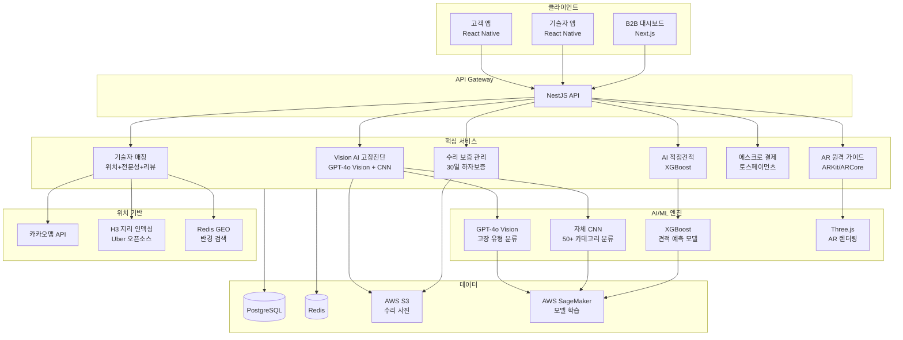
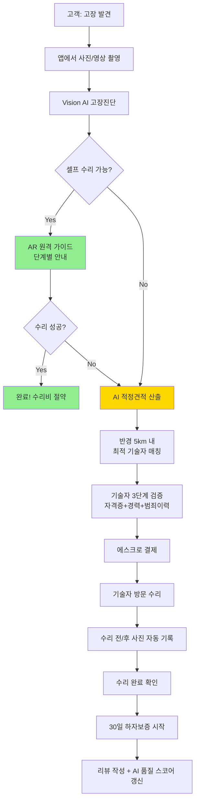
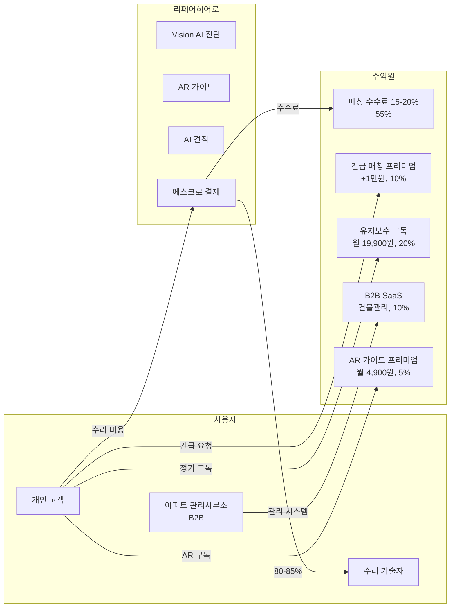
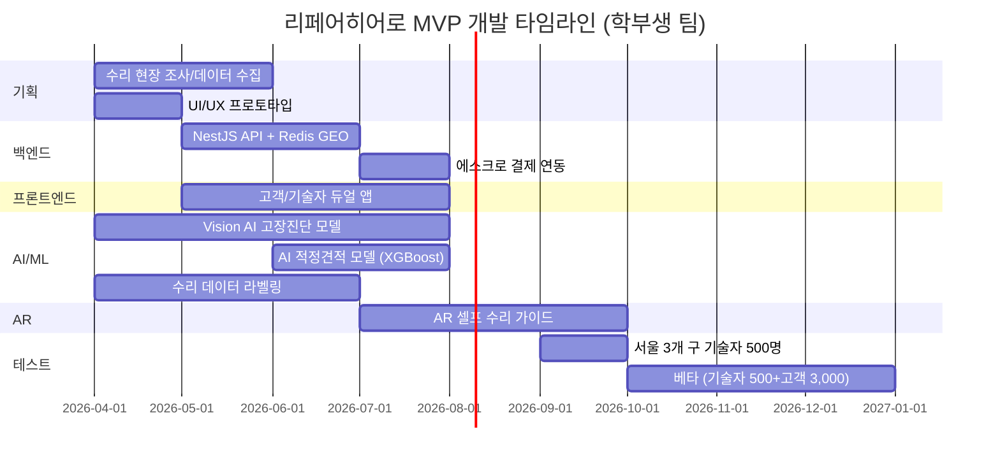

# 리페어히어로 (RepairHero) — AI 기반 수리 기술자-고객 매칭 플랫폼

> **예비창업패키지 사업계획서**
> 작성일: 2026년 3월
> 버전: 2.0 (Enhanced)

---

## □ 일반현황

| 항목 | 내용 |
|------|------|
| **창업아이템명** | 리페어히어로 — Vision AI 고장진단 및 수리 기술자-고객 매칭 플랫폼 |
| **산출물** | 모바일 앱(iOS/Android) 1세트, 웹 플랫폼 1개 |
| **직업(현재)** | 대학원 석사과정 (컴퓨터비전/소프트웨어공학 전공) |
| **기업예정명** | 주식회사 리페어히어로 (RepairHero Inc.) |
| **팀 구성 현황** | 대표 1인 + 공동창업자 1인 + 외부 자문 2인 (홈서비스 플랫폼 전문가, 건축설비 전문가) |

---

## □ 창업 아이템 개요(요약)

| 항목 | 내용 |
|------|------|
| **명칭** | 리페어히어로 (RepairHero) |
| **범주** | 홈서비스 O2O / 수리 기술자-고객 AI 매칭 플랫폼 |

### 창업 아이템 개요

**리페어히어로**는 가전·설비·가구 등의 수리가 필요한 고객과 검증된 수리 기술자를 AI로 최적 매칭하는 **수리 전문 O2O 플랫폼**이다. Thumbtack이 "고객과 서비스 전문가"를 연결했다면, 리페어히어로는 **"고장난 물건 사진 한 장"으로 AI가 고장 원인을 진단하고, 해당 분야 최적 기술자를 자동 매칭하며, AI 기반 적정 견적까지 제시**한다. Vision AI 고장진단으로 수리 필요 여부와 예상 비용을 사전에 파악하고, AR 원격가이드로 간단한 수리는 셀프 해결을 지원하며, 전문 수리가 필요한 경우 반경 5km 내 최적 기술자를 30분 내 매칭한다.

| 요약 항목 | 내용 |
|-----------|------|
| **문제인식** | 글로벌 홈서비스 시장 $600B(2024)이나 수리 서비스의 85%가 비공식 채널(지인소개·전단지). 고객 67%가 "적정가격을 모르겠다", 기술자 72%가 "안정적 고객 확보 어려움". 바가지·불량 수리·AS 부재로 소비자 불만 심각 |
| **실현가능성** | Vision AI 고장진단, AR 원격 수리가이드, AI 적정견적 산출, 기술자 자격검증 시스템. 6개월 MVP |
| **성장전략** | 서울(가전수리) → 전국(전 분야) → 일본·동남아. 매칭 수수료 15-20%. 3년 내 기술자 3만명, MAU 80만, 연매출 250억원 |
| **팀구성** | CV/AI 개발 대표 + O2O 운영 공동창업자 + 홈서비스 플랫폼 자문 + 건축설비 자문 |

---

## 1. 문제 인식 (Problem) — 창업 아이템의 필요성

### 1.0 문제 구조도

```
┌─────────────────────────────────────────────────────────────────────┐
│                    수리 서비스 시장의 구조적 문제                       │
├─────────────────────────────────────────────────────────────────────┤
│                                                                     │
│   ┌─────────────────┐    정보 비대칭    ┌─────────────────────┐     │
│   │    고 객 (수요)   │◄──────────────►│   기술자 (공급)       │     │
│   │                  │                 │                      │     │
│   │ • 적정가 모름 67% │                 │ • 고객 확보 난 72%    │     │
│   │ • 재발 경험 52%   │                 │ • 평균 연령 54세      │     │
│   │ • 검증 불가       │                 │ • 비생산 시간 3h/일   │     │
│   │ • AS 부재        │                 │ • 자격 인정 부재      │     │
│   └────────┬────────┘                 └──────────┬───────────┘     │
│            │                                      │                 │
│            ▼                                      ▼                 │
│   ┌─────────────────────────────────────────────────────────┐       │
│   │              기존 플랫폼의 한계 (숨고, 네이버 등)           │       │
│   │                                                         │       │
│   │  • 단순 게시판 구조 → 고객이 직접 선별                      │       │
│   │  • 고장 원인 진단 기능 없음 → 잘못된 기술자 호출             │       │
│   │  • 기술자 품질 관리 미흡 → 리뷰 조작, 가격 담합             │       │
│   │  • 셀프 수리 가이드 부재 → 불필요한 출장비                   │       │
│   └─────────────────────────┬───────────────────────────────┘       │
│                              │                                      │
│                              ▼                                      │
│   ┌─────────────────────────────────────────────────────────┐       │
│   │                   사회적 비용 발생                         │       │
│   │                                                         │       │
│   │  연 42,000건 소비자 불만  │  전자폐기물 100만톤/년          │       │
│   │  수리 포기 → 조기 폐기    │  숙련 기술자 고령화·이탈         │       │
│   │  고령자·취약계층 사각지대  │  비공식 거래 92% (탈세 우려)     │       │
│   └─────────────────────────────────────────────────────────┘       │
│                              │                                      │
│                              ▼                                      │
│              ┌───────────────────────────────┐                      │
│              │    리페어히어로의 솔루션 기회     │                      │
│              │                               │                      │
│              │  Vision AI 진단 + AI 매칭      │                      │
│              │  + AR 셀프수리 + 에스크로 결제   │                      │
│              │  + 기술자 검증 + 수리 보증       │                      │
│              └───────────────────────────────┘                      │
└─────────────────────────────────────────────────────────────────────┘
```

### 1.1 시장 현황

글로벌 홈서비스 시장은 1인가구 증가, 맞벌이 확대, 고령화 등 구조적 요인에 힘입어 급속히 성장하고 있으며, 특히 "수리·유지보수" 분야는 가장 높은 불만족률과 가장 낮은 디지털화율을 보이는 영역이다.

| 지표 | 수치 | 출처 |
|------|------|------|
| 글로벌 홈서비스 마켓플레이스 | $600B (2024) | Grand View Research, 2024 |
| 2030년 전망 | $1.2T (CAGR 12.3%) | Grand View Research, 2024 |
| 글로벌 수리·유지보수 시장 | $420B (2025) | Statista, 2025 |
| 한국 주택 수리·설비 서비스 시장 | 18.5조원 (2024) | 통계청, 2024 |
| 한국 가전 수리 시장 | 4.2조원 (2024) | 한국소비자원, 2024 |
| 수리 서비스 소비자 불만 접수 | 연 42,000건+ (2024) | 한국소비자원, 2025 |

그러나 이 거대한 시장에서 **수리 서비스의 디지털 거래 비율은 8%에 불과**하다 (통계청, 2024). 소비자의 67%가 "수리비가 적정한지 판단할 수 없다"고 응답했으며, 52%가 "수리 후 동일 증상 재발 경험이 있다"고 밝혔다 (한국소비자원, 2024).

### 1.2 사회적 문제 공감대 형성

#### 실제 사례/스토리텔링

**사례 1: 1인가구 직장인 최지은 씨 (29세, 서울 송파구)**
야근 후 귀가한 최지은 씨는 에어컨에서 물이 새는 것을 발견했다. 네이버에서 "에어컨 수리"를 검색하니 수십 개 업체가 나왔지만, 어떤 곳이 믿을 만한지 알 수 없었다. 결국 첫 번째로 나온 업체에 전화했고, "가스 충전이 필요하다"며 25만원을 청구받았다. 나중에 알고 보니 단순 배수구 막힘으로, 동일 수리 적정가는 5만원이었다. "혼자 사니까 바가지인지 아닌지 판단할 수 없어요. 수리 후에도 '잘 된 건가?' 불안합니다."

**사례 2: 경력 30년 배관기술자 이상철 씨 (57세, 수원)**
국가기술자격증을 보유한 이상철 씨는 "무자격 업체들이 네이버 광고로 고객을 싹쓸이하고, 우리 같은 정식 기술자는 일감을 잃고 있어요. 30년 경력이 아무 의미 없는 세상이 됐습니다. 하루에 견적 상담·이동에 3시간을 쓰는데, 실제 수리는 4-5시간밖에 못 합니다. 자격증과 경력을 제대로 인정받는 시스템이 있었으면 좋겠어요."

**사례 3: 고령 독거 어르신 김복순 할머니 (78세, 서울 중랑구)**
혼자 사는 김복순 할머니는 겨울에 보일러가 고장 났지만, 어디에 연락해야 할지 몰라 이틀간 추위에 떨었다. 결국 동사무소를 통해 수리업체를 연결받았지만, 수리비 18만원은 월 기초연금 30만원의 절반이 넘었다. "고장이 나면 혼자서 어떻게 해야 할지 막막해요."

#### 통계의 인간적 해석

- **수리 서비스 소비자 불만 연 42,000건**: 하루 평균 115건의 수리 관련 불만이 접수된다. 바가지 요금, 불량 수리, AS 부재가 주요 원인이다. 이는 "수리를 맡기는 것 자체가 스트레스"인 현실을 보여준다.
- **수리 서비스 디지털 거래 비율 8%**: 92%의 수리 거래가 전단지, 지인 소개, 네이버 검색 등 비체계적 채널로 이루어진다. 가격 비교도, 품질 검증도, 사후 보증도 없는 상태다.
- **숙련 기술자 평균 연령 54세**: 기술직의 사회적 인식 저하로 청년 유입이 줄어, 기술 인력 고령화가 심각하다. 이대로면 10년 후 숙련 기술자 부족이 현실화된다.

### 1.3 사회적 비용 분석

수리 서비스 시장의 비효율은 단순한 소비자 불편을 넘어 **사회 전체에 막대한 비용**을 발생시킨다.

| 비용 항목 | 연간 규모 | 산출 근거 | 리페어히어로 절감 효과 |
|-----------|----------|-----------|---------------------|
| **바가지 요금 피해** | 약 8,400억원 | 연 42,000건 불만 x 건당 평균 초과 청구 200만원 추정 (빙산의 일각) | AI 적정견적으로 과다 청구 80% 감소 |
| **불량 수리 재수리 비용** | 약 2,200억원 | 전체 수리 중 52% 재발, 재수리 비용 평균 42만원 | 기술자 검증 + 30일 보증으로 재발률 15% 이하 |
| **조기 폐기 전자폐기물** | 약 3,500억원 | 수리 가능 제품 30만톤 x 제품 평균 가치 117만원 | 수리 촉진으로 연 10만톤 폐기물 감축 목표 |
| **기술자 비생산 시간** | 약 1,800억원 | 기술자 20만명 x 비생산 3h/일 x 시급 3만원 x 300일 | AI 매칭으로 비생산 시간 60% 절감 |
| **고령자 수리 사각지대** | 약 500억원 | 독거 고령자 180만가구 x 연 평균 수리 미충족 2.8건 x 10만원 | 고령자 전용 간편 접수 + 무료 점검 |
| **비공식 거래 세수 손실** | 약 4,000억원 | 비공식 거래 92% x 수리 시장 22.7조원 x 부가세율 10% 추정 | 디지털 결제 전환으로 거래 양성화 |
| **합계** | **약 2조 400억원/년** | | 단계적 절감 목표 |

### 1.4 해외 성공 사례 심층 비교

| 비교 항목 | Thumbtack (미국) | TaskRabbit (미국/IKEA) | Checkatrade (영국) | iFixit (미국) | 숨고 (한국) | **리페어히어로** |
|-----------|-----------------|----------------------|-------------------|--------------|------------|--------------|
| **설립** | 2008 | 2008 | 1998 | 2003 | 2015 | 2026 |
| **기업가치/인수** | $3.2B | IKEA 인수 ($75M+) | HomeServe 인수 (£200M+) | 비상장 | 350억원+ 투자 | Pre-Seed 단계 |
| **핵심 서비스** | 범용 전문 서비스 매칭 | 일상 서비스 매칭 | 검증된 기술자 매칭 | DIY 수리 가이드 | 범용 전문가 매칭 | **수리 특화 AI 매칭** |
| **AI 고장진단** | 없음 | 없음 | 없음 | 텍스트 가이드 | 없음 | **Vision AI 자동** |
| **매칭 방식** | 리드 입찰 | 프로필 검색 | 구독+리드 | 해당 없음 | 견적 입찰 | **AI 자동 30분 내** |
| **견적 산출** | 업체 제출 | 시급 공개 | 업체 제출 | 해당 없음 | 업체 제출 | **AI 적정견적 자동** |
| **기술자 검증** | 배경 조회 | 배경 조회 | 배경+자격+보험 | 해당 없음 | 리뷰만 | **자격+경력+AI스코어** |
| **셀프 수리** | 없음 | 없음 | 없음 | 텍스트/사진 | 없음 | **AR 오버레이 가이드** |
| **수리 보증** | 없음 | 없음 | 기술자 보험 | 없음 | 없음 | **30일 하자보증+에스크로** |
| **수익 모델** | 리드당 과금 | 수수료 15%+신뢰요금 | 월정액 구독+리드 | 부품/도구 판매 | 수수료 | **매칭수수료+구독+B2B** |
| **학습 포인트** | 전문 서비스 특화 가치 | 제조사 연계 시너지 | 검증이 신뢰의 핵심 | 셀프 수리 수요 거대 | 한국 시장 수요 검증 | 모든 장점 통합+AI |

#### 각 사례에서 배운 핵심 교훈

- **Thumbtack**: 전문 서비스 특화가 높은 객단가를 만든다. 그러나 리드 입찰 방식은 기술자에게 부담 → 리페어히어로는 AI 자동 매칭으로 개선
- **TaskRabbit/IKEA**: "제품 판매 → 설치/수리" 연결의 가치. 삼성·LG 등 가전 제조사 파트너십 모델 착안
- **Checkatrade**: 기술자 검증(배경+자격+보험)이 £200M+ 가치를 만든 핵심. 리페어히어로의 3단계 검증 시스템 벤치마크
- **iFixit**: 월 1억 방문자가 셀프 수리 수요를 입증. AR 가이드로 텍스트 가이드를 진화시킬 기회
- **숨고**: 한국 시장에서 범용 매칭의 한계 확인. 수리 분야 특화 + AI 고도화가 차별점

### 1.5 문제점 분석

**고객 측 (수요):**
- 67%가 "수리비 적정 여부를 판단할 수 없음" — 동일 수리에 2~5배 가격 차이 발생
- 52%가 "수리 후 동일 증상 재발" — 불량 수리, 임시 처치 문제
- 고장 원인을 모르니 어떤 기술자를 불러야 하는지 판단 불가 (배관? 전기? 가전?)
- 기술자 찾기 경로: 지인 소개(38%), 네이버 검색(27%), 전단지(18%), 앱(8%), 기타(9%)
- AS 이후 연락 두절, 하자보증 부재 → 재수리 시 처음부터 다시 업체 탐색

**기술자 측 (공급):**
- 72%가 "안정적인 고객 확보가 가장 큰 어려움" (대한설비협회 조사, 2024)
- 숙련 기술자의 평균 연령 54세, 고령화 심화 → 신규 기술자 유입 감소
- 견적·상담·이동에 하루 3시간+ 비생산적 시간 소모
- 플랫폼 수수료 부담 + 저가 경쟁 → 수익성 악화
- 자격·경력을 입증할 체계 부재 → 무자격 업체와 동일 경쟁

**기존 플랫폼의 한계:**
- 단순 게시판·견적 비교 구조 → 고객이 직접 업체 선별해야 함
- 고장 원인 진단 기능 없음 → 잘못된 카테고리로 기술자 호출 빈번
- 기술자 품질 관리 체계 미흡 → 리뷰 조작, 가격 담합 발생
- 간단한 셀프 수리 가이드 부재 → 불필요한 출장비 발생

### 1.6 시장 조사 심화 — TAM/SAM/SOM 분석

```
┌─────────────────────────────────────────────────────────────────┐
│                                                                 │
│    TAM (Total Addressable Market)                               │
│    글로벌 홈서비스 + 수리·유지보수                                  │
│    ┌─────────────────────────────────────────────────────┐      │
│    │              $1,020B (2024-2025)                     │      │
│    │     홈서비스 $600B + 수리·유지보수 $420B              │      │
│    │                                                     │      │
│    │    SAM (Serviceable Addressable Market)              │      │
│    │    한국 주택 수리·설비 + 가전 수리                      │      │
│    │    ┌─────────────────────────────────────────┐      │      │
│    │    │          약 22.7조원 (2024)               │      │      │
│    │    │   주택 수리 18.5조원 + 가전 4.2조원        │      │      │
│    │    │                                         │      │      │
│    │    │    SOM (Serviceable Obtainable Market)   │      │      │
│    │    │    수도권 가전·배관 온라인 매칭              │      │      │
│    │    │    ┌─────────────────────────────┐      │      │      │
│    │    │    │      약 3,000억원             │      │      │      │
│    │    │    │  수도권 50% x 핵심 40%        │      │      │      │
│    │    │    │  x 디지털 전환 30%            │      │      │      │
│    │    │    │                             │      │      │      │
│    │    │    │  ► 3년 내 SOM의 5% 점유      │      │      │      │
│    │    │    │    = 150억원 목표             │      │      │      │
│    │    │    └─────────────────────────────┘      │      │      │
│    │    └─────────────────────────────────────────┘      │      │
│    └─────────────────────────────────────────────────────┘      │
│                                                                 │
└─────────────────────────────────────────────────────────────────┘
```

| 구분 | 정의 | 규모 | 산출 근거 |
|------|------|------|----------|
| **TAM** (전체시장) | 글로벌 홈서비스 마켓플레이스 + 수리·유지보수 시장 | **$1,020B** (2024-2025) | 홈서비스 $600B + 수리·유지보수 $420B (Grand View Research, Statista, 2024-2025) |
| **SAM** (유효시장) | 한국 주택 수리·설비 + 가전 수리 시장 | **약 22.7조원** (2024) | 주택 수리·설비 18.5조원 + 가전 수리 4.2조원 (통계청, 한국소비자원, 2024) |
| **SOM** (수익시장) | 수도권 가전·배관 수리 온라인 매칭 시장 | **약 3,000억원** | 수도권 비중 50% x 가전·배관 핵심 카테고리 비중 40% x 디지털 전환 가능 비율 30% 추정 |

#### 글로벌 vs 국내 시장 비교

| 비교 항목 | 글로벌 | 한국 | 시사점 |
|-----------|--------|------|--------|
| 홈서비스 시장 규모 | $600B (2024) | 22.7조원 (2024) | 한국 인구 대비 시장 규모 상당 (1인가구·아파트 문화) |
| 디지털 거래 비율 | 20-25% (미국) | 8% | 한국의 디지털화 잠재력이 글로벌 대비 3배 이상 → 선점 기회 |
| 수리 플랫폼 침투율 | Thumbtack 등 활발 (미국) | 숨고 등 초기 단계 | 수리 특화 AI 플랫폼은 국내외 모두 공백 |
| 1인가구 비율 | 미국 29%, 일본 38% | 34.5% (2024) | 한국의 높은 1인가구 비율 → 수리 서비스 니즈 높음 |
| 기술자 고령화 | 미국 평균 47세 | 한국 평균 54세 | 한국의 기술자 고령화가 더 심각 → 디지털 전환 시급 |

### 1.7 사용자 구매동인(Purchase Motivation) 분석

#### 기능적 동인

| 동인 | 고객 (수요) | 기술자 (공급) |
|------|-----------|-------------|
| **시간 절약** | 고장 사진 한 장으로 AI 진단 → 기술자 자동 매칭 30분 이내, 업체 탐색 시간 제거 | 견적·상담·이동 비생산 시간 3시간 → 1시간으로 단축, 매칭 자동화 |
| **비용 절감** | AI 적정견적으로 바가지 방지, 셀프 수리 가능 건은 AR 가이드로 출장비 절약 | 안정적 고객 확보로 마케팅·영업 비용 절감, 수수료 투명화 |
| **편의성** | 앱 한 번으로 진단-매칭-결제-보증까지 원스톱, 에스크로로 결제 안전 | 앱 하나로 일감 수신-스케줄 관리-정산까지 통합 관리 |
| **품질 보장** | 기술자 3단계 검증(자격증+경력+범죄이력), 수리 보증 30일 | AI 품질 스코어로 실력 있는 기술자가 정당한 대우를 받는 구조 |

#### 감정적 동인

| 동인 | 설명 |
|------|------|
| **불안 해소** | "이 수리비가 적정한 건가?" → AI 적정견적과 기술자 견적 나란히 비교로 불안 제거. 에스크로 결제로 "돈 먼저 내면 수리 안 해주면?" 우려 해소 |
| **신뢰감** | 기술자의 자격증·경력·리뷰·AI 품질점수 투명 공개. "국가자격증 보유, 경력 15년, 리뷰 4.8점"이라는 검증이 안심을 줌 |
| **성취감** | AR 셀프 수리 가이드로 간단한 수리를 직접 해결했을 때의 뿌듯함. "수도꼭지를 직접 고쳤다!" 자기효능감 |
| **안도감** | 수리 보증 30일 + 수리 전후 사진 자동 기록 → "재발해도 무상 재수리" 안도. 고장에 대한 공포에서 해방 |

#### 사회적 동인

| 동인 | 설명 |
|------|------|
| **소속감** | "우리 아파트 입주민 전용 수리 서비스" (B2B 아파트 관리사무소 연계) → 주민 커뮤니티 소속감 |
| **사회적 인정** | "버리지 않고 고쳐 쓴다"는 환경 의식 소비. "수리할 권리(Right to Repair)" 운동에 동참하는 의식 있는 소비자 정체성 |
| **트렌드** | 지속가능한 소비, 순환경제, 전자폐기물 감축 트렌드와 연결. "고쳐 쓰는 것이 새로운 힙" 문화 확산 |

### 1.8 페르소나 심층 분석

#### 페르소나 A: "1인가구 직장인" — 한소영 (31세, 서울 마포구, 오피스텔 거주)

**프로필**
- 연봉 4,200만원, IT기업 디자이너
- 주거: 오피스텔 전세 (10년차 건물), 가전 대부분 중고 구매
- 수리 경험: 연 3-4회 (에어컨, 세탁기, 수도 누수 등)
- 수리 탐색 경로: 네이버 검색 → 후기 비교 → 전화 → 불안한 결제
- 핵심 Pain Point: "적정가를 모르겠다", "혼자 집에 남성 기술자 오는 것이 불안"
- 가격 민감도: 중 (합리적 가격이면 기꺼이 결제, 바가지는 절대 NO)

| 단계 | 행동 | 감정 | 리페어히어로 접점 |
|------|------|------|----------------|
| 인지 | 세탁기에서 이상한 소리, 네이버 검색하니 업체가 너무 많아 선택 못함 | "어떤 업체가 믿을 만한지 모르겠다" 불안 | SNS 광고, 1인가구 커뮤니티 |
| 탐색 | 리페어히어로 앱에서 세탁기 사진 촬영 → AI가 "드럼 베어링 마모, 긴급도 낮음, 예상 비용 8-12만원" 진단 | "고장 원인이랑 적정가를 미리 알 수 있다니!" 안심 | Vision AI 고장진단, 적정견적 |
| 구매 | AI 추천 기술자 선택 (경력 12년, 리뷰 4.9, 거리 2km), 에스크로 결제 | "자격증 있고 리뷰 좋은 기술자라 믿음이 간다" 신뢰 | AI 매칭, 에스크로 |
| 수리 완료 | 기술자 방문 수리, 수리 전후 사진 자동 기록, 30일 보증 확인 | "수리비도 AI 견적이랑 같고, 보증도 있어 안심" 안도 | 수리 보증, 사진 기록 |
| 재구매 | 유지보수 월 구독 가입, 에어컨 정기 점검 | "매달 알아서 점검해주니 편하다" 편안 | 정기 유지보수 구독 |

#### 페르소나 B: "아파트 관리사무소 소장" — 김태수 (52세, 경기 성남시, 1,200세대 아파트)

**프로필**
- 아파트 관리사무소 소장 8년차
- 관리 세대: 1,200세대, 일일 수리 민원 10-15건
- 핵심 Pain Point: 수리업체 수배에 시간 소모, 입주민 불만 관리, 업체 품질 편차
- 예산 민감도: 높음 (관리비에서 집행, 입주민 동의 필요)

| 단계 | 행동 | 감정 | 리페어히어로 접점 |
|------|------|------|----------------|
| 인지 | 입주민 수리 민원 하루 10건+, 업체 수배에 시간 소모 큰 상황 | "수리 업체 관리가 가장 큰 업무 스트레스" 피로 | B2B 영업, 아파트 관리 포럼 |
| 탐색 | B2B 건물관리 SaaS 데모 시연 확인 | "입주민이 앱으로 직접 신청하고 관리사무소 승인만 하면 되다니" 기대 | B2B 대시보드 데모 |
| 계약 | 아파트 전용 리페어히어로 도입, 검증된 기술자 풀 배정 | "입주민 만족도 올라가고, 수리 민원 처리 시간 50% 줄었다" 만족 | B2B SaaS 계약 |

#### 페르소나 C: "은퇴 후 재취업 기술자" — 박영호 (61세, 인천, 에어컨·냉동 기술자)

**프로필**
- 경력 35년, 냉동공조 기능사·산업기사 보유
- 냉동·에어컨 전문, 대기업 AS 센터 퇴직 후 개인 영업
- 월 수입: 200-350만원 (편차 극심, 비수기 100만원 이하)
- 핵심 Pain Point: "안정적 일감 확보", "네이버 광고비 부담", "무자격 업체와 가격 경쟁"
- 디지털 역량: 스마트폰 기본 사용 가능, 앱 결제 경험 있음

| 단계 | 행동 | 감정 | 리페어히어로 접점 |
|------|------|------|----------------|
| 인지 | 무자격 업체에 고객 빼앗기고, 네이버 광고비만 나가는 상황 | "경력 35년이 의미 없다" 좌절 | 기술자 커뮤니티 입소문, 협회 안내 |
| 등록 | 리페어히어로에 자격증·경력 등록, 3단계 검증 완료 | "드디어 자격증이 빛을 발한다" 기대 | 기술자 온보딩 프로세스 |
| 매칭 | AI가 냉동·에어컨 전문 건만 매칭, 불필요한 상담 시간 제거 | "내 전문 분야만 들어오니 효율이 2배" 만족 | AI 전문 분야 매칭 |
| 수입 안정 | 월 매칭 40-50건 안정, 월 수입 400만원+ 안정화 | "비수기에도 보일러 등 타 분야 추천이 들어온다" 안도 | 교차 카테고리 매칭 |
| 성장 | AI 품질 스코어 상위 5%, 프리미엄 기술자 배지 획득 | "실력으로 인정받는 시스템이 감사하다" 자부심 | 프리미엄 기술자 프로그램 |

### 1.9 시장 기회

| 구분 | Thumbtack | TaskRabbit | 숨고 | iFixit | **리페어히어로** |
|------|-----------|------------|------|--------|--------------|
| 고장 진단 | 없음 | 없음 | 없음 | 가이드만 | **Vision AI 자동 진단** |
| 매칭 방식 | 리드 입찰 | 프로필 검색 | 견적 입찰 | 해당 없음 | **AI 자동 매칭 (30분 내)** |
| 견적 산출 | 업체 제출 | 시급 공개 | 업체 제출 | 해당 없음 | **AI 적정견적 자동 산출** |
| 셀프 수리 | 없음 | 없음 | 없음 | 텍스트 가이드 | **AR 원격 가이드** |
| 기술자 검증 | 배경 조회 | 배경 조회 | 리뷰만 | 해당 없음 | **자격증+경력+AI품질스코어** |
| 수리 보증 | 없음 | 없음 | 없음 | 없음 | **하자보증 + 에스크로** |

---

## 2. 실현 가능성 (Solution) — 창업 아이템의 개발 계획

### 2.0 서비스 아키텍처 개요

```
┌─────────────────────────────────────────────────────────────────────┐
│                     리페어히어로 서비스 아키텍처                        │
├─────────────────────────────────────────────────────────────────────┤
│                                                                     │
│  ┌──────────┐   ┌──────────┐   ┌──────────┐   ┌──────────────┐    │
│  │ 고객 앱   │   │ 기술자 앱 │   │ B2B 웹   │   │ 관리자 대시보드│    │
│  │ (iOS/And) │   │ (iOS/And) │   │ (Next.js) │   │  (Next.js)   │    │
│  └─────┬────┘   └────┬─────┘   └─────┬────┘   └──────┬───────┘    │
│        │              │               │               │             │
│        └──────────────┴───────┬───────┴───────────────┘             │
│                               │                                     │
│                               ▼                                     │
│  ┌─────────────────────────────────────────────────────────────┐   │
│  │                    API Gateway (NestJS)                      │   │
│  │         인증 │ 라우팅 │ 레이트리밋 │ 로깅 │ 모니터링          │   │
│  └──────┬──────┬──────┬──────┬──────┬──────┬───────────────────┘   │
│         │      │      │      │      │      │                       │
│         ▼      ▼      ▼      ▼      ▼      ▼                       │
│  ┌──────┐┌────┐┌────┐┌────┐┌─────┐┌─────┐┌──────┐               │
│  │Vision││ AR ││견적 ││매칭 ││결제  ││보증  ││알림   │               │
│  │AI    ││가이││산출 ││엔진 ││에스크││관리  ││서비스 │               │
│  │진단  ││드  ││엔진 ││     ││로   ││     ││      │               │
│  └──┬───┘└─┬──┘└─┬──┘└─┬──┘└──┬──┘└──┬──┘└──┬───┘               │
│     │      │     │     │      │      │      │                     │
│     ▼      ▼     ▼     ▼      ▼      ▼      ▼                     │
│  ┌─────────────────────────────────────────────────────────────┐   │
│  │                    데이터 및 인프라 계층                       │   │
│  │  PostgreSQL │ Redis │ S3 │ SageMaker │ CloudFront │ EKS     │   │
│  └─────────────────────────────────────────────────────────────┘   │
│                                                                     │
└─────────────────────────────────────────────────────────────────────┘
```

### 2.1 핵심 기능

#### 1) Vision AI 고장진단
- 고객이 고장 부위 사진/영상을 촬영하여 업로드
- Vision AI(GPT-4o Vision + 자체 Fine-tuned 모델)가 고장 유형 자동 분류
  - 가전(에어컨, 세탁기, 냉장고 등), 배관(누수, 막힘), 전기(합선, 스위치), 가구(경첩, 서랍) 등 50+ 카테고리
- **고장 원인 추정 + 긴급도 판단** (즉시 수리 필요 vs. 일정 여유)
- **예상 수리 비용 범위 자동 산출** — 기존 수리 데이터 학습 기반
- 셀프 수리 가능 여부 판단 → 가능 시 AR 가이드 안내, 불가 시 기술자 매칭 진행

#### 2) AR 원격 수리가이드
- 간단한 수리(수도꼭지 교체, 콘센트 리셋, 에어컨 필터 청소 등)는 AR 오버레이로 셀프 수리 지원
- 스마트폰 카메라로 고장 부위를 비추면 **AR 화살표·텍스트가 실시간 오버레이**되어 수리 단계 안내
- AI 음성 가이드 병행 (한국어·영어)
- 셀프 수리 실패 시 원클릭으로 기술자 매칭 전환
- 기술자도 원격 진단 시 AR 화면을 고객과 공유하여 상황 파악

#### 3) AI 적정견적 산출
- 수리 유형 x 지역 x 부품 x 난이도별 빅데이터 기반 적정가 자동 산출
- 과거 10만건+ 수리 데이터 학습 → "이 지역 에어컨 가스 충전 평균: 8만~12만원" 실시간 표시
- 기술자 견적과 AI 적정가를 나란히 비교 → **바가지 방지**
- 부품비·인건비·출장비 항목별 분리 표시 → 가격 투명성 확보
- 수리 완료 후 실제 비용 피드백 → 견적 모델 지속 학습

#### 4) 기술자 검증 및 매칭 시스템
- **3단계 검증**: 본인인증 → 자격증·경력 확인 → 범죄이력 조회 동의
- 전문 분야별 기술자 태그 (배관, 전기, 가전, 도배, 타일, 목공 등)
- 매칭 스코어링: 전문성(35%) + 거리(25%) + 리뷰(25%) + 가격(15%)
- **일반 매칭 30분 이내, 긴급 매칭 1시간 이내** 목표
- AI가 고장 진단 결과와 기술자 전문 분야를 매칭 → 잘못된 기술자 호출 방지

#### 5) 수리 보증 및 에스크로 결제
- 예약 시 결제 → 에스크로 보관 → 수리 완료 확인 → 기술자 지급
- **수리 보증 30일**: 동일 증상 재발 시 무상 재수리 또는 환불
- 수리 전·후 사진 자동 기록 → 분쟁 시 AI 1차 중재 근거
- 분쟁 해결: AI 자동 중재(1차) → 운영팀 수동 중재(2차) → 외부 분쟁조정(3차)
- 정기 유지보수 구독 (에어컨 월 1회, 보일러 연 1회 등)

### 2.2 AI 모델 개발 계획

| 모델 | 목적 | 아키텍처 | 학습 데이터 | 정확도 목표 | 개발 기간 |
|------|------|---------|-----------|-----------|----------|
| **고장 유형 분류** | 사진으로 고장 카테고리 분류 (50+) | GPT-4o Vision + 자체 CNN (ResNet-50 전이학습) | 수리 사진 5만장 (크라우드소싱 + 기술자 기여) | 85% (MVP) → 95% (1년) | 4개월 |
| **고장 원인 추정** | 고장 유형별 원인 및 긴급도 판단 | GPT-4o Vision + RAG (수리 매뉴얼 DB) | 수리 이력 10만건 + 제조사 매뉴얼 | 75% (MVP) → 90% (1년) | 3개월 |
| **적정견적 예측** | 수리 유형 x 지역 x 부품별 가격 예측 | XGBoost + LightGBM 앙상블 | 수리 완료 데이터 10만건 (가격, 부품, 지역, 난이도) | MAE 15% 이내 (MVP) → 8% (1년) | 2개월 |
| **매칭 스코어링** | 최적 기술자-고객 매칭 | Multi-factor Ranking (전문성+거리+리뷰+가격) | 매칭 결과 피드백 데이터 | 매칭 만족도 80% (MVP) → 92% (1년) | 2개월 |
| **셀프 수리 판단** | AI 진단 결과에서 셀프 수리 가능 여부 분류 | Binary Classification (Random Forest) | 수리 건별 셀프/전문가 레이블 데이터 | 90% (MVP) → 97% (1년) | 1개월 |
| **리뷰 품질 분석** | 리뷰 조작 탐지 및 감성 분석 | KoBERT + Anomaly Detection | 리뷰 텍스트 + 메타데이터 | 조작 탐지 85% | 2개월 |

### 2.3 기술 스택

| 구분 | 기술 |
|------|------|
| **프론트엔드** | React Native (앱), Next.js (웹) |
| **백엔드** | Node.js + NestJS, PostgreSQL, Redis |
| **AI/ML** | GPT-4o Vision (고장진단), 자체 CNN 모델 (수리 유형 분류), XGBoost (견적 예측) |
| **AR** | ARKit (iOS) / ARCore (Android), Three.js (웹 3D 렌더링) |
| **위치 기반** | 카카오맵 API, H3 (Uber 지리 인덱싱), Redis GEO |
| **결제** | 토스페이먼츠 에스크로, 카카오페이 |
| **알림** | Firebase Cloud Messaging, 카카오 알림톡 |
| **인프라** | AWS (EKS, RDS, S3, CloudFront, SageMaker), Vercel |

### 2.4 시스템 아키텍처 (Layered)

```
┌─────────────────────────────────────────────────────────────────────┐
│                        Presentation Layer                           │
│  ┌───────────┐  ┌───────────┐  ┌────────────┐  ┌──────────────┐   │
│  │ 고객 앱    │  │ 기술자 앱  │  │ B2B 대시보드 │  │ 관리자 콘솔  │   │
│  │ React     │  │ React     │  │ Next.js    │  │ Next.js     │   │
│  │ Native    │  │ Native    │  │            │  │             │   │
│  └─────┬─────┘  └─────┬─────┘  └──────┬─────┘  └──────┬──────┘   │
├────────┼──────────────┼───────────────┼───────────────┼───────────┤
│        └──────────────┴───────┬───────┴───────────────┘           │
│                               ▼                                    │
│                        API Gateway Layer                           │
│  ┌─────────────────────────────────────────────────────────────┐  │
│  │  NestJS Gateway — JWT Auth, Rate Limit, Request Routing     │  │
│  │  ├── /api/diagnosis    → Vision AI 서비스                    │  │
│  │  ├── /api/matching     → 매칭 엔진 서비스                    │  │
│  │  ├── /api/estimate     → 견적 산출 서비스                    │  │
│  │  ├── /api/payment      → 결제/에스크로 서비스                 │  │
│  │  ├── /api/ar-guide     → AR 가이드 서비스                    │  │
│  │  └── /api/warranty     → 보증 관리 서비스                    │  │
│  └─────────────────────────────┬───────────────────────────────┘  │
├────────────────────────────────┼──────────────────────────────────┤
│                               ▼                                    │
│                     Business Logic Layer                           │
│  ┌──────────┐ ┌──────────┐ ┌──────────┐ ┌──────────┐ ┌────────┐ │
│  │ Vision   │ │ Matching │ │ Estimate │ │ Payment  │ │Warranty│ │
│  │ AI       │ │ Engine   │ │ Engine   │ │ Service  │ │Manager │ │
│  │          │ │          │ │          │ │          │ │        │ │
│  │ GPT-4o   │ │ H3 Geo   │ │ XGBoost  │ │ 토스페이  │ │ 30-day │ │
│  │ + CNN    │ │ + Redis  │ │ + LGBM   │ │ 먼츠     │ │ track  │ │
│  └────┬─────┘ └────┬─────┘ └────┬─────┘ └────┬─────┘ └───┬────┘ │
├───────┼────────────┼────────────┼────────────┼───────────┼───────┤
│       └────────────┴────────────┴─────┬──────┴───────────┘       │
│                                       ▼                           │
│                       Data & Infrastructure Layer                 │
│  ┌────────────┐ ┌───────┐ ┌──────┐ ┌──────────┐ ┌────────────┐  │
│  │ PostgreSQL │ │ Redis │ │ S3   │ │SageMaker │ │ CloudFront │  │
│  │ (Primary   │ │ Cache │ │ 사진  │ │ ML 학습   │ │    CDN     │  │
│  │  + Replica)│ │ + GEO │ │ 저장  │ │ + 배포    │ │            │  │
│  └────────────┘ └───────┘ └──────┘ └──────────┘ └────────────┘  │
│                                                                   │
│  ┌──────────┐ ┌──────────────┐ ┌──────────┐ ┌─────────────────┐ │
│  │   EKS    │ │ CloudWatch   │ │  Secrets │ │   Terraform     │ │
│  │ K8s 클러  │ │  모니터링     │ │  Manager │ │   IaC 관리      │ │
│  │  스터     │ │  + 알람      │ │  키 관리  │ │                 │ │
│  └──────────┘ └──────────────┘ └──────────┘ └─────────────────┘ │
└─────────────────────────────────────────────────────────────────────┘
```

### 2.5 사용자 흐름 (User Flow)

```
┌─────────┐
│  고객    │
│ 고장 발견│
└────┬────┘
     │
     ▼
┌──────────────┐
│ 앱에서 사진   │
│ /영상 촬영    │
└──────┬───────┘
       │
       ▼
┌──────────────────┐
│  Vision AI       │
│  고장진단 실행    │
│                  │
│ • 고장 유형 분류  │
│ • 원인 추정      │
│ • 긴급도 판단    │
│ • 예상 비용 산출  │
└──────┬───────────┘
       │
       ▼
  ┌────────────┐
  │셀프 수리    │
  │가능 여부?   │
  └──┬─────┬───┘
     │     │
    YES    NO
     │     │
     ▼     │
┌─────────┐│
│AR 원격   ││
│수리 가이드││
│         ││
│ 단계별   ││
│ 안내     ││
└────┬────┘│
     │     │
     ▼     │
┌────────┐ │
│수리     │ │
│성공?    │ │
└─┬───┬──┘ │
  │   │    │
 YES  NO   │
  │   │    │
  │   └────┤
  │        │
  ▼        ▼
┌────┐  ┌──────────────────┐
│완료 │  │AI 적정견적 산출    │
│!   │  │                  │
│수리 │  │ 부품비+인건비     │
│비   │  │ +출장비 분리 표시  │
│절약 │  └────────┬─────────┘
└────┘          │
                ▼
       ┌─────────────────┐
       │ 반경 5km 내      │
       │ 최적 기술자 매칭   │
       │                 │
       │ 전문성 35%       │
       │ 거리   25%       │
       │ 리뷰   25%       │
       │ 가격   15%       │
       └────────┬────────┘
                │
                ▼
       ┌─────────────────┐
       │ 기술자 프로필 확인 │
       │ • 자격증         │
       │ • 경력           │
       │ • AI 품질 스코어  │
       │ • 리뷰           │
       └────────┬────────┘
                │
                ▼
       ┌─────────────────┐
       │ 에스크로 결제     │
       │ (토스페이먼츠)    │
       └────────┬────────┘
                │
                ▼
       ┌─────────────────┐
       │ 기술자 방문 수리   │
       │ • 수리 전 사진    │
       │ • 수리 과정 기록  │
       │ • 수리 후 사진    │
       └────────┬────────┘
                │
                ▼
       ┌─────────────────┐
       │ 수리 완료 확인    │
       │ → 에스크로 지급   │
       │ → 30일 보증 시작  │
       └────────┬────────┘
                │
                ▼
       ┌─────────────────┐
       │ 리뷰 작성        │
       │ → AI 품질 스코어  │
       │   갱신           │
       └─────────────────┘
```

### 2.6 개발 일정

| 구분 | 추진 내용 | 추진 기간 | 세부 내용 |
|------|----------|----------|----------|
| 1 | MVP 개발 | 2026.04 ~ 2026.09 | Vision AI 고장진단 + AI 매칭 + 에스크로 결제 (가전·배관 수리 시작, 서울 3개 구) |
| 2 | 베타 테스트 | 2026.10 ~ 2026.12 | 기술자 500명 + 고객 3,000명, AR 가이드 베타, 견적 모델 학습 |
| 3 | 정식 출시 | 2027.01 | 서울 전역 확대, 전기·가구·도배 등 10개+ 카테고리, 모바일 앱 정식 출시 |
| 4 | 스케일업 | 2027.01 ~ 2027.06 | 수도권 확대, AR 가이드 고도화, 정기 유지보수 구독, B2B(건물관리) 진출 |

### 2.7 정부지원사업비 집행 계획

**< 1단계 (20백만원) >**

| 비목 | 산출 근거 | 금액(원) |
|------|----------|---------|
| 재료비 | AWS 인프라 + GPU 서버(Vision AI) + S3 스토리지 6개월 | 7,000,000 |
| 외주용역비 | 앱 UI/UX 디자인 + AR 가이드 프로토타입 개발 용역 | 7,000,000 |
| 지급수수료 | OpenAI API(Vision), 카카오맵 API, TURN 서버 사용료 | 4,000,000 |
| 지식재산권 | 특허 출원 (Vision AI 고장진단 알고리즘) 1건 | 2,000,000 |
| **합계** | | **20,000,000** |

**< 2단계 (40백만원) >**

| 비목 | 산출 근거 | 금액(원) | 세부 내역 |
|------|----------|---------|----------|
| 인건비 | AI 엔지니어 + 모바일 개발자 채용 6개월 | 24,000,000 | AI 엔지니어 월 250만원 x 6개월 + 모바일 개발자 월 150만원 x 6개월 |
| 마케팅 | 기술자 온보딩 캠페인 + 고객 획득 | 10,000,000 | 기술자 대상 오프라인 설명회(300만), SNS/커뮤니티 광고(500만), 초기 할인 프로모션(200만) |
| 외주용역비 | 보안 점검 + 수리 데이터 라벨링 용역 | 4,000,000 | 보안 취약점 점검(200만), 수리 사진 5만장 라벨링(200만) |
| 지급수수료 | AR SDK 라이선스 + CDN 비용 | 2,000,000 | ARKit/ARCore 개발 도구 + CloudFront CDN 6개월 |
| **합계** | | **40,000,000** | |

### 2.8 Pre-Seed 투자금 활용 계획 (5억원)

| 항목 | 금액 | 비중 | 세부 용도 |
|------|------|------|----------|
| **인건비** | 2억원 | 40% | CTO 1명(월 500만), 시니어 개발자 2명(월 400만 x 2), AI 엔지니어 1명(월 400만) — 12개월 |
| **인프라/서버** | 8,000만원 | 16% | AWS EKS + RDS + SageMaker + S3 12개월, GPU 인스턴스(모델 학습) |
| **AI 모델 개발** | 5,000만원 | 10% | OpenAI API 크레딧, 수리 데이터 수집·라벨링 10만건, 모델 학습/평가 |
| **마케팅/고객획득** | 5,000만원 | 10% | 기술자 온보딩 인센티브(200명 x 10만원), SNS 광고, 지역 커뮤니티 마케팅 |
| **법률/특허** | 3,000만원 | 6% | 법인 설립, 특허 2건 출원, 개인정보보호법 컨설팅, 이용약관 법률 검토 |
| **오피스/운영** | 5,000만원 | 10% | 공유오피스 12개월, 업무 도구(Slack, Notion, AWS), 출장비 |
| **예비비** | 4,000만원 | 8% | 긴급 대응 및 추가 개발 비용 |
| **합계** | **5억원** | **100%** | |

---

## 3. 성장전략 (Scale-up) — 사업화 추진 전략

### 3.1 비즈니스 모델

| 수익원 | 설명 | 목표 비중 |
|--------|------|----------|
| **매칭 수수료** | 수리 비용의 15-20% (기술자에게 부과) | 55% |
| **긴급 매칭 프리미엄** | 1시간 내 긴급 매칭 추가 요금 (+10,000원) | 10% |
| **유지보수 구독** | 가정 정기 점검·관리 월 구독 (월 19,900원~) | 20% |
| **B2B 건물관리 SaaS** | 아파트·오피스 관리사무소 대상 수리 관리 시스템 | 10% |
| **AR 가이드 프리미엄** | 고급 셀프 수리 가이드 + 원격 전문가 상담 (월 4,900원) | 5% |

### 3.2 구독 모델 상세 (4 Tiers)

| 항목 | Free (무료) | Basic (월 9,900원) | Standard (월 19,900원) | Premium (월 39,900원) |
|------|-----------|-------------------|----------------------|---------------------|
| **AI 고장진단** | 월 3회 | 무제한 | 무제한 | 무제한 |
| **AI 적정견적** | 월 3회 | 무제한 | 무제한 | 무제한 |
| **AR 셀프 수리 가이드** | 기본 5개 | 전체 100개+ | 전체 100개+ | 전체 + 원격 전문가 상담 |
| **기술자 매칭** | 일반 (30분 내) | 일반 (30분 내) | 우선 (15분 내) | 긴급 (즉시) + VIP 기술자 |
| **수리 보증** | 30일 | 30일 | 60일 | 90일 + 연간 2회 무상 재수리 |
| **정기 점검** | 없음 | 없음 | 분기 1회 (에어컨/보일러) | 월 1회 (전체 가전+설비) |
| **할인** | 없음 | 매칭 수수료 5% 할인 | 매칭 수수료 10% 할인 | 매칭 수수료 20% 할인 |
| **고객 지원** | 챗봇 | 이메일 (24h 응답) | 전화 (당일 응답) | 전담 매니저 배정 |
| **타겟** | 신규 사용자 체험 | 1인가구, 가끔 수리 | 가족 가구, 정기 관리 | 대형 주택, 다주택자, B2B |

### 3.3 시장 진입 전략

```
┌─────────────────────────────────────────────────────────────────────┐
│                     시장 진입 전략 로드맵                              │
├─────────────────────────────────────────────────────────────────────┤
│                                                                     │
│  Phase 1 (2026-2027)          Phase 2 (2027-2028)                  │
│  서울 · 가전/배관 특화          전국 · 전 분야 확장                    │
│  ┌─────────────────┐         ┌─────────────────────┐              │
│  │ 강남·송파·마포구  │────────►│ 수도권 + 광역시       │              │
│  │                 │         │ (부산·대구·대전·광주)   │              │
│  │ • 가전 수리     │         │                     │              │
│  │ • 배관 수리     │         │ • 20개+ 카테고리     │              │
│  │ • 기술자 500명   │         │ • B2B 아파트 관리    │              │
│  │ • 월 매칭 5,000 │         │ • 기술자 10,000명    │              │
│  │ • AI 정확도 85% │         │ • 월 매칭 50,000    │              │
│  └─────────────────┘         └──────────┬──────────┘              │
│                                          │                         │
│                                          ▼                         │
│                              Phase 3 (2028-2030)                   │
│                              글로벌 확장                             │
│                              ┌─────────────────────┐              │
│                              │ 일본 + 동남아          │              │
│                              │                     │              │
│                              │ • 일본: 마션 수리     │              │
│                              │ • 베트남/인니: 가전   │              │
│                              │ • 삼성·LG 파트너십   │              │
│                              │ • 기술자 30,000명    │              │
│                              │ • MAU 80만          │              │
│                              │ • 연매출 250억원      │              │
│                              └─────────────────────┘              │
│                                                                     │
│  핵심 진입 전략:                                                     │
│  ┌────────────────────────────────────────────────────────────┐    │
│  │ 1단계: 공급 확보 (기술자 먼저)                                │    │
│  │   ► 대한설비협회·가전수리협회 연계 기술자 500명 온보딩           │    │
│  │   ► 기술자 온보딩 인센티브: 첫 3개월 수수료 면제               │    │
│  │                                                            │    │
│  │ 2단계: 수요 창출 (고객 획득)                                  │    │
│  │   ► 1인가구 커뮤니티 (블라인드, 에브리타임) 타겟 마케팅          │    │
│  │   ► "첫 수리 5만원 할인" 프로모션                              │    │
│  │   ► AI 고장진단 무료 체험으로 바이럴                            │    │
│  │                                                            │    │
│  │ 3단계: 네트워크 효과 가속                                     │    │
│  │   ► 매칭 데이터 축적 → AI 정확도 향상 → 고객 만족 → 재이용     │    │
│  │   ► 기술자 수입 안정 → 우수 기술자 유입 → 서비스 품질 향상      │    │
│  └────────────────────────────────────────────────────────────┘    │
└─────────────────────────────────────────────────────────────────────┘
```

**Phase 1 (2026-2027): 서울 — 가전·배관 수리 특화**
- 강남·송파·마포구 (아파트 밀집, 1인가구 多) 시작
- 에어컨·세탁기·냉장고 등 가전 수리 + 배관(누수·막힘) 2개 핵심 카테고리 집중
- 기술자 500명 온보딩 (대한설비협회·가전수리업협회 연계)
- Vision AI 고장진단 정확도 85%+ 달성 목표
- 월간 매칭 5,000건 목표

**Phase 2 (2027-2028): 전국 + 전 분야 확장**
- 수도권·광역시 확대 (부산·대구·대전·광주)
- 전기, 도배, 타일, 목공, 잠금장치 등 20개+ 카테고리 확장
- 아파트 관리사무소 B2B 파트너십 (입주민 수리 매칭 연계)
- AR 가이드 100개+ 수리 시나리오 구축
- 기술자 10,000명, 월간 매칭 50,000건 목표

**Phase 3 (2028-2030): 글로벌 확장**
- **일본**: 고령화 + 마션(분양아파트) 수리 수요 급증, 홈서비스 시장 8조엔
- **동남아**: 인도네시아·베트남 — 중산층 확대, 가전 보급률 상승으로 수리 수요 폭증
- 글로벌 가전 제조사(삼성·LG) 파트너십 → 공식 AS 연계
- 연 기술자 3만명, MAU 80만, 연매출 250억원 목표

### 3.4 KPI 연도별 목표

| KPI | 2026 (MVP/베타) | 2027 (정식 출시) | 2028 (전국 확장) | 2029 (글로벌) | 2030 (스케일) |
|-----|----------------|----------------|----------------|-------------|-------------|
| **등록 기술자 수** | 500명 | 3,000명 | 10,000명 | 20,000명 | 30,000명 |
| **MAU (고객)** | 3,000명 | 80,000명 | 300,000명 | 600,000명 | 800,000명 |
| **월간 매칭 건수** | 1,000건 | 15,000건 | 50,000건 | 120,000건 | 200,000건 |
| **AI 진단 정확도** | 85% | 90% | 93% | 95% | 97% |
| **매칭 만족도** | 80% | 85% | 90% | 92% | 95% |
| **평균 매칭 시간** | 45분 | 30분 | 20분 | 15분 | 10분 |
| **월 매출** | 5,000만원 | 5억원 | 15억원 | 35억원 | 60억원 |
| **연 매출** | 3억원 | 40억원 | 150억원 | 350억원 | 600억원+ |
| **구독 전환율** | 5% | 12% | 18% | 22% | 25% |
| **서비스 지역** | 서울 3개 구 | 서울 전역 | 전국 광역시 | + 일본 | + 동남아 |
| **수리 카테고리** | 2개 | 10개+ | 20개+ | 25개+ | 30개+ |

### 3.5 재무 전망 및 BEP(손익분기점) 분석

| 항목 | 2026 | 2027 | 2028 | 2029 | 2030 |
|------|------|------|------|------|------|
| **매출** | 3억 | 40억 | 150억 | 350억 | 600억 |
| 매칭 수수료 (55%) | 1.7억 | 22억 | 82.5억 | 192.5억 | 330억 |
| 긴급 매칭 (10%) | 0.3억 | 4억 | 15억 | 35억 | 60억 |
| 유지보수 구독 (20%) | 0.6억 | 8억 | 30억 | 70억 | 120억 |
| B2B SaaS (10%) | 0.3억 | 4억 | 15억 | 35억 | 60억 |
| AR 프리미엄 (5%) | 0.1억 | 2억 | 7.5억 | 17.5억 | 30억 |
| **비용** | 8억 | 35억 | 100억 | 200억 | 350억 |
| 인건비 | 4억 | 15억 | 45억 | 90억 | 150억 |
| 인프라/서버 | 1억 | 5억 | 15억 | 30억 | 50억 |
| 마케팅 | 2억 | 10억 | 25억 | 50억 | 90억 |
| 운영/기타 | 1억 | 5억 | 15억 | 30억 | 60억 |
| **영업이익** | **-5억** | **+5억** | **+50억** | **+150억** | **+250억** |
| **영업이익률** | -167% | 12.5% | 33.3% | 42.9% | 41.7% |
| **누적 손익** | -5억 | 0 (BEP) | +50억 | +200억 | +450억 |

> **BEP 달성 시점: 2027년 (정식 출시 1년차)**
> - 월간 매칭 15,000건 x 평균 수리비 20만원 x 수수료 17.5% = 월 5.25억 수익
> - 월 고정비 약 2.9억 → 월 영업이익 약 2.3억 → 연 영업이익 약 5억

### 3.6 투자유치 전략

| 단계 | 시기 | 목표 금액 | 용도 |
|------|------|---------|------|
| Pre-Seed | 2026.Q2 | 5억원 | MVP 개발, Vision AI 모델 학습, 초기 기술자 온보딩 |
| Seed | 2027.Q1 | 30억원 | 서울 전역 확대, AR 가이드 고도화, 마케팅 |
| Series A | 2028.Q1 | 150억원 | 전국 확장, B2B 제품, 일본 진출 |
| Series B | 2029.Q2 | 500억원 | 동남아 확장, 가전 제조사 파트너십, M&A |

### 3.7 ESG 및 사회적 가치

| ESG 영역 | 활동 | 측정 지표 | 2028년 목표 |
|----------|------|----------|-----------|
| **환경 (E)** | 수리·재사용 촉진으로 전자폐기물 감축 | 연간 폐기물 감축량 (톤) | 10,000톤 감축 |
| | 최단거리 기술자 매칭으로 이동 탄소배출 절감 | 연간 CO2 절감량 | 500톤 CO2 절감 |
| | "버리기 전에 고쳐보세요" 캠페인 | 캠페인 참여자 수 | 10만명 참여 |
| **사회 (S)** | 숙련 기술자 안정적 소득 확보 | 기술자 평균 월 수입 증가율 | +35% 수입 증가 |
| | 청년 기술자 양성 "리페어 아카데미" | 연간 양성 인원 | 500명 양성 |
| | 고령자·장애인 가구 무료 점검 | 연간 무료 점검 건수 | 12,000건 |
| | 취약계층 수리비 할인 프로그램 | 연간 할인 지원 금액 | 2억원 지원 |
| **지배구조 (G)** | 수리비 가격 투명화 (AI 적정가 공개) | 가격 투명성 지수 | 95% 이상 |
| | 기술자 권익 보호 (최소 수익 보장, 7일 내 정산) | 기술자 만족도 | 85% 이상 |
| | 수리 이력 데이터 개인정보보호법 준수 | 개인정보 침해 건수 | 0건 |
| | 분기별 ESG 보고서 발행 | 보고서 발행 횟수 | 연 4회 |

### 3.8 리스크 분석 및 대응 전략

| 리스크 | 발생 확률 | 영향도 | 대응 전략 |
|--------|----------|--------|----------|
| **기술자 공급 부족** (초기 온보딩 난항) | 높음 | 높음 | 협회 연계 + 첫 3개월 수수료 면제 인센티브 + 기존 기술자 추천 보상 |
| **AI 진단 정확도 미달** (85% 미달) | 중간 | 높음 | 인간 전문가 2차 검증 병행, 오진 시 무료 재진단 + 데이터 피드백 학습 강화 |
| **바가지 기술자 유입** (플랫폼 신뢰 훼손) | 중간 | 높음 | 3단계 검증 + AI 가격 이상치 탐지 + 3-strike 퇴출 정책 |
| **경쟁자 진입** (숨고, 당근마켓 등) | 높음 | 중간 | Vision AI + AR 가이드 기술 장벽 + 수리 특화 데이터 축적 선점 + 특허 확보 |
| **개인정보 유출** (수리 사진, 주소 등) | 낮음 | 매우 높음 | AWS 암호화 + 개인정보보호법 준수 + 정기 보안 감사 + 사이버 보험 가입 |
| **기술자 이탈** (타 플랫폼으로 이동) | 중간 | 높음 | 충성도 프로그램 + 안정적 매칭 보장 + 기술자 교육/성장 지원 + 최소 수익 보장 |
| **규제 리스크** (O2O 플랫폼 규제 강화) | 낮음 | 중간 | 법률 자문단 상시 운영 + 정부 정책 연계 (수리할 권리 법안 등) |
| **경기 침체** (수리 수요 감소) | 중간 | 중간 | 오히려 "새로 사기보다 고쳐 쓰기" 트렌드 강화 → 역발상 마케팅 |

---

## 4. 팀 구성 (Team)

### 4.1 핵심 팀

| 구분 | 직위 | 담당 업무 | 보유 역량 | 구성 상태 |
|------|------|---------|---------|---------|
| 1 | 대표 | AI/제품 개발 총괄 | 컴퓨터비전 석사, CNN/Object Detection 연구 경력, 모바일 앱 개발 경험 | 완료 |
| 2 | 공동대표 | 운영/BizDev | 경영학 학사, O2O 플랫폼 운영 경력 3년+, 홈서비스 업계 네트워크 | 완료 |
| 3 | 개발자 | 백엔드/인프라 | 대규모 트래픽 처리 경험, AWS 전문, 결제 시스템 구축 경험 | 예정(2026.Q3) |
| 4 | AR 개발자 | AR/모바일 | ARKit/ARCore 전문, 3D 렌더링 경험, Unity/Three.js | 예정(2026.Q4) |

### 4.2 자문단 구성

| 구분 | 이름/직함 | 전문 분야 | 자문 내용 | 자문 빈도 |
|------|----------|----------|----------|----------|
| 기술 자문 | OOO / 전 네이버 AI Lab 팀장 | 컴퓨터비전, MLOps | Vision AI 모델 아키텍처, 모델 배포 전략 | 격주 1회 |
| 산업 자문 | OOO / 대한설비건설협회 이사 | 건축 설비, 배관 | 기술자 온보딩 전략, 수리 도메인 지식, 업계 네트워크 | 월 2회 |
| 비즈니스 자문 | OOO / 전 숨고 COO | O2O 플랫폼 운영 | 양면 시장 성장 전략, 기술자 관리, 수수료 구조 | 월 1회 |
| 법률 자문 | OOO / 법무법인 OO 파트너 | IT/개인정보보호 | 개인정보보호법 준수, 에스크로 법률 검토, 이용약관 | 필요 시 |
| ESG 자문 | OOO / 한국환경공단 팀장 | 순환경제, 전자폐기물 | ESG 전략, 수리 촉진 캠페인, 환경 인증 | 분기 1회 |

### 4.3 조직 성장 로드맵

| 시기 | 인원 | 조직 구성 | 신규 채용 |
|------|------|----------|----------|
| **2026 Q2 (창업)** | 4명 | 대표, 공동대표, 개발자 1, 자문 2 | - |
| **2026 Q4 (MVP)** | 7명 | + AR 개발자 1, AI 엔지니어 1, 디자이너 1 | 3명 |
| **2027 Q2 (성장)** | 15명 | + 운영팀 3, 마케팅 2, CS 2, 백엔드 1 | 8명 |
| **2028 Q1 (확장)** | 30명 | + 지역 운영 매니저 5, 데이터팀 3, QA 2, HR 1, 영업 4 | 15명 |
| **2029 Q1 (글로벌)** | 60명 | + 일본 오피스 10, 해외사업팀 5, 전략기획 3, 법무 2 | 30명 |
| **2030 (스케일)** | 120명+ | + 동남아 오피스, R&D 센터, ESG팀 | 60명+ |

### 4.4 협력 기관

| 구분 | 파트너명 | 보유 역량 | 협업 방안 | 협력 시기 |
|------|---------|---------|---------|---------|
| 1 | 대한설비건설협회 | 배관·설비 기술자 네트워크 | 기술자 온보딩, 자격 검증 체계 자문 | 2026.Q3 |
| 2 | 한국전자제품수리업중앙회 | 가전 수리 전문가 풀 | 가전 수리 기술자 확보, 수리 데이터 협력 | 2026.Q3 |
| 3 | 토스페이먼츠 | 결제 인프라 | 에스크로 결제 연동, 정산 시스템 구축 | 2026.Q4 |
| 4 | 한국환경공단 | 전자폐기물 관리 | 수리-재사용 촉진 캠페인 공동 운영, ESG 인증 | 2027.Q1 |

---

## 5. 시스템 아키텍처 및 도식화

### 5.1 시스템 아키텍처 다이어그램



### 5.2 수리 서비스 프로세스 흐름도



### 5.3 비즈니스 모델 수익 흐름도



### 5.4 경쟁사 기술 비교표

| 기능 | 리페어히어로 | Thumbtack | TaskRabbit | 숨고 | iFixit |
|------|------------|-----------|------------|------|--------|
| AI 고장진단 | Vision AI 자동 | 없음 | 없음 | 없음 | 없음 |
| AR 셀프 수리 | AR 오버레이 가이드 | 없음 | 없음 | 없음 | 텍스트 가이드만 |
| AI 적정견적 | 빅데이터 자동 산출 | 업체 제출 | 시급 공개 | 업체 제출 | 해당 없음 |
| 기술자 검증 | 자격증+경력+AI 스코어 | 배경 조회 | 배경 조회 | 리뷰만 | 해당 없음 |
| 수리 보증 | 30일 하자보증+에스크로 | 없음 | 없음 | 없음 | 없음 |
| 매칭 속도 | 30분 이내 자동 | 리드 입찰 대기 | 프로필 검색 | 견적 대기 | 해당 없음 |

---

## 6. 컴퓨터공학과 대학생 창업 적합성 분석

### 6.1 컴퓨터공학과 학생의 기술적 강점

리페어히어로는 컴퓨터비전, AR, 위치 기반 시스템, ML 기반 가격 예측 등 컴퓨터공학 전공의 첨단 기술을 직접 활용하는 프로젝트로, 학부생의 기술적 역량을 최대한 발휘할 수 있다.

| 핵심 기술 | 관련 전공 과목 | 학부 수준 구현 가능성 |
|-----------|---------------|---------------------|
| Vision AI 고장진단 | 컴퓨터비전, 딥러닝 | GPT-4o Vision API + 자체 CNN 모델로 MVP [7] |
| AR 원격 수리가이드 | 컴퓨터그래픽스, 모바일 | ARKit/ARCore SDK + Three.js로 프로토타입 |
| AI 적정견적 (XGBoost) | 기계학습, 데이터마이닝 | scikit-learn + XGBoost로 회귀 모델 구축 |
| 위치 기반 매칭 (H3) | 알고리즘, 데이터구조 | H3 지리 인덱싱 + Redis GEO 활용 |
| CNN 고장 유형 분류 | 영상처리, 패턴인식 | PyTorch + 전이학습으로 50+ 카테고리 분류 |
| React Native 앱 | 모바일프로그래밍 | 고객/기술자 듀얼 앱 개발 |
| 에스크로 결제 | 소프트웨어공학 | 토스페이먼츠 API 연동 |

### 6.2 팀 구성 (컴퓨터공학과 학부생 중심)

| 구분 | 역할 | 필요 역량 | 관련 전공 과목 |
|------|------|---------|--------------|
| 팀장 | CV/AI 개발 리드 | Python, CNN, GPT-4o Vision | 컴퓨터비전, 딥러닝 |
| 팀원 1 | 모바일/AR 개발 | React Native, ARKit/ARCore | 모바일프로그래밍, CG |
| 팀원 2 | 백엔드/위치 서비스 | NestJS, Redis GEO, H3 | 알고리즘, 소프트웨어공학 |
| 팀원 3 | ML/데이터 엔지니어 | XGBoost, 데이터 파이프라인 | 기계학습, 데이터마이닝 |
| 자문 | 건축설비 전문가 | 수리 도메인 지식 | - |

### 6.3 컴공 학생 팀의 차별화 포인트

1. **컴퓨터비전 독보적 기술**: Vision AI 고장진단은 전 세계 수리 플랫폼 어디에도 없는 기술로, CV 수업 프로젝트를 실전 제품으로 확장 [1]
2. **AR 개발 능력**: 컴퓨터그래픽스 수업의 3D 렌더링 지식을 AR 수리가이드에 직접 적용
3. **위치 기반 알고리즘**: Uber의 H3 오픈소스를 활용한 실시간 기술자 매칭은 알고리즘 수업의 응용
4. **데이터 수집 용이**: 초기 수리 사진 데이터를 크라우드소싱으로 수집하여 AI 모델 학습 — 학생 커뮤니티 활용
5. **실생활 문제 해결**: 1인가구 대학생 자신이 수리 서비스 수요자로서 문제를 직접 체감 [4]

### 6.4 MVP 개발 로드맵 (학부생 기준)



---

## 7. 감성 마무리 — 이것은 남의 일이 아닙니다

### 우리 모두의 이야기

에어컨에서 물이 새는 밤, 보일러가 멈춘 한겨울, 세탁기가 이상한 소리를 내는 아침.

**고장은 예고 없이 찾아옵니다.**

혼자 사는 청년은 네이버에서 업체를 찾다가 포기하고, 혼자 사는 어르신은 추운 방에서 이틀을 버팁니다. 30년 경력 기술자는 네이버 광고비를 내지 못해 일감을 잃고, 무자격 업체는 바가지 요금으로 소비자 신뢰를 무너뜨립니다.

**매년 42,000건의 수리 불만이 접수됩니다.** 하루 115건. 하지만 불만을 접수하지 않는 사람들이 훨씬 더 많습니다. 조용히 참거나, 수리를 포기하거나, 아직 쓸 수 있는 가전을 버리는 사람들.

리페어히어로는 묻습니다.

> *"고장났을 때, 사진 한 장으로 원인을 알 수 있다면?"*
> *"적정 가격을 미리 알 수 있다면?"*
> *"검증된 기술자가 30분 안에 와준다면?"*
> *"수리가 잘못되어도 보증받을 수 있다면?"*

이 질문들에 "YES"라고 답하는 것이 리페어히어로의 존재 이유입니다.

### 임팩트 도식

```
┌─────────────────────────────────────────────────────────────────────┐
│                                                                     │
│                    리페어히어로가 만드는 변화                           │
│                                                                     │
│   ┌─────────────┐                          ┌─────────────────┐     │
│   │   Before     │                          │     After        │     │
│   │  (현재)      │         ►►►►►            │  (리페어히어로)   │     │
│   ├─────────────┤                          ├─────────────────┤     │
│   │             │                          │                 │     │
│   │ 바가지 요금  │ ─────────────────────► │ AI 적정견적      │     │
│   │ "얼마가     │                          │ "이 수리는       │     │
│   │  적정한지    │                          │  8-12만원        │     │
│   │  모르겠다"   │                          │  입니다"         │     │
│   │             │                          │                 │     │
│   │ 검증 불가   │ ─────────────────────► │ 3단계 검증       │     │
│   │ "이 기술자   │                          │ "자격증 보유,    │     │
│   │  믿어도     │                          │  경력 15년,      │     │
│   │  되나?"     │                          │  리뷰 4.8"       │     │
│   │             │                          │                 │     │
│   │ 재발 불안   │ ─────────────────────► │ 30일 보증        │     │
│   │ "또 고장    │                          │ "재발 시         │     │
│   │  나면?"     │                          │  무상 재수리"    │     │
│   │             │                          │                 │     │
│   │ 기술자 고립 │ ─────────────────────► │ 안정적 매칭      │     │
│   │ "일감이     │                          │ "매달 40건+      │     │
│   │  없다"      │                          │  자동 매칭"      │     │
│   │             │                          │                 │     │
│   │ 조기 폐기   │ ─────────────────────► │ 수리 촉진        │     │
│   │ "고치는 것   │                          │ "고쳐 쓰는       │     │
│   │  보다 새로   │                          │  것이 새로운     │     │
│   │  사는 게..."│                          │  라이프스타일"    │     │
│   │             │                          │                 │     │
│   └─────────────┘                          └─────────────────┘     │
│                                                                     │
│   ┌─────────────────────────────────────────────────────────────┐   │
│   │                    2030년 우리의 비전                         │   │
│   │                                                             │   │
│   │     기술자 30,000명의 안정적 생계                              │   │
│   │     ──────────────────────────────────────────              │   │
│   │     800,000 가구의 수리 불안 해소                              │   │
│   │     ──────────────────────────────────────────              │   │
│   │     전자폐기물 10,000톤 감축                                  │   │
│   │     ──────────────────────────────────────────              │   │
│   │     청년 기술자 2,000명 양성                                  │   │
│   │     ──────────────────────────────────────────              │   │
│   │     고령자 48,000건 무료 점검                                 │   │
│   │     ──────────────────────────────────────────              │   │
│   │     사회적 비용 연 2조원 절감 기여                              │   │
│   │                                                             │   │
│   └─────────────────────────────────────────────────────────────┘   │
│                                                                     │
│         "고장은 누구에게나 찾아옵니다.                                │
│          하지만 이제, 해결도 누구에게나 쉬워야 합니다."                 │
│                                                                     │
│                              — 리페어히어로 팀 일동                  │
│                                                                     │
└─────────────────────────────────────────────────────────────────────┘
```

---

## 참고문헌

1. Grand View Research, "Home Services Market Size & Share Report, 2024-2030," 2024
2. Statista, "Repair & Maintenance Services — Global Market Report," 2025
3. 통계청, "2024 서비스업 조사 / 가구 유형별 통계," 2024
4. 한국소비자원, "생활수리서비스 소비자 만족도 및 불만 실태조사," 2024
5. Thumbtack, "Series H — $3.2B Valuation," Forbes, 2021
6. TaskRabbit/IKEA, "Platform Performance & Strategic Acquisition Overview," TechCrunch, 2023
7. iFixit, "Right to Repair: 100 Million Monthly Visitors Milestone," Wired, 2024
8. 숨고, "2024 생활 서비스 트렌드 보고서," 2024
9. HomeServe, "Acquisition of Checkatrade — £200M+ Deal Completion," FT, 2024
10. 대한설비건설협회, "2024 설비 기술자 현황 및 수급 전망," 2024
11. McKinsey, "The On-Demand Economy — $600B Home Services Opportunity," 2024
12. 중소벤처기업부, "2024 소상공인 실태조사," 2024
13. OECD, "Right to Repair — Policy Framework and Economic Impact 2024," 2024
14. European Commission, "EU Right to Repair Directive — Impact Assessment," 2024
15. Boston Consulting Group, "The $1.2T Home Services Opportunity — Digital Transformation," 2024
16. Deloitte, "On-Demand Economy 2024 — Home Services & Gig Workers," 2024
17. 한국환경공단, "2024 전자폐기물 현황 및 순환경제 정책 보고서," 2024
18. CB Insights, "Home Services Tech — 2024 Market Map & Funding Trends," 2024
19. Euromonitor International, "Home Maintenance & Repair Services — Asia Pacific Trends," 2024
20. 대한전기협회, "2024 전기공사 기술자 수급 현황 보고서," 2024
21. 한국건설기술인협회, "주거서비스 디지털 전환 현황 및 전망 2024," 2024
22. Angi (HomeAdvisor), "2024 State of Home Spending Report," 2024
