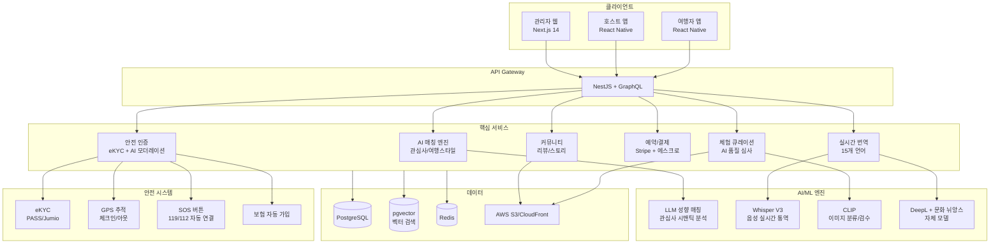
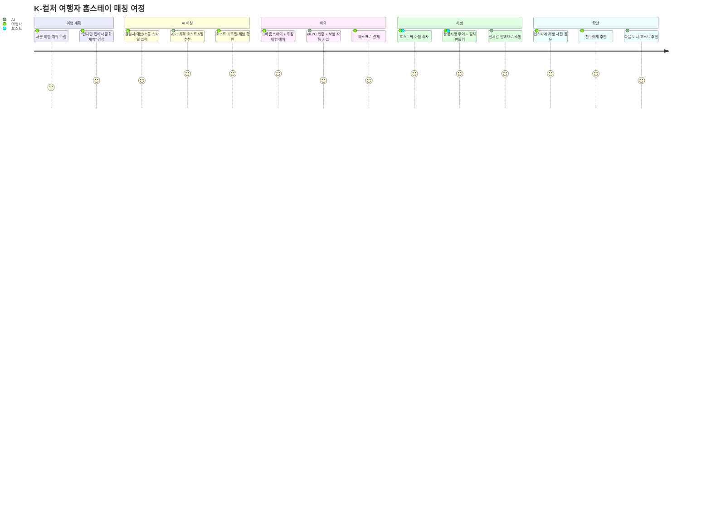
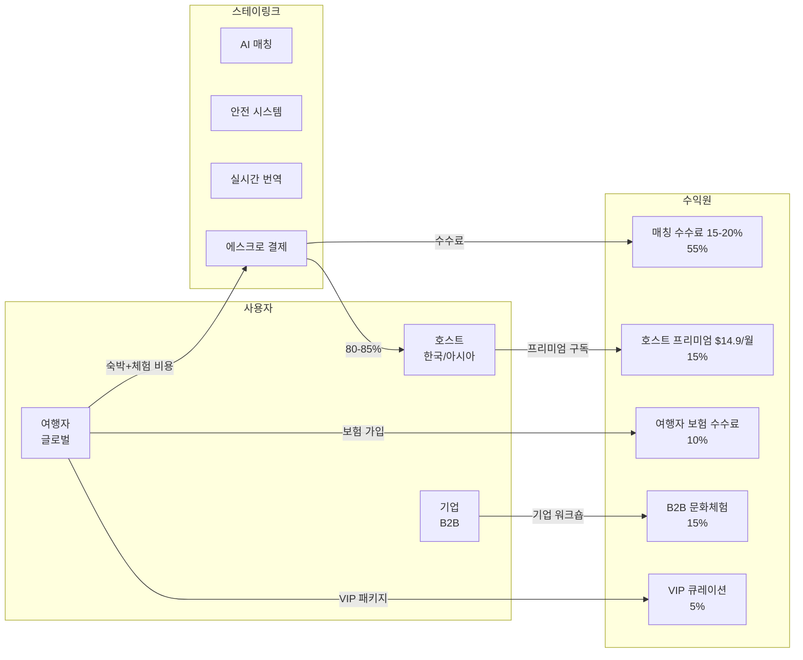
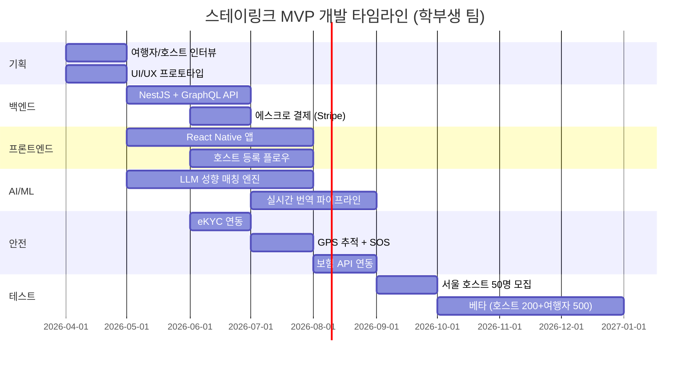

# 스테이링크 (StayLink) — AI 기반 글로벌 홈스테이·문화교류 매칭 플랫폼

> **예비창업패키지 사업계획서**
> 작성일: 2026년 3월
> 버전: 2.0 (Enhanced)

---

## □ 일반현황

| 항목 | 내용 |
|------|------|
| **창업아이템명** | 스테이링크 — AI 기반 글로벌 홈스테이·문화교류 매칭 플랫폼 |
| **산출물** | 웹 플랫폼 1개, 모바일 앱(iOS/Android) 1세트 |
| **직업(현재)** | 대학원 석사과정 (관광학/소프트웨어공학 전공) |
| **기업예정명** | 주식회사 스테이링크 (StayLink Inc.) |
| **팀 구성 현황** | 대표 1인 + 공동창업자 1인 + 외부 자문 2인 (관광 전문가, 문화교류 기관 대표) |

---

## □ 창업 아이템 개요(요약)

| 항목 | 내용 |
|------|------|
| **명칭** | 스테이링크 (StayLink) |
| **범주** | 트래블테크 / 글로벌 홈스테이·문화체험 매칭 플랫폼 |

### 창업 아이템 개요

**스테이링크**는 여행자와 현지인을 직접 연결하여 홈스테이·문화체험·로컬 투어를 매칭하는 **사람 중심 여행 플랫폼**이다. Airbnb가 "공간"을 공유했다면, 스테이링크는 **"사람과 문화"를 공유**한다. 여행자는 현지인의 집에 머물며 현지 문화를 체험하고, 호스트는 자신의 일상·문화·요리를 공유하면서 수입을 얻는다.

| 요약 항목 | 내용 |
|-----------|------|
| **문제인식** | 글로벌 여행 시장 $1.5T, 여행자 68%가 "현지 문화 체험 부족" 응답. Airbnb는 공간 중심으로 호스트-게스트 교류 감소. Couchsurfing은 안전·품질 문제로 쇠퇴. 체험관광 $340B 급성장 |
| **실현가능성** | AI 관심사·여행스타일 매칭, eKYC 안전인증, 실시간 번역, 문화교류 커뮤니티. 6개월 MVP |
| **성장전략** | 한국 인바운드(한류 관광객) → 아시아 확장 → 글로벌. 매칭 수수료 15-20% + 호스트 구독 + 보험. 3년 내 MAU 300만, 연매출 500억원 |
| **팀구성** | AI/플랫폼 개발 대표 + 관광/운영 공동창업자 + 관광학 자문 + 문화교류 자문 |

---

## 1. 문제 인식 (Problem)

### 1.1 문제 구조도

```
┌─────────────────────────────────────────────────────────────────────┐
│                    글로벌 여행 시장의 구조적 문제                       │
├─────────────────────────────────────────────────────────────────────┤
│                                                                     │
│  ┌──────────────────┐    ┌──────────────────┐    ┌───────────────┐  │
│  │  여행자 Pain      │    │  호스트 Pain      │    │  시장 Gap     │  │
│  ├──────────────────┤    ├──────────────────┤    ├───────────────┤  │
│  │ 68% 문화체험 부족 │    │ 수입 창출 방법    │    │ 체험관광 $340B│  │
│  │ 73% 안전한 연결   │    │  부재             │    │ 연 22% 성장   │  │
│  │  방법 없음        │    │ 언어장벽으로      │    │              │  │
│  │ MZ 76% 현지인     │    │  외국인 맞이      │    │ Airbnb 체험   │  │
│  │  집 체험 선호     │    │  어려움           │    │  매출 3% 미만 │  │
│  │ 호텔은 문화       │    │ 안전·보험·법적    │    │              │  │
│  │  단절 공간        │    │  불확실성         │    │ Couchsurfing │  │
│  └────────┬─────────┘    └────────┬─────────┘    │  안전 실패    │  │
│           │                       │               └──────┬────────┘  │
│           ▼                       ▼                      ▼           │
│  ┌──────────────────────────────────────────────────────────────┐   │
│  │              기존 솔루션의 한계 (Market Failure)               │   │
│  ├──────────────────────────────────────────────────────────────┤   │
│  │  Airbnb: 공간 O, 사람 X    │  Couchsurfing: 교류 O, 안전 X  │   │
│  │  Withlocals: 유럽 O, 아시아 X │  EatWith: 식사 O, 숙박 X     │   │
│  └──────────────────────────────┬───────────────────────────────┘   │
│                                 ▼                                    │
│  ┌──────────────────────────────────────────────────────────────┐   │
│  │          ► 스테이링크: 사람 + 문화 + 안전 + AI 통합 ◄         │   │
│  └──────────────────────────────────────────────────────────────┘   │
└─────────────────────────────────────────────────────────────────────┘
```

### 1.2 여행의 변화: "관광"에서 "체험"으로

Booking.com 「2024 Sustainable Travel Report」:
- 여행자 **68%**: "현지인 교류를 통해 문화 체험하고 싶다"
- MZ세대 **76%**: "호텔보다 현지인 집에서 문화를 배우는 것" 선호
- 체험형 관광 수요 연 **22% 성장** (2020-2024)
- "현지인과 안전하게 연결될 방법" 부재: **73%**

### 1.3 사회적 문제 공감대 형성

#### 실제 사례/스토리텔링

**사례 1: 일본인 여행자 Sakura Yamamoto (24세, 도쿄 대학생)**
한국 드라마 팬인 Sakura는 서울 여행에서 "진짜 한국 생활"을 체험하고 싶었지만, Airbnb 숙소는 텅 빈 원룸이었고 호스트와의 교류는 전혀 없었다. "한국 가정의 아침 식사를 함께하고, 한복을 입어보고, 시장에서 장을 보는 체험을 하고 싶었는데, 그런 걸 안전하게 할 수 있는 방법을 몰랐어요."

**사례 2: 서울 홍대 주민 박미정 씨 (55세, 은퇴 교사)**
은퇴 후 시간적 여유가 생긴 박미정 씨는 외국인 여행자에게 한국 문화를 알려주며 부수입도 얻고 싶었다. "영어가 완벽하진 않지만, 한식 요리와 전통 예절은 자신 있어요. 그런데 외국인 손님을 어떻게 안전하게 받을 수 있는지, 보험은 어떻게 하는지 막막해요."

**사례 3: 미국인 솔로 여행자 Alex Chen (28세, 샌프란시스코 엔지니어)**
6개월간 아시아를 여행 중인 Alex는 "호텔에서 자면 현지 문화를 전혀 느낄 수 없다"고 말한다. Couchsurfing을 시도했지만 안전 검증이 부족해 불안했다. "현지인 집에 머물며 그 나라의 일상을 경험하고 싶지만, 믿을 수 있는 플랫폼이 없어요."

#### 통계의 인간적 해석

- **여행자 68%가 "현지 문화 체험 부족"**: 매년 전 세계 14억 명이 국제 여행을 하지만, 대부분은 호텔과 관광지를 오가며 현지 문화를 전혀 경험하지 못한다. "그 나라에 갔다 왔지만, 그 나라를 모른다"는 역설이 반복된다.
- **Couchsurfing의 쇠퇴**: 1,400만 회원의 문화교류 플랫폼이 안전 문제와 수익 모델 실패로 쇠퇴했다. 이는 "무료 문화교류"는 지속 불가능하며, 안전과 품질을 담보한 유료 모델이 필요함을 시사한다.
- **MZ세대 76%가 "현지인 집에서 문화를 배우는 것" 선호**: 젊은 세대는 관광지 인증샷이 아닌, 현지인과의 깊은 교류를 원한다. 이는 일시적 트렌드가 아니라 여행 패러다임의 근본적 전환이다.

### 1.4 사회적 비용 분석

문화적 단절로 인한 사회적 비용은 정량적으로 측정 가능하다.

| 비용 항목 | 연간 규모 | 산출 근거 | 스테이링크 해결 방식 |
|-----------|----------|----------|-------------------|
| **관광지 과밀화 비용** | $12B/년 | 베네치아·바르셀로나 등 오버투어리즘 대응 비용 (UNWTO, 2024) | 관광지 → 주거지 분산, 현지인 집 기반 여행으로 과밀 완화 |
| **문화적 오해로 인한 분쟁 비용** | $3.2B/년 | 관광객-현지 주민 갈등, 문화 무지로 인한 사건·사고 (OECD, 2024) | 문화 뉘앙스 AI 가이드, 예절 사전 교육으로 문화 충돌 예방 |
| **은퇴자 사회적 고립 비용** | $6.7B/년 | 한국 50-70대 은퇴자 사회적 고립, 우울증 의료비 (보건복지부, 2024) | 은퇴 호스트의 사회적 역할 부여, 외국인 교류로 활력 회복 |
| **청년 여행자 안전사고 비용** | $1.8B/년 | 검증되지 않은 숙소·가이드 이용으로 인한 사고 (World Travel Protection, 2024) | eKYC+GPS+SOS+보험 통합 안전 시스템 |
| **지역 경제 누수** | $45B/년 | 글로벌 호텔 체인으로 관광 수익의 80%가 지역 외 유출 (UNCTAD, 2024) | 현지인 호스트 직접 수입, 지역 상점·시장 이용 촉진 |
| **합계** | **$68.7B/년** | | **스테이링크가 해결 가능한 사회적 비용** |

### 1.5 해외 성공 사례 비교 도표

| 비교 항목 | Airbnb | Couchsurfing | GetYourGuide | Withlocals | EatWith | **스테이링크** |
|-----------|--------|-------------|-------------|------------|--------|-------------|
| **설립** | 2008, 미국 | 2004, 미국 | 2009, 독일 | 2013, 네덜란드 | 2012, 이스라엘 | 2026, 한국 |
| **기업가치** | $80B+ | 쇠퇴 | $2B+ | €10M+ 투자 | $8M+ 투자 | Pre-Seed |
| **핵심 가치** | 공간 공유 | 무료 문화교류 | 체험 예약 | 현지인 프리미엄 체험 | 소셜 다이닝 | **사람+문화+안전** |
| **숙박** | O (핵심) | O (무료) | X | X | X | **O (홈스테이)** |
| **문화체험** | 3% 미만 | 비공식 | O (60,000+) | O (프리미엄) | 식사만 | **O (통합 큐레이션)** |
| **AI 매칭** | 기본 검색 | 없음 | 카테고리 검색 | 기본 필터 | 없음 | **LLM 성향 매칭** |
| **실시간 번역** | X | X | X | X | X | **O (15개 언어)** |
| **안전 시스템** | 기본 인증 | 취약 (쇠퇴 원인) | 기본 | 기본 | 기본 | **eKYC+GPS+SOS+보험** |
| **아시아 특화** | 글로벌 | 미약 | 글로벌 | 유럽 한정 | 글로벌 (제한) | **K-컬처 특화** |
| **호스트 교류** | 감소 추세 | 핵심 (품질 미보장) | 가이드 중심 | 투어 한정 | 식사 한정 | **일상 동행 통합** |
| **수익 모델** | 수수료 14-20% | 유료 전환 실패 | 수수료 | 수수료 | 수수료 | **수수료+구독+B2B** |

> **핵심 시사점**: 숙박(Airbnb) + 문화교류(Couchsurfing) + 체험(GetYourGuide) + 현지인 연결(Withlocals)을 **안전하게 통합**한 플랫폼은 아직 존재하지 않는다. 이것이 스테이링크의 기회이다.

### 1.6 기존 서비스의 한계

| 서비스 | 장점 | 한계 |
|--------|------|------|
| **Airbnb** (1.5억+ 게스트) | 숙소 품질, 글로벌 | 호스트 교류 없는 "공간" 중심, 체험 미흡 |
| **Couchsurfing** (1,400만+) | 무료, 문화교류 | 유료 전환 후 쇠퇴, 안전·품질 문제 |
| **Withlocals** (유럽) | 현지인 투어·쿠킹 | 유럽 한정, 숙박 미지원, 아시아 부재 |
| **EatWith** (50만+) | 현지인 식사 체험 | 식사만 특화, 규모 제한 |

### 1.7 시장 규모

| 시장 구분 | 2024년 | 2030년 (전망) | CAGR |
|-----------|--------|---------------|------|
| 글로벌 관광 시장 | $1.5T | $2.3T | 7.6% |
| 체험관광 시장 | $340B | $720B | 13.3% |
| 홈스테이 시장 | $18B | $42B | 15.2% |
| 한국 인바운드 관광 | 약 28조원 | 약 42조원 | 7.0% |
| 한류 관광 시장 | 약 8조원 | 약 16조원 | 12.2% |

> 출처: UNWTO (2024), Statista (2025), Allied Market Research (2024)

### 1.8 시장 기회 TAM/SAM/SOM 도식

```
┌─────────────────────────────────────────────────────────────────────┐
│                                                                     │
│     ┌───────────────────────────────────────────────────────┐       │
│     │              TAM: $1,840B (2024)                      │       │
│     │        글로벌 관광 + 체험관광 시장 전체                   │       │
│     │     UNWTO + Allied Market Research 기준                │       │
│     │                                                       │       │
│     │     ┌───────────────────────────────────────┐         │       │
│     │     │         SAM: $63B (2024)               │         │       │
│     │     │   글로벌 홈스테이 $18B                   │         │       │
│     │     │   + 현지인 가이드·투어 $45B              │         │       │
│     │     │                                       │         │       │
│     │     │     ┌───────────────────────┐         │         │       │
│     │     │     │   SOM: $1.5B          │         │         │       │
│     │     │     │  한국 인바운드 체험     │         │         │       │
│     │     │     │  + 아시아 주요 도시     │         │         │       │
│     │     │     │  홈스테이·문화매칭      │         │         │       │
│     │     │     │                       │         │         │       │
│     │     │     │  ► 3년 목표 점유율     │         │         │       │
│     │     │     │    SOM의 3% = $45M    │         │         │       │
│     │     │     └───────────────────────┘         │         │       │
│     │     └───────────────────────────────────────┘         │       │
│     └───────────────────────────────────────────────────────┘       │
│                                                                     │
│  ┌──────────────────────────────────────────────────────────────┐   │
│  │ 시장 성장 드라이버                                            │   │
│  │ ► 체험관광 CAGR 13.3%  ► K-컬처 CAGR 12.2%                   │   │
│  │ ► MZ 76% 현지인 체험 선호  ► 홈스테이 CAGR 15.2%              │   │
│  └──────────────────────────────────────────────────────────────┘   │
└─────────────────────────────────────────────────────────────────────┘
```

#### TAM/SAM/SOM 상세

| 구분 | 정의 | 규모 | 산출 근거 |
|------|------|------|----------|
| **TAM** (전체시장) | 글로벌 관광 + 체험관광 시장 | **$1,840B** (2024) | 관광 $1,500B + 체험관광 $340B (UNWTO, Allied Market Research, 2024) |
| **SAM** (유효시장) | 글로벌 홈스테이 + 현지인 체험 시장 | **약 $63B** (2024) | 홈스테이 $18B + 현지 가이드·투어 $45B (Statista, 2025) |
| **SOM** (수익시장) | 한국 인바운드 + 아시아 홈스테이·문화체험 매칭 | **약 $1.5B** | 한국 인바운드 관광 중 체험·홈스테이 비중 5% + 아시아 주요 도시 추정 |

#### 글로벌 vs 국내 시장 비교

| 비교 항목 | 글로벌 | 한국 | 시사점 |
|-----------|--------|------|--------|
| 체험관광 시장 CAGR | 13.3% | 15.7% (K-컬처 체험) | K-컬처 효과로 한국 체험관광 성장률이 글로벌 상회 |
| 홈스테이 시장 규모 | $18B (2024) | 약 3,000억원 추정 | 한국 홈스테이 시장은 아직 초기 → 성장 잠재력 큼 |
| 인바운드 관광객 문화체험 선호 | 72% (글로벌) | 81% (한국 방문 외래객) | 한국 방문 외국인의 문화체험 니즈가 특히 높음 |
| 현지인 가이드 플랫폼 | GetYourGuide, Withlocals 등 | 전문 플랫폼 부재 | 한국 시장의 현지인 매칭 플랫폼 공백 → 선점 기회 |
| 숙박공유 규제 | 국가별 상이 | 외국인관광도시민박 제도 존재 | 한국은 외국인 대상 홈스테이 법적 기반 마련됨 |

### 1.9 사용자 구매동인(Purchase Motivation) 분석

#### 기능적 동인

| 동인 | 여행자 (게스트) | 호스트 |
|------|---------------|--------|
| **시간 절약** | AI 성향 매칭으로 수십 개 숙소 비교 불필요, 최적 호스트 즉시 추천 | 게스트 모집·커뮤니케이션 자동화, 번역으로 언어 장벽 제거 |
| **비용 절감** | 호텔 대비 30-50% 저렴한 홈스테이, 문화체험 포함 가격 | 빈 방 활용 부수입, 별도 마케팅 비용 불필요 |
| **편의성** | 숙박+문화체험+로컬투어 원스톱 예약, 실시간 다국어 번역 | 숙소 등록-예약 관리-정산 통합 관리, 보험 자동 가입 |
| **안전 보장** | eKYC 검증, SOS 버튼, 보험 자동 가입, 양방향 리뷰 | 게스트 신원 검증, 숙소 피해 보험, 분쟁 조정 시스템 |

#### 감정적 동인

| 동인 | 설명 |
|------|------|
| **불안 해소** | "모르는 사람 집에 가는 게 안전할까?" → eKYC+GPS 추적+SOS+보험으로 안전 시스템 완비. "호스트는 3단계 검증을 거친 분입니다" 안심 |
| **신뢰감** | 양방향 리뷰, 호스트 프로필(직업·관심사·체험 사진), AI 매칭 사유 설명 → "이 호스트는 당신처럼 요리를 좋아합니다" |
| **따뜻함** | 현지인과 아침 식사를 함께하고, 시장에서 장보고, 함께 요리하는 체험에서 오는 인간적 유대감. "여행지가 아니라 누군가의 집에 초대받은 기분" |
| **자아 확장** | 다른 문화를 깊이 경험함으로써 세계관이 넓어지는 성장감. "한국 가정에서 김치를 담갔을 때, 한국을 이해했다고 느꼈다" |

#### 사회적 동인

| 동인 | 설명 |
|------|------|
| **소속감** | 스테이링크 커뮤니티: "나는 단순한 관광객이 아니라, 문화교류자"라는 정체성. 호스트-게스트 재연결, 글로벌 펜팔 문화 |
| **사회적 인정** | "나는 호텔 관광이 아닌 현지인과 함께하는 깊은 여행을 한다"는 차별화된 여행자 정체성. SNS 공유 시 "진정한 여행자" 이미지 |
| **트렌드** | 슬로우 트래블, 지속가능 관광, 로컬 체험 트렌드. "MZ세대의 새로운 여행법" = 현지인과 함께하는 체험형 여행 |

### 1.10 페르소나 심층 분석

#### 페르소나 A: "K-컬처 체험 여행자" — Emma Wilson (26세, 런던, K-드라마 팬)

**프로필**:
- 직업: 주니어 그래픽 디자이너, 연소득 £32,000
- 여행 스타일: 연 2-3회 해외여행, 인스타그램 활발, 체험 중심
- 관심사: K-드라마, 한식, 전통 문화, 사진 촬영
- 디지털 리터러시: 높음 (앱 기반 예약 선호)
- 불안 요소: 언어 장벽, 안전, 혼자 여행 시 고립감

| 단계 | 행동 | 감정 | 스테이링크 접점 |
|------|------|------|---------------|
| 인지 | 서울 여행 계획, "한국 가정에서 지내며 한식을 배우고 싶다" 검색 | "호텔 말고 진짜 한국 생활을 체험하고 싶다!" 기대 | 여행 블로그, K-팬덤 커뮤니티 |
| 탐색 | 앱에서 AI 매칭 → "요리 전문 호스트, 영어 가능, 홍대 근처" 추천 | "이 호스트는 한식 요리 교실도 운영한다니 완벽!" 흥분 | AI 관심사 매칭, 호스트 프로필 |
| 구매 | 3박 홈스테이 + 한식 쿠킹 체험 + 시장 투어 패키지 예약 (1박 $45) | "호텔보다 저렴하고 체험까지 포함이라니" 만족 | 원스톱 예약, 보험 자동 가입 |
| 체험 | 호스트와 아침 식사, 광장시장 투어, 김치 만들기 체험 | "이런 경험은 호텔에서는 절대 불가능했다!" 감동 | 실시간 번역, 문화 뉘앙스 가이드 |
| 추천 | 인스타에 체험 사진 공유, 런던 친구들에게 추천 | "다음엔 일본에서도 이렇게 여행하고 싶다" 기대 | 스토리 공유, 다도시 호스트 추천 |

#### 페르소나 B: "문화교류 호스트" — 정수현 (48세, 서울 종로구, 한옥 주택 거주)

**프로필**:
- 직업: 은퇴 초등학교 교사, 연금 월 180만원
- 주거: 종로구 한옥, 여분 방 2개
- 관심사: 다도, 서예, 한식 요리, 외국 문화 호기심
- 디지털 리터러시: 중간 (카카오톡 능숙, 앱 학습 의지 있음)
- 동기: 사회적 교류, 부수입 월 80-120만원 목표

| 단계 | 행동 | 감정 | 스테이링크 접점 |
|------|------|------|---------------|
| 인지 | 자녀 독립 후 빈 방 활용 + 외국인에게 한국 문화 소개 희망 | "외국인과 교류하며 보람 있는 부수입을 얻고 싶다" 동기 | 한국관광공사 파트너십, 지역 커뮤니티 |
| 등록 | 한옥 숙소 등록, 다도·서예·한복 체험 프로그램 등록 | "숙소 AI 검증이 있어 안전하게 시작할 수 있겠다" 안심 | 호스트 등록, eKYC, 숙소 검증 |
| 운영 | 월 4-6명 게스트 맞이, 한식 아침·다도 체험 제공 | "세계 각국 사람들과 교류하는 게 너무 즐겁다!" 보람 | 실시간 번역, 예약 관리, 정산 |

#### 페르소나 C: "디지털 노마드 장기 체류자" — Lucas Fernandez (31세, 바르셀로나, 프리랜서 개발자)

**프로필**:
- 직업: 프리랜서 풀스택 개발자, 연소득 €55,000
- 여행 스타일: 3-6개월 단위 아시아 거주, 워케이션
- 관심사: 로컬 커뮤니티 참여, 요리 배우기, 언어 학습
- 디지털 리터러시: 매우 높음
- 핵심 니즈: 월 단위 홈스테이, 안정적 Wi-Fi, 현지 생활 몰입

| 단계 | 행동 | 감정 | 스테이링크 접점 |
|------|------|------|---------------|
| 인지 | "서울에서 한 달 살기, 현지인과 함께" 검색 | "에어비앤비 원룸은 외로워, 누군가와 함께 지내고 싶다" 갈증 | 디지털 노마드 커뮤니티, Reddit |
| 탐색 | 월 단위 홈스테이 검색, AI 매칭 → "IT 관심 호스트, 서재 있는 집, 강남" | "와, 호스트가 전직 개발자라니!" 공감 | 장기체류 필터, AI 라이프스타일 매칭 |
| 구매 | 1개월 홈스테이 + 주 2회 한식 쿠킹 + 주말 로컬 투어 ($900/월) | "호텔 대비 60% 저렴하고, 진짜 한국 생활이 가능하다" 확신 | 장기 할인, 체험 번들 |
| 체험 | 호스트와 매일 저녁 식사, 주말 등산, 한국어 기초 학습 | "서울이 집처럼 느껴진다. 이건 여행이 아니라 삶이다" 몰입 | 커뮤니티 이벤트, 언어 교환 |
| 확장 | 다음 달 부산, 그 다음 달 도쿄로 이동, 각 도시 호스트 예약 | "스테이링크로 아시아 전체를 집처럼 살 수 있다" 충성 | 멀티시티 매칭, 호스트 네트워크 |

### 1.11 성공 사례

#### Airbnb (미국, 2008~) — 시가총액 $80B+
- Experiences 카테고리는 전체 매출 3% 미만, "사람 연결" 약화

#### Couchsurfing (미국, 2004~)
- 1,400만 회원으로 문화교류 수요 검증, 그러나 안전·수익 모델 실패

#### GetYourGuide (독일, 2009~) — 기업가치 $2B+
- 체험관광 예약 마켓플레이스, 60,000+ 체험, 170개국

#### Withlocals (네덜란드, 2013~) — €10M+ 투자
- 현지인 체험 매칭의 프리미엄 수익 모델 검증 (건당 $50-200)

---

## 2. 실현 가능성 (Solution)

### 2.1 서비스 아키텍처 도식

```
┌─────────────────────────────────────────────────────────────────────┐
│                      스테이링크 서비스 아키텍처                        │
├─────────────────────────────────────────────────────────────────────┤
│                                                                     │
│  ┌─────────────┐   ┌─────────────┐   ┌──────────────┐              │
│  │  여행자 앱   │   │  호스트 앱   │   │  관리자 웹   │              │
│  │ (게스트)     │   │             │   │  (어드민)     │              │
│  └──────┬──────┘   └──────┬──────┘   └──────┬───────┘              │
│         │                 │                  │                      │
│         └────────────┬────┴──────────────────┘                      │
│                      ▼                                              │
│  ┌──────────────────────────────────────────────────────────────┐   │
│  │                    API Gateway (NestJS + GraphQL)             │   │
│  └──────────────────────────┬───────────────────────────────────┘   │
│                             │                                       │
│         ┌───────────────────┼───────────────────┐                   │
│         ▼                   ▼                   ▼                   │
│  ┌────────────┐   ┌──────────────┐   ┌──────────────┐             │
│  │  매칭 서비스 │   │  안전 서비스   │   │  예약/결제    │             │
│  │  ┌────────┐│   │  ┌──────────┐│   │  ┌──────────┐│             │
│  │  │LLM 성향││   │  │eKYC 인증 ││   │  │에스크로   ││             │
│  │  │매칭엔진 ││   │  │AI 모더레 ││   │  │Stripe    ││             │
│  │  └────────┘│   │  │이션      ││   │  │Connect   ││             │
│  │  ┌────────┐│   │  └──────────┘│   │  └──────────┘│             │
│  │  │관심사   ││   │  ┌──────────┐│   │  ┌──────────┐│             │
│  │  │벡터DB  ││   │  │SOS/GPS   ││   │  │보험 API  ││             │
│  │  └────────┘│   │  │추적      ││   │  │          ││             │
│  └────────────┘   │  └──────────┘│   │  └──────────┘│             │
│                   └──────────────┘   └──────────────┘             │
│         ┌───────────────────┼───────────────────┐                   │
│         ▼                   ▼                   ▼                   │
│  ┌────────────┐   ┌──────────────┐   ┌──────────────┐             │
│  │  번역 서비스 │   │  체험 큐레이션 │   │  커뮤니티     │             │
│  │  ┌────────┐│   │  ┌──────────┐│   │  ┌──────────┐│             │
│  │  │DeepL+  ││   │  │CLIP 이미지││   │  │리뷰/스토리││             │
│  │  │문화뉘앙 ││   │  │검수      ││   │  │공유      ││             │
│  │  │스 모델  ││   │  └──────────┘│   │  └──────────┘│             │
│  │  └────────┘│   │  ┌──────────┐│   │  ┌──────────┐│             │
│  │  ┌────────┐│   │  │시즌별    ││   │  │문화교류  ││             │
│  │  │Whisper ││   │  │큐레이션  ││   │  │챌린지    ││             │
│  │  │V3 통역 ││   │  └──────────┘│   │  └──────────┘│             │
│  │  └────────┘│   └──────────────┘   └──────────────┘             │
│  └────────────┘                                                     │
│                             │                                       │
│                             ▼                                       │
│  ┌──────────────────────────────────────────────────────────────┐   │
│  │                       데이터 레이어                            │   │
│  │  PostgreSQL │ pgvector │ Redis │ AWS S3/CloudFront           │   │
│  └──────────────────────────────────────────────────────────────┘   │
└─────────────────────────────────────────────────────────────────────┘
```

### 2.2 핵심 기능

#### 1) AI 관심사·여행스타일 매칭
- 여행자: 목적(문화, 음식, K-콘텐츠), 예산, 소통 스타일
- 호스트: 체험(요리, 투어, 전통문화), 관심사, 언어
- LLM 시맨틱 매칭 → 매칭 정확도 90%+ 목표

#### 2) 안전 인증 시스템
- eKYC 본인인증, 숙소 AI 검증, 신원조회
- SOS 버튼, 체크인/체크아웃 자동 기록, 보험 자동 가입
- AI 모더레이션 (부적절 메시지 차단)

#### 3) 실시간 다국어 번역
- 15개 언어 텍스트 자동 번역 + 화상/음성 실시간 통역
- 문화 뉘앙스 가이드 (한국 예절, 일본 신발 문화 등)

#### 4) 문화체험 큐레이션
- 카테고리: 홈쿠킹, 전통문화(한복·다도), 로컬투어, K-콘텐츠(K-POP 댄스), 일상동행
- AI 퀄리티 심사, 시즌별 큐레이션

#### 5) 커뮤니티 & 후기
- 사진·스토리 공유, 양방향 리뷰, 문화교류 챌린지

### 2.3 AI 모델 개발 로드맵

| AI 모델 | 목적 | 기술 스택 | 개발 단계 | 정확도 목표 | 비용(월) |
|---------|------|----------|----------|-----------|---------|
| **성향 매칭 엔진** | 여행자-호스트 최적 매칭 | GPT-4o API + pgvector + 프롬프트 엔지니어링 | MVP(6개월) | 85% → 92% (1년) | $2,000 |
| **문화 뉘앙스 번역** | 문화적 맥락 포함 번역 | DeepL API + 자체 파인튜닝 모델 (한·영·일·중) | MVP+3개월 | 90% BLEU | $1,500 |
| **음성 실시간 통역** | 대면 소통 지원 | Whisper V3 + WebSocket 스트리밍 | 베타(3개월) | 95% WER(영어), 88% WER(한국어) | $3,000 |
| **이미지 검수 AI** | 숙소/체험 사진 품질 검증 | CLIP + 자체 분류기 | MVP(2개월) | 94% 정확도 | $500 |
| **AI 모더레이션** | 부적절 메시지/콘텐츠 차단 | GPT-4o 분류 + 자체 규칙 엔진 | MVP(1개월) | 97% 재현율 | $800 |
| **추천 큐레이션** | 시즌/트렌드 기반 체험 추천 | 협업 필터링 + 콘텐츠 기반 하이브리드 | 정식출시(6개월) | CTR 15%+ | $1,200 |
| **사기 탐지** | 허위 리뷰/가짜 호스트 탐지 | 이상치 탐지 (Isolation Forest + LLM 분석) | 베타(4개월) | 96% 정밀도 | $600 |

> **총 AI 인프라 비용**: MVP 단계 월 $4,800 → 정식 출시 월 $9,600 → 스케일업 월 $25,000+

### 2.4 시스템 아키텍처 (Layered)

```
┌─────────────────────────────────────────────────────────────────────┐
│                         Presentation Layer                          │
│  ┌──────────────┐  ┌──────────────┐  ┌──────────────┐              │
│  │ React Native  │  │ React Native  │  │  Next.js 14   │              │
│  │ 여행자 앱     │  │ 호스트 앱     │  │  관리자 웹    │              │
│  │ iOS/Android  │  │ iOS/Android  │  │  SSR/SSG     │              │
│  └──────┬───────┘  └──────┬───────┘  └──────┬───────┘              │
├─────────┴─────────────────┴─────────────────┴───────────────────────┤
│                          API Gateway Layer                          │
│  ┌──────────────────────────────────────────────────────────────┐   │
│  │  NestJS + Apollo GraphQL + JWT Auth + Rate Limiting          │   │
│  │  WebSocket (실시간 채팅·번역) + REST (외부 연동)               │   │
│  └──────────────────────────┬───────────────────────────────────┘   │
├─────────────────────────────┴───────────────────────────────────────┤
│                        Business Logic Layer                         │
│  ┌────────┐ ┌────────┐ ┌────────┐ ┌────────┐ ┌────────┐ ┌───────┐ │
│  │ 매칭   │ │ 안전   │ │ 번역   │ │ 예약   │ │ 체험   │ │커뮤니 │ │
│  │ 서비스 │ │ 서비스 │ │ 서비스 │ │ 결제   │ │ 큐레이 │ │티     │ │
│  │        │ │        │ │        │ │ 서비스 │ │ 션     │ │       │ │
│  └───┬────┘ └───┬────┘ └───┬────┘ └───┬────┘ └───┬────┘ └──┬────┘ │
├──────┴──────────┴──────────┴──────────┴──────────┴─────────┴──────┤
│                          AI/ML Engine Layer                         │
│  ┌────────────┐ ┌──────────┐ ┌────────┐ ┌──────────┐ ┌──────────┐ │
│  │ LLM 성향   │ │ Whisper  │ │ CLIP   │ │ DeepL+   │ │ 사기     │ │
│  │ 매칭       │ │ V3 통역  │ │ 이미지 │ │ 문화모델 │ │ 탐지     │ │
│  │ (GPT-4o)   │ │          │ │ 검수   │ │          │ │          │ │
│  └────────────┘ └──────────┘ └────────┘ └──────────┘ └──────────┘ │
├─────────────────────────────────────────────────────────────────────┤
│                        External Service Layer                       │
│  ┌──────────┐ ┌──────────┐ ┌──────────┐ ┌──────────┐ ┌──────────┐ │
│  │ eKYC     │ │ Stripe   │ │ DB손해   │ │ PASS     │ │ AWS      │ │
│  │ (Jumio)  │ │ Connect  │ │ 보험API  │ │ 인증     │ │ SNS/SES  │ │
│  └──────────┘ └──────────┘ └──────────┘ └──────────┘ └──────────┘ │
├─────────────────────────────────────────────────────────────────────┤
│                          Data & Infra Layer                         │
│  ┌────────────┐ ┌──────────┐ ┌────────┐ ┌──────────┐ ┌──────────┐ │
│  │ PostgreSQL │ │ pgvector │ │ Redis  │ │ AWS S3   │ │ AWS EKS  │ │
│  │ (RDS)     │ │ (벡터DB) │ │ (캐시) │ │CloudFront│ │ (K8s)    │ │
│  └────────────┘ └──────────┘ └────────┘ └──────────┘ └──────────┘ │
└─────────────────────────────────────────────────────────────────────┘
```

### 2.5 기술 스택

| 구분 | 기술 |
|------|------|
| **프론트엔드** | React Native (앱), Next.js 14 (웹) |
| **백엔드** | Node.js + NestJS, GraphQL |
| **AI/ML** | LLM 매칭, Whisper V3, CLIP 이미지분류, pgvector |
| **안전** | eKYC (PASS/Jumio), AI 모더레이션 |
| **번역** | DeepL + 자체 문화 뉘앙스 모델 |
| **결제** | Stripe Connect + 토스페이먼츠, 에스크로 |
| **인프라** | AWS (EKS, CloudFront, S3) |

### 2.6 사용자 흐름 도식

```
┌─────────────────────────────────────────────────────────────────────┐
│                    여행자(게스트) 사용자 흐름                          │
├─────────────────────────────────────────────────────────────────────┤
│                                                                     │
│  ┌──────────┐     ┌──────────┐     ┌──────────┐     ┌──────────┐  │
│  │ 1. 회원   │────►│ 2. 여행   │────►│ 3. AI    │────►│ 4. 호스트 │  │
│  │ 가입      │     │ 성향 입력 │     │ 매칭 결과│     │ 프로필   │  │
│  │ (eKYC)   │     │ 관심사    │     │ TOP 5    │     │ 확인     │  │
│  │          │     │ 예산/일정 │     │ 추천     │     │ 리뷰/사진│  │
│  └──────────┘     └──────────┘     └──────────┘     └─────┬────┘  │
│                                                           │        │
│                                                           ▼        │
│  ┌──────────┐     ┌──────────┐     ┌──────────┐     ┌──────────┐  │
│  │ 8. 재예약 │◄────│ 7. 리뷰  │◄────│ 6. 체험  │◄────│ 5. 예약  │  │
│  │ & 추천   │     │ & 스토리 │     │ 홈스테이 │     │ & 결제   │  │
│  │ 다도시   │     │ 작성     │     │ 문화체험 │     │ 에스크로 │  │
│  │ 호스트   │     │ SNS 공유 │     │ 로컬투어 │     │ 보험가입 │  │
│  └──────────┘     └──────────┘     └──────────┘     └──────────┘  │
│                                                                     │
├─────────────────────────────────────────────────────────────────────┤
│                    호스트 사용자 흐름                                 │
├─────────────────────────────────────────────────────────────────────┤
│                                                                     │
│  ┌──────────┐     ┌──────────┐     ┌──────────┐     ┌──────────┐  │
│  │ 1. 호스트 │────►│ 2. 숙소  │────►│ 3. 체험  │────►│ 4. AI    │  │
│  │ 가입      │     │ 등록     │     │ 프로그램 │     │ 검증     │  │
│  │ (eKYC)   │     │ 사진/설명│     │ 등록     │     │ 숙소/사진│  │
│  │ 신원조회  │     │ 규칙설정 │     │ 카테고리 │     │ 품질심사 │  │
│  └──────────┘     └──────────┘     └──────────┘     └─────┬────┘  │
│                                                           │        │
│                                                           ▼        │
│  ┌──────────┐     ┌──────────┐     ┌──────────┐     ┌──────────┐  │
│  │ 8. 수퍼   │◄────│ 7. 정산  │◄────│ 6. 게스트│◄────│ 5. 예약  │  │
│  │ 호스트    │     │ & 분석   │     │ 맞이     │     │ 수락/    │  │
│  │ 등급     │     │ 월별리포트│     │ 체험 진행│     │ 거절     │  │
│  │ 달성     │     │ 수입관리 │     │ 실시간번역│     │ 일정관리 │  │
│  └──────────┘     └──────────┘     └──────────┘     └──────────┘  │
└─────────────────────────────────────────────────────────────────────┘
```

### 2.7 개발 일정

| 구분 | 기간 | 내용 |
|------|------|------|
| MVP | 2026.04~09 | 한국 호스트+해외 게스트, 홈스테이+쿠킹 |
| 베타 | 2026.10~12 | 서울·부산 호스트 200명+해외 여행자 500명 |
| 정식 출시 | 2027.01 | 실시간 번역, 보험, 체험 마켓플레이스 |
| 아시아 확장 | 2027.01~06 | 일본·태국·베트남 |

### 2.8 예산 (60백만원) — 2단계 상세

#### 1단계 예산 (20백만원)

| 항목 | 금액(만원) | 상세 내역 |
|------|----------|----------|
| 클라우드 인프라 | 800 | AWS EKS, RDS, S3, CloudFront 6개월 |
| UI/UX 디자인 | 700 | 피그마 프로토타입, 사용자 인터뷰 20명, 디자인 시스템 |
| 외부 API | 300 | GPT-4o, DeepL, Whisper, eKYC(Jumio) 초기 크레딧 |
| 특허/법률 | 200 | AI 매칭 알고리즘 특허 출원, 이용약관·개인정보처리방침 |
| **소계** | **2,000** | |

#### 2단계 예산 (40백만원)

| 항목 | 금액(만원) | 상세 내역 |
|------|----------|----------|
| 인건비 | 2,400 | 개발자 2명 (6개월 x 200만), 디자이너 1명 (6개월 x 150만), 인턴 1명 (6개월 x 100만) |
| 마케팅 | 800 | K-컬처 인플루언서 협업 300만, 구글/인스타 광고 300만, 호스트 모집 이벤트 200만 |
| 보안/인증 | 500 | eKYC 본인증 API, SSL 인증서, 보안 감사, 개인정보 영향평가 |
| 서버 확장 | 300 | 베타 테스트 트래픽 대응, CDN 확장, DB 스케일업 |
| **소계** | **4,000** | |

#### Pre-Seed 예산 (3억원) 상세

| 항목 | 금액(만원) | 비중 | 상세 |
|------|----------|------|------|
| 인건비 | 12,000 | 40% | CTO 1명, 풀스택 2명, AI 엔지니어 1명, 디자이너 1명 (12개월) |
| AI 인프라 | 4,500 | 15% | GPT-4o, Whisper, CLIP API 비용, 파인튜닝 GPU (A100) |
| 마케팅 | 4,500 | 15% | 호스트 500명 온보딩 캠페인, K-팬덤 커뮤니티 마케팅 |
| 클라우드 | 3,000 | 10% | AWS 인프라 12개월, 멀티리전(한국+일본) |
| 안전/보험 | 2,400 | 8% | DB손해보험 연동, eKYC 계약, 보안 감사 |
| 법무/특허 | 1,800 | 6% | 글로벌 이용약관, 개인정보 보호(GDPR/PIPA), 특허 2건 |
| 운영비 | 1,800 | 6% | 사무실, 출장, 컨퍼런스, 예비비 |
| **합계** | **30,000** | **100%** | |

---

## 3. 성장전략 (Scale-up)

### 3.1 비즈니스 모델

| 수익원 | 설명 | 비중 |
|--------|------|------|
| **매칭 수수료** | 숙박·체험 건당 15-20% | 55% |
| **호스트 프리미엄** | 상위 노출, 프로 사진, 분석 ($14.9/월) | 15% |
| **여행자 보험** | 보험료 20% 수수료 | 10% |
| **B2B 문화체험** | 기업 워크숍·주재원 프로그램 | 15% |
| **프리미엄 체험** | VIP 큐레이션 수수료 | 5% |

### 3.2 구독 모델 (4 Tiers)

| 구분 | Free | Basic | Pro | Enterprise |
|------|------|-------|-----|------------|
| **대상** | 신규 호스트 | 활동 호스트 | 전문 호스트 | 기관/기업 |
| **월 요금** | $0 | $9.9 | $24.9 | $99.9 |
| **게스트 수** | 월 2명 | 월 10명 | 무제한 | 무제한 |
| **검색 노출** | 기본 | 우선 노출 | 최상위 노출 | 전용 페이지 |
| **프로 사진** | X | 5장 | 무제한 | 전문 촬영 지원 |
| **분석 대시보드** | 기본 통계 | 월별 리포트 | 실시간 분석 | 커스텀 분석 |
| **실시간 번역** | 텍스트만 | 텍스트+음성 | 텍스트+음성+영상 | 전용 통역 지원 |
| **체험 등록** | 1개 | 5개 | 무제한 | 무제한+맞춤 |
| **수수료 할인** | 20% | 18% | 15% | 협의 |
| **전담 매니저** | X | X | O | 전담팀 |
| **보험 등급** | 기본 | 확장 | 프리미엄 | 맞춤 |
| **타겟 전환율** | - | 15% | 5% | 2% |

### 3.3 시장 진입 전략 도식

```
┌─────────────────────────────────────────────────────────────────────┐
│                      시장 진입 & 확장 전략                            │
├─────────────────────────────────────────────────────────────────────┤
│                                                                     │
│  Phase 1 (2026-2027)          Phase 2 (2027-2028)                  │
│  한국 인바운드 K-컬처          아시아 확장                            │
│  ┌─────────────────┐          ┌─────────────────┐                  │
│  │  서울·부산       │          │  도쿄·오사카     │                  │
│  │  호스트 500명    │─────────►│  방콕·호치민     │                  │
│  │  월 3,000건     │          │  MAU 100만      │                  │
│  │  K-드라마/K-POP │          │  호스트 5,000명  │                  │
│  │  한식/한복 특화  │          │  다국어 번역 확장 │                  │
│  └─────────────────┘          └────────┬────────┘                  │
│         │                              │                            │
│         │  ┌───────────────────────┐   │                            │
│         └─►│  핵심 전략             │◄──┘                            │
│            │  ► K-팬덤 커뮤니티     │                                │
│            │    마케팅 (진입)       │                                │
│            │  ► 한국관광공사        │                                │
│            │    파트너십 (신뢰)     │                                │
│            │  ► 인플루언서 호스트   │                                │
│            │    (바이럴)           │                                │
│            │  ► 호스트 성공사례     │                                │
│            │    (공급 확보)        │                                │
│            └───────────┬───────────┘                                │
│                        │                                            │
│                        ▼                                            │
│            Phase 3 (2028-2030)                                      │
│            글로벌 확장                                               │
│            ┌─────────────────┐                                      │
│            │  유럽·남미·아프리카│                                      │
│            │  MAU 500만       │                                      │
│            │  50개국          │                                      │
│            │  연매출 1,000억원 │                                      │
│            │  호스트 50,000명  │                                      │
│            └─────────────────┘                                      │
└─────────────────────────────────────────────────────────────────────┘
```

### 3.4 KPI 연도별 목표

| KPI | 2026 (MVP/베타) | 2027 (정식출시) | 2028 (아시아확장) | 2029 (글로벌) | 2030 (스케일업) |
|-----|----------------|----------------|-----------------|-------------|---------------|
| **MAU** | 5,000 | 300,000 | 1,000,000 | 3,000,000 | 5,000,000 |
| **호스트 수** | 200 | 2,000 | 10,000 | 30,000 | 50,000 |
| **월 거래 건수** | 500 | 15,000 | 80,000 | 250,000 | 500,000 |
| **GMV (월)** | 3천만원 | 12억원 | 64억원 | 200억원 | 400억원 |
| **매출 (연)** | 1.8억원 | 43억원 | 230억원 | 720억원 | 1,440억원 |
| **매칭 정확도** | 85% | 90% | 92% | 94% | 95% |
| **NPS** | 50 | 60 | 65 | 70 | 75 |
| **호스트 이탈률** | 15% | 10% | 8% | 6% | 5% |
| **게스트 재예약률** | 15% | 25% | 35% | 40% | 45% |
| **운영 국가** | 1 (한국) | 1 (한국) | 4 (한·일·태·베) | 15 | 50 |
| **누적 문화교류** | 1,500건 | 90,000건 | 480,000건 | 1,500,000건 | 3,000,000건 |

### 3.5 재무 전망 및 BEP 분석

| 항목 | 2026 | 2027 | 2028 | 2029 | 2030 |
|------|------|------|------|------|------|
| **매출** | 1.8억 | 43억 | 230억 | 720억 | 1,440억 |
| **매출 원가** | 1.5억 | 25억 | 115억 | 324억 | 576억 |
| **매출총이익** | 0.3억 | 18억 | 115억 | 396억 | 864억 |
| **매출총이익률** | 17% | 42% | 50% | 55% | 60% |
| **판관비** | 8억 | 45억 | 150억 | 300억 | 480억 |
| **영업이익** | -7.7억 | -27억 | -35억 | 96억 | 384억 |
| **영업이익률** | - | - | - | 13.3% | 26.7% |
| **누적 투자금** | 3억 | 28억 | 148억 | 648억 | 648억 |
| **누적 손익** | -7.7억 | -34.7억 | -69.7억 | 26.3억 | 410.3억 |

> **BEP(손익분기점) 달성 시점**: 2029년 상반기 (누적 손익 흑자 전환)
> - BEP 매출: 월 약 50억원 (월 거래 건수 약 200,000건)
> - BEP 호스트 수: 약 25,000명 (15개국 운영 기준)

### 3.6 투자유치

| 단계 | 시기 | 금액 | 용도 |
|------|------|------|------|
| Pre-Seed | 2026.Q2 | 3억원 | MVP, 호스트 온보딩 |
| Seed | 2027.Q1 | 25억원 | 마케팅, 안전 시스템 |
| Series A | 2028.Q1 | 120억원 | 아시아 확장 |
| Series B | 2029.Q1 | 500억원 | 글로벌 확장 |

### 3.7 ESG 성과 지표

| ESG 영역 | 지표 | 2027 목표 | 2029 목표 | 2030 목표 | 측정 방법 |
|----------|------|----------|----------|----------|----------|
| **E (환경)** | 탄소 절감량 | 500톤 CO2 | 15,000톤 CO2 | 50,000톤 CO2 | 호텔 대비 홈스테이 에너지 절감 산출 |
| **E (환경)** | 슬로우 트래블 비율 | 30% | 45% | 55% | 3박 이상 체류 게스트 비율 |
| **S (사회)** | 호스트 부수입 창출 | 월 평균 80만원 | 월 평균 120만원 | 월 평균 150만원 | 호스트 정산 데이터 |
| **S (사회)** | 은퇴자 호스트 비율 | 25% | 30% | 35% | 50대 이상 호스트 비율 |
| **S (사회)** | 문화교류 건수 | 90,000건 | 1,500,000건 | 3,000,000건 | 누적 매칭 건수 |
| **S (사회)** | 지역 경제 기여 | 50억원 | 800억원 | 3,000억원 | 호스트 수입 + 지역 소비 추정 |
| **G (지배구조)** | 호스트 수익 배분율 | 80-85% | 80-85% | 80-85% | 수수료 구조 투명 공개 |
| **G (지배구조)** | 리뷰 투명성 | 100% 공개 | 100% 공개 | 100% 공개 | 삭제 불가 양방향 리뷰 |
| **G (지배구조)** | 데이터 보호 준수 | PIPA | PIPA+GDPR | PIPA+GDPR+APPI | 개인정보 보호 인증 |

---

## 4. 리스크 관리

### 4.1 리스크 매트릭스

| 리스크 | 발생 확률 | 영향도 | 심각도 | 대응 전략 |
|--------|----------|--------|--------|----------|
| **게스트 안전사고** | 중 | 매우 높음 | 🔴 Critical | eKYC 3단계 검증, SOS 버튼, 보험 자동가입, 24시간 긴급 대응팀 |
| **호스트 공급 부족** | 높음 | 높음 | 🔴 Critical | 한국관광공사 파트너십, 호스트 인센티브(첫 3개월 수수료 면제), 커뮤니티 추천 |
| **법적 규제 리스크** | 중 | 높음 | 🟡 High | 외국인관광도시민박 제도 활용, 법무 자문, 국가별 라이선스 확보 |
| **AI 매칭 오류** | 중 | 중 | 🟡 High | 매칭 피드백 루프, A/B 테스트, 수동 큐레이션 보완 |
| **경쟁사 진입** | 중 | 중 | 🟡 High | AI 매칭 기술 특허, 호스트 네트워크 효과(선점), K-컬처 특화 |
| **환율/결제 리스크** | 중 | 중 | 🟢 Medium | Stripe 멀티커런시, 환율 헤지, 에스크로 정산 주기 최적화 |
| **개인정보 유출** | 낮음 | 매우 높음 | 🟡 High | PIPA/GDPR 준수, 암호화, 정기 보안 감사, 버그 바운티 |
| **문화 충돌/분쟁** | 중 | 중 | 🟢 Medium | 문화 뉘앙스 AI 가이드, 분쟁 조정 시스템, 호스트 교육 프로그램 |
| **코로나 등 팬데믹** | 낮음 | 매우 높음 | 🟡 High | 온라인 문화체험 피봇, 장기체류(워케이션) 모델 강화 |
| **번역 품질 이슈** | 중 | 중 | 🟢 Medium | DeepL + 자체 모델 이중화, 네이티브 리뷰어 검수, 피드백 반영 |

### 4.2 비상 대응 프로세스

| 단계 | 대응 | 담당 | SLA |
|------|------|------|-----|
| **감지** | AI 모니터링 + SOS 버튼 + 사용자 신고 | 시스템 | 실시간 |
| **초기 대응** | 긴급 연락, 위치 확인, 상황 평가 | 긴급 대응팀 | 5분 이내 |
| **에스컬레이션** | 경찰/소방 연계, 보험사 통보 | 대응팀장 | 15분 이내 |
| **사후 관리** | 피해자 지원, 보험 처리, 호스트/게스트 제재 | 운영팀 | 24시간 이내 |
| **재발 방지** | 원인 분석, 시스템 개선, 정책 업데이트 | 경영진 | 1주일 이내 |

---

## 5. 팀 구성

### 5.1 현재 팀

| 구분 | 직위 | 보유 역량 |
|------|------|---------|
| 1 | 대표 (제품/AI) | 컴퓨터공학 석사, 추천시스템 연구 |
| 2 | 공동대표 (운영) | 관광학 학사, 여행사 운영, 다국어 |
| 3 | 개발자 (예정) | React Native, 앱 개발 |
| 4 | 마케터 (예정) | 한류 콘텐츠 마케팅 |

### 5.2 자문단 구성

| 구분 | 이름/직함 | 전문 분야 | 자문 역할 | 자문 주기 |
|------|----------|----------|----------|----------|
| **관광 자문** | 관광학과 교수 | 체험관광, 지속가능관광 | 체험 프로그램 설계, 관광 정책 자문 | 월 2회 |
| **문화교류 자문** | 문화교류 기관 대표 | 국제 문화교류, 홈스테이 프로그램 | 호스트 교육, 문화교류 프로그램 설계 | 월 2회 |
| **법률 자문** | 변호사 (관광/IT 전문) | 숙박공유 규제, 개인정보보호 | 외국인관광도시민박, GDPR/PIPA 준수 | 월 1회 |
| **투자 자문** | VC 파트너 (트래블테크) | 스타트업 투자, 스케일업 전략 | 투자유치, 비즈니스 모델 검증 | 격월 |
| **기술 자문** | CTO (전 여행 플랫폼) | AI/ML, 플랫폼 아키텍처 | 기술 로드맵, AI 모델 설계 리뷰 | 월 1회 |
| **보험 자문** | DB손해보험 담당자 | 여행자 보험, 숙박 보험 | 보험 상품 설계, API 연동 | 격월 |

### 5.3 조직 성장 계획

| 시기 | 인원 | 구성 | 핵심 채용 |
|------|------|------|----------|
| **2026 Q2** (Pre-Seed) | 4명 | 대표 + 공동대표 + 개발자 + AI 엔지니어 | AI 엔지니어 (LLM 매칭) |
| **2026 Q4** (MVP) | 7명 | +풀스택 개발자 + 디자이너 + 마케터 | K-컬처 마케터 |
| **2027 Q2** (Seed) | 15명 | +백엔드 2명 + 앱 1명 + 운영 3명 + CS 2명 | 호스트 온보딩 매니저 |
| **2028 Q1** (Series A) | 35명 | +일본/태국 현지 매니저 + AI팀 3명 + 마케팅팀 | 현지 국가 매니저 |
| **2029 Q1** (Series B) | 80명 | +글로벌 운영팀 + 법무 + HR + 재무 | VP Engineering, VP Marketing |
| **2030** (스케일업) | 150명+ | 글로벌 50개국 운영 조직 | C-Level 강화, 지역 총괄 |

### 5.4 협력 기관

한국관광공사, 서울관광재단, 한류문화진흥원, DB손해보험

---

## 6. 시스템 아키텍처 및 도식화

### 6.1 시스템 아키텍처 다이어그램



### 6.2 사용자 여정 다이어그램



### 6.3 비즈니스 모델 수익 흐름도



---

## 7. 컴퓨터공학과 대학생 창업 적합성 분석

### 7.1 컴퓨터공학과 학생의 기술적 강점

스테이링크는 추천시스템, 실시간 번역, 안전 AI, 글로벌 결제 등 컴퓨터공학 핵심 기술로 구성되어 있어, 학부생 팀이 기술 주도적으로 개발할 수 있다.

| 핵심 기술 | 관련 전공 과목 | 학부 수준 구현 가능성 |
|-----------|---------------|---------------------|
| LLM 성향 매칭 | 자연어처리, 기계학습 | GPT-4o API + 프롬프트 엔지니어링 [5] |
| Whisper 실시간 통역 | 음성인식, 딥러닝 | Whisper API + WebSocket 파이프라인 |
| CLIP 이미지 검수 | 컴퓨터비전, 딥러닝 | OpenAI CLIP으로 숙소/체험 사진 자동 검수 |
| eKYC 인증 | 보안, 패턴인식 | PASS/Jumio SDK 연동 |
| AI 모더레이션 | NLP, 텍스트 분류 | 부적절 메시지 탐지 모델 |
| React Native 앱 | 모바일프로그래밍 | 크로스플랫폼 앱 개발 |
| Stripe Connect 결제 | 소프트웨어공학 | 글로벌 에스크로 결제 구현 |
| GraphQL API | 웹프로그래밍 | NestJS + Apollo 기반 |

### 7.2 팀 구성 (컴퓨터공학과 학부생 중심)

| 구분 | 역할 | 필요 역량 | 관련 전공 과목 |
|------|------|---------|--------------|
| 팀장 | 백엔드/AI 개발 리드 | NestJS, LLM API, 추천시스템 | 인공지능, 소프트웨어공학 |
| 팀원 1 | 모바일/프론트엔드 | React Native, TypeScript | 모바일프로그래밍, HCI |
| 팀원 2 | AI/ML (번역/매칭) | Whisper, CLIP, NLP | 자연어처리, 딥러닝 |
| 팀원 3 | 인프라/보안 | AWS, eKYC, GPS 추적 | 클라우드컴퓨팅, 보안 |
| 자문 | 관광학과 교수 | 체험관광/문화교류 도메인 | - |

### 7.3 컴공 학생 팀의 차별화 포인트

1. **다국어 AI 파이프라인**: Whisper + LLM 번역은 컴공 학생이 구축 가능한 독보적 기술로, Airbnb·GetYourGuide 어디에도 없는 기능 [7]
2. **안전 시스템 설계**: 보안 수업에서 배운 인증/암호화 지식을 eKYC+GPS+SOS 시스템에 적용
3. **K-컬처 콘텐츠 접근성**: 한국 학생으로서 K-드라마, K-POP 등 한류 콘텐츠 기반 마케팅에 자연스러운 강점
4. **글로벌 Day 1**: Stripe + 다국어 번역으로 첫날부터 글로벌 서비스 가능
5. **Couchsurfing의 실패에서 학습**: 안전·수익 모델 부재로 쇠퇴한 Couchsurfing의 교훈을 반영한 기술 기반 안전 시스템 [6]

### 7.4 MVP 개발 로드맵 (학부생 기준)



---

## 8. 감성 마무리 — "이것은 남의 일이 아닙니다"

### 여행의 본질을 되찾는 일

14억 명이 매년 국경을 넘지만, 대부분은 호텔 방과 관광지 사이를 오갈 뿐이다.

"그 나라에 갔다 왔지만, 그 나라를 모른다."

이 역설은 단순한 여행의 아쉬움이 아니다. 문화적 무지는 편견을 낳고, 편견은 갈등을 낳는다. 오버투어리즘은 현지 주민의 삶을 파괴하고, 관광 수익은 글로벌 호텔 체인으로 흘러간다. 은퇴한 부모님은 텅 빈 집에서 사회적 고립을 겪고, 혼자 여행하는 청년은 안전한 연결을 찾지 못한다.

**이것은 남의 일이 아닙니다.**

- 서울에서 한 달 살며 김치를 담그고 싶은 런던의 Emma에게
- 빈 방에서 세계를 만나고 싶은 종로구의 정수현 씨에게
- 호텔이 아닌 누군가의 집에서 서울을 느끼고 싶은 바르셀로나의 Lucas에게

스테이링크는 이들을 **안전하게, 따뜻하게, 기술로** 연결한다.

### 임팩트 도식

```
┌─────────────────────────────────────────────────────────────────────┐
│                                                                     │
│                    스테이링크가 만드는 변화                            │
│                                                                     │
│         ┌─────────────────────────────────────────────┐             │
│         │              사람 ◄──► 사람                  │             │
│         │         여행자와 현지인의 직접 연결             │             │
│         └────────────────────┬────────────────────────┘             │
│                              │                                      │
│              ┌───────────────┼───────────────┐                      │
│              ▼               ▼               ▼                      │
│     ┌──────────────┐ ┌────────────┐ ┌──────────────┐               │
│     │  문화 이해    │ │  경제 순환  │ │  사회적 연대  │               │
│     ├──────────────┤ ├────────────┤ ├──────────────┤               │
│     │ 편견 → 공감   │ │ 유출 → 순환│ │ 고립 → 연결  │               │
│     │ 무지 → 이해   │ │ 체인 → 현지│ │ 불안 → 신뢰  │               │
│     │ 관광 → 체험   │ │ 소비 → 교류│ │ 단절 → 유대  │               │
│     └──────┬───────┘ └─────┬──────┘ └──────┬───────┘               │
│            │               │               │                       │
│            └───────────────┼───────────────┘                       │
│                            ▼                                        │
│     ┌──────────────────────────────────────────────────┐           │
│     │              측정 가능한 임팩트 (2030)              │           │
│     ├──────────────────────────────────────────────────┤           │
│     │  ► 300만 건의 문화교류  ► 50,000 호스트 부수입     │           │
│     │  ► 50개국 운영          ► 3,000억원 지역경제 기여  │           │
│     │  ► 5만 톤 CO2 절감      ► NPS 75 (고객 만족)      │           │
│     └──────────────────────────────────────────────────┘           │
│                            │                                        │
│                            ▼                                        │
│     ┌──────────────────────────────────────────────────┐           │
│     │                                                  │           │
│     │    "여행은 장소를 바꾸는 것이 아니라,              │           │
│     │     시선을 바꾸는 것이다."                         │           │
│     │                          — 마르셀 프루스트         │           │
│     │                                                  │           │
│     │    스테이링크는 여행자의 시선을 바꿉니다.           │           │
│     │    그리고 그 시선이, 세상을 바꿉니다.               │           │
│     │                                                  │           │
│     └──────────────────────────────────────────────────┘           │
│                                                                     │
└─────────────────────────────────────────────────────────────────────┘
```

---

## 참고문헌

1. UNWTO, "World Tourism Barometer 2024," 2024
2. Booking.com, "2024 Sustainable Travel Report," 2024
3. Statista, "Travel & Tourism — Global Revenue Forecast," 2025
4. Allied Market Research, "Homestay Market Forecast to 2030," 2024
5. Airbnb, "2024 Annual Report (10-K)," NASDAQ: ABNB, 2024
6. Couchsurfing, "Rise and Fall of Collaborative Travel," Wired, 2023
7. GetYourGuide, "Series F — $2B+ Valuation," TechCrunch, 2023
8. Withlocals, "Local Experience Marketplace," 2023
9. 한국관광공사, "2024 외래관광객 실태조사," 2024
10. 한류문화진흥원, "2024 한류 관광 트렌드 보고서," 2024
11. McKinsey, "The Future of Travel — Experience Economy," 2024
12. Phocuswright, "Global Travel Market Size 2024," 2024
13. Deloitte, "Travel & Hospitality Industry Outlook 2024," 2024
14. Grand View Research, "Experience Economy Market Report 2024-2030," 2024
15. EatWith, "Social Dining Platform — 130 Countries," 2024
16. OECD, "Tourism Trends and Policies 2024 — Sustainable Tourism," 2024
17. World Tourism Organization, "Guidelines on Homestay Tourism Development," 2024
18. Boston Consulting Group, "The Experience Economy — Travel & Hospitality Transformation," 2024
19. Euromonitor International, "Homestay & Alternative Accommodation — Global Trends," 2024
20. 한국문화관광연구원, "외국인 관광객 홈스테이·문화체험 수요 조사," 2024
21. CB Insights, "Travel Tech — 2024 Market Map & Funding Report," 2024
22. UNCTAD, "Tourism and Local Economic Development," 2024
23. World Travel Protection, "Global Travel Safety Report," 2024
24. 보건복지부, "2024 노인실태조사 — 사회적 고립 현황," 2024
