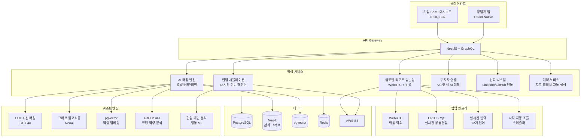
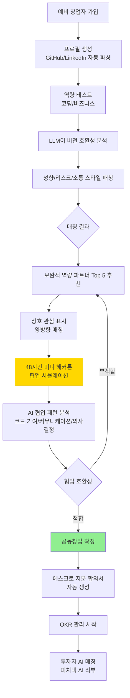
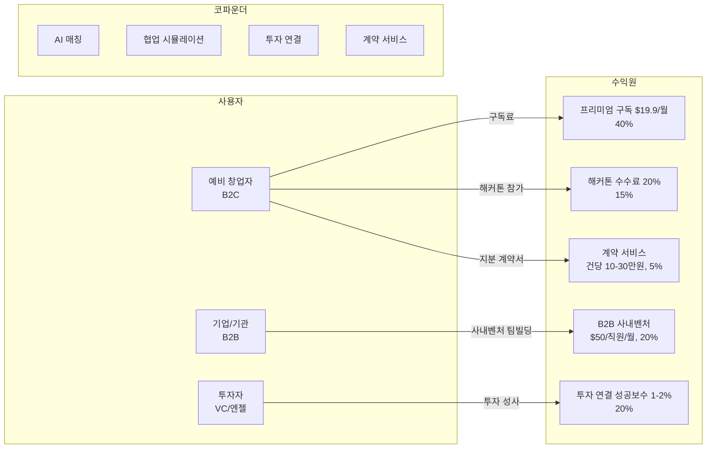

# 코파운더 (CoFounder) — AI 기반 글로벌 공동창업자·팀빌딩 매칭 플랫폼

> **예비창업패키지 사업계획서**
> 작성일: 2026년 3월
> 버전: 2.0 (Enhanced)

---

## □ 일반현황

| 항목 | 내용 |
|------|------|
| **창업아이템명** | 코파운더 — AI 기반 글로벌 공동창업자·팀빌딩 매칭 플랫폼 |
| **산출물** | 웹 플랫폼 1개, 모바일 앱(iOS/Android) 1세트 |
| **직업(현재)** | 대학원 석사과정 (컴퓨터공학/경영학 전공) |
| **기업예정명** | 주식회사 코파운더 (CoFounder Inc.) |
| **팀 구성 현황** | 대표 1인 + 공동창업자 1인 + 외부 자문 2인 (VC 심사역, 엑셀러레이터 대표) |

---

## □ 창업 아이템 개요(요약)

| 항목 | 내용 |
|------|------|
| **명칭** | 코파운더 (CoFounder) |
| **범주** | 스타트업 인프라 / 글로벌 공동창업자·팀빌딩 매칭 플랫폼 |

### 창업 아이템 개요

**코파운더**는 창업 아이디어를 가진 사람과 기술·비즈니스·디자인 역량을 가진 사람을 AI로 매칭하는 **공동창업자 및 초기 팀빌딩 플랫폼**이다. 당근마켓이 동네에서 사람을 연결하듯, **"아이디어를 가진 사람"과 "실행할 수 있는 사람"**을 전 세계에서 연결한다.

| 요약 항목 | 내용 |
|-----------|------|
| **문제인식** | 스타트업 실패 65%가 팀 문제(CB Insights). 비기술 창업자 72%가 기술 공동창업자 찾기 어려움. 솔로 파운더 성공률 3.6배 낮음. 글로벌 스타트업 생태계 $4.4T, VC 투자 $285B |
| **실현가능성** | LLM 역량·성향·비전 매칭, 협업 시뮬레이션(미니 해커톤), 투자자 연결, 글로벌 리모트 팀빌딩. 6개월 MVP |
| **성장전략** | 한국 스타트업 생태계 → 아시아·미국 → 글로벌. 프리미엄 매칭 + 해커톤 + 투자 연결 + B2B. 3년 내 MAU 100만, 연매출 200억원 |
| **팀구성** | AI/플랫폼 개발 대표 + 스타트업 생태계/운영 공동창업자 + VC 자문 + 엑셀러레이터 자문 |

---

## 1. 문제 인식 (Problem)

### 1.1 문제 구조도

```
┌─────────────────────────────────────────────────────────────────────┐
│                    스타트업 실패의 구조적 원인                          │
├─────────────────────────────────────────────────────────────────────┤
│                                                                     │
│  ┌──────────────┐    ┌──────────────┐    ┌──────────────┐          │
│  │  아이디어 O   │    │   자금 O     │    │   시장 O     │          │
│  │  (보유)       │    │  (확보가능)   │    │  (검증가능)   │          │
│  └──────┬───────┘    └──────┬───────┘    └──────┬───────┘          │
│         │                   │                   │                   │
│         ▼                   ▼                   ▼                   │
│  ┌─────────────────────────────────────────────────────┐           │
│  │              그런데... 팀이 없다 (65%)               │           │
│  │         "누구와 함께하느냐"가 가장 큰 변수           │           │
│  └────────────────────────┬────────────────────────────┘           │
│                           │                                         │
│              ┌────────────┼────────────┐                           │
│              ▼            ▼            ▼                           │
│     ┌────────────┐ ┌────────────┐ ┌────────────┐                  │
│     │ 기술 파트너 │ │ 비전 불일치│ │ 인맥 의존  │                  │
│     │ 부재 (72%) │ │    (43%)   │ │ 구조 (90%)│                  │
│     └─────┬──────┘ └─────┬──────┘ └─────┬──────┘                  │
│           │              │              │                           │
│           ▼              ▼              ▼                           │
│  ┌─────────────────────────────────────────────────────┐           │
│  │        ► 결과: 솔로 파운더 성공률 3.6배 낮음         │           │
│  │        ► 결과: 연간 45만개 스타트업 팀 문제로 실패    │           │
│  │        ► 결과: $180B 규모의 잠재가치 매년 소멸        │           │
│  └─────────────────────────────────────────────────────┘           │
│                                                                     │
│  ┌─────────────────────────────────────────────────────┐           │
│  │  ★ 코파운더 솔루션: AI 기반 체계적 매칭으로 해결     │           │
│  │     역량 + 성향 + 비전 = 최적 공동창업자 매칭        │           │
│  └─────────────────────────────────────────────────────┘           │
└─────────────────────────────────────────────────────────────────────┘
```

### 1.2 스타트업 실패의 근본 원인: 팀

CB Insights 「2024 Top 20 Reasons Startups Fail」:
- **팀 문제(Wrong Team)**: 실패 원인 1위 (**65%**)
- 공동창업자 간 비전 불일치: 43%
- 기술 역량 부족: 38%

Startup Genome 「2024 Global Startup Ecosystem Report」:
- 2인+ 공동창업 팀 성공률이 솔로 파운더 대비 **3.6배 높음**
- 비기술 창업자 **72%**: "기술 공동창업자 찾기가 가장 큰 어려움"
- 기술 창업자 **58%**: "비즈니스 파트너 만나기 어렵다"

### 1.3 사회적 비용 분석

팀 미스매칭으로 인한 사회적 비용은 단순히 개인의 실패를 넘어, 생태계 전체에 부정적 영향을 미친다.

| 비용 항목 | 연간 규모 (글로벌) | 연간 규모 (한국) | 산출 근거 |
|-----------|-------------------|-----------------|----------|
| **팀 해체 직접 비용** | $45B | 약 5,200억원 | 초기 스타트업 평균 투자금 $100K x 팀 문제 실패 45만건 |
| **기회비용 (시간)** | $120B | 약 1.4조원 | 창업자 평균 18개월 투입 시간 가치 (인건비 환산) |
| **투자자 손실** | $38B | 약 4,400억원 | VC/엔젤 투자 회수 불능분 중 팀 문제 귀인 비율 |
| **정부 지원금 손실** | $15B | 약 3,800억원 | 정부 창업 지원금 중 팀 해체로 미집행/환수분 |
| **인재 이탈 비용** | $25B | 약 2,900억원 | 창업 실패 후 고용시장 미복귀 인재의 생산성 손실 |
| **정신건강 비용** | $8B | 약 920억원 | 창업 실패 트라우마, 번아웃 관련 의료/상담 비용 |
| **합계** | **$251B** | **약 2.9조원** | - |

> **해석**: 팀 문제로 인한 스타트업 실패는 매년 글로벌 $251B, 한국만 약 2.9조원의 사회적 비용을 발생시킨다. 코파운더가 팀 미스매칭을 30%만 줄여도 연간 $75B의 사회적 가치를 창출할 수 있다.

### 1.4 사회적 문제 공감대 형성

#### 실제 사례/스토리텔링

**사례 1: 비기술 창업자 정은수 (29세, 서울, 마케팅 전공)**
쇼핑몰 자동화 아이디어를 가진 정은수 씨는 2년간 기술 공동창업자를 찾지 못해 창업을 포기할 위기에 놓였다. "창업 동아리, 해커톤, LinkedIn까지 다 뒤졌는데, 마케팅 전공인 제 아이디어에 관심 있는 개발자를 찾기가 정말 어려웠어요. 명문대 출신도 아니고, IT 업계 인맥도 없으니 기술 파트너를 만날 접점 자체가 없었습니다."

**사례 2: 인도 개발자 Raj Patel (26세, 뭄바이, 풀스택 개발자)**
뛰어난 기술력을 가진 Raj는 글로벌 스타트업에 공동창업자로 합류하고 싶지만, 인도에서 실리콘밸리나 한국의 비즈니스 파트너를 만날 기회가 없다. "제 GitHub 포트폴리오는 훌륭하지만, 비즈니스 감각과 시장 접근성을 가진 파트너가 필요합니다. 지리적 한계 때문에 글로벌 창업 기회를 놓치고 있어요."

**사례 3: 대기업 퇴사 창업 준비자 김도영 (37세, 서울, 전 삼성전자 PM)**
10년간 대기업에서 제품 관리를 담당한 김도영 씨는 AI 기반 헬스케어 스타트업을 구상 중이다. "아이디어와 시장 분석은 완료했는데, AI 개발자를 찾을 수 없어요. 이전 직장 동료들은 안정적 연봉을 버리고 창업할 의향이 없고, 창업 커뮤니티에서 만난 사람들과는 비전이 안 맞았어요."

#### 통계의 인간적 해석

- **스타트업 실패 65%가 팀 문제**: 아이디어가 나빠서, 자금이 부족해서가 아니라, "함께할 사람을 잘못 만나서" 실패하는 경우가 가장 많다. 이는 창업에서 "누구와 함께하느냐"가 "무엇을 하느냐"보다 중요하다는 것을 의미한다.
- **솔로 파운더 성공률 3.6배 낮음**: 혼자 창업하면 성공 확률이 3분의 1 이하로 떨어진다. 그런데 공동창업자를 "체계적으로 찾을 수 있는 플랫폼"은 전 세계적으로 거의 없다.
- **비기술 창업자 72%가 기술 공동창업자 찾기 어려움**: "아이디어는 있지만 만들 수 없는 사람"이 세계적으로 다수이며, 이들의 잠재력이 인맥 부족이라는 이유만으로 사장되고 있다.

### 1.5 페르소나 심층 분석

#### 페르소나 1: 이서현 (31세, 서울, 전 컨설턴트)

```
┌─────────────────────────────────────────────────────┐
│  페르소나 1: 이서현 — "아이디어는 있지만 기술이 없다"  │
├─────────────────────────────────────────────────────┤
│  나이: 31세 | 성별: 여성 | 거주: 서울 강남구           │
│  학력: 연세대 경영학과 → 맥킨지 4년 근무               │
│  현재: AI 기반 부동산 분석 플랫폼 구상 중              │
├─────────────────────────────────────────────────────┤
│  ► 보유 역량                                          │
│    ├─ 시장 분석 / 사업 전략 수립        ★★★★★         │
│    ├─ 투자자 네트워크 / IR 경험         ★★★★☆         │
│    ├─ 프레젠테이션 / 커뮤니케이션       ★★★★★         │
│    └─ 기술 개발 / 코딩                  ★☆☆☆☆         │
├─────────────────────────────────────────────────────┤
│  ► 필요 역량                                          │
│    ├─ ML 엔지니어 (부동산 데이터 분석)                 │
│    ├─ 풀스택 개발자 (웹/앱 구현)                       │
│    └─ 리스크 수용도 높은 기술 공동창업자                │
├─────────────────────────────────────────────────────┤
│  ► Pain Point                                         │
│    "2년간 기술 파트너를 찾았지만, 인맥 기반으로는       │
│     비전이 맞는 사람을 만나기 불가능했다."              │
├─────────────────────────────────────────────────────┤
│  ► 코파운더 가치                                      │
│    AI가 역량 + 비전 + 성향을 종합 분석하여             │
│    최적의 기술 공동창업자를 48시간 내 매칭              │
└─────────────────────────────────────────────────────┘
```

#### 페르소나 2: Amir Hassan (28세, 이집트 카이로, AI 엔지니어)

```
┌─────────────────────────────────────────────────────┐
│  페르소나 2: Amir Hassan — "기술은 있지만 시장이 없다" │
├─────────────────────────────────────────────────────┤
│  나이: 28세 | 성별: 남성 | 거주: 이집트 카이로         │
│  학력: 카이로대 CS → Google AI 인턴                    │
│  현재: 자체 개발 AI 모델로 글로벌 스타트업 희망        │
├─────────────────────────────────────────────────────┤
│  ► 보유 역량                                          │
│    ├─ AI/ML 개발                        ★★★★★         │
│    ├─ 시스템 아키텍처                   ★★★★☆         │
│    ├─ GitHub 오픈소스 기여 (Star 2.3K)  ★★★★★         │
│    └─ 비즈니스 / 마케팅                 ★★☆☆☆         │
├─────────────────────────────────────────────────────┤
│  ► 필요 역량                                          │
│    ├─ 비즈니스 전략 / GTM 전문가                       │
│    ├─ 미국/한국 시장 접근성 보유자                     │
│    └─ 마케팅 / 세일즈 경험                             │
├─────────────────────────────────────────────────────┤
│  ► Pain Point                                         │
│    "이집트에서 실리콘밸리 비즈니스 파트너를 만날        │
│     방법이 전혀 없다. 지리적 한계가 가장 큰 벽."       │
├─────────────────────────────────────────────────────┤
│  ► 코파운더 가치                                      │
│    글로벌 크로스보더 매칭 + 실시간 번역 +              │
│    시차 자동 조율로 지구 반대편 파트너와 팀빌딩         │
└─────────────────────────────────────────────────────┘
```

#### 페르소나 3: 박준혁 (24세, 부산, 컴퓨터공학 4학년)

```
┌─────────────────────────────────────────────────────┐
│  페르소나 3: 박준혁 — "창업하고 싶지만 혼자서는 무섭다"│
├─────────────────────────────────────────────────────┤
│  나이: 24세 | 성별: 남성 | 거주: 부산 해운대구         │
│  학력: 부산대 컴퓨터공학과 4학년                       │
│  현재: 졸업 프로젝트로 SaaS MVP 개발 중               │
├─────────────────────────────────────────────────────┤
│  ► 보유 역량                                          │
│    ├─ 풀스택 개발 (React + Node.js)     ★★★★☆         │
│    ├─ 해커톤 수상 3회                   ★★★★☆         │
│    ├─ AWS 클라우드 인프라               ★★★☆☆         │
│    └─ 사업 경험 / 자금 조달             ★☆☆☆☆         │
├─────────────────────────────────────────────────────┤
│  ► 필요 역량                                          │
│    ├─ 비즈니스 모델 수립 가능한 공동창업자              │
│    ├─ 디자이너 (UI/UX)                                 │
│    └─ 같은 열정과 비전을 가진 동료                     │
├─────────────────────────────────────────────────────┤
│  ► Pain Point                                         │
│    "서울이 아닌 부산에서는 창업 생태계 접근 자체가      │
│     어렵다. 같이 창업할 친구들은 다 취업 준비 중."     │
├─────────────────────────────────────────────────────┤
│  ► 코파운더 가치                                      │
│    지역 제약 없는 온라인 매칭 + 미니 해커톤으로        │
│    검증된 팀 구성 + 초기 창업자 커뮤니티 소속감         │
└─────────────────────────────────────────────────────┘
```

### 1.6 해외 성공 사례 비교 도표

| 비교 항목 | Y Combinator | CoFoundersLab | Toptal | LinkedIn | **코파운더** |
|-----------|-------------|---------------|--------|----------|------------|
| **설립연도** | 2005 | 2011 | 2010 | 2002 | 2026 |
| **매칭 방식** | 수동 (파트너 인터뷰) | 단순 필터/검색 | 면접 선별 (상위 3%) | 범용 네트워킹 | **LLM + 그래프 AI** |
| **접근성** | 연 500팀 한정 | 40만+ 회원 개방 | 상위 3% 한정 | 10억+ 회원 개방 | **글로벌 오픈** |
| **협업 테스트** | 3개월 프로그램 | 없음 | 프로젝트 평가 | 없음 | **48시간 미니 해커톤** |
| **GitHub 분석** | 면접 | 없음 | 코딩 테스트 | 없음 | **자동 코딩역량 분석** |
| **비전 매칭** | 파트너 주관 | 없음 | 없음 | 없음 | **LLM 비전 호환성 점수** |
| **투자 연결** | 핵심 (데모데이) | 없음 | 없음 | 없음 | **AI 매칭 + 데모데이** |
| **지분 계약** | 법률 자문 | 없음 | 없음 | 없음 | **에스크로 자동 생성** |
| **글로벌 리모트** | 제한적 | 제한적 | 글로벌 | 글로벌 | **12개 언어 실시간 번역** |
| **가격** | 지분 7% | $29.99/월 | $60-200/시간 | $29.99/월 | **$19.9/월** |
| **핵심 한계** | 극소수만 접근 | 매칭 품질 낮음 | 프리랜서 중심 | 창업 특화 아님 | **신규 → 신뢰 구축 필요** |

> **시사점**: 기존 플랫폼들은 각각 접근성, 매칭 품질, 협업 검증, 투자 연결 중 일부만 해결한다. 코파운더는 이 모든 요소를 하나의 플랫폼에서 AI 기반으로 통합 제공하는 최초의 서비스이다.

### 1.7 시장 규모

| 시장 구분 | 2024년 | 2030년 (전망) | CAGR |
|-----------|--------|---------------|------|
| 글로벌 스타트업 생태계 | $4.4T | $7.2T | 8.6% |
| 글로벌 VC 투자 | $285B | $450B | 7.9% |
| 글로벌 HR테크 시장 | $32.6B | $71.5B | 14.0% |
| 한국 스타트업 투자 | 약 6.7조원 | 약 15조원 | 14.3% |

> 출처: PitchBook (2024), Startup Genome (2024), Grand View Research (2024)

### 1.8 시장 기회 TAM/SAM/SOM 다이어그램

```
┌─────────────────────────────────────────────────────────────────────┐
│                     시장 기회 분석 (2024 기준)                        │
├─────────────────────────────────────────────────────────────────────┤
│                                                                     │
│  ┌─────────────────────────────────────────────────────────────┐   │
│  │                    TAM: $4,433B                              │   │
│  │           글로벌 스타트업 생태계 + HR테크 시장               │   │
│  │                                                              │   │
│  │    ┌─────────────────────────────────────────────────┐      │   │
│  │    │              SAM: $15B                           │      │   │
│  │    │     글로벌 창업 팀빌딩 + 인재 매칭 시장          │      │   │
│  │    │                                                  │      │   │
│  │    │      ┌─────────────────────────────────┐        │      │   │
│  │    │      │        SOM: $800M               │        │      │   │
│  │    │      │  한국·아시아·미국 공동창업자     │        │      │   │
│  │    │      │  매칭 시장 (초기 타겟)           │        │      │   │
│  │    │      │                                  │        │      │   │
│  │    │      │   ► 한국: $150M (1,740억원)     │        │      │   │
│  │    │      │   ► 아시아: $350M               │        │      │   │
│  │    │      │   ► 미국: $300M                 │        │      │   │
│  │    │      └─────────────────────────────────┘        │      │   │
│  │    │                                                  │      │   │
│  │    │   산출근거: 창업 관련 HR 서비스 +                │      │   │
│  │    │   기술인재 매칭시장 + 협업도구 시장               │      │   │
│  │    └─────────────────────────────────────────────────┘      │   │
│  │                                                              │   │
│  │   산출근거: 스타트업 생태계 $4,400B +                       │   │
│  │   HR테크 $32.6B (Startup Genome, Grand View Research)       │   │
│  └─────────────────────────────────────────────────────────────┘   │
│                                                                     │
│  ► CAGR (2024→2030)                                                │
│    TAM: 8.6%  │  SAM: 14.0%  │  SOM: 22.5%                       │
│                                                                     │
│  ► 코파운더 목표 점유율                                             │
│    Year 1: SOM의 0.1% ($800K) → Year 3: 1.5% ($12M)              │
│    → Year 5: 5% ($40M)                                             │
└─────────────────────────────────────────────────────────────────────┘
```

#### 글로벌 vs 국내 시장 비교

| 비교 항목 | 글로벌 | 한국 | 시사점 |
|-----------|--------|------|--------|
| 스타트업 생태계 규모 | $4.4T (2024) | 약 6.7조원 투자 (2024) | 한국은 아시아 4대 스타트업 생태계, 글로벌 확장 시 시장 10배 이상 |
| 창업 실패율 (팀 문제) | 65% (CB Insights) | 약 60% (창업진흥원) | 한국도 팀 문제 비중 높음 → 체계적 매칭 수요 존재 |
| 공동창업자 매칭 플랫폼 | CoFoundersLab (40만+) | 전문 플랫폼 없음 | 한국 시장 완전 공백 → 선점 기회 |
| VC 투자 규모 | $285B (2024) | 약 6.7조원 (2024) | VC 투자 증가 = 더 많은 스타트업 = 더 많은 팀빌딩 수요 |
| 기술 인재 부족 | 미국 90만+ 공석 | 한국 IT 인력 부족 15만명 | 비기술 창업자의 기술 파트너 찾기 어려움 글로벌 공통 |

### 1.9 사용자 구매동인(Purchase Motivation) 분석

#### 기능적 동인

| 동인 | 창업자 (B2C) | 기업/기관 (B2B) |
|------|-------------|----------------|
| **시간 절약** | AI 매칭으로 최적 파트너 즉시 추천, 인맥 기반 탐색 수개월 → 수일로 단축 | 사내벤처 팀 구성 자동화, HR 업무 부담 경감 |
| **비용 절감** | 헤드헌팅 수천만원 vs. 월 $19.9 구독으로 검증된 파트너 매칭 | 외부 팀빌딩 컨설팅 대비 70% 비용 절감 |
| **편의성** | GitHub/LinkedIn 자동 파싱으로 프로필 생성, 협업 시뮬레이션으로 사전 검증 | 대시보드에서 사내벤처 팀 매칭·진행 현황 일괄 관리 |
| **리스크 감소** | 48시간 미니 해커톤으로 협업 호환성 사전 테스트, 지분 계약서 자동 생성 | 팀 구성 실패 비용 최소화, 데이터 기반 팀 구성 |

#### 감정적 동인

| 동인 | 설명 |
|------|------|
| **불안 해소** | "이 사람과 함께해도 괜찮을까?" → 48시간 협업 시뮬레이션으로 사전 검증. "비전은 같은데 일하는 스타일이 안 맞으면?" 불안을 데이터로 해소 |
| **신뢰감** | LinkedIn/GitHub 연동 필수, 동료 리뷰, 에스크로 지분 계약 → "검증된 사람이라 믿을 수 있다" |
| **흥분** | AI가 추천한 보완적 역량의 파트너를 만나는 순간의 설렘. "내가 못하는 것을 완벽하게 보완하는 사람이 있다!" |
| **희망** | "혼자서는 불가능했던 창업이 함께할 사람을 만나 현실이 된다"는 가능성의 감각 |

#### 사회적 동인

| 동인 | 설명 |
|------|------|
| **소속감** | "예비 창업자 커뮤니티"의 일원으로서 아이디어를 공유하고, 함께 성장하는 동지 의식 |
| **사회적 인정** | "해커톤 우승 팀", "투자자 매칭 성공" 등 플랫폼 내 성과가 사회적 인정으로 연결. 창업 생태계에서의 가시성 확보 |
| **트렌드** | 글로벌 리모트 창업, 크로스보더 팀빌딩 트렌드. "최고의 파트너는 같은 도시가 아니라 지구 반대편에 있을 수 있다" |

#### 페르소나별 구매 여정

**페르소나 A: "아이디어는 있지만 기술이 없는 창업자" — 이서현 (31세, 서울, 전 컨설턴트)**

| 단계 | 행동 | 감정 | 코파운더 접점 |
|------|------|------|-------------|
| 인지 | AI 기반 부동산 분석 플랫폼 아이디어 구상, 기술 파트너 필요 | "아이디어는 완벽한데, 만들 사람이 없다..." 답답 | 창업 커뮤니티, 엑셀러레이터 파트너십 |
| 탐색 | 코파운더 앱에서 AI 매칭 → "ML 엔지니어, 부동산 도메인 관심, 리스크 수용도 높음" 추천 | "이 사람은 내 아이디어에 딱 맞는 기술 배경이다!" 기대 | LLM 비전 매칭, GitHub 자동 분석 |
| 시뮬레이션 | 48시간 미니 해커톤에서 프로토타입 공동 개발 | "같이 일하니 호흡이 잘 맞는다! 코딩 실력도 확실하다" 확신 | 협업 시뮬레이션, AI 협업 패턴 분석 |
| 팀빌딩 | 공동창업 확정, 지분 계약서 자동 생성 (50:50) | "드디어 함께할 파트너를 찾았다!" 희망 | 에스크로 지분 계약, OKR 관리 |
| 투자 | 팀 구성 후 → 코파운더 내 투자자 매칭 → 엔젤 투자 유치 | "팀이 갖춰지니 투자자도 관심을 보인다" 자신감 | 투자자 AI 매칭, 피치덱 AI 리뷰 |

**페르소나 B: "글로벌 팀을 원하는 기술 창업자" — Amir Hassan (28세, 이집트 카이로, AI 엔지니어)**

| 단계 | 행동 | 감정 | 코파운더 접점 |
|------|------|------|-------------|
| 인지 | AI 모델은 만들었으나, 글로벌 비즈니스 감각과 마케팅 파트너 필요 | "이집트에서는 글로벌 비즈니스 파트너를 만나기 어렵다" 한계 | 글로벌 개발자 커뮤니티, ProductHunt |
| 탐색 | 코파운더 앱에서 "미국/한국 비즈니스 파트너, 마케팅 경험" 매칭 | "시차가 있어도 리모트로 협업 가능하다니!" 기대 | 크로스보더 매칭, 시차 자동 조율 |
| 시뮬레이션 | 한국인 비즈니스 파트너와 48시간 미니 해커톤 | "문화는 다르지만 비전이 같고, 보완적이다!" 확신 | 실시간 번역, 공유 워크스페이스 |
| 팀빌딩 | 한국-이집트 리모트 팀 구성, 한국 시장 진출 전략 수립 | "지구 반대편의 파트너와 함께 글로벌 스타트업을 만든다!" 흥분 | OKR 관리, 화상 회의 |

---

## 2. 실현 가능성 (Solution)

### 2.1 서비스 아키텍처 개요

```
┌─────────────────────────────────────────────────────────────────────┐
│                     코파운더 서비스 아키텍처                          │
├─────────────────────────────────────────────────────────────────────┤
│                                                                     │
│  ┌───────────┐  ┌───────────┐  ┌───────────┐  ┌───────────┐       │
│  │  프로필    │  │  AI 매칭   │  │  협업      │  │  투자     │       │
│  │  시스템    │→ │  엔진     │→ │  시뮬레이션│→ │  연결     │       │
│  └─────┬─────┘  └─────┬─────┘  └─────┬─────┘  └─────┬─────┘       │
│        │              │              │              │               │
│        ▼              ▼              ▼              ▼               │
│  ┌─────────────────────────────────────────────────────────┐       │
│  │                    공통 서비스 레이어                     │       │
│  │  ├─ 인증/보안   ├─ 실시간 통신   ├─ 결제           │       │
│  │  ├─ 알림        ├─ 분석/로깅     ├─ 다국어 번역    │       │
│  │  └─ 에스크로 계약 관리                                   │       │
│  └─────────────────────────────────────────────────────────┘       │
│        │              │              │              │               │
│        ▼              ▼              ▼              ▼               │
│  ┌─────────────────────────────────────────────────────────┐       │
│  │                    데이터 & AI 레이어                     │       │
│  │  ├─ PostgreSQL (사용자/트랜잭션)                         │       │
│  │  ├─ Neo4j (관계 그래프 / 매칭 네트워크)                  │       │
│  │  ├─ pgvector (역량 임베딩 벡터)                          │       │
│  │  ├─ Redis (캐시 / 실시간 세션)                           │       │
│  │  └─ LLM API (GPT-4o / Claude) → 비전 매칭               │       │
│  └─────────────────────────────────────────────────────────┘       │
│                                                                     │
│  ┌─────────────────────────────────────────────────────────┐       │
│  │                    인프라 레이어 (AWS)                    │       │
│  │  ├─ EKS (컨테이너 오케스트레이션)                        │       │
│  │  ├─ RDS (관리형 DB)    ├─ CloudFront (CDN)              │       │
│  │  ├─ S3 (파일 저장)     ├─ SQS/SNS (메시지 큐)          │       │
│  │  └─ CloudWatch (모니터링)                                │       │
│  └─────────────────────────────────────────────────────────┘       │
└─────────────────────────────────────────────────────────────────────┘
```

### 2.2 핵심 기능

#### 1) AI 역량·성향·비전 매칭
- GitHub/LinkedIn 자동 파싱 + 코딩/비즈니스 테스트
- 업무 스타일·리스크 성향·소통 방식 분석
- LLM이 비전 호환성 점수 산출 → 보완적 역량 우선 매칭

#### 2) 협업 시뮬레이션 (미니 해커톤)
- 매칭된 2-3명이 48시간 미니 프로젝트 수행 (YC 모델)
- AI가 협업 패턴 분석 → 프로젝트 후 매칭 확정

#### 3) 글로벌 리모트 팀빌딩
- WebRTC 화상 + 실시간 번역 (12개 언어)
- 시차 자동 조율, 공유 워크스페이스, OKR 관리

#### 4) 투자자 연결
- 팀 빌딩 후 → VC/엔젤 투자자 AI 매칭
- 피치덱 AI 리뷰, 온라인 데모데이

#### 5) 신뢰·검증 시스템
- LinkedIn/GitHub 연동 필수, 동료 리뷰
- 에스크로 기반 지분·역할 합의서 자동 생성

### 2.3 AI 모델 개발 로드맵

| 단계 | 모델명 | 기능 | 학습 데이터 | 기술 | 목표 정확도 |
|------|--------|------|------------|------|-----------|
| Phase 1 | MatchLLM v1 | 역량 기반 매칭 | GitHub 프로필 50K건, LinkedIn 30K건 | GPT-4o Fine-tuning + pgvector | 매칭 만족도 70%+ |
| Phase 2 | VisionScore v1 | 비전 호환성 분석 | 창업 인터뷰 10K건, 비전 설문 50K건 | LLM 프롬프트 체인 + 시맨틱 유사도 | 비전 일치 예측 75%+ |
| Phase 3 | CollabPredict v1 | 협업 호환성 예측 | 해커톤 협업 로그 5K건, 커밋 패턴 | GNN (Graph Neural Network) + 행동 분석 | 팀 지속률 예측 72%+ |
| Phase 4 | MatchLLM v2 | 통합 매칭 엔진 | Phase 1-3 데이터 통합 200K건 | Multi-modal LLM + GNN + 강화학습 | 매칭 만족도 85%+ |
| Phase 5 | InvestorMatch v1 | 투자자-팀 매칭 | VC 투자 이력 20K건, 팀 프로필 | Collaborative Filtering + LLM | 투자 연결 성공률 40%+ |
| Phase 6 | CultureFit v1 | 다문화 팀 호환성 | 글로벌 팀 협업 데이터 15K건 | Cross-cultural NLP + 감성 분석 | 크로스보더 팀 만족도 80%+ |

### 2.4 시스템 아키텍처 (Layered)

```
┌─────────────────────────────────────────────────────────────────────┐
│                        프레젠테이션 레이어                            │
│  ┌──────────────────┐  ┌──────────────────┐  ┌──────────────────┐  │
│  │   모바일 앱       │  │   웹 대시보드     │  │   B2B SaaS       │  │
│  │  React Native    │  │  Next.js 14      │  │  Next.js 14      │  │
│  │  (iOS/Android)   │  │  (창업자용)       │  │  (기업용)         │  │
│  └────────┬─────────┘  └────────┬─────────┘  └────────┬─────────┘  │
├───────────┼─────────────────────┼─────────────────────┼────────────┤
│           └─────────────────────┼─────────────────────┘            │
│                                 ▼                                   │
│                        API Gateway 레이어                           │
│  ┌─────────────────────────────────────────────────────────────┐   │
│  │              NestJS + GraphQL (Apollo Federation)            │   │
│  │  ├─ Rate Limiting   ├─ JWT Auth   ├─ Request Validation    │   │
│  │  └─ API Versioning  └─ CORS       └─ Logging               │   │
│  └────────────────────────────┬────────────────────────────────┘   │
├───────────────────────────────┼────────────────────────────────────┤
│                               ▼                                    │
│                     마이크로서비스 레이어                             │
│  ┌────────────┐ ┌────────────┐ ┌────────────┐ ┌────────────┐      │
│  │ 사용자      │ │ 매칭       │ │ 협업       │ │ 투자       │      │
│  │ 서비스      │ │ 서비스     │ │ 서비스     │ │ 서비스     │      │
│  │            │ │            │ │            │ │            │      │
│  │ - 프로필   │ │ - AI매칭   │ │ - 해커톤   │ │ - VC매칭   │      │
│  │ - 인증     │ │ - 비전분석 │ │ - WebRTC   │ │ - 피치덱   │      │
│  │ - GitHub   │ │ - 그래프ML │ │ - CRDT     │ │ - 데모데이 │      │
│  └─────┬──────┘ └─────┬──────┘ └─────┬──────┘ └─────┬──────┘      │
│        │              │              │              │               │
│  ┌────────────┐ ┌────────────┐ ┌────────────┐ ┌────────────┐      │
│  │ 계약       │ │ 알림       │ │ 분석       │ │ 결제       │      │
│  │ 서비스     │ │ 서비스     │ │ 서비스     │ │ 서비스     │      │
│  │            │ │            │ │            │ │            │      │
│  │ - 에스크로 │ │ - Push     │ │ - 행동로그 │ │ - Stripe   │      │
│  │ - 지분계약 │ │ - Email    │ │ - KPI      │ │ - 환율관리 │      │
│  │ - 법률검증 │ │ - SMS      │ │ - A/B Test │ │ - 정산     │      │
│  └─────┬──────┘ └─────┬──────┘ └─────┬──────┘ └─────┬──────┘      │
├────────┼──────────────┼──────────────┼──────────────┼──────────────┤
│        └──────────────┼──────────────┼──────────────┘              │
│                       ▼              ▼                              │
│                       데이터 레이어                                  │
│  ┌────────────┐ ┌────────────┐ ┌────────────┐ ┌────────────┐      │
│  │ PostgreSQL │ │ Neo4j      │ │ pgvector   │ │ Redis      │      │
│  │ (메인 DB)  │ │ (그래프DB) │ │ (벡터DB)   │ │ (캐시)     │      │
│  └────────────┘ └────────────┘ └────────────┘ └────────────┘      │
│  ┌────────────┐ ┌────────────┐ ┌────────────┐                     │
│  │ AWS S3     │ │ Kafka      │ │ ElasticSrch│                     │
│  │ (파일)     │ │ (이벤트)   │ │ (검색)     │                     │
│  └────────────┘ └────────────┘ └────────────┘                     │
├─────────────────────────────────────────────────────────────────────┤
│                       인프라 레이어 (AWS)                            │
│  ┌─────────────────────────────────────────────────────────────┐   │
│  │  EKS │ RDS │ ElastiCache │ CloudFront │ S3 │ SQS │ MSK    │   │
│  │  Route53 │ ACM │ WAF │ CloudWatch │ X-Ray │ Terraform     │   │
│  └─────────────────────────────────────────────────────────────┘   │
└─────────────────────────────────────────────────────────────────────┘
```

### 2.5 사용자 흐름 (User Journey)

```
┌─────────────────────────────────────────────────────────────────────┐
│                    코파운더 사용자 흐름도                             │
├─────────────────────────────────────────────────────────────────────┤
│                                                                     │
│  [1단계: 가입 & 프로필]                                             │
│  ┌─────────────┐    ┌─────────────┐    ┌─────────────┐            │
│  │  소셜 로그인 │ →  │ GitHub/     │ →  │ 역량 테스트  │            │
│  │  (Google/    │    │ LinkedIn    │    │ (코딩/비즈)  │            │
│  │   GitHub)    │    │ 자동 파싱   │    │ 15분 소요    │            │
│  └─────────────┘    └─────────────┘    └──────┬──────┘            │
│                                                │                    │
│                                                ▼                    │
│  [2단계: AI 분석 & 매칭]                                            │
│  ┌─────────────┐    ┌─────────────┐    ┌─────────────┐            │
│  │ LLM이 비전  │ →  │ 그래프 ML   │ →  │ Top 5 파트너│            │
│  │ 호환성 분석  │    │ 보완적 역량 │    │ 추천 리스트  │            │
│  │ (자동)       │    │ 매칭 실행   │    │ (점수 표시)  │            │
│  └─────────────┘    └─────────────┘    └──────┬──────┘            │
│                                                │                    │
│                                                ▼                    │
│  [3단계: 상호 관심 & 소통]                                          │
│  ┌─────────────┐    ┌─────────────┐    ┌─────────────┐            │
│  │ 프로필 탐색  │ →  │ 상호 관심   │ →  │ 1:1 채팅    │            │
│  │ & 비교       │    │ 표시 (양방향│    │ (실시간 번역│            │
│  │              │    │  매칭)      │    │  지원)      │            │
│  └─────────────┘    └─────────────┘    └──────┬──────┘            │
│                                                │                    │
│                                                ▼                    │
│  [4단계: 협업 시뮬레이션]                                           │
│  ┌─────────────┐    ┌─────────────┐    ┌─────────────┐            │
│  │ 48시간 미니  │ →  │ AI 협업     │ →  │ 호환성 점수 │            │
│  │ 해커톤 참여  │    │ 패턴 분석   │    │ 리포트 제공  │            │
│  │ (프로토타입) │    │ (커밋/소통) │    │ (Go/No-Go)  │            │
│  └─────────────┘    └─────────────┘    └──────┬──────┘            │
│                                                │                    │
│                                    ┌───────────┼───────────┐       │
│                                    ▼                       ▼       │
│  [5단계-A: 팀빌딩 확정]           [5단계-B: 재매칭]                  │
│  ┌─────────────┐                  ┌─────────────┐                  │
│  │ 에스크로     │                  │ 새로운 Top 5│                  │
│  │ 지분 계약서  │                  │ 파트너 추천  │                  │
│  │ 자동 생성    │                  │ (학습 반영)  │                  │
│  └──────┬──────┘                  └─────────────┘                  │
│         │                                                           │
│         ▼                                                           │
│  [6단계: 투자 연결]                                                  │
│  ┌─────────────┐    ┌─────────────┐    ┌─────────────┐            │
│  │ 팀 프로필   │ →  │ 피치덱 AI   │ →  │ VC/엔젤     │            │
│  │ 자동 생성   │    │ 리뷰 & 피드 │    │ 투자자 매칭  │            │
│  │             │    │ 백           │    │ + 데모데이   │            │
│  └─────────────┘    └─────────────┘    └─────────────┘            │
│                                                                     │
└─────────────────────────────────────────────────────────────────────┘
```

### 2.6 기술 스택

| 구분 | 기술 |
|------|------|
| **프론트엔드** | Next.js 14, React Native |
| **백엔드** | Node.js + NestJS, GraphQL |
| **AI/ML** | LLM 매칭, 그래프 알고리즘 (Neo4j), pgvector |
| **협업** | WebRTC, CRDT (Yjs), GitHub API |
| **인프라** | AWS (EKS, RDS, CloudFront) |

### 2.7 개발 일정

| 구분 | 기간 | 내용 |
|------|------|------|
| MVP | 2026.04~09 | AI 매칭 + 프로필 + 채팅 + 미니 프로젝트 |
| 베타 | 2026.10~12 | 한국 예비창업자 500명 |
| 정식 출시 | 2027.01 | 협업 시뮬레이션, 투자자 DB |
| 글로벌 확장 | 2027.01~06 | 실리콘밸리·인도·동남아 |

### 2.8 예산 상세 (총 60백만원)

#### 1단계 예산: 20백만원 (2026.04~06, 3개월)

| 항목 | 세부 내역 | 금액 (만원) | 비중 |
|------|----------|-----------|------|
| **인프라 구축** | AWS 초기 셋업 (EKS, RDS, S3), 도메인, SSL | 800 | 40% |
| **UI/UX 디자인** | 와이어프레임, 디자인 시스템, 프로토타입 (외주) | 700 | 35% |
| **AI API 비용** | GPT-4o API, 임베딩 모델, 테스트 비용 | 300 | 15% |
| **특허/법률** | 매칭 알고리즘 특허 출원, 법인 설립 | 200 | 10% |
| **소계** | | **2,000** | 100% |

#### 2단계 예산: 40백만원 (2026.07~12, 6개월)

| 항목 | 세부 내역 | 금액 (만원) | 비중 |
|------|----------|-----------|------|
| **인건비** | 풀스택 개발자 1명 (6개월), AI 엔지니어 1명 (6개월) | 2,600 | 65% |
| **마케팅** | 베타 사용자 모집, 창업 커뮤니티 파트너십, SNS 광고 | 800 | 20% |
| **법률자문** | 에스크로 계약 시스템, 개인정보보호, 해외법률 검토 | 400 | 10% |
| **서버 운영** | AWS 월 운영비, CDN, 모니터링 도구 | 200 | 5% |
| **소계** | | **4,000** | 100% |

#### Pre-Seed 예산 계획: 3억원 (2026.Q2~Q4)

| 항목 | 세부 내역 | 금액 (만원) | 비중 |
|------|----------|-----------|------|
| **인건비 (핵심팀)** | 대표 + 공동창업자 + 개발자 2명 (6개월) | 12,000 | 40% |
| **AI/ML 개발** | 모델 학습 GPU 비용, 데이터 수집/라벨링, API 비용 | 4,500 | 15% |
| **인프라** | AWS, 외부 SaaS 도구, 보안 인증 (SOC2 준비) | 3,000 | 10% |
| **마케팅/PR** | 런칭 캠페인, 해커톤 개최 (3회), 인플루언서 협업 | 4,500 | 15% |
| **법률/특허** | 국내외 특허 3건, 에스크로 법률 구조, GDPR 대응 | 3,000 | 10% |
| **운영비** | 사무실, 장비, 출장, 기타 | 1,500 | 5% |
| **예비비** | 긴급 대응, 시장 변화 대응 | 1,500 | 5% |
| **합계** | | **30,000** | 100% |

---

## 3. 성장전략 (Scale-up)

### 3.1 비즈니스 모델

| 수익원 | 설명 | 비중 |
|--------|------|------|
| **프리미엄 구독** | 무제한 매칭, AI 역량분석 ($19.9/월) | 40% |
| **해커톤 수수료** | 온라인 해커톤 참가비 20% | 15% |
| **투자 연결 수수료** | 투자 성사 시 1-2% 성공보수 | 20% |
| **B2B 기업 이노베이션** | 사내벤처 팀 구성 ($50/직원/월) | 20% |
| **계약 서비스** | 지분 계약서 자동 생성 (건당 10-30만원) | 5% |

### 3.2 구독 모델 4 Tier

| 항목 | Free | Starter ($9.9/월) | Pro ($19.9/월) | Enterprise ($50/직원/월) |
|------|------|-------------------|----------------|------------------------|
| **대상** | 예비 창업자 | 초기 창업자 | 적극 창업자 | 기업/기관 |
| **AI 매칭** | 월 3회 | 월 10회 | **무제한** | **무제한 + 커스텀** |
| **프로필 열람** | 기본 정보만 | 전체 프로필 | 전체 + GitHub 분석 | 전체 + 내부 인재 DB |
| **미니 해커톤** | 참가만 가능 | 월 1회 개설 | **월 5회 개설** | **무제한 + 사내 전용** |
| **비전 호환성 리포트** | X | 기본 리포트 | **AI 심층 분석** | **팀 단위 분석** |
| **투자자 매칭** | X | X | **월 3회** | **전담 매니저** |
| **피치덱 AI 리뷰** | X | X | **월 2회** | **무제한** |
| **지분 계약서** | X | 기본 템플릿 | **커스텀 + 법률 리뷰** | **전담 법무 지원** |
| **실시간 번역** | X | 3개 언어 | **12개 언어** | **12개 언어 + 전문 통역** |
| **OKR 관리** | X | X | 기본 | **Advanced + 대시보드** |
| **전담 지원** | 커뮤니티 | 이메일 | **실시간 채팅** | **전담 CS 매니저** |
| **SLA** | X | X | 99.5% | **99.9%** |
| **월 예상 ARPU** | $0 | $9.9 | $19.9 | $50/직원 (평균 $2,500/사) |

### 3.3 시장 진입 전략

```
┌─────────────────────────────────────────────────────────────────────┐
│                      시장 진입 전략 로드맵                            │
├─────────────────────────────────────────────────────────────────────┤
│                                                                     │
│  Phase 1 (2026-2027): 한국 시장 선점                                │
│  ┌─────────────────────────────────────────────────────────────┐   │
│  │  ► 타겟: 대학생/대학원생 예비 창업자, 초기 스타트업         │   │
│  │  ► 채널: 창업동아리, 엑셀러레이터, 대학 창업지원센터       │   │
│  │  ► 전략: 무료 미니 해커톤 개최 → 바이럴 성장               │   │
│  │  ► 목표: 회원 50,000명, MAU 10,000                          │   │
│  │  ► KPI: 매칭 성사율 15%, 협업 지속률 60%                   │   │
│  └────────────────────────────┬────────────────────────────────┘   │
│                               │                                    │
│                               ▼                                    │
│  Phase 2 (2027-2028): 아시아·미국 확장                              │
│  ┌─────────────────────────────────────────────────────────────┐   │
│  │  ► 타겟: 아시아 기술 인재 + 미국 비즈니스 창업자            │   │
│  │  ► 채널: ProductHunt, Hacker News, 한인 스타트업 커뮤니티   │   │
│  │  ► 전략: 크로스보더 매칭 특화 → "한국 기술 + 미국 시장"    │   │
│  │  ► 목표: 회원 300,000명, MAU 100,000                        │   │
│  │  ► KPI: 글로벌 매칭 30%, B2B 고객 50사                     │   │
│  └────────────────────────────┬────────────────────────────────┘   │
│                               │                                    │
│                               ▼                                    │
│  Phase 3 (2028-2030): 글로벌 확장                                   │
│  ┌─────────────────────────────────────────────────────────────┐   │
│  │  ► 타겟: 전 세계 예비 창업자, VC, 대기업 이노베이션        │   │
│  │  ► 채널: 글로벌 파트너십 (YC, Techstars, 500Global)        │   │
│  │  ► 전략: 투자자 네트워크 확대, B2B 매출 비중 40%+          │   │
│  │  ► 목표: 회원 2,000,000명, MAU 500,000                     │   │
│  │  ► KPI: 유니콘 배출 3팀+, 연 매출 500억원                  │   │
│  └─────────────────────────────────────────────────────────────┘   │
│                                                                     │
└─────────────────────────────────────────────────────────────────────┘
```

### 3.4 KPI 연도별 목표

| KPI | 2026 (MVP) | 2027 (성장) | 2028 (확장) | 2029 (글로벌) | 2030 (리더) |
|-----|-----------|-----------|-----------|-------------|-----------|
| **가입자 수** | 5,000 | 50,000 | 300,000 | 1,000,000 | 2,000,000 |
| **MAU** | 1,000 | 15,000 | 100,000 | 300,000 | 500,000 |
| **유료 전환율** | 3% | 5% | 8% | 10% | 12% |
| **매칭 성사 수 (월)** | 50 | 500 | 3,000 | 10,000 | 25,000 |
| **매칭 만족도** | 65% | 75% | 82% | 87% | 90%+ |
| **해커톤 개최 수 (월)** | 5 | 30 | 150 | 500 | 1,000 |
| **투자 연결 성사 (월)** | 0 | 5 | 30 | 100 | 300 |
| **B2B 고객사** | 0 | 10 | 50 | 200 | 500 |
| **글로벌 비율** | 5% | 20% | 40% | 60% | 70% |
| **NPS** | 30 | 45 | 55 | 65 | 70+ |
| **월 매출** | 500만원 | 1.5억원 | 8억원 | 25억원 | 42억원 |

### 3.5 재무 전망 및 BEP 분석

| 항목 | 2026 | 2027 | 2028 | 2029 | 2030 |
|------|------|------|------|------|------|
| **매출** | 0.6억 | 18억 | 96억 | 300억 | 500억 |
| - 구독 매출 | 0.3억 | 8억 | 40억 | 120억 | 200억 |
| - 해커톤 수수료 | 0.1억 | 3억 | 15억 | 45억 | 75억 |
| - 투자 연결 수수료 | 0 | 2억 | 20억 | 60억 | 100억 |
| - B2B 매출 | 0.1억 | 4억 | 18억 | 65억 | 110억 |
| - 계약 서비스 | 0.1억 | 1억 | 3억 | 10억 | 15억 |
| **비용** | 4억 | 25억 | 55억 | 120억 | 180억 |
| - 인건비 | 2.5억 | 15억 | 35억 | 75억 | 110억 |
| - 인프라/AI | 0.5억 | 4억 | 10억 | 25억 | 35억 |
| - 마케팅 | 0.8억 | 5억 | 8억 | 15억 | 25억 |
| - 기타 | 0.2억 | 1억 | 2억 | 5억 | 10억 |
| **영업이익** | -3.4억 | -7억 | **+41억** | **+180억** | **+320억** |
| **영업이익률** | - | - | **42.7%** | **60.0%** | **64.0%** |
| **누적 적자** | -3.4억 | -10.4억 | +30.6억 | +210.6억 | +530.6억 |

> **BEP(손익분기점) 도달 시점: 2028년 상반기 (서비스 출시 약 18개월 후)**
> - BEP 매출: 약 55억원/년 (월 4.6억원)
> - BEP 유료 사용자: 약 23,000명 (Pro 기준)
> - 플랫폼 비즈니스 특성상, 네트워크 효과로 BEP 이후 급격한 수익성 개선

### 3.6 투자유치

| 단계 | 시기 | 금액 | 용도 |
|------|------|------|------|
| Pre-Seed | 2026.Q2 | 3억원 | MVP, 초기 커뮤니티 |
| Seed | 2027.Q1 | 20억원 | 한국 성장, 글로벌 준비 |
| Series A | 2028.Q1 | 100억원 | 미국·인도 확장 |
| Series B | 2029.Q1 | 400억원 | 글로벌 확장 |

### 3.7 ESG 전략 상세

| ESG 영역 | 전략 | 세부 내용 | 측정 지표 | 2030 목표 |
|----------|------|----------|----------|----------|
| **E (환경)** | 리모트 팀빌딩 | 글로벌 팀 구성 시 출장/이동 대폭 감소 | CO2 절감량 (톤) | 연 5,000톤 CO2 절감 |
| | 그린 인프라 | AWS 재생에너지 리전 우선 사용 | 재생에너지 비율 | 100% 재생에너지 |
| **S (사회)** | 창업 민주화 | 인맥·학벌 없이 역량과 비전으로 파트너 매칭 | 비수도권/개도국 매칭 비율 | 40%+ |
| | 다양성 확보 | 여성 창업자, 소수 그룹 우선 노출 지원 | 여성 창업자 매칭 비율 | 40%+ |
| | 개도국 인재 연결 | 아프리카/동남아 기술 인재 글로벌 참여 확대 | 개도국 인재 매칭 수 | 연 10,000건+ |
| | 청년 일자리 | 창업 통한 청년 고용 창출 | 창출 일자리 수 | 연 50,000개+ |
| **G (지배구조)** | 공정 매칭 | 알고리즘 편향 감사, 매칭 로직 투명 공개 | 알고리즘 감사 횟수 | 연 4회 (분기별) |
| | 공정 지분 | 에스크로 지분 계약 + 표준 템플릿 제공 | 분쟁 발생률 | 5% 미만 |
| | 데이터 보호 | GDPR/PIPA 준수, SOC2 인증 | 보안 사고 | 0건 |

### 3.8 리스크 분석 및 대응 전략

| 리스크 | 발생확률 | 영향도 | 위험등급 | 대응 전략 |
|--------|---------|--------|---------|----------|
| **네트워크 효과 부족** (초기 사용자 확보 실패) | 높음 | 높음 | ★★★★★ | 대학 창업동아리 50곳 파트너십, 무료 해커톤 개최, 초기 1,000명 직접 초대 |
| **매칭 품질 불만** (AI 매칭 정확도 미달) | 중간 | 높음 | ★★★★☆ | A/B 테스트 지속, 사용자 피드백 즉시 반영, 48시간 시뮬레이션으로 품질 보완 |
| **경쟁사 진입** (LinkedIn/대형 플랫폼 모방) | 중간 | 중간 | ★★★☆☆ | 협업 시뮬레이션 + 비전 매칭의 결합이 핵심 방어선, 특허 3건 출원 |
| **팀 이탈** (핵심 인력 퇴사) | 중간 | 높음 | ★★★★☆ | 스톡옵션 부여, 핵심 인력 3명 이상 확보, 지식 문서화 |
| **법률 리스크** (에스크로/지분 분쟁) | 낮음 | 높음 | ★★★☆☆ | 법률 자문 상시 계약, 면책 조항 명시, 에스크로 전문 업체 파트너십 |
| **글로벌 확장 실패** (문화 차이, 현지화 미흡) | 중간 | 중간 | ★★★☆☆ | 현지 파트너 확보, 점진적 확장, 크로스보더 특화 기능 우선 |
| **자금 소진** (투자 유치 지연) | 중간 | 높음 | ★★★★☆ | 린 운영, 예비창업패키지 활용, 초기 B2B 매출 확보 |
| **개인정보 유출** (해킹/내부 유출) | 낮음 | 매우 높음 | ★★★★☆ | SOC2 인증, 침투 테스트 분기별, 데이터 암호화, 보안 보험 가입 |

---

## 4. 팀 구성

### 4.1 현재 팀

| 구분 | 직위 | 보유 역량 |
|------|------|---------|
| 1 | 대표 (제품/AI) | 컴퓨터공학 석사, 추천시스템, 스타트업 2회 |
| 2 | 공동대표 (운영) | 경영학 학사, VC 인턴, 해커톤 20회+ 운영 |
| 3 | 풀스택 개발자 (예정) | Next.js + GraphQL 전문 |
| 4 | AI 엔지니어 (예정) | 그래프 ML, 추천시스템 |

### 4.2 자문단 구성

| 구분 | 소속/경력 | 자문 영역 | 자문 빈도 |
|------|----------|----------|----------|
| VC 심사역 | 대형 VC 심사역 10년, 포트폴리오 50개+ | 투자 전략, IR, 밸류에이션 | 월 2회 |
| 엑셀러레이터 대표 | TIPS 운영사 대표, 보육 기업 100개+ | 스타트업 운영, 팀빌딩, GTM | 월 2회 |
| 법률 자문 | 스타트업 전문 변호사 (테크 로펌) | 에스크로 구조, 지분 계약, IP | 월 1회 |
| 기술 자문 | 前 네이버/카카오 CTO 급 | 시스템 아키텍처, 스케일링 | 월 1회 |
| 글로벌 자문 | 실리콘밸리 한인 VC/창업자 | 미국 시장 진출, 크로스보더 전략 | 격주 1회 |

### 4.3 조직 성장 로드맵

| 시기 | 인원 | 조직 구성 | 핵심 채용 |
|------|------|----------|----------|
| **2026 Q2** (창업) | 4명 | 대표 + 공동창업자 + 개발자 2명 | 풀스택, AI 엔지니어 |
| **2026 Q4** (MVP) | 7명 | + 디자이너 1, 마케터 1, 인턴 1 | UI/UX 디자이너, 그로스 마케터 |
| **2027 Q2** (성장) | 15명 | 개발팀 6, 비즈팀 4, AI팀 3, 운영 2 | DevOps, 데이터 사이언티스트, BD |
| **2028 Q2** (확장) | 35명 | + 해외팀 5, CS 3, 법무 2 | 미국 GM, 인도 매니저, 보안 엔지니어 |
| **2029 Q2** (글로벌) | 70명 | 한국 40 + 미국 15 + 아시아 15 | VP Engineering, CFO, CMO |
| **2030** (리더) | 120명 | 글로벌 4개 오피스 | CPO, 각 리전 Head |

### 4.4 협력 기관

TIPS, 창업진흥원, 서울창업허브, SparkLabs/프라이머

---

## 5. 시스템 아키텍처 및 도식화

### 5.1 시스템 아키텍처 다이어그램



### 5.2 공동창업자 매칭 프로세스 흐름도



### 5.3 비즈니스 모델 수익 흐름도



---

## 6. 컴퓨터공학과 대학생 창업 적합성 분석

### 6.1 컴퓨터공학과 학생의 기술적 강점

코파운더는 그래프 알고리즘, LLM 매칭, 실시간 협업 도구, GitHub API 분석 등 컴퓨터공학 전공의 핵심 기술이 집약된 프로젝트로, 학부생 팀이 최대의 기술적 우위를 발휘할 수 있다.

| 핵심 기술 | 관련 전공 과목 | 학부 수준 구현 가능성 |
|-----------|---------------|---------------------|
| LLM 비전 매칭 | 자연어처리, 기계학습 | GPT-4o API + 시맨틱 유사도 분석 [5] |
| 그래프 알고리즘 (Neo4j) | 알고리즘, 데이터구조, 그래프이론 | Neo4j 커뮤니티 에디션으로 관계 분석 |
| GitHub API 역량 분석 | 소프트웨어공학, 데이터마이닝 | 커밋 히스토리/언어 비율/스타 수 분석 |
| CRDT 실시간 공동편집 (Yjs) | 분산시스템, 동시성 프로그래밍 | Yjs 오픈소스 라이브러리 활용 |
| WebRTC 화상 회의 | 컴퓨터네트워크, 분산시스템 | LiveKit 오픈소스 활용 |
| React Native 앱 | 모바일프로그래밍 | Expo 기반 개발 |
| GraphQL API | 웹프로그래밍, 소프트웨어공학 | NestJS + Apollo Server |

### 6.2 팀 구성 (컴퓨터공학과 학부생 중심)

| 구분 | 역할 | 필요 역량 | 관련 전공 과목 |
|------|------|---------|--------------|
| 팀장 | 백엔드/AI 개발 리드 | NestJS, LLM, Neo4j, 추천시스템 | 인공지능, 알고리즘 |
| 팀원 1 | 프론트엔드/모바일 | React Native, Yjs | 모바일프로그래밍, HCI |
| 팀원 2 | 그래프ML/데이터 | Neo4j, Python, 그래프 알고리즘 | 그래프이론, 데이터마이닝 |
| 팀원 3 | 인프라/실시간 | AWS, WebRTC, WebSocket | 클라우드, 네트워크 |
| 자문 | VC/엑셀러레이터 | 스타트업 생태계 도메인 | - |

### 6.3 컴공 학생 팀의 차별화 포인트

1. **"메타 창업"**: 코파운더는 "창업을 돕는 창업"으로, 컴공 학생 자신이 공동창업자를 찾는 과정에서 느낀 문제를 직접 해결 [1, 2]
2. **GitHub 분석 전문성**: 컴공 학생만이 GitHub 커밋 패턴, 코드 품질, 기술 스택을 정확히 분석하는 알고리즘을 설계할 수 있음
3. **그래프 알고리즘 응용**: 알고리즘 수업의 그래프 탐색/매칭 이론을 실제 인적 네트워크 분석에 적용
4. **해커톤 경험**: 대학생 해커톤 참여 경험을 바탕으로 "미니 해커톤" 플랫폼 기능 설계에 도메인 전문성 보유
5. **초기 사용자 = 자기 자신**: 창업에 관심 있는 컴공 학생들이 곧 초기 사용자이자 테스터 [13]

---

## 7. 사회적 임팩트와 비전

### 7.1 코파운더가 만드는 변화

```
┌─────────────────────────────────────────────────────────────────────┐
│                                                                     │
│               코파운더가 만드는 세상의 변화                           │
│                                                                     │
│                        ┌─────────┐                                  │
│                        │ 코파운더 │                                  │
│                        └────┬────┘                                  │
│                             │                                       │
│              ┌──────────────┼──────────────┐                       │
│              ▼              ▼              ▼                       │
│     ┌────────────┐  ┌────────────┐  ┌────────────┐                │
│     │  창업 민주화│  │  글로벌    │  │  사회적    │                │
│     │            │  │  기회 균등 │  │  가치 창출 │                │
│     └─────┬──────┘  └─────┬──────┘  └─────┬──────┘                │
│           │              │              │                           │
│           ▼              ▼              ▼                           │
│  ┌──────────────┐ ┌──────────────┐ ┌──────────────┐               │
│  │ 인맥이 아닌  │ │ 부산의 개발자│ │ 연 50,000개  │               │
│  │ 역량으로     │ │ 가 실리콘밸리│ │ 청년 일자리  │               │
│  │ 파트너 매칭  │ │ 창업자와 만남│ │ 창출 (2030)  │               │
│  └──────────────┘ └──────────────┘ └──────────────┘               │
│           │              │              │                           │
│           ▼              ▼              ▼                           │
│  ┌──────────────┐ ┌──────────────┐ ┌──────────────┐               │
│  │ 비수도권 창업│ │ 개도국 인재  │ │ 여성 창업자  │               │
│  │ 활성화       │ │ 10,000명 연결│ │ 비율 40%+    │               │
│  └──────────────┘ └──────────────┘ └──────────────┘               │
│           │              │              │                           │
│           └──────────────┼──────────────┘                          │
│                          ▼                                          │
│              ┌─────────────────────┐                                │
│              │  2030년 목표 임팩트  │                                │
│              │                     │                                │
│              │  ► 매칭 누적 300만건│                                │
│              │  ► 유니콘 배출 3팀+ │                                │
│              │  ► 사회적 비용 절감 │                                │
│              │    연 $75B          │                                │
│              │  ► CO2 절감 5,000톤 │                                │
│              └─────────────────────┘                                │
│                                                                     │
└─────────────────────────────────────────────────────────────────────┘
```

### 7.2 이것은 남의 일이 아닙니다

누구나 한 번쯤 이런 경험이 있을 것이다.

> _"아이디어가 있는데, 같이 할 사람이 없다."_
> _"기술은 있는데, 사업을 아는 파트너가 없다."_
> _"서울이 아닌 곳에서는 창업 생태계에 접근할 수 없다."_
> _"학벌도 인맥도 없는데, 어떻게 공동창업자를 찾지?"_

이것은 특별한 사람들만의 고민이 아니다. **전 세계 예비 창업자의 72%가 겪고 있는 보편적 문제**이다.

매년 전 세계에서 **45만 개의 스타트업이 "팀 문제"로 실패**한다. 이 숫자 뒤에는 집을 담보로 잡고 창업에 뛰어든 30대, 대학을 휴학하고 꿈을 쫓은 20대, 대기업의 안정을 버리고 도전한 40대가 있다. 이들의 아이디어와 열정이 "적합한 파트너를 만나지 못했다"는 단 하나의 이유로 사라진다.

**코파운더는 이 문제를 해결하기 위해 탄생했다.**

우리는 "좋은 팀은 좋은 인맥에서 나온다"는 오래된 공식을 깨뜨린다. AI가 역량과 비전과 성향을 분석하고, 48시간의 협업 시뮬레이션이 진정한 호환성을 검증한다. 서울의 비즈니스 전문가와 카이로의 AI 엔지니어가 만나고, 부산의 대학생 개발자와 실리콘밸리의 마케터가 팀을 이룬다.

```
┌─────────────────────────────────────────────────────────────────────┐
│                                                                     │
│  Before 코파운더                    After 코파운더                   │
│  ────────────────                   ────────────────                 │
│                                                                     │
│  "인맥이 없으면            →       "역량과 비전이 맞으면            │
│   파트너를 못 찾는다"               누구나 파트너를 찾는다"          │
│                                                                     │
│  "같은 도시에 있어야       →       "지구 반대편에서도                │
│   팀을 만들 수 있다"                최고의 팀을 만든다"              │
│                                                                     │
│  "명문대 출신이 아니면     →       "GitHub와 성과가                  │
│   신뢰를 얻기 어렵다"              신뢰의 기준이 된다"              │
│                                                                     │
│  "혼자 창업하면            →       "AI가 매칭한 팀으로               │
│   성공률 3.6배 낮다"                성공률을 끌어올린다"             │
│                                                                     │
│  "아이디어가 있어도        →       "48시간 만에 프로토타입을         │
│   만들 사람이 없다"                 함께 만드는 파트너를 만난다"     │
│                                                                     │
└─────────────────────────────────────────────────────────────────────┘
```

### 7.3 우리의 약속

코파운더는 단순한 매칭 플랫폼이 아니다.

우리는 **"좋은 아이디어가 좋은 팀을 만나지 못해 사라지는 세상"을 끝내겠다**는 약속을 한다.

2030년, 코파운더를 통해 만난 팀에서 유니콘이 탄생하고, 개도국의 젊은 개발자가 글로벌 스타트업의 공동창업자가 되고, 비수도권의 예비 창업자가 세계 무대에서 경쟁하는 날을 만들어 갈 것이다.

**모든 위대한 스타트업은 "함께할 사람"을 찾는 것에서 시작된다.**
**코파운더가 그 시작을 만든다.**

---

> **문서 버전**: 2.0 Enhanced
> **최종 수정일**: 2026년 3월
> **작성**: CoFounder Inc. 창업팀
