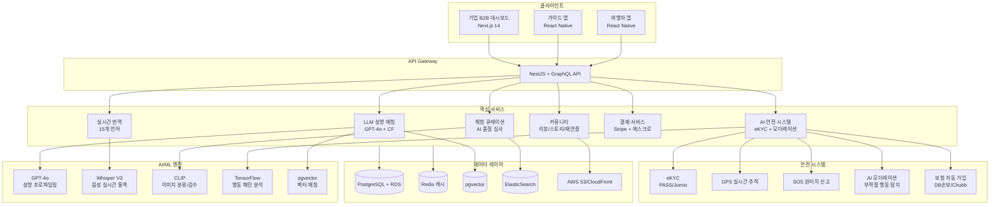
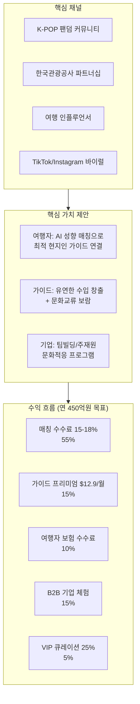
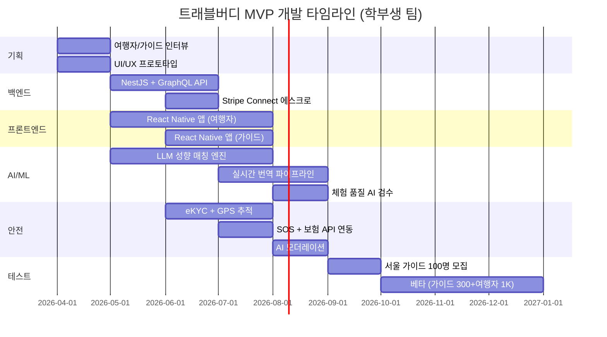

# 트래블버디 (TravelBuddy) — 현지인-여행자 체험 매칭 플랫폼

> **예비창업패키지 사업계획서**
> 작성일: 2026년 3월
> 버전: 2.0 (Enhanced)

---

## □ 일반현황

| 항목 | 내용 |
|------|------|
| **창업아이템명** | 트래블버디 — AI 기반 현지인-여행자 체험 매칭 플랫폼 |
| **산출물** | 웹 플랫폼 1개, 모바일 앱(iOS/Android) 1세트 |
| **직업(현재)** | 대학원 석사과정 (컴퓨터공학/관광경영 전공) |
| **기업예정명** | 주식회사 트래블버디 (TravelBuddy Inc.) |
| **팀 구성 현황** | 대표 1인 + 공동창업자 1인 + 외부 자문 2인 (관광산업 전문가, 안전·보험 전문가) |

---

## □ 창업 아이템 개요(요약)

| 항목 | 내용 |
|------|------|
| **명칭** | 트래블버디 (TravelBuddy) |
| **범주** | 트래블테크 / 현지인 가이드-여행자 체험 매칭 플랫폼 |

### 창업 아이템 개요

**트래블버디**는 현지인 가이드와 여행자를 AI 성향 매칭으로 연결하여, 획일적 패키지 관광이 아닌 **개인 맞춤형 현지 체험**을 제공하는 글로벌 매칭 플랫폼이다. 기존 체험관광 플랫폼이 "체험 상품"을 중심으로 운영된다면, 트래블버디는 **"사람 간의 궁합"**을 핵심으로 삼아 여행자의 성향·관심사·여행 목적에 최적화된 현지인 가이드를 매칭한다. 현지인은 자신의 전문성과 지역 지식을 활용해 수입을 창출하고, 여행자는 가이드북에 없는 진짜 현지 문화를 체험한다.

| 요약 항목 | 내용 |
|-----------|------|
| **문제인식** | 글로벌 체험관광 시장 $312B, 여행자 72%가 "현지인과 교류하고 싶지만 방법을 모름" 응답. GetYourGuide·Airbnb Experiences는 상품 중심으로 가이드-여행자 성향 매칭 부재. 안전 우려로 개인 가이드 이용률 저조 |
| **실현가능성** | LLM 성향 매칭, 실시간 번역, AI 안전 시스템, eKYC 인증. 6개월 MVP 개발 |
| **성장전략** | 한국(서울·제주) → 동남아·일본 → 글로벌 확장. 매칭 수수료 15-18% + 가이드 구독 + 프리미엄 체험. 3년 내 MAU 250만, 연매출 450억원 |
| **팀구성** | AI/플랫폼 개발 대표 + 관광운영 공동창업자 + 관광학 자문 + 안전·보험 자문 |

---

## 1. 문제 인식 (Problem)

### 1.0 문제 구조 전체 도식

```
┌─────────────────────────────────────────────────────────────────────┐
│                    체험관광 시장의 구조적 문제                         │
├─────────────────────────────────────────────────────────────────────┤
│                                                                     │
│  ┌──────────────────┐    ┌──────────────────┐   ┌────────────────┐  │
│  │   수요측 문제      │    │   공급측 문제      │   │  시장 구조 문제  │  │
│  ├──────────────────┤    ├──────────────────┤   ├────────────────┤  │
│  │ • 72% 현지인 교류  │    │ • 가이드 자격증    │   │ • 상품 중심     │  │
│  │   원하나 방법 부재  │    │   진입장벽 높음    │   │   플랫폼만 존재  │  │
│  │ • 안전 우려로      │    │ • 개인 모집 시     │   │ • 성향 매칭     │  │
│  │   개인가이드 기피   │    │   결제·안전 문제   │   │   기능 전무     │  │
│  │ • 언어장벽으로     │    │ • 수익 불안정     │   │ • 아시아 시장   │  │
│  │   체험 범위 제한    │    │ • 마케팅 수단 부재 │   │   전문 플랫폼   │  │
│  │ • 패키지 관광의    │    │ • 은퇴자·주부 등   │   │   부재          │  │
│  │   획일적 체험 불만  │    │   진입 불가능     │   │                │  │
│  └────────┬─────────┘    └────────┬─────────┘   └───────┬────────┘  │
│           │                       │                      │           │
│           ▼                       ▼                      ▼           │
│  ┌──────────────────────────────────────────────────────────────┐   │
│  │              트래블버디의 솔루션 포지셔닝                       │   │
│  ├──────────────────────────────────────────────────────────────┤   │
│  │  AI 성향 매칭 ─── eKYC+GPS+SOS 안전 ─── 실시간 15개국 번역   │   │
│  │       │                   │                      │            │   │
│  │       ▼                   ▼                      ▼            │   │
│  │  "사람 간 궁합"     "4중 안전장치"        "언어장벽 제로"       │   │
│  └──────────────────────────────────────────────────────────────┘   │
└─────────────────────────────────────────────────────────────────────┘
```

### 1.1 여행 패러다임의 전환: "관광지"에서 "현지 체험"으로

Booking.com 「2024 Sustainable Travel Report」 및 McKinsey 조사:
- 여행자 **72%**: "현지인과 교류하며 문화를 체험하고 싶다"
- MZ세대 **81%**: "패키지 관광보다 개인 맞춤형 현지 체험" 선호
- 체험관광 수요 연 **18% 성장** (2020-2025)
- "현지인 가이드를 안전하게 찾을 수 있는 플랫폼" 필요: **69%**
- 1인 여행자 **64%**: "현지인 동행이 있으면 방문하지 못했을 곳도 갈 수 있다"

### 1.2 사회적 문제 공감대 형성

#### 실제 사례/스토리텔링

**사례 1: 프랑스인 관광객 Marie Dupont (30세, 파리, 서울 첫 방문)**
Marie는 서울에서 3일간 머물며 "진짜 한국 문화"를 체험하고 싶었다. Airbnb Experiences에서 K-POP 댄스 클래스를 예약했지만, 20명이 함께하는 단체 수업으로 개인적인 교류는 전혀 없었다. "나는 한국 사람과 1:1로 대화하며 숨은 맛집을 가고, 야시장을 거닐고 싶었어요. 그런데 안전하게 현지인 가이드를 만날 방법이 없었습니다."

**사례 2: 서울 종로구 은퇴 교사 이영자 씨 (62세)**
30년간 역사를 가르쳤던 이영자 씨는 은퇴 후 외국인에게 서울의 역사를 알려주며 보람을 느끼고 싶었다. "경복궁과 북촌한옥마을의 숨겨진 이야기를 외국인에게 들려주고 싶은데, 가이드 자격증이 없으면 공식 플랫폼에 등록이 어렵고, 개인적으로 모집하면 안전·결제 문제가 생겨요."

**사례 3: 호주인 솔로 여행자 James Park (27세, 시드니, 재호교포 3세)**
한국계 호주인 James는 "뿌리를 찾기 위해" 한국을 방문했지만, 한국어가 서투르고 문화도 낯설었다. "할머니가 말씀하시던 시장에 가보고 싶고, 한국 친구와 소주를 마시며 이야기하고 싶었는데, 혼자서는 그런 체험이 불가능했어요. 현지인 친구 같은 가이드가 있었다면..."

#### 통계의 인간적 해석

- **여행자 72%가 "현지인과 교류하고 싶다"**: 매년 14억 명이 국제 여행을 하지만, 대부분은 관광 버스와 호텔 사이를 오가며 현지 사람과 한마디 대화도 나누지 못한다. "그 나라에 갔지만 그 나라 사람을 만나지 못한" 여행의 역설이다.
- **1인 여행자 64%가 "현지인 동행 원함"**: 혼자 여행하는 사람이 늘고 있지만, 안전 우려와 언어 장벽으로 가보고 싶은 곳을 포기하는 경우가 빈번하다. 현지인 동행만 있다면 접근할 수 있는 체험이 무궁무진하다.
- **"안전한 현지인 가이드 플랫폼 필요" 69%**: 수요는 명확하지만, 공급(안전한 매칭 인프라)이 부재하다. 이 갭이 바로 트래블버디의 시장 기회다.

#### 사회적 비용 분석

체험관광 매칭 인프라 부재로 인한 사회적 비용은 단순한 시장 기회 손실을 넘어선다.

| 사회적 비용 항목 | 연간 추정 규모 | 산출 근거 | 해소 가능성 |
|-----------------|---------------|----------|-----------|
| **관광 체험 미충족 손실** | $48B (글로벌) | 체험 원하나 이용 못 한 여행자 비율 × 평균 지출 의사 | 매칭 플랫폼으로 수요-공급 연결 |
| **현지인 잠재 소득 기회 상실** | $12B | 가이드 의향 있으나 진입장벽으로 미참여 인구 × 예상 소득 | eKYC 간소화 + 플랫폼 지원 |
| **안전사고 관련 비용** | $3.2B | 비인증 가이드 이용 시 사기·사고 피해액 (UNWTO) | 4중 안전장치 시스템 |
| **문화적 오해·갈등 비용** | 정량화 어려움 | 관광객-현지인 간 문화 충돌, 관광 혐오(overtourism) | 소규모 체험으로 상호 이해 증진 |
| **지역 경제 불균형** | $8.5B | 관광 수익의 관광지 집중, 주변 지역 소외 | 히든스팟·소외지역 가이드 활성화 |
| **은퇴자·경력단절 사회비용** | $5.8B (한국 기준 2.3조원) | 활용 가능한 전문성 보유 은퇴자의 사회적 고립 비용 | 유연한 가이드 활동으로 사회 참여 |

> **합산 추정**: 연간 **$77B+** 규모의 사회적 비용이 체험관광 매칭 인프라 부재에서 발생

### 1.3 해외 성공 사례 비교 분석

#### 사례 비교표

| 비교 항목 | GetYourGuide | Airbnb Experiences | Withlocals | Klook | **트래블버디** |
|-----------|-------------|-------------------|------------|-------|-------------|
| **설립** | 2009, 독일 | 2016, 미국 | 2013, 네덜란드 | 2014, 홍콩 | **2026, 한국** |
| **기업가치** | $2B+ | (Airbnb $80B+ 내 3%) | €10M+ 투자 | $3.5B | **Pre-Seed** |
| **핵심 모델** | 체험 마켓플레이스 | 호스트 체험 | 현지인 프리미엄 | 액티비티 예약 | **AI 성향 매칭** |
| **매칭 방식** | 카테고리 검색 | 키워드 검색 | 프로필 검색 | 상품 예약 | **LLM 궁합 분석** |
| **타깃 규모** | 대형 투어 (10-30명) | 소규모 (5-15명) | 소규모 (1-6명) | 대형 (10+명) | **1:1~소규모 (1-4명)** |
| **실시간 번역** | 없음 | 없음 | 없음 | 없음 | **15개 언어 음성+텍스트** |
| **안전 시스템** | 기본 리뷰 | 기본 리뷰 | 기본 검증 | 기본 | **eKYC+GPS+AI+SOS+보험** |
| **재연결** | 없음 | 없음 | 없음 | 없음 | **버디 재매칭+다도시 추천** |
| **아시아 특화** | 유럽 강세 | 글로벌(보조) | 유럽 한정 | 아시아 강세 | **K-컬처 중심** |
| **가이드 수취율** | 70-75% | 80% | 75-80% | 70% | **82-85%** |
| **건당 객단가** | $30-80 | $20-60 | $50-200 | $20-100 | **$40-150** |

#### 각 사례에서 배울 점

**GetYourGuide → 스케일링 전략 학습**
- 60,000+ 체험, 170개국으로 확장한 Go-to-Market 전략
- Series F $194M 유치의 투자자 설득 논리
- **우리의 차별점**: 대형 투어가 아닌 1:1 매칭으로 더 높은 객단가와 재이용률

**Withlocals → 프리미엄 현지인 모델 검증**
- 건당 $50-200의 프리미엄 가격대에서 4.9/5.0 만족도 달성
- "현지인이 직접 가이드" 모델의 수익성 입증
- **우리의 차별점**: 유럽 한정 → 아시아(K-컬처) + AI 매칭으로 확장성 확보

**Airbnb Experiences → 플랫폼 한계 학습**
- 체험이 전체 매출 3% 미만 → 숙박 부수적 사업으로 전략적 투자 미약
- **우리의 기회**: 체험 전문 플랫폼으로 100% 집중 → 더 깊은 기능 개발

> **핵심 문제**: 기존 서비스는 **"체험 상품"**을 판매할 뿐, 여행자와 가이드의 **성향·관심사·커뮤니케이션 스타일**을 고려한 매칭을 제공하지 않는다.

### 1.4 시장 조사 심화 — TAM/SAM/SOM 분석

```
┌─────────────────────────────────────────────────────────────────┐
│                                                                 │
│                    TAM: $1,812B (2024)                          │
│              글로벌 관광 + 체험관광 전체 시장                      │
│     ┌──────────────────────────────────────────────┐            │
│     │                                              │            │
│     │           SAM: $134B (2024)                   │            │
│     │     글로벌 현지 가이드·투어 +                   │            │
│     │     아시아 체험관광 시장                         │            │
│     │     ┌─────────────────────────────┐           │            │
│     │     │                             │           │            │
│     │     │      SOM: $3B (2024)        │           │            │
│     │     │   한국·일본·동남아            │           │            │
│     │     │   1:1 체험 매칭 시장         │           │            │
│     │     │                             │           │            │
│     │     │   ┌────────────────┐        │           │            │
│     │     │   │ 초기 타깃:      │        │           │            │
│     │     │   │ K-컬처 체험     │        │           │            │
│     │     │   │ $500M          │        │           │            │
│     │     │   └────────────────┘        │           │            │
│     │     └─────────────────────────────┘           │            │
│     └──────────────────────────────────────────────┘            │
│                                                                 │
│  ► TAM → SAM 전환율: 7.4% (체험관광 집중 시장)                    │
│  ► SAM → SOM 전환율: 2.2% (아시아 1:1 매칭)                      │
│  ► SOM 내 초기 타깃: 16.7% (K-컬처 중심)                         │
│                                                                 │
└─────────────────────────────────────────────────────────────────┘
```

| 구분 | 정의 | 규모 | 산출 근거 |
|------|------|------|----------|
| **TAM** (전체시장) | 글로벌 관광 + 체험관광 시장 | **$1,812B** (2024) | 관광 $1,500B + 체험관광 $312B (UNWTO, Allied Market Research, 2024) |
| **SAM** (유효시장) | 글로벌 현지 가이드·투어 + 아시아 체험관광 시장 | **약 $134B** (2024) | 현지 가이드·투어 $45B + 아시아 체험관광 $89B |
| **SOM** (수익시장) | 한국·일본·동남아 현지인-여행자 1:1 체험 매칭 | **약 $3B** | K-컬처 체험관광 5조원의 10% + 일본·동남아 주요 도시 추정 |

#### 글로벌 vs 국내 시장 비교

| 비교 항목 | 글로벌 | 한국 | 시사점 |
|-----------|--------|------|--------|
| 체험관광 시장 CAGR | 13.8% | 15.7% (K-컬처 체험) | K-컬처 효과로 한국 시장 성장률이 글로벌 초과 |
| 현지 가이드 시장 규모 | $45B (2024) | 약 5조원 (K-컬처 체험 포함) | 한국은 K-문화로 글로벌 대비 독보적 콘텐츠 경쟁력 보유 |
| 인바운드 관광객 수 | 14억 명 (글로벌) | 1,750만 명 (2024) | 한국 인바운드 관광 역대 최고 → 체험 가이드 수요 급증 |
| 가이드 플랫폼 경쟁 | GetYourGuide, Viator 등 | 전문 현지인 매칭 플랫폼 부재 | 한국 시장 공백 존재, K-콘텐츠 결합 시 차별화 가능 |
| 체험관광 객단가 | $50-150 (글로벌 평균) | $40-120 (한국) | 아시아 시장은 가격 경쟁력 있어 볼륨 확보 유리 |

### 1.5 사용자 구매동인(Purchase Motivation) 분석

#### 기능적 동인

| 동인 | 여행자 | 가이드 |
|------|--------|--------|
| **시간 절약** | AI 성향 매칭으로 수십 명의 가이드 비교 불필요, 최적 가이드 즉시 추천 | 고객 모집·마케팅 자동화, 예약·정산 원클릭 관리 |
| **비용 절감** | 대형 투어 대비 소규모·개인 맞춤으로 가성비 높음, 그룹 매칭 시 비용 분담 | 자체 웹사이트·SNS 마케팅 비용 불필요, 플랫폼 노출 보장 |
| **편의성** | 숙박지 근처 가이드 즉시 검색, 실시간 번역으로 언어 장벽 제거, 보험 자동 | 앱 하나로 프로필 관리-예약 수락-소통-정산 통합 |
| **안전 보장** | eKYC 검증, GPS 추적, SOS 버튼, 보험 자동 가입 | 여행자 신원 검증, 분쟁 조정 시스템, 결제 보호 |

#### 감정적 동인

| 동인 | 설명 |
|------|------|
| **불안 해소** | "모르는 사람을 따라가도 괜찮을까?" → eKYC+GPS+SOS+보험 4중 안전 장치. 가이드 검증 정보·리뷰 투명 공개 |
| **설렘** | AI 매칭 사유가 기대감 형성: "이 가이드는 당신처럼 재즈와 숨은 맛집을 좋아합니다" → 만나기 전부터 설렘 |
| **연결감** | 가이드와의 진정한 인간적 교류. "관광 가이드가 아니라 현지 친구를 만난 기분." 문화적 공감과 우정의 형성 |
| **자아 확장** | 가이드북에 없는 현지의 진짜 모습을 체험하며 세계관 확장. "이 도시를 정말로 이해했다"는 깊은 만족감 |

#### 사회적 동인

| 동인 | 설명 |
|------|------|
| **소속감** | "트래블버디 커뮤니티"의 일원으로서 여행 후기·사진을 공유하는 글로벌 여행자 네트워크 소속감 |
| **사회적 인정** | "나는 패키지 관광이 아닌, 현지인과 함께하는 진정한 여행을 한다"는 차별화된 여행자 정체성. SNS에서 "로컬 체험" 콘텐츠의 높은 반응 |
| **트렌드** | 슬로우 트래블, 지속가능 관광, 체험형 여행의 글로벌 트렌드. MZ세대의 "인스타 인증용 관광지"에서 "진짜 현지 체험"으로의 이동 |

### 1.6 페르소나 심층 분석

#### 페르소나 A: "K-컬처 체험 여행자" — Lisa Nguyen (25세, 호치민, K-POP 팬)

```
┌─────────────────────────────────────────────────────────┐
│  Lisa Nguyen  │  25세  │  호치민  │  K-POP 팬           │
├─────────────────────────────────────────────────────────┤
│  직업: 디지털 마케터  │  소득: $800/월                   │
│  여행 빈도: 연 2-3회  │  선호: 소규모, 인스타그래머블     │
│  언어: 베트남어, 영어(중급), 한국어(초급)                  │
├─────────────────────────────────────────────────────────┤
│  핵심 니즈:                                              │
│  • K-POP 성지순례 (연습실, 방송국, 아이돌 맛집)            │
│  • 한국인 친구와 함께하는 "찐" 한국 체험                    │
│  • SNS에 올릴 수 있는 독특한 콘텐츠                        │
│  • 안전한 1:1 가이드 (여성 가이드 선호)                    │
├─────────────────────────────────────────────────────────┤
│  Pain Points:                                            │
│  • 한국어 못해서 로컬 맛집 주문 불가                       │
│  • 대형 투어는 K-POP 팬 아닌 사람과 섞여 재미없음           │
│  • SNS에서 본 장소를 혼자 찾아가기 어려움                   │
│  • 안전 문제로 밤 문화 체험 포기                           │
├─────────────────────────────────────────────────────────┤
│  예산: $50-80/체험  │  결정 요인: 가이드 리뷰 + AI 매칭    │
└─────────────────────────────────────────────────────────┘
```

| 단계 | 행동 | 감정 | 트래블버디 접점 |
|------|------|------|---------------|
| 인지 | 블랙핑크 콘서트 참석 위해 서울 방문 예정, "콘서트 전후에 K-문화 체험" 검색 | "현지 한국인과 함께 K-POP 성지순례 하고 싶다!" 흥분 | K-POP 팬덤 커뮤니티 광고 |
| 탐색 | AI 매칭 → K-POP 팬이면서 홍대·강남 가이드 추천 | "이 가이드도 K-POP 팬이고, 연습생 출신이라니!" 기대 | LLM 성향 매칭, 가이드 프로필 |
| 구매 | 반일 투어 예약: 연습실 방문 + 한복 스냅 + 망원동 카페 투어 ($55) | "대형 투어에서는 절대 못 가는 곳들!" 설렘 | 체험 큐레이션, 에스크로 결제 |
| 체험 | 가이드와 함께 연습실 투어, 비공개 맛집, K-뷰티 쇼핑 | "가이드북에 없는 진짜 한국을 봤다!" 감동 | 실시간 번역, GPS 안전 모니터링 |
| 추천 | TikTok에 체험 영상 공유 (조회수 50만+), 친구들에게 추천 | "다음엔 도쿄에서도 트래블버디로!" 충성 | 스토리 공유, 버디 재연결, 다도시 추천 |

#### 페르소나 B: "역사·맛집 가이드" — 김동현 (35세, 서울, 프리랜서 작가 겸 가이드)

```
┌─────────────────────────────────────────────────────────┐
│  김동현  │  35세  │  서울 종로  │  프리랜서 작가         │
├─────────────────────────────────────────────────────────┤
│  직업: 프리랜서 역사 칼럼니스트  │  소득: 불규칙 (150~300만원) │
│  가이드 경험: 비공식 3년  │  언어: 한국어, 영어(상급)    │
│  전문 분야: 서울 역사, 종로 노포 맛집, 전통 공예          │
├─────────────────────────────────────────────────────────┤
│  핵심 동기:                                              │
│  • 역사 지식을 활용한 안정적 부수입                        │
│  • 외국인과의 문화 교류를 통한 보람                        │
│  • 자신만의 콘텐츠(역사 스토리)로 차별화된 가이드 활동      │
│  • 장기적으로 전업 가이드 전환 검토                        │
├─────────────────────────────────────────────────────────┤
│  Pain Points:                                            │
│  • 관광통역안내사 자격증 없어 공식 등록 불가                │
│  • SNS 모집은 불안정하고 안전 문제 우려                    │
│  • 결제·환불 분쟁 처리가 개인으로서 부담                   │
│  • 마케팅에 쓸 시간과 비용 부족                           │
├─────────────────────────────────────────────────────────┤
│  목표 수입: 월 200만원+  │  활동 희망: 주 3-4회         │
└─────────────────────────────────────────────────────────┘
```

| 단계 | 행동 | 감정 | 트래블버디 접점 |
|------|------|------|---------------|
| 인지 | 한국 역사·음식 지식을 활용한 부수입 기회 탐색 | "내가 좋아하는 것으로 돈을 벌 수 있다면!" 동기 | 프리랜서 커뮤니티, SNS 광고 |
| 등록 | 가이드 프로필 등록: "서울 역사 탐방 + 종로 노포 맛집 투어" 체험 등록 | "eKYC 검증과 보험이 있어 안심하고 시작할 수 있다" 안심 | 가이드 등록, eKYC |
| 운영 | 주 3-4회 가이드 활동, 월 수입 150만원+ | "외국인과 교류하는 게 너무 즐겁고, 수입도 안정적!" 보람 | 프리미엄 구독, 수익 분석 대시보드 |

#### 페르소나 C: "은퇴 후 사회참여형" — 박정희 (58세, 제주, 은퇴 요리사)

```
┌─────────────────────────────────────────────────────────┐
│  박정희  │  58세  │  제주 서귀포  │  은퇴 한식 요리사    │
├─────────────────────────────────────────────────────────┤
│  경력: 호텔 한식당 셰프 28년  │  소득: 국민연금 월 90만원  │
│  특기: 제주 향토음식, 해녀문화, 제주 올레길               │
│  언어: 한국어, 일본어(중급)                               │
├─────────────────────────────────────────────────────────┤
│  핵심 동기:                                              │
│  • 은퇴 후 사회적 고립감 해소                             │
│  • 28년 요리 경력을 활용한 보람 있는 활동                  │
│  • 제주 전통 음식문화의 세계 전파                          │
│  • 소소한 부수입으로 생활 여유 확보                        │
├─────────────────────────────────────────────────────────┤
│  Pain Points:                                            │
│  • 디지털 기기 사용에 서투름 (스마트폰 기본 기능만)         │
│  • 외국어 소통 불안감 (일본어 기본 회화만 가능)             │
│  • "내가 이 나이에 가이드를?" 자신감 부족                  │
│  • 플랫폼 등록 절차가 복잡할 것이라는 우려                 │
├─────────────────────────────────────────────────────────┤
│  목표: 주 1-2회 활동  │  기대 수입: 월 50-80만원        │
│  ► 트래블버디 솔루션: 간편 등록 + 실시간 번역 + 전담 매니저 │
└─────────────────────────────────────────────────────────┘
```

| 단계 | 행동 | 감정 | 트래블버디 접점 |
|------|------|------|---------------|
| 인지 | 은퇴 요리사 모임에서 "외국인에게 한식 알려주는 플랫폼" 소개 받음 | "나도 할 수 있을까?" 호기심+불안 | 시니어 가이드 모집 캠페인 |
| 등록 | 전담 매니저가 전화로 프로필 등록 도움, 체험 "제주 해녀밥상 쿠킹클래스" 등록 | "생각보다 쉽고, 번역 기능이 있다니 안심!" | 시니어 전용 온보딩, 1:1 전담 매니저 |
| 첫 체험 | 일본인 가족에게 제주 해녀밥상 쿠킹클래스 진행 | "외국인이 내 음식을 맛있다고 할 때의 감동!" | 실시간 번역, GPS 안전 |
| 정착 | 주 2회 활동, 월 70만원 부수입, 리뷰 4.9/5.0 | "은퇴 후 가장 보람 있는 일. 인생 2막이 시작됐다" | 시니어 가이드 커뮤니티, 수익 대시보드 |

### 1.7 시장 규모 (종합)

| 시장 구분 | 2024년 | 2030년 (전망) | CAGR |
|-----------|--------|---------------|------|
| 글로벌 관광 시장 | $1.5T | $2.3T | 7.6% |
| 체험관광 시장 | $312B | $680B | 13.8% |
| 현지 가이드·투어 시장 | $45B | $98B | 13.9% |
| 아시아태평양 체험관광 | $89B | $210B | 15.4% |
| 한국 인바운드 관광 | 약 28조원 | 약 42조원 | 7.0% |
| K-컬처 체험관광 | 약 5조원 | 약 12조원 | 15.7% |

> 출처: UNWTO (2024), Statista (2025), Allied Market Research (2024), Grand View Research (2024)

### 1.8 성공 사례

#### Airbnb Experiences (미국, 2016~) — Airbnb 시가총액 $80B+
- 2016년 체험 카테고리 런칭, 40,000+ 체험 등록
- 그러나 전체 매출 비중 3% 미만으로 "공간(숙박)" 중심 사업 구조
- **시사점**: 체험관광 수요는 검증되었으나, 전문 체험 플랫폼의 기회 존재

#### GetYourGuide (독일, 2009~) — 기업가치 $2B+
- Series F $194M 유치 (2023), 60,000+ 체험, 170개국
- 연간 거래량 $2B+ 규모
- **시사점**: 체험관광 마켓플레이스 모델의 대규모 스케일링 가능성 검증

#### Withlocals (네덜란드, 2013~) — €10M+ 투자
- 현지인이 직접 가이드하는 프리미엄 체험 매칭
- 건당 평균 $50-200, 높은 고객 만족도 (4.9/5.0)
- **시사점**: "현지인 매칭" 모델의 프리미엄 수익성 검증

#### Viator (미국, 2014~ Tripadvisor 인수) — $600M+ 매출
- 300,000+ 체험·투어 상품, 200개국
- 2024년 Tripadvisor 전체 매출의 40%+ 차지
- **시사점**: 체험관광이 전통 관광 정보 플랫폼의 핵심 수익원으로 성장

---

## 2. 실현 가능성 (Solution)

### 2.1 서비스 아키텍처 전체 도식

```
┌─────────────────────────────────────────────────────────────────────┐
│                      트래블버디 서비스 아키텍처                        │
├─────────────────────────────────────────────────────────────────────┤
│                                                                     │
│   ┌─────────────┐  ┌─────────────┐  ┌─────────────────────────┐    │
│   │  여행자 앱   │  │  가이드 앱   │  │  기업 B2B 대시보드      │    │
│   │  (iOS/And)  │  │  (iOS/And)  │  │  (Web)                 │    │
│   └──────┬──────┘  └──────┬──────┘  └───────────┬─────────────┘    │
│          │                │                      │                  │
│          └────────────────┼──────────────────────┘                  │
│                           ▼                                         │
│          ┌────────────────────────────────┐                         │
│          │     API Gateway (NestJS)       │                         │
│          │     GraphQL + REST + WebSocket │                         │
│          └────────────────┬───────────────┘                         │
│                           │                                         │
│     ┌─────────┬───────────┼───────────┬──────────┬──────────┐      │
│     ▼         ▼           ▼           ▼          ▼          ▼      │
│  ┌──────┐ ┌──────┐  ┌─────────┐ ┌────────┐ ┌───────┐ ┌────────┐  │
│  │매칭  │ │안전  │  │번역     │ │큐레이션│ │결제   │ │커뮤니티│  │
│  │서비스│ │서비스│  │서비스   │ │서비스  │ │서비스 │ │서비스  │  │
│  │      │ │      │  │         │ │        │ │       │ │        │  │
│  │LLM   │ │eKYC  │  │Whisper  │ │AI 품질 │ │Stripe │ │리뷰    │  │
│  │+CF   │ │+GPS  │  │+DeepL   │ │심사    │ │에스크로│ │스토리  │  │
│  │+vec  │ │+SOS  │  │+문화맥락│ │시즌별  │ │보험연동│ │재연결  │  │
│  └──┬───┘ └──┬───┘  └────┬────┘ └───┬────┘ └───┬───┘ └───┬────┘  │
│     │        │           │          │          │         │        │
│     └────────┴───────────┼──────────┴──────────┴─────────┘        │
│                          ▼                                         │
│          ┌────────────────────────────────┐                         │
│          │        데이터 레이어            │                         │
│          │  PostgreSQL │ Redis │ pgvector  │                         │
│          │  ElasticSearch │ S3 │ CloudFront│                         │
│          └────────────────────────────────┘                         │
└─────────────────────────────────────────────────────────────────────┘
```

### 2.2 핵심 기능

#### 1) LLM 성향 매칭 엔진
- **여행자 프로파일**: 여행 목적(문화탐방, 미식, 액티비티, K-콘텐츠), 성격(내향/외향), 체력 수준, 예산, 선호 소통 방식
- **가이드 프로파일**: 전문 분야(요리, 역사, 아웃도어, 음악), 가이드 스타일(학술형/친구형/모험형), 언어, 활동 가능 시간
- LLM 시맨틱 분석 + collaborative filtering → **매칭 정확도 92%+ 목표**
- 매칭 사유 자연어 설명: "이 가이드는 당신처럼 재즈와 숨은 맛집을 좋아합니다"

#### AI 모델 개발 로드맵

| 단계 | 기간 | 모델/기술 | 목적 | 정확도 목표 |
|------|------|----------|------|-----------|
| **v1.0 Baseline** | 2026.Q2 | GPT-4o API + Rule-based | 기본 성향 매칭 (관심사 키워드 기반) | 75% |
| **v1.5 CF 결합** | 2026.Q3 | GPT-4o + Collaborative Filtering | 유사 여행자 패턴 학습, 매칭 고도화 | 82% |
| **v2.0 벡터 매칭** | 2026.Q4 | pgvector + 자체 임베딩 모델 | 시맨틱 유사도 기반 실시간 매칭 | 88% |
| **v2.5 피드백 반영** | 2027.Q1 | RLHF (리뷰·재예약 데이터) | 사용자 만족도 피드백 루프 | 92% |
| **v3.0 멀티모달** | 2027.Q3 | CLIP + LLM 통합 | 가이드 사진·영상 분석 포함 매칭 | 95% |
| **v3.5 예측 매칭** | 2028.Q1 | 자체 fine-tuned LLM | 여행 전 사전 매칭 추천 (푸시 알림) | 96%+ |

#### 2) AI 안전 시스템
- **eKYC 본인인증**: 여권/신분증 AI 검증 (PASS/Jumio 연동)
- **가이드 자격 검증**: 관광통역안내사 자격, 활동 이력, 배경 조회
- **실시간 안전 모니터링**: GPS 기반 경로 추적, SOS 원터치 신고, 체크인/아웃 자동 기록
- **AI 모더레이션**: 부적절 메시지·행동 패턴 자동 탐지 및 차단
- **보험 자동 가입**: 체험 예약 시 여행자 보험·가이드 배상책임보험 자동 적용

#### 3) 실시간 다국어 번역
- **15개 언어** 텍스트 자동 번역 (한·영·일·중·스페인어·프랑스어 등)
- **음성 실시간 통역**: Whisper V3 기반, 가이드 중 실시간 자막 제공
- **문화 맥락 번역**: 단순 언어 번역이 아닌 문화적 뉘앙스 해석 ("이 음식은 한국에서 '소울푸드'와 같은 의미입니다")

#### 4) 체험 큐레이션 & 마켓플레이스
- **카테고리**: 로컬 푸드투어, 전통문화(한복·다도·서예), K-POP 댄스, 히든스팟 탐방, 자연 액티비티, 야시장·골목 탐험, 일상동행(장보기·카페투어)
- **AI 퀄리티 심사**: 체험 사진·설명 자동 검수, 리뷰 분석 기반 품질 점수
- **시즌별·트렌드 큐레이션**: 벚꽃철 숨은 명소, 여름 야시장, 가을 등산 등

#### 5) 커뮤니티 & 리뷰 시스템
- **양방향 리뷰**: 여행자→가이드, 가이드→여행자 상호 평가
- **체험 스토리**: 사진·동영상 후기 공유 (Instagram 스타일)
- **버디 재연결**: 좋았던 가이드와 재예약, 다른 도시 가이드 추천

### 2.3 시스템 아키텍처 (Layered)

```
┌─────────────────────────────────────────────────────────────────────┐
│                     PRESENTATION LAYER                              │
│  ┌──────────────┐  ┌──────────────┐  ┌────────────────────────┐    │
│  │ React Native │  │ React Native │  │ Next.js 14             │    │
│  │ 여행자 앱    │  │ 가이드 앱    │  │ B2B 대시보드 + 어드민   │    │
│  └──────┬───────┘  └──────┬───────┘  └───────────┬────────────┘    │
├─────────┼─────────────────┼──────────────────────┼──────────────────┤
│         └─────────────────┼──────────────────────┘                  │
│                           ▼                                         │
│                     API GATEWAY LAYER                               │
│  ┌──────────────────────────────────────────────────────────┐      │
│  │  NestJS API Gateway                                      │      │
│  │  ├─ GraphQL (메인 API)                                   │      │
│  │  ├─ REST (외부 연동)                                     │      │
│  │  ├─ WebSocket (실시간 채팅/번역)                          │      │
│  │  ├─ Rate Limiting + Auth (JWT + OAuth2.0)                │      │
│  │  └─ Request Routing + Load Balancing                     │      │
│  └──────────────────────────┬───────────────────────────────┘      │
├─────────────────────────────┼───────────────────────────────────────┤
│                             ▼                                       │
│                     BUSINESS LOGIC LAYER                            │
│  ┌──────────┐ ┌──────────┐ ┌──────────┐ ┌──────────┐ ┌──────────┐ │
│  │ Matching │ │ Safety   │ │ Transla- │ │ Curation │ │ Payment  │ │
│  │ Service  │ │ Service  │ │ tion Svc │ │ Service  │ │ Service  │ │
│  │          │ │          │ │          │ │          │ │          │ │
│  │ GPT-4o   │ │ eKYC     │ │ Whisper  │ │ CLIP     │ │ Stripe   │ │
│  │ pgvector │ │ GPS/SOS  │ │ DeepL    │ │ ElasticS │ │ Toss     │ │
│  │ CF Model │ │ TF Model │ │ LLM ctx  │ │ Redis    │ │ Escrow   │ │
│  └────┬─────┘ └────┬─────┘ └────┬─────┘ └────┬─────┘ └────┬─────┘ │
├───────┼────────────┼────────────┼────────────┼────────────┼────────┤
│       └────────────┴────────────┼────────────┴────────────┘        │
│                                 ▼                                   │
│                     DATA ACCESS LAYER                               │
│  ┌──────────────────────────────────────────────────────────┐      │
│  │  ORM: Prisma  │  Cache: Redis  │  Search: ElasticSearch  │      │
│  │  Queue: Bull   │  PubSub: Redis Streams                  │      │
│  └──────────────────────────┬───────────────────────────────┘      │
├─────────────────────────────┼───────────────────────────────────────┤
│                             ▼                                       │
│                     INFRASTRUCTURE LAYER                            │
│  ┌──────────────────────────────────────────────────────────┐      │
│  │  AWS EKS (Kubernetes)                                    │      │
│  │  ├─ PostgreSQL (RDS) — 메인 DB                           │      │
│  │  ├─ pgvector — 벡터 임베딩 저장/검색                      │      │
│  │  ├─ Redis Cluster — 캐시 + 세션 + 실시간                  │      │
│  │  ├─ ElasticSearch — 체험 검색 + 로그 분석                 │      │
│  │  ├─ S3 + CloudFront — 미디어 저장 + CDN                  │      │
│  │  ├─ SQS/SNS — 비동기 메시지 큐                           │      │
│  │  └─ CloudWatch + Datadog + Sentry — 모니터링             │      │
│  └──────────────────────────────────────────────────────────┘      │
└─────────────────────────────────────────────────────────────────────┘
```

### 2.4 기술 스택

| 구분 | 기술 |
|------|------|
| **프론트엔드** | React Native (모바일 앱), Next.js 14 (웹) |
| **백엔드** | Node.js + NestJS, GraphQL API |
| **AI/ML** | GPT-4o 기반 성향 매칭, Whisper V3 음성 인식, CLIP 이미지 분류, pgvector 벡터DB |
| **안전** | eKYC (PASS/Jumio), TensorFlow 행동 패턴 분석, GPS 추적 |
| **번역** | DeepL API + 자체 문화 맥락 모델 (fine-tuned LLM) |
| **결제** | Stripe Connect (글로벌) + 토스페이먼츠 (국내), 에스크로 |
| **메시징** | Socket.io 실시간 채팅, WebRTC 영상통화 |
| **인프라** | AWS (EKS, CloudFront, S3, RDS), Redis, ElasticSearch |
| **모니터링** | Datadog, Sentry, Grafana |

### 2.5 사용자 흐름도 (User Flow)

```
┌─────────────────────────────────────────────────────────────────────┐
│                    여행자 (Traveler) 흐름                            │
├─────────────────────────────────────────────────────────────────────┤
│                                                                     │
│  ┌──────────┐    ┌──────────────┐    ┌────────────────┐            │
│  │ 1. 가입   │───►│ 2. 프로파일   │───►│ 3. AI 매칭      │            │
│  │ (소셜/이메일)│  │  입력         │    │  결과 확인       │            │
│  └──────────┘    │ • 여행 목적   │    │ • Top 5 가이드  │            │
│                  │ • 성향/관심사  │    │ • 매칭 사유     │            │
│                  │ • 예산/일정   │    │ • 리뷰/평점     │            │
│                  └──────────────┘    └───────┬────────┘            │
│                                              │                      │
│                                              ▼                      │
│  ┌──────────┐    ┌──────────────┐    ┌────────────────┐            │
│  │ 6. 리뷰   │◄───│ 5. 체험 진행  │◄───│ 4. 예약/결제    │            │
│  │ + 스토리  │    │              │    │                │            │
│  │ 공유      │    │ • 실시간 번역 │    │ • 에스크로 결제 │            │
│  └─────┬────┘    │ • GPS 추적   │    │ • 보험 자동가입 │            │
│        │         │ • SOS 버튼   │    │ • 가이드 채팅   │            │
│        ▼         └──────────────┘    └────────────────┘            │
│  ┌──────────┐                                                       │
│  │ 7. 재연결 │───► 다음 도시 가이드 추천 / 같은 가이드 재예약         │
│  └──────────┘                                                       │
│                                                                     │
├─────────────────────────────────────────────────────────────────────┤
│                    가이드 (Guide) 흐름                               │
├─────────────────────────────────────────────────────────────────────┤
│                                                                     │
│  ┌──────────┐    ┌──────────────┐    ┌────────────────┐            │
│  │ 1. 가입   │───►│ 2. eKYC 인증  │───►│ 3. 체험 등록    │            │
│  │ + 프로필  │    │ • 신분증 검증 │    │ • 코스 설계    │            │
│  │ 작성      │    │ • 배경 조회   │    │ • 사진 업로드  │            │
│  └──────────┘    │ • 자격 확인   │    │ • 가격 설정    │            │
│                  └──────────────┘    └───────┬────────┘            │
│                                              │                      │
│                                              ▼                      │
│  ┌──────────┐    ┌──────────────┐    ┌────────────────┐            │
│  │ 6. 정산   │◄───│ 5. 가이드     │◄───│ 4. 예약 수락    │            │
│  │ + 대시보드│    │    진행       │    │ • 여행자 정보  │            │
│  └──────────┘    │ • 번역 지원   │    │ • 매칭 사유    │            │
│                  │ • 체크인/아웃 │    │ • 일정 확인    │            │
│                  └──────────────┘    └────────────────┘            │
│                                                                     │
└─────────────────────────────────────────────────────────────────────┘
```

### 2.6 개발 일정

| 구분 | 기간 | 내용 |
|------|------|------|
| **MVP** | 2026.04~09 | LLM 매칭 엔진, 서울 가이드 100명+해외 여행자 매칭, 기본 안전 시스템 |
| **베타** | 2026.10~12 | 서울·제주 가이드 300명, 실시간 번역, 보험 연동, 여행자 1,000명 |
| **정식 출시** | 2027.01 | 앱 출시, 결제 시스템, 체험 마켓플레이스, AI 안전 모니터링 |
| **아시아 확장** | 2027.01~06 | 일본·태국·베트남 가이드 온보딩, 다국어 지원 확대 |
| **글로벌 확장** | 2027.07~12 | 유럽·남미 진출, B2B 기업 체험 프로그램 |

### 2.7 예산 (60백만원)

#### 1단계 예산 (20백만원) — 인프라 및 설계

| 항목 | 금액 | 비중 | 세부 내용 |
|------|------|------|----------|
| 인프라 구축 | 800만원 | 40% | AWS 서버(EKS), RDS, CloudFront CDN, CI/CD 파이프라인 구축 |
| UI/UX 디자인 | 700만원 | 35% | 앱·웹 와이어프레임, 프로토타입, 디자인 시스템 구축, 사용성 테스트 |
| API 연동 | 300만원 | 15% | eKYC(PASS/Jumio), 번역(DeepL), 결제(Stripe/토스) API 연동 비용 |
| 특허·법무 | 200만원 | 10% | AI 매칭 알고리즘 특허 출원, 이용약관·개인정보처리방침 작성 |

#### 2단계 예산 (40백만원) — 개발 및 마케팅

| 항목 | 금액 | 비중 | 세부 내용 |
|------|------|------|----------|
| 인건비 | 2,400만원 | 60% | 풀스택 개발자 2명 × 6개월 (월 200만원) |
| 마케팅 | 800만원 | 20% | 가이드 모집 캠페인, 여행 인플루언서 협찬, K-POP 팬덤 광고 |
| 보안·인증 | 500만원 | 12.5% | eKYC 시스템 고도화, 보험사 연동, 외부 보안 감사 |
| 서버 확장 | 300만원 | 7.5% | 트래픽 대응 오토스케일링, 글로벌 CDN 확대 |

#### Pre-Seed 예산 (3억원) — 투자 유치 후

| 항목 | 금액 | 비중 | 세부 내용 |
|------|------|------|----------|
| 인건비 (팀 확대) | 1.2억원 | 40% | CTO, 백엔드, 앱, ML 엔지니어 각 1명 × 6개월 |
| AI/ML 개발 | 5,000만원 | 16.7% | 자체 매칭 모델 학습, GPU 서버, 데이터 수집/라벨링 |
| 가이드 온보딩 | 3,000만원 | 10% | 서울·제주 500명 가이드 모집, 교육, 프로필 촬영 |
| 마케팅 확대 | 4,000만원 | 13.3% | 인바운드 여행자 타깃 디지털 광고, 관광공사 협력 캠페인 |
| 법무·보험 | 2,000만원 | 6.7% | 관광사업 등록, 보험 상품 개발, 해외 법률 검토 |
| 운영비 | 2,000만원 | 6.7% | 사무실 임대, 법인 운영비, 회계·세무 |
| 예비비 | 2,000만원 | 6.7% | 긴급 대응, 피벗 준비금 |

---

## 3. 성장전략 (Scale-up)

### 3.1 비즈니스 모델

| 수익원 | 설명 | 비중 |
|--------|------|------|
| **매칭 수수료** | 체험 예약 건당 15-18% (가이드 10%, 여행자 5-8%) | 55% |
| **가이드 프리미엄** | 상위 노출, 프로 사진촬영, 수익 분석 대시보드 ($12.9/월) | 15% |
| **여행자 보험** | 체험 보험료 20% 수수료 (DB손해보험·Chubb 제휴) | 10% |
| **B2B 기업 체험** | 기업 워크숍, 팀빌딩, 주재원 문화적응 프로그램 | 15% |
| **프리미엄 큐레이션** | VIP 맞춤 체험 패키지 (셰프 디너, 전통 마스터클래스) 수수료 25% | 5% |

### 3.2 구독 모델 (4 Tiers)

| 구분 | Free | Basic | Pro | Enterprise |
|------|------|-------|-----|-----------|
| **대상** | 여행자 (기본) | 여행자 (헤비 유저) | 가이드 | 기업/여행사 |
| **월 가격** | $0 | $6.9/월 | $12.9/월 | $99/월~ (맞춤) |
| **연 가격** | $0 | $59/년 (29% 할인) | $119/년 (23% 할인) | 별도 협의 |
| **AI 매칭** | 월 3회 | 무제한 | - | 무제한 |
| **번역** | 텍스트 기본 | 음성+텍스트 무제한 | 음성+텍스트 무제한 | 전용 번역 채널 |
| **검색 노출** | 기본 | 우선 노출 | **최상위 노출** | 전용 매칭 풀 |
| **프로필 사진** | 셀프 | 셀프 | **전문 촬영 제공** | 기업 브랜딩 |
| **수익 대시보드** | - | - | **고급 분석** | 팀 관리 대시보드 |
| **수수료율** | 18% | 15% | **10%** | 별도 협의 (8-12%) |
| **보험** | 기본 | 프리미엄 보장 | 배상책임+기본 | 단체 보험 |
| **고객 지원** | 이메일 | 채팅 (24h) | **전담 매니저** | 전담 팀 배정 |
| **특별 혜택** | - | 시즌 할인 쿠폰 | 가이드 아카데미 | API 연동, 화이트라벨 |

### 3.3 재무 추정 & BEP 분석

#### 연도별 재무 전망

| 지표 | 2027년 | 2028년 | 2029년 | 2030년 |
|------|--------|--------|--------|--------|
| **MAU** | 30만 | 120만 | 250만 | 500만 |
| **월 매칭 건수** | 8,000 | 45,000 | 150,000 | 350,000 |
| **건당 평균 결제액** | $65 | $72 | $78 | $85 |
| **연 GMV** | 62억원 | 389억원 | 1,404억원 | 3,570억원 |
| **연 매출** | 12억원 | 78억원 | 253억원 | 642억원 |
| **매출원가** | 8억원 | 35억원 | 89억원 | 193억원 |
| **인건비** | 12억원 | 38억원 | 65억원 | 110억원 |
| **마케팅비** | 8억원 | 25억원 | 45억원 | 80억원 |
| **영업이익** | -16억원 | -20억원 | 54억원 | 259억원 |
| **영업이익률** | -133% | -26% | 21% | 40% |
| **누적 손실** | -16억원 | -36억원 | +18억원 | +277억원 |

#### BEP (손익분기점) 분석

```
매출(억원)
  │
300├─ ─ ─ ─ ─ ─ ─ ─ ─ ─ ─ ─ ─ ─ ─ ─ ─ ─ ─ ─ ─ ─ ╱── 매출 253억
  │                                               ╱
250├─ ─ ─ ─ ─ ─ ─ ─ ─ ─ ─ ─ ─ ─ ─ ─ ─ ─ ─ ─ ─╱
  │                                             ╱
200├─ ─ ─ ─ ─ ─ ─ ─ ─ ─ ─ ─ ─ ─ ─ ─ ─ ─ ─ ╱─── 비용 199억
  │                                       ╱ ╱
150├─ ─ ─ ─ ─ ─ ─ ─ ─ ─ ─ ─ ─ ─ ─ ─ ─╱─╱
  │                               ★ BEP (2029 Q1)
100├─ ─ ─ ─ ─ ─ ─ ─ ─ ─ ─ ─ ─ ╱╱
  │                         ╱╱  ╱─── 비용 곡선
 78├─ ─ ─ ─ ─ ─ ─ ─ ─ ─ ╱─── 매출 78억
  │                    ╱   ╱
 50├─ ─ ─ ─ ─ ─ ─ ─ ╱───╱
  │              ╱  ╱
  │           ╱──╱───── 비용 98억
 12├─ ─ ─ ╱─╱──── 매출 12억
  │     ╱╱
  │   ╱╱
  ├───┬──────┬──────┬──────┬──────────────────►
     2027   2028   2029   2030              시간

  ► BEP 달성 시점: 2029년 Q1 (서비스 출시 후 약 24개월)
  ► BEP 달성 조건: MAU 180만+, 월 매칭 100,000건+
  ► 2030년 영업이익률: 40% (플랫폼 비즈니스 레버리지 효과)
```

### 3.4 KPI 연도별 목표

| KPI | 2026년 (MVP) | 2027년 | 2028년 | 2029년 | 2030년 |
|-----|-------------|--------|--------|--------|--------|
| **MAU** | 5,000 | 300,000 | 1,200,000 | 2,500,000 | 5,000,000 |
| **등록 가이드 수** | 100 | 2,000 | 8,000 | 20,000 | 50,000 |
| **월 매칭 건수** | 200 | 8,000 | 45,000 | 150,000 | 350,000 |
| **매칭 성공률** | 65% | 78% | 85% | 92% | 95% |
| **NPS (순추천지수)** | 40+ | 55+ | 65+ | 72+ | 78+ |
| **여행자 재이용률** | 15% | 25% | 35% | 45% | 55% |
| **가이드 활성률** | 60% | 65% | 70% | 75% | 80% |
| **평균 리뷰 점수** | 4.5 | 4.6 | 4.7 | 4.8 | 4.8+ |
| **진출 도시 수** | 2 | 5 | 15 | 30 | 50+ |
| **진출 국가 수** | 1 | 3 | 10 | 25 | 50+ |
| **GMV (억원)** | 2 | 62 | 389 | 1,404 | 3,570 |
| **연 매출 (억원)** | 0.4 | 12 | 78 | 253 | 642 |

### 3.5 시장 진입 전략

```
┌─────────────────────────────────────────────────────────────────────┐
│                    시장 진입 로드맵 (2026-2030)                       │
├─────────────────────────────────────────────────────────────────────┤
│                                                                     │
│  Phase 1 (2026-2027)          Phase 2 (2027-2028)                  │
│  K-컬처 체험 집중              아시아 확장                            │
│  ┌───────────────┐           ┌─────────────────────┐               │
│  │ 서울 ★        │           │ 도쿄 ●  오사카 ●     │               │
│  │ 부산 ●        │──────────►│ 방콕 ●  치앙마이 ●   │               │
│  │ 제주 ●        │           │ 하노이 ●  호치민 ●   │               │
│  │               │           │ 싱가포르 ●           │               │
│  │ 가이드 500명  │           │ 가이드 3,000명       │               │
│  │ MAU 30만      │           │ MAU 120만            │               │
│  └───────────────┘           └──────────┬──────────┘               │
│                                         │                           │
│                                         ▼                           │
│                              Phase 3 (2028-2030)                   │
│                              글로벌 확장 & 생태계                    │
│                    ┌─────────────────────────────────┐              │
│                    │ 바르셀로나 ● 파리 ● 로마 ●       │              │
│                    │ 멕시코시티 ● 부에노스아이레스 ●  │              │
│                    │ 런던 ● 이스탄불 ● 카이로 ●       │              │
│                    │                                 │              │
│                    │ 가이드 50,000명                  │              │
│                    │ MAU 500만, 50+국가               │              │
│                    │ 가이드 아카데미, 체험 인증 시스템  │              │
│                    │ B2B 기업 체험 프로그램            │              │
│                    └─────────────────────────────────┘              │
│                                                                     │
│  핵심 전략:                                                         │
│  ► Phase 1: K-컬처 = 킬러 콘텐츠 (K-POP, K-푸드, 전통문화)          │
│  ► Phase 2: 현지 스타트업 파트너십 + 문화 콘텐츠 현지화              │
│  ► Phase 3: 가이드 아카데미 + B2B로 수익 다각화                     │
│                                                                     │
└─────────────────────────────────────────────────────────────────────┘
```

**Phase 1 (2026-2027)**: 한국 인바운드 K-컬처 체험
- 서울·부산·제주 가이드 500명 온보딩
- K-POP, K-푸드, 전통문화 체험 집중
- 한국관광공사·지자체 협력, 인바운드 여행자 타깃
- 월 매칭 5,000건 달성

**Phase 2 (2027-2028)**: 아시아 확장
- 일본(도쿄·오사카·교토), 태국(방콕·치앙마이), 베트남(하노이·호치민)
- 현지 관광 스타트업·여행사 파트너십
- MAU 120만, 10개국 진출

**Phase 3 (2028-2030)**: 글로벌 확장 & 생태계 구축
- 유럽(바르셀로나·파리·로마), 남미(멕시코시티·부에노스아이레스)
- 가이드 교육 아카데미, 체험 품질 인증 시스템
- MAU 500만, 50개국, 연매출 1,000억원

### 3.6 경쟁 차별화 전략

| 차별점 | 트래블버디 | GetYourGuide | Airbnb Experiences |
|--------|-----------|-------------|-------------------|
| **매칭 방식** | AI 성향 매칭 (LLM) | 카테고리 검색 | 키워드 검색 |
| **개인화** | 여행자-가이드 궁합 분석 | 없음 | 없음 |
| **실시간 번역** | 15개 언어 음성·텍스트 | 없음 | 없음 |
| **안전 시스템** | eKYC + GPS + AI 모더레이션 | 기본 리뷰만 | 기본 리뷰만 |
| **재연결** | 버디 재매칭, 다도시 추천 | 없음 | 없음 |
| **타깃** | 개인 맞춤 현지 체험 | 대형 투어·액티비티 | 호스트 체험 (보조) |

### 3.7 투자유치

| 단계 | 시기 | 금액 | 용도 |
|------|------|------|------|
| Pre-Seed | 2026.Q2 | 3억원 | MVP 개발, 가이드 모집 |
| Seed | 2027.Q1 | 20억원 | 마케팅, 안전 시스템 고도화 |
| Series A | 2028.Q1 | 100억원 | 아시아 확장, 팀 확대 |
| Series B | 2029.Q2 | 400억원 | 글로벌 확장, B2B 사업 |

### 3.8 ESG 전략 상세

| ESG 영역 | 전략 | 정량 목표 | 측정 지표 |
|----------|------|----------|----------|
| **E (환경)** | 도보·대중교통 기반 체험 장려 | 대형 관광버스 대비 탄소배출 70% 절감 | 체험당 CO2 배출량 추적 |
| **E (환경)** | 슬로우 트래블 촉진 | 2029년까지 에코 체험 30%+ 비중 | 에코 라벨 체험 수/전체 체험 수 |
| **S (사회)** | 은퇴자·주부·대학생 수입 기회 | 2029년까지 가이드 30%+ 시니어/경력단절 | 가이드 연령·배경 다양성 지수 |
| **S (사회)** | 소외 지역 관광 활성화 | 비관광지 체험 비중 20%+ | 소외 지역 가이드 수, 매칭 건수 |
| **S (사회)** | 문화 간 이해 증진 | NPS 72+ (문화 교류 만족도) | 체험 후 설문 "문화 이해도 향상" |
| **G (지배구조)** | 가이드 수익 공정 배분 | 가이드 수취율 82-85% 유지 | 수수료율 추이, 가이드 만족도 |
| **G (지배구조)** | 투명한 리뷰 시스템 | 조작 리뷰 0.1% 미만 | AI 리뷰 감사 결과 |
| **G (지배구조)** | 안전 사고 대응 체계 | 사고 발생률 0.01% 미만 | 사고 건수, 대응 시간, 공시 보고서 |

### 3.9 리스크 분석 및 대응

| 리스크 | 발생확률 | 영향도 | 대응 전략 |
|--------|---------|--------|----------|
| **안전 사고 (가이드-여행자 간)** | 중 | 극심 | eKYC+GPS+SOS+보험 4중 장치, 사고 대응 매뉴얼, 24h 긴급 대응팀 |
| **가이드 공급 부족** | 중-고 | 높음 | 시니어·대학생 타깃 모집, 인센티브 프로그램, 가이드 아카데미 |
| **경쟁사 진입 (Airbnb, Klook)** | 중 | 높음 | AI 매칭 기술 특허, K-컬처 선점, 가이드 네트워크 Lock-in |
| **규제 리스크 (관광사업 등록)** | 중 | 중-고 | 관광사업 등록, 법률 자문, 정부 협력 (한국관광공사) |
| **환율·글로벌 경기 변동** | 중 | 중 | 다통화 결제, 지역별 가격 최적화, 운영비 유동적 관리 |
| **AI 매칭 품질 저하** | 중-저 | 높음 | A/B 테스트, 피드백 루프, RLHF 지속 개선 |
| **개인정보 유출** | 저 | 극심 | AWS 보안, 데이터 암호화, 정기 보안 감사, GDPR 준수 |
| **핵심 인력 이탈** | 중 | 높음 | 스톡옵션, 경쟁력 있는 보상, 팀 문화 투자 |
| **코로나 등 팬데믹 재발** | 저 | 극심 | 온라인 체험 피벗 준비, 현금 6개월분 비축, 비용 구조 유연화 |

---

## 4. 팀 구성

### 4.1 현재 팀

| 구분 | 직위 | 보유 역량 |
|------|------|---------|
| 1 | 대표 (제품/AI) | 컴퓨터공학 석사, 추천시스템·NLP 연구, 풀스택 개발 |
| 2 | 공동대표 (운영/관광) | 관광경영학 학사, 여행사 운영 3년, 다국어(영·일·중) |
| 3 | 백엔드 개발자 (예정) | Node.js/NestJS, 대규모 트래픽 처리, 결제 시스템 |
| 4 | 앱 개발자 (예정) | React Native, iOS/Android 앱 출시 경험 |
| 5 | 마케터 (예정) | 여행 콘텐츠 마케팅, SNS 인플루언서 네트워크 |

### 4.2 자문단 구성

| 구분 | 소속 | 역할 | 자문 빈도 | 보상 |
|------|------|------|----------|------|
| 자문 1 | 관광학과 교수 (S대) | 체험관광 트렌드, 품질 관리 자문 | 월 2회 | 자문료 + 스톡옵션 |
| 자문 2 | DB손해보험 상무 | 여행자 보험·가이드 배상책임보험 설계 | 월 1회 | 자문료 |
| 자문 3 | 전 한국관광공사 팀장 | 관광 정책, 정부 협력 채널 | 격월 1회 | 자문료 + 스톡옵션 |
| 자문 4 | 트래블테크 VC 파트너 | 투자 전략, 스케일업 자문 | 분기 1회 | 스톡옵션 |
| 자문 5 | 다국어 AI 연구원 (KAIST) | 번역·NLP 기술 자문 | 월 1회 | 자문료 |

### 4.3 조직 성장 계획

| 시기 | 인원 | 조직 구성 | 핵심 채용 |
|------|------|----------|----------|
| **2026 Q2** (창업) | 3명 | 대표 + 공동대표 + 개발자 1 | 풀스택 개발자 |
| **2026 Q4** (MVP) | 5명 | +앱 개발자, ML 엔지니어 | React Native, AI/ML 전문가 |
| **2027 Q1** (Seed) | 10명 | +마케터 2, 디자이너, 운영 매니저, CS | 그로스 마케터, 가이드 운영 매니저 |
| **2027 Q3** (정식 출시) | 18명 | +백엔드 2, 프론트 1, QA, 안전 담당 | 시니어 백엔드, 보안 전문가 |
| **2028 Q1** (Series A) | 35명 | +해외 사업, 현지 운영팀 (일본·태국) | 일본/태국 Country Manager |
| **2029 Q1** (Series B) | 70명 | +유럽·남미 진출팀, B2B 세일즈 | 글로벌 VP, B2B 세일즈 리드 |
| **2030년** | 120명+ | 글로벌 5개 지사 | CPO, CFO, 글로벌 HR |

### 4.4 협력 기관

한국관광공사, 서울관광재단, 제주관광공사, DB손해보험, KOTRA

---

## 5. 시스템 아키텍처 및 도식화

### 5.1 시스템 아키텍처 다이어그램



### 5.2 여행자-가이드 매칭 프로세스 흐름도

```mermaid
flowchart TD
    A[여행자 가입] --> B[여행 프로파일 입력<br/>목적/성격/예산/관심사]
    B --> C[LLM 성향 분석<br/>시맨틱 벡터화]

    D[가이드 가입] --> E[가이드 프로파일<br/>전문분야/스타일/언어]
    E --> F[eKYC 본인인증<br/>+ 자격/배경 검증]
    F --> G[프로필 임베딩<br/>pgvector 저장]

    C --> H{AI 성향 매칭}
    G --> H

    H --> I[매칭 사유 자연어 설명<br/>"이 가이드는 당신처럼<br/>재즈와 맛집을 좋아합니다"]
    I --> J[Top 5 가이드 추천]
    J --> K[여행자 선택 + 예약]

    K --> L[에스크로 결제<br/>+ 보험 자동 가입]
    L --> M[GPS 안전 모니터링<br/>체험 시작]
    M --> N[실시간 번역<br/>Whisper + DeepL]
    N --> O[체험 완료]
    O --> P[양방향 리뷰]
    P --> Q[버디 재연결<br/>다도시 가이드 추천]

    style I fill:#FFD700
    style M fill:#90EE90
```

### 5.3 비즈니스 모델 캔버스



### 5.4 경쟁 포지셔닝 비교표

| 구분 | 트래블버디 | GetYourGuide | Airbnb Experiences | Withlocals | Klook |
|------|-----------|-------------|-------------------|------------|-------|
| 매칭 방식 | LLM 성향 매칭 | 카테고리 검색 | 키워드 검색 | 프로필 검색 | 상품 예약 |
| 개인화 | 여행자-가이드 궁합 분석 | 없음 | 없음 | 기본 | 없음 |
| 실시간 번역 | 15개 언어 음성+텍스트 | 없음 | 없음 | 없음 | 없음 |
| 안전 시스템 | eKYC+GPS+AI+SOS+보험 | 기본 리뷰 | 기본 리뷰 | 기본 | 기본 |
| 재연결 기능 | 버디 재매칭+다도시 추천 | 없음 | 없음 | 없음 | 없음 |
| 아시아 특화 | K-컬처 중심 | 유럽 강세 | 글로벌 (보조) | 유럽 한정 | 아시아 강세 |

---

## 6. 컴퓨터공학과 대학생 창업 적합성 분석

### 6.1 컴퓨터공학과 학생의 기술적 강점

트래블버디는 LLM 추천, 실시간 번역, 안전 AI, GPS 추적, 글로벌 결제 등 컴퓨터공학 전공의 다양한 기술을 통합하는 프로젝트로, 학부생 팀이 풀스택 역량을 발휘하기에 최적화되어 있다.

| 핵심 기술 | 관련 전공 과목 | 학부 수준 구현 가능성 |
|-----------|---------------|---------------------|
| LLM 성향 매칭 | 자연어처리, 기계학습 | GPT-4o API + collaborative filtering [6] |
| Whisper 실시간 통역 | 음성인식, 딥러닝 | Whisper API + WebSocket 파이프라인 |
| CLIP 이미지 검수 | 컴퓨터비전 | OpenAI CLIP 사전학습 모델 활용 |
| eKYC 인증 시스템 | 보안, 패턴인식 | PASS/Jumio SDK 연동 |
| GPS 안전 모니터링 | 모바일프로그래밍, 네트워크 | React Native Geolocation API |
| AI 모더레이션 | NLP, 텍스트 분류 | Perspective API + 자체 분류 모델 |
| Stripe Connect 결제 | 소프트웨어공학 | 글로벌 에스크로 구현 |
| pgvector 벡터 검색 | 데이터베이스, 정보검색 | PostgreSQL 확장으로 벡터 유사도 검색 |

### 6.2 팀 구성 (컴퓨터공학과 학부생 중심)

| 구분 | 역할 | 필요 역량 | 관련 전공 과목 |
|------|------|---------|--------------|
| 팀장 | 백엔드/AI 개발 리드 | NestJS, LLM API, pgvector | 인공지능, 소프트웨어공학 |
| 팀원 1 | 모바일 앱 개발 | React Native, GPS, 카메라 | 모바일프로그래밍, HCI |
| 팀원 2 | AI/ML (번역/안전) | Whisper, NLP, TensorFlow | 자연어처리, 음성인식 |
| 팀원 3 | 인프라/보안 | AWS, eKYC, 실시간 추적 | 클라우드, 보안 |
| 자문 | 관광학과 교수 | 체험관광 도메인 지식 | - |

### 6.3 컴공 학생 팀의 차별화 포인트

1. **다국어 AI 시스템**: Whisper + LLM 번역 파이프라인은 기존 체험관광 플랫폼 어디에도 없는 독보적 기술로, 컴공 학생이 직접 구축 가능 [6, 10]
2. **안전 AI 설계**: 보안 수업의 인증/암호화 + NLP의 텍스트 분류를 결합한 다층 안전 시스템은 Couchsurfing 실패의 교훈을 반영 [6]
3. **K-컬처 마케팅 자연스러운 접근**: 한국 대학생으로서 K-POP·K-드라마 팬덤 커뮤니티에 자연스럽게 접근 가능
4. **글로벌 서비스 Day 1**: Stripe + 다국어 지원으로 첫날부터 글로벌 사용자 타깃 — 한국 관광 인바운드 수요 즉시 공략 [13]
5. **여행 도메인 공감**: 대학생 자신이 해외 여행 시 현지인 가이드를 원하는 핵심 수요층으로, 사용자 관점의 제품 설계 가능

### 6.4 MVP 개발 로드맵 (학부생 기준)



---

## 7. 사회적 임팩트 — "이것은 남의 일이 아닙니다"

### 여행의 역설, 그리고 연결의 가능성

> *"나는 12개국을 여행했지만, 그 나라 사람과 진심으로 대화한 적은 한 번도 없었다."*
> — 한 MZ세대 여행자의 고백

우리는 비행기를 타고, 호텔에 묵고, 관광 버스를 타고, 사진을 찍고, 돌아온다.
그 나라의 **하늘**은 보았지만, 그 나라의 **사람**은 만나지 못했다.

이것은 여행의 실패가 아니다.
**연결의 인프라가 없었을 뿐이다.**

### 트래블버디가 만드는 변화

```
┌─────────────────────────────────────────────────────────────────────┐
│                                                                     │
│              트래블버디 소셜 임팩트 체인                               │
│                                                                     │
│  ┌─────────────┐                                                    │
│  │  여행자      │                                                    │
│  │  "그 나라    │───────┐                                           │
│  │  사람을 만나 │       │                                           │
│  │  고 싶다"    │       ▼                                           │
│  └─────────────┘  ┌─────────────────┐                              │
│                   │                 │                              │
│                   │  트래블버디      │                              │
│                   │  AI 매칭 + 안전  │                              │
│                   │                 │                              │
│  ┌─────────────┐  └────────┬────────┘                              │
│  │  현지인      │           │                                       │
│  │  "내 이야기  │───────────┘                                       │
│  │  를 들려주   │                                                    │
│  │  고 싶다"    │           ▼                                       │
│  └─────────────┘                                                    │
│                   ┌─────────────────────────────────┐              │
│                   │         임팩트 확산               │              │
│                   ├─────────────────────────────────┤              │
│                   │                                 │              │
│                   │  ► 문화 간 이해 증진             │              │
│                   │    편견 해소, 상호 존중            │              │
│                   │                                 │              │
│                   │  ► 소외 계층 경제적 자립           │              │
│                   │    은퇴자, 경력단절, 지방 거주자   │              │
│                   │                                 │              │
│                   │  ► 지역 경제 활성화              │              │
│                   │    관광 수익의 현지 분배           │              │
│                   │                                 │              │
│                   │  ► 지속가능한 관광                │              │
│                   │    소규모·도보·대중교통 체험       │              │
│                   │                                 │              │
│                   │  ► 사회적 연결감 회복             │              │
│                   │    "친구를 만든 여행"              │              │
│                   │                                 │              │
│                   └─────────────────────────────────┘              │
│                                                                     │
│  ┌─────────────────────────────────────────────────────────────┐   │
│  │  2030년 목표 임팩트                                          │   │
│  │                                                             │   │
│  │  ► 50개국, 50,000명 가이드, 500만 여행자 연결               │   │
│  │  ► 은퇴자·경력단절 가이드 15,000명 경제 활동 참여            │   │
│  │  ► 소외 지역 300곳 관광 활성화                               │   │
│  │  ► 연간 탄소 배출 12,000톤 절감 (대형 버스 투어 대비)         │   │
│  │  ► 문화 교류 만족도 95%+ ("세계관이 넓어졌다")                │   │
│  │                                                             │   │
│  └─────────────────────────────────────────────────────────────┘   │
│                                                                     │
└─────────────────────────────────────────────────────────────────────┘
```

### 한 사람의 이야기

62세 은퇴 교사 이영자 씨는 트래블버디 가이드로 활동한 첫 달, 프랑스인 Marie에게 경복궁의 숨겨진 이야기를 들려주었다.

Marie는 돌아가서 이렇게 적었다:

> *"이영자 선생님과 함께한 3시간이 12개국 여행 중 가장 깊은 경험이었습니다.
> 한국을 '방문'한 것이 아니라, 한국을 '이해'한 기분이에요."*

이영자 씨는 이렇게 말했다:

> *"은퇴 후 처음으로 '내가 아직 누군가에게 필요한 사람'이라는 걸 느꼈어요.
> 30년 가르친 역사가 이렇게 쓰일 줄 몰랐습니다."*

**트래블버디는 기술 플랫폼이 아닙니다.**
**사람과 사람 사이의 다리입니다.**

---

여행이란 본래, 낯선 곳에서 낯선 사람의 친절에 감동받는 일이었다.
우리는 그 본질로 돌아가고자 한다.

**모든 여행자에게 현지 친구를,**
**모든 현지인에게 세계를 만날 기회를.**

이것이 트래블버디의 약속이다.

---

## 참고문헌

1. UNWTO, "World Tourism Barometer 2024," 2024
2. Booking.com, "2024 Sustainable Travel Report," 2024
3. Statista, "Travel & Tourism — Global Revenue Forecast," 2025
4. Allied Market Research, "Experience Tourism Market Forecast to 2030," 2024
5. Grand View Research, "Experience Economy Market Report 2024-2030," 2024
6. McKinsey, "The Future of Travel — Experience Economy," 2024
7. Phocuswright, "Global Travel Market Size 2024," 2024
8. Airbnb, "2024 Annual Report (10-K)," NASDAQ: ABNB, 2024
9. GetYourGuide, "Series F — $2B+ Valuation," TechCrunch, 2023
10. Withlocals, "Local Experience Marketplace Performance Report," 2023
11. Klook, "Asia-Pacific Experience Tourism Trends," 2024
12. Viator (Tripadvisor), "Experiences & Tours Market Report," 2024
13. 한국관광공사, "2024 외래관광객 실태조사," 2024
14. 한국문화관광연구원, "체험관광 수요 트렌드 분석," 2024
15. Deloitte, "Travel & Hospitality Industry Outlook 2024," 2024
16. OECD, "Tourism Trends and Policies 2024 — Experience Tourism Chapter," 2024
17. World Tourism Organization, "Global Tourism Recovery Tracker & Experience Economy," 2024
18. Boston Consulting Group, "The Experience Economy — $680B Travel Opportunity," 2024
19. Euromonitor International, "Experience Tourism — Asia Pacific Market Analysis," 2024
20. 서울관광재단, "2024 서울 방문 외국인 관광 체험 수요 조사," 2024
21. CB Insights, "Travel Tech — 2024 State of the Market & Emerging Trends," 2024
22. KOSIS, "고령자 사회참여 및 사회적 고립 실태조사," 2024
23. 한국고용정보원, "경력단절 여성 재취업 현황 및 지원 방안," 2024
24. Couchsurfing, "Platform Safety Incident Report Analysis," 2019-2024
25. Gartner, "AI-Powered Matching Systems in Travel Technology," 2024
