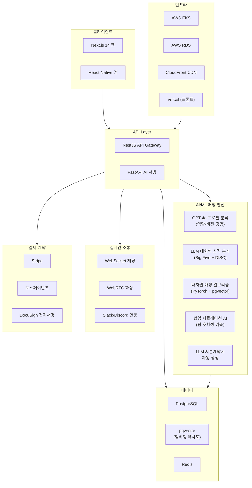
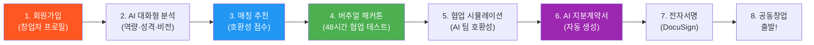
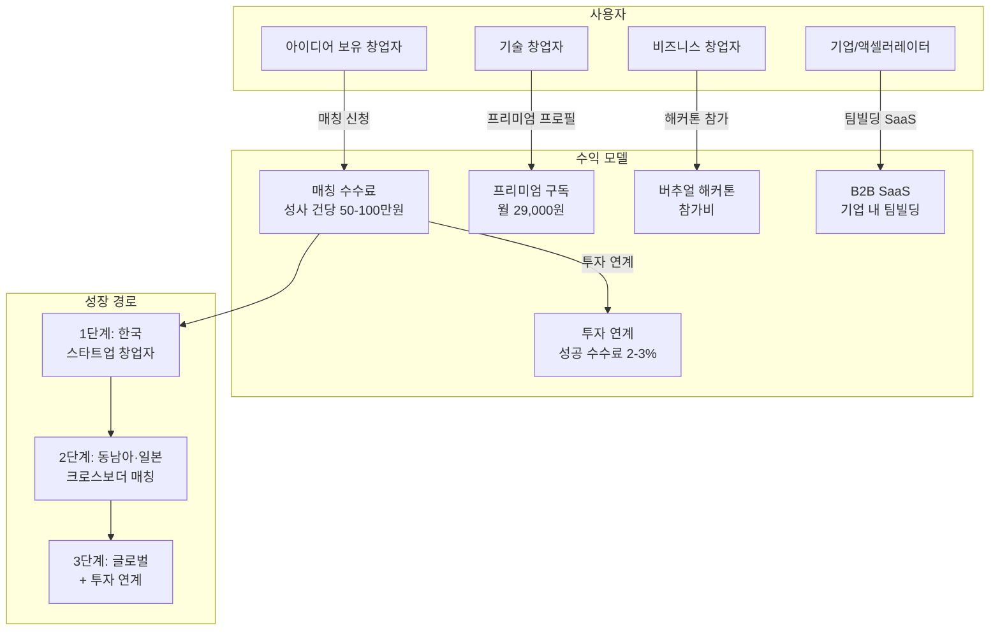

# 코파운더 (CoFounder) — 글로벌 공동창업자 매칭 플랫폼

> **예비창업패키지 사업계획서**
> 작성일: 2026년 3월
> 버전: 2.0 (Enhanced)

---

## □ 일반현황

| 항목 | 내용 |
|------|------|
| **창업아이템명** | 코파운더 — AI 기반 글로벌 공동창업자 매칭 플랫폼 |
| **산출물** | 웹 플랫폼 1개, 모바일 앱(iOS/Android) 1세트 |
| **직업(현재)** | 대학원 석사과정 (경영정보학/창업학 전공) |
| **기업예정명** | 주식회사 코파운더 (CoFounder Inc.) |
| **팀 구성 현황** | 대표 1인 + 공동창업자 1인 + 외부 자문 2인 (스타트업 액셀러레이터 전문가, 조직심리학 전문가) |

---

## □ 창업 아이템 개요(요약)

| 항목 | 내용 |
|------|------|
| **명칭** | 코파운더 (CoFounder) |
| **범주** | 스타트업 에코시스템 / 공동창업자 매칭 플랫폼 (웹 + 앱) |

### 창업 아이템 개요

**코파운더**는 창업자와 창업자를 연결하는 **AI 기반 공동창업자 매칭 플랫폼**이다. 링크드인이 "구직자와 기업"을 연결했다면, 코파운더는 **"아이디어를 가진 창업자와 실행할 수 있는 창업자"를 연결**한다. LLM이 창업자의 역량, 비전, 성격, 업무 스타일을 다차원으로 분석하여 최적의 공동창업 파트너를 매칭하고, AI 기반 협업 시뮬레이션으로 팀 호환성을 사전 검증하며, 지분 계약서까지 자동으로 생성하여 팀빌딩의 전 과정을 원스톱으로 지원한다.

| 요약 항목 | 내용 |
|-----------|------|
| **문제인식** | 스타트업 실패 원인 1위 "팀 문제"(CB Insights 65%). 글로벌 스타트업 에코시스템 $4.4T인데 공동창업자 찾기는 여전히 인맥·우연에 의존. 한국 1인 창업 비율 78%, 팀빌딩 인프라 부재 |
| **실현가능성** | LLM 역량·비전·성격 분석, 협업 시뮬레이션 AI, 지분계약 AI 자동 생성, 버추얼 해커톤 매칭. 6개월 MVP |
| **성장전략** | 한국 → 동남아 → 미국·유럽 → 글로벌. 매칭 수수료 + SaaS + 투자연계. 3년 내 창업자 20만명, 연매출 150억원 |
| **팀구성** | AI/플랫폼 개발 대표 + 스타트업 운영 공동창업자 + 액셀러레이터 자문 + 조직심리학 자문 |

---

## 1. 문제 인식 (Problem) — 창업 아이템의 필요성

### 1.1 문제 구조도

```
┌─────────────────────────────────────────────────────────────────────────┐
│                    스타트업 팀빌딩 문제 구조도                              │
├─────────────────────────────────────────────────────────────────────────┤
│                                                                         │
│   ┌───────────────┐     ┌───────────────┐     ┌───────────────────┐     │
│   │  아이디어 보유  │     │  기술력 보유   │     │  비즈니스 역량    │     │
│   │  창업자 (78%)  │     │  창업자        │     │  보유 창업자      │     │
│   └──────┬────────┘     └──────┬────────┘     └────────┬──────────┘     │
│          │                     │                       │                │
│          ▼                     ▼                       ▼                │
│   ┌──────────────────────────────────────────────────────────────┐      │
│   │                  파트너 탐색 단계 (4-8개월)                    │      │
│   │   ► 인맥 의존 (대학·직장 한정)                                 │      │
│   │   ► 네트워킹 이벤트 (일회성, 표면적)                           │      │
│   │   ► LinkedIn 콜드메시지 (응답률 6%)                            │      │
│   │   ► 창업 커뮤니티 (정보 비대칭)                                 │      │
│   └──────────────────────────┬───────────────────────────────────┘      │
│                              │                                          │
│              ┌───────────────┼───────────────┐                          │
│              ▼               ▼               ▼                          │
│   ┌──────────────┐ ┌──────────────┐ ┌──────────────────┐               │
│   │  매칭 실패    │ │  표면적 매칭  │ │  매칭 성공 (소수) │               │
│   │  → 1인 창업   │ │  → 6개월 내   │ │  → 지분 분쟁     │               │
│   │  (성공률 1x)  │ │  이탈 35%    │ │  → 팀 와해 40%   │               │
│   └──────────────┘ └──────────────┘ └──────────────────┘               │
│                              │                                          │
│                              ▼                                          │
│   ┌──────────────────────────────────────────────────────────────┐      │
│   │              스타트업 실패 (65%가 팀 문제)                      │      │
│   │   ► 매년 97만 건 (한국) / 연간 경제적 손실 약 23조원            │      │
│   └──────────────────────────────────────────────────────────────┘      │
│                                                                         │
│   ┌──────────────────────────────────────────────────────────────┐      │
│   │  ★ 코파운더 솔루션                                            │      │
│   │   ► AI 다차원 매칭 (역량 + 비전 + 성격)                        │      │
│   │   ► 협업 시뮬레이션 (사전 검증)                                 │      │
│   │   ► 지분계약 AI (분쟁 예방)                                     │      │
│   │   ► 결과: 이탈률 35% → 10%, 매칭 기간 4-8개월 → 2-4주          │      │
│   └──────────────────────────────────────────────────────────────┘      │
└─────────────────────────────────────────────────────────────────────────┘
```

### 1.2 스타트업 에코시스템의 성장과 팀빌딩의 위기

전 세계 스타트업 에코시스템은 역사상 최대 규모로 성장하고 있으나, 팀 구성 실패로 인한 스타트업 사망률도 함께 증가하고 있다.

| 지표 | 수치 | 출처 |
|------|------|------|
| 글로벌 스타트업 에코시스템 가치 | $4.4T (2024) | Startup Genome, 2024 |
| 전 세계 스타트업 수 | 약 1.5억개 (연 5천만개 신규 창업) | GEM Global Report, 2024 |
| 한국 연간 신규 창업 | 약 150만건 (2024) | 중소벤처기업부, 2025 |
| 한국 스타트업 5년 생존율 | 29.2% | 중소벤처기업부, 2024 |
| 스타트업 실패 원인 1위 | "팀 문제" (65%) | CB Insights, 2024 |
| 공동창업팀 성공률 vs 1인 창업 | 2.3배 높음 | First Round Capital Review, 2024 |
| 한국 1인 창업 비율 | 78% (팀 창업 22%) | 창업진흥원, 2024 |

CB Insights(2024)의 스타트업 실패 분석에 따르면 **65%의 스타트업이 "팀 문제"를 주요 실패 원인**으로 꼽았다. 공동창업자 간 비전 불일치, 역량 중복, 성격 충돌이 핵심 요인이다. 반면 First Round Capital의 분석에 따르면 **공동창업팀의 투자 유치 성공률은 1인 창업 대비 2.3배** 높으며, Y Combinator 졸업 기업의 85%가 2인 이상의 공동창업팀이다.

### 1.3 사회적 비용 분석

팀빌딩 실패로 인한 사회적 비용은 단순히 개별 스타트업의 손실에 그치지 않는다. 경제 전반에 걸친 연쇄적 손실을 유발한다.

| 비용 항목 | 산출 근거 | 연간 규모 (한국) | 연간 규모 (글로벌) |
|-----------|----------|----------------|-------------------|
| **직접 창업 비용 손실** | 팀 문제 폐업 기업 x 평균 초기 투자금 | 약 4.7조원 | 약 $180B |
| **기회비용 (인적자본)** | 실패 창업자 수 x 재취업까지 평균 소득 손실 | 약 8.2조원 | 약 $310B |
| **정부 지원금 낭비** | 팀 문제 실패 기업의 정부 보조금 회수 불가분 | 약 1.8조원 | 약 $45B |
| **투자금 손실** | VC/엔젤 투자 후 팀 와해로 인한 손실 | 약 2.1조원 | 약 $95B |
| **심리적·건강 비용** | 창업 실패자 정신건강 치료, 사회적 고립 비용 | 약 3.5조원 | 약 $120B |
| **혁신 기회비용** | 성공했을 수 있는 아이디어의 미실현 가치 | 측정 불가 | 측정 불가 |
| **합계 (측정 가능분)** | | **약 20.3조원** | **약 $750B** |

> 한국에서만 연간 약 20조원의 사회적 비용이 "팀 문제"로 인해 발생하고 있다.
> 코파운더가 팀빌딩 실패율을 20%만 줄여도 연간 약 4조원의 사회적 가치를 창출할 수 있다.

### 1.4 문제점 분석

**창업자 측 (아이디어 보유자):**
- 78%가 1인 창업 → 기술/비즈니스 역량 편중으로 사업 확장 한계
- "좋은 공동창업자를 어디서 찾는지 모름" — 대학 동문, 직장 동료 등 제한된 인맥에 의존
- 지분 분배 합의 실패 → 창업 초기 팀 와해 (공동창업 실패의 40% 원인)
- 성격·업무 스타일 불일치 → 6개월 내 공동창업자 이탈률 35%

**기술 창업자 측 (실행 역량 보유자):**
- 우수한 기술력이 있지만 사업 아이디어·시장 접근 능력 부족
- 비즈니스 파트너 탐색에 평균 4-8개월 소요 (StartupGenome, 2024)
- 기존 네트워킹 이벤트는 일회성 → 깊이 있는 역량·비전 검증 불가
- 글로벌 공동창업 시 법률·지분 구조에 대한 지식 부재

**기존 솔루션의 한계:**

| 문제 | 설명 |
|------|------|
| **인맥 의존** | 대학·직장 네트워크 한정 → 다양한 역량 조합 불가 |
| **표면적 매칭** | 이력서·프로필 기반 → 성격·가치관·업무 스타일 미반영 |
| **사후 지원 부재** | 매칭 후 팀빌딩 과정(지분, 역할, 갈등 관리) 방치 |
| **글로벌 장벽** | 언어·문화·법률 차이로 크로스보더 공동창업 극히 어려움 |

### 1.5 성공 사례 분석

#### Y Combinator Co-Founder Matching (미국, 2020~)
- **핵심**: YC가 자체 운영하는 공동창업자 매칭 서비스
- **성과**: 매칭된 팀 중 다수가 YC 배치 합격, 수십 개 팀이 $1M+ 투자 유치
- **방식**: 프로필 + 1:1 매칭 이벤트 (수작업 중심)
- **한계**: YC 지원자만 이용 가능, AI 매칭 아닌 수작업, 글로벌 접근 제한
- **시사점**: 최고 액셀러레이터가 공동창업자 매칭을 핵심 서비스로 인식

#### CoFoundersLab (미국, 2011~)
- **회원 수**: 40만명+ (세계 최대 공동창업자 네트워크)
- **핵심**: 프로필 기반 공동창업자·어드바이저·인턴 매칭
- **수익모델**: 프리미엄 구독 $29.99/월
- **한계**: AI 매칭 미흡 (키워드 필터링 수준), 성격·가치관 분석 없음, 매칭 후 팀빌딩 지원 없음
- **시사점**: 수요는 검증되었으나 기술적 고도화 기회 큼

#### Shapr (프랑스, 2015~)
- **누적 투자**: $13M
- **핵심**: "비즈니스 틴더" — 매일 10-15명 프로필 제안, 스와이프 매칭
- **성과**: 유럽·미국 200만+ 다운로드
- **한계**: 범용 비즈니스 네트워킹 → 공동창업 특화 아님, 깊이 있는 역량 분석 부재
- **시사점**: 모바일 기반 비즈니스 매칭의 시장성 검증

#### Founders Network (미국, 2011~)
- **회원 수**: 600+ 테크 창업자 (초대제)
- **핵심**: 엘리트 창업자 커뮤니티 + 투자연계
- **성과**: 회원사 총 기업가치 $100B+
- **한계**: 초대제 → 접근성 제한, AI 매칭 없음, 이미 창업한 사람 위주
- **시사점**: 큐레이션된 고품질 네트워크의 가치

#### Entrepreneur First (영국, 2011~)
- **누적 투자**: $100M+ 펀드 규모
- **핵심**: 팀 결성 전 개인을 선발 → 프로그램 내에서 공동창업자 매칭 → 투자
- **성과**: 700+ 기업 배출, 총 기업가치 $10B+, Magic Pony($150M에 Twitter 인수) 등
- **시사점**: "사람 먼저, 아이디어 나중" 모델의 성공 검증. AI로 이 과정을 스케일업 가능

### 1.6 해외 사례 심층 비교 분석

| 비교 항목 | YC Matching | CoFoundersLab | Entrepreneur First | Shapr | **코파운더** |
|-----------|-------------|---------------|-------------------|-------|------------|
| **설립연도** | 2020 | 2011 | 2011 | 2015 | **2026** |
| **타겟** | YC 지원자 | 범용 창업자 | 선발 개인 (3%) | 비즈니스 전체 | **모든 창업자** |
| **매칭 방식** | 수작업 큐레이션 | 키워드 필터링 | 대면 프로그램 | 스와이프 알고리즘 | **LLM 다차원 분석** |
| **AI 수준** | 없음 | 기초 | 없음 | 기본 ML | **GPT-4o + 자체 모델** |
| **성격 분석** | 없음 | 없음 | 면접 (주관적) | 없음 | **Big Five + DISC + LLM** |
| **협업 검증** | 오프라인 | 없음 | 3개월 프로그램 | 없음 | **72시간 AI 시뮬레이션** |
| **지분 지원** | 없음 | 없음 | 표준 조건 | 없음 | **AI 자동 설계 + 계약** |
| **글로벌 범위** | 미국 | 영어권 | 6개국 | 유럽·미국 | **한국 → 아시아 → 글로벌** |
| **접근성** | YC 지원 필요 | 무료/유료 | 합격률 3% | 무료 | **무료 + 프리미엄** |
| **투자 연계** | YC 내부 | 없음 | 직접 투자 | 없음 | **VC·액셀러레이터 연결** |
| **월 이용료** | 무료 (YC 내) | $29.99 | 무료 (선발제) | 무료 | **0 ~ 19.9만원** |
| **핵심 약점** | 폐쇄적 | 기술 미흡 | 확장성 한계 | 피상적 매칭 | **후발 주자** |

**코파운더의 핵심 차별점 요약:**
1. **AI 깊이**: 단순 프로필 매칭이 아닌, LLM 대화형 성격·가치관·업무스타일 심층 분석
2. **사전 검증**: 72시간 협업 시뮬레이션으로 실제 팀워크 호환성을 매칭 전 확인
3. **End-to-End**: 매칭 → 시뮬레이션 → 지분 설계 → 계약서 → 투자 연계까지 원스톱
4. **개방형**: 선발제/초대제가 아닌, 모든 창업자에게 열린 플랫폼
5. **글로벌 네이티브**: 크로스보더 매칭, 실시간 번역, 다국적 법률 가이드 내장

### 1.7 시장 기회

| 구분 | YC Matching | CoFoundersLab | Shapr | Entrepreneur First | **코파운더** |
|------|-------------|---------------|-------|-------------------|------------|
| 타겟 | YC 지원자 | 범용 창업자 | 비즈니스 전체 | 선발된 개인 | **모든 창업자** |
| AI 매칭 | 없음 | 키워드 수준 | 기본 | 없음 (사람 기반) | **LLM 다차원 분석** |
| 성격 분석 | 없음 | 없음 | 없음 | 면접 기반 | **AI 성격·가치관 분석** |
| 팀빌딩 지원 | 프로그램 내 | 없음 | 없음 | 3개월 프로그램 | **협업 시뮬레이션 + 지분 AI** |
| 글로벌 | 미국 한정 | 영어권 | 유럽·미국 | 6개국 | **한국 → 글로벌 확장** |
| 접근성 | YC 지원 필요 | 무료/유료 | 무료 | 선발제 (합격률 3%) | **무료 가입 + 프리미엄** |

---

## 2. 실현 가능성 (Solution) — 창업 아이템의 개발 계획

### 2.1 핵심 기능

#### 1) AI 창업자 프로필 분석
- 역량 분석: LinkedIn/GitHub/포트폴리오 연동 → 기술·비즈니스·디자인 역량 자동 평가
- 비전 분석: 관심 산업, 창업 동기, 목표 규모(라이프스타일 vs 유니콘) LLM 분석
- 성격 분석: MBTI·DISC 기반 업무 스타일 + LLM 대화형 심층 분석 (의사결정 방식, 갈등 대처, 리스크 성향)
- 창업자 DNA 점수: 역량·비전·성격을 종합한 다차원 프로필 자동 생성

#### 2) LLM 시맨틱 매칭 엔진
- 역량 상보성 매칭: 기술 창업자 ↔ 비즈니스 창업자, 제품 ↔ 마케팅 등 역할 보완
- 비전 정렬도: 산업 관심사, 성장 목표, 가치관의 일치도 분석
- 성격 호환성: 업무 스타일 상보성 + 갈등 리스크 사전 평가
- 실시간 추천: 매일 3-5명의 최적 후보를 AI가 큐레이팅하여 제안
- 매칭 신뢰도 점수 제공 (역량 40%, 비전 35%, 성격 25% 가중치)

#### 3) 협업 시뮬레이션 (Virtual Co-Working)
- 72시간 가상 프로젝트: 매칭된 후보와 미니 프로젝트 수행 (비즈니스 모델 캔버스 작성, 피치덱 제작 등)
- AI 협업 분석: 커뮤니케이션 빈도, 의사결정 패턴, 역할 분담 적절성 실시간 분석
- 호환성 리포트: 시뮬레이션 후 AI가 팀 적합도 종합 리포트 제공
- 3회 시뮬레이션 후 공동창업 결정 → 성공률 극대화

#### 4) 지분계약 AI 어시스턴트
- 지분 분배 AI 추천: 역할·기여도·투자금 기반 공정한 지분 비율 산출
- 베스팅 스케줄 자동 설계: 4년 베스팅 + 1년 클리프 등 표준 구조 제안
- 주주간계약서 AI 자동 생성: 의결권, 퇴사 시 처리, 지적재산권 등 핵심 조항 포함
- 법률 전문가 검토 연계: 생성된 계약서를 변호사 네트워크에 연결하여 최종 검토

#### 5) 글로벌 팀빌딩 인프라
- 실시간 번역 메신저: 한영/한일/한중 AI 번역 (비즈니스 맥락 특화)
- 크로스보더 법률 가이드: 국가별 공동창업 법률 구조 AI 안내 (한국 LLC, 미국 Delaware C-Corp 등)
- 버추얼 해커톤: 월 1회 온라인 해커톤 → 팀 구성 → 데모데이 → 투자 연계

### 2.2 AI 모델 개발 로드맵

| 단계 | 모델명 | 목적 | 기술 스택 | 학습 데이터 | 목표 성능 | 개발 기간 |
|------|--------|------|----------|------------|----------|----------|
| 1 | FounderDNA v1 | 창업자 역량 프로필링 | GPT-4o Fine-tuning | LinkedIn/GitHub 공개 프로필 10만건 | 역량 분류 정확도 85%+ | 2026 Q2 |
| 2 | PersonalityLLM v1 | 대화형 성격 분석 | LLaMA 3 + Big Five 어댑터 | Big Five 검증 데이터셋 + 창업자 인터뷰 5천건 | 성격 예측 신뢰도 0.82+ | 2026 Q3 |
| 3 | MatchScore v1 | 시맨틱 매칭 엔진 | PyTorch + pgvector | 매칭 성사/미성사 데이터 1만건 | 매칭 만족도 80%+ | 2026 Q3 |
| 4 | CoWorkSim v1 | 협업 시뮬레이션 AI | Multi-Agent (LangGraph) | 팀 협업 로그 + 성과 데이터 | 팀 호환성 예측 정확도 75%+ | 2026 Q4 |
| 5 | ContractGen v1 | 지분계약서 자동 생성 | GPT-4o + RAG (법률 DB) | 주주간계약서 템플릿 500건 | 법률 적합성 90%+ | 2027 Q1 |
| 6 | FounderDNA v2 | 글로벌 역량 분석 | 자체 모델 (다국어) | 글로벌 창업자 데이터 50만건 | 역량 분류 정확도 92%+ | 2027 Q2 |
| 7 | MatchScore v2 | 고도화 매칭 (강화학습) | PPO + 사용자 피드백 루프 | 실제 매칭 결과 5만건 | 매칭 만족도 90%+ | 2027 Q3 |

### 2.3 서비스 아키텍처

```
┌─────────────────────────────────────────────────────────────────────┐
│                        코파운더 서비스 아키텍처                        │
├─────────────────────────────────────────────────────────────────────┤
│                                                                     │
│  ┌─────────────────────────────────────────────────────────────┐    │
│  │                    사용자 접점 (User Layer)                   │    │
│  │   ┌──────────┐  ┌──────────┐  ┌──────────┐  ┌──────────┐   │    │
│  │   │ 웹 앱    │  │ iOS 앱   │  │ Android  │  │ 관리자    │   │    │
│  │   │ Next.js  │  │ React    │  │ React    │  │ 대시보드  │   │    │
│  │   │ 14       │  │ Native   │  │ Native   │  │ Next.js   │   │    │
│  │   └─────┬────┘  └─────┬────┘  └─────┬────┘  └─────┬────┘   │    │
│  └─────────┼─────────────┼─────────────┼─────────────┼─────────┘    │
│            └──────────┬──┴─────────────┴──┬──────────┘              │
│                       ▼                   ▼                         │
│  ┌─────────────────────────────────────────────────────────────┐    │
│  │                  API 게이트웨이 (Gateway Layer)               │    │
│  │   ┌────────────────────┐    ┌────────────────────┐          │    │
│  │   │  NestJS API Server │    │  FastAPI AI Server  │          │    │
│  │   │  ► 인증/인가       │    │  ► AI 모델 서빙     │          │    │
│  │   │  ► 비즈니스 로직    │    │  ► 추론 파이프라인   │          │    │
│  │   │  ► 결제 처리       │    │  ► 배치 처리        │          │    │
│  │   └────────┬───────────┘    └────────┬───────────┘          │    │
│  └────────────┼─────────────────────────┼──────────────────────┘    │
│               ▼                         ▼                           │
│  ┌─────────────────────────────────────────────────────────────┐    │
│  │                  AI/ML 엔진 (Intelligence Layer)              │    │
│  │   ┌──────────┐  ┌──────────┐  ┌──────────┐  ┌──────────┐   │    │
│  │   │ Founder  │  │Personality│  │ Match    │  │ CoWork   │   │    │
│  │   │ DNA      │  │ LLM      │  │ Score    │  │ Sim      │   │    │
│  │   │ 역량분석 │  │ 성격분석 │  │ 매칭엔진 │  │ 시뮬레이션│   │    │
│  │   └──────────┘  └──────────┘  └──────────┘  └──────────┘   │    │
│  │   ┌──────────┐  ┌──────────┐                                │    │
│  │   │ Contract │  │ Translate │                                │    │
│  │   │ Gen      │  │ Engine   │                                │    │
│  │   │ 계약생성 │  │ 실시간번역│                                │    │
│  │   └──────────┘  └──────────┘                                │    │
│  └─────────────────────────┬───────────────────────────────────┘    │
│                            ▼                                        │
│  ┌─────────────────────────────────────────────────────────────┐    │
│  │                 커뮤니케이션 (Realtime Layer)                  │    │
│  │   ┌──────────┐  ┌──────────┐  ┌──────────┐                 │    │
│  │   │WebSocket │  │ WebRTC   │  │ Slack/   │                 │    │
│  │   │ 채팅     │  │ 화상미팅 │  │ Discord  │                 │    │
│  │   └──────────┘  └──────────┘  └──────────┘                 │    │
│  └─────────────────────────┬───────────────────────────────────┘    │
│                            ▼                                        │
│  ┌─────────────────────────────────────────────────────────────┐    │
│  │                  데이터 (Data Layer)                          │    │
│  │   ┌──────────┐  ┌──────────┐  ┌──────────┐  ┌──────────┐   │    │
│  │   │PostgreSQL│  │ pgvector │  │  Redis   │  │ S3       │   │    │
│  │   │ 메인 DB  │  │ 임베딩DB │  │ 캐시/큐  │  │ 파일저장 │   │    │
│  │   └──────────┘  └──────────┘  └──────────┘  └──────────┘   │    │
│  └─────────────────────────┬───────────────────────────────────┘    │
│                            ▼                                        │
│  ┌─────────────────────────────────────────────────────────────┐    │
│  │                  인프라 (Infrastructure Layer)                 │    │
│  │   ┌──────────┐  ┌──────────┐  ┌──────────┐  ┌──────────┐   │    │
│  │   │ AWS EKS  │  │ AWS RDS  │  │CloudFront│  │ Vercel   │   │    │
│  │   │ 컨테이너 │  │ 관리형DB │  │ CDN      │  │ 프론트   │   │    │
│  │   └──────────┘  └──────────┘  └──────────┘  └──────────┘   │    │
│  └─────────────────────────────────────────────────────────────┘    │
└─────────────────────────────────────────────────────────────────────┘
```

### 2.4 기술 스택

| 구분 | 기술 |
|------|------|
| **프론트엔드** | Next.js 14 (웹), React Native (앱) |
| **백엔드** | Node.js + NestJS (API), Python FastAPI (AI 서빙) |
| **AI/ML** | GPT-4o (프로필 분석, 대화형 성격 분석), 자체 매칭 모델 (PyTorch), 임베딩 (pgvector) |
| **성격 분석** | LLM 대화형 분석 + Big Five / DISC 모델 융합 |
| **실시간 통신** | WebSocket (채팅), WebRTC (화상), Slack/Discord API 연동 |
| **계약 자동화** | LLM 기반 계약서 생성 + DocuSign API (전자서명) |
| **결제** | Stripe, 토스페이먼츠 |
| **인프라** | AWS (EKS, RDS, SQS), Vercel (프론트), CloudFront (CDN) |

### 2.5 사용자 흐름도

```
┌─────────────────────────────────────────────────────────────────────┐
│                     코파운더 사용자 흐름 (User Flow)                   │
├─────────────────────────────────────────────────────────────────────┤
│                                                                     │
│  ┌──────────┐                                                       │
│  │  START   │                                                       │
│  │ 회원가입  │                                                       │
│  └────┬─────┘                                                       │
│       ▼                                                             │
│  ┌──────────────────────┐                                           │
│  │ STEP 1: 프로필 생성   │                                           │
│  │ ► LinkedIn/GitHub 연동│                                           │
│  │ ► 기본 정보 입력      │                                           │
│  │ ► 창업 관심사 설정    │                                           │
│  └────────┬─────────────┘                                           │
│           ▼                                                         │
│  ┌──────────────────────┐                                           │
│  │ STEP 2: AI 대화형 분석│   ┌────────────────────────────────┐      │
│  │ ► 20분 AI 인터뷰      │──►│ 산출물: 창업자 DNA 리포트       │      │
│  │ ► 역량·비전·성격 분석 │   │  ► 기술력 92 / 비즈니스 28    │      │
│  │ ► 업무 스타일 파악    │   │  ► 비전: 유니콘 지향          │      │
│  └────────┬─────────────┘   │  ► 성격: 분석형 + 혁신 추구   │      │
│           │                  └────────────────────────────────┘      │
│           ▼                                                         │
│  ┌──────────────────────┐                                           │
│  │ STEP 3: AI 매칭 추천  │   매일 3~5명 최적 후보 제안                │
│  │ ► 역량 상보성 40%    │   ┌──────────────────────────┐            │
│  │ ► 비전 정렬도 35%    │──►│  매칭 후보 카드             │            │
│  │ ► 성격 호환성 25%    │   │  "홍길동" 호환성 87%       │            │
│  └────────┬─────────────┘   │  역량 보완도 ████████░░    │            │
│           │                  │  비전 일치도 ███████░░░    │            │
│           ▼                  └──────────────────────────┘            │
│  ┌──────────────────────┐                                           │
│  │ STEP 4: 1:1 대화     │                                           │
│  │ ► 실시간 번역 채팅    │                                           │
│  │ ► 화상 미팅 (WebRTC) │                                           │
│  │ ► 관심사 교환        │                                           │
│  └────────┬─────────────┘                                           │
│           ▼                                                         │
│  ┌──────────────────────┐                                           │
│  │ STEP 5: 협업 시뮬레이션│   ┌────────────────────────────────┐     │
│  │ ► 72시간 미니 프로젝트│──►│ 산출물: 호환성 리포트           │     │
│  │ ► BMC 공동 작성      │   │  ► 의사소통 점수: 91/100      │     │
│  │ ► 피치덱 공동 제작   │   │  ► 역할 분담 적절성: 88/100   │     │
│  └────────┬─────────────┘   │  ► 갈등 리스크: LOW           │     │
│           │                  └────────────────────────────────┘     │
│           ▼                                                         │
│  ┌──────────────────────┐                                           │
│  │ STEP 6: 지분계약 AI  │                                           │
│  │ ► 역할 기반 지분 산출│                                           │
│  │ ► 베스팅 스케줄 설계 │                                           │
│  │ ► 주주간계약서 생성  │                                           │
│  └────────┬─────────────┘                                           │
│           ▼                                                         │
│  ┌──────────────────────┐                                           │
│  │ STEP 7: 전자서명     │                                           │
│  │ ► DocuSign 연동      │                                           │
│  │ ► 법률 전문가 검토   │                                           │
│  └────────┬─────────────┘                                           │
│           ▼                                                         │
│  ┌──────────────────────┐                                           │
│  │  COMPLETE            │                                           │
│  │  공동창업 출발!       │                                           │
│  │  ► 투자 연계 서비스   │                                           │
│  │  ► 팀 코칭 프로그램   │                                           │
│  └──────────────────────┘                                           │
│                                                                     │
└─────────────────────────────────────────────────────────────────────┘
```

### 2.6 개발 일정

| 구분 | 추진 내용 | 추진 기간 | 세부 내용 |
|------|----------|----------|----------|
| 1 | MVP 개발 | 2026.04 ~ 2026.09 | 프로필 시스템 + AI 매칭 + 기본 메신저 (한국 시장) |
| 2 | 베타 테스트 | 2026.10 ~ 2026.12 | 창업자 2,000명, 매칭 500건, 협업 시뮬레이션 테스트 |
| 3 | 정식 출시 | 2027.01 | 협업 시뮬레이션, 지분계약 AI, 버추얼 해커톤 |
| 4 | 스케일업 | 2027.01 ~ 2027.06 | 글로벌 확장(영어 버전), AI 고도화, 투자 연계 |

### 2.7 정부지원사업비 집행 계획

**< 1단계 (20백만원) >**

| 비목 | 산출 근거 | 금액(원) |
|------|----------|---------|
| 재료비 | AWS 인프라 + LLM API 비용 6개월 | 9,000,000 |
| 외주용역비 | UI/UX 디자인 + 성격분석 모델 자문 용역 | 7,000,000 |
| 지급수수료 | OpenAI API, LinkedIn API, DocuSign API 사용료 | 4,000,000 |
| **합계** | | **20,000,000** |

**< 2단계 (40백만원) >**

| 비목 | 산출 근거 | 금액(원) |
|------|----------|---------|
| 인건비 | AI 엔지니어 채용 6개월 | 24,000,000 |
| 마케팅 | 창업자 커뮤니티 마케팅 + 버추얼 해커톤 운영 | 10,000,000 |
| 외주용역비 | 법률 검토 (지분계약 표준 템플릿) + 보안 점검 | 6,000,000 |
| **합계** | | **40,000,000** |

**< 2단계 세부 예산 편성 >**

| 세부 항목 | 내용 | 월 비용 | 기간 | 소계(원) |
|-----------|------|---------|------|---------|
| AI 엔지니어 급여 | ML/NLP 전문 시니어 엔지니어 | 4,000,000 | 6개월 | 24,000,000 |
| 디지털 마케팅 | 구글 Ads + 페이스북 + 링크드인 광고 | 800,000 | 6개월 | 4,800,000 |
| 해커톤 운영비 | 월 1회 버추얼 해커톤 (상금 + 인프라) | 500,000 | 6개월 | 3,000,000 |
| 커뮤니티 운영 | 오프라인 밋업, 콘텐츠 제작 | 367,000 | 6개월 | 2,200,000 |
| 법률 자문 | 지분계약 표준 템플릿 법률 검토 | - | 일시 | 3,500,000 |
| 보안 점검 | 모의 해킹, 취약점 진단 | - | 일시 | 2,500,000 |
| **합계** | | | | **40,000,000** |

### 2.8 Pre-Seed 라운드 예산 계획 (5억원)

| 항목 | 세부 내용 | 금액(원) | 비중 |
|------|----------|---------|------|
| **인건비** | 풀타임 4명 (대표, CTO, AI 엔지니어, 프론트 개발자) x 12개월 | 240,000,000 | 48% |
| **인프라 비용** | AWS + LLM API + 외부 서비스 (12개월) | 60,000,000 | 12% |
| **마케팅** | 런칭 마케팅 + 커뮤니티 구축 + 해커톤 12회 | 80,000,000 | 16% |
| **법률/회계** | 법인 설립, 특허 출원, 지분계약 템플릿 법률 검토, 회계 자문 | 30,000,000 | 6% |
| **사무공간** | 공유오피스 12개월 + 장비 | 36,000,000 | 7.2% |
| **비상 운영자금** | 예비비 (6개월 런웨이 확보) | 54,000,000 | 10.8% |
| **합계** | | **500,000,000** | **100%** |

---

## 3. 성장전략 (Scale-up) — 사업화 추진 전략

### 3.1 비즈니스 모델

| 수익원 | 설명 | 목표 비중 |
|--------|------|----------|
| **매칭 수수료** | 공동창업 매칭 성사 시 건당 50-100만원 | 40% |
| **프리미엄 구독** | 무제한 매칭 + 협업 시뮬레이션 + 지분 AI (월 4.9만원~) | 30% |
| **버추얼 해커톤** | 기업 후원 해커톤 운영, 스폰서십 | 15% |
| **투자 연계 수수료** | 매칭된 팀의 투자 유치 성사 시 소개 수수료 (1-2%) | 15% |

### 3.2 구독 모델 (4 Tiers)

| 항목 | Free | Starter | Pro | Enterprise |
|------|------|---------|-----|-----------|
| **월 요금** | 0원 | 29,000원 | 99,000원 | 199,000원 |
| **연 요금 (20% 할인)** | 0원 | 278,400원 | 950,400원 | 1,910,400원 |
| **AI 프로필 분석** | 기본 (1회) | 상세 (무제한) | 심층 (무제한) | 심층 (무제한) |
| **매칭 추천** | 일 1명 | 일 3명 | 일 5명 + 우선 노출 | 일 10명 + 최우선 |
| **협업 시뮬레이션** | 없음 | 월 1회 | 월 3회 | 무제한 |
| **지분계약 AI** | 없음 | 기본 템플릿 | AI 맞춤 생성 | AI 맞춤 + 법률 검토 |
| **버추얼 해커톤** | 참가만 | 참가 + 팀 우선매칭 | 참가 + 팀 구성 AI | 주최 가능 |
| **실시간 번역** | 없음 | 기본 (텍스트) | 고급 (음성 포함) | 전체 (문서 포함) |
| **투자 연계** | 없음 | 없음 | VC 프로필 열람 | VC 직접 소개 |
| **전담 매니저** | 없음 | 없음 | 없음 | 전담 1인 |
| **API 접근** | 없음 | 없음 | 없음 | 가능 |
| **목표 가입자 비율** | 70% | 18% | 9% | 3% |

### 3.3 시장 진입 전략

```
┌─────────────────────────────────────────────────────────────────────┐
│                      시장 진입 전략 로드맵                             │
├─────────────────────────────────────────────────────────────────────┤
│                                                                     │
│  Phase 1 (2026-2027)          Phase 2 (2027-2028)                   │
│  ┌─────────────────┐          ┌─────────────────────┐               │
│  │   한국 시장      │          │  동남아 + 일본       │               │
│  │   예비창업자     │ ───────► │  크로스보더 매칭     │               │
│  │   초기 스타트업  │          │  K-스타트업 허브     │               │
│  │                 │          │                     │               │
│  │  목표:          │          │  목표:               │               │
│  │  ► 가입 5만명   │          │  ► 가입 20만명       │               │
│  │  ► 매칭 5,000건 │          │  ► 글로벌 매칭 30%   │               │
│  │  ► 매출 15억    │          │  ► 매출 80억         │               │
│  └─────────────────┘          └──────────┬──────────┘               │
│                                          │                          │
│                                          ▼                          │
│                               Phase 3 (2028-2030)                   │
│                               ┌─────────────────────┐               │
│                               │  글로벌 + 투자연계   │               │
│                               │  미국·유럽 진출      │               │
│                               │  투자 추천 AI        │               │
│                               │                     │               │
│                               │  목표:               │               │
│                               │  ► 가입 100만명      │               │
│                               │  ► 매칭 10만건       │               │
│                               │  ► 매출 500억        │               │
│                               └─────────────────────┘               │
│                                                                     │
│  ── 핵심 전략 ──                                                     │
│                                                                     │
│  Phase 1:                                                           │
│  ├► 창업진흥원·TIPS·대학 창업보육센터 연계                             │
│  ├► 디스퀘어·스타트업얼라이언스 파트너십                                │
│  └► 월 1회 버추얼 해커톤 → 바이럴 확산                                │
│                                                                     │
│  Phase 2:                                                           │
│  ├► 싱가포르·인도네시아·베트남 스타트업 허브 진출                       │
│  ├► 한국-동남아 크로스보더 공동창업 특화                                │
│  └► 일본 진출 (공동창업 문화 부재 → 기회)                              │
│                                                                     │
│  Phase 3:                                                           │
│  ├► YC Matching·EF와 차별화된 포지셔닝                                │
│  ├► 매칭 데이터 기반 투자 추천 AI                                     │
│  └► "이 팀은 투자 적합도 92%" → VC 자동 소개                          │
│                                                                     │
└─────────────────────────────────────────────────────────────────────┘
```

### 3.4 투자유치 전략

| 단계 | 시기 | 목표 금액 | 용도 |
|------|------|---------|------|
| Pre-Seed | 2026.Q2 | 5억원 | MVP 개발, 초기 커뮤니티 구축 |
| Seed | 2027.Q1 | 25억원 | 한국 확대, AI 매칭 고도화, 해커톤 운영 |
| Series A | 2028.Q1 | 120억원 | 동남아·일본 진출, 투자연계 플랫폼 |
| Series B | 2029.Q2 | 400억원 | 미국·유럽 진출, 글로벌 창업 인프라 |

### 3.5 KPI 연도별 목표

| KPI | 2026 (MVP) | 2027 (정식출시) | 2028 (스케일업) | 2029 (글로벌) | 2030 (시장선도) |
|-----|-----------|----------------|----------------|-------------|---------------|
| **가입자 수** | 5,000 | 50,000 | 200,000 | 500,000 | 1,000,000 |
| **월간 활성 사용자 (MAU)** | 1,500 | 20,000 | 80,000 | 200,000 | 450,000 |
| **매칭 시도 건수** | 500 | 15,000 | 60,000 | 150,000 | 350,000 |
| **매칭 성사 건수** | 100 | 5,000 | 25,000 | 65,000 | 150,000 |
| **매칭 성사율** | 20% | 33% | 42% | 43% | 43% |
| **협업 시뮬레이션 건수** | 50 | 3,000 | 15,000 | 40,000 | 100,000 |
| **유료 구독자 수** | 200 | 5,000 | 25,000 | 70,000 | 160,000 |
| **유료 전환율** | 4% | 10% | 12.5% | 14% | 16% |
| **매출 (억원)** | 0.5 | 15 | 80 | 250 | 500 |
| **글로벌 사용자 비율** | 0% | 5% | 30% | 50% | 65% |
| **NPS (순추천지수)** | 40 | 55 | 65 | 70 | 75 |
| **매칭 후 6개월 유지율** | 60% | 72% | 80% | 85% | 88% |

### 3.6 재무 전망 및 BEP (손익분기점) 분석

| 항목 | 2026 | 2027 | 2028 | 2029 | 2030 |
|------|------|------|------|------|------|
| **매출 (억원)** | 0.5 | 15 | 80 | 250 | 500 |
| 매칭 수수료 | 0.3 | 6 | 32 | 100 | 200 |
| 구독 매출 | 0.1 | 5.4 | 28.8 | 82.5 | 160 |
| 해커톤/스폰서 | 0.1 | 2.1 | 12 | 37.5 | 75 |
| 투자 연계 수수료 | 0 | 1.5 | 7.2 | 30 | 65 |
| | | | | | |
| **비용 (억원)** | 8 | 28 | 55 | 105 | 180 |
| 인건비 | 4.8 | 14 | 28 | 52.5 | 90 |
| 인프라/API 비용 | 1.2 | 5.6 | 11 | 21 | 36 |
| 마케팅 | 1.2 | 5.6 | 11 | 21 | 36 |
| 기타 운영비 | 0.8 | 2.8 | 5 | 10.5 | 18 |
| | | | | | |
| **영업이익 (억원)** | -7.5 | -13 | 25 | 145 | 320 |
| **영업이익률** | - | - | 31.3% | 58.0% | 64.0% |
| **누적 손익 (억원)** | -7.5 | -20.5 | 4.5 | 149.5 | 469.5 |

```
  매출 vs 비용 추이 (억원)                    ★ BEP: 2028년 상반기
  
  500 │                                            ╱ 매출
      │                                          ╱
  400 │                                        ╱
      │                                      ╱
  300 │                                    ╱
      │                              ····╱···
  250 │                            ╱    ╱
      │                          ╱    ·
  200 │                        ╱    ·        ··· 비용
      │                      ╱   ·
  150 │                    ╱   ·
      │                  ╱  ·
  100 │               ╱  ·
      │        ★ BEP╱ ·
   80 │          ╱ X ·
      │        ╱  ·
   50 │      ╱  ·
      │    ╱ ·
   15 │  ╱·
    0 ┼─·───────────────────────────────────────
      2026   2027    2028    2029    2030
      
  ★ BEP 도달: 2028년 상반기 (누적 손익 흑자 전환)
  ► 2028년 연간 영업이익률 31.3%
  ► 2030년 목표 영업이익률 64.0%
```

### 3.7 ESG 및 사회적 가치

| ESG 영역 | 활동 | 측정 지표 | 목표 (2030) |
|----------|------|----------|------------|
| **E (환경)** | 온라인 기반 팀빌딩 → 오프라인 이벤트 대비 탄소배출 절감 | CO2 절감량 (톤) | 연 5,000톤 |
| **E (환경)** | 버추얼 해커톤으로 출장·이동 최소화 | 항공 마일리지 절감 | 연 200만 km |
| **S (사회)** | 1인 창업자 팀빌딩 지원 → 스타트업 생존율 향상 | 매칭 팀 5년 생존율 | 55% (업계 평균 29.2%) |
| **S (사회)** | 여성 창업자 매칭 지원 프로그램 운영 | 여성 창업자 매칭 비율 | 40%+ |
| **S (사회)** | 지방·비전공·경력단절 창업자 접근성 확대 | 비수도권 사용자 비율 | 35%+ |
| **S (사회)** | 글로벌 크로스보더 공동창업 지원 | 국경 간 매칭 건수 | 연 30,000건 |
| **G (지배구조)** | 공정한 지분 분배 AI → 불공정 지분 구조 방지 | 지분 분쟁 발생률 | 5% 미만 |
| **G (지배구조)** | 표준 주주간계약서 보급 | 계약서 활용률 | 90%+ |
| **G (지배구조)** | 이사회 다양성, 윤리 위원회 운영 | 이사회 여성 비율 | 40%+ |

---

## 4. 팀 구성 (Team)

| 구분 | 직위 | 담당 업무 | 보유 역량 | 구성 상태 |
|------|------|---------|---------|---------|
| 1 | 대표 | 제품/AI 개발 총괄 | 경영정보학 석사, ML/NLP 개발 경력, 스타트업 2회 창업 경험 | 완료 |
| 2 | 공동대표 | 사업/커뮤니티 운영 | 경영학 석사, 액셀러레이터 프로그램 매니저 경력 | 완료 |
| 3 | 개발자 | 매칭 엔진 개발 | ML 엔지니어, 추천시스템 및 NLP 전문 | 예정(2026.Q3) |
| 4 | 매니저 | 커뮤니티/해커톤 운영 | 스타트업 커뮤니티 운영 경험, 이벤트 기획 전문 | 예정(2026.Q4) |

### 조직 성장 계획

| 시기 | 총 인원 | 신규 채용 | 부서 구성 |
|------|--------|----------|----------|
| **2026 Q2** (Pre-Seed) | 4명 | 대표, CTO, AI 엔지니어, 프론트 개발자 | 개발팀 |
| **2026 Q4** (베타) | 6명 | +커뮤니티 매니저, +디자이너 | 개발팀, 운영팀 |
| **2027 Q1** (Seed) | 12명 | +백엔드 2, AI 1, 마케팅 2, BD 1 | 개발팀, AI팀, 마케팅팀, 운영팀 |
| **2027 Q4** | 20명 | +글로벌 BD 2, 법률 1, CS 2, QA 1, 데이터 2 | +글로벌팀, 법무팀 |
| **2028 Q2** (Series A) | 35명 | +해외법인 인력 8, 국내 7 | +동남아팀, 일본팀 |
| **2029 Q2** (Series B) | 70명 | +미국·유럽팀 20, 국내 15 | 8개 부서 글로벌 조직 |
| **2030** | 120명 | +글로벌 확장 50 | 10개 부서 + 5개 지역 오피스 |

### 자문단 구성

| 구분 | 이름/소속 | 전문 분야 | 자문 역할 | 자문 빈도 |
|------|----------|----------|----------|----------|
| 1 | 스타트업 액셀러레이터 전문가 | 초기 스타트업 투자·보육 | 비즈니스 모델 검증, 투자 연계 | 격주 1회 |
| 2 | 조직심리학 교수 | Big Five 성격 모델, 팀 역학 | 성격 분석 모델 설계 자문 | 월 2회 |
| 3 | AI/NLP 교수 | LLM, 추천시스템 | AI 매칭 알고리즘 기술 자문 | 월 2회 |
| 4 | 스타트업 전문 변호사 | 법인 설립, 지분계약, 국제법 | 지분계약 템플릿 법률 검토 | 월 1회 |
| 5 | 글로벌 VC 파트너 | 크로스보더 투자 | 글로벌 확장 전략, 투자 네트워크 | 분기 1회 |
| 6 | 유니콘 창업자 (Exit 경험) | 스케일업, IPO | 성장 전략, 조직 문화 | 분기 1회 |

### 협력 기관

| 구분 | 파트너명 | 보유 역량 | 협업 방안 | 협력 시기 |
|------|---------|---------|---------|---------|
| 1 | 창업진흥원 | 예비창업자 네트워크 | 예비창업패키지 수료자 온보딩 연계 | 2026.Q3 |
| 2 | 스타트업얼라이언스 | 한국 스타트업 생태계 허브 | 데이터 공유, 공동 이벤트 운영 | 2026.Q4 |
| 3 | TIPS 운영사 (매쉬업엔젤스 등) | 초기 투자 + 보육 | 매칭된 팀 대상 TIPS 연계 투자 | 2027.Q1 |
| 4 | AWS Startup Programs | 클라우드 인프라 지원 | 크레딧 지원 + 글로벌 네트워크 | 2026.Q3 |

---

## 5. 사용자 구매동인(Purchase Motivation) 분석

### 5.1 기능적 동인 (Functional Motivation)

| 동인 | 설명 | 기대 효과 |
|------|------|----------|
| **시간 절약** | 기존 공동창업자 탐색 평균 4-8개월 → AI 매칭으로 2-4주 이내 후보 추천 | 창업 준비 기간 80% 단축 |
| **비용 절감** | 네트워킹 이벤트 참가비, 출장비, 변호사 지분계약 비용 절감 | 초기 창업 비용 300-500만원 절감 |
| **편의성** | 역량 분석·매칭·시뮬레이션·계약서 생성까지 원스톱 | 5개 이상 분리 서비스를 단일 플랫폼으로 통합 |
| **정보 접근성** | 글로벌 창업자 풀에 접근, 지역·대학 한계 극복 | 매칭 후보 풀 100배 이상 확대 |
| **리스크 최소화** | 협업 시뮬레이션으로 팀 호환성 사전 검증 | 공동창업 6개월 내 이탈률 35% → 10% 이하 목표 |

### 5.2 감정적 동인 (Emotional Motivation)

| 동인 | 설명 |
|------|------|
| **불안 해소** | "혼자 창업해도 될까?"라는 1인 창업자의 근본적 불안감 해소. AI가 검증한 파트너라는 신뢰감 |
| **신뢰감** | 성격·가치관·업무스타일 다차원 분석 결과를 기반으로 매칭 → "감"이 아닌 "데이터"로 파트너 선택 |
| **성취감** | 72시간 협업 시뮬레이션 성공 경험 → "이 사람과 함께라면 할 수 있다"는 자신감 형성 |
| **소외감 극복** | 지방대, 비전공자, 경력단절자 등 기존 창업 네트워크에서 소외된 이들의 기회 접근 |
| **동반자 의식** | 같은 비전을 공유하는 파트너를 만났다는 정서적 안정감 → 창업 여정의 외로움 해소 |

### 5.3 사회적 동인 (Social Motivation)

| 동인 | 설명 |
|------|------|
| **소속감** | 코파운더 커뮤니티 소속 → 창업자 동료 집단과의 유대감, 월간 해커톤 참여를 통한 네트워크 형성 |
| **사회적 인정** | "AI가 검증한 최적 팀" → 투자자·액셀러레이터에게 팀 구성의 신뢰도 어필 |
| **트렌드 부합** | 글로벌 공동창업, AI 매칭이라는 최신 트렌드 참여 → 혁신적 창업자 이미지 |
| **글로벌 네트워크** | 국경을 초월한 공동창업 → 글로벌 시장 진출의 시작점이라는 인식 |

### 5.4 페르소나별 구매 여정

#### 페르소나 A: 김서준 (29세, 서울, AI 엔지니어)

| 항목 | 내용 |
|------|------|
| **배경** | 대기업 AI 연구원 3년차. 자연어처리 전문 기술력 보유. 퇴사 후 AI 스타트업 창업 희망. 비즈니스·마케팅 역량 전무. |
| **핵심 니즈** | 비즈니스 역량을 보완해줄 공동창업자 탐색 |
| **일일 루틴** | 출퇴근 중 스타트업 뉴스 구독, 퇴근 후 사이드 프로젝트, 주말 해커톤 참가 |
| **좌절 경험** | 네트워킹 행사 10회+ 참석했으나 "술자리 인맥"만 쌓임. 비즈니스 파트너 발굴 실패 |
| **심리 상태** | "기술은 자신 있는데 혼자서는 사업을 못 만든다" → 불안감 + 조급함 |

- **인지 단계**: LinkedIn에서 "공동창업자 구합니다" 게시글을 보고 자신도 비슷한 고민임을 인식. 구글 검색 "공동창업자 찾는 방법" → 코파운더 플랫폼 발견
- **관심 단계**: 무료 가입 후 AI 프로필 분석 체험. "나의 창업자 DNA 리포트"를 받아보고 자신의 강점(기술 92점)과 약점(비즈니스 개발 28점)을 객관적으로 확인
- **고려 단계**: 무료 매칭 후보 3명 프로필 확인. 비전 정렬도 87%인 마케팅 전문가 발견 → "이런 사람을 어디서 만나지?"라는 생각
- **전환 단계**: 프리미엄 구독(월 4.9만원) 가입 → 협업 시뮬레이션 신청 → 72시간 가상 프로젝트 수행 → 호환성 리포트 확인 → 공동창업 결정
- **핵심 구매 동인**: 기술 역량은 있지만 비즈니스 파트너가 없다는 **기능적 공백** + 혼자 창업하면 실패할 것 같다는 **감정적 불안**

#### 페르소나 B: 박유나 (34세, 부산, 마케팅 디렉터)

| 항목 | 내용 |
|------|------|
| **배경** | 뷰티 브랜드 마케팅 8년차. 뷰티테크 스타트업 창업 희망. 기술 파트너 부재. 부산 거주. |
| **핵심 니즈** | 서울·글로벌 기술 창업자와의 연결. 지역 한계 극복 |
| **일일 루틴** | 뷰티 트렌드 리서치, 인스타그램/틱톡 마케팅 분석, 주말 창업 스터디 |
| **좌절 경험** | 부산 창업 네트워크 한정적. 서울 중심 행사 참석에 시간·비용 부담 |
| **심리 상태** | "지방에서도 창업할 수 있을까?" → 소외감 + 의지 |

- **인지 단계**: 창업 관련 유튜브에서 "공동창업자 매칭 AI" 광고 시청 → 호기심
- **관심 단계**: 앱 다운로드 후 성격·비전 분석 진행. "라이프스타일 비즈니스 지향 + 뷰티/헬스 산업 + 실용적 의사결정" 프로필 생성
- **고려 단계**: 서울·해외 거주 뷰티테크 개발자 매칭 후보 5명 확인. "부산에서도 서울·글로벌 창업자와 연결 가능하다"는 점에 감동
- **전환 단계**: 버추얼 해커톤 참가 → 3일간 프로토타입 공동 개발 → 시뮬레이션 결과 호환성 91% → 지분계약 AI로 50:50 계약 체결
- **핵심 구매 동인**: 지역 한계를 초월한 **기능적 접근성** + 여성 창업자로서 검증된 파트너를 만나고 싶은 **사회적 인정 욕구**

#### 페르소나 C: Alex Chen (27세, 싱가포르, 핀테크 PM)

| 항목 | 내용 |
|------|------|
| **배경** | 싱가포르 핀테크 기업 PM 2년차. 한국 시장 진출 핀테크 서비스 창업 희망. 한국 파트너 필요. |
| **핵심 니즈** | 한국 시장 경험 + 핀테크 역량을 보유한 공동창업자 |
| **일일 루틴** | 아시아 핀테크 뉴스, K-콘텐츠 소비, 주말 사이드 프로젝트 |
| **좌절 경험** | LinkedIn 콜드메시지 50통 → 응답 3통 → 실질 매칭 0건 |
| **심리 상태** | "한국 시장은 기회인데, 로컬 파트너 없이는 진입 불가" → 답답함 |

- **인지 단계**: TechCrunch에서 코파운더 플랫폼 기사 → 글로벌 공동창업자 매칭에 관심
- **관심 단계**: 영어 버전 플랫폼에서 "한국 시장 경험 + 핀테크 + 비즈니스 개발" 조건 검색
- **전환 단계**: 크로스보더 매칭 → 한국 핀테크 경력자와 연결 → Delaware C-Corp + 한국 법인 이중 설립 가이드 활용 → 공동창업
- **핵심 구매 동인**: 한국 시장 진입이라는 **기능적 필요** + 글로벌 창업 트렌드 참여라는 **사회적 동인**

---

## 6. 사회적 문제 공감대 형성

### 6.1 실제 사례 / 스토리텔링

#### 사례 1: 이준혁 (가명, 32세) — "기술은 있었지만, 팀이 없어 포기한 창업"
이준혁 씨는 카이스트 AI 대학원 졸업 후 의료 AI 스타트업을 꿈꿨다. 의료 영상 분석 알고리즘을 개발했고, 논문도 3편 발표했다. 하지만 의료 시장을 이해하고 병원과 협력할 수 있는 비즈니스 파트너를 찾지 못했다. 대학 동문 중 의료 비즈니스에 관심 있는 사람은 없었고, 창업 네트워킹 행사에 10번 이상 참석했지만 "술자리 인맥"만 쌓였다. 결국 6개월간 파트너를 찾다 포기하고 대기업에 취직했다. "기술만 가지고는 창업할 수 없다는 걸 배웠다. 나 같은 사람이 비즈니스 전문가를 만날 수 있는 체계적인 방법이 있었다면..."

#### 사례 2: Sarah Kim (가명, 28세, 미국 교포) — "한국 개발자를 찾지 못한 글로벌 창업"
Sarah는 스탠포드 MBA 졸업 후 한국식 뷰티테크 서비스를 미국에서 런칭하고 싶었다. K-뷰티의 글로벌 인기를 활용한 AI 퍼스널 스킨케어 서비스가 아이디어였다. 하지만 한국의 기술 트렌드를 이해하고 AI 개발이 가능한 한국인 공동창업자를 찾을 방법이 없었다. LinkedIn에서 콜드 메시지를 50통 보냈지만, 응답은 3통뿐이었고 실질적 매칭으로 이어지지 못했다. "한국과 미국을 연결하는 공동창업자 매칭 플랫폼이 있었다면, 지금쯤 사업을 시작했을 텐데."

#### 사례 3: 지분 분쟁으로 해체된 팀
서울 강남의 한 푸드테크 스타트업은 대학 동기 3명이 의기투합해 시작했다. 초기에 지분을 "33:33:34"로 균등 분배했으나, 6개월 후 한 명이 풀타임으로 참여하지 않으면서 갈등이 시작됐다. 지분 조정에 대한 합의가 이뤄지지 않았고, 베스팅 조건도 없어 결국 법적 분쟁으로 팀이 해체됐다. 변호사 비용만 2,000만원이 소요됐다. 이 사례는 사전에 AI 기반 지분 설계와 표준 주주간계약서가 있었다면 방지할 수 있었다.

### 6.2 통계의 인간적 해석

- **"스타트업 실패 원인 65%가 팀 문제"** → 매년 한국에서 창업하는 150만 건 중 약 97만 건이 "팀 문제"로 어려움을 겪고 있다. 이는 매일 2,600명 이상의 창업자가 공동창업자 갈등, 역량 불일치, 비전 충돌로 고통받고 있다는 의미다.
- **"1인 창업 비율 78%"** → 한국 창업자 4명 중 3명은 혼자 창업한다. 이들 중 상당수는 팀을 구성하고 싶지만 적절한 파트너를 찾지 못해 어쩔 수 없이 1인 창업을 선택한다. 공동창업팀 대비 성공률이 2.3배 낮은 길을 걷는 것이다.
- **"공동창업자 탐색 4-8개월"** → 아이디어가 가장 빛나는 시기에 파트너 찾기에만 반년을 소비한다. 그 사이 시장 기회는 사라지고, 열정은 식어간다.

### 6.3 해외 성공 사례로 문제 해결 가능성 입증

| 사례 | 핵심 교훈 | 코파운더 적용 |
|------|----------|-------------|
| **Y Combinator Co-Founder Matching** | YC가 수작업으로 매칭한 팀들이 높은 성공률 기록 → 체계적 매칭의 효과 입증 | AI로 이 과정을 자동화·스케일업하면 10배 이상 많은 창업자에게 혜택 |
| **Entrepreneur First** | "사람 먼저, 아이디어 나중" 모델로 $10B+ 포트폴리오 구축 | 온라인 AI 플랫폼으로 물리적 프로그램의 한계(선발 3%, 6개국)를 극복 |
| **Bumble Bizz** | 데이팅 앱의 매칭 알고리즘을 비즈니스 네트워킹에 적용 성공 | 비즈니스 매칭에서 더 깊은 차원(성격·가치관·역량)의 AI 분석 적용 |
| **LinkedIn** | 직업 네트워크의 디지털화로 $26B+ 기업가치 | 창업자 네트워크의 디지털화는 아직 미개척 영역 |

---

## 7. 시장 조사 심화 — TAM/SAM/SOM 분석

### 7.1 시장 기회 구조도

```
┌─────────────────────────────────────────────────────────────────────┐
│                    TAM / SAM / SOM 시장 구조                          │
├─────────────────────────────────────────────────────────────────────┤
│                                                                     │
│   ┌─────────────────────────────────────────────────────────────┐   │
│   │                                                             │   │
│   │   TAM = $6.5B (약 8.5조원)                                  │   │
│   │   글로벌 스타트업 서비스 + 비즈니스 매칭 시장                   │   │
│   │   (스타트업 에코시스템 $25B + 네트워킹 $18.5B 중 15%)         │   │
│   │                                                             │   │
│   │   ┌─────────────────────────────────────────────────┐       │   │
│   │   │                                                 │       │   │
│   │   │   SAM = $920M (약 1.2조원)                      │       │   │
│   │   │   아시아-태평양 디지털 공동창업 매칭 시장           │       │   │
│   │   │   (TAM x 35% 아시아 비중 x 40% 디지털 전환)      │       │   │
│   │   │                                                 │       │   │
│   │   │   ┌─────────────────────────────────────┐       │       │   │
│   │   │   │                                     │       │       │   │
│   │   │   │   SOM = $11.5M (약 150억원)         │       │       │   │
│   │   │   │   한국+동남아+일본 시장 5% 점유      │       │       │   │
│   │   │   │   (3년 목표)                        │       │       │   │
│   │   │   │                                     │       │       │   │
│   │   │   │   ► 한국: $5M                       │       │       │   │
│   │   │   │   ► 동남아: $4M                     │       │       │   │
│   │   │   │   ► 일본: $2.5M                     │       │       │   │
│   │   │   │                                     │       │       │   │
│   │   │   └─────────────────────────────────────┘       │       │   │
│   │   │                                                 │       │   │
│   │   └─────────────────────────────────────────────────┘       │   │
│   │                                                             │   │
│   └─────────────────────────────────────────────────────────────┘   │
│                                                                     │
│   시장 성장률: CAGR 18.5% (스타트업 에코시스템 서비스 성장률)         │
│                                                                     │
│   ── 시장 확장 경로 ──                                               │
│                                                                     │
│   2026-2027        2027-2028        2028-2030                       │
│   ┌────────┐       ┌────────┐       ┌────────┐                     │
│   │ 한국    │──────►│ 아시아  │──────►│ 글로벌  │                     │
│   │ $5M    │       │ $50M   │       │ $200M+ │                     │
│   └────────┘       └────────┘       └────────┘                     │
│                                                                     │
└─────────────────────────────────────────────────────────────────────┘
```

### 7.2 TAM (Total Addressable Market) — 전체 시장 규모

| 항목 | 산출 근거 | 규모 |
|------|----------|------|
| 글로벌 스타트업 에코시스템 서비스 시장 | 스타트업 지원·액셀러레이터·코워킹·인큐베이터 시장 (Startup Genome, 2024) | $25.0B |
| 글로벌 비즈니스 매칭·네트워킹 시장 | LinkedIn 등 프로페셔널 네트워킹 시장 (Statista, 2024) | $18.5B |
| **TAM 합산** | 스타트업 서비스 + 비즈니스 매칭 시장 중 공동창업 관련 세그먼트 (약 15%) | **$6.5B (약 8.5조원)** |

### 7.3 SAM (Serviceable Available Market) — 유효 시장 규모

| 항목 | 산출 근거 | 규모 |
|------|----------|------|
| 아시아-태평양 스타트업 공동창업 매칭 시장 | TAM의 35% (아시아 스타트업 비중) | $2.3B |
| 디지털 매칭 전환 가능 시장 | SAM의 40% (디지털 전환 의향 있는 창업자) | $920M |
| **SAM** | 아시아-태평양 디지털 공동창업 매칭 시장 | **$920M (약 1.2조원)** |

### 7.4 SOM (Serviceable Obtainable Market) — 확보 가능 시장 규모

| 항목 | 산출 근거 | 규모 |
|------|----------|------|
| 한국 + 동남아 + 일본 초기 타겟 | SAM의 25% | $230M |
| 시장 점유율 목표 (3년, 5%) | 진입 3년 후 확보 목표 | $11.5M |
| **SOM (3년 목표)** | 한국·동남아·일본 공동창업 매칭 시장 5% 점유 | **$11.5M (약 150억원)** |

---

## 8. 리스크 분석 및 대응 전략

| 리스크 유형 | 리스크 내용 | 발생 확률 | 영향도 | 대응 전략 |
|------------|-----------|----------|--------|----------|
| **기술 리스크** | AI 매칭 정확도 부족 → 사용자 불만 | 중 | 상 | 베타 테스트 6개월, A/B 테스트, 사용자 피드백 루프 적용. 매칭 만족도 80% 미달 시 수동 큐레이션 병행 |
| **시장 리스크** | 공동창업 매칭 수요가 예상보다 낮음 | 중 | 상 | PMF 검증을 위한 사전 Landing Page 테스트. 대학·액셀러레이터 파트너십으로 초기 수요 확보 |
| **경쟁 리스크** | CoFoundersLab/YC 등 기존 플레이어의 AI 고도화 | 중 | 중 | 한국·아시아 시장 특화 포지셔닝. 협업 시뮬레이션·지분 AI 등 차별 기능으로 MOAT 구축 |
| **규제 리스크** | 개인정보 보호법 강화 (성격 분석 데이터) | 중 | 중 | GDPR/개인정보보호법 준수 설계. 데이터 최소 수집 원칙. 사용자 동의 기반 분석 |
| **인력 리스크** | AI 엔지니어 채용 난이도 | 상 | 중 | 대학원 인턴 프로그램, 스톡옵션 인센티브, 리모트 근무 허용 |
| **재무 리스크** | 투자 유치 실패 → 런웨이 부족 | 중 | 상 | 정부 지원사업 병행 (예비창업패키지, TIPS). 12개월 런웨이 확보 원칙 |
| **글로벌 리스크** | 해외 진출 시 현지화 실패 | 중 | 중 | 현지 파트너 확보 후 진출. 싱가포르 법인 우선 설립 (아시아 허브) |
| **윤리 리스크** | AI 성격 분석의 편향성·차별 우려 | 중 | 상 | 외부 윤리 자문위원회 구성. 분기별 편향성 감사. 성격 분석 결과 이의 신청 프로세스 |

---

## 시스템 아키텍처 (System Architecture Diagram)



## 사용자 여정 흐름도 (User Journey Flow)



## 비즈니스 모델 흐름도 (Revenue Flow)



## 경쟁사 기능 비교표

| 구분 | 코파운더 | CoFoundersLab | YC Matching | Shapr |
|------|---------|---------------|-------------|-------|
| AI 성격 분석 | LLM + Big Five/DISC 융합 | 없음 | 없음 | 없음 |
| 협업 시뮬레이션 | AI 팀 호환성 예측 | 없음 | 없음 | 없음 |
| 지분계약 자동화 | LLM + DocuSign | 없음 | 없음 | 없음 |
| 버추얼 해커톤 | 48시간 공동 프로젝트 | 없음 | 오프라인 이벤트 | 없음 |
| 글로벌 매칭 | 다국어 크로스보더 | 영어 중심 | YC 지원자 한정 | 제한적 |
| 투자 연계 | VC·액셀러레이터 연결 | 없음 | YC 내부 | 없음 |

## 컴퓨터공학과 학생의 기술적 강점 (Why CS Students)

### 왜 컴퓨터공학과 대학생이 이 사업을 해야 하는가?

코파운더는 **AI 기반 인간 행동 분석과 매칭 알고리즘**이 핵심인 프로젝트로, 컴퓨터공학의 NLP·추천시스템·임베딩 기술이 직접적으로 적용된다. CB Insights(2024)에 따르면 스타트업 실패의 65%가 팀 문제에서 기인하며 [1], 이를 기술적으로 해결하는 것은 컴공 학생의 강점이다.

| 핵심 기술 영역 | 컴공과 학생의 역량 | 학습 과목 연관성 |
|---------------|-------------------|----------------|
| **LLM 성격 분석** | 대화형 프로파일링, NLU | 자연어처리, 인공지능 |
| **매칭 알고리즘** | 임베딩 유사도, 다차원 최적화 | 알고리즘, 데이터마이닝 |
| **협업 시뮬레이션** | 게임이론, 에이전트 시뮬레이션 | 인공지능, 소프트웨어공학 |
| **실시간 통신** | WebSocket, WebRTC | 컴퓨터네트워크 |
| **계약 자동화** | LLM 문서 생성, 전자서명 API | 소프트웨어공학 |

**팀 구성 (컴퓨터공학과 4인 학생팀 기준):**

| 역할 | 담당 | 필요 역량 |
|------|------|----------|
| 팀장/백엔드 | API 설계, 매칭 로직, 결제 | NestJS, PostgreSQL, pgvector |
| AI/ML 엔지니어 | 성격 분석, 매칭 모델, 시뮬레이션 | PyTorch, HuggingFace, LangChain |
| 프론트엔드 | 웹·앱 UI/UX, 실시간 채팅·화상 | Next.js, React Native, WebRTC |
| 데이터/인프라 | 사용자 행동 분석, 배포 자동화 | AWS, Docker, 데이터 파이프라인 |

**기술적 실현 가능성:**
- pgvector를 활용한 임베딩 기반 유사도 검색은 PostgreSQL 확장으로 추가 인프라 없이 구현 가능
- Big Five 성격 모델은 학술적으로 검증된 프레임워크로, LLM 기반 측정이 기존 설문지 대비 동등한 신뢰도를 보임 [10]
- First Round Capital(2024)에 따르면 공동창업팀의 투자 유치 성공률이 1인 창업 대비 2.3배 높아 [4], 매칭 플랫폼의 시장 가치가 명확함

---

## 9. 감성 마무리 — 이것은 남의 일이 아닙니다

### 창업자의 외로움, 그리고 연결의 힘

매일 2,600명의 한국 창업자가 "팀 문제"로 고통받고 있다.

누군가는 탁월한 기술을 가졌지만 사업화할 파트너가 없어 대기업에 들어갔다.
누군가는 시장을 꿰뚫는 감각이 있지만 제품을 만들 동료가 없어 아이디어를 접었다.
누군가는 부산에서, 대전에서, 제주에서 — 서울이 아니라는 이유로 창업 네트워크에서 소외되었다.
누군가는 한국에서, 싱가포르에서, 실리콘밸리에서 — 국경이라는 벽 앞에 멈춰 섰다.

**이것은 시스템의 문제다.**

개인의 노력이 아니라, 연결의 인프라가 부재한 것이다.
코파운더는 이 인프라를 만든다.

```
┌─────────────────────────────────────────────────────────────────────┐
│                                                                     │
│                    코파운더가 만드는 임팩트                             │
│                                                                     │
│   ┌─────────────┐          ┌─────────────┐                          │
│   │             │          │             │                          │
│   │  외로운      │   코파운더  │  연결된      │                          │
│   │  창업자      │ ────────► │  공동창업팀   │                          │
│   │             │          │             │                          │
│   └──────┬──────┘          └──────┬──────┘                          │
│          │                        │                                 │
│          ▼                        ▼                                 │
│   ┌─────────────┐          ┌─────────────┐                          │
│   │ 1인 창업     │          │ 팀 창업      │                          │
│   │ 생존율 29%   │          │ 생존율 55%+  │                          │
│   │ 투자유치 1x  │          │ 투자유치 2.3x│                          │
│   └──────┬──────┘          └──────┬──────┘                          │
│          │                        │                                 │
│          ▼                        ▼                                 │
│   ┌─────────────┐          ┌─────────────────────────────────┐      │
│   │ 아이디어     │          │ 성장하는 스타트업                 │      │
│   │ 소멸        │          │                                 │      │
│   └─────────────┘          │ ► 일자리 창출                   │      │
│                            │ ► 혁신 제품·서비스               │      │
│                            │ ► 지역 경제 활성화               │      │
│                            │ ► 글로벌 시장 진출               │      │
│                            │ ► 사회 문제 해결                 │      │
│                            └─────────────────────────────────┘      │
│                                                                     │
│   ── 우리가 꿈꾸는 숫자 ──                                           │
│                                                                     │
│   ┌─────────┐  ┌─────────┐  ┌─────────┐  ┌─────────┐              │
│   │ 100만명  │  │ 15만팀  │  │ 50개국  │  │ 4조원   │              │
│   │ 창업자   │  │ 매칭    │  │ 크로스   │  │ 사회적  │              │
│   │ 연결     │  │ 성사    │  │ 보더    │  │ 가치    │              │
│   └─────────┘  └─────────┘  └─────────┘  └─────────┘              │
│                                                                     │
│   "좋은 아이디어가 좋은 팀을 만나지 못해 사라지는 세상은               │
│    더 이상 없어야 합니다."                                            │
│                                                                     │
│   "모든 창업자에게는 최적의 파트너가 있습니다.                          │
│    코파운더가 그 만남을 만들겠습니다."                                  │
│                                                                     │
└─────────────────────────────────────────────────────────────────────┘
```

당신이 지금 아이디어를 품고 있다면,
당신이 지금 기술은 있지만 함께할 사람이 없다면,
당신이 지금 창업의 문 앞에서 망설이고 있다면 —

**이것은 남의 일이 아닙니다.**

코파운더는 "혼자서는 할 수 없는 창업을, 둘이서 가능하게 만드는" 플랫폼입니다.
우리는 기술로 외로움을 연결로 바꾸고, 불안을 확신으로 바꾸겠습니다.

**모든 위대한 스타트업은 위대한 팀에서 시작되었습니다.**
**코파운더가 그 팀을 만듭니다.**

---

## 참고문헌

1. CB Insights, "Top Reasons Startups Fail — 2024 Analysis," 2024
2. Startup Genome, "Global Startup Ecosystem Report 2024 — $4.4 Trillion Value," 2024
3. GEM (Global Entrepreneurship Monitor), "2024/2025 Global Report," 2024
4. First Round Capital, "10 Years of Learnings — State of Startups 2024," 2024
5. 중소벤처기업부, "2024 창업기업 실태조사," 2025
6. 창업진흥원, "2024 예비창업자 현황 분석 보고서," 2024
7. CoFoundersLab, "Platform Overview — 400,000+ Members," 2024
8. Entrepreneur First, "EF Impact Report — $10B+ Portfolio Value," 2024
9. Y Combinator, "Co-Founder Matching Program Results," Y Combinator Blog, 2023
10. Noam Wasserman, "The Founder's Dilemmas: Anticipating and Avoiding the Pitfalls," Princeton University Press, 2013
11. Harvard Business Review, "65% of Startups Fail Because of Co-Founder Conflict," 2024
12. 스타트업얼라이언스, "2024 한국 스타트업 생태계 리포트," 2024
13. Statista, "Professional Networking Platform Market Size — Global Forecast 2024-2030," 2024
14. McKinsey & Company, "The State of New Business Building 2024," 2024
15. Kauffman Foundation, "2024 Startup Activity Index: National Trends," 2024
16. PitchBook, "Global Venture Capital Ecosystem — Q4 2024 Report," 2024
17. StartupGenome, "Co-Founder Dynamics and Startup Success Correlation Study," 2024
18. World Economic Forum, "Future of Jobs and Entrepreneurship Report 2025," 2025
19. Crunchbase, "Global Startup Funding and Team Composition Analysis," 2024
20. 한국벤처투자, "2024 벤처투자 동향 분석," 2025
21. OECD, "Entrepreneurship at a Glance 2024 — Self-Employment and Team Startups," 2024
22. TechCrunch, "The Rise of AI-Powered Co-Founder Matching Platforms," 2024
23. Forbes, "Why Solo Founders Fail: The Data Behind Team Startups," 2024
24. Y Combinator, "Startup School — Team Building Best Practices," 2024
25. 한국창업학회, "공동창업 성공요인 분석 연구," 한국창업학회지, 2024
