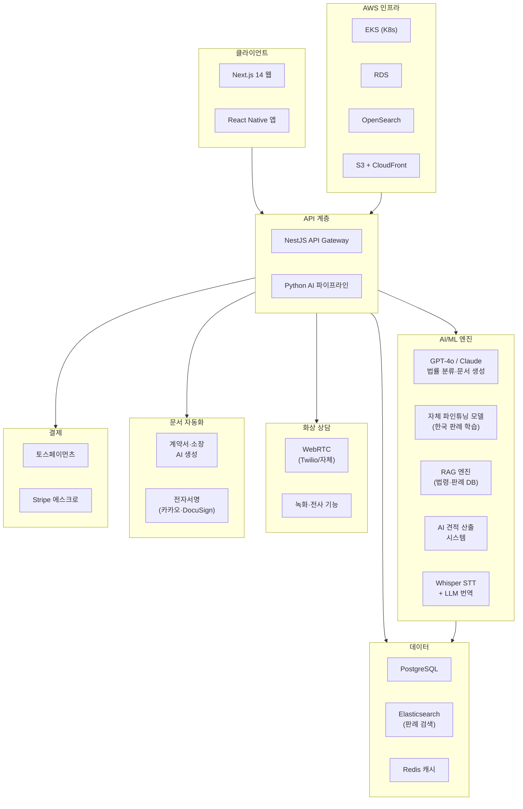
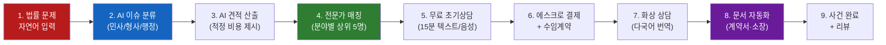
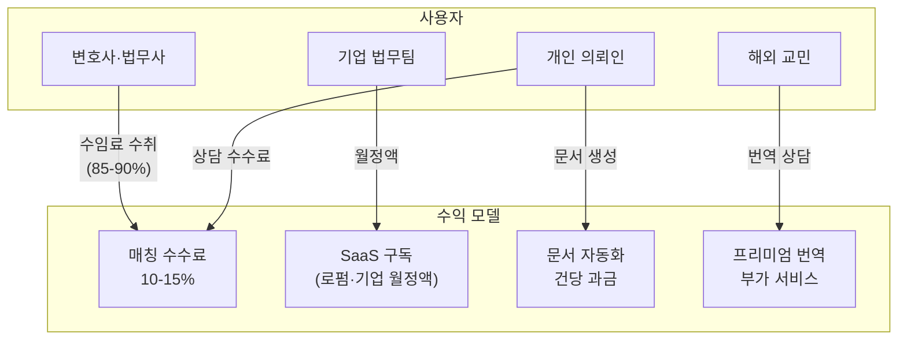

# 리걸링크 (LegalLink) — 글로벌 법률전문가 매칭 플랫폼

> **예비창업패키지 사업계획서**
> 작성일: 2026년 3월
> 버전: 2.0 (Enhanced)

---

## □ 일반현황

| 항목 | 내용 |
|------|------|
| **창업아이템명** | 리걸링크 — AI 기반 글로벌 법률전문가-의뢰인 매칭 플랫폼 |
| **산출물** | 웹 플랫폼 1개, 모바일 앱(iOS/Android) 1세트 |
| **직업(현재)** | 대학원 석사과정 (컴퓨터공학 전공) |
| **기업예정명** | 주식회사 리걸링크 (LegalLink Inc.) |
| **팀 구성 현황** | 대표 1인 + 공동창업자 1인 + 외부 자문 2인 (변호사/리걸테크 전문가, 글로벌 법률서비스 전문가) |

---

## □ 창업 아이템 개요(요약)

| 항목 | 내용 |
|------|------|
| **명칭** | 리걸링크 (LegalLink) |
| **범주** | 리걸테크(LegalTech) / 법률전문가 매칭 플랫폼 (웹 + 앱) |

### 창업 아이템 개요

**리걸링크**는 법률 서비스가 필요한 의뢰인(개인/기업)과 검증된 변호사·법무사·세무사 등 법률전문가를 AI로 매칭하는 **글로벌 리걸테크 O2O 플랫폼**이다. LLM 기반 법률이슈 자동 분류 기술로 의뢰인의 상황을 분석하고, AI 견적 시스템이 적정 비용을 산출하며, 실시간 번역 상담 기능으로 국경 없는 법률 서비스를 제공한다. 법률 문서 자동화까지 결합하여 "법률의 민주화"를 실현하는 원스톱 리걸 플랫폼이다.

| 요약 항목 | 내용 |
|-----------|------|
| **문제인식** | 한국 법률서비스 접근성 OECD 최하위권, 국민 72%가 법률 비용 부담으로 전문가 상담 포기. 글로벌 리걸테크 시장 $29B→$69B 급성장. 기존 플랫폼(로톡 등)은 단순 연결에 그침 |
| **실현가능성** | LLM 법률이슈 분류 AI, AI 견적 산출, 실시간 다국어 번역 상담, 계약서·소장 문서 자동화. 6개월 MVP |
| **성장전략** | 한국 내 개인 법률 매칭 → 기업 법무 → 해외 교민·글로벌 기업 크로스보더 법률서비스. 매칭 수수료 + SaaS 구독. 3년 내 MAU 50만, 연매출 150억원 |
| **팀구성** | AI/플랫폼 개발 대표 + 법률/운영 공동창업자(변호사) + 리걸테크 자문 + 국제법률 자문 |

---

## 1. 문제 인식 (Problem) — 창업 아이템의 필요성

### 1.1 문제 구조도

```
┌─────────────────────────────────────────────────────────────────────────┐
│                    법률서비스 접근성 위기 — 문제 구조도                      │
├─────────────────────────────────────────────────────────────────────────┤
│                                                                         │
│  ┌──────────────┐    ┌──────────────┐    ┌──────────────┐              │
│  │  정보 비대칭   │    │  비용 장벽    │    │  시간 장벽    │              │
│  │              │    │              │    │              │              │
│  │ · 법률 분야   │    │ · 상담료      │    │ · 전문가 탐색  │              │
│  │   분류 불가   │    │   22~55만원   │    │   평균 2.4주   │              │
│  │ · 전문가 역량  │    │ · 수임료 편차  │    │ · 무료상담     │              │
│  │   판단 불가   │    │   10배 이상   │    │   1개월 대기   │              │
│  │ · 절차/기한   │    │ · 사전 견적   │    │ · 서류 준비    │              │
│  │   인식 부재   │    │   확인 불가   │    │   수주 소요    │              │
│  └──────┬───────┘    └──────┬───────┘    └──────┬───────┘              │
│         │                   │                   │                      │
│         ▼                   ▼                   ▼                      │
│  ┌──────────────────────────────────────────────────────┐              │
│  │              국민 72.3%가 법률 상담 포기               │              │
│  │           소송 포기 사유 1위: 비용 부담 54.2%            │              │
│  └──────────────────────────┬───────────────────────────┘              │
│                             │                                          │
│                             ▼                                          │
│  ┌──────────────────────────────────────────────────────┐              │
│  │                사회적 결과                             │              │
│  │  · 법률 사각지대 확대 (연간 750만건 방치)                │              │
│  │  · 사회적 약자 피해 심화 (외국인근로자, 다문화가정)       │              │
│  │  · 경제적 손실 확대 (연간 추정 4.2조원)                 │              │
│  │  · 사법 불신 증가 → 사회 갈등 심화                     │              │
│  └──────────────────────────────────────────────────────┘              │
│                                                                         │
│  ┌──────────────────────────────────────────────────────┐              │
│  │               글로벌 추가 문제                         │              │
│  │  · 해외 교민 554만명 — 한국법 상담 채널 부재            │              │
│  │  · 크로스보더 거래 급증 — 법률 분쟁 다국적화             │              │
│  │  · 외국인 근로자 86만명 — 언어장벽으로 권리 포기          │              │
│  └──────────────────────────────────────────────────────┘              │
└─────────────────────────────────────────────────────────────────────────┘
```

### 1.2 법률서비스 접근성 위기

한국은 OECD 국가 중 **법률서비스 접근성이 최하위권**에 속한다. 대한법률구조공단(2024) 조사에 따르면, 국민의 **72.3%가 법률 비용 부담으로 전문가 상담을 포기**한 경험이 있으며, 법률 문제 발생 시 적절한 전문가를 찾기까지 평균 2.4주가 소요된다.

핵심 통계:

| 지표 | 수치 | 출처 |
|------|------|------|
| 국내 변호사 수 | 약 33,000명 (인구 10만명당 64명) | 대한변호사협회, 2025 |
| 법률서비스 미충족률 | 72.3% (비용 부담으로 포기) | 대한법률구조공단, 2024 |
| 법률 분쟁 경험률 | 국민 38.7%가 최근 3년 내 법률 분쟁 경험 | 한국법제연구원, 2024 |
| 평균 변호사 상담료 | 건당 22-55만원 (초기 상담) | 대한변호사협회 보수기준, 2024 |
| 전문가 탐색 소요 시간 | 평균 2.4주 | 법률소비자 실태조사, 2024 |
| 소송 포기 사유 1위 | "비용 부담" (54.2%) | 대한법률구조공단, 2024 |

법률은 모든 국민의 기본권이지만, **정보 비대칭과 높은 비용 장벽으로 인해 "있는 사람만 쓸 수 있는 서비스"**로 고착되어 있다.

### 1.3 사회적 비용 분석

법률서비스 접근성 문제는 단순히 개인의 불편을 넘어 막대한 **사회적 비용**을 발생시킨다.

| 비용 항목 | 연간 추정 규모 | 산출 근거 | 영향 범위 |
|-----------|--------------|----------|----------|
| **법률 분쟁 방치에 따른 경제적 손실** | 약 2.1조원 | 연 750만건 x 평균 손실 28만원 (미해결 분쟁의 간접비용) | 소상공인, 임차인, 근로자 |
| **소송 지연으로 인한 기회비용** | 약 0.8조원 | 민사소송 평균 14.2개월, 전문가 조기 개입 시 3-6개월 단축 가능 | 전 국민 |
| **잘못된 법률 대응에 따른 추가 비용** | 약 0.6조원 | 적합하지 않은 전문가 선임, 부적절한 합의 등으로 발생하는 추가 분쟁 | 법률 지식 취약 계층 |
| **외국인 근로자 권리 침해 비용** | 약 0.4조원 | 산재 미신고, 임금체불 미청구, 부당해고 미대응 (86만 외국인 근로자) | 외국인 근로자, 사업장 |
| **법률 사각지대 사회적 갈등 비용** | 약 0.3조원 | 임대차 분쟁, 이웃 분쟁, 온라인 명예훼손 등 미해결 갈등의 사회비용 | 공동체 전체 |
| **합계** | **약 4.2조원/년** | | |

> 리걸링크가 법률 접근성을 50% 개선할 경우, 연간 약 2.1조원의 사회적 비용 절감 효과가 기대된다.

### 1.4 기존 법률 매칭 서비스의 구조적 한계

| 문제 | 설명 |
|------|------|
| **정보 비대칭** | 의뢰인은 자신의 법률 이슈가 어떤 분야인지조차 파악하기 어려움 (민사? 형사? 행정?) → 잘못된 전문가에게 상담 의뢰 |
| **가격 불투명** | 변호사별 수임료 편차 10배 이상, 사전 견적 없이 상담 후 고지 → 불신 |
| **글로벌 대응 부재** | 해외 거래, 국제 분쟁, 교민 법률 이슈에 한국어 대응 가능한 글로벌 법률전문가 매칭 인프라 없음 |
| **문서 비효율** | 계약서·내용증명·소장 등 법률 문서 작성에 고비용 소요, 반복 문서에도 전문가 의존 |
| **플랫폼 한계** | 로톡(500만+ 상담)은 단순 연결에 그치고 AI 법률 분석·문서 자동화가 미흡, 글로벌 서비스 부재 |

### 1.5 글로벌 리걸테크 시장

| 시장 구분 | 2024-2025년 | 2030년 (전망) | CAGR |
|-----------|-------------|---------------|------|
| 글로벌 리걸테크 시장 | $29.0B (2024) | $69.0B | 15.5% |
| 글로벌 온라인 법률서비스 | $14.5B (2024) | $35.2B | 16.0% |
| 한국 리걸테크 시장 | 약 4,500억원 (2024) | 약 1.5조원 | 22.0% |
| 글로벌 계약관리(CLM) 시장 | $2.9B (2024) | $7.5B | 17.2% |

> 출처: Grand View Research (2024), Allied Market Research (2024), 한국법제연구원 (2024)

리걸테크는 AI 기술 발전과 함께 가장 빠르게 성장하는 테크 분야 중 하나이다. 특히 LLM의 등장으로 법률 문서 분석, 이슈 분류, 리스크 평가 등이 자동화 가능해지면서 시장이 폭발적으로 확대되고 있다.

### 1.6 해외 사례 비교 분석

#### LegalZoom (미국, 2001~)
- **기업가치**: NASDAQ 상장, 시가총액 $4B+ (2024)
- **핵심**: 개인·소기업 대상 법률 문서 자동화 + 변호사 연결 플랫폼
- **성과**: 연 매출 $660M+, 가입자 4M+, 500만건+ 법률 문서 생성
- **수익모델**: 문서 생성 수수료($79-599) + 변호사 구독($31.25/월~) + 법인 설립 패키지
- **시사점**: 법률 문서 자동화와 전문가 연결의 결합이 대규모 비즈니스로 성장 가능함을 검증

#### 로톡 (한국, 2014~)
- **누적 투자**: 약 350억원
- **핵심**: 한국 최대 법률 상담 플랫폼, 변호사-의뢰인 매칭
- **성과**: 누적 상담 500만건+, 등록 변호사 8,000명+, MAU 200만+
- **한계**: 단순 매칭에 그침, AI 법률 분석 미흡, 문서 자동화 부재, 글로벌 서비스 없음
- **시사점**: 한국 법률 매칭 시장의 수요 검증, AI 고도화 영역 기회

#### Rocket Lawyer (미국, 2008~)
- **누적 투자**: $172M+
- **핵심**: AI 기반 법률 문서 자동 생성 + 온디맨드 변호사 상담
- **성과**: 30M+ 사용자, 기업·개인 법률 문서 원클릭 생성
- **수익모델**: 프리미엄 구독($39.99/월), 문서별 과금, 변호사 상담 추가 요금
- **시사점**: AI 문서 자동화가 법률 비용 90%+ 절감 가능함을 입증

#### Avvo (미국, 2006~)
- **기업가치**: $250M+ (Internet Brands 인수, 2018)
- **핵심**: 변호사 평점·리뷰 플랫폼 + 무료 법률 Q&A + 유료 상담 연결
- **성과**: 변호사 프로필 97% 커버리지, 1,000만건+ 법률 Q&A 축적
- **시사점**: 리뷰 기반 신뢰 시스템이 법률서비스 정보 비대칭 해소에 핵심

#### Clio (캐나다, 2008~)
- **기업가치**: $3B+ (2024, Series F)
- **핵심**: 법률 사무소 운영 SaaS (사건 관리, 청구, 고객 관리)
- **성과**: 150개국 150,000+ 법률전문가 사용, 연 매출 $250M+
- **시사점**: B2B 법률 SaaS의 글로벌 확장 가능성 검증

### 1.7 해외 사례 종합 비교표

| 비교 항목 | LegalZoom | 로톡 | Rocket Lawyer | Clio | Avvo | **리걸링크** |
|-----------|-----------|------|---------------|------|------|------------|
| **설립 연도** | 2001 | 2014 | 2008 | 2008 | 2006 | **2026** |
| **주요 시장** | 미국 | 한국 | 미국/유럽 | 글로벌 | 미국 | **한국→글로벌** |
| **핵심 서비스** | 문서 자동화 | 변호사 매칭 | 문서+상담 | B2B SaaS | 리뷰+Q&A | **AI 분류+매칭+문서+번역** |
| **AI 활용 수준** | 기본 템플릿 | 최소 | 문서 생성 | 분석 도구 | 검색 최적화 | **LLM 법률분류+견적+RAG** |
| **다국어 지원** | 영어 | 한국어 | 영어 | 영어 | 영어 | **5개국어 실시간 번역** |
| **글로벌 매칭** | 미국 내 | 국내 한정 | 영미권 | 150개국 | 미국 내 | **크로스보더 법률 매칭** |
| **문서 자동화** | 핵심 기능 | 없음 | 핵심 기능 | 없음 | 없음 | **AI 자동생성 30종+** |
| **B2B SaaS** | 제한적 | 없음 | 제한적 | 핵심 기능 | 없음 | **기업 법무 SaaS** |
| **차별화 요소** | 규모 | 한국 1위 | UX | B2B 완성도 | 리뷰 | **AI 통합 + 글로벌** |

> 리걸링크는 기존 플랫폼들이 개별적으로 보유한 강점(문서자동화, 매칭, B2B, 리뷰)을 **AI 기반 통합 플랫폼**으로 결합하고, **실시간 다국어 번역 상담**이라는 차별화 기능을 추가한다.

---

## 2. 실현 가능성 (Solution) — 창업 아이템의 개발 계획

### 2.1 서비스 아키텍처

```
┌─────────────────────────────────────────────────────────────────────────┐
│                     리걸링크 서비스 아키텍처                               │
├─────────────────────────────────────────────────────────────────────────┤
│                                                                         │
│  ┌───────────────────────────────────────────────────────────┐          │
│  │                    사용자 접점 (Touchpoints)                │          │
│  │  ┌──────────┐  ┌──────────┐  ┌──────────┐  ┌──────────┐  │          │
│  │  │  웹 앱   │  │ iOS 앱   │  │Android앱 │  │ 카카오톡  │  │          │
│  │  │(Next.js) │  │  (RN)    │  │  (RN)    │  │  챗봇    │  │          │
│  │  └─────┬────┘  └─────┬────┘  └─────┬────┘  └─────┬────┘  │          │
│  └────────┼─────────────┼─────────────┼─────────────┼────────┘          │
│           └─────────────┼─────────────┘             │                   │
│                         ▼                           ▼                   │
│  ┌───────────────────────────────────────────────────────────┐          │
│  │              API Gateway (NestJS + GraphQL)                │          │
│  │  ┌─────────┐ ┌─────────┐ ┌─────────┐ ┌─────────────────┐ │          │
│  │  │인증/인가 │ │요청라우팅│ │Rate Limit│ │ 로깅/모니터링   │ │          │
│  │  └─────────┘ └─────────┘ └─────────┘ └─────────────────┘ │          │
│  └──────────────────────┬────────────────────────────────────┘          │
│                         │                                               │
│           ┌─────────────┼─────────────────────┐                         │
│           ▼             ▼                     ▼                         │
│  ┌──────────────┐ ┌──────────────┐  ┌──────────────────┐               │
│  │  매칭 엔진   │ │  AI 파이프라인 │  │  상담/커뮤니케이션 │               │
│  │              │ │  (Python)     │  │                  │               │
│  │ · 이슈 분류  │ │ · LLM 분류    │  │ · WebRTC 화상    │               │
│  │ · 전문가 추천 │ │ · RAG 검색    │  │ · 실시간 번역    │               │
│  │ · 견적 산출  │ │ · 문서 생성    │  │ · 채팅/메시징    │               │
│  │ · 스케줄링   │ │ · 감정분석     │  │ · 녹화/전사      │               │
│  └──────┬───────┘ └──────┬───────┘  └─────────┬────────┘               │
│         │                │                     │                        │
│         └────────────────┼─────────────────────┘                        │
│                          ▼                                              │
│  ┌───────────────────────────────────────────────────────────┐          │
│  │                    데이터 계층                              │          │
│  │  ┌──────────┐  ┌──────────┐  ┌──────────┐  ┌──────────┐  │          │
│  │  │PostgreSQL│  │Elastic   │  │ Redis    │  │ S3       │  │          │
│  │  │(사용자DB)│  │Search    │  │ (캐시)   │  │ (문서)   │  │          │
│  │  │          │  │(판례검색)│  │          │  │          │  │          │
│  │  └──────────┘  └──────────┘  └──────────┘  └──────────┘  │          │
│  └───────────────────────────────────────────────────────────┘          │
│                                                                         │
│  ┌───────────────────────────────────────────────────────────┐          │
│  │                  외부 연동 (3rd Party)                      │          │
│  │  ┌──────────┐  ┌──────────┐  ┌──────────┐  ┌──────────┐  │          │
│  │  │토스페이먼츠│  │ Stripe   │  │ DocuSign │  │  Twilio  │  │          │
│  │  │(국내결제) │  │(글로벌)  │  │(전자서명)│  │(WebRTC)  │  │          │
│  │  └──────────┘  └──────────┘  └──────────┘  └──────────┘  │          │
│  └───────────────────────────────────────────────────────────┘          │
└─────────────────────────────────────────────────────────────────────────┘
```

### 2.2 핵심 기능

#### 1) LLM 기반 법률이슈 자동 분류 시스템
- 의뢰인이 자연어로 상황을 설명 → LLM이 법률 분야(민사/형사/가사/행정/노동/지식재산/국제 등) 자동 분류
- 관련 법령·판례 자동 검색 및 요약 제공
- 유사 사례 기반 예상 결과·소요 기간·비용 범위 안내
- 정확도 목표: 법률 분야 분류 95%+, 세부 이슈 분류 88%+ (변호사 감수 기반 파인튜닝)

#### 2) AI 견적 산출 + 전문가 매칭
- 법률 이슈 유형, 복잡도, 지역, 긴급도를 기반으로 AI가 적정 비용 범위 산출
- 전문가 프로필: 전문 분야, 경력, 승소율, 리뷰 평점, 상담 가능 시간
- 시맨틱 매칭: 의뢰인 이슈와 전문가 전문성의 다차원 유사도 분석
- 매칭 시간 목표: 상담 가능 전문가 추천 10분 이내, 상담 시작 24시간 이내

#### 3) 실시간 다국어 번역 상담
- WebRTC 기반 화상·음성 상담 + AI 실시간 통역 (한국어↔영어↔중국어↔일본어↔베트남어)
- Whisper 음성인식 + LLM 번역 + TTS 음성합성 파이프라인
- 법률 용어 전문 사전 탑재 (도메인 특화 번역 정확도 향상)
- 상담 내용 자동 요약 및 법률 메모 생성

#### 4) 법률 문서 자동화
- 계약서, 내용증명, 소장, 답변서, 합의서 등 30종+ 법률 문서 AI 자동 생성
- 의뢰인 상황 입력 → AI가 초안 작성 → 변호사 검토·수정 → 최종 문서 발행
- 다국어 문서 생성 (한국어↔영어 계약서 동시 생성)
- 문서 버전 관리, 전자서명(공동인증서/카카오인증) 통합

### 2.3 AI 모델 개발 로드맵

| 단계 | 모델/기술 | 목적 | 데이터 | 목표 성능 | 일정 |
|------|----------|------|--------|----------|------|
| **Phase 0** | GPT-4o / Claude API | MVP 법률 분류·문서 생성 | 프롬프트 엔지니어링 + Few-shot | 분류 정확도 85% | 2026.Q2 |
| **Phase 1** | 법률 도메인 RAG | 판례·법령 기반 정확도 향상 | 대법원 판례 50만건, 법령 1.5만건 | 분류 정확도 90% | 2026.Q3 |
| **Phase 2** | 한국법 파인튜닝 모델 | 한국 법률 특화 LLM | 변호사 감수 데이터 5만건 | 분류 정확도 95% | 2026.Q4 |
| **Phase 3** | AI 견적 모델 | 적정 비용 범위 산출 | 과거 수임 사례 3만건 | MAE ±15% | 2027.Q1 |
| **Phase 4** | 다국어 법률 번역 모델 | 법률 도메인 특화 번역 | 병렬 법률 문서 10만쌍 | BLEU 45+ | 2027.Q2 |
| **Phase 5** | 문서 자동생성 고도화 | 30종 법률 문서 자동 생성 | 검증된 법률 문서 템플릿 + 변형 | 변호사 승인률 90% | 2027.Q3 |

### 2.4 시스템 아키텍처 (Layered)

```
┌─────────────────────────────────────────────────────────────────────────┐
│                        시스템 아키텍처 (Layered)                         │
├─────────────────────────────────────────────────────────────────────────┤
│                                                                         │
│  ┌───────────────────────────────────────────────────────────────────┐  │
│  │ Layer 1: Presentation (프레젠테이션 계층)                          │  │
│  │ ┌─────────┐ ┌──────────┐ ┌──────────┐ ┌──────────┐ ┌──────────┐ │  │
│  │ │Next.js14│ │React     │ │카카오톡  │ │관리자    │ │변호사    │ │  │
│  │ │  웹앱   │ │Native앱  │ │미니앱   │ │대시보드  │ │대시보드  │ │  │
│  │ └─────────┘ └──────────┘ └──────────┘ └──────────┘ └──────────┘ │  │
│  └──────────────────────────────┬────────────────────────────────────┘  │
│                                 ▼                                       │
│  ┌───────────────────────────────────────────────────────────────────┐  │
│  │ Layer 2: API Gateway (API 게이트웨이 계층)                         │  │
│  │ ┌──────────────────┐ ┌───────────────┐ ┌───────────────────────┐ │  │
│  │ │NestJS GraphQL API│ │ JWT 인증/인가 │ │ Rate Limiting / WAF  │ │  │
│  │ └──────────────────┘ └───────────────┘ └───────────────────────┘ │  │
│  └──────────────────────────────┬────────────────────────────────────┘  │
│                                 ▼                                       │
│  ┌───────────────────────────────────────────────────────────────────┐  │
│  │ Layer 3: Business Logic (비즈니스 로직 계층)                       │  │
│  │ ┌──────────┐ ┌──────────┐ ┌──────────┐ ┌──────────┐┌──────────┐ │  │
│  │ │매칭 엔진 │ │견적 엔진 │ │결제 처리 │ │스케줄링  ││알림 서비스││  │
│  │ │          │ │          │ │(에스크로)│ │          ││          ││  │
│  │ └──────────┘ └──────────┘ └──────────┘ └──────────┘└──────────┘ │  │
│  └──────────────────────────────┬────────────────────────────────────┘  │
│                                 ▼                                       │
│  ┌───────────────────────────────────────────────────────────────────┐  │
│  │ Layer 4: AI/ML Engine (인공지능 계층)                              │  │
│  │ ┌──────────┐ ┌──────────┐ ┌──────────┐ ┌──────────┐┌──────────┐ │  │
│  │ │LLM 법률  │ │RAG 엔진  │ │Whisper   │ │문서 생성 ││감정 분석 ││  │
│  │ │분류 엔진 │ │(판례검색)│ │+ 번역    │ │AI 엔진  ││엔진     ││  │
│  │ └──────────┘ └──────────┘ └──────────┘ └──────────┘└──────────┘ │  │
│  └──────────────────────────────┬────────────────────────────────────┘  │
│                                 ▼                                       │
│  ┌───────────────────────────────────────────────────────────────────┐  │
│  │ Layer 5: Data (데이터 계층)                                        │  │
│  │ ┌──────────┐ ┌──────────┐ ┌──────────┐ ┌──────────┐┌──────────┐ │  │
│  │ │PostgreSQL│ │Elastic   │ │Redis     │ │S3 문서   ││Vector DB ││  │
│  │ │(RDBMS)   │ │Search    │ │(Cache)   │ │스토리지  ││(Pinecone)││  │
│  │ └──────────┘ └──────────┘ └──────────┘ └──────────┘└──────────┘ │  │
│  └──────────────────────────────┬────────────────────────────────────┘  │
│                                 ▼                                       │
│  ┌───────────────────────────────────────────────────────────────────┐  │
│  │ Layer 6: Infrastructure (인프라 계층)                              │  │
│  │ ┌──────────┐ ┌──────────┐ ┌──────────┐ ┌──────────┐┌──────────┐ │  │
│  │ │AWS EKS   │ │CloudFront│ │Terraform │ │Datadog   ││GitHub    ││  │
│  │ │(K8s)     │ │(CDN)     │ │(IaC)     │ │(모니터링)││Actions   ││  │
│  │ └──────────┘ └──────────┘ └──────────┘ └──────────┘└──────────┘ │  │
│  └───────────────────────────────────────────────────────────────────┘  │
└─────────────────────────────────────────────────────────────────────────┘
```

### 2.5 기술 스택

| 구분 | 기술 |
|------|------|
| **프론트엔드** | Next.js 14 (웹), React Native (앱) |
| **백엔드** | Node.js + NestJS (API), Python (AI 파이프라인) |
| **AI/ML** | GPT-4o / Claude (법률 분류·문서 생성), 자체 파인튜닝 모델 (한국 판례 학습), RAG (법령·판례 DB) |
| **번역/통역** | Whisper (STT), LLM 번역, TTS (음성합성), 법률 도메인 사전 |
| **화상 상담** | WebRTC (Twilio/자체 미디어서버), 녹화·전사 기능 |
| **결제** | 토스페이먼츠, Stripe (글로벌), 에스크로 |
| **전자서명** | 카카오인증, 공동인증서 API, DocuSign (글로벌) |
| **인프라** | AWS (EKS, RDS, OpenSearch, S3), CloudFront |
| **데이터** | PostgreSQL, Elasticsearch (판례 검색), Redis (캐시), Pinecone (벡터DB) |

### 2.6 사용자 흐름도

```
┌─────────────────────────────────────────────────────────────────────────┐
│                         사용자 흐름도 (User Flow)                       │
├─────────────────────────────────────────────────────────────────────────┤
│                                                                         │
│  ┌──────────┐                                                           │
│  │ 의뢰인   │                                                           │
│  │ 회원가입  │                                                           │
│  └────┬─────┘                                                           │
│       │                                                                 │
│       ▼                                                                 │
│  ┌──────────────────────────────────────┐                               │
│  │ STEP 1: 법률 문제 자연어 입력         │                               │
│  │ "건물주가 갑자기 임대료를 40% 올리고   │                               │
│  │  나가라고 합니다"                     │                               │
│  └──────────────┬───────────────────────┘                               │
│                 ▼                                                       │
│  ┌──────────────────────────────────────┐                               │
│  │ STEP 2: AI 법률이슈 자동 분류         │                               │
│  │ ► 분야: 민사 > 부동산 > 임대차         │                               │
│  │ ► 법령: 상가건물 임대차보호법          │                               │
│  │ ► 유사판례 3건 요약 제공              │                               │
│  └──────────────┬───────────────────────┘                               │
│                 ▼                                                       │
│  ┌──────────────────────────────────────┐                               │
│  │ STEP 3: AI 견적 산출                  │                               │
│  │ ► 예상 비용: 150만~300만원            │                               │
│  │ ► 소요 기간: 2~4개월                  │                               │
│  │ ► 예상 승률: 78% (유사사례 기반)       │                               │
│  └──────────────┬───────────────────────┘                               │
│                 ▼                                                       │
│  ┌──────────────────────────────────────┐                               │
│  │ STEP 4: 전문가 매칭 (상위 5명 추천)    │                               │
│  │ ► 전문분야 일치도 / 승소율 / 리뷰     │                               │
│  │ ► 상담 가능 시간 / 수임료 비교         │                               │
│  └──────────────┬───────────────────────┘                               │
│                 ▼                                                       │
│  ┌──────────────────────────────────────┐                               │
│  │ STEP 5: 무료 초기상담 (15분)          │                               │
│  │ ► 텍스트 / 음성 / 화상 선택           │                               │
│  │ ► 다국어 실시간 번역 지원              │                               │
│  └──────────────┬───────────────────────┘                               │
│                 ▼                                                       │
│  ┌──────────────────────────────────────┐                               │
│  │ STEP 6: 에스크로 결제 + 수임계약       │                               │
│  │ ► 토스페이먼츠 / Stripe               │                               │
│  │ ► 전자 위임장 AI 자동생성             │                               │
│  └──────────────┬───────────────────────┘                               │
│                 ▼                                                       │
│  ┌──────────────────────────────────────┐                               │
│  │ STEP 7: 사건 진행 + 문서 자동화       │                               │
│  │ ► 진행 상황 실시간 알림               │                               │
│  │ ► 소장/답변서/합의서 AI 생성          │                               │
│  │ ► 화상 상담 (다국어 번역)             │                               │
│  └──────────────┬───────────────────────┘                               │
│                 ▼                                                       │
│  ┌──────────────────────────────────────┐                               │
│  │ STEP 8: 사건 완료 + 리뷰             │                               │
│  │ ► 만족도 평가 / 전문가 리뷰 작성      │                               │
│  │ ► AI 학습 데이터로 활용 (비식별화)     │                               │
│  └──────────────────────────────────────┘                               │
│                                                                         │
└─────────────────────────────────────────────────────────────────────────┘
```

### 2.7 개발 일정

| 구분 | 추진 내용 | 추진 기간 | 세부 내용 |
|------|----------|----------|----------|
| 1 | MVP 개발 | 2026.04 ~ 2026.09 | LLM 법률분류 + 전문가 매칭 + 기본 상담 (텍스트/음성) + 결제 |
| 2 | 베타 테스트 | 2026.10 ~ 2026.12 | 변호사 200명 + 의뢰인 3,000건 상담 테스트, AI 분류 정확도 검증 |
| 3 | 정식 출시 | 2027.01 | 문서 자동화, 화상 상담, 번역 기능 통합 출시 |
| 4 | 글로벌 확장 | 2027.01 ~ 2027.06 | 다국어 번역 상담, 해외 교민 타겟 마케팅, 크로스보더 법률 매칭 |

### 2.8 정부지원사업비 집행 계획

**< 1단계 (20백만원) >**

| 비목 | 산출 근거 | 금액(원) |
|------|----------|---------|
| 재료비 | AWS 인프라 + AI API 비용 6개월 | 8,000,000 |
| 외주용역비 | 법률 도메인 AI 파인튜닝 데이터 구축 (판례·법령 정제) | 7,000,000 |
| 지급수수료 | 변호사 자문 및 법률 데이터 라이선스 | 3,000,000 |
| 특허출원 | LLM 법률이슈 분류 알고리즘 특허 | 2,000,000 |
| **합계** | | **20,000,000** |

**< 2단계 (40백만원) — 상세 예산 >**

| 비목 | 세부 항목 | 산출 근거 | 금액(원) |
|------|----------|----------|---------|
| 인건비 | AI/백엔드 개발자 1명 | 월 400만원 x 6개월 | 24,000,000 |
| 마케팅 | 검색광고 (네이버/구글) | 월 100만원 x 4개월 | 4,000,000 |
| 마케팅 | 법률 커뮤니티 마케팅 | 변호사 온보딩 인센티브 + 홍보 | 3,000,000 |
| 마케팅 | SNS 콘텐츠 마케팅 | 법률 교육 콘텐츠 제작 | 3,000,000 |
| 외주용역비 | WebRTC 화상상담 모듈 | 실시간 화상/음성 상담 개발 | 4,000,000 |
| 외주용역비 | 다국어 번역 연동 | Whisper + LLM 번역 파이프라인 | 2,000,000 |
| **합계** | | | **40,000,000** |

### 2.9 Pre-Seed 예산 계획 (4억원)

| 항목 | 세부 내용 | 금액(백만원) | 비율 |
|------|----------|------------|------|
| **인건비** | 개발팀 4명 x 12개월 (AI 2명, 풀스택 1명, 앱 1명) | 192 | 48.0% |
| **AI 인프라** | GPU 서버 임대, AI API 비용, 벡터DB 운영 | 60 | 15.0% |
| **법률 데이터** | 판례 데이터 라이선스, 변호사 감수비, 법령 DB 구축 | 48 | 12.0% |
| **마케팅** | 초기 사용자 확보 (SEO, 검색광고, 커뮤니티) | 40 | 10.0% |
| **운영비** | 사무실, 법인 설립, 회계/세무, 보험 | 30 | 7.5% |
| **특허/법무** | 특허 출원 3건, 법률 자문, 개인정보 보호 컨설팅 | 18 | 4.5% |
| **예비비** | 비상 운영 자금 | 12 | 3.0% |
| **합계** | | **400** | **100%** |

---

## 3. 성장전략 (Scale-up) — 사업화 추진 전략

### 3.1 시장 기회 TAM/SAM/SOM

```
┌─────────────────────────────────────────────────────────────────────────┐
│                    시장 기회 TAM / SAM / SOM                            │
├─────────────────────────────────────────────────────────────────────────┤
│                                                                         │
│   TAM (Total Addressable Market) — 전체 시장                            │
│   ┌─────────────────────────────────────────────────────────────┐       │
│   │                                                             │       │
│   │              $14.5B (약 19조원, 2024)                        │       │
│   │         글로벌 온라인 법률서비스 시장                          │       │
│   │                     → $35.2B (2030)                         │       │
│   │                                                             │       │
│   │   SAM (Serviceable Available Market) — 유효 시장             │       │
│   │   ┌─────────────────────────────────────────────────┐       │       │
│   │   │                                                 │       │       │
│   │   │        $1.2B (약 1.6조원)                        │       │       │
│   │   │   한국 + 아시아 교민 + 크로스보더 법률             │       │       │
│   │   │                                                 │       │       │
│   │   │   SOM (Serviceable Obtainable Market)            │       │       │
│   │   │   ┌─────────────────────────────────────┐       │       │       │
│   │   │   │                                     │       │       │       │
│   │   │   │     $11.5M (약 150억원, 3년)         │       │       │       │
│   │   │   │   한국 온라인 법률 매칭 7% 점유       │       │       │       │
│   │   │   │   + 해외 교민 법률서비스              │       │       │       │
│   │   │   │                                     │       │       │       │
│   │   │   └─────────────────────────────────────┘       │       │       │
│   │   └─────────────────────────────────────────────────┘       │       │
│   └─────────────────────────────────────────────────────────────┘       │
│                                                                         │
│   ► 시장 성장률: CAGR 15.5% (글로벌) / 22.0% (한국)                    │
│   ► 한국 시장 도달 가능 규모: 2030년 약 1.5조원                         │
│   ► 핵심 성장 동인: LLM 기술 발전 + 법률 비용 부담 증가                  │
│                                                                         │
│   산출 근거:                                                            │
│   ├── TAM: Grand View Research, Allied Market Research (2024)          │
│   ├── SAM: 한국법제연구원 + 아시아 법률시장 비중 25%                     │
│   └── SOM: 한국 온라인 법률매칭 시장 7% + 교민 10억원                    │
│                                                                         │
└─────────────────────────────────────────────────────────────────────────┘
```

### 3.2 비즈니스 모델

| 수익원 | 설명 | 목표 비중 |
|--------|------|----------|
| **매칭 수수료** | 상담·수임료의 10-15% (의뢰인/전문가 분담) | 45% |
| **문서 자동화 과금** | AI 법률 문서 생성 건당 과금 (3,000-50,000원/건) | 20% |
| **프리미엄 구독 (개인)** | 월정액 무제한 법률 상담 + 문서 생성 (월 29,000원~) | 15% |
| **B2B 기업 법무 SaaS** | 기업 법무팀 전용: 계약관리, 리스크 분석, 법률 비용 최적화 (월 99만원~) | 15% |
| **광고·리드** | 변호사 프로필 상위 노출, 전문가 인증 배지 | 5% |

### 3.3 구독 모델 (4 Tiers)

| 항목 | Free (무료) | Basic (기본) | Pro (프로) | Enterprise (기업) |
|------|------------|-------------|-----------|-----------------|
| **월 요금** | 0원 | 19,000원 | 49,000원 | 990,000원~ |
| **연 요금** | 0원 | 190,000원 (17%↓) | 490,000원 (17%↓) | 별도 협의 |
| **AI 법률 분류** | 월 3회 | 무제한 | 무제한 | 무제한 |
| **전문가 매칭** | 기본 매칭 | 우선 매칭 | 프리미엄 매칭 | 전담 매니저 배정 |
| **초기 상담** | 유료 (건당) | 월 2회 무료 (15분) | 월 5회 무료 (30분) | 무제한 상담 |
| **문서 자동화** | 없음 | 월 3건 | 월 20건 | 무제한 |
| **다국어 번역** | 없음 | 텍스트만 | 음성+화상 | 전용 통역사 매칭 |
| **사건 관리** | 없음 | 기본 추적 | 상세 대시보드 | 법무팀 통합 관리 |
| **API 연동** | 없음 | 없음 | 없음 | 전용 API 제공 |
| **타겟 사용자** | 법률 정보 탐색자 | 개인 법률 이용자 | 소규모 사업자 | 중견·대기업 법무팀 |
| **예상 전환율** | (베이스) | 5-8% | 2-3% | 0.5-1% |

### 3.4 시장 진입 전략

```
┌─────────────────────────────────────────────────────────────────────────┐
│                         시장 진입 전략 로드맵                             │
├─────────────────────────────────────────────────────────────────────────┤
│                                                                         │
│  Phase 1 (2026-2027)          Phase 2 (2027-2028)                      │
│  한국 개인 법률 매칭            기업 법무 + 문서 자동화                    │
│  ┌────────────────────┐       ┌────────────────────┐                   │
│  │                    │       │                    │                   │
│  │  ► 생활법률 중심     │       │  ► B2B SaaS 출시   │                   │
│  │    (부동산/가사/     │──────►│    (계약관리/리스크) │                   │
│  │     노동/형사)      │       │  ► 문서 30→100종+  │                   │
│  │  ► 서울·수도권       │       │  ► 전국 확대       │                   │
│  │    변호사 500명      │       │  ► 세무사·변리사   │                   │
│  │  ► 월 10,000건 상담  │       │    ·노무사 확장    │                   │
│  │                    │       │                    │                   │
│  └────────────────────┘       └─────────┬──────────┘                   │
│                                         │                              │
│                                         ▼                              │
│                               Phase 3 (2028-2030)                      │
│                               글로벌 크로스보더                          │
│                               ┌────────────────────────────┐           │
│                               │                            │           │
│                               │  ► 해외 교민 법률서비스      │           │
│                               │    미국(255만) 중국(200만)   │           │
│                               │    일본(82만) 베트남(17만)   │           │
│                               │  ► 크로스보더 법률 매칭      │           │
│                               │  ► 실시간 번역 상담          │           │
│                               │  ► 현지 법률전문가 네트워크   │           │
│                               │                            │           │
│                               └────────────────────────────┘           │
│                                                                         │
│  핵심 지표:                                                             │
│  ├── Phase 1: MAU 5만 → 매칭 성공률 85% → NPS 60+                     │
│  ├── Phase 2: MAU 20만 → B2B 고객 200사 → 문서 생성 10만건/월          │
│  └── Phase 3: MAU 50만 → 글로벌 10개국 → 연매출 150억원                │
│                                                                         │
└─────────────────────────────────────────────────────────────────────────┘
```

**Phase 1 (2026-2027): 한국 개인 법률 매칭**
- 생활 법률 중심: 부동산(임대차·등기), 가사(이혼·상속), 노동(해고·임금), 형사(교통사고·폭행)
- 서울·수도권 변호사 500명 + 법무사 200명 온보딩
- 의뢰인 월 10,000건 상담 목표 (출시 후 12개월)
- 핵심 차별점: AI 법률분류로 "어떤 변호사가 필요한지 모르는" 의뢰인의 진입장벽 제거

**Phase 2 (2027-2028): 기업 법무 + 문서 자동화**
- B2B 기업 법무 SaaS 출시: 중소기업 대상 계약 관리, 법률 리스크 분석
- 문서 자동화 확대: 30종 → 100종+ 법률 문서 템플릿
- 전국 확대 + 세무사·변리사·노무사 등 전문직 영역 확장

**Phase 3 (2028-2030): 글로벌 크로스보더 법률서비스**
- **해외 교민**: 미국(255만명), 중국(200만명), 일본(82만명), 베트남(17만명) — 한국어 법률 상담 수요
- **크로스보더**: 한국 기업 해외 진출 법률, 외국 기업 한국 투자 법률
- **실시간 번역 상담**: 한국 변호사 ↔ 해외 의뢰인, 해외 변호사 ↔ 한국 의뢰인
- 현지 법률전문가 네트워크 구축 (미국·일본·베트남 우선)

### 3.5 KPI 연도별 목표

| KPI | 2026 (MVP) | 2027 (정식출시) | 2028 (성장) | 2029 (글로벌) | 2030 (확장) |
|-----|-----------|----------------|-----------|-------------|------------|
| **MAU** | 5,000 | 50,000 | 200,000 | 350,000 | 500,000 |
| **월간 상담 건수** | 500 | 10,000 | 40,000 | 70,000 | 100,000 |
| **등록 전문가 수** | 200 | 1,500 | 5,000 | 8,000 | 12,000 |
| **매칭 성공률** | 75% | 85% | 90% | 92% | 95% |
| **AI 분류 정확도** | 85% | 92% | 95% | 96% | 97% |
| **NPS (순추천지수)** | 45 | 55 | 65 | 70 | 75 |
| **문서 자동생성 건수/월** | - | 5,000 | 50,000 | 100,000 | 200,000 |
| **B2B 기업 고객 수** | - | 30 | 200 | 500 | 1,000 |
| **글로벌 서비스 국가** | - | - | 3 | 7 | 10 |
| **번역 상담 건수/월** | - | - | 1,000 | 5,000 | 15,000 |

### 3.6 재무 전망 및 BEP 분석

| 항목 | 2026 | 2027 | 2028 | 2029 | 2030 |
|------|------|------|------|------|------|
| **매출 (억원)** | 0.5 | 12 | 52 | 105 | 150 |
| - 매칭 수수료 | 0.3 | 5.4 | 23.4 | 47.3 | 67.5 |
| - 문서 자동화 | 0.1 | 2.4 | 10.4 | 21.0 | 30.0 |
| - 구독 (개인) | 0.1 | 1.8 | 7.8 | 15.8 | 22.5 |
| - B2B SaaS | 0 | 1.8 | 7.8 | 15.8 | 22.5 |
| - 광고·리드 | 0 | 0.6 | 2.6 | 5.3 | 7.5 |
| **운영비용 (억원)** | 8 | 22 | 38 | 55 | 68 |
| - 인건비 | 4 | 12 | 22 | 32 | 38 |
| - AI 인프라 | 2 | 5 | 8 | 10 | 12 |
| - 마케팅 | 1 | 3 | 5 | 8 | 10 |
| - 운영/관리 | 1 | 2 | 3 | 5 | 8 |
| **영업이익 (억원)** | -7.5 | -10 | 14 | 50 | 82 |
| **영업이익률** | - | - | 26.9% | 47.6% | 54.7% |
| **누적 손실 (억원)** | -7.5 | -17.5 | -3.5 | 46.5 | 128.5 |

> **BEP (손익분기점): 2028년 상반기 달성 예상**
> - 월 매출 약 3.2억원 = 월 운영비용 시점
> - 매칭 건수 약 25,000건/월 + B2B 고객 120사 + 구독자 8,000명 필요
> - BEP 달성 후 높은 한계이익률(70%+)로 빠른 수익성 개선

### 3.7 투자유치 전략

| 단계 | 시기 | 목표 금액 | 용도 |
|------|------|---------|------|
| Pre-Seed | 2026.Q2 | 4억원 | MVP 개발, 법률 AI 데이터 구축, 초기 전문가 온보딩 |
| Seed | 2027.Q1 | 25억원 | 정식 서비스 확대, B2B SaaS 개발, 마케팅 |
| Series A | 2028.Q1 | 120억원 | 글로벌 진출, 다국어 서비스 확장, 해외 법률전문가 네트워크 |
| Series B | 2029.Q2 | 500억원 | 아시아·북미 시장 확대, M&A (법률 데이터 기업) |

### 3.8 ESG 및 사회적 가치

| ESG 영역 | 핵심 지표 | 2027 목표 | 2030 목표 | UN SDG 연계 |
|----------|----------|----------|----------|------------|
| **사회 (S)** | 법률 접근성 개선 건수 | 10만건/년 | 100만건/년 | SDG 16 (평화, 정의) |
| **사회 (S)** | 취약계층 무료 상담 건수 | 5,000건/년 | 50,000건/년 | SDG 10 (불평등 감소) |
| **사회 (S)** | 외국인 근로자 지원 건수 | 1,000건/년 | 10,000건/년 | SDG 8 (양질의 노동) |
| **사회 (S)** | 법률 비용 절감 총액 | 50억원 | 500억원 | SDG 1 (빈곤 해소) |
| **환경 (E)** | 종이 문서 디지털 전환 | 50만장/년 | 1,000만장/년 | SDG 12 (책임 소비) |
| **환경 (E)** | 탄소 배출 감소 (이동 절감) | 500톤 CO2 | 5,000톤 CO2 | SDG 13 (기후 행동) |
| **지배구조 (G)** | 수임료 투명성 점수 | 80% | 95% | SDG 16 (투명한 제도) |
| **지배구조 (G)** | 데이터 보호 인증 | ISO 27001 | SOC 2 Type II | SDG 16 |

- **UN SDG 16 (평화, 정의, 강력한 제도)**: 모든 사람이 사법에 접근할 수 있는 환경 구축
- **사회적 약자 법률 지원**: 외국인 근로자, 다문화 가정, 저소득층에 대한 AI 기반 무료/저비용 법률 서비스 제공
- **법률 문서 디지털화**: 종이 사용량 대폭 감소 (연간 법률 문서 인쇄량 추정 수억 장)
- **변호사 수임료 투명화**: 리뷰 기반 법률서비스 품질 향상, 법률 정보 공개로 정보 비대칭 해소

---

## 4. 팀 구성 (Team)

### 4.1 핵심 팀

| 구분 | 직위 | 담당 업무 | 보유 역량 | 구성 상태 |
|------|------|---------|---------|---------|
| 1 | 대표 | 제품/AI 개발 총괄 | 컴퓨터공학 석사, NLP/LLM 연구 경력, 플랫폼 개발 경험 | 완료 |
| 2 | 공동대표 | 법률/사업개발 | 변호사 자격, 로펌 근무 5년+, 리걸테크 스타트업 경험 | 완료 |
| 3 | 개발자 | AI 파이프라인 | ML 엔지니어, RAG/LLM 파인튜닝 전문 | 예정(2026.Q3) |
| 4 | 개발자 | 프론트엔드/앱 | React Native, WebRTC 전문, 화상 서비스 개발 경험 | 예정(2026.Q3) |
| 5 | 매니저 | 법률전문가 관리 | 로펌 운영 지원 경력, 법률 커뮤니티 네트워크 | 예정(2026.Q4) |

### 4.2 자문단 구성

| 구분 | 자문 분야 | 이름/소속 (예정) | 주요 역할 | 자문 빈도 |
|------|----------|----------------|----------|----------|
| 1 | **법률/리걸테크** | 前 대형로펌 파트너 변호사 | 법률 서비스 품질 자문, 변호사 네트워크 소개, 규제 대응 | 월 2회 |
| 2 | **국제법률** | 국제변호사 (미국 bar 보유) | 크로스보더 법률서비스 설계, 해외 진출 전략 | 월 1회 |
| 3 | **AI/기술** | 대학교 AI 연구실 교수 | LLM 법률 분류 모델 자문, 기술 로드맵 검토 | 월 2회 |
| 4 | **스타트업/투자** | VC 파트너 (리걸테크 투자 경험) | 투자 유치 전략, 사업 모델 검증, IR 자문 | 분기 1회 |
| 5 | **UX/디자인** | 법률 서비스 UX 전문가 | 사용자 경험 설계, 접근성 개선 | 월 1회 |

### 4.3 조직 성장 계획

| 시기 | 총 인원 | 주요 채용 직무 | 조직 구조 |
|------|--------|-------------|----------|
| **2026.Q2** (창업) | 2명 | 공동창업자 2명 | 플랫 구조 |
| **2026.Q3** | 4명 | AI 엔지니어 1, 프론트엔드 1 | 개발팀 + 사업팀 |
| **2026.Q4** | 6명 | 법률전문가 매니저 1, 백엔드 1 | 개발팀 + 사업팀 + 운영팀 |
| **2027.Q1** | 10명 | 마케터 1, 디자이너 1, 개발자 2 | 프로덕트팀, 엔지니어링팀, 비즈팀 |
| **2027.H2** | 18명 | 글로벌 BD 1, 법률 QA 2, CS 2, 개발자 3 | 부서별 리드 체제 |
| **2028** | 35명 | 해외 법률 매니저 3, AI 연구 3, 마케팅 3, 개발 5 | VP 체제, 해외 지사 준비 |
| **2029** | 60명 | 해외 지사 인력, 엔터프라이즈 세일즈 | C-Level 경영진 완성 |
| **2030** | 100명+ | 글로벌 오퍼레이션 | 글로벌 조직 구조 |

### 4.4 협력 기관

| 구분 | 파트너명 | 보유 역량 | 협업 방안 | 협력 시기 |
|------|---------|---------|---------|---------|
| 1 | 대한변호사협회 | 33,000+ 변호사 네트워크 | 전문가 온보딩, 자격 검증 연동 | 2026.Q3 |
| 2 | 한국법제연구원 | 법령·판례 데이터베이스 | 법률 AI 학습 데이터 제공 | 2026.Q4 |
| 3 | 법률구조공단 | 취약계층 법률 지원 네트워크 | 사회적 가치 사업 연계 | 2027.Q1 |
| 4 | Twilio | WebRTC 화상/음성 인프라 | 실시간 상담 인프라 연동 | 2026.Q4 |

---

## 5. 사용자 구매동인(Purchase Motivation) 분석

### 5.1 기능적 동인 (Functional Motivation)

| 동인 | 설명 | 기대 효과 |
|------|------|----------|
| **시간 절약** | 전문가 탐색 평균 2.4주 → AI 법률분류+매칭으로 10분 이내 추천, 24시간 이내 상담 시작 | 전문가 탐색 시간 95% 단축 |
| **비용 절감** | AI 문서 자동화로 법률 문서 작성 비용 70-90% 절감, 적정 견적 산출로 과다 비용 방지 | 평균 법률 비용 50-70% 절감 |
| **편의성** | 법률이슈 분류·전문가 매칭·상담·문서 생성·전자서명까지 원스톱 | 오프라인 법률사무소 방문 불필요 |
| **정확성** | LLM 법률 분류 정확도 95%+ → 적합한 전문 분야 변호사 매칭 | 잘못된 전문가 상담으로 인한 시간·비용 낭비 방지 |
| **글로벌 접근** | 실시간 번역으로 해외 법률 이슈도 한국어로 상담 가능 | 해외 교민 550만명+ 법률 접근성 혁신 |

### 5.2 감정적 동인 (Emotional Motivation)

| 동인 | 설명 |
|------|------|
| **불안 해소** | "법적으로 불이익을 당하면 어떡하지?"라는 불안감 → AI가 상황을 분석하고 적정 비용까지 알려주어 안심 |
| **신뢰감** | 변호사 승소율·리뷰·전문 분야 투명 공개 → "내 사건에 맞는 최적의 전문가"라는 확신 |
| **무력감 극복** | 법률 용어와 절차를 모르는 일반인의 무력감 → AI가 쉬운 말로 설명하고 가이드 제공 |
| **공정함에 대한 갈망** | "돈이 없어서 법적 보호를 받지 못한다"는 억울함 → 합리적 가격의 법률 서비스 접근 |
| **프라이버시 보호** | 민감한 법률 이슈(이혼, 형사 등)를 대면 없이 온라인으로 상담 가능한 심리적 편안함 |

### 5.3 사회적 동인 (Social Motivation)

| 동인 | 설명 |
|------|------|
| **소속감** | "나도 법률 전문가의 도움을 받을 수 있다" — 법률서비스가 특권이 아닌 보편적 권리라는 인식 |
| **사회적 인정** | 법적 문제를 체계적으로 해결하는 합리적 소비자라는 자기 인식 |
| **트렌드** | AI 리걸테크 활용이라는 스마트한 법률 소비 트렌드 참여 |
| **약자 보호** | 외국인 근로자, 다문화 가정 등 법률 사각지대에 있는 이들의 권리 보호 참여 의식 |

### 5.4 페르소나별 구매 여정

#### 페르소나 A: 정현수 (가명, 38세, 서울, 중소기업 대표)

> **"영업비밀 유출 의심 — 어디서부터 시작해야 할지 모르는 대표"**

- **배경**: 직원 15명의 IT 기업 대표. 최근 핵심 개발자가 경쟁사로 이직하면서 영업비밀 유출 우려 발생. 법률 대응이 필요하지만, 이것이 민사인지 형사인지, 어떤 분야 변호사를 찾아야 하는지 모름. 지인 소개 변호사는 수임료 3,000만원을 제시해 부담.
- **핵심 Pain Point**: 법률 분야 판단 불가 + 비용 불투명
- **인지 단계**: 네이버 검색 "영업비밀 유출 변호사 추천" → 리걸링크 광고 노출 → "AI가 법률 이슈를 분석해준다?"에 호기심
- **관심 단계**: 리걸링크에 상황 텍스트 입력 → AI가 "부정경쟁방지법 위반(영업비밀 침해), 민사소송(손해배상) + 형사고소(업무상 배임) 가능"으로 분류 → "이게 가능하다고?"
- **고려 단계**: AI 견적 시스템이 유사 사건 비용 범위 "800만-1,500만원"으로 산출. 추천 변호사 3명의 승소율·리뷰·수임료 비교 → 지인 소개 대비 50% 저렴
- **전환 단계**: 변호사 화상 상담(30분) → 수임 결정 → 플랫폼 내 전자 위임장·계약서 자동 생성 → 사건 진행 상황 실시간 추적
- **핵심 구매 동인**: 법률 이슈 분류의 **기능적 편의** + 적정 비용을 미리 알 수 있는 **불안 해소**
- **예상 LTV**: 연 300만원 (매칭 수수료 + Pro 구독)

#### 페르소나 B: 이미영 (가명, 45세, 미국 LA 교민)

> **"부모님 돌아가신 후 한국 상속 — 바다 건너 법률 문제"**

- **배경**: 미국 LA에 20년 거주한 교민. 한국에 있는 부모님이 돌아가시면서 상속 문제 발생. 한국 부동산 상속, 상속세, 형제간 분쟁 해결이 필요. 미국에서 한국 법률 상담을 받을 방법을 모름. 영어로 한국법을 설명해줄 변호사 필요.
- **핵심 Pain Point**: 물리적 거리 + 언어 장벽 + 한국법 무지
- **인지 단계**: 한인 커뮤니티 게시판에서 "한국 상속 전문 변호사" 검색 → 리걸링크 추천 글 발견
- **관심 단계**: 앱 설치 → 영어로 상황 입력 → AI가 "한국 상속법, 상속세법, 부동산등기법" 분류 + 한국어 번역 상담 가능 변호사 추천
- **고려 단계**: 시차 고려한 화상 상담 예약(LA 저녁 = 한국 오전). AI 번역으로 법률 용어 실시간 통역 체험
- **전환 단계**: 상속 전문 변호사와 월정액 상담 구독(월 29,000원) → 상속 절차 전 과정 원격 진행 → 상속등기 문서 AI 자동 생성
- **핵심 구매 동인**: 해외에서 한국 법률 접근이라는 **기능적 필요** + 부모님 상속 문제의 **감정적 시급성** + 한국어 상담이라는 **문화적 편안함**
- **예상 LTV**: 연 150만원 (구독 + 문서 자동화)

#### 페르소나 C: 팜 티 란 (가명, 29세, 베트남 출신 외국인 근로자)

> **"산업재해를 당했는데 아무도 도와주지 않는다"**

- **배경**: 한국 공장에서 3년 근무. 최근 산업재해로 손가락을 다쳤으나, 공장측에서 산재 처리를 거부. 한국어 소통이 제한적이고 법률 지식 전무. 비용도 없음.
- **핵심 Pain Point**: 언어 장벽 + 법률 지식 전무 + 경제적 취약
- **인지 단계**: 베트남 근로자 커뮤니티에서 리걸링크 소개
- **관심 단계**: 베트남어로 상황 입력 → AI가 "산업재해보상보험법, 근로기준법 위반"으로 분류 → 무료 법률구조 대상 여부 확인
- **전환 단계**: 법률구조공단 연계 무료 상담 → 베트남어 실시간 통역 → 산재 신청 서류 자동 생성
- **핵심 구매 동인**: 언어 장벽 극복이라는 **기능적 필요** + 약자의 권리 보호라는 **감정적 절박함**
- **사회적 임팩트**: 무료 서비스이나, 법률구조공단 연계 수수료 + 사회적 기업 인증 효과

---

## 6. 사회적 문제 공감대 형성

### 6.1 실제 사례 / 스토리텔링

#### 사례 1: 김태호 (가명, 52세) — "돈이 없어 법적 보호를 포기한 소상공인"
김태호 씨는 서울 종로에서 20년간 한식당을 운영해왔다. 건물주가 갑자기 임대료를 40% 인상하고, 거부하면 계약 해지를 통보했다. 상가건물 임대차보호법에 따라 보호받을 수 있었지만, 변호사 상담료 30만원이 부담스러웠고, 어떤 법률로 어떤 변호사를 찾아야 하는지도 몰랐다. 결국 "법은 돈 있는 사람 것"이라며 포기하고 15년간 운영한 가게를 접었다. AI가 무료로 법률 이슈를 분류하고, 저렴한 비용의 전문가를 즉시 매칭해줬다면 결과가 달랐을 것이다.

#### 사례 2: 박서연 (가명, 33세) — "이혼 과정에서 법률 정보 비대칭의 피해자"
박서연 씨는 가정폭력 피해자였다. 이혼을 결심했지만, 남편 측은 이미 변호사를 선임한 상태였다. 서연 씨는 양육권, 재산분할, 위자료에 대한 법률 지식이 전혀 없었고, 무료 법률 상담은 한 달 후에나 가능했다. 정보 비대칭 속에서 불리한 합의를 할 뻔했다. AI 법률 분류가 즉시 "가사소송(이혼) — 가정폭력 — 양육권·재산분할"로 분류하고, 가정폭력 전문 여성 변호사를 긴급 매칭했다면, 서연 씨는 더 빨리, 더 공정한 법률 보호를 받을 수 있었다.

#### 사례 3: 해외 교민 상속 분쟁 — "대한민국 국적인데 한국법을 알 수 없는 아이러니"
미국 뉴욕에 거주하는 교민 A씨(65세)는 한국에 있는 아버지가 돌아가신 후 형제 3명과 상속 분쟁이 발생했다. 한국의 상속법과 세법을 이해하기 위해 현지 한인 변호사를 찾았지만, 한국법 전문가는 거의 없었고, 발견한 변호사는 시간당 $500(약 65만원)을 요구했다. 한국으로 출장을 가야 하는 상황에서 시간과 비용 부담은 감당하기 어려운 수준이었다.

### 6.2 통계의 인간적 해석

- **"국민 72.3%가 비용 부담으로 법률 상담 포기"** → 대한민국 국민 3,750만명 중 2,710만명이 법률 문제가 생겨도 전문가에게 물어보지 못한다. 매일 수만 명이 자신의 권리를 모른 채 불이익을 감수하고 있다.
- **"법률 분쟁 경험률 38.7%"** → 국민 5명 중 2명은 최근 3년 내 법률 분쟁을 겪었다. 이 중 절반 이상이 적절한 법률 조력을 받지 못했다. 이는 매년 약 750만 건의 법률 분쟁이 전문가 도움 없이 방치되고 있다는 의미다.
- **"소송 포기 사유 1위: 비용 부담 54.2%"** → 법정에서 정의를 구하는 것이 경제력에 의해 결정되는 현실. 소득 하위 30% 가구의 법률 서비스 이용률은 상위 30% 대비 1/5에 불과하다.
- **"해외 교민 554만명"** → 미국, 중국, 일본 등에 거주하는 교민 중 상당수가 한국 법률 이슈(상속, 부동산, 세금)를 경험하지만, 한국어로 한국법을 상담받을 채널이 거의 없다.

### 6.3 해외 성공 사례로 문제 해결 가능성 입증

| 사례 | 핵심 성과 | 리걸링크 적용 시사점 |
|------|----------|-------------------|
| **LegalZoom (미국)** | 법률 문서 자동화로 500만 건+ 문서 생성, 법률 비용 80%+ 절감 검증, NASDAQ 상장 | LLM으로 문서 자동화 고도화 + 한국법 특화 → 더 높은 정확도와 비용 절감 |
| **Rocket Lawyer (미국)** | AI 법률 문서 생성 + 온디맨드 상담으로 3,000만+ 사용자 확보 | 실시간 다국어 번역 상담 추가 → 글로벌 확장 가능성 |
| **Clio (캐나다)** | 150개국 15만+ 법률전문가 사용 SaaS, $3B 기업가치 | B2B 법률 SaaS 시장의 글로벌 확장성 검증 → 기업 법무 SaaS로 확장 |
| **DoNotPay (미국)** | "로봇 변호사" 앱으로 주차 딱지 취소부터 소송까지 AI 자동화, 수백만 사용자 | AI 법률 자동화에 대한 소비자 수용성 검증 → LLM 법률 분류로 확장 |

---

## 7. 리스크 관리

### 7.1 리스크 매트릭스

| 리스크 항목 | 발생 가능성 | 영향도 | 위험 등급 | 대응 전략 |
|------------|-----------|--------|----------|----------|
| **변호사법 위반 리스크** | 높음 | 매우 높음 | 최고 | 법률 자문 상시 확보, 변호사회 협력, "매칭"에 한정 (법률 행위 직접 수행 X) |
| **AI 법률 분류 오류** | 중간 | 높음 | 높음 | 변호사 감수 의무화, 면책 조항 명시, 지속적 파인튜닝 |
| **개인정보 유출** | 낮음 | 매우 높음 | 높음 | ISO 27001 인증, 암호화, 접근 권한 관리, 정기 보안 감사 |
| **AI 할루시네이션** | 중간 | 높음 | 높음 | RAG 기반 사실 검증, 변호사 검토 필수 단계, 출처 명시 |
| **경쟁사 진입 (로톡 AI 도입)** | 높음 | 중간 | 높음 | 기술 차별화 (다국어+글로벌), 빠른 실행, 전문가 네트워크 선점 |
| **변호사 온보딩 저조** | 중간 | 높음 | 높음 | 초기 수수료 면제, 사건 배정 보장, 변호사 마케팅 지원 |
| **규제 환경 변화** | 중간 | 중간 | 중간 | 법률 자문단 상시 모니터링, 정부 정책 참여, 규제 샌드박스 활용 |
| **기술 종속 (OpenAI/Anthropic)** | 중간 | 중간 | 중간 | 멀티 LLM 전략, 자체 모델 개발 병행, 오픈소스 모델 활용 |
| **자금 조달 실패** | 낮음 | 높음 | 중간 | 정부 지원사업 활용, 린 스타트업 운영, 조기 수익화 |
| **환율/글로벌 리스크** | 낮음 | 낮음 | 낮음 | 다통화 결제 시스템, 현지화 전략 |

### 7.2 변호사법 준수 전략

리걸테크 사업에서 가장 중요한 규제 리스크는 **변호사법 위반**이다. 다음과 같은 원칙을 준수한다:

| 원칙 | 구체적 방안 |
|------|-----------|
| **매칭에 한정** | AI는 법률 "정보 제공" 및 "전문가 연결"만 수행, 법률 "자문" 직접 제공 X |
| **변호사 주도** | 모든 법률 의견·문서는 반드시 변호사가 검토·승인 후 전달 |
| **면책 고지** | AI 분류 결과는 "참고 정보"임을 명시, 법률 자문이 아님을 고지 |
| **변호사회 협력** | 대한변호사협회와 MOU 체결, 자격 검증 시스템 연동 |
| **규제 샌드박스** | 법무부/중기부 규제 샌드박스 활용, 혁신 서비스 합법화 추진 |

---

## 8. 시스템 아키텍처 다이어그램

### 8.1 Mermaid 시스템 아키텍처



### 8.2 사용자 여정 흐름도 (Mermaid)



### 8.3 비즈니스 모델 흐름도 (Mermaid)



---

## 9. 감성 마무리 — 이것은 남의 일이 아닙니다

### 당신도 언젠가 법이 필요한 순간이 옵니다

대한민국 국민 5명 중 2명은 최근 3년 내 법률 분쟁을 경험했습니다.

임대차 분쟁, 교통사고, 직장 내 부당 대우, 이혼, 상속...

그 순간이 왔을 때, 당신은 어떤 변호사를 찾아야 하는지 알고 계십니까?
그 변호사의 상담료가 얼마인지 미리 알 수 있습니까?
당신의 사건이 민사인지, 형사인지, 행정인지 구분할 수 있습니까?

**대부분의 사람들은 "아니오"라고 답합니다.**

그리고 그 "아니오"가 만들어내는 결과는 잔혹합니다.

- 20년 운영한 가게를 건물주에게 빼앗기는 소상공인
- 가정폭력을 당하면서도 이혼 절차를 시작하지 못하는 피해자
- 산업재해를 당하고도 보상받지 못하는 외국인 근로자
- 부모님이 돌아가셨는데 바다 건너 상속 절차를 밟을 수 없는 교민

**법률은 모든 국민의 기본권입니다. 그러나 현실에서 법률은 "돈과 정보가 있는 사람의 특권"이 되어 있습니다.**

### 리걸링크가 만들고자 하는 변화

```
┌─────────────────────────────────────────────────────────────────────────┐
│                     리걸링크 임팩트 도식                                  │
├─────────────────────────────────────────────────────────────────────────┤
│                                                                         │
│                        ┌─────────────┐                                  │
│                        │   리걸링크   │                                  │
│                        │  LegalLink   │                                  │
│                        └──────┬──────┘                                  │
│                               │                                         │
│              ┌────────────────┼────────────────┐                        │
│              │                │                │                        │
│              ▼                ▼                ▼                        │
│     ┌────────────────┐┌────────────────┐┌────────────────┐             │
│     │  정보 비대칭    ││  비용 장벽     ││  언어/거리 장벽  │             │
│     │    해소        ││    붕괴       ││    극복         │             │
│     │               ││              ││               │             │
│     │ AI가 법률이슈  ││ 비용 50-70%  ││ 5개국어 실시간  │             │
│     │ 자동 분류     ││ 절감         ││ 번역 상담      │             │
│     │ + 유사판례    ││ + 사전 견적  ││ + 크로스보더   │             │
│     │ + 가이드 제공 ││ + 에스크로   ││ + 원격 법률    │             │
│     └───────┬────────┘└───────┬────────┘└───────┬────────┘             │
│             │                │                │                        │
│             └────────────────┼────────────────┘                        │
│                              │                                         │
│                              ▼                                         │
│              ┌───────────────────────────────────┐                     │
│              │         사회적 임팩트               │                     │
│              │                                   │                     │
│              │  ► 연간 100만건 법률 접근성 개선     │                     │
│              │  ► 법률 비용 연간 500억원 절감      │                     │
│              │  ► 취약계층 5만건 무료 법률 지원     │                     │
│              │  ► 외국인 근로자 1만건 권리 보호     │                     │
│              │  ► 종이 1,000만장 디지털 전환       │                     │
│              │  ► 탄소 5,000톤 배출 감소          │                     │
│              └───────────────────────────────────┘                     │
│                              │                                         │
│                              ▼                                         │
│              ┌───────────────────────────────────┐                     │
│              │                                   │                     │
│              │   "법률의 민주화"                   │                     │
│              │                                   │                     │
│              │   모든 사람이 경제력, 언어, 거리에    │                     │
│              │   관계없이 공정한 법률 보호를         │                     │
│              │   받을 수 있는 세상                 │                     │
│              │                                   │                     │
│              │   UN SDG 16: 평화, 정의,           │                     │
│              │   강력한 제도                       │                     │
│              │                                   │                     │
│              └───────────────────────────────────┘                     │
│                                                                         │
└─────────────────────────────────────────────────────────────────────────┘
```

### 우리가 풀고자 하는 숫자들

> **2,710만명** — 비용 부담으로 법률 상담을 포기한 대한민국 국민
>
> **750만건/년** — 전문가 도움 없이 방치되는 법률 분쟁
>
> **554만명** — 한국법 상담 채널이 없는 해외 교민
>
> **86만명** — 언어 장벽으로 권리를 포기하는 외국인 근로자
>
> **4.2조원/년** — 법률 접근성 부재로 발생하는 사회적 비용

이 숫자들은 통계가 아닙니다.

매일 권리를 포기하는 사람들의 이야기이며,
매일 불공정을 감수하는 가족들의 현실이며,
매일 법의 보호 밖에 놓이는 이웃들의 삶입니다.

**리걸링크는 기술로 이 간극을 좁히겠습니다.**

AI가 법률 분야를 분류하고,
적정 비용을 알려주고,
최적의 전문가를 연결하고,
언어의 벽을 허물고,
거리의 장벽을 무너뜨립니다.

법률은 특권이 아니라 권리입니다.
리걸링크가 그 권리를 모든 사람에게 돌려드리겠습니다.

---

> **리걸링크 (LegalLink)**
> *"법률의 민주화 — 모든 사람의 정의에 대한 접근권"*
>
> 문의: contact@legallink.co.kr
> 웹사이트: https://www.legallink.co.kr (준비 중)

---

*본 사업계획서는 2026년 예비창업패키지 신청을 위해 작성되었습니다.*
*v2.0 Enhanced — 2026년 3월*
