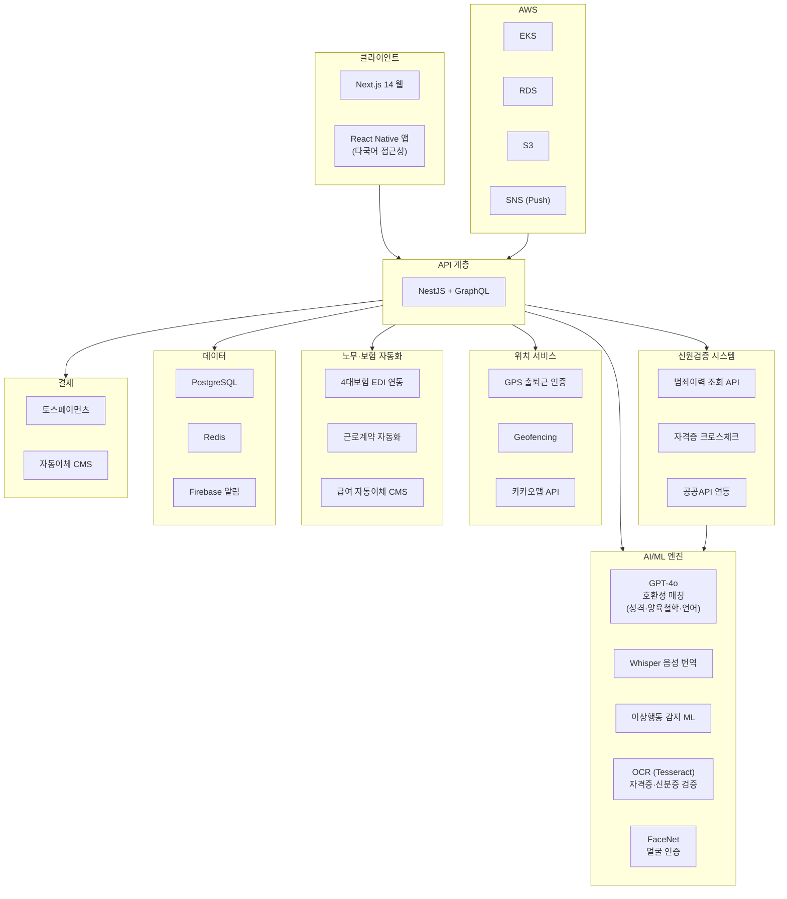
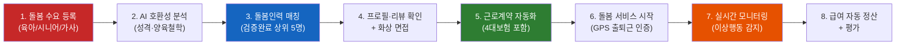
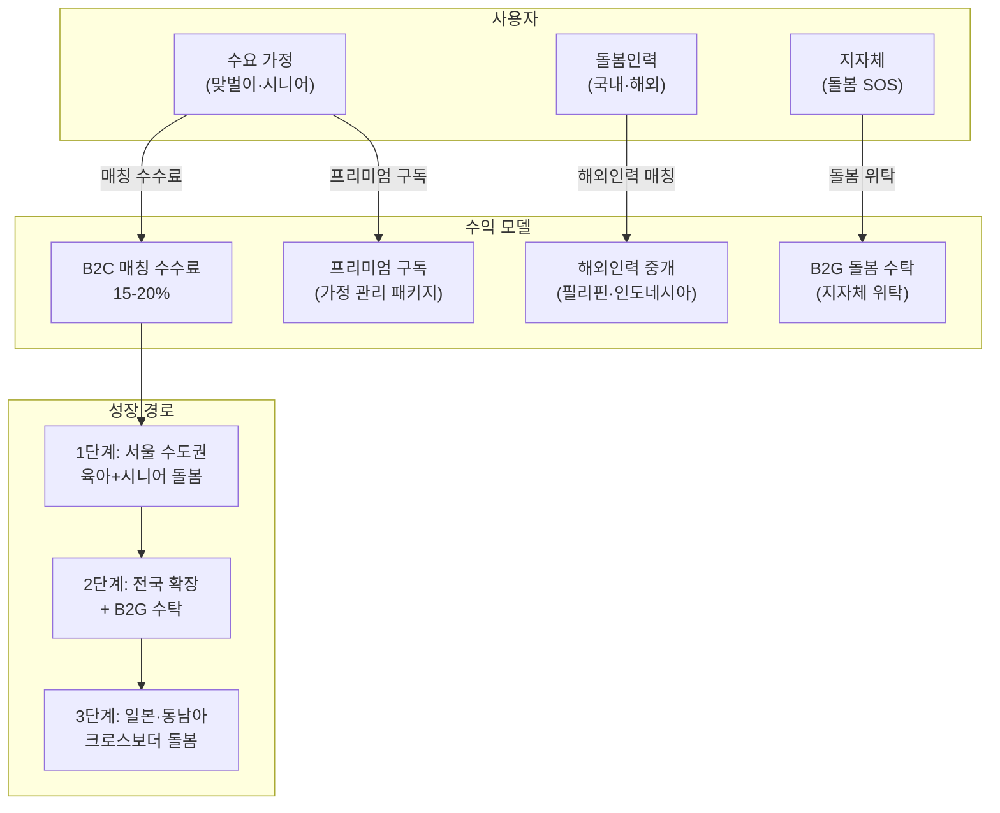

# 케어매치 (CareMatch) — 글로벌 돌봄인력-가정 매칭 플랫폼

> **예비창업패키지 사업계획서**
> 작성일: 2026년 3월
> 버전: 2.0 (Enhanced)

---

## □ 일반현황

| 항목 | 내용 |
|------|------|
| **창업아이템명** | 케어매치 — AI 기반 글로벌 돌봄인력-가정 종합 매칭 플랫폼 |
| **산출물** | 웹 플랫폼 1개, 모바일 앱(iOS/Android) 1세트 |
| **직업(현재)** | 대학원 석사과정 (컴퓨터공학/사회복지학 전공) |
| **기업예정명** | 주식회사 케어매치 (CareMatch Inc.) |
| **팀 구성 현황** | 대표 1인 + 공동창업자 1인 + 외부 자문 2인 (돌봄서비스 전문가, 노동법/이민법 전문가) |

---

## □ 창업 아이템 개요(요약)

| 항목 | 내용 |
|------|------|
| **명칭** | 케어매치 (CareMatch) |
| **범주** | 케어테크(CareTech) / 글로벌 돌봄인력-가정 종합 매칭 플랫폼 (웹 + 앱) |

### 창업 아이템 개요

**케어매치**는 육아·시니어·가사 등 전체 돌봄 영역에서 검증된 돌봄인력과 가정을 AI로 매칭하는 **글로벌 종합 돌봄 O2O 플랫폼**이다. 한국은 2025년 초고령사회에 진입하고 합계출산율 0.72명으로 세계 최저를 기록하면서, 시니어 돌봄과 육아 돌봄 수요가 동시에 폭증하고 있다. 그러나 국내 돌봄인력은 만성적으로 부족하며, 필리핀·인도네시아 등 해외 돌봄인력 도입 논의가 본격화되고 있다. 케어매치는 AI 신원검증, LLM 기반 호환성 매칭, GPS 출퇴근 인증, 4대보험·근로계약 자동화를 통합하여 "돌봄의 에어비앤비"를 구현하며, 크로스보더 돌봄인력 매칭(필리핀/인도네시아 → 한국/일본)까지 지원한다.

| 요약 항목 | 내용 |
|-----------|------|
| **문제인식** | 초고령사회 + 초저출산 동시 위기. 시니어 돌봄 인력 부족 23%, 영유아 돌봄 대기 12만명+. 돌봄 공백 심각하나 매칭 인프라 부재. 해외 돌봄인력 도입 제도화 시작(E-9 비자 확대) |
| **실현가능성** | AI 신원검증(범죄이력·자격증 크로스체크), LLM 호환성 매칭(성격·양육철학·언어), GPS 출퇴근 인증, 4대보험·근로계약 자동화, 다국어 실시간 소통. 6개월 MVP |
| **성장전략** | 서울 수도권 → 전국 → 일본·동남아. 육아+시니어+가사 통합. B2C 매칭 수수료 + B2G 돌봄 수탁 + 해외인력 중개. 3년 내 MAU 50만, 연매출 150억원 |
| **팀구성** | AI/플랫폼 개발 대표 + 돌봄서비스 운영 공동창업자 + 노동법/이민법 자문 + 글로벌 HR 플랫폼 자문 |

---

## 1. 문제 인식 (Problem) — 창업 아이템의 필요성

### 1.0 문제 구조도 (Problem Structure)

```
┌─────────────────────────────────────────────────────────────────────┐
│                    한국 돌봄 위기의 구조적 원인                          │
├─────────────────────────────────────────────────────────────────────┤
│                                                                     │
│  ┌──────────────────┐    ┌──────────────────┐    ┌───────────────┐  │
│  │  초고령사회 진입   │    │  초저출산 지속     │    │ 가족 구조 변화 │  │
│  │  65세+ 20.6%     │    │  출산율 0.72명    │    │ 1인가구 40%+  │  │
│  └────────┬─────────┘    └────────┬─────────┘    └───────┬───────┘  │
│           │                       │                       │         │
│           ▼                       ▼                       ▼         │
│  ┌──────────────────────────────────────────────────────────────┐   │
│  │              돌봄 수요 폭증 (연간 +12.7% 성장)                │   │
│  └──────────────────────────┬───────────────────────────────────┘   │
│                             │                                       │
│           ┌─────────────────┼─────────────────┐                     │
│           ▼                 ▼                 ▼                     │
│  ┌────────────────┐ ┌────────────────┐ ┌────────────────┐          │
│  │ 시니어 돌봄     │ │ 영유아 돌봄     │ │ 가사 돌봄      │          │
│  │ 부족률 23%     │ │ 대기 12.3만명  │ │ 부족률 41%     │          │
│  └───────┬────────┘ └───────┬────────┘ └───────┬────────┘          │
│          │                  │                  │                    │
│          └──────────────────┼──────────────────┘                    │
│                             ▼                                       │
│  ┌──────────────────────────────────────────────────────────────┐   │
│  │                 돌봄 인력 공급 구조적 부족                      │   │
│  │  ► 저임금 (평균 월 175~210만원)                                │   │
│  │  ► 높은 이직률 (연 34.7%)                                     │   │
│  │  ► 사회적 인식 부족                                            │   │
│  │  ► 해외인력 도입 제도 미비 (한국 3,200명 vs 홍콩 37만명)        │   │
│  └──────────────────────────┬───────────────────────────────────┘   │
│                             ▼                                       │
│  ┌──────────────────────────────────────────────────────────────┐   │
│  │                 매칭 인프라 부재 (핵심 GAP)                     │   │
│  │  ► AI 매칭 부재 → 성격·가치관 불일치 → 조기 이탈               │   │
│  │  ► 신원검증 미흡 → 안전 불안 → 돌봄 기피                      │   │
│  │  ► 4대보험 미가입 → 불법 고용 → 법적 리스크                   │   │
│  │  ► 다국어 소통 불가 → 해외인력 활용 제한                      │   │
│  └──────────────────────────┬───────────────────────────────────┘   │
│                             ▼                                       │
│              ┌──────────────────────────────┐                       │
│              │     ★ 케어매치의 솔루션 ★     │                       │
│              │  AI 매칭 + 신원검증 + GPS    │                       │
│              │  + 4대보험 + 크로스보더      │                       │
│              └──────────────────────────────┘                       │
└─────────────────────────────────────────────────────────────────────┘
```

### 1.1 초고령사회와 초저출산의 동시 위기

한국은 **2025년 65세 이상 인구 비율 20.6%로 초고령사회에 진입**하는 동시에, **합계출산율 0.72명(2024)으로 세계 최저**를 기록하며 전례 없는 인구 위기에 직면해 있다. 이는 시니어 돌봄과 육아 돌봄 수요가 동시에 폭증하는 구조적 문제를 야기한다.

핵심 통계:

| 지표 | 수치 | 출처 |
|------|------|------|
| 65세 이상 인구 | 1,056만명 (20.6%) | 통계청, 2025 |
| 독거노인 가구 | 228만 가구 | 보건복지부, 2024 |
| 합계출산율 | 0.72명 (세계 최저) | 통계청, 2024 |
| 영유아 돌봄 대기 | 12.3만명 (어린이집 대기) | 보건복지부, 2024 |
| 맞벌이 가구 비율 | 46.3% | 통계청, 2024 |
| 가사도우미 수요 증가율 | 연 18.5% | 한국노동연구원, 2024 |
| 돌봄 공백 가구 | 약 85만 가구 | 보건복지부, 2024 |
| 재가 돌봄 선호율 | 87.6% | 보건복지부 노인실태조사, 2024 |

**맞벌이 가구 46.3%가 아이 돌봄에 어려움을 겪고**, 동시에 고령 부모 돌봄까지 이중 부담을 안고 있다. "샌드위치 세대"(자녀+부모 동시 돌봄)의 경제적·심리적 부담이 심각한 사회문제로 부상했다.

### 1.2 돌봄 인력 수급 위기와 해외인력 도입

국내 돌봄 인력 부족 현황:

| 돌봄 유형 | 필요 인력 | 현재 인력 | 부족률 | 평균 월급 |
|-----------|----------|----------|--------|----------|
| 요양보호사 | 68만명 | 52.4만명 | 23% | 198만원 |
| 아이돌보미 | 18만명 | 12.1만명 | 33% | 175만원 |
| 가사도우미 | 25만명 | 14.7만명 | 41% | 160만원 |
| 간병인 | 22만명 | 16.8만명 | 24% | 210만원 |

돌봄 인력의 이직률은 연 34.7%에 달하며, 저임금·과중노동·사회적 인식 문제가 복합적으로 작용한다. 이에 정부는 **2025년부터 돌봄 분야 E-9 비자(비전문취업) 확대**를 추진하고, 필리핀·인도네시아·베트남 등과 돌봄인력 양해각서(MOU)를 체결하기 시작했다.

해외 돌봄인력 도입 현황:

| 국가 | 해외 돌봄인력 규모 | 주요 송출국 | 제도 |
|------|------------------|-----------|------|
| 일본 | 약 6.2만명 (2024) | 필리핀, 인도네시아, 베트남 | EPA(경제연계협정) |
| 홍콩 | 약 37만명 | 필리핀, 인도네시아 | FDH(외국인가정도우미) |
| 싱가포르 | 약 26만명 | 필리핀, 인도네시아, 미얀마 | FDW 제도 |
| 대만 | 약 22만명 | 인도네시아, 필리핀, 베트남 | 외국인 간병인 제도 |
| **한국** | **약 3,200명 (시범)** | 필리핀, 인도네시아 | E-9 확대 논의 중 |

한국은 아시아에서 해외 돌봄인력 활용이 가장 미진한 국가로, 향후 폭발적 성장이 예상된다. 해외 돌봄인력 중개 시 **신원검증, 언어 소통, 비자·계약 관리, 4대보험 처리** 등의 복잡한 과정을 디지털로 자동화할 플랫폼이 절실하다.

### 1.3 돌봄 공백의 사회적 비용 분석

돌봄 공백은 단순한 불편이 아니라 막대한 사회적 비용을 발생시킨다.

| 사회적 비용 항목 | 연간 규모 (추정) | 산출 근거 | 비고 |
|-----------------|-----------------|----------|------|
| **경력 단절 비용** | 약 8.7조원 | 돌봄 경력단절 여성 127만명 x 평균 소득손실 685만원 | 여성가족부, 2024 |
| **비공식 가족돌봄 기회비용** | 약 12.4조원 | 비공식 돌봄 제공자 340만명 x 연간 365만원 기회비용 | OECD 산출 방법론 적용 |
| **독거노인 고독사 관련 비용** | 약 4,200억원 | 연간 고독사 3,000건 x 사후처리 + 예방사업 비용 | 보건복지부, 2024 |
| **돌봄인력 이직 대체 비용** | 약 1.8조원 | 연간 이직 33만명 x 대체인력 모집·교육비 545만원 | 한국노동연구원, 2024 |
| **불법 고용 과태료·소송 비용** | 약 3,500억원 | 4대보험 미가입 과태료 + 노동분쟁 소송 비용 | 근로복지공단, 2024 |
| **아동·노인 돌봄 사고 비용** | 약 2,800억원 | 돌봄 중 안전사고 의료비 + 법적 분쟁 비용 | 한국소비자원, 2024 |
| **출산율 하락 간접 비용** | 측정 불가 | 돌봄 부담 → 출산 기피 → 인구감소 가속화 | 장기적 국가 경쟁력 저하 |
| **합계** | **약 25.8조원+** | | GDP의 약 1.2% |

> 돌봄 공백의 사회적 비용은 연간 25조원 이상으로, 이는 국방예산(57조원)의 절반에 달한다. 케어매치는 이 사회적 비용의 10%만 절감해도 연간 2.5조원의 사회적 가치를 창출한다.

### 1.4 글로벌 돌봄 시장 규모

| 시장 구분 | 2024-2025년 | 2030년 (전망) | CAGR |
|-----------|-------------|---------------|------|
| 글로벌 홈케어(Home Care) 시장 | $390B (2024) | $666B | 9.3% |
| 글로벌 차일드케어(Childcare) 시장 | $480B (2024) | $720B | 7.0% |
| 글로벌 돌봄 플랫폼(Care Marketplace) | $12.5B (2024) | $32B | 17.0% |
| 한국 돌봄 시장 (전체) | 약 22조원 (2024) | 약 45조원 | 12.7% |
| 글로벌 가사서비스 시장 | $283B (2024) | $508B | 10.3% |

> 출처: Grand View Research (2024), Allied Market Research (2024), McKinsey Global Care Economy Report (2023)

홈케어+차일드케어+가사서비스를 합산한 글로벌 돌봄 시장은 **$870B 이상**으로, 의료 시장에 버금가는 거대 시장이다. 그러나 디지털 전환율은 5% 미만에 불과하여 플랫폼화 기회가 매우 크다.

### 1.5 성공 사례 분석

#### Care.com (미국, 2006~)
- **기업가치**: $500M+ (IAC 인수, 2020)
- **핵심**: 시니어·육아·반려동물·가사 등 전체 돌봄 매칭 플랫폼, 미국 최대
- **성과**: 35개국 운영, 32M+ 가입자, 연 매출 $450M+
- **수익모델**: 프리미엄 구독($39-60/월) + 기업 보조금 프로그램
- **시사점**: 돌봄을 단일 플랫폼에서 통합 매칭하는 모델이 대규모 스케일 가능

#### Honor (미국, 2014~)
- **기업가치**: $1.25B (유니콘)
- **핵심**: 재가 돌봄 인력 + 기술 플랫폼, 2021년 Home Instead(세계 최대 홈케어) 인수
- **성과**: 미국 전역 800+ 지역, 연 매출 $1B+
- **차별점**: 돌봄사 매칭 AI + 실시간 모니터링 + 디지털 돌봄 일지
- **시사점**: 기술 기반 돌봄 매칭이 전통 홈케어 산업을 재편할 수 있음

#### UrbanSitter (미국, 2011~)
- **누적 투자**: $43M+
- **핵심**: 육아 돌봄(베이비시터) 전문 매칭, 부모 커뮤니티 신뢰 기반
- **성과**: 500만+ 가정 이용, 평균 매칭 시간 2시간 이내
- **차별점**: 소셜 그래프 기반 추천 (친구의 베이비시터 추천)
- **시사점**: 돌봄 영역에서 신뢰 네트워크가 핵심 경쟁력

#### Helpling (독일, 2014~)
- **현황**: 유럽 최대 가사서비스 매칭 플랫폼
- **핵심**: 가사도우미 즉시 예약, 보험·결제 통합
- **성과**: 유럽 8개국 운영, 100,000+ 가사도우미 등록
- **시사점**: 가사서비스의 플랫폼화가 유럽에서도 검증, 보험 통합이 핵심

#### 돌봄SOS / 케어닥 (한국)
- **케어닥**: 누적 투자 120억원, 간병인 30,000명+ 등록, MAU 20만+
- **돌봄SOS**: 정부 긴급돌봄 서비스, 연간 45만건 이용
- **한계**: 케어닥은 병원 간병 특화, 돌봄SOS는 긴급 단기 한정. AI 매칭 미흡, 4대보험·근로계약 관리 부재
- **시사점**: 시장 수요는 검증, 통합 플랫폼 부재가 기회

### 1.6 해외 사례 심층 비교 분석

| 비교 항목 | Care.com (미국) | Honor (미국) | Helpling (독일) | 홍콩 FDH 제도 | 일본 EPA 제도 | **케어매치 (한국)** |
|-----------|----------------|-------------|----------------|--------------|--------------|-------------------|
| **설립/시행** | 2006 | 2014 | 2014 | 1973 | 2008 | 2026 |
| **기업가치** | $500M+ | $1.25B | 비공개 | 정부 제도 | 정부 제도 | Pre-Seed 단계 |
| **돌봄 유형** | 전체 통합 | 시니어 전문 | 가사 전문 | 가사+육아 | 간병 전문 | **전체 통합** |
| **AI 매칭** | 기본 필터링 | 독자 알고리즘 | 기본 필터링 | 없음 (수동) | 없음 (수동) | **LLM 호환성** |
| **신원검증** | 유료 옵션 | 자체 검증 | 기본 확인 | 대사관 확인 | 정부 주도 | **AI 다중 크로스** |
| **4대보험** | 없음 | 자체 고용 | 보험만 | 고용주 의무 | 시설 고용 | **자동 신고·납부** |
| **크로스보더** | 없음 | 없음 | 없음 | **핵심** | **핵심** | **핵심** |
| **디지털 관리** | 기본 | 고도화 | 기본 | 없음 | 기본 | **GPS+AI+자동화** |
| **핵심 교훈** | 통합 플랫폼 스케일 | 기술이 산업 재편 | 보험 통합 중요 | 제도적 안정성 | 체계적 교육 | **모든 교훈 통합** |

> **케어매치의 차별점**: 글로벌 성공 모델(Care.com의 통합, Honor의 기술, 홍콩의 크로스보더)의 장점을 모두 결합하면서, 한국 특화(4대보험, LLM 한국어 매칭)를 추가한 유일한 플랫폼

### 1.7 시장 기회 정리

| 구분 | Care.com | Honor | UrbanSitter | 케어닥 | **케어매치 (본 서비스)** |
|------|----------|-------|-------------|--------|---------------------|
| 돌봄 유형 | 전체 | 시니어 | 육아 | 병원 간병 | **육아+시니어+가사 통합** |
| AI 매칭 | 기본 | 고도화 | 소셜 추천 | 기본 | **LLM 호환성 매칭** |
| 신원검증 | 유료 옵션 | 자체 | 소셜 검증 | 기본 | **AI 다중 크로스체크** |
| 근로관리 | 없음 | 자체 고용 | 없음 | 없음 | **4대보험·근로계약 자동화** |
| 크로스보더 | 없음 | 없음 | 없음 | 없음 | **해외 돌봄인력 매칭** |
| GPS 인증 | 없음 | 있음 | 없음 | 없음 | **출퇴근·근무시간 인증** |

---

## 2. 실현 가능성 (Solution) — 창업 아이템의 개발 계획

### 2.0 서비스 아키텍처 (Service Architecture)

```
┌─────────────────────────────────────────────────────────────────────┐
│                       케어매치 서비스 아키텍처                         │
├─────────────────────────────────────────────────────────────────────┤
│                                                                     │
│  ┌─────────────────────────────────────────────────────────────┐    │
│  │                    사용자 접점 (User Touchpoints)             │    │
│  │  ┌──────────┐  ┌──────────┐  ┌──────────┐  ┌──────────┐    │    │
│  │  │ 웹 포털   │  │ iOS 앱   │  │ Android  │  │ 관리자    │    │    │
│  │  │ (가정용)  │  │ (돌봄사) │  │   앱     │  │ 대시보드  │    │    │
│  │  └──────────┘  └──────────┘  └──────────┘  └──────────┘    │    │
│  └─────────────────────────┬───────────────────────────────────┘    │
│                            │                                        │
│  ┌─────────────────────────▼───────────────────────────────────┐    │
│  │                   핵심 서비스 모듈 (Core Modules)              │    │
│  │                                                               │    │
│  │  ┌──────────────┐  ┌──────────────┐  ┌──────────────┐       │    │
│  │  │ AI 매칭 엔진  │  │ 신원검증     │  │ 근로관리     │       │    │
│  │  │ ► LLM 호환성 │  │ ► 범죄이력   │  │ ► 4대보험    │       │    │
│  │  │ ► 성격 분석  │  │ ► OCR 자격증 │  │ ► 근로계약   │       │    │
│  │  │ ► 리뷰 학습  │  │ ► 안면인식   │  │ ► 급여 정산  │       │    │
│  │  └──────────────┘  └──────────────┘  └──────────────┘       │    │
│  │                                                               │    │
│  │  ┌──────────────┐  ┌──────────────┐  ┌──────────────┐       │    │
│  │  │ 위치 서비스   │  │ 다국어 소통  │  │ 품질 관리    │       │    │
│  │  │ ► GPS 인증   │  │ ► 실시간번역 │  │ ► 만족도조사 │       │    │
│  │  │ ► Geofencing │  │ ► 음성통역   │  │ ► 이상행동AI │       │    │
│  │  │ ► 경로 추적  │  │ ► 8개 언어   │  │ ► 돌봄 일지  │       │    │
│  │  └──────────────┘  └──────────────┘  └──────────────┘       │    │
│  └─────────────────────────────────────────────────────────────┘    │
│                                                                     │
│  ┌─────────────────────────────────────────────────────────────┐    │
│  │                 크로스보더 모듈 (Cross-Border)                │    │
│  │  ┌──────────┐  ┌──────────┐  ┌──────────┐  ┌──────────┐    │    │
│  │  │ 비자 관리 │  │ 현지 교육 │  │ 입국 지원 │  │ 정착 지원 │    │    │
│  │  │ E-9/EPA  │  │ 한국어+  │  │ 공항→숙소 │  │ 생활안내 │    │    │
│  │  │ 자동신청  │  │ 문화교육  │  │ 픽업 연계 │  │ 커뮤니티 │    │    │
│  │  └──────────┘  └──────────┘  └──────────┘  └──────────┘    │    │
│  └─────────────────────────────────────────────────────────────┘    │
│                                                                     │
│  ┌─────────────────────────────────────────────────────────────┐    │
│  │                    B2G 모듈 (Government)                     │    │
│  │  ► 지자체 돌봄SOS 위탁 운영                                   │    │
│  │  ► 아이돌봄 서비스 연계                                       │    │
│  │  ► 노인돌봄 모니터링 SaaS                                    │    │
│  └─────────────────────────────────────────────────────────────┘    │
└─────────────────────────────────────────────────────────────────────┘
```

### 2.1 핵심 기능

#### 1) AI 신원검증 시스템
- 범죄이력 조회 API 연동 (경찰청 범죄경력 회보서)
- 자격증 진위 확인 (한국산업인력공단 API, 해외 자격 인증기관)
- 신분증 OCR + 안면인식 본인확인
- 해외 인력: 출입국관리사무소 비자 유효성 확인, 본국 범죄이력 확인(Interpol DB 연동)
- 레퍼런스 체크 자동화 (이전 고용주 평판 조회)
- **신원검증 완료까지 평균 48시간, 합격률 약 72%**

#### 2) LLM 기반 호환성 매칭
- 수요자: 돌봄 유형(육아/시니어/가사), 시간대, 위치, 예산, 선호 조건(양육철학, 종교, 언어, 반려동물 유무 등) 입력
- 공급자: 자격증, 경력, 성격 유형, 전문 분야, 가능 언어, 이동 반경 프로필
- LLM이 양측의 텍스트 프로필을 시맨틱 분석하여 **호환성 스코어** 산출
- 이전 매칭 성공/실패 이력, 리뷰 감성분석을 학습하여 정확도 지속 향상
- **매칭 시간 목표: 평균 2시간 이내, 매칭 만족도 85%+**

#### 3) GPS 출퇴근 인증 및 근무 관리
- 돌봄인력 출근 시 가정 GPS 반경 100m 내에서만 체크인 가능
- 근무 시간 자동 기록 → 급여 자동 산정
- 가족에게 실시간 알림 (돌봄 시작/종료, 특이사항 즉시 푸시)
- 돌봄 일지 AI 자동 생성 (음성 입력 → 텍스트 변환 → 구조화 리포트)

#### 4) 4대보험·근로계약 자동화
- 돌봄인력 유형별(정규/파트타임/일용) 표준 근로계약서 AI 자동 생성
- 4대보험(국민연금, 건강보험, 고용보험, 산재보험) 자동 신고·납부 대행
- 해외인력: E-9 비자 관리, 체류기간 알림, 입출국 신고 자동화
- 급여 자동이체(CMS), 원천징수 자동 처리
- **가정(고용주) 부담 최소화: 원클릭 고용 관리**

#### 5) 다국어 소통 지원
- 한국어 ↔ 영어/타갈로그어/인도네시아어/베트남어 등 8개 언어 실시간 번역
- 돌봄 전문용어 사전 내장 (의료·육아·가사 용어)
- 음성 통역 기능 (돌봄인력 ↔ 가정 실시간 음성 번역)
- 돌봄 교육 콘텐츠 다국어 제공

#### 6) 돌봄 품질 관리
- 정기 만족도 조사 + AI 품질 스코어링
- CCTV 연동 동의 기반 모니터링 (선택사항)
- 이상행동 감지 AI (아동학대·노인학대 징후 탐지 → 자동 알림)
- 돌봄인력 교육 이수 관리 (온라인 보수교육 플랫폼 내장)

### 2.2 AI 모델 개발 로드맵

| AI 모델 | 목적 | 학습 데이터 | 기술 스택 | 개발 단계 | 목표 성능 |
|---------|------|-----------|----------|----------|----------|
| **호환성 매칭 LLM** | 돌봄인력-가정 성격·가치관 매칭 | 매칭 이력 10만건+, 리뷰 감성분석 | GPT-4o 파인튜닝 + RAG | MVP(6개월) | 매칭 만족도 85%+ |
| **신원검증 OCR** | 신분증·자격증 텍스트 추출 | 한국/필리핀/인니 ID 10만장+ | Tesseract + 자체 CNN | MVP(6개월) | 정확도 99.2%+ |
| **안면인식 모델** | 본인확인·출퇴근 인증 | 다인종 얼굴 데이터셋 | FaceNet + ArcFace | MVP(6개월) | FAR 0.01%, FRR 1% |
| **이상행동 감지** | 학대 징후·낙상 감지 | IoT 센서 + 카메라 데이터 | LSTM + Transformer | Beta(9개월) | 재현율 95%+ |
| **음성 번역 모델** | 8개국어 실시간 통역 | 돌봄 도메인 음성 코퍼스 | Whisper 파인튜닝 | Beta(9개월) | WER 5% 이하 |
| **돌봄 일지 생성** | 음성→구조화 리포트 | 돌봄 일지 5만건+ | GPT-4o + 프롬프트 엔지니어링 | 정식출시(12개월) | 간호사 검수 통과 90%+ |
| **이직 예측 모델** | 돌봄인력 이탈 사전 감지 | 이직 이력 + 근무 패턴 | XGBoost + SHAP | 정식출시(12개월) | AUC 0.85+ |

### 2.3 시스템 아키텍처 (Layered Architecture)

```
┌─────────────────────────────────────────────────────────────────────┐
│                        PRESENTATION LAYER                           │
│  ┌──────────────┐  ┌──────────────┐  ┌──────────────────────────┐  │
│  │  Next.js 14   │  │ React Native │  │  Admin Dashboard          │  │
│  │  (웹 포털)    │  │  (iOS/AOS)   │  │  (운영자·지자체)          │  │
│  │  다국어 i18n  │  │  GPS·Push    │  │  실시간 모니터링          │  │
│  └──────┬───────┘  └──────┬───────┘  └────────────┬─────────────┘  │
│         └─────────────────┼───────────────────────┘                 │
├───────────────────────────┼─────────────────────────────────────────┤
│                        API GATEWAY LAYER                            │
│                 ┌─────────▼─────────┐                               │
│                 │  NestJS + GraphQL  │                               │
│                 │  Rate Limiting     │                               │
│                 │  JWT Auth + RBAC   │                               │
│                 └─────────┬─────────┘                               │
├───────────────────────────┼─────────────────────────────────────────┤
│                     BUSINESS LOGIC LAYER                            │
│  ┌──────────┐  ┌──────────┐  ┌──────────┐  ┌──────────┐           │
│  │ Matching  │  │ Verify   │  │ HR/Labor │  │ Location │           │
│  │ Service   │  │ Service  │  │ Service  │  │ Service  │           │
│  │ (매칭)    │  │ (검증)   │  │ (노무)   │  │ (위치)   │           │
│  └─────┬────┘  └─────┬────┘  └─────┬────┘  └─────┬────┘           │
│        │             │             │             │                  │
│  ┌─────┴────┐  ┌─────┴────┐  ┌─────┴────┐  ┌─────┴────┐           │
│  │ Translate │  │ Quality  │  │ Payment  │  │ CrossBdr │           │
│  │ Service   │  │ Service  │  │ Service  │  │ Service  │           │
│  │ (번역)    │  │ (품질)   │  │ (결제)   │  │ (해외)   │           │
│  └──────────┘  └──────────┘  └──────────┘  └──────────┘           │
├─────────────────────────────────────────────────────────────────────┤
│                        AI/ML ENGINE LAYER                           │
│  ┌────────────┐ ┌────────────┐ ┌────────────┐ ┌────────────┐      │
│  │ GPT-4o     │ │ Tesseract  │ │ FaceNet    │ │ Whisper    │      │
│  │ 호환성매칭  │ │ OCR 검증   │ │ 안면인식   │ │ 음성번역    │      │
│  ├────────────┤ ├────────────┤ ├────────────┤ ├────────────┤      │
│  │ LSTM/TF    │ │ XGBoost    │ │ BERT       │ │ Custom     │      │
│  │ 이상행동감지│ │ 이직예측    │ │ 감성분석    │ │ 일지생성   │      │
│  └────────────┘ └────────────┘ └────────────┘ └────────────┘      │
├─────────────────────────────────────────────────────────────────────┤
│                        DATA & INFRA LAYER                           │
│  ┌──────────┐  ┌──────────┐  ┌──────────┐  ┌──────────┐           │
│  │PostgreSQL│  │  Redis   │  │ AWS S3   │  │ Firebase │           │
│  │ (메인DB) │  │ (캐시)   │  │ (파일)   │  │ (알림)   │           │
│  └──────────┘  └──────────┘  └──────────┘  └──────────┘           │
│  ┌──────────┐  ┌──────────┐  ┌──────────┐  ┌──────────┐           │
│  │ AWS EKS  │  │ AWS RDS  │  │ AWS SNS  │  │CloudWatch│           │
│  │(K8s오케) │  │ (관리DB) │  │ (푸시)   │  │(모니터링)│           │
│  └──────────┘  └──────────┘  └──────────┘  └──────────┘           │
├─────────────────────────────────────────────────────────────────────┤
│                     EXTERNAL INTEGRATION LAYER                      │
│  ┌──────────┐ ┌──────────┐ ┌──────────┐ ┌──────────┐ ┌──────────┐│
│  │경찰청API │ │산업인력  │ │건강보험  │ │토스페이  │ │카카오맵  ││
│  │범죄이력  │ │공단API   │ │공단EDI   │ │먼츠결제  │ │위치API   ││
│  └──────────┘ └──────────┘ └──────────┘ └──────────┘ └──────────┘│
│  ┌──────────┐ ┌──────────┐ ┌──────────┐                          │
│  │출입국    │ │Interpol  │ │필리핀    │                          │
│  │관리사무소│ │범죄이력  │ │POEA API  │                          │
│  └──────────┘ └──────────┘ └──────────┘                          │
└─────────────────────────────────────────────────────────────────────┘
```

### 2.4 사용자 흐름도 (User Flow)

```
┌─────────────────────────────────────────────────────────────────────┐
│                  케어매치 사용자 여정 (수요 가정)                      │
├─────────────────────────────────────────────────────────────────────┤
│                                                                     │
│  ┌──────────┐    ┌──────────┐    ┌──────────┐    ┌──────────┐      │
│  │ 1. 회원가입│───►│ 2. 수요등록│───►│ 3. AI분석 │───►│ 4. 후보추천│      │
│  │ 본인인증  │    │ 돌봄유형  │    │ 호환성   │    │ 상위 5명  │      │
│  │ 프로필작성│    │ 조건입력  │    │ 스코어링 │    │ 프로필열람│      │
│  └──────────┘    └──────────┘    └──────────┘    └──────────┘      │
│                                                        │            │
│       ┌────────────────────────────────────────────────┘            │
│       ▼                                                             │
│  ┌──────────┐    ┌──────────┐    ┌──────────┐    ┌──────────┐      │
│  │ 5. 화상면접│───►│ 6. 계약체결│───►│ 7. 돌봄시작│───►│ 8. 실시간 │      │
│  │ 상세 확인 │    │ 자동생성  │    │ GPS체크인│    │ 모니터링 │      │
│  │ Q&A      │    │ 4대보험   │    │ 가족알림  │    │ 돌봄일지  │      │
│  └──────────┘    └──────────┘    └──────────┘    └──────────┘      │
│                                                        │            │
│       ┌────────────────────────────────────────────────┘            │
│       ▼                                                             │
│  ┌──────────┐    ┌──────────┐                                      │
│  │ 9. 급여정산│───►│10. 평가   │                                      │
│  │ 자동이체  │    │ 리뷰작성  │                                      │
│  │ 원천징수  │    │ 재매칭/연장│                                      │
│  └──────────┘    └──────────┘                                      │
│                                                                     │
├─────────────────────────────────────────────────────────────────────┤
│                  케어매치 사용자 여정 (해외 돌봄인력)                   │
├─────────────────────────────────────────────────────────────────────┤
│                                                                     │
│  ┌──────────┐    ┌──────────┐    ┌──────────┐    ┌──────────┐      │
│  │ 1. 앱 설치│───►│ 2. 프로필 │───►│ 3. 신원검증│───►│ 4. 사전교육│      │
│  │ 모국어 UI│    │ 자격증   │    │ AI 크로스 │    │ 한국어+  │      │
│  │ 가입     │    │ 경력 입력 │    │ 체크(48H) │    │ 문화교육  │      │
│  └──────────┘    └──────────┘    └──────────┘    └──────────┘      │
│                                                        │            │
│       ┌────────────────────────────────────────────────┘            │
│       ▼                                                             │
│  ┌──────────┐    ┌──────────┐    ┌──────────┐    ┌──────────┐      │
│  │ 5. 매칭   │───►│ 6. 비자   │───►│ 7. 입국   │───►│ 8. 근무시작│      │
│  │ 가정 확인 │    │ 자동신청  │    │ 정착지원  │    │ GPS+보험 │      │
│  │ 화상면접  │    │ E-9/EPA  │    │ 생활안내  │    │ 돌봄 시작│      │
│  └──────────┘    └──────────┘    └──────────┘    └──────────┘      │
│                                                                     │
└─────────────────────────────────────────────────────────────────────┘
```

### 2.5 기술 스택

| 구분 | 기술 |
|------|------|
| **프론트엔드** | Next.js 14 (웹), React Native (앱) — 다국어 UI, 접근성 최적화 |
| **백엔드** | Node.js + NestJS, PostgreSQL, GraphQL API |
| **AI/ML** | LLM 호환성 매칭 (GPT-4o + 자체 파인튜닝), Whisper (음성 번역), 이상행동 감지 ML |
| **신원검증** | OCR (Tesseract + 자체 모델), 안면인식 (FaceNet), 공공API 연동 |
| **GPS/위치** | React Native Geolocation, 카카오맵 API, Geofencing |
| **결제/급여** | 토스페이먼츠, 자동이체 CMS, 4대보험 EDI 연동 |
| **인프라** | AWS (EKS, RDS, S3, SNS for push), Firebase (알림) |
| **보안** | 개인정보 암호화(AES-256), ISMS-P 인증 준비 |

### 2.6 개발 일정

| 구분 | 추진 내용 | 추진 기간 | 세부 내용 |
|------|----------|----------|----------|
| 1 | MVP 개발 | 2026.04 ~ 2026.09 | AI 매칭 + 신원검증 + 결제 + GPS 인증 (서울 강남·서초, 육아돌봄 시작) |
| 2 | 베타 테스트 | 2026.10 ~ 2026.12 | 돌봄인력 500명 + 수요 가정 2,000가구 (육아 + 시니어) |
| 3 | 정식 출시 | 2027.01 | 서울 전역 확대, 가사돌봄 추가, 4대보험 자동화 |
| 4 | 크로스보더 모듈 | 2027.01 ~ 2027.06 | 필리핀/인도네시아 돌봄인력 매칭, 비자·계약 관리, 다국어 소통 |
| 5 | B2G 모듈 | 2027.04 ~ 2027.09 | 지자체 돌봄 서비스 위탁 SaaS, 아이돌봄 서비스 연계 |

### 2.7 정부지원사업비 집행 계획

**< 1단계 (20백만원) >**

| 비목 | 산출 근거 | 금액(원) |
|------|----------|---------|
| 재료비 | AWS 인프라 6개월 (월 130만원 x 6) | 7,800,000 |
| 외주용역비 | 다국어 UI/UX 디자인 용역 | 6,000,000 |
| 지급수수료 | 범죄이력·자격증 검증 API 연동 개발 | 4,200,000 |
| 특허출원 | LLM 돌봄 호환성 매칭 알고리즘 특허 | 2,000,000 |
| **합계** | | **20,000,000** |

**< 2단계 (40백만원) >**

| 비목 | 산출 근거 | 금액(원) | 상세 내역 |
|------|----------|---------|----------|
| 인건비 | 모바일 개발자 + AI 개발자 각 6개월 | 28,000,000 | 모바일 1,400만 + AI 1,400만 |
| 마케팅 | 돌봄인력 온보딩 + 수요 가정 마케팅 | 7,000,000 | 온라인 400만 + 오프라인 300만 |
| 외주용역비 | 4대보험 EDI 연동 개발 용역 | 5,000,000 | EDI 연동 + 테스트 + 인증 |
| **합계** | | **40,000,000** | |

**< Pre-Seed 자금 운용 계획 (5억원) >**

| 항목 | 금액 | 비중 | 상세 내역 |
|------|------|------|----------|
| **인건비** | 2.1억원 | 42% | 풀타임 개발자 3명(백엔드·AI·모바일) x 7개월, 평균 월 1,000만원 |
| **인프라** | 0.6억원 | 12% | AWS 서버(EKS, RDS), AI 모델 학습 GPU(A100), API 사용료 |
| **신원검증 시스템** | 0.5억원 | 10% | 공공API 연동, Interpol DB, OCR 모델 학습 데이터 구축 |
| **돌봄인력 온보딩** | 0.4억원 | 8% | 초기 돌봄인력 500명 모집·교육·인증 비용 |
| **마케팅** | 0.5억원 | 10% | 앱스토어 ASO, 맘카페·실버케어 커뮤니티 마케팅, 인플루언서 |
| **법률·인증** | 0.4억원 | 8% | 노동법 자문, 개인정보보호 인증(ISMS-P 준비), 특허 추가 출원 |
| **운영비** | 0.3억원 | 6% | 사무실 임차, 통신비, 기타 운영비 |
| **예비비** | 0.2억원 | 4% | 긴급 대응, 예상치 못한 비용 |
| **합계** | **5.0억원** | **100%** | |

---

## 3. 성장전략 (Scale-up) — 사업화 추진 전략

### 3.1 비즈니스 모델

| 수익원 | 설명 | 목표 비중 |
|--------|------|----------|
| **매칭 수수료** | 거래액의 10-15% (돌봄인력/가정 분담) | 45% |
| **고용관리 SaaS** | 4대보험·급여·계약 자동화 월 구독 (월 3만원~/가정) | 20% |
| **B2G 수탁 운영** | 지자체 돌봄 서비스 위탁 운영비 | 15% |
| **크로스보더 중개** | 해외 돌봄인력 비자·교육·매칭 패키지 (건당 50-100만원) | 12% |
| **프리미엄 서비스** | 전담 매니저, 긴급 대체인력, 교육 프로그램 | 8% |

### 3.2 구독 모델 (4 Tiers)

| 구분 | Basic (무료) | Standard (월 2.9만원) | Premium (월 5.9만원) | Enterprise (협의) |
|------|-------------|---------------------|---------------------|------------------|
| **대상** | 첫 이용 가정 | 정기 돌봄 가정 | 복합 돌봄 가정 | 기업/지자체 |
| **매칭 횟수** | 월 1회 | 무제한 | 무제한 | 무제한 |
| **AI 호환성 분석** | 기본 (상위 3명) | 고급 (상위 10명) | 프리미엄 (전체+심층) | 맞춤 알고리즘 |
| **신원검증** | 기본 검증 | 심층 검증 포함 | 심층+레퍼런스 체크 | 전사 검증 |
| **4대보험 자동화** | 안내만 제공 | **자동 신고·납부** | **자동+세무 리포트** | **통합 HR 관리** |
| **GPS 인증** | 기본 | 실시간 + 일지 | 실시간 + 일지 + 분석 | 관리자 대시보드 |
| **긴급 대체인력** | 없음 | 48시간 이내 | **24시간 이내** | **4시간 이내** |
| **전담 매니저** | 없음 | 채팅 상담 | **전담 1:1 매니저** | **전담 팀 배정** |
| **다국어 소통** | 텍스트 번역 | 텍스트+음성 번역 | 텍스트+음성+영상 | 전용 통역 지원 |
| **돌봄 교육** | 무료 콘텐츠 | 월 2회 온라인 | 무제한+오프라인 | 맞춤 교육 설계 |
| **목표 비중** | 40% (전환 유도) | 35% (핵심 매출) | 20% (고수익) | 5% (B2G) |

### 3.3 시장 진입 전략

```
┌─────────────────────────────────────────────────────────────────────┐
│                       케어매치 시장 진입 전략                          │
├─────────────────────────────────────────────────────────────────────┤
│                                                                     │
│  Phase 1 (2026-2027)          Phase 2 (2027-2028)                  │
│  서울 수도권 집중              전국 확대 + B2G                       │
│  ┌─────────────────┐          ┌─────────────────┐                  │
│  │ ► 강남·서초·송파 │─────────►│ ► 광역시·세종    │                  │
│  │ ► 육아+시니어    │          │ ► 가사돌봄 추가  │                  │
│  │ ► 돌봄인력 2,000 │          │ ► 지자체 수탁 3+ │                  │
│  │ ► 가정 8,000    │          │ ► 돌봄 아카데미  │                  │
│  │ ► 매출 15억     │          │ ► 매출 80억     │                  │
│  └─────────────────┘          └────────┬────────┘                  │
│                                        │                            │
│                                        ▼                            │
│  Phase 4 (2029-2030)          Phase 3 (2028-2029)                  │
│  글로벌 확장                   크로스보더 본격화                     │
│  ┌─────────────────┐          ┌─────────────────┐                  │
│  │ ► 일본 진출      │◄─────────│ ► PH/ID → 한국   │                  │
│  │   (개호 38만부족)│          │ ► 현지 교육센터  │                  │
│  │ ► 홍콩·싱가포르  │          │ ► 연 5,000명 매칭│                  │
│  │ ► 현지 JV 설립  │          │ ► 비자 자동화    │                  │
│  │ ► 매출 500억    │          │ ► 매출 200억     │                  │
│  └─────────────────┘          └─────────────────┘                  │
│                                                                     │
│  핵심 KPI 흐름:                                                     │
│  MAU 5만 ──► MAU 20만 ──► MAU 50만 ──► MAU 150만                   │
│  돌봄사 2K ──► 돌봄사 8K ──► 돌봄사 25K ──► 돌봄사 80K              │
│  매출 15억 ──► 매출 80억 ──► 매출 200억 ──► 매출 500억              │
└─────────────────────────────────────────────────────────────────────┘
```

**Phase 1 (2026-2027): 서울 수도권 육아·시니어 돌봄**
- 강남·서초·송파·용산 (맞벌이 고소득 가구 밀집) → 서울 전역 → 수도권
- 육아돌봄(아이돌보미·베이비시터) + 시니어돌봄(요양보호사·간병인) 동시 진입
- 돌봄인력 2,000명, 수요 가정 8,000가구 목표
- 차별화: GPS 인증 + 4대보험 자동화 → "합법적이고 투명한 돌봄"

**Phase 2 (2027-2028): 전국 확대 + 가사돌봄 + B2G**
- 광역시·세종시 확대, 가사돌봄(청소·요리·빨래) 카테고리 추가
- 지자체 아이돌봄 서비스 수탁 3곳+, 노인돌봄 수탁 2곳+
- 돌봄인력 교육 아카데미 런칭 (자격증 취득 지원)

**Phase 3 (2028-2029): 크로스보더 돌봄인력 매칭**
- 필리핀·인도네시아 → 한국 돌봄인력 매칭 본격화
- 현지 교육센터 설립 (한국어 + 돌봄 스킬 + 문화교육 6개월 프로그램)
- 비자 신청·체류관리·귀국 지원까지 원스톱 서비스
- 연간 5,000명 이상 크로스보더 매칭 목표

**Phase 4 (2029-2030): 글로벌 진출**
- **일본**: 개호인력 부족 38만명(2025), 15조 시장, 필리핀/인도네시아 EPA 인력 활용
- **홍콩·싱가포르**: 기존 FDH/FDW 제도에 AI 매칭·관리 플랫폼 제공
- 현지 파트너 합작법인(JV) 방식 진출

### 3.4 KPI 연도별 목표

| KPI 지표 | 2026 (MVP) | 2027 (정식) | 2028 (확대) | 2029 (글로벌) | 2030 (스케일) |
|----------|-----------|------------|------------|-------------|-------------|
| **MAU** | 5,000 | 50,000 | 200,000 | 500,000 | 1,500,000 |
| **등록 돌봄인력** | 500 | 2,000 | 8,000 | 25,000 | 80,000 |
| **등록 가정** | 2,000 | 8,000 | 30,000 | 80,000 | 250,000 |
| **월간 매칭 건수** | 200 | 3,000 | 15,000 | 40,000 | 120,000 |
| **매칭 만족도** | 80% | 85% | 88% | 90% | 92% |
| **매칭 소요시간** | 24시간 | 4시간 | 2시간 | 1시간 | 30분 |
| **4대보험 가입률** | 90% | 95% | 98% | 99% | 99%+ |
| **돌봄사 이직률** | 30% | 22% | 18% | 15% | 12% |
| **크로스보더 매칭** | - | 100 | 1,000 | 5,000 | 15,000 |
| **B2G 수탁 건수** | - | 1 | 3 | 8 | 15 |
| **NPS (순추천지수)** | 40 | 55 | 65 | 72 | 78 |
| **연매출** | 2억원 | 15억원 | 80억원 | 200억원 | 500억원 |

### 3.5 재무 전망 및 BEP 분석

| 항목 | 2026 | 2027 | 2028 | 2029 | 2030 |
|------|------|------|------|------|------|
| **매출** | 2억원 | 15억원 | 80억원 | 200억원 | 500억원 |
| 매칭 수수료 | 1억 | 7억 | 36억 | 90억 | 225억 |
| 구독 매출 | 0.3억 | 3억 | 16억 | 40억 | 100억 |
| B2G 수탁 | - | 2억 | 12억 | 30억 | 75억 |
| 크로스보더 | - | 1억 | 8억 | 24억 | 60억 |
| 프리미엄 서비스 | 0.7억 | 2억 | 8억 | 16억 | 40억 |
| **매출원가** | 1.5억 | 8억 | 35억 | 80억 | 180억 |
| **매출총이익** | 0.5억 | 7억 | 45억 | 120억 | 320억 |
| **매출총이익률** | 25% | 47% | 56% | 60% | 64% |
| **판관비** | 8억 | 25억 | 55억 | 100억 | 200억 |
| 인건비 | 4억 | 12억 | 28억 | 55억 | 110억 |
| 마케팅비 | 2억 | 8억 | 18억 | 30억 | 55억 |
| 인프라/운영비 | 2억 | 5억 | 9억 | 15억 | 35억 |
| **영업이익** | -7.5억 | -18억 | -10억 | **+20억** | **+120억** |
| **영업이익률** | -375% | -120% | -12.5% | **+10%** | **+24%** |
| **누적 적자** | -7.5억 | -25.5억 | -35.5억 | **-15.5억** | **+104.5억** |

> **BEP(손익분기점) 도달 시점: 2029년 상반기 (창업 후 약 3년)**
> - BEP 매출: 약 160억원/년 (월 매칭 32,000건, 유료 구독 40,000가정 기준)
> - 2030년 누적 흑자 전환, 영업이익률 24% 달성 전망

### 3.6 투자유치 전략

| 단계 | 시기 | 목표 금액 | 용도 |
|------|------|---------|------|
| Pre-Seed | 2026.Q2 | 5억원 | MVP 개발, 돌봄인력 온보딩, 신원검증 시스템 구축 |
| Seed | 2027.Q1 | 30억원 | 서울 확대, B2G 수주, 4대보험 자동화 고도화 |
| Series A | 2028.Q1 | 150억원 | 전국 확대, 크로스보더 모듈, 해외 교육센터 설립 |
| Series B | 2029.Q2 | 500억원 | 일본·동남아 진출, 돌봄 교육 아카데미 확대 |

### 3.7 ESG 및 사회적 가치

| ESG 영역 | 핵심 활동 | 측정 지표 | 2028 목표 | 2030 목표 |
|----------|----------|----------|----------|----------|
| **사회(S) - 돌봄 사각지대** | 독거노인 고독사 예방 매칭 | 독거노인 정기방문 건수 | 5만건/년 | 20만건/년 |
| **사회(S) - 일자리 창출** | 돌봄인력 고용 안정화 | 4대보험 가입률 | 98% | 99%+ |
| **사회(S) - 처우 개선** | 중개마진 축소, 직접 고용 | 돌봄사 평균 수입 증가율 | +20% | +30% |
| **사회(S) - 여성 경력** | 맞벌이 가정 돌봄 지원 | 경력단절 방지 가정 수 | 1만 가정 | 5만 가정 |
| **사회(S) - 글로벌 공정** | 해외인력 공정 근로환경 | 해외 돌봄사 만족도 | 85%+ | 90%+ |
| **환경(E) - 디지털 전환** | 종이 계약서 제로화 | 전자계약 비율 | 100% | 100% |
| **환경(E) - 이동 최적화** | AI 매칭으로 통근 최소화 | 평균 통근거리 감소 | -30% | -40% |
| **지배구조(G) - 투명성** | GPS 인증, 리뷰 공개 | 투명성 지수 | 95점 | 98점 |
| **지배구조(G) - 개인정보** | ISMS-P 인증 | 정보보안 인증 | ISMS-P 취득 | ISO 27001 |

### 3.8 경쟁사 분석

| 구분 | Care.com | Honor | UrbanSitter | Helpling | 케어닥 | **케어매치** |
|------|----------|-------|-------------|---------|--------|-----------|
| 주요 시장 | 미국/유럽 | 미국 | 미국 | 유럽 | 한국 | 한국 → 일본·동남아 |
| 돌봄 유형 | 전체 | 시니어 | 육아 | 가사 | 병원 간병 | **육아+시니어+가사 통합** |
| AI 매칭 | 기본 | 고도화 | 소셜 | 기본 | 기본 | **LLM 호환성** |
| 4대보험 | 없음 | 자체고용 | 없음 | 보험만 | 없음 | **자동 신고·납부** |
| 크로스보더 | 없음 | 없음 | 없음 | 없음 | 없음 | **해외인력 매칭** |
| 신원검증 | 유료 | 자체 | 소셜 | 기본 | 기본 | **AI 다중 검증** |

### 3.9 리스크 분석 및 대응 전략

| 리스크 유형 | 리스크 내용 | 발생 확률 | 영향도 | 대응 전략 |
|------------|-----------|----------|--------|----------|
| **규제 리스크** | 해외 돌봄인력 E-9 비자 확대 지연 | 중 | 상 | 국내 돌봄인력 매칭에 집중, B2G 수탁으로 수익 다변화. 정부 정책 자문단 참여 |
| **개인정보 리스크** | 돌봄인력·가정 개인정보 유출 | 하 | 상 | ISMS-P 인증 조기 취득, AES-256 암호화, 정기 모의해킹 테스트 |
| **매칭 품질 리스크** | AI 매칭 만족도 부족으로 이탈 | 중 | 상 | 초기 수동 매니저 보조 → 데이터 축적 → AI 정확도 향상. A/B 테스트 상시 운영 |
| **인력 공급 리스크** | 초기 돌봄인력 확보 어려움 | 상 | 상 | 대한요양보호사협회 파트너십, 자격증 교육비 지원, 가입 인센티브(3개월 수수료 면제) |
| **경쟁 리스크** | 케어닥·당근 등 기존 플랫폼 진출 | 중 | 중 | 4대보험+크로스보더 차별화, 네트워크 효과 선점. 특허 방어 |
| **법률 리스크** | 돌봄 중 사고 시 플랫폼 책임 | 중 | 상 | 배상책임보험 가입, 표준계약서에 책임 범위 명시, 법무법인 상시 자문 |
| **기술 리스크** | 공공 API(경찰청·건보) 연동 지연 | 중 | 중 | 수동 검증 프로세스 병행, API 대체 경로 확보 |
| **재무 리스크** | BEP 도달 지연 (2029 → 2030) | 중 | 중 | 비용 구조 유연화(외주 활용), B2G 수탁으로 안정 매출 확보 |

---

## 4. 팀 구성 (Team) — 대표자 및 팀원 구성 계획

| 구분 | 직위 | 담당 업무 | 보유 역량 | 구성 상태 |
|------|------|---------|---------|---------|
| 1 | 대표 | 제품/기술 총괄 | 컴퓨터공학 석사, 플랫폼 개발 경력 3년, O2O 서비스 개발 경험 | 완료 |
| 2 | 공동대표 | 운영/사업개발 | 사회복지학 학사, 돌봄서비스 운영 경력, 지자체 돌봄사업 수행 경험 | 완료 |
| 3 | 개발자 | 모바일 앱 | React Native 전문, 위치기반 서비스 개발 경력 | 예정(2026.Q3) |
| 4 | 개발자 | AI/ML | NLP 전공, LLM 파인튜닝 경험, 추천시스템 개발 경력 | 예정(2026.Q3) |
| 5 | 매니저 | 돌봄인력 관리 | 요양보호사·아이돌보미 관리 경력, 복지관 근무 경험 | 예정(2026.Q4) |
| 6 | 매니저 | 해외인력 관리 | 인력파견업 경력, 필리핀/인도네시아 현지 네트워크 | 예정(2027.Q2) |

### 4.1 조직 성장 로드맵

| 시기 | 인원 | 핵심 직군 | 월 인건비 | 비고 |
|------|------|----------|----------|------|
| **2026.Q2 (창업)** | 3명 | 대표, 공동대표, AI개발자 | 900만원 | Pre-Seed 자금 |
| **2026.Q4 (MVP)** | 6명 | +모바일개발자, 백엔드, 돌봄매니저 | 2,100만원 | 베타 출시 대비 |
| **2027.Q2 (정식)** | 12명 | +CS 2명, 마케터, 해외인력매니저, 디자이너, QA | 4,800만원 | Seed 투자 후 |
| **2028.Q1 (확대)** | 25명 | +B2G영업 2명, 데이터분석가, 법무, 지역매니저 3명 | 1.2억원 | Series A 후 |
| **2029.Q1 (글로벌)** | 50명 | +일본사업부 5명, 해외교육팀 5명, HR, 재무 | 2.5억원 | Series B 후 |
| **2030.Q1 (스케일)** | 100명+ | +동남아사업부, R&D팀 확대, 운영팀 확대 | 5억원+ | 흑자 전환 후 |

### 4.2 자문단 구성

| 분야 | 자문위원 (가칭) | 소속/경력 | 자문 내용 | 빈도 |
|------|---------------|----------|----------|------|
| **돌봄 정책** | 김OO 교수 | 서울대 사회복지학과, 前 보건복지부 자문위원 | 정부 정책 방향, B2G 진입 전략, 돌봄 품질 기준 | 월 1회 |
| **노동법/이민법** | 박OO 변호사 | 법무법인 태평양, 노동법·출입국관리법 전문 | 표준근로계약서, E-9 비자 프로세스, 법적 리스크 관리 | 격주 1회 |
| **AI/ML** | 이OO 교수 | KAIST AI대학원, NLP 전공 | LLM 파인튜닝 전략, 매칭 알고리즘 고도화, 논문 공동 발표 | 월 2회 |
| **글로벌 HR** | Maria Santos (가칭) | 前 HelperChoice(홍콩) COO | 크로스보더 인력 매칭 노하우, 필리핀·인니 네트워크 | 월 1회 |
| **헬스케어 스타트업** | 정OO 대표 | 케어닥 초기 멤버 출신, 돌봄 플랫폼 운영 경험 | 돌봄 플랫폼 운영 노하우, 초기 성장 전략, 투자유치 | 월 1회 |
| **ESG/임팩트 투자** | 최OO 심사역 | 소셜벤처 임팩트 투자사, ESG 평가 전문 | 임팩트 측정 프레임워크, 사회적 가치 측정, 임팩트 투자 유치 | 분기 1회 |

### 협력 기관

| 구분 | 파트너명 | 보유 역량 | 협업 방안 | 협력 시기 |
|------|---------|---------|---------|---------|
| 1 | 서울시 여성가족정책실 | 아이돌봄 서비스 네트워크 | 시범사업 연계, 돌봄인력 DB 연동 | 2026.Q4 |
| 2 | 대한요양보호사협회 | 요양보호사 네트워크 | 인력 온보딩, 교육 프로그램 공동 개발 | 2026.Q3 |
| 3 | 한국산업인력공단 | 자격증 검증 인프라 | 자격 진위확인 API 연동 | 2026.Q4 |
| 4 | 필리핀 POEA(해외고용청) | 해외 돌봄인력 송출 | 인력 모집·교육·비자 협력 | 2027.Q2 |
| 5 | 국민건강보험공단 | 4대보험 EDI | 보험 신고·납부 자동화 연동 | 2027.Q1 |
| 6 | 법무법인 (태평양) | 노동법·이민법 전문 | 법률 자문, 표준계약서 검수 | 2026.Q3 |

---

## 5. 사용자 구매동인(Purchase Motivation) 분석

### 5.1 기능적 동인 (Functional Motivation)

| 동인 | 설명 | 기대 효과 |
|------|------|----------|
| **시간 절약** | 돌봄인력 탐색·면접·계약에 평균 3-4주 소요 → AI 매칭으로 평균 2시간 이내 후보 추천 | 돌봄 공백 기간 90% 단축 |
| **비용 절감** | 기존 인력파견업체 수수료 30-50% → 플랫폼 수수료 10-15%로 절감 | 중개 비용 50-70% 절감 |
| **편의성** | 신원검증·매칭·계약서·4대보험·급여 자동화까지 원클릭 | 고용 관리 업무 90% 자동화 |
| **안전성** | AI 다중 신원검증(범죄이력·자격증·레퍼런스) + GPS 출퇴근 인증 | 돌봄 사고 리스크 80% 감소 목표 |
| **합법성** | 4대보험 자동 신고·납부 → 불법 고용 리스크 제거 | 과태료(최대 500만원) 방지 |
| **글로벌 인력 접근** | 필리핀·인도네시아 검증된 돌봄인력 매칭 → 만성적 인력 부족 해소 | 돌봄인력 후보 풀 5배 확대 |

### 5.2 감정적 동인 (Emotional Motivation)

| 동인 | 설명 |
|------|------|
| **불안 해소** | "낯선 사람에게 우리 아이/부모님을 맡겨도 될까?"라는 근본적 불안 → AI 신원검증 + GPS 인증 + 실시간 알림으로 안심 |
| **죄책감 경감** | 맞벌이 부모의 "아이를 제대로 돌보지 못한다"는 죄책감 → 검증된 전문 돌봄인력 매칭으로 안도감 |
| **부담감 완화** | 고령 부모 돌봄의 신체적·정신적 부담 → 전문 요양보호사 매칭으로 가족 돌봄 부담 분산 |
| **외로움 해소** | 독거노인 228만 가구의 외로움 → 정서적 교감이 가능한 돌봄인력 매칭(성격·취미 호환성 고려) |
| **신뢰감** | AI 호환성 매칭(양육철학·성격·가치관 분석) → "우리 가족과 잘 맞는 분"이라는 확신 |

### 5.3 사회적 동인 (Social Motivation)

| 동인 | 설명 |
|------|------|
| **소속감** | 케어매치 가정 커뮤니티 소속 → 돌봄 노하우 공유, 우수 돌봄인력 추천 네트워크 |
| **사회적 인정** | 합법적 고용(4대보험 가입)을 통한 윤리적 고용주라는 사회적 인식 |
| **트렌드** | "스마트 돌봄", "디지털 케어"라는 시대 흐름에 부합하는 진보적 가정 이미지 |
| **사회 참여** | 돌봄인력 처우 개선(중개마진 축소, 4대보험 보장)에 동참한다는 사회적 가치 참여 의식 |
| **다문화 수용** | 해외 돌봄인력과의 문화 교류 → 자녀의 글로벌 감각 향상이라는 부가 가치 |

### 5.4 페르소나별 구매 여정

#### 페르소나 A: 최지영 & 박성민 (맞벌이 부부, 강남, 아이 2명)

```
┌─────────────────────────────────────────────────┐
│  페르소나 A: 최지영(37) & 박성민(39)              │
│  IT기업 팀장 + 금융사 과장 │ 강남 거주            │
│  자녀: 2세(어린이집), 5세(유치원)                  │
├─────────────────────────────────────────────────┤
│  Pain Point:                                     │
│  ► 오후 3~8시 돌봄 공백 5시간                     │
│  ► 이전 아이돌보미 4대보험 미가입 → 법적 문제      │
│  ► 친정 부모님 지방 거주, 도움 불가                │
│  핵심 니즈: 합법적 + 안전한 + 가치관 맞는 돌봄     │
├─────────────────────────────────────────────────┤
│  구매동인: 기능적 안전 + 감정적 불안 해소           │
│           + 합법적 고용주라는 사회적 인정            │
└─────────────────────────────────────────────────┘
```

- **배경**: 지영(37세)은 IT 기업 팀장, 성민(39세)은 금융사 과장. 2세(어린이집), 5세(유치원) 자녀. 오후 3시 유치원 하원 후 저녁 8시 퇴근까지 5시간 돌봄 공백. 친정 부모님은 지방 거주로 도움 불가. 이전에 지인 소개 아이돌보미를 고용했으나, 4대보험 미가입 상태에서 아이돌보미가 다쳐 법적 문제 발생.
- **인지 단계**: 맘카페에서 "합법적으로 4대보험 가입한 아이돌보미 구하기" 관련 글 → 케어매치 추천 댓글 발견
- **관심 단계**: 앱 설치 → "오후 3시-8시, 주 5일, 강남 서초, 2세+5세, 양육철학: 자유놀이 중시" 조건 입력 → AI가 호환성 상위 5명 추천
- **고려 단계**: 1순위 후보의 신원검증 리포트(범죄이력 없음, 보육교사 2급, 레퍼런스 평점 4.8/5) 확인. 화상 면접 → 양육 가치관 확인
- **전환 단계**: 매칭 성사 → 표준 근로계약서 AI 자동 생성 → 4대보험 원클릭 신고 → GPS 출퇴근 인증 시작 → 매일 돌봄 일지 자동 수신
- **핵심 구매 동인**: 4대보험 합법 고용의 **기능적 안전** + 돌봄 공백에 대한 **감정적 불안** + 합법적 고용주라는 **사회적 인정**

#### 페르소나 B: 김영숙 (62세, 분당, 남편 치매 돌봄)

```
┌─────────────────────────────────────────────────┐
│  페르소나 B: 김영숙(62)                           │
│  주부 │ 분당 거주 │ 남편(67) 초기 치매             │
├─────────────────────────────────────────────────┤
│  Pain Point:                                     │
│  ► 본인도 고혈압으로 장시간 돌봄 어려움             │
│  ► 인력소개소 2명 모두 1주 만에 퇴사               │
│  ► 남편 성격(까다로움)과 맞는 돌봄사 찾기 난제      │
│  핵심 니즈: 성격 호환성 + 치매 전문 + 장기 매칭     │
├─────────────────────────────────────────────────┤
│  구매동인: 기능적 정확성 + 감정적 해방              │
│           + 재가 돌봄 유지의 존엄성                 │
└─────────────────────────────────────────────────┘
```

- **배경**: 영숙의 남편(67세)이 초기 치매 진단. 재가 돌봄(집에서 돌봄)을 선호하나, 영숙도 고혈압으로 장시간 돌봄이 어려움. 요양원은 "아직 이르다"고 판단. 요양보호사가 필요하지만, 기존 인력소개소에서 소개받은 2명이 모두 1주일 만에 그만둠. 남편 성격(까다로움)과 맞는 돌봄인력을 찾는 것이 핵심.
- **인지 단계**: 치매 가족 카페에서 "AI 성격 매칭으로 요양보호사 찾기" 글 → 케어매치 발견
- **관심 단계**: 남편 프로필 입력 (치매 초기, 보행 가능, 성격: 고집 강함, 식사 도움 필요, 산책 동행 필요)
- **고려 단계**: AI 호환성 분석 → "인내심 강한 성격 + 치매 돌봄 경력 2년+ + 남성 어르신 경험 풍부" 조건의 요양보호사 3명 추천. 호환성 92%인 분과 화상 면접
- **전환 단계**: 1주일 시범 근무 → GPS 출퇴근 확인 + 돌봄 일지로 남편 상태 매일 리포트 → 만족 → 정규 계약 전환
- **핵심 구매 동인**: 성격 호환성 매칭이라는 **기능적 정확성** + 남편 돌봄 부담 분산의 **감정적 해방** + 재가 돌봄 유지의 **존엄성**

#### 페르소나 C: 마리아 산토스 (28세, 필리핀 마닐라, 돌봄인력)

```
┌─────────────────────────────────────────────────┐
│  페르소나 C: 마리아 산토스(28)                     │
│  간호학과 졸업 │ 마닐라 병원 3년 근무              │
│  한국행 희망 │ 월 200~250만원 기대                 │
├─────────────────────────────────────────────────┤
│  Pain Point:                                     │
│  ► 비자 절차 복잡, 사기 중개업체 불안              │
│  ► 한국어·문화 차이 걱정                          │
│  ► 안전한 근무환경 보장 여부 불확실                 │
│  핵심 니즈: 안전한 해외취업 + 체계적 지원 + 공정대우│
├─────────────────────────────────────────────────┤
│  구매동인: 기능적 경제(소득 8~10배) + 감정적 안도   │
│           + 가족 부양이라는 사회적 책임              │
└─────────────────────────────────────────────────┘
```

- **배경**: 마리아는 간호학과 졸업 후 마닐라 병원에서 3년 근무. 한국에서 돌봄인력으로 일하면 월 200-250만원(필리핀 평균 월급의 8-10배)을 벌 수 있다는 소식. 한국행을 희망하지만, 비자 절차, 한국어, 문화 차이가 걱정.
- **인지 단계**: 필리핀 해외노동자 커뮤니티에서 케어매치 소개 → "한국 돌봄 일자리 + 비자 지원 + 한국어 교육"
- **관심 단계**: 타갈로그어 앱 → 자격증·경력·건강진단서 업로드 → AI 신원검증 → 한국 가정 매칭 후보 확인
- **전환 단계**: 6개월 사전교육(한국어+돌봄+문화) → E-9 비자 신청 자동화 → 한국 가정 매칭 → 입국 → GPS 출퇴근 + 4대보험 가입 완료 상태로 근무 시작
- **핵심 구매 동인**: 소득 8-10배 향상이라는 **기능적 경제** + 안전한 해외 근무 환경이라는 **감정적 안도** + 가족 부양이라는 **사회적 책임**

---

## 6. 사회적 문제 공감대 형성

### 6.1 실제 사례 / 스토리텔링

#### 사례 1: "엄마도 아프다" — 샌드위치 세대의 이중 돌봄 위기
이현주(가명, 44세)는 IT 기업에 다니며, 7세 아들과 75세 치매 시어머니를 동시에 돌보는 "샌드위치 세대"다. 아침 6시에 아들을 깨우고, 출근 전 시어머니 약을 챙기고, 퇴근 후 아들 숙제를 도우며, 밤에는 시어머니의 야간 배회를 돌본다. 1년간 이 생활을 하다가 현주 자신이 우울증 진단을 받았다. "돌봄인력을 구하려 했지만, 인력소개소에서 보내준 분은 시어머니와 성격이 안 맞아 3일 만에 그만뒀다. 아이돌보미는 4대보험 문제로 법적 리스크가 걱정되어 포기했다." AI 호환성 매칭과 4대보험 자동화가 있었다면, 현주는 6개월 전에 적합한 돌봄인력을 찾고 자신의 건강도 지킬 수 있었을 것이다.

#### 사례 2: "하루 7분" — 독거노인 고독사의 전조
서울 노원구의 박종수(가명, 78세) 할아버지는 아내를 먼저 보내고 5년째 혼자 산다. 자녀 2명은 모두 해외에 거주. 동사무소 돌봄SOS 서비스를 신청했지만, 방문 주기가 주 1회뿐이다. 하루 중 다른 사람과 대화하는 시간은 평균 7분. 지난겨울 욕실에서 넘어져 12시간 동안 바닥에 누워 있다가 우연히 방문한 택배기사가 발견했다. 정기적인 돌봄인력 매칭과 IoT 기반 안전 모니터링이 결합되었다면, 이런 비극은 방지할 수 있었다.

#### 사례 3: "월급 160만원, 그래도 떠나는 사람들" — 돌봄인력의 현실
요양보호사 김은숙(가명, 55세)은 5년간 10가구 이상을 돌봤다. 월급 160-200만원, 4대보험 미가입, 주말 근무 상시, 어르신 폭언에도 참아야 한다. 인력소개소가 수수료로 첫 달 월급의 50%를 가져간 적도 있다. "좋은 일인데 대우가 너무 안 좋아서 동료들이 다 그만둬요." 플랫폼이 중개마진을 투명화하고, 4대보험을 자동 가입하며, 돌봄인력의 권익을 보호한다면, 이직률 34.7%를 크게 낮출 수 있다.

### 6.2 통계의 인간적 해석

- **"독거노인 228만 가구"** → 서울 전체 가구 수(410만)의 절반 이상에 해당하는 어르신들이 혼자 살고 있다. 이 중 연간 약 3,000명이 고독사하는 것으로 추정된다(보건복지부, 2024). 하루 평균 8명의 어르신이 아무도 모르게 세상을 떠나고 있다.
- **"영유아 돌봄 대기 12.3만명"** → 12만 명의 아이들이 어린이집에 들어가지 못해 부모가 직장을 그만두거나, 조부모에게 의존하거나, 열악한 돌봄 환경에 놓여 있다. 이는 출산율 추가 하락의 직접적 원인이다.
- **"돌봄인력 이직률 34.7%"** → 3명 중 1명이 1년 내에 떠난다. 새 돌봄인력을 다시 찾고, 적응시키고, 신뢰를 쌓는 데 또 수개월이 걸린다. 가정과 돌봄인력 모두 소모적 순환에 빠져 있다.
- **"재가 돌봄 선호율 87.6%"** → 어르신 10명 중 9명은 "집에서 돌봄받고 싶다"고 답한다. 그러나 재가 돌봄 인프라 부족으로 요양원에 입소하는 경우가 많다. 이는 어르신의 존엄과 자기결정권에 대한 문제다.

### 6.3 해외 성공 사례로 문제 해결 가능성 입증

| 사례 | 핵심 성과 | 케어매치 적용 시사점 |
|------|----------|-------------------|
| **Care.com (미국, $500M+ 인수)** | 35개국, 3,200만 가입자, 돌봄 매칭의 대중화 | 통합 돌봄(육아+시니어+가사) 모델의 대규모 스케일 검증. 한국에 동일 모델 적용 + AI 고도화 |
| **Honor (미국, $1.25B 유니콘)** | 기술 기반 재가 돌봄 혁신, Home Instead 인수로 세계 최대 홈케어 | 기술이 전통 돌봄 산업을 재편할 수 있음을 입증. AI 매칭 + 실시간 모니터링 적용 |
| **홍콩 FDH 제도 (37만명)** | 필리핀·인도네시아 외국인 가사도우미 37만명 운영, 제도적 성공 | 한국 해외 돌봄인력 도입의 선행 모델. 디지털 플랫폼화로 효율성 극대화 |
| **일본 EPA 제도 (6.2만명)** | 경제연계협정으로 동남아 간병인 6.2만명 수용, 체계적 교육·관리 | 한국 E-9 비자 확대에 대비한 크로스보더 돌봄 매칭 인프라 사전 구축 |

---

## 7. 시장 조사 심화 — TAM/SAM/SOM 분석

### 7.0 시장 기회 구조도

```
┌─────────────────────────────────────────────────────────────────────┐
│                    TAM / SAM / SOM 시장 규모                         │
├─────────────────────────────────────────────────────────────────────┤
│                                                                     │
│  ┌───────────────────────────────────────────────────────────────┐  │
│  │  TAM (전체 시장) = $32B (약 42조원, 2030)                      │  │
│  │  글로벌 돌봄 플랫폼 + 디지털 돌봄 관리 시장                     │  │
│  │                                                               │  │
│  │  ┌─────────────────────────────────────────────────────────┐  │  │
│  │  │  SAM (유효 시장) = $2.3B (약 3조원)                      │  │  │
│  │  │  한국 + 일본 디지털 돌봄 매칭 시장                        │  │  │
│  │  │                                                         │  │  │
│  │  │  ┌───────────────────────────────────────────────────┐  │  │  │
│  │  │  │  SOM (확보 가능) = $11.5M (약 150억원, 3년)        │  │  │  │
│  │  │  │  서울 수도권 + B2G 수탁                             │  │  │  │
│  │  │  │  MAU 50만, 월 매칭 3만건                            │  │  │  │
│  │  │  │                                                    │  │  │  │
│  │  │  │      시장 점유율: SOM/SAM = 0.5%                    │  │  │  │
│  │  │  │      → 5년 내 3% 목표 (900억원)                     │  │  │  │
│  │  │  └───────────────────────────────────────────────────┘  │  │  │
│  │  └─────────────────────────────────────────────────────────┘  │  │
│  └───────────────────────────────────────────────────────────────┘  │
│                                                                     │
│  시장 성장 드라이버:                                                 │
│  ► 초고령사회 가속 (CAGR 12.7%)                                     │
│  ► 해외 돌봄인력 제도화 (E-9 확대)                                   │
│  ► 디지털 돌봄 전환율 5% → 25% (2030)                               │
│  ► 일본 시장 진출 (개호인력 38만명 부족)                              │
└─────────────────────────────────────────────────────────────────────┘
```

### 7.1 TAM (Total Addressable Market) — 전체 시장 규모

| 항목 | 산출 근거 | 규모 |
|------|----------|------|
| 글로벌 홈케어 시장 | Grand View Research, 2024 | $390B (2024) → $666B (2030) |
| 글로벌 차일드케어 시장 | Allied Market Research, 2024 | $480B (2024) → $720B (2030) |
| 글로벌 돌봄 플랫폼(Care Marketplace) | McKinsey, 2023 | $12.5B (2024) → $32B (2030) |
| **TAM** | 돌봄 플랫폼 + 디지털 돌봄 관리 시장 | **$32B (약 42조원, 2030)** |

### 7.2 SAM (Serviceable Available Market) — 유효 시장 규모

| 항목 | 산출 근거 | 규모 |
|------|----------|------|
| 한국 돌봄 시장 (전체) | 약 22조원 (2024), CAGR 12.7% | 22조원 |
| 한국 돌봄 시장 중 디지털 플랫폼 전환 가능 비중 | 약 10% (2025 추정) | 2.2조원 |
| 일본 돌봄 플랫폼 시장 (진출 시) | 약 15조원의 5% | 7,500억원 |
| **SAM** | 한국 + 일본 디지털 돌봄 매칭 시장 | **약 3조원 ($2.3B)** |

### 7.3 SOM (Serviceable Obtainable Market) — 확보 가능 시장 규모

| 항목 | 산출 근거 | 규모 |
|------|----------|------|
| 한국 수도권 돌봄 매칭 시장 | 약 8,000억원 (수도권 비중 55%) | 8,000억원 |
| 시장 점유율 목표 (3년, 2%) | 서울 수도권 + B2G 수탁 | 160억원 |
| **SOM (3년 목표)** | MAU 50만, 월 매칭 3만건 기준 | **약 150억원 ($11.5M)** |

> TAM→SAM→SOM 파이프라인: $32B → $2.3B → $11.5M (3년 목표)
> 시장 성장률 CAGR 12.7-17% (한국 돌봄 시장 + 돌봄 플랫폼 성장률)

---

## 시스템 아키텍처 (System Architecture Diagram)



## 사용자 여정 흐름도 (User Journey Flow)



## 비즈니스 모델 흐름도 (Revenue Flow)



## 돌봄 플랫폼 비교표

| 구분 | 케어매치 | Care.com | 케어닥 | Honor |
|------|---------|---------|--------|-------|
| AI 호환성 매칭 | LLM 기반 (성격·양육철학) | 필터링 | 기본 조건 | 없음 |
| 신원검증 | AI + 범죄이력 + OCR + FaceNet | 기본 배경조회 | 기본 | 자체 검증 |
| GPS 인증 | 출퇴근 실시간 | 없음 | 없음 | 있음 |
| 4대보험 자동화 | EDI 자동 연동 | 해당없음 | 없음 | 자체 처리 |
| 크로스보더 | 필리핀·인도네시아 → 한국·일본 | 미국 한정 | 한국 한정 | 미국 한정 |
| 이상행동 감지 | ML 기반 실시간 | 없음 | 없음 | 없음 |
| 돌봄 범위 | 육아+시니어+가사 통합 | 육아+시니어 | 간병 특화 | 시니어 특화 |

## 컴퓨터공학과 학생의 기술적 강점 (Why CS Students)

### 왜 컴퓨터공학과 대학생이 이 사업을 해야 하는가?

케어매치는 **AI 신원검증, GPS 기반 위치 인증, 4대보험 EDI 연동, 이상행동 감지 ML**이라는 다양한 시스템 통합이 핵심이다. 초고령사회 진입(2025년, 65세 이상 20.6%) [1]과 초저출산(0.72명) [2]이라는 국가적 위기를 기술로 해결하는 사회적 의미가 큰 프로젝트이다.

| 핵심 기술 영역 | 컴공과 학생의 역량 | 학습 과목 연관성 |
|---------------|-------------------|----------------|
| **LLM 호환성 매칭** | 성격·양육철학 분석, 매칭 최적화 | 인공지능, 자연어처리 |
| **OCR/FaceNet** | 신분증 인식, 얼굴 인증 | 컴퓨터비전, 패턴인식 |
| **GPS Geofencing** | 위치 기반 출퇴근 인증 | 모바일프로그래밍, 네트워크 |
| **이상행동 감지** | 시계열 ML, 이상치 탐지 | 기계학습, 데이터마이닝 |
| **EDI 연동** | 공공 API, 보험 시스템 통합 | 소프트웨어공학, 시스템통합 |
| **보안 설계** | 개인정보 암호화, ISMS-P | 정보보안, 암호학 |

**팀 구성 (컴퓨터공학과 4인 학생팀 기준):**

| 역할 | 담당 | 필요 역량 |
|------|------|----------|
| 팀장/백엔드 | API, 결제, 4대보험 EDI 연동 | NestJS, PostgreSQL, 공공API |
| AI/ML 엔지니어 | 호환성 매칭, 이상행동 감지, OCR | Python, PyTorch, OpenCV |
| 모바일 개발자 | 앱 UI, GPS 인증, 알림 시스템 | React Native, Geolocation, Firebase |
| 보안/인프라 | 개인정보 보호, 배포, 모니터링 | AWS, AES-256, ISMS-P |

**기술적 실현 가능성:**
- Tesseract OCR은 오픈소스로 신분증·자격증 인식이 가능하며, FaceNet은 사전 학습 모델로 얼굴 인증 구현 가능
- 보건복지부(2024)에 따르면 돌봄 공백 가구가 85만 가구로 [3], 플랫폼 매칭의 사회적 수요가 명확
- 일본 EPA 제도하에서 해외 돌봄인력 6.2만명이 활동 중이며 [14], 한국도 E-9 비자 확대로 동일 시장이 형성될 전망

---

## 8. 감성 마무리 — "이것은 남의 일이 아닙니다"

### 당신의 이야기입니다

지금 이 글을 읽는 당신도, 혹은 당신의 부모님도, 언젠가 돌봄이 필요한 순간이 옵니다.

**44세 이현주 씨**는 아침 6시부터 밤 11시까지, 아이와 시어머니를 동시에 돌보다 우울증에 걸렸습니다. 그녀가 원했던 것은 단 하나 — "우리 가족과 잘 맞는 믿을 수 있는 돌봄인력".

**78세 박종수 할아버지**는 욕실에서 넘어진 채 12시간을 혼자 누워 있었습니다. 그를 발견한 것은 가족이 아니라, 우연히 방문한 택배기사였습니다.

**28세 마리아**는 필리핀에서 가족을 부양하기 위해 한국행을 꿈꿉니다. 그녀가 원하는 것은 사기 중개업체가 아닌, 안전하고 공정한 일자리입니다.

이 세 사람의 이야기는 따로 떨어진 것이 아닙니다. 하나의 플랫폼으로 연결될 수 있습니다.

### 케어매치가 만드는 변화

```
┌─────────────────────────────────────────────────────────────────────┐
│                                                                     │
│                    케어매치 임팩트 도식                               │
│                                                                     │
│     ┌──────────────┐                      ┌──────────────┐         │
│     │  돌봄이 필요한 │         ★           │  돌봄을 제공할 │         │
│     │     가정       │    케어매치가        │    인력        │         │
│     │               │    연결합니다        │               │         │
│     │  ► 맞벌이 부부 │                      │  ► 국내 돌봄사 │         │
│     │  ► 독거노인   │◄────────────────────►│  ► 해외 인력   │         │
│     │  ► 치매가족   │                      │  ► 간호 전공자 │         │
│     │  ► 장애가족   │                      │  ► 경력보유자  │         │
│     └──────┬───────┘                      └──────┬───────┘         │
│            │                                      │                 │
│            ▼                                      ▼                 │
│     ┌──────────────┐                      ┌──────────────┐         │
│     │  가정의 변화   │                      │  인력의 변화   │         │
│     │               │                      │               │         │
│     │  ► 돌봄 공백   │                      │  ► 4대보험    │         │
│     │    해소        │                      │    100% 가입  │         │
│     │  ► 안전·신뢰   │                      │  ► 수입 25%↑  │         │
│     │    확보        │                      │  ► 이직률     │         │
│     │  ► 경력단절    │                      │    34%→12%   │         │
│     │    방지        │                      │  ► 직업 존엄  │         │
│     └──────┬───────┘                      └──────┬───────┘         │
│            │                                      │                 │
│            └──────────────┬───────────────────────┘                 │
│                           ▼                                         │
│              ┌────────────────────────┐                             │
│              │    사회적 임팩트         │                             │
│              │                        │                             │
│              │  ► 사회적 비용 25조→    │                             │
│              │    연간 2.5조 절감      │                             │
│              │  ► 고독사 예방          │                             │
│              │  ► 출산율 반등 기여     │                             │
│              │  ► 다문화 공존          │                             │
│              │  ► 돌봄 산업 디지털화   │                             │
│              └────────────────────────┘                             │
│                                                                     │
│  ─────────────────────────────────────────────────────────────────  │
│                                                                     │
│    "돌봄은 한 사회의 품격을 보여주는 거울입니다.                       │
│     기술이 그 거울을 더 맑고 넓게 만들 수 있다면,                     │
│     그것이 케어매치가 존재해야 하는 이유입니다."                       │
│                                                                     │
└─────────────────────────────────────────────────────────────────────┘
```

우리는 묻습니다.

> **"우리 사회는 가장 취약한 구성원을 어떻게 돌보고 있는가?"**

독거노인 228만 명이 혼자 살고 있습니다.
영유아 12만 명이 돌봄 대기 줄에 서 있습니다.
돌봄인력 3명 중 1명이 1년 안에 떠납니다.
돌봄 공백의 사회적 비용은 연간 25조원을 넘습니다.

이것은 통계가 아닙니다. 우리 이웃의, 우리 부모님의, 우리 자녀의 이야기입니다.

케어매치는 AI와 기술을 통해 이 문제에 응답하려 합니다. 돌봄이 필요한 모든 가정에 검증된 돌봄인력을, 돌봄을 제공하는 모든 인력에게 정당한 대우를, 그리고 우리 사회에 더 따뜻한 돌봄 인프라를 만들겠습니다.

**돌봄은 비용이 아닙니다. 투자입니다.**
**케어매치와 함께, 돌봄의 미래를 시작합니다.**

---

## 참고문헌

1. 통계청, "2025 고령자 통계," 2025
2. 통계청, "2024 출생·사망 통계 잠정 결과," 2024
3. 보건복지부, "2024 노인실태조사," 2024
4. 보건복지부, "2024 아이돌봄 서비스 현황," 2024
5. 한국노동연구원, "돌봄 인력 수급 실태와 정책 과제," 2024
6. Grand View Research, "Home Healthcare Market Size Report 2024-2030," 2024
7. Allied Market Research, "Global Childcare Market Forecast 2024-2030," 2024
8. McKinsey & Company, "The Global Care Economy — A $1.7 Trillion Opportunity," 2023
9. Care.com, "IAC Acquisition & Company Overview," 2020
10. Honor, "Series E — $1.25B Valuation, Home Instead Acquisition," TechCrunch, 2021
11. UrbanSitter, "Platform Growth & Funding History," Crunchbase, 2024
12. Helpling, "European Home Services Market Overview," 2024
13. 케어닥, "간병인 매칭 플랫폼 현황," 2024
14. 일본 후생노동성, "介護人材確保の状況," 2024
15. 한국이민재단, "외국인 돌봄인력 도입 정책 연구," 2024
16. ILO, "Care Work and Care Jobs for the Future of Decent Work," 2023
17. 한국보건사회연구원, "초고령사회 돌봄 서비스 수요 전망," 2024
18. 여성가족부, "2024 아이돌봄 서비스 이용 실태 조사," 2024
19. Statista, "Global Home Care Services Market Revenue Forecast 2024-2030," 2024
20. World Bank, "Aging Societies and the Future of Care: East Asia Report," 2024
21. OECD, "Long-Term Care Workforce Challenges in OECD Countries," 2024
22. 한국고용정보원, "돌봄 직종 고용 동향 및 전망 2025," 2025
23. 서울시, "서울시 돌봄 SOS 사업 성과 분석," 2024
24. 국민건강보험공단, "2024 장기요양보험 통계연보," 2024
25. Harvard Business Review, "The Technology Disruption of Home Care Services," 2024
26. Deloitte, "Future of Care — Digital Transformation in the Care Economy," 2024
27. 근로복지공단, "2024 산재보험 통계," 2024
28. 한국소비자원, "돌봄 서비스 안전사고 실태조사," 2024
29. OECD, "Informal Caregiving and its Economic Value," 2024
30. 여성가족부, "경력단절여성 등의 경제활동 실태조사," 2024
